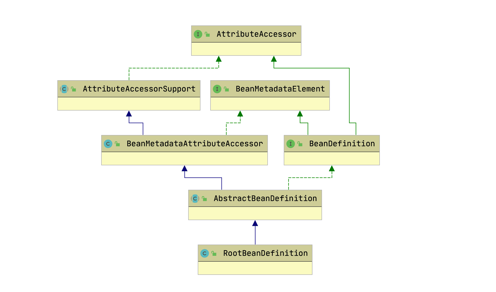
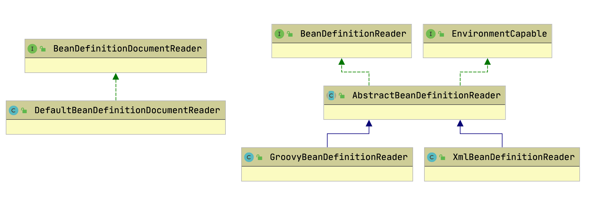
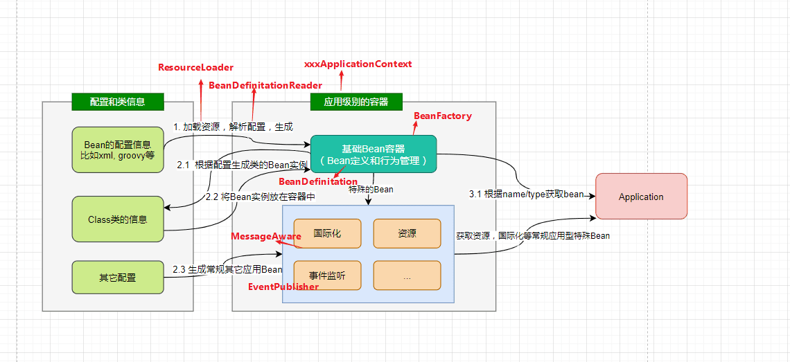

## 站在设计者的角度考虑设计IOC容器


IOC 容器包含的几个部分：
* 加载`Bean`的配置（比如`xml`配置）
* 根据`Bean`的定义加载生成`Bean`的实例，并放置在`Bean`容器中
* 除了基础`Bean`外，还有常规针对企业级业务的特别`Bean`。比如国际化`Message`，事件`Event`等生成特殊的类结构去支撑
* 对容器中的`Bean`提供统一的管理和调用

## IoC的体系结构设计
### BeanFactory和BeanRegistry：IOC容器功能规范和Bean的注册
`Spring Bean`的创建是典型的工厂模式，这一系列的`Bean`工厂，也即 IOC 容器为开发者管理对象间的依赖关系提供了很多便利和基础服务，在 Spring 中有许多的 IOC 容器的实现供用户选择和使用，这是IOC 容器的基础；在顶层的结构设计主要围绕着`BeanFactory`和`xxxRegistry`进行：
* `BeanFactory`：工厂模式定义了 IOC 容器的基本功能规范
* `BeanRegistry`：向 IOC 容器手工注册`BeanDefinition`对象的方法

其相互关系如下：


我们再通过几个问题来辅助理解。
### BeanFactory定义了 IOC 容器基本功能规范
`BeanFactory`作为最顶层的一个接口类，它定义了 IOC 容器的基本功能规范，`BeanFactory`有三个子类：`ListableBeanFactory、HierarchicalBeanFactory`和`AutowireCapableBeanFactory`。我们看下`BeanFactory`接口：
```java
public interface BeanFactory {    
    //用于取消引用实例并将其与FactoryBean创建的bean区分开来。
    // 例如，如果命名的bean是FactoryBean，则获取将返回Factory，而不是Factory返回的实例。
    String FACTORY_BEAN_PREFIX = "&"; 
        
    //根据bean的名字和Class类型等来得到bean实例    
    Object getBean(String name) throws BeansException;    
    Object getBean(String name, Class requiredType) throws BeansException;    
    Object getBean(String name, Object... args) throws BeansException;
    <T> T getBean(Class<T> requiredType) throws BeansException;
    <T> T getBean(Class<T> requiredType, Object... args) throws BeansException;

    //返回指定bean的Provider
    <T> ObjectProvider<T> getBeanProvider(Class<T> requiredType);
    <T> ObjectProvider<T> getBeanProvider(ResolvableType requiredType);

    //检查工厂中是否包含给定name的bean，或者外部注册的bean
    boolean containsBean(String name);

    //检查所给定name的bean是否为单例/原型
    boolean isSingleton(String name) throws NoSuchBeanDefinitionException;
    boolean isPrototype(String name) throws NoSuchBeanDefinitionException;

    //判断所给name的类型与type是否匹配
    boolean isTypeMatch(String name, ResolvableType typeToMatch) throws NoSuchBeanDefinitionException;
    boolean isTypeMatch(String name, Class<?> typeToMatch) throws NoSuchBeanDefinitionException;

    //获取给定name的bean的类型
    @Nullable
    Class<?> getType(String name) throws NoSuchBeanDefinitionException;

    //返回给定name的bean的别名
    String[] getAliases(String name);
}
```
### BeanFactory为何要定义这么多层次的接口？定义了哪些接口？
主要是为了区分在 Spring 内部在操作过程中对象的传递和转化过程中，对对象的数据访问所做的限制。

有哪些接口呢？
* `ListableBeanFactory`：该接口定义了访问容器中`Bean`基本信息的若干方法，如查看`Bean`的个数、获取某一类型`Bean`的配置名、查看容器中是否包括某一`Bean`等方法；
* `HierarchicalBeanFactory`：父子级联 IoC 容器的接口，子容器可以通过接口方法访问父容器；通过`HierarchicalBeanFactory`接口，Spring 的 IoC 容器可以建立父子层级关联的容器体系，子容器可以访问父容器中的`Bean`，但父容器不能访问子容器的`Bean`。Spring 使用父子容器实现了很多功能，比如在 Spring MVC 中，展现层`Bean`位于一个子容器中，而业务层和持久层的`Bean`位于父容器中。这样，展现层`Bean`就可以引用业务层和持久层的`Bean`，而业务层和持久层的`Bean`则看不到展现层的`Bean`。
* `ConfigurableBeanFactory`：是一个重要的接口，增强了 IoC 容器的可定制性，它定义了设置类装载器、属性编辑器、容器初始化后置处理器等方法；
* `ConfigurableListableBeanFactory`: `ListableBeanFactory`和`ConfigurableBeanFactory`的融合；
* `AutowireCapableBeanFactory`：定义了将容器中的`Bean`按某种规则（如按名字匹配、按类型匹配等）进行自动装配的方法；

### 如何将Bean注册到BeanFactory中？BeanRegistry
Spring 配置文件中每一个`<bean>`节点元素在 Spring 容器里都通过一个`BeanDefinition`对象表示，它描述了`Bean`的配置信息。而`BeanDefinitionRegistry`接口提供了向容器手工注册`BeanDefinition`对象的方法。
## BeanDefinition：各种Bean对象及其相互的关系
`Bean`对象存在依赖嵌套等关系，所以设计者设计了`BeanDefinition`，它用来对`Bean`对象及关系定义；我们在理解时只需要抓住如下三个要点：
* `BeanDefinition`定义了各种`Bean`对象及其相互的关系
* `BeanDefinitionReader`这是`BeanDefinition`的解析器
* `BeanDefinitionHolder`这是`BeanDefination`的包装类，用来存储`BeanDefinition`，`name`以及`aliases`等

### BeanDefinition
SpringIOC 容器管理了我们定义的各种`Bean`对象及其相互的关系，`Bean`对象在 Spring 实现中是以`BeanDefinition`来描述的，其继承体系如下：



### BeanDefinitionReader
`Bean`的解析过程非常复杂，功能被分的很细，因为这里需要被扩展的地方很多，必须保证有足够的灵活性，以应对可能的变化。`Bean`的解析主要就是对 Spring 配置文件的解析。这个解析过程主要通过下面的类完成：

```class
class BeanDefinitionDocumentReader {
	<<Interface>>
}
class DefaultBeanDefinitionDocumentReader {
}
DefaultBeanDefinitionDocumentReader ..|> BeanDefinitionDocumentReader
class BeanDefinitionReader {
	<<Interface>>
}
class EnvironmentCapable {
<<Interface>>
}
class AbstractBeanDefinitionReader {
}
class GroovyBeanDefinitionReader {
}
class XmlBeanDefinitionReader {
}
AbstractBeanDefinitionReader ..|> BeanDefinitionReader
AbstractBeanDefinitionReader ..|> EnvironmentCapable
GroovyBeanDefinitionReader --|> AbstractBeanDefinitionReader
XmlBeanDefinitionReader --|> AbstractBeanDefinitionReader
```


### BeanDefinitionHolder
`BeanDefinitionHolder`这是`BeanDefination`的包装类，用来存储`BeanDefinition`，`name`以及`aliases`等。


## ApplicationContext：IOC接口设计和实现
IoC 容器的接口类是`ApplicationContext`，很显然它必然继承`BeanFactory`对`Bean`规范（最基本的 ioc 容器的实现）进行定义。而`ApplicationContext`表示的是应用的上下文，除了对`Bean`的管理外，还至少应该包含了：
* 访问资源：对不同方式的`Bean`配置（即资源）进行加载。(实现`ResourcePatternResolver`接口)
* 国际化: 支持信息源，可以实现国际化。（实现`MessageSource`接口）
* 应用事件: 支持应用事件。(实现`ApplicationEventPublisher`接口)

### ApplicationContext接口的设计


* `HierarchicalBeanFactory`和`ListableBeanFactory`：`ApplicationContext`继承了`HierarchicalBeanFactory`和`ListableBeanFactory`接口，在此基础上，还通过多个其他的接口扩展了`BeanFactory`的功能：
* `ApplicationEventPublisher`：让容器拥有发布应用上下文事件的功能，包括容器启动事件、关闭事件等。实现了`ApplicationListener`事件监听接口的`Bean`可以接收到容器事件，并对事件进行响应处理 。 在`ApplicationContext`抽象实现类`AbstractApplicationContext`中，我们可以发现存在一个 `ApplicationEventMulticaster`，它负责保存所有监听器，以便在容器产生上下文事件时通知这些事件监听者。
* `MessageSource`：为应用提供 i18n 国际化消息访问的功能；
* `ResourcePatternResolver`：所有`ApplicationContext`实现类都实现了类似于`PathMatchingResourcePatternResolver`的功能，可以通过带前缀的`Ant`风格的资源文件路径装载 Spring 的配置文件。
* `LifeCycle`：该接口提供了`start()`和`stop()`两个方法，主要用于控制异步处理过程。在具体使用时，该接口同时被`ApplicationContext`实现及具体`Bean`实现，`ApplicationContext`会将`start/stop`的信息传递给容器中所有实现了该接口的`Bean`，以达到管理和控制 JMX、任务调度等目的。

### ApplicationContext接口的实现
在考虑`ApplicationContext`接口的实现时，关键的点在于，不同`Bean`的配置方式（比如`xml,groovy,annotation`等）有着不同的资源加载方式，这便衍生除了众多`ApplicationContext`的实现类。


第一，从类结构设计上看， 围绕着是否需要`Refresh`容器衍生出两个抽象类：
`GenericApplicationContext`： 是初始化的时候就创建容器，往后的每次`refresh`都不会更改
`AbstractRefreshableApplicationContext`：`AbstractRefreshableApplicationContext`及子类的每次`refresh`都是先清除已有(如果不存在就创建)的容器，然后再重新创建；`AbstractRefreshableApplicationContext`及子类无法做到`GenericApplicationContext`混合搭配从不同源头获取`bean`的定义信息

第二， 从加载的源来看（比如`xml,groovy,annotation`等）， 衍生出众多类型的`ApplicationContext`, 典型比如:
`FileSystemXmlApplicationContext`： 从文件系统下的一个或多个xml配置文件中加载上下文定义，也就是说系统盘符中加载xml配置文件。
`ClassPathXmlApplicationContext`： 从类路径下的一个或多个xml配置文件中加载上下文定义，适用于xml配置的方式。
`AnnotationConfigApplicationContext`： 从一个或多个基于java的配置类中加载上下文定义，适用于java注解的方式。
`ConfigurableApplicationContext`： 扩展于`ApplicationContext`，它新增加了两个主要的方法： refresh()和 close()，让 `ApplicationContext`具有启动、刷新和关闭应用上下文的能力。在应用上下文关闭的情况下调用 refresh()即可启动应用上下文，在已经启动的状态下，调用`refresh()`则清除缓存并重新装载配置信息，而调用`close()`则可关闭应用上下文。这些接口方法为容器的控制管理带来了便利，但作为开发者，我们并不需要过多关心这些方法。

第三， 更进一步理解：设计者在设计时`AnnotationConfigApplicationContext`为什么是继承`GenericApplicationContext`？因为基于注解的配置，是不太会被运行时修改的，这意味着不需要进行动态`Bean`配置和刷新容器，所以只需要`GenericApplicationContext`。

而基于XML这种配置文件，这种文件是容易修改的，需要动态性刷新`Bean`的支持，所以 XML 相关的配置必然继承`AbstractRefreshableApplicationContext`； 且存在多种`xml`的加载方式（位置不同的设计），所以必然会设计出`AbstractXmlApplicationContext`, 其中包含对XML配置解析成`BeanDefination`的过程。

我们把之前的设计要点和设计结构结合起来看：


