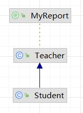
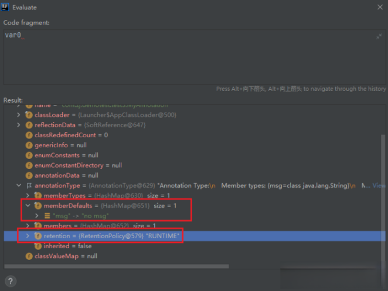
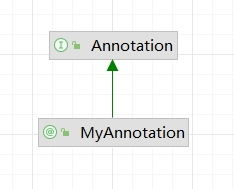

## 注解基础
注解用于对代码进行说明，可以对包、类、接口、字段、方法参数、局部变量等进行注解。它主要的作用有以下四方面：
* 生成文档，通过代码里标识的元数据生成`javadoc`文档。
* 编译检查，通过代码里标识的元数据让编译器在编译期间进行检查验证。
* 编译时动态处理，编译时通过代码里标识的元数据动态处理，例如动态生成代码。
* 运行时动态处理，运行时通过代码里标识的元数据动态处理，例如使用反射注入实例。

注解的常见分类：
* Java 自带的标准注解：
  * `@Override`：让编译器检查该方法是否正确地实现了覆写
  * `@Deprecated`：标记过时的元素，这个我们经常在日常开发中经常碰到
	* `@SuppressWarnings`：告诉编译器忽略此处代码产生的警告
	* `@SafeVarargs`
	* `@FunctionalInterface`：用来指定某个接口必须是函数式接口
* 元注解，元注解是用于定义注解的注解，包括：
	* `@Retention`用于标明注解被保留的阶段
	* `@Target`用于标明注解使用的范围
	* `@Inherited`用于标明注解可继承
	* `@Documented`用于标明是否生成`javadoc`文档
	* `@Repeatable`用来申明注解，表示这个声明的注解是可重复的
	* `@Native`注解不常使用
* 自定义注解，可以根据自己的需求定义注解，并可用元注解对自定义注解进行注解

无论是哪一种注解，本质上都是一种接口类型。到 Java8 为止 Java 提供了 11 个内置注解。其中有 5 个是基本注解，它们来自于`java.lang`包。有 6 个是元注解，它们来自于`java.lang.annotation`包
### Java内置注解
```java
class A{
    public void test() {
        
    }
}

class B extends A {

    /**
		* 重载父类的test方法
		*/
    @Override
    public void test() {
    }

    /**
		* 被弃用的方法
		*/
    @Deprecated
    public void oldMethod() {
    }

    /**
		* 忽略告警
		* 
		* @return
		*/
    @SuppressWarnings("rawtypes")
    public List processList() {
        List list = new ArrayList();
        return list;
    }
}
```
Java 自带的标准注解，包括：
* `@Override`：表示当前的方法定义将覆盖父类中的方法
* `@Deprecated`：表示代码被弃用，如果使用了被`@Deprecated`注解的代码则编译器将发出警告
* `@SuppressWarnings`：表示关闭编译器警告信息

我们再具体看下这几个内置注解，同时通过这几个内置注解中的元注解的定义来引出元注解。
#### 内置注解 - @Override
这个注解的定义：
```java
@Target(ElementType.METHOD)
@Retention(RetentionPolicy.SOURCE)
public @interface Override {
}
```
从它的定义我们可以看到，这个注解可以被用来修饰方法，并且它只在编译时有效，在编译后的`class`文件中便不再存在。这个注解的作用是告诉编译器被修饰的方法是重写的父类的中的相同签名的方法，编译器会对此做出检查，若发现父类中不存在这个方法或是存在的方法签名不同，则会报错。

Java9 为`@Deprecated`注解增加了两个属性：
* `forRemoval`：该`boolean`类型的属性指定该 API 在将来是否会被删除
* `since`：该`String`类型的属性指定该 API 从哪个版本被标记为过时

```java
class Test {
  // since属性指定从哪个版本开始被标记成过时，forRemoval指定该API将来会被删除
  @Deprecated(since = "9", forRemoval = true)
  public void print() {
    System.out.println("hello！");
  }
}
public class DeprecatedTest {
  public static void main(String[] args) {
    // 下面使用info()方法时将会被编译器警告
    new Test().print();
  }
}
```
上面程序使用了`Test`的`print()`方法，而`Test`类中定义`print()`方法时使用了`@Deprecated`修饰，表明该方法已过时，所以将会引起编译器警告。
#### 内置注解 - @Deprecated
这个注解的定义：
```java
@Documented
@Retention(RetentionPolicy.RUNTIME)
@Target(value={CONSTRUCTOR, FIELD, LOCAL_VARIABLE, METHOD, PACKAGE, PARAMETER, TYPE})
public @interface Deprecated {
}
```
从它的定义我们可以知道，它会被文档化，能够保留到运行时，能够修饰构造方法、属性、局部变量、方法、包、参数、类型。这个注解的作用是告诉编译器被修饰的程序元素已被“废弃”，不再建议用户使用。
#### 内置注解 - @SuppressWarnings
这个注解的定义：
```java
@Target({TYPE, FIELD, METHOD, PARAMETER, CONSTRUCTOR, LOCAL_VARIABLE})
@Retention(RetentionPolicy.SOURCE)
public @interface SuppressWarnings {
    String[] value();
}
```
它能够修饰的程序元素包括类型、属性、方法、参数、构造器、局部变量，只能存活在源码时，取值为`String[]`。它的作用是告诉编译器忽略指定的警告信息，它可以取的值如下：

|            参数            | 作用                                      | 原描述                                                                 |
|:------------------------:|:----------------------------------------|---------------------------------------------------------------------|
|           all            | 抑制所有警告                                  | to suppress all warnings                                            |
|          boxing          | 抑制装箱、拆箱操作时候的警告                          | to suppress warnings relative to boxing/unboxing operations         |
|           cast           | 抑制映射相关的警告                               | to suppress warnings relative to cast operations                    |
|         dep-ann          | 抑制启用注释的警告                               | to suppress warnings relative to deprecated annotation              |
|       deprecation        | 抑制过期方法警告                                | to suppress warnings relative to deprecation                        |
|       fallthrough        | 抑制确在switch中缺失breaks的警告                  | to suppress warnings relative to missing breaks in switch statements |
|         finally          | 抑制finally模块没有返回的警告                      | to suppress warnings relative to finally block that don’t return    |
|          hiding          | 抑制与隐藏变数的区域变数相关的警告                       | to suppress warnings relative to locals that hide variable()        |
|    incomplete-switch     | 忽略没有完整的switch语句                         | to suppress warnings relative to missing entries in a switch statement (enum case) |
|           nls            | 忽略非nls格式的字符                             | to suppress warnings relative to non-nls string literals                   |
|           null           | 忽略对null的操作                              | to suppress warnings relative to null analysis                             |
|         rawtype          | 使用generics时忽略没有指定相应的类型                  | to suppress warnings relative to un-specific types when using              |
|       restriction        | 抑制与使用不建议或禁止参照相关的警告                      | to suppress warnings relative to usage of discouraged or                   |
|  serial                  | 忽略在serializable类中没有声明serialVersionUID变量 | to suppress warnings relative to missing serialVersionUID field for a serializable class|
|      static-access       | 抑制不正确的静态访问方式警告                          | to suppress warnings relative to incorrect static access                   |
|     synthetic-access     | 抑制子类没有按最优方法访问内部类的警告                     | to suppress warnings relative to unoptimized access from inner classes     |
|        unchecked         | 抑制没有进行类型检查操作的警告                         | to suppress warnings relative to unchecked operations                      |
| unqualified-field-access | 抑制没有权限访问的域的警告                           | to suppress warnings relative to field access unqualified                  |
|          unused          | 抑制没被使用过的代码的警告                           | to suppress warnings relative to unused code           |

```java
public class HelloWorld {
  @SuppressWarnings({ "deprecation" })
  public static void main(String[] args) {
    Person p = new Person();
    p.setNameAndAge("zhangsan", 20);
    p.name = "lisi";
  }
}
```
### 内置注解 - @SafeVarargs
```java
public class HelloWorld {
  public static void main(String[] args) {
    // 传递可变参数，参数是泛型集合
    display(10, 20, 30);
    // 传递可变参数，参数是非泛型集合
    display("10", 20, 30); // 会有编译警告
  }
  public static <T> void display(T... array) {
    for (T arg : array) {
      System.out.println(arg.getClass().getName() + ":" + arg);
    }
  }
}
```
代码第 8 行声明了一种可变参数方法`display`，`display`方法参数个数可以变化，它可以接受不确定数量的相同类型的参数。可以通过在参数类型名后面加入...的方式来表示这是可变参数。可变参数方法中的参数类型相同，为此声明参数是需要指定泛型。

但是调用可变参数方法时，应该提供相同类型的参数，代码第 4 行调用时没有警告，而代码第 6 行调用时则会发生警告，这个警告是`unchecked`（未检查不安全代码），就是因为将非泛型变量赋值给泛型变量所发生的。

可用`@SafeVarargs`注解抑制编译器警告。
```java
public class HelloWorld {
  public static void main(String[] args) {
    // 传递可变参数，参数是泛型集合
    display(10, 20, 30);
    // 传递可变参数，参数是非泛型集合
    display("10", 20, 30); // 没有@SafeVarargs会有编译警告
  }
  @SafeVarargs
  public static <T> void display(T... array) {
    for (T arg : array) {
      System.out.println(arg.getClass().getName() + "：" + arg);
    }
  }
}
```
上述代码在可变参数`display`前添加了`@SafeVarargs`注解，当然也可以使用`@SuppressWarnings("unchecked")`注解，但是两者相比较来说`@SafeVarargs`注解更适合。

注意：`@SafeVarargs`注解不适用于非`static`或非`final`声明的方法，对于未声明为`static`或`final`的方法，如果要抑制`unchecked`警告，可以使用`@SuppressWarnings`注解。
### 内置注解 - @FunctionalInterface
如果接口中只有一个抽象方法（可以包含多个默认方法或多个`static`方法），那么该接口就是函数式接口。`@FunctionalInterface`就是用来指定某个接口必须是函数式接口，所以`@FunInterface`只能修饰接口，不能修饰其它程序元素。

函数式接口就是为 Java8 的`Lambda`表达式准备的，Java8 允许使用`Lambda`表达式创建函数式接口的实例，因此 Java8 专门增加了`@FunctionalInterface`。
```java
@FunctionalInterface
public interface FunInterface {
  static void print() {
    System.out.println("zhangsaan");
  }
  default void show() {
    System.out.println("lisi");
  }
  void test(); // 只定义一个抽象方法
}
```
编译上面程序，可能丝毫看不出程序中的`@FunctionalInterface`有何作用，因为`@FunctionalInterface`注解的作用只是告诉编译器检查这个接口，保证该接口只能包含一个抽象方法，否则就会编译出错。如果在上面的`FunInterface`接口中再增加一个抽象方法`abc()`，编译程序时将出现如下错误提示：
`“@FunctionInterface”批注无效；FunInterface不是functional接口`。

### 元注解
元注解：`@Target，@Retention，@Documented，@Inherited，@Repeatable`和`@Native`。这些注解都可以在`java.lang.annotation`包中找到。

元注解也是 Java 自带的标准注解，只不过用于修饰注解，比较特殊。
#### 元注解 - @Target
`@Target`指定了注解可以修饰哪些地方。

`Target`注解用来说明那些被它所注解的注解类可修饰的对象范围：注解可以用于修饰`packages、types`（类、接口、枚举、注解类）、类成员（方法、构造方法、成员变量、枚举值）、方法参数和本地变量（如循环变量、`catch`参数），在定义注解类时使用了`@Target`能够更加清晰的知道它能够被用来修饰哪些对象，它的取值范围定义在`ElementType`枚举中。
```java
public enum ElementType {
    TYPE, // 给类、接口、枚举类进行注解
    FIELD, // 给属性进行注解
    METHOD, // 给方法进行注解
    PARAMETER, // 给一个方法内的参数进行注解
    CONSTRUCTOR, // 给构造方法进行注解
    LOCAL_VARIABLE, // 给局部变量进行注解
    ANNOTATION_TYPE, // 给一个注解进行注解
    PACKAGE, // 给包进行注解
    TYPE_PARAMETER, // 类型参数，JDK 1.8 新增
    TYPE_USE // 使用类型的任何地方，JDK 1.8 新增
}
```
`ElementType.TYPE_USE`(此类型包括类型声明和类型参数声明，是为了方便设计者进行类型检查)，包含了`ElementType.TYPE`(类、接口（包括注解类型）和枚举的声明)和`ElementType.TYPE_PARAMETER`(类型参数声明)。
```java
// 自定义ElementType.TYPE_PARAMETER注解
@Retention(RetentionPolicy.RUNTIME)
@Target(ElementType.TYPE_PARAMETER)
public @interface MyNotEmpty {
}

// 自定义ElementType.TYPE_USE注解
@Retention(RetentionPolicy.RUNTIME)
@Target(ElementType.TYPE_USE)
public @interface MyNotNull {
}

// 测试类
public class TypeParameterAndTypeUseAnnotation<@MyNotEmpty T>{

  //使用TYPE_PARAMETER类型，会编译不通过
//		public @MyNotEmpty T test(@MyNotEmpty T a){
//			new ArrayList<@MyNotEmpty String>();
//				return a;
//		}

  //使用TYPE_USE类型，编译通过
  public @MyNotNull T test2(@MyNotNull T a){
    new ArrayList<@MyNotNull String>();
    return a;
  }
}
```
#### 元注解 - @Retention & @RetentionTarget
注解的保留策略，`@Retention`定义了`Annotation`的生命周期。当`@Retention`应用到一个注解上的时候，它解释说明了这个注解的的存活时间。

`Reteniton`注解用来限定那些被它所注解的注解类在注解到其他类上以后，可被保留到何时，一共有三种策略，定义在`RetentionPolicy`枚举中。
```java
public enum RetentionPolicy {
    SOURCE,  // 注解只在源码阶段保留，在编译器进行编译时它将被丢掉
    CLASS,   // 注解只被保留到编译进行的时候，它并不会被加载到 JVM 中，默认值
    RUNTIME  // 注解可以保留到程序运行中的时候，它会被加载进 JVM 中，在程序运行中也可以获取到它们
}
```

生命周期大小排序为`SOURCE < CLASS < RUNTIME`，前者能使用的地方后者一定也能使用。如果需要在运行时去动态获取注解信息，那只能用`RUNTIME`注解；如果要在编译时进行一些预处理操作，比如生成一些辅助代码，就用`CLASS`注解；如果只是做一些检查性的操作，比如`@Override`和`@SuppressWarnings`，则可用`SOURCE`注解。

如果`@Retention`不存在，则该`Annotation`默认为`RetentionPolicy.CLASS`。
```java
@Retention(RetentionPolicy.RUNTIME)
public @interface TestAnnotation { 
}
```
我们自定义的`TestAnnotation`可以在程序运行中被获取到。
#### 元注解 - @Documented
`Documented`注解的作用是：描述在使用`javadoc`工具为类生成帮助文档时是否要保留其注解信息。

一般不怎么用到，了解即可。

以下代码在使用`Javadoc`工具可以生成`@TestDocAnnotation`注解信息。
```java
import java.lang.annotation.Documented;
import java.lang.annotation.ElementType;
import java.lang.annotation.Target;
 
@Documented
@Target({ElementType.TYPE,ElementType.METHOD})
public @interface TestDocAnnotation {
 
	public String value() default "default";
}
@TestDocAnnotation("myMethodDoc")
public void testDoc() {

}
```
#### 元注解 - @Inherited
`Inherited`注解的作用：被它修饰的`Annotation`将具有继承性。如果某个类使用了被`@Inherited`修饰的`Annotation`，则其子类将自动具有该注解。

`@Inherited`修饰一个类时，表明它的注解可以被其子类继承，缺省情况默认是不继承的。

换句话说：如果一个子类想获取到父类上的注解信息，那么必须在父类上使用的注解上面加上`@Inherit`关键字。

:::warning
* `@Inherited`仅针对`@Target(ElementType.TYPE)`类型的`annotation`有效
* `@Inherited`不是表明 注解可以继承，而是子类可以继承父类的注解
:::
我们来测试下这个注解：

定义一个注解：
```java
@Inherited
@Target(ElementType.TYPE)
public @interface MyReport {
    String name() default "";
    int value() default 0;
}
```
使用这个注解
```java
@MyReport(value=1)
public class Teacher {
}
```
则它的子类默认继承了该注解：
```java
public class Student extends Teacher {
}
```
idea 查看类的继承关系：


#### 元注解 - @Repeatable(Java8)
使用`@Repeatable`这个元注解来申明注解，表示这个声明的注解是可重复的。

比如：一个人他既会下棋又会做饭,他还会唱歌。
```java
@Repeatable(MyReport.class)
@Target(ElementType.TYPE)
public @interface MyReport {
    String name() default "";
    int value() default 0;
}

@MyReport(value=0)
@MyReport(value=1)
@MyReport(value=2)
public class Man {
}
```
#### 元注解 - @Native(Java8)
使用`@Native`注解修饰成员变量，则表示这个变量可以被本地代码引用，常常被代码生成工具使用。`@Native`注解不常使用，了解即可。
### 注解与反射接口
定义注解后，如何获取注解中的内容呢？反射包`java.lang.reflect`下的`AnnotatedElement`接口提供这些方法。

这里注意：只有注解被定义为`RUNTIME`后，该注解才能是运行时可见，当`class`文件被装载时被保存在`class`文件中的`Annotation`才会被虚拟机读取。`AnnotatedElement`接口是所有程序元素（`Class、Method`和`Constructor`）的父接口，所以程序通过反射获取了某个类的`AnnotatedElement`对象之后，程序就可以调用该对象的方法来访问`Annotation`信息。

我们看下具体的先关接口`boolean isAnnotationPresent(Class<?extends Annotation> annotationClass)`判断该程序元素上是否包含指定类型的注解，存在则返回`true`，否则返回`false`。注意：此方法会忽略注解对应的注解容器。`<T extends Annotation> T getAnnotation(Class<T> annotationClass)`返回该程序元素上存在的、指定类型的注解，如果该类型注解不存在，则返回`null`。`Annotation[] getAnnotations()`返回该程序元素上存在的所有注解，若没有注解，返回长度为0的数组。`<T extends Annotation> T[] getAnnotationsByType(Class<T> annotationClass)`返回该程序元素上存在的、指定类型的注解数组。没有注解对应类型的注解时，返回长度为0的数组。该方法的调用者可以随意修改返回的数组，而不会对其他调用者返回的数组产生任何影响。`getAnnotationsByType`方法与`getAnnotation`的区别在于，`getAnnotationsByType`会检测注解对应的重复注解容器。若程序元素为类，当前类上找不到注解，且该注解为可继承的，则会去父类上检测对应的注解。`<T extends Annotation> T getDeclaredAnnotation(Class<T> annotationClass)`返回直接存在于此元素上的所有注解。与此接口中的其他方法不同，该方法将忽略继承的注释。如果没有注释直接存在于此元素上，则返回`null<T extends Annotation> T[] getDeclaredAnnotationsByType(Class<T> annotationClass)`返回直接存在于此元素上的所有注解。与此接口中的其他方法不同，该方法将忽略继承的注释`Annotation[] getDeclaredAnnotations()`返回直接存在于此元素上的所有注解及注解对应的重复注解容器。与此接口中的其他方法不同，该方法将忽略继承的注解。如果没有注释直接存在于此元素上，则返回长度为零的一个数组。该方法的调用者可以随意修改返回的数组，而不会对其他调用者返回的数组产生任何影响。
### 自定义注解
我们可以根据自己的需求定义注解，一般分为以下几步：

1. 新建注解文件，`@interface`定义注解
```java
public @interface MyReport { } 
```
2. 添加参数、默认值
```java
public @interface MyReport {
		String title() default "";
    String description() default "";
} 
```
3. 用元注解配置注解
```java
@Retention(RetentionPolicy.RUNTIME)
@Target(ElementType.TYPE)
public @interface MyReport {
		String title() default "";
		String description() default "";
} 
```
4. 使用注解
```java
public class TestAnnotation {

    @Override
    @MyReport(title = "toStringMethod", description = "override toString method")
    public String toString() {
        return "Override toString method";
    }

    @Deprecated
    @MyReport(title = "old static method", description = "deprecated old static method")
    public static void oldMethod() {
        System.out.println("old method, don't use it.");
    }

    @SuppressWarnings({"unchecked", "deprecation"})
    @MyReport(title = "test method", description = "suppress warning static method")
    public static void genericsTest() throws FileNotFoundException {
        List l = new ArrayList();
        l.add("abc");
        oldMethod();
    }
}
```

#### 自定义注解的读取
读取注解，需要用到java的反射。

我们先来写一个简单的示例--反射获取注解：

1. 定义一个注解：`MyAnnotation.java`
```java
@Retention(RetentionPolicy.RUNTIME)//确保程序运行中，能够读取到该注解！！！
public @interface MyAnnotation {
    String msg() default "no msg";
}
```
2. 用`@MyAnnotation`来修饰`Person`类的类名、属性、和方法
```java
@MyAnnotation(msg = "this person class")//注解 修饰类
public class Person {

    private String name;//姓名
    private String sex;//性别

    @MyAnnotation(msg = "this person field public")//注解 修饰 public属性
    public int height;//身高

    @MyAnnotation(msg = "this person field private")//注解 修饰 private属性
    private int weight;//体重


    public void sleep(){
        System.out.println(this.name+"--"+ "睡觉");
    }
    public void eat(){
        System.out.println("吃饭");
    }

    @MyAnnotation(msg = "this person method")//注解 修饰方法
    public void dance(){
        System.out.println("跳舞");
    }
} 
```
3. 测试类
```java
public class TestAn {
    public static void main(String[] args) throws NoSuchFieldException, NoSuchMethodException {

        //获取Person class 实例
        Class<Person> c1 = Person.class;

        //反射获取 类上的注解
        MyAnnotation classAnnotation = c1.getAnnotation(MyAnnotation.class);
        System.out.println(classAnnotation.msg());

        //反射获取 private属性上的注解
        Field we = c1.getDeclaredField("weight");
        MyAnnotation fieldAnnotation = we.getAnnotation(MyAnnotation.class);
        System.out.println(fieldAnnotation.msg());

        //反射获取 public属性上的注解
        Field he = c1.getDeclaredField("height");
        MyAnnotation field2Annotation = he.getAnnotation(MyAnnotation.class);
        System.out.println(field2Annotation.msg());

        //反射获取 方法上的注解
        Method me = c1.getMethod("dance",null);
        MyAnnotation methodAnnotation = me.getAnnotation(MyAnnotation.class);
        System.out.println(methodAnnotation.msg());
        

    }
} 
```
结果：
```text
this person class
this person field private
this person field public
this person method
```
我们通过反射读取 api 时，一般会先去校验这个注解存不存在：
```java
if(c1.isAnnotationPresent(MyAnnotation.class)) {
    //存在 MyAnnotation 注解
}else {
    //不存在 MyAnnotation 注解
}
```
我们发现反射真的很强大，不仅可以读取类的属性、方法、构造器等信息，还可以读取类的注解相关信息。那反射是如何实现工作的？

我们来看下源码:

从`c1.getAnnotation(MyAnnotation.class);`通过 idea 点进去查看源码，把重点的给贴出来，其他的就省略了
```java
Map<Class<? extends Annotation>, Annotation> declaredAnnotations =
            AnnotationParser.parseAnnotations(getRawAnnotations(), getConstantPool(), this);
```
`parseAnnotations()`去分析注解，其第一个参数是获取原始注解，第二个参数是获取常量池内容
```java
public static Annotation annotationForMap(final Class<? extends Annotation> var0, final Map<String, Object> var1) {
        return (Annotation)AccessController.doPrivileged(new PrivilegedAction<Annotation>() {
            public Annotation run() {
                return (Annotation)Proxy.newProxyInstance(var0.getClassLoader(), new Class[]{var0}, new AnnotationInvocationHandler(var0, var1));
            }
        });
    }
```
`Proxy._newProxyInstance_(var0.getClassLoader(), new Class[]{var0}, new AnnotationInvocationHandler(var0, var1)`创建动态代理，此处`var0`参数是由常量池获取的数据转换而来。
我们监听此处的`var0`:



可以推断出注解相关的信息是存放在常量池中的。

我们来总结一下，反射调用`getAnnotations(MyAnnotation.class)`方法的背后主要操作：解析注解`parseAnnotations()`的时候从该注解类的常量池中取出注解相关的信息，将其转换格式后，通过`newProxyInstance`（注解的类加载器，注解的`class`实例，`AnotationInvocationHandler`实例）来创建代理对象，作为参数传进去，最后返回一个代理实例。

关于动态代理类我们只需先知道：对象的执行方法，交给代理来负责
```java
class AnnotationInvocationHandler implements InvocationHandler, Serializable {
    ...
    private final Map<String, Object> memberValues;//存放该注解所有属性的值
    private transient volatile Method[] memberMethods = null;

AnnotationInvocationHandler(Class<? extends Annotation> var1, Map<String, Object> var2) {
    ...
    }

public Object invoke(Object var1, Method var2, Object[] var3) {
    ...
     //调用委托类对象的方法，具体等等一些操作
    }
    ...
}
```
反射调用`getAnnotations(MyAnnotation.class)`，返回一个代理实例，我们可以通过这个实例来操作该注解。
### 示例：注解 模拟访问权限控制
当我们引入 springSecurity 来做安全框架，然后只需添加`@PreAuthorize("hasRole('Admin')")`注解，就能实现权限的控制，简简单单地一行代码，就优雅地实现了权限控制，觉不觉得很神奇？让我们一起模拟一个出来吧。
```java
@Retention(RetentionPolicy.RUNTIME)
public @interface MyPreVer {
    String value() default "no role";
}
```
```java
public class ResourceLogin {
    private String name;

    @MyPreVer(value = "User")
    private void rsA() {
        System.out.println("资源A");
    }
    @MyPreVer(value = "Admin")
    private void rsB() {
        System.out.println("资源B");
    }
}
```
```java
public class TestLogin {
    public static void main(String[] args) throws NoSuchMethodException, InvocationTargetException, IllegalAccessException, InstantiationException {
        //模拟 用户的权限
        String role = "User";
        //模拟 需要的权限
        final String RoleNeeded = "Admin";

        //获取Class实例
        Class<ResourceLogin> c1 = ResourceLogin.class;

        //访问资源A
        Method meA = c1.getDeclaredMethod("rsA",null);
        MyPreVer meAPre = meA.getDeclaredAnnotation(MyPreVer.class);
        if(meAPre.value().equals(RoleNeeded)) {//模拟拦截器
            meA.setAccessible(true);
            meA.invoke(c1.newInstance(),null);//模拟访问资源
        }else {
            System.out.println("骚瑞，你无权访问该资源");
        }

        //访问资源B
        Method meB = c1.getDeclaredMethod("rsB",null);
        MyPreVer meBPre = meB.getDeclaredAnnotation(MyPreVer.class);
        if(meBPre.value().equals(RoleNeeded)) {//模拟拦截器
            meB.setAccessible(true);
            meB.invoke(c1.newInstance());//模拟访问资源

        }else {
            System.out.println("骚瑞，你无权访问该资源");
        }

    }
}
```
结果：
```text
骚瑞，你无权访问该资源 资源B
```
## 深入理解注解

### 注解支持继承吗？
注解是不支持继承的不能使用关键字`extends`来继承某个`@interface`，但注解在编译后，编译器会自动继承`java.lang.annotation.Annotation`接口.虽然反编译后发现注解继承了`Annotation`接口，请记住，即使Java的接口可以实现多继承，但定义注解时依然无法使用`extends`关键字继承`@interface`。区别于注解的继承，被注解的子类继承父类注解可以用`@Inherited`： 如果某个类使用了被`@Inherited`修饰的`Annotation`，则其子类将自动具有该注解。
### 注解实现的原理
先新建一个注解文件：`MyAnnotation.java`
```java
public @interface MyAnnotation {
}
```
发现`MyAnnotation`是被`@interface`修饰的，感觉和接口`interface`很像。

我们再通过 idea 来看下其的类继承：



`MyAnnotation`是继承`Annotation`接口的。

我们再反编译一下：
```shell
$ javac MyAnnotation.java
$ javap -c MyAnnotation

Compiled from "MyAnnotation.java"
public interface com.zj.ideaprojects.test3.MyAnnotation extends java.lang.annotation.Annotation {
}
```
发现生成的字节码中`@interface`变成了`interface`，`MyAnnotation`自动继承了`Annotation`。

由此可以明白：注解本质是一个继承了`Annotation`的特殊接口，所以注解也叫声明式接口。
### 注解的应用场景
提示最后我们再看看实际开发中注解的一些应用场景。
### 配置化到注解化 - 框架的演进Spring 框架 配置化到注解化的转变。
### 继承实现到注解实现 - Junit3到Junit4
一个模块的封装大多数人都是通过继承和组合等模式来实现的，但是如果结合注解将可以极大程度提高实现的优雅度（降低耦合度）。而Junit3 到Junit4的演化就是最好的一个例子。被测试类
```java
public class HelloWorld {
 	
 	public void sayHello(){
 		System.out.println("hello....");
 		throw new NumberFormatException();
 	}
 	
 	public void sayWorld(){
 		System.out.println("world....");
 	}
 	
 	public String say(){
 		return "hello world!";
 	}
 	
}
```
Junit 3 实现 UT 通过继承`TestCase`来实现，初始化是通过`Override`父类方法来进行，测试方式通过`test`的前缀方法获取。
```java
public class HelloWorldTest extends TestCase{
 	private HelloWorld hw;
 	
 	@Override
 	protected void setUp() throws Exception {
 		super.setUp();
 		hw=new HelloWorld();
 	}
 	
 	//1.测试没有返回值
 	public void testHello(){
 		try {
 			hw.sayHello();
 		} catch (Exception e) {
 			System.out.println("发生异常.....");
 		}
 		
 	}
 	public void testWorld(){
 		hw.sayWorld();
 	}
 	//2.测试有返回值的方法
 	// 返回字符串
 	public void testSay(){
 		assertEquals("测试失败", hw.say(), "hello world!");
 	}
 	//返回对象
 	public void testObj(){
 		assertNull("测试对象不为空", null);
 		assertNotNull("测试对象为空",new String());
 	}
 	@Override
 	protected void tearDown() throws Exception {
 		super.tearDown();
 		hw=null;
 	}	
}
```
Junit 4 实现 UT 通过定义`@Before，@Test，@After`等等注解来实现。
```java
public class HelloWorldTest {
 	private HelloWorld hw;
 
 	@Before
 	public void setUp() {
 		hw = new HelloWorld();
 	}
 
 	@Test(expected=NumberFormatException.class)
 	// 1.测试没有返回值,有别于junit3的使用，更加方便
 	public void testHello() {
 		hw.sayHello();
 	}
 	@Test
 	public void testWorld() {
 		hw.sayWorld();
 	}
 	
 	@Test
 	// 2.测试有返回值的方法
 	// 返回字符串
 	public void testSay() {
 		assertEquals("测试失败", hw.say(), "hello world!");
 	}
 	
 	@Test
 	// 返回对象
 	public void testObj() {
 		assertNull("测试对象不为空", null);
 		assertNotNull("测试对象为空", new String());
 	}
 
 	@After
 	public void tearDown() throws Exception {
 		hw = null;
 	}
 
}
```
这里我们发现通过注解的方式，我们实现单元测试时将更为优雅。
## 自定义注解和AOP - 通过切面实现解耦
最为常见的就是使用 Spring AOP 切面实现统一的操作日志管理，我这里找了一个开源项目中的例子（只展示主要代码），给你展示下如何通过注解实现解耦的。自定义`Log`注解。
```java
@Target({ ElementType.PARAMETER, ElementType.METHOD })
@Retention(RetentionPolicy.RUNTIME)
@Documented
public @interface Log {
    /**
     * 模块 
     */
    public String title() default "";

    /**
     * 功能
     */
    public BusinessType businessType() default BusinessType.OTHER;

    /**
     * 操作人类别
     */
    public OperatorType operatorType() default OperatorType.MANAGE;

    /**
     * 是否保存请求的参数
     */
    public boolean isSaveRequestData() default true;
}
```
实现日志的切面, 对自定义注解`Log`作切点进行拦截即对注解了`@Log`的方法进行切点拦截，
```java
@Aspect
@Component
public class LogAspect {
    private static final Logger log = LoggerFactory.getLogger(LogAspect.class);

    /**
     * 配置织入点 - 自定义注解的包路径
     * 
     */
    @Pointcut("@annotation(com.xxx.aspectj.lang.annotation.Log)")
    public void logPointCut() {
    }

    /**
     * 处理完请求后执行
     *
     * @param joinPoint 切点
     */
    @AfterReturning(pointcut = "logPointCut()", returning = "jsonResult")
    public void doAfterReturning(JoinPoint joinPoint, Object jsonResult) {
        handleLog(joinPoint, null, jsonResult);
    }

    /**
     * 拦截异常操作
     * 
     * @param joinPoint 切点
     * @param e 异常
     */
    @AfterThrowing(value = "logPointCut()", throwing = "e")
    public void doAfterThrowing(JoinPoint joinPoint, Exception e) {
        handleLog(joinPoint, e, null);
    }

    protected void handleLog(final JoinPoint joinPoint, final Exception e, Object jsonResult) {
        try {
            // 获得注解
            Log controllerLog = getAnnotationLog(joinPoint);
            if (controllerLog == null) {
                return;
            }

            // 获取当前的用户
            User currentUser = ShiroUtils.getSysUser();

            // *========数据库日志=========*//
            OperLog operLog = new OperLog();
            operLog.setStatus(BusinessStatus.SUCCESS.ordinal());
            // 请求的地址
            String ip = ShiroUtils.getIp();
            operLog.setOperIp(ip);
            // 返回参数
            operLog.setJsonResult(JSONObject.toJSONString(jsonResult));

            operLog.setOperUrl(ServletUtils.getRequest().getRequestURI());
            if (currentUser != null) {
                operLog.setOperName(currentUser.getLoginName());
                if (StringUtils.isNotNull(currentUser.getDept())
                        && StringUtils.isNotEmpty(currentUser.getDept().getDeptName())) {
                    operLog.setDeptName(currentUser.getDept().getDeptName());
                }
            }

            if (e != null) {
                operLog.setStatus(BusinessStatus.FAIL.ordinal());
                operLog.setErrorMsg(StringUtils.substring(e.getMessage(), 0, 2000));
            }
            // 设置方法名称
            String className = joinPoint.getTarget().getClass().getName();
            String methodName = joinPoint.getSignature().getName();
            operLog.setMethod(className + "." + methodName + "()");
            // 设置请求方式
            operLog.setRequestMethod(ServletUtils.getRequest().getMethod());
            // 处理设置注解上的参数
            getControllerMethodDescription(controllerLog, operLog);
            // 保存数据库
            AsyncManager.me().execute(AsyncFactory.recordOper(operLog));
        } catch (Exception exp) {
            // 记录本地异常日志
            log.error("==前置通知异常==");
            log.error("异常信息:{}", exp.getMessage());
            exp.printStackTrace();
        }
    }

    /**
     * 获取注解中对方法的描述信息 用于Controller层注解
     * 
     * @param log 日志
     * @param operLog 操作日志
     * @throws Exception
     */
    public void getControllerMethodDescription(Log log, OperLog operLog) throws Exception {
        // 设置action动作
        operLog.setBusinessType(log.businessType().ordinal());
        // 设置标题
        operLog.setTitle(log.title());
        // 设置操作人类别
        operLog.setOperatorType(log.operatorType().ordinal());
        // 是否需要保存request，参数和值
        if (log.isSaveRequestData()) {
            // 获取参数的信息，传入到数据库中。
            setRequestValue(operLog);
        }
    }

    /**
     * 获取请求的参数，放到log中
     * 
     * @param operLog
     * @param request
     */
    private void setRequestValue(OperLog operLog) {
        Map<String, String[]> map = ServletUtils.getRequest().getParameterMap();
        String params = JSONObject.toJSONString(map);
        operLog.setOperParam(StringUtils.substring(params, 0, 2000));
    }

    /**
     * 是否存在注解，如果存在就获取
     */
    private Log getAnnotationLog(JoinPoint joinPoint) throws Exception {
        Signature signature = joinPoint.getSignature();
        MethodSignature methodSignature = (MethodSignature) signature;
        Method method = methodSignature.getMethod();

        if (method != null)
        {
            return method.getAnnotation(Log.class);
        }
        return null;
    }
}
```
使用`@Log`注解以一个简单的 CRUD 操作为例, 这里展示部分代码：每对“部门”进行操作就会产生一条操作日志存入数据库。
```java
@Controller
@RequestMapping("/system/dept")
public class DeptController extends BaseController {
    private String prefix = "system/dept";

    @Autowired
    private IDeptService deptService;
    
    /**
     * 新增保存部门
     */
    @Log(title = "部门管理", businessType = BusinessType.INSERT)
    @RequiresPermissions("system:dept:add")
    @PostMapping("/add")
    @ResponseBody
    public AjaxResult addSave(@Validated Dept dept) {
        if (UserConstants.DEPT_NAME_NOT_UNIQUE.equals(deptService.checkDeptNameUnique(dept))) {
            return error("新增部门'" + dept.getDeptName() + "'失败，部门名称已存在");
        }
        return toAjax(deptService.insertDept(dept));
    }

    /**
     * 保存
     */
    @Log(title = "部门管理", businessType = BusinessType.UPDATE)
    @RequiresPermissions("system:dept:edit")
    @PostMapping("/edit")
    @ResponseBody
    public AjaxResult editSave(@Validated Dept dept) {
        if (UserConstants.DEPT_NAME_NOT_UNIQUE.equals(deptService.checkDeptNameUnique(dept))) {
            return error("修改部门'" + dept.getDeptName() + "'失败，部门名称已存在");
        } else if(dept.getParentId().equals(dept.getDeptId())) {
            return error("修改部门'" + dept.getDeptName() + "'失败，上级部门不能是自己");
        }
        return toAjax(deptService.updateDept(dept));
    }

    /**
     * 删除
     */
    @Log(title = "部门管理", businessType = BusinessType.DELETE)
    @RequiresPermissions("system:dept:remove")
    @GetMapping("/remove/{deptId}")
    @ResponseBody
    public AjaxResult remove(@PathVariable("deptId") Long deptId) {
        if (deptService.selectDeptCount(deptId) > 0) {
            return AjaxResult.warn("存在下级部门,不允许删除");
        }
        if (deptService.checkDeptExistUser(deptId)) {
            return AjaxResult.warn("部门存在用户,不允许删除");
        }
        return toAjax(deptService.deleteDeptById(deptId));
    }

  // ...
}
```
同样的，你也可以看到权限管理也是通过类似的注解（`@RequiresPermissions`）机制来实现的。所以我们可以看到，通过注解+AOP 最终的目标是为了实现模块的解耦。
