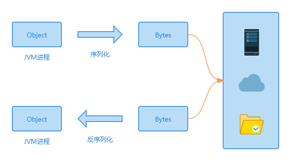

当我们在 Java 中创建对象的时候，对象会一直存在，直到程序终止时。但有时候可能存在一种"持久化"场景：我们需要让对象能够在程序不运行的情况下，仍能存在并保存其信息。当程序再次运行时 还可以通过该对象的保存下来的信息 来重建该对象。序列化和反序列化 就应运而生了，序列化机制可以使对象可以脱离程序的运行而独立存在。
* 序列化：将对象转换成二进制字节流的过程
* 反序列化：从二进制字节流中恢复对象的过程

## 应用场景
* 对象在进行网络传输的时候，需要先被序列化，接收到序列化的对象之后需要再进行反序列化；比如远程方法调用 RPC
* 将对象存储到文件中的时候需要进行序列化，将对象从文件中读取出来需要进行反序列化
* 将对象存储到内存中，需要进行序列化，将对象从内存中读取出来需要进行反序列化
* 将对象存储到数据库（如 Redis）时，需要用到序列化，将对象从缓存数据库中读取出来需要反序列化


## 序列化实现的方式
如果使用 JDK 自带的序列化方式实现对象序列化的话，那么这个类应该实现`Serializable`接口或者`Externalizable`接口。
### 继承Serializable接口，普通序列化
首先我们定义一个对象类 User
```java
public class User implements Serializable {
  //序列化ID
  private static final long serialVersionUID = 1L;
  private int age;
  private String name;

  public User(int age, String name) {
    this.age = age;
    this.name = name;
  }

  public static long getSerialVersionUID() {
    return serialVersionUID;
  }

  public int getAge() {
    return age;
  }

  public void setAge(int age) {
    this.age = age;
  }

  public String getName() {
    return name;
  }

  public void setName(String name) {
    this.name = name;
  }
}
```
然后编写一下测试类：
```java
public class serTest {
    public static void main(String[] args) throws Exception, IOException {
        SerializeUser();
        DeSerializeUser();
    }

		/**
     * 序列化方法
     * @throws IOException
     */
    private static void SerializeUser() throws  IOException {
        User user = new User(11, "小张");

				//序列化对象到指定的文件中
        ObjectOutputStream oos = new ObjectOutputStream(new FileOutputStream("C:\\Users\\jun\\Desktop\\example"));
        oos.writeObject(user);
        oos.close();
        System.out.println("序列化对象成功");
    }

		/**
     * 反序列化方法
     * @throws IOException
     * @throws ClassNotFoundException
     */
    private static void DeSerializeUser() throws  IOException, ClassNotFoundException {
        //读取指定的文件
        File file = new File("C:\\Users\\jun\\Desktop\\example");
        ObjectInputStream ois = new ObjectInputStream(new FileInputStream(file));
        User newUser = (User)ois.readObject();
        System.out.println("反序列化对象成功:"+ newUser.getName()+ ","+newUser.getAge());
    }
}
```
结果：
```text
序列化对象成功
反序列化对象成功:小张,11
```
一个对象想要被序列化，那么它的类就要继承`Serializable`接口或者它的子接口。

继承`Serializable`接口类的所有属性（包括`private`属性、包括其引用的对象）都可以被序列化和反序列化来保存、传递。如果不想序列化的字段可以使用`transient`关键字修饰
```java
private int age;
private String name;
private transient password;//属性：密码，不想被序列化
```
我们需要注意的是：使用`transient`关键字阻止序列化虽然简单方便，但被它修饰的属性被完全隔离在序列化机制之外，这必然会导致了在反序列化时无法获取该属性的值。

其实我们完全可以在通过在需要序列化的对象的 Java 类里加入`writeObject()`方法与`readObject()`方法来控制如何序列化各属性，某些属性是否被序列化。

如果`User`有一个属性是引用类型的呢？比如`User`其中有一个属性是类`Person`:
```java
private Person person;
```
那如果要想`User`可以序列化，那`Person`类也必须得继承`Serializable`接口，不然程序会报错。
### 继承Externalizable接口，强制自定义序列化
对于`Externalizable`接口，我们需要知道以下几点：
* `Externalizable`继承自`Serializable`接口
* 需要我们重写`writeExternal()`与`readExternal()`方法，这是强制性的
* 实现`Externalizable`接口的类必须要提供一个`public`的无参的构造器，因为反序列化的时候需要反射创建对象
* `Externalizable`接口实现序列化，性能稍微比继承自`Serializable`接口好一点

首先我们定义一个对象类`ExUser`
```java
public class ExUser implements Externalizable {
    private int age;
    private String name;

    //注意，必须加上pulic 无参构造器
    public ExUser() {
    }

    public int getAge() {
        return age;
    }

    public void setAge(int age) {
        this.age = age;
    }

    public String getName() {
        return name;
    }

    public void setName(String name) {
        this.name = name;
    }
    
    @Override
    public void writeExternal(ObjectOutput out) throws IOException {
        out.writeObject(name);
        out.writeInt(age);
    }
    @Override
    public void readExternal(ObjectInput in) throws IOException, ClassNotFoundException {
        this.name = (String)in.readObject();
        this.age = in.readInt();
    }
}
```
接着编写测试类：
```java
public class serTest2 {
    public static void main(String[] args) throws Exception, IOException {
        SerializeUser();
        DeSerializeUser();
    }

    /**
     * 序列化方法
     * @throws IOException
     */
    private static void SerializeUser() throws  IOException {
        ExUser user = new ExUser();
        user.setAge(10);
        user.setName("小王");

        //序列化对象到指定的文件中
        ObjectOutputStream oos = new ObjectOutputStream(new FileOutputStream("C:\\Users\\jun\\Desktop\\example"));
        oos.writeObject(user);
        oos.close();
        System.out.println("序列化对象成功");
    }

    /**
     * 反序列化方法
     * @throws IOException
     * @throws ClassNotFoundException
     */
    private static void DeSerializeUser() throws  IOException, ClassNotFoundException {
        File file = new File("C:\\Users\\jun\\Desktop\\example");
        ObjectInputStream ois = new ObjectInputStream(new FileInputStream(file));
        ExUser newUser = (ExUser)ois.readObject();
        System.out.println("反序列化对象成功:"+ newUser.getName()+ ","+newUser.getAge());
    }
}
```
结果：
```text
序列化对象成功
反序列化对象成功:小王,10
```
因为序列化和反序列化方法需要自己实现，因此可以指定序列化哪些属性，`transient`关键字在这里是无效的。

对`Externalizable`对象反序列化时，会先调用类的无参构造方法，这是有别于默认反序列方式的。如果把类的不带参数的构造方法删除，或者把该构造方法的访问权限设置为`private`、默认或`protected`级别，会抛出`java.io.InvalidException: no valid constructor`异常，因此`Externalizable`对象必须有默认构造函数，而且必需是`public`的。

## serialVersionUID的作用
如果反序列化使用的`serialVersionUID`与序列化时使用的`serialVersionUID`不一致，会报`InvalidCalssException`异常。这样就保证了项目迭代升级前后的兼容性，`serialVersionUID`是序列化前后的唯一标识符，只要版本号`serialVersionUID`相同，即使更改了序列化属性，对象也可以正确被反序列化回来。

默认如果没有人为显式定义过`serialVersionUID`，那编译器会为它自动声明一个！

`serialVersionUID`有两种显式的生成方式：
* 默认的`1L`，比如：`private static final long serialVersionUID = 1L;`
* 根据类名、接口名、成员方法及属性等来生成一个 64 位的哈希字段，比如：`private static final long serialVersionUID = xxxxL;`

## 静态变量不会被序列化
凡是被`static`修饰的字段是不会被序列化的，我们来看一个例子：
```java
//实体类
public class Student implements Serializable {
    private String name;
    public static Integer age;//静态变量


    public String getName() {
        return name;
    }

    public void setName(String name) {
        this.name = name;
    }

    public static Integer getAge() {
        return age;
    }

    public static void setAge(Integer age) {
        Student.age = age;
    }
}

//测试类
public class shallowCopyTest {

    public static void main(String[] args) throws Exception {
        Student student1 = new Student();
        student1.age = 11;

        //序列化，将数据写入指定的文件中
        ObjectOutputStream oos = new ObjectOutputStream(new FileOutputStream("D:\\student1"));
        oos.writeObject(student1);
        oos.close();

        Student student2 = new Student();
        student2.age = 21;

        //序列化，将数据写入指定的文件中
        ObjectOutputStream oos2 = new ObjectOutputStream(new FileOutputStream("D:\\student2"));
        oos2.writeObject(student1);
        oos2.close();

        //读取指定的文件
        File file = new File("D:\\student1");
        ObjectInputStream ois = new ObjectInputStream(new FileInputStream(file));
        Student student1_new = (Student)ois.readObject();
        System.out.println("反序列化对象,student1.age="+ student1_new.getAge());

        //读取指定的文件
        File file2 = new File("D:\\student1");
        ObjectInputStream ois2 = new ObjectInputStream(new FileInputStream(file2));
        Student student2_new = (Student)ois2.readObject();
        System.out.println("反序列化对象,student2.age="+ student2_new.getAge());
    }
}
```
结果：
```text
反序列化对象,student1.age=21
反序列化对象,student2.age=21
```
为啥结果都是 21？我们知道对象的序列化是操作的堆内存中的数据，而静态的变量又称作类变量，其数据存放在方法区里，类一加载，就初始化了。

又因为静态变量`age`没有被序列化，根本就没写入文件流中，所以我们打印的值其实一直都是当前`Student`类的静态变量`age`的值，而静态变量又是所有的对象共享的一个变量，所以就都是 21。
## 使用序列化实现深拷贝
```java
//实体类 继承Cloneable
public class Person implements Serializable{
    public String name;//姓名
    public int height;//身高
    public StringBuilder something;

...//省略 getter setter


    public Object deepClone() throws Exception{
        // 序列化
        ByteArrayOutputStream bos = new ByteArrayOutputStream();
        ObjectOutputStream oos = new ObjectOutputStream(bos);
    
        oos.writeObject(this);
    
        // 反序列化
        ByteArrayInputStream bis = new ByteArrayInputStream(bos.toByteArray());
        ObjectInputStream ois = new ObjectInputStream(bis);
    
        return ois.readObject();
    }

}

//测试类，这边类名笔者就不换了，在之前的基础上改改
public class shallowCopyTest {

    public static void main(String[] args) throws Exception {
        Person p1 = new Person("小张", 180, new StringBuilder("今天天气很好"));
        Person p2 = (Person)p1.deepClone();

        System.out.println("对象是否相等："+ (p1 == p2));
        System.out.println("p1 属性值=" + p1.getName()+ ","+ p1.getHeight() + ","+ p1.getSomething());
        System.out.println("p2 属性值=" + p2.getName()+ ","+ p2.getHeight() + ","+ p2.getSomething());


        // change
        p1.setName("小王");
        p1.setHeight(200);
        p1.getSomething().append(",适合出去玩");
        System.out.println("...after p1 change....");

        System.out.println("p1 属性值=" + p1.getName()+ ","+ p1.getHeight() + ","+ p1.getSomething());
        System.out.println("p2 属性值=" + p2.getName()+ ","+ p2.getHeight() + ","+ p2.getSomething());

    }
}
```
结果：
```text
对象是否相等：false
p1 属性值=小张,180,今天天气很好
p2 属性值=小张,180,今天天气很好
...after p1 change....
p1 属性值=小王,200,今天天气很好,适合出去玩
p2 属性值=小张,180,今天天气很好
```
## 常见序列化协议对比
除了JDK 自带的序列化方式，还有一些其他常见的序列化协议：
* 基于二进制：`hessian、kyro、protostuff`
* 文本类序列化方式：JSON 和 XML

采用哪种序列化方式，我们一般需要考虑序列化之后的数据大小，序列化的耗时，是否支持跨平台、语言，或者公司团队的技术积累。
## 小结
* JDK 自带序列化方法一般有2种：继承`Serializable`接口和继承`Externalizable`接口
* `static`修饰的类变量、`transient`修饰的实例变量都不会被序列化
* 序列化对象的引用类型成员变量，也必须是可序列化的
* `serialVersionUID`版本号是序列化和反序列化前后唯一标识，建议显式定义
* 序列化和反序列化的过程其实是有漏洞的，因为从序列化到反序列化是有中间过程的，如果被别人拿到了中间字节流，然后加以伪造或者篡改，反序列化出来的对象会有一定风险。可以重写`readObject()`方法，加以限制
* 除了 JDK 自带序列化方法，还有`hessian、kyro、protostuff、JSON`和 XML 等
