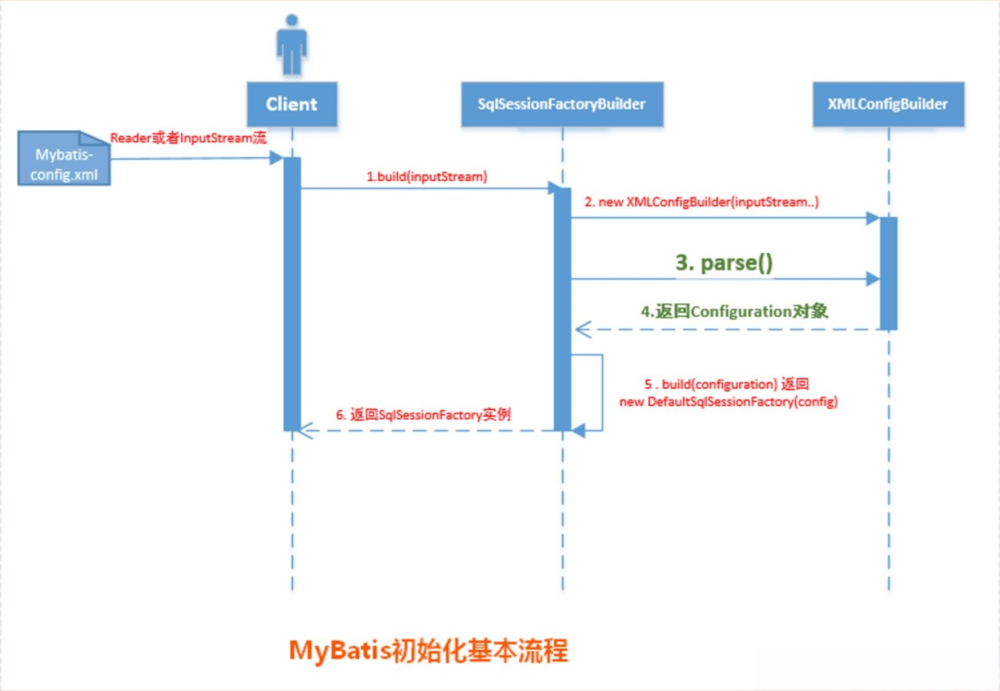

MyBatis 和数据库的交互有两种方式有 Java API 和 Mapper 接口两种，所以 MyBatis 的初始化必然也有两种。

MyBatis的初始化方式：
* 基于 XML 配置文件：基于 XML 配置文件的方式是将 MyBatis 的所有配置信息放在 XML 文件中，MyBatis 通过加载 XML 配置文件，将配置文信息组装成内部的`Configuration`对象。
* 基于 Java API：这种方式不使用 XML 配置文件，需要 MyBatis 使用者在 Java 代码中，手动创建`Configuration`对象，然后将配置参数`set`进入`Configuration`对象中。

## 初始化方式 - XML配置
我们通过基于 XML 配置文件方式的 MyBatis 初始化，深入探讨 MyBatis 是如何通过配置文件构建`Configuration`对象，并使用它。
```java
// mybatis初始化
String resource = "mybatis-config.xml";  
InputStream inputStream = Resources.getResourceAsStream(resource);  
SqlSessionFactory sqlSessionFactory = new SqlSessionFactoryBuilder().build(inputStream);

// 创建SqlSession
SqlSession sqlSession = sqlSessionFactory.openSession();  

// 执行SQL语句
List list = sqlSession.selectList("com.foo.bean.BlogMapper.queryAllBlogInfo");
```
上述语句的作用是执行`com.foo.bean.BlogMapper.queryAllBlogInfo`定义的 SQL 语句，返回一个`List`结果集。总的来说，上述代码经历了三个阶段：
* Mybatis 初始化
* 创建`SqlSession`
* 执行 SQL 语句

上述代码的功能是根据配置文件`mybatis-config.xml`配置文件，创建`SqlSessionFactory`对象，然后产生`SqlSession`，执行 SQL 语句。而 Mybatis 的初始化就发生在第三句：`SqlSessionFactory sqlSessionFactory = new SqlSessionFactoryBuilder().build(inputStream)`；现在就看看第三句到底发生了什么。
### MyBatis初始化基本过程
`SqlSessionFactoryBuilder`根据传入的数据流生成`Configuration`对象，然后根据`Configuration`对象创建默认的`SqlSessionFactory`实例。



由上图所示，Mybatis 初始化要经过以下几步：
* 调用`SqlSessionFactoryBuilder`对象的`build(inputStream)`方法
* `SqlSessionFactoryBuilder`会根据输入流`inputStream`等信息创建`XMLConfigBuilder`对象
* `SqlSessionFactoryBuilder`调用`XMLConfigBuilder`对象的`parse()`方法
* `XMLConfigBuilder`对象返回`Configuration`对象
* `SqlSessionFactoryBuilder`根据`Configuration`对象创建一个`DefaultSessionFactory`对象
* `SqlSessionFactoryBuilder`返回`DefaultSessionFactory`对象给`Client`，供`Client`使用

`SqlSessionFactoryBuilder`相关的代码：
```java
public SqlSessionFactory build(InputStream inputStream)  {  
    return build(inputStream, null, null);  
}  

public SqlSessionFactory build(InputStream inputStream, String environment, Properties properties)  {  
    try  {  
        //2. 创建XMLConfigBuilder对象用来解析XML配置文件，生成Configuration对象  
        XMLConfigBuilder parser = new XMLConfigBuilder(inputStream, environment, properties);  
        //3. 将XML配置文件内的信息解析成Java对象Configuration对象  
        Configuration config = parser.parse();  
        //4. 根据Configuration对象创建出SqlSessionFactory对象  
        return build(config);  
    } catch (Exception e) {  
        throw ExceptionFactory.wrapException("Error building SqlSession.", e);  
    } finally {  
        ErrorContext.instance().reset();  
        try {  
            inputStream.close();  
        } catch (IOException e) {  
            // Intentionally ignore. Prefer previous error.  
        }  
    }
}

// 从此处可以看出，MyBatis内部通过Configuration对象来创建SqlSessionFactory,
// 用户也可以自己通过API构造好Configuration对象，调用此方法创SqlSessionFactory  
public SqlSessionFactory build(Configuration config) {  
    return new DefaultSqlSessionFactory(config);  
}
```
上述的初始化过程中，涉及到了以下几个对象：

| 对象 | 说明 |
|:--:|:---|
|  `SqlSessionFactoryBuilder`  | `SqlSessionFactory`的构造器，用于创建`SqlSessionFactory`，采用了`Builder`设计模式   |
|  `Configuration`  | 该对象是`mybatis-config.xml`文件中所有`mybatis`配置信息   |
|  `SqlSessionFactory`  | `SqlSession`工厂类，以工厂形式创建`SqlSession`对象，采用了`Factory`工厂设计模式   |
|  `XmlConfigParser`  | 负责将`mybatis-config.xml`配置文件解析成`Configuration`对象，共`SqlSessonFactoryBuilder`使用，创建`SqlSessionFactory`   |

### 创建Configuration对象的过程
当`SqlSessionFactoryBuilder`执行`build()`方法，调用了`XMLConfigBuilder`的`parse()`方法，然后返回了`Configuration`对象。那么`parse()`方法是如何处理 XML 文件，生成`Configuration`对象的呢？

#### XMLConfigBuilder会将XML配置文件的信息转换为Document对象
XML 配置定义文件 DTD 转换成`XMLMapperEntityResolver`对象，然后将二者封装到`XpathParser`对象中，`XpathParser`的作用是提供根据`Xpath`表达式获取基本的 DOM 节点`Node`信息的操作。


#### 之后XMLConfigBuilder调用parse()方法
会从`XPathParser`中取出`<configuration>`节点对应的`Node`对象，然后解析此`Node`节点的子`Node：properties, settings, typeAliases,typeHandlers, objectFactory, objectWrapperFactory, plugins, environments,databaseIdProvider, mappers`：
```java
public Configuration parse() {  
    if (parsed) {  
        throw new BuilderException("Each XMLConfigBuilder can only be used once.");  
    }  
    parsed = true;  
    //源码中没有这一句，只有 parseConfiguration(parser.evalNode("/configuration"));  
    //为了让读者看得更明晰，源码拆分为以下两句  
    XNode configurationNode = parser.evalNode("/configuration");  
    parseConfiguration(configurationNode);  
    return configuration;  
}  
/** 
 * 解析 "/configuration"节点下的子节点信息，然后将解析的结果设置到Configuration对象中 
 */  
private void parseConfiguration(XNode root) {  
    try {  
        //1.首先处理properties 节点     
        propertiesElement(root.evalNode("properties")); //issue #117 read properties first  
        //2.处理typeAliases  
        typeAliasesElement(root.evalNode("typeAliases"));  
        //3.处理插件  
        pluginElement(root.evalNode("plugins"));  
        //4.处理objectFactory  
        objectFactoryElement(root.evalNode("objectFactory"));  
        //5.objectWrapperFactory  
        objectWrapperFactoryElement(root.evalNode("objectWrapperFactory"));  
        //6.settings  
        settingsElement(root.evalNode("settings"));  
        //7.处理environments  
        environmentsElement(root.evalNode("environments"));  
        //8.database  
        databaseIdProviderElement(root.evalNode("databaseIdProvider"));  
        //9.typeHandlers  
        typeHandlerElement(root.evalNode("typeHandlers"));  
        //10.mappers  
        mapperElement(root.evalNode("mappers"));  
    } catch (Exception e) {  
        throw new BuilderException("Error parsing SQL Mapper Configuration. Cause: " + e, e);  
    }  
}
```
注意：在上述代码中，还有一个非常重要的地方，就是解析 XML 配置文件子节点`<mappers>`的方法`mapperElements(root.evalNode("mappers"))`, 它将解析我们配置的`Mapper.xml`配置文件，`Mapper`配置文件可以说是 MyBatis 的核心。
#### 然后将这些值解析出来设置到Configuration对象中
解析子节点的过程就不一一介绍了，我们就看上述的`environmentsElement(root.evalNode("environments"))`方法是如何将`environments`的信息解析出来，设置到`Configuration`对象中的：
```java
/** 
 * 解析environments节点，并将结果设置到Configuration对象中 
 * 注意：创建envronment时，如果SqlSessionFactoryBuilder指定了特定的环境（即数据源）； 
 *      则返回指定环境（数据源）的Environment对象，否则返回默认的Environment对象； 
 *      这种方式实现了MyBatis可以连接多数据源 
 */  
private void environmentsElement(XNode context) throws Exception {  
    if (context != null)  
    {  
        if (environment == null)  
        {  
            environment = context.getStringAttribute("default");  
        }  
        for (XNode child : context.getChildren())  
        {  
            String id = child.getStringAttribute("id");  
            if (isSpecifiedEnvironment(id))  
            {  
                //1.创建事务工厂 TransactionFactory  
                TransactionFactory txFactory = transactionManagerElement(child.evalNode("transactionManager"));  
                DataSourceFactory dsFactory = dataSourceElement(child.evalNode("dataSource"));  
                //2.创建数据源DataSource  
                DataSource dataSource = dsFactory.getDataSource();  
                //3. 构造Environment对象  
                Environment.Builder environmentBuilder = new Environment.Builder(id)  
                .transactionFactory(txFactory)  
                .dataSource(dataSource);  
                //4. 将创建的Envronment对象设置到configuration 对象中  
                configuration.setEnvironment(environmentBuilder.build());  
            }  
        }  
    }  
}

private boolean isSpecifiedEnvironment(String id)  
{  
    if (environment == null)  
    {  
        throw new BuilderException("No environment specified.");  
    }  
    else if (id == null)  
    {  
        throw new BuilderException("Environment requires an id attribute.");  
    }  
    else if (environment.equals(id))  
    {  
        return true;  
    }  
    return false;  
} 
```
#### 返回Configuration对象
将上述的 MyBatis 初始化基本过程的序列图细化：

```sequence
autonumber
SqlSessionFactoryBuilder->>+XMLConfigBuider: new XMLConfigBuilder(inputStream...)
XMLConfigBuider->>+XMLMapperEntityResolver: new XMLMapperEntityResolver()
XMLMapperEntityResolver-->>+XMLConfigBuider: 返回resolver
XMLConfigBuider->>+XPathParser: new XPathParser(inputStream, true, props, resolver)
XPathParser-->>+XMLConfigBuider: 返回parser
XMLConfigBuider->>+Configuration: new Configuration()
Configuration-->>+XMLConfigBuider: 返回 Configuration
SqlSessionFactoryBuilder->>+XMLConfigBuider: parse()
XMLConfigBuider->>+XPathParser: evalNode("/configuration")
XPathParser->>+XNode: new XNode(node...)
XNode-->>+XPathParser: 返回XNode
XPathParser-->>+XMLConfigBuider: 返回XNode
loop 
	XMLConfigBuider->>+XNode: evalNode("XXX")
	XNode-->>+XMLConfigBuider: xxx子节点的XNode对象
	XMLConfigBuider->>+XMLConfigBuider: 解析xxx类型的XNode节点，获取相应的值YYY
	XMLConfigBuider->>+Configuration: setXXX(YYY)
	Configuration->>+XMLConfigBuider: 
end
XMLConfigBuider-->>+SqlSessionFactoryBuilder: 返回构建好的Configuration对象
```
# 初始化方式 - 基于Java API
我们可以使用`XMLConfigBuilder`手动解析 XML 配置文件来创建`Configuration`对象：
```java
String resource = "mybatis-config.xml";  
InputStream inputStream = Resources.getResourceAsStream(resource);  
// 手动创建XMLConfigBuilder，并解析创建Configuration对象  
XMLConfigBuilder parser = new XMLConfigBuilder(inputStream, null,null); // 看这里 
Configuration configuration = parser.parse();  
// 使用Configuration对象创建SqlSessionFactory  
SqlSessionFactory sqlSessionFactory = new SqlSessionFactoryBuilder().build(configuration);  
// 使用MyBatis  
SqlSession sqlSession = sqlSessionFactory.openSession();  
List list = sqlSession.selectList("com.foo.bean.BlogMapper.queryAllBlogInfo");  
```
