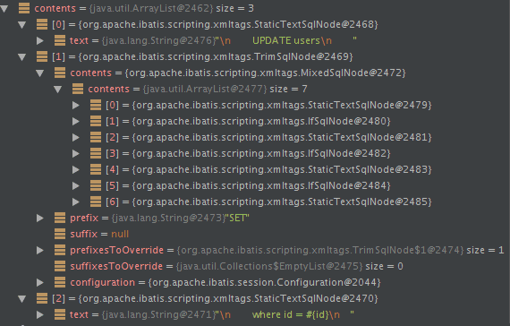
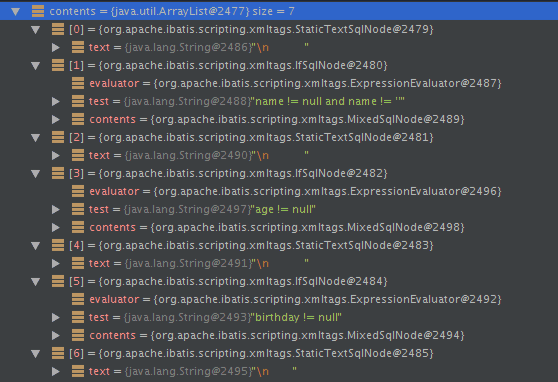

MyBatis 中常用的元素：
* `if`
* `choose (when, otherwise)`
* `trim (where, set)`
* `foreach`

## if
使用动态 SQL 最常见情景是根据条件包含`where`子句的一部分。
```xml
<select id="findActiveBlogWithTitleLike" resultType="Blog">
  SELECT * FROM BLOG WHERE state = 'ACTIVE'
  <if test="title != null">
    AND title like #{title}
  </if>
</select>
```
这条语句提供了可选的查找文本功能。如果不传入`title`，那么所有处于`ACTIVE`状态的`BLOG`都会返回；如果传入了`title`参数，那么就会对`title`一列进行模糊查找并返回对应的`BLOG`结果。

还可以对多个参数进行可选搜索。
```xml
<select id="findActiveBlogLike" resultType="Blog">
  SELECT * FROM BLOG WHERE state = 'ACTIVE'
  <if test="title != null">
    AND title like #{title}
  </if>
  <if test="author != null and author.name != null">
    AND author_name like #{author.name}
  </if>
</select>
```
## choose、when、otherwise
有时候，我们不想使用所有的条件，而只是想从多个条件中选择一个使用。针对这种情况，MyBatis 提供了`choose`元素，它有点像 Java 中的`switch`语句。

还是上面的例子，但是策略变为：传入了`title`就按`title`查找，传入了`author`就按`author`查找的情形。若两者都没有传入，就返回标记为`featured`的`BLOG`。
```xml
<select id="findActiveBlogLike" resultType="Blog">
  SELECT * FROM BLOG WHERE state = 'ACTIVE'
  <choose>
    <when test="title != null">
      AND title like #{title}
    </when>
    <when test="author != null and author.name != null">
      AND author_name like #{author.name}
    </when>
    <otherwise>
      AND featured = 1
    </otherwise>
  </choose>
</select>
```
## trim、where、set
前面几个例子已经合宜地解决了一个臭名昭著的动态 SQL 问题。现在回到之前的`if`示例，这次我们将`state = 'ACTIVE'`设置成动态条件，看看会发生什么。
```xml
<select id="findActiveBlogLike" resultType="Blog">
  SELECT * FROM BLOG
  WHERE
  <if test="state != null">
    state = #{state}
  </if>
  <if test="title != null">
    AND title like #{title}
  </if>
  <if test="author != null and author.name != null">
    AND author_name like #{author.name}
  </if>
</select>
```
如果没有匹配的条件会怎么样？最终这条 SQL 会变成这样：
```sql
SELECT * FROM BLOG
WHERE
```
这会导致查询失败。如果匹配的只是第二个条件又会怎样？这条 SQL 会是这样:
```
SELECT * FROM BLOG
WHERE
AND title like 'someTitle'
```
这个查询也会失败。这个问题不能简单地用条件元素来解决。

MyBatis 有一个简单且适合大多数场景的解决办法。而在其他场景中，可以对其进行自定义以符合需求。而这，只需要一处简单的改动：
```xml
<select id="findActiveBlogLike" resultType="Blog">
  SELECT * FROM BLOG
  <where>
    <if test="state != null">
        state = #{state}
    </if>
    <if test="title != null">
        AND title like #{title}
    </if>
    <if test="author != null and author.name != null">
        AND author_name like #{author.name}
    </if>
  </where>
</select>
```
`where`元素只会在子元素返回任何内容的情况下才插入`WHERE`子句。而且，若子句的开头为`AND`或`OR`，`where`元素也会将它们去除。如果`where`元素与你期望的不太一样，你也可以通过自定义`trim`元素来定制`where`元素的功能。比如，和`where`元素等价的自定义`trim`元素为：
```xml
<trim prefix="WHERE" prefixOverrides="AND |OR ">
  ...
</trim>
```
`prefixOverrides`属性会忽略通过管道符分隔的文本序列（注意此例中的空格是必要的）。上述例子会移除所有`prefixOverrides`属性中指定的内容，并且插入`prefix`属性中指定的内容。

用于动态更新语句的类似解决方案叫做`set`。`set`元素可以用于动态包含需要更新的列，忽略其它不更新的列。比如：
```xml
<update id="updateAuthorIfNecessary">
  update Author
    <set>
      <if test="username != null">username=#{username},</if>
      <if test="password != null">password=#{password},</if>
      <if test="email != null">email=#{email},</if>
      <if test="bio != null">bio=#{bio}</if>
    </set>
  where id=#{id}
</update>
```
这个例子中，`set`元素会动态地在行首插入`SET`关键字，并会删掉额外的逗号（这些逗号是在使用条件语句给列赋值时引入的）。来看看与`set`元素等价的自定义`trim`元素吧：
```xml
<trim prefix="SET" suffixOverrides=",">
  ...
</trim>
```
注意，我们覆盖了后缀值设置，并且自定义了前缀值。
## foreach
动态 SQL 的另一个常见使用场景是对集合进行遍历（尤其是在构建`IN`条件语句的时候）。
```xml
<select id="selectPostIn" resultType="domain.blog.Post">
  SELECT * FROM POST P WHERE ID in
  <foreach item="item" index="index" collection="list" open="(" separator="," close=")">
    #{item}
  </foreach>
</select>
```
`foreach`标签主要有以下属性：
* `item`：表示集合中每一个元素进行迭代时的别名。
* `index`：指定一个名字，表示在迭代过程中每次迭代到的位置。
* `open`：表示该语句以什么开始（既然是`in`条件语句，所以必然以`(`开始）。
* `separator`：表示在每次进行迭代之间以什么符号作为分隔符（既然是`in`条件语句，所以必然以`,`作为分隔符）。
* `close`：表示该语句以什么结束（既然是`in`条件语句，所以必然以`)`结束）。

使用`foreach`标签时，最关键、最容易出错的是`collection`属性，该属性是必选的，但在不同情况下该属性的值是不一样的，主要有以下 3 种情况：
* 如果传入的是单参数且参数类型是一个`List`，`collection`属性值为`list`。
* 如果传入的是单参数且参数类型是一个`array`数组，`collection`的属性值为`array`。
* 如果传入的参数是多个，需要把它们封装成一个`Map`，当然单参数也可以封装成`Map`。`Map`的`key`是参数名，`collection`属性值是传入的`List`或`array`对象在自己封装的`Map`中的`key`。

`foreach`元素的功能非常强大，它允许你指定一个集合，声明可以在元素体内使用的集合项（`item`）和索引（`index`）变量。它也允许你指定开头与结尾的字符串以及集合项迭代之间的分隔符。这个元素也不会错误地添加多余的分隔符。
:::tip
你可以将任何可迭代对象（如`List、Set`等）、`Map`对象或者数组对象作为集合参数传递给`foreach`。当使用可迭代对象或者数组时，`index`是当前迭代的序号，`item`的值是本次迭代获取到的元素。当使用`Map`对象（或者`Map.Entry`对象的集合）时，`index`是键，`item`是值。
:::
## script
要在带注解的映射器接口类中使用动态 SQL，可以使用`script`元素。
```java
@Update({"<script>",
      "update Author",
      "  <set>",
      "    <if test='username != null'>username=#{username},</if>",
      "    <if test='password != null'>password=#{password},</if>",
      "    <if test='email != null'>email=#{email},</if>",
      "    <if test='bio != null'>bio=#{bio}</if>",
      "  </set>",
      "where id=#{id}",
      "</script>"})
    void updateAuthorValues(Author author);
```
## bind
`bind`元素允许你在 OGNL 表达式以外创建一个变量，并将其绑定到当前的上下文。
```xml
<select id="selectBlogsLike" resultType="Blog">
  <bind name="pattern" value="'%' + _parameter.getTitle() + '%'" />
  SELECT * FROM BLOG WHERE title LIKE #{pattern}
</select>
```
以上代码中的`_parameter`代表传递进来的参数，它和通配符连接后，赋给了`pattern`，然后就可以在`select`语句中使用这个变量进行模糊查询，不管是 MySQL 数据库还是 Oracle 数据库都可以使用这样的语句，提高了可移植性。
## 多数据库支持
如果配置了`databaseIdProvider`，你就可以在动态代码中使用名为`_databaseId`的变量来为不同的数据库构建特定的语句。
```xml
<insert id="insert">
  <selectKey keyProperty="id" resultType="int" order="BEFORE">
    <if test="_databaseId == 'oracle'">
      select seq_users.nextval from dual
    </if>
    <if test="_databaseId == 'db2'">
      select nextval for seq_users from sysibm.sysdummy1"
    </if>
  </selectKey>
  insert into users values (#{id}, #{name})
</insert>
```
## 动态 SQL 中的插入脚本语言
MyBatis 从 3.2 版本开始支持插入脚本语言，这允许你插入一种语言驱动，并基于这种语言来编写动态 SQL 查询语句。可以通过实现以下接口来插入一种语言：
```java
public interface LanguageDriver {
  ParameterHandler createParameterHandler(MappedStatement mappedStatement, Object parameterObject, BoundSql boundSql);
  SqlSource createSqlSource(Configuration configuration, XNode script, Class<?> parameterType);
  SqlSource createSqlSource(Configuration configuration, String script, Class<?> parameterType);
}
```
实现自定义语言驱动后，你就可以在`mybatis-config.xml`文件中将它设置为默认语言：
```xml
<typeAliases>
  <typeAlias type="org.sample.MyLanguageDriver" alias="myLanguage"/>
</typeAliases>
<settings>
  <setting name="defaultScriptingLanguage" value="myLanguage"/>
</settings>
```
或者，你也可以使用`lang`属性为特定的语句指定语言：
```xml
<select id="selectBlog" lang="myLanguage">
  SELECT * FROM BLOG
</select>
```
或者，在你的`mapper`接口上添加`@Lang`注解：
```java
public interface Mapper {
  @Lang(MyLanguageDriver.class)
  @Select("SELECT * FROM BLOG")
  List<Blog> selectBlog();
}
```
前面看到的所有`xml`标签都由默认 MyBatis 语言提供，而它由语言驱动`org.apache.ibatis.scripting.xmltags.XmlLanguageDriver`（别名为`xml`）所提供。
## 动态SQL解析原理
在使用 mybatis 的时候，会在`xml`中编写`sql`语句。比如这段动态`sql`代码：
```xml
<update id="update" parameterType="org.format.dynamicproxy.mybatis.bean.User">
    UPDATE users
    <trim prefix="SET" prefixOverrides=",">
        <if test="name != null and name != ''">
            name = #{name}
        </if>
        <if test="age != null and age != ''">
            , age = #{age}
        </if>
        <if test="birthday != null and birthday != ''">
            , birthday = #{birthday}
        </if>
    </trim>
    where id = ${id}
</update>
```
mybatis 底层是如何构造这段`sql`的？带着这个疑问，我们一步一步分析。
### 关于动态SQL的接口和类
`SqlNode`接口，简单理解就是`xml`中的每个标签，比如上述`sql`的`update,trim,if`标签：
```java
public interface SqlNode {
    boolean apply(DynamicContext context);
}
```
```class
class ChooseSqlNode {
	-defaultSqlNode: int
	-ifSqlNodes: List<?>
}
class SqlNode {
	<<interface>>
	+apply(context:DynamicContext) : boolean
}
class IfSqlNode {
	-evaluator: ExpressionEvaluator
	-test: String
	-contents: int
}
class MixedSqlNode {
	-contents: List<?>
}
class StaticTextSqlNode {
	-text: String
}
class TextSqlNode {
	-text: String
}
class VarDeclSqlNode {
	-name: String
	-expression: String
}
class ForEachSqlNode {
	-evaluator: ExpressionEvalator
	-collectionExpression: String
	-contents: SqlNode
	-open: String
	-close: String
	-separator: String
	-item: String
	-index: String
	-configuration: Configuration
}
class TrimSqlNode {
	-contents: int
	-suffix: String
	-prefix: String
	-prefixesToOverride: List<String>
	-suffixesToOverride: List<String>
	-configuration: Configuration
}
class SetSqlNode {
	-suffixList:: List<String>
}
class WhereSqlNode {
	-prefixList: List<String>
}
ChooseSqlNode ..|> SqlNode
IfSqlNode ..|> SqlNode
MixedSqlNode ..|> SqlNode
TrimSqlNode ..|> SqlNode
StaticTextSqlNode ..|> SqlNode
TextSqlNode ..|> SqlNode
VarDeclSqlNode ..|> SqlNode
ForEachSqlNode ..|> SqlNode
SetSqlNode --|> TrimSqlNode
WhereSqlNode --|> TrimSqlNode
```

`SqlSource Sql`源接口，代表从`xml`文件或注解映射的`sql`内容，主要就是用于创建`BoundSql`，有实现类`DynamicSqlSource`(动态`Sql`源)，`StaticSqlSource`(静态`Sql`源)等：
```java
public interface SqlSource {
    BoundSql getBoundSql(Object parameterObject);
}
```

```class
class SqlSource {
	<<interface>>
	+getBoundSql(parameterObject: Object): BoundSql
}
class DynamicSqlSource {
	-configuration: Configuration
	-rootSqlNode: SqlNode
}
class ProviderSqlSource {
	-sqlSourceParser: SqlSourceBuilder
	-provioderMethod: Method
	-providerTakesParameterObject: boolean
	-providerType: Class
}
class RawSqlSource {
	-sqlSource: SqlSource
}
class StaticSqlSource {
	-sql: String
	-parameterMappings: List<ParameterMapping>
	-configuration: Configuration
}
DynamicSqlSource --|> SqlSource
ProviderSqlSource --|> SqlSource
RawSqlSource --|> SqlSource
StaticSqlSource --|> SqlSource
```
`BoundSql`类，封装 mybatis 最终产生`sql`的类，包括`sql`语句，参数，参数源数据等参数：
```java
public class BoundSql {
  private final String sql;
  private final List<ParameterMapping> parameterMappings;
  private final Object parameterObject;
  private final Map<String, Object> additionalParameters;
  private final MetaObject metaParameters;
}
```
`XNode`，一个 Dom API 中的`Node`接口的扩展类：
```java
public class XNode {
  private final Node node;
  private final String name;
  private final String body;
  private final Properties attributes;
  private final Properties variables;
  private final XPathParser xpathParser;
}
```
`BaseBuilder`接口及其实现类，这些`Builder`的作用就是用于构造`sql`：
```class
class BaseBuilder {
}
class XMLMapperBuilder {
}
class MapperBuilderAssistant {
}
class XMLScriptBuilder {
}
class XMLConfigBuilder {
}
class XMLStatementBuilder {
}
class SqlSourceBuilder {
}
XMLMapperBuilder --|> BaseBuilder
MapperBuilderAssistant --|> BaseBuilder
XMLScriptBuilder --|> BaseBuilder
XMLConfigBuilder --|> BaseBuilder
XMLStatementBuilder --|> BaseBuilder
SqlSourceBuilder --|> BaseBuilder
```

下面我们简单分析下其中 4 个`Builder`：
* `XMLConfigBuilder`：解析 mybatis 中`configLocation`属性中的全局`xml`文件，内部会使用`XMLMapperBuilder`解析各个`xml`文件。
* `XMLMapperBuilder`：遍历 mybatis 中`mapperLocations`属性中的`xml`文件中每个节点的`Builder`，比如`user.xml`，内部会使用`XMLStatementBuilder`处理`xml`中的每个节点。
* `XMLStatementBuilder`：解析`xml`文件中各个节点，比如`select,insert,update,delete`节点，内部会使用`XMLScriptBuilder`处理节点的`sql`部分，遍历产生的数据会丢到`Configuration`的`mappedStatements`中。
* `XMLScriptBuilder`：解析`xml`中各个节点`sql`部分的`Builder`。

`LanguageDriver`接口及其实现类，该接口主要的作用就是构造`sql`:
```class
class LanguageDriver {
	<<interface>>
	+ createSqlSource(): SqlSource
	+ createParameterHandler(): ParameterHandler
}
class XMLLanguageDriver {
}
class RawLanguageDriver {
}
XMLLanguageDriver ..|> LanguageDriver
RawLanguageDriver --|> XMLLanguageDriver
```
简单分析下`XMLLanguageDriver`(处理`xml`中的`sql`，`RawLanguageDriver`处理静态`sql`)：`XMLLanguageDriver`内部会使用`XMLScriptBuilder`解析`xml`中的`sql`部分。
### 源码分析
Spring 与 Mybatis 整合的时候需要配置`SqlSessionFactoryBean`，该配置会加入数据源和 mybatis `xml`配置文件路径等信息：
```xml
<bean id="sqlSessionFactory" class="org.mybatis.spring.SqlSessionFactoryBean">
    <property name="dataSource" ref="dataSource"/>
    <property name="configLocation" value="classpath:mybatisConfig.xml"/>
    <property name="mapperLocations" value="classpath*:org/format/dao/*.xml"/>
</bean>
```
我们就分析这一段配置背后的细节：

`SqlSessionFactoryBean`实现了 Spring 的`InitializingBean`接口，`InitializingBean`接口的`afterPropertiesSet`方法中会调用`buildSqlSessionFactory`方法 该方法内部会使用`XMLConfigBuilder`解析属性`configLocation`中配置的路径，还会使用`XMLMapperBuilder`属性解析`mapperLocations`属性中的各个`xml`文件。

由于`XMLConfigBuilder`内部也是使用`XMLMapperBuilder`，我们就看看`XMLMapperBuilder`的解析细节：
````java
/**
 * 解析 Mapper XML 配置文件
 */
public void parse() {
	// 判断当前 Mapper 是否已经加载过
	if (!configuration.isResourceLoaded(resource)) {
		// 解析 <mapper /> 标签
		configurationElement(parser.evalNode("/mapper"));
		// 标记该 Mapper 已经加载过
		configuration.addLoadedResource(resource);
		// 绑定 Mapper
		bindMapperForNamespace();
	}
	// 解析待定的 <resultMap /> 标签
	parsePendingResultMaps();
	// 解析待定的 <cache-ref /> 标签
	parsePendingCacheRefs();
	// 解析待定的 SQL 语句的节点
	parsePendingStatements();
}
````
```java
/**
 * 解析 <mapper /> 标签
 * @param context
 */
private void configurationElement(XNode context) {
	try {
		// 获得 namespace 属性
		String namespace = context.getStringAttribute("namespace");
		if (namespace == null || namespace.equals("")) {
			throw new BuilderException("Mapper's namespace cannot be empty");
		}
		// 设置 namespace 属性到 MapperAnnotationBuilder 中
		builderAssistant.setCurrentNamespace(namespace);
		// 解析 <cache-ref /> 节点
		cacheRefElement(context.evalNode("cache-ref"));
		// 解析 <cache /> 节点
		cacheElement(context.evalNode("cache"));
		// 已废弃！老式风格的参数映射。内联参数是首选,这个元素可能在将来被移除，这里不会记录。
		parameterMapElement(context.evalNodes("/mapper/parameterMap"));
		// 解析 <resultMap /> 节点们
		resultMapElements(context.evalNodes("/mapper/resultMap"));
		// 解析 <sql /> 节点们
		sqlElement(context.evalNodes("/mapper/sql"));
		// 解析 <select /> <insert /> <update /> <delete /> 节点们
		buildStatementFromContext(context.evalNodes("select|insert|update|delete"));
	} catch (Exception e) {
		throw new BuilderException("Error parsing Mapper XML. The XML location is '" + resource + "'. Cause: " + e, e);
	}
}
```
增删改查节点的解析：
```java
private void buildStatementFromContext(List<XNode> list) {
	if (configuration.getDatabaseId() != null) {
		buildStatementFromContext(list, configuration.getDatabaseId());
	}
	buildStatementFromContext(list, null);
}

private void buildStatementFromContext(List<XNode> list, String requiredDatabaseId) {
	for (XNode context : list) {
		// 对于每个节点，使用XMLStatementBuilder解析
		final XMLStatementBuilder statementParser = new XMLStatementBuilder(configuration, builderAssistant, context, requiredDatabaseId);
		try {
			statementParser.parseStatementNode();
		} catch (IncompleteElementException e) {
			configuration.addIncompleteStatement(statementParser);
		}
	}
}
```
`XMLStatementBuilder`的解析：
```java
// XMLStatementBuilder
public void parseStatementNode() {
    // 获得 id 属性，编号。
    String id = context.getStringAttribute("id");
    // 获得 databaseId ， 判断 databaseId 是否匹配
    String databaseId = context.getStringAttribute("databaseId");

    if (!databaseIdMatchesCurrent(id, databaseId, this.requiredDatabaseId)) {
      return;
    }

    Integer fetchSize = context.getIntAttribute("fetchSize");
    Integer timeout = context.getIntAttribute("timeout");
    String parameterMap = context.getStringAttribute("parameterMap");
    String parameterType = context.getStringAttribute("parameterType");
    Class<?> parameterTypeClass = resolveClass(parameterType);
    String resultMap = context.getStringAttribute("resultMap");
    String resultType = context.getStringAttribute("resultType");
    String lang = context.getStringAttribute("lang");
    LanguageDriver langDriver = getLanguageDriver(lang);

    Class<?> resultTypeClass = resolveClass(resultType);
    String resultSetType = context.getStringAttribute("resultSetType");
    StatementType statementType = StatementType.valueOf(context.getStringAttribute("statementType", StatementType.PREPARED.toString()));
    ResultSetType resultSetTypeEnum = resolveResultSetType(resultSetType);

    String nodeName = context.getNode().getNodeName();
    SqlCommandType sqlCommandType = SqlCommandType.valueOf(nodeName.toUpperCase(Locale.ENGLISH));
    boolean isSelect = sqlCommandType == SqlCommandType.SELECT;
    boolean flushCache = context.getBooleanAttribute("flushCache", !isSelect);
    boolean useCache = context.getBooleanAttribute("useCache", isSelect);
    boolean resultOrdered = context.getBooleanAttribute("resultOrdered", false);

    // Include Fragments before parsing
    XMLIncludeTransformer includeParser = new XMLIncludeTransformer(configuration, builderAssistant);
    includeParser.applyIncludes(context.getNode());

    // Parse selectKey after includes and remove them.
    processSelectKeyNodes(id, parameterTypeClass, langDriver);

    // Parse the SQL (pre: <selectKey> and <include> were parsed and removed)
    // 使用LanguageDriver解析sql并得到SqlSource
    SqlSource sqlSource = langDriver.createSqlSource(configuration, context, parameterTypeClass);
    String resultSets = context.getStringAttribute("resultSets");
    String keyProperty = context.getStringAttribute("keyProperty");
    String keyColumn = context.getStringAttribute("keyColumn");
    KeyGenerator keyGenerator;
    String keyStatementId = id + SelectKeyGenerator.SELECT_KEY_SUFFIX;
    keyStatementId = builderAssistant.applyCurrentNamespace(keyStatementId, true);
    if (configuration.hasKeyGenerator(keyStatementId)) {
      keyGenerator = configuration.getKeyGenerator(keyStatementId);
    } else {
      keyGenerator = context.getBooleanAttribute("useGeneratedKeys",
          configuration.isUseGeneratedKeys() && SqlCommandType.INSERT.equals(sqlCommandType))
          ? Jdbc3KeyGenerator.INSTANCE : NoKeyGenerator.INSTANCE;
    }

    builderAssistant.addMappedStatement(id, sqlSource, statementType, sqlCommandType,
        fetchSize, timeout, parameterMap, parameterTypeClass, resultMap, resultTypeClass,
        resultSetTypeEnum, flushCache, useCache, resultOrdered,
        keyGenerator, keyProperty, keyColumn, databaseId, langDriver, resultSets);
  }
```

默认会使用`XMLLanguageDriver`创建`SqlSource`（`Configuration`构造函数中设置）。

`XMLLanguageDriver`创建`SqlSource`：
```java
@Override
public SqlSource createSqlSource(Configuration configuration, XNode script, Class<?> parameterType) {
	XMLScriptBuilder builder = new XMLScriptBuilder(configuration, script, parameterType);
	return builder.parseScriptNode();
}
```
`XMLScriptBuilder`解析`sql`：
```java
public SqlSource parseScriptNode() {
	MixedSqlNode rootSqlNode = parseDynamicTags(context);
	SqlSource sqlSource = null;
	if (isDynamic) {
		sqlSource = new DynamicSqlSource(configuration, rootSqlNode);
	} else {
		sqlSource = new RawSqlSource(configuration, rootSqlNode, parameterType);
	}
	return sqlSource;
}
```
得到`SqlSource`之后，会放到`Configuration`中，有了`SqlSource`，就能拿`BoundSql`了，`BoundSql`可以得到最终的`sql`。
### 实例分析
以下面的`xml`解析大概说下`parseDynamicTags`的解析过程：
```xml
<update id="update" parameterType="org.format.dynamicproxy.mybatis.bean.User">
    UPDATE users
    <trim prefix="SET" prefixOverrides=",">
        <if test="name != null and name != ''">
            name = #{name}
        </if>
        <if test="age != null and age != ''">
            , age = #{age}
        </if>
        <if test="birthday != null and birthday != ''">
            , birthday = #{birthday}
        </if>
    </trim>
    where id = ${id}
</update>
```
`parseDynamicTags`方法的返回值是一个`List`，也就是一个`Sql`节点集合。首先根据`update`节点(`Node`)得到所有的子节点，分别是 3 个子节点：
* 文本节点 \n UPDATE users
* trim子节点 ...
* 文本节点 \n where id = #

遍历各个子节点：
* 如果节点类型是文本或者`CDATA`，构造一个`TextSqlNode`或`StaticTextSqlNode`；
* 如果节点类型是元素，说明该`update`节点是个动态`sql`，然后会使用`NodeHandler`处理各个类型的子节点。这里的`NodeHandler`是`XMLScriptBuilder`的一个内部接口，其实现类包括`TrimHandler、WhereHandler、SetHandler、IfHandler、ChooseHandler`等。看类名也就明白了这个`Handler`的作用，比如我们分析的`trim`节点，对应的是`TrimHandler`；`if`节点，对应的是`IfHandler...`这里子节点`trim`被`TrimHandler`处理，`TrimHandler`内部也使用`parseDynamicTags`方法解析节点。

遇到子节点是元素的话，重复以上步骤：
`trim`子节点内部有 7 个子节点，分别是文本节点、`if`节点、是文本节点、`if`节点、是文本节点、`if`节点、文本节点。文本节点跟之前一样处理，`if`节点使用`IfHandler`处理。遍历步骤如上所示，下面我们看下几个`Handler`的实现细节。

`IfHandler`处理方法也是使用`parseDynamicTags`方法，然后加上`if`标签必要的属性：
```java
private class IfHandler implements NodeHandler {
    public void handleNode(XNode nodeToHandle, List<SqlNode> targetContents) {
      List<SqlNode> contents = parseDynamicTags(nodeToHandle);
      MixedSqlNode mixedSqlNode = new MixedSqlNode(contents);
      String test = nodeToHandle.getStringAttribute("test");
      IfSqlNode ifSqlNode = new IfSqlNode(mixedSqlNode, test);
      targetContents.add(ifSqlNode);
    }
}
```
`TrimHandler`处理方法也是使用`parseDynamicTags`方法，然后加上`trim`标签必要的属性：
```java
private class TrimHandler implements NodeHandler {
    public void handleNode(XNode nodeToHandle, List<SqlNode> targetContents) {
      List<SqlNode> contents = parseDynamicTags(nodeToHandle);
      MixedSqlNode mixedSqlNode = new MixedSqlNode(contents);
      String prefix = nodeToHandle.getStringAttribute("prefix");
      String prefixOverrides = nodeToHandle.getStringAttribute("prefixOverrides");
      String suffix = nodeToHandle.getStringAttribute("suffix");
      String suffixOverrides = nodeToHandle.getStringAttribute("suffixOverrides");
      TrimSqlNode trim = new TrimSqlNode(configuration, mixedSqlNode, prefix, prefixOverrides, suffix, suffixOverrides);
      targetContents.add(trim);
    }
}
```
以上`update`方法最终通过`parseDynamicTags`方法得到的`SqlNode`集合如下：



`trim`节点：



由于这个`update`方法是个动态节点，因此构造出了`DynamicSqlSource`。`DynamicSqlSource`内部就可以构造`sql`了:
```java
// DynamicSqlSource
@Override
public BoundSql getBoundSql(Object parameterObject) {
	DynamicContext context = new DynamicContext(configuration, parameterObject);
	rootSqlNode.apply(context);
	SqlSourceBuilder sqlSourceParser = new SqlSourceBuilder(configuration);
	Class<?> parameterType = parameterObject == null ? Object.class : parameterObject.getClass();
	SqlSource sqlSource = sqlSourceParser.parse(context.getSql(), parameterType, context.getBindings());
	BoundSql boundSql = sqlSource.getBoundSql(parameterObject);
	for (Map.Entry<String, Object> entry : context.getBindings().entrySet()) {
		boundSql.setAdditionalParameter(entry.getKey(), entry.getValue());
	}
	return boundSql;
}
```
`DynamicSqlSource`内部的`SqlNode`属性是一个`MixedSqlNode`。然后我们看看各个`SqlNode`实现类的`apply`方法。下面分析一下各个`SqlNode`实现类的`apply`方法实现：

`MixedSqlNode`：`MixedSqlNode`会遍历调用内部各个`sqlNode`的`apply`方法。
```java
public boolean apply(DynamicContext context) {
   for (SqlNode sqlNode : contents) {
     sqlNode.apply(context);
   }
   return true;
}
```
`StaticTextSqlNode`：直接`append sql`文本。
```java
public boolean apply(DynamicContext context) {
   context.appendSql(text);
   return true;
}
```
`IfSqlNode`：这里的`evaluator`是一个`ExpressionEvaluator`类型的实例，内部使用了 OGNL 处理表达式逻辑。
```java
public boolean apply(DynamicContext context) {
   if (evaluator.evaluateBoolean(test, context.getBindings())) {
     contents.apply(context);
     return true;
   }
   return false;
}
```
`TrimSqlNode`：
```java
public boolean apply(DynamicContext context) {
    FilteredDynamicContext filteredDynamicContext = new FilteredDynamicContext(context);
    boolean result = contents.apply(filteredDynamicContext);
    filteredDynamicContext.applyAll();
    return result;
}

public void applyAll() {
    sqlBuffer = new StringBuilder(sqlBuffer.toString().trim());
    String trimmedUppercaseSql = sqlBuffer.toString().toUpperCase(Locale.ENGLISH);
    if (trimmedUppercaseSql.length() > 0) {
        applyPrefix(sqlBuffer, trimmedUppercaseSql);
        applySuffix(sqlBuffer, trimmedUppercaseSql);
    }
    delegate.appendSql(sqlBuffer.toString());
}

private void applyPrefix(StringBuilder sql, String trimmedUppercaseSql) {
    if (!prefixApplied) {
        prefixApplied = true;
        if (prefixesToOverride != null) {
            for (String toRemove : prefixesToOverride) {
                if (trimmedUppercaseSql.startsWith(toRemove)) {
                    sql.delete(0, toRemove.trim().length());
                    break;
                }
            }
        }
        if (prefix != null) {
            sql.insert(0, " ");
            sql.insert(0, prefix);
        }
   }
}
```
`TrimSqlNode`的`apply`方法也是调用属性`contents`(一般都是`MixedSqlNode`)的`apply`方法，按照实例也就是 7 个`SqlNode`，都是`StaticTextSqlNode`和`IfSqlNode`。最后会使用`FilteredDynamicContext`过滤掉`prefix`和`suffix`。
