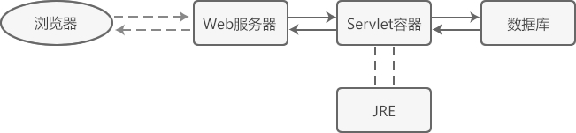
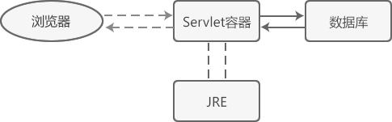
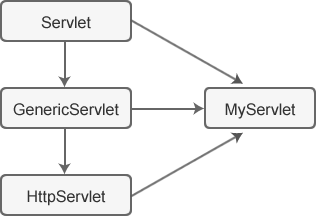

## Servlet是什么
Servlet 是 Server Applet 的缩写，译为“服务器端小程序”，是一种使用 Java 语言来开发动态网站的技术。

Servlet 虽然被称作“小程序”，但是它的功能却异常强大，因为它是基于 Java 的，几乎可以使用所有的 Java API，Java 能做的事情，Servlet 也能做。

Java 是一种功能强大的通用型编程语言，可以处理 HTTP 请求，可以访问数据库，可以生成 HTML 代码，您完全可以使用原生 Java 来开发动态网站。但是，使用原生 Java 开发动态网站非常麻烦，需要自己解析 HTTP 请求的报头，需要自己分析用户的请求参数，需要自己加载数据库组件……种种原因导致使用原生 Java 开发动态网站几乎是一件不能被接受的事情。正是基于这种原因，Java 官方后来推出了 Servlet 技术，它对开发动态网站需要使用的原生 Java API 进行了封装，形成了一套新的 API，称为 Servlet API。

使用 Servlet 开发动态网站非常方便，程序员只需要集中精力处理业务逻辑，不需要再为那些基础性的、通用性的功能编写代码，这使得 Servlet 在动态网站开发领域具备了很高的实用性。

Servlet 基于 Java，可以使用几乎全部的 Java API，所以它的功能异常强大，完全可以胜任企业级开发，能够处理那些高并发、大吞吐量、业务逻辑复杂的应用场景。

您可以这样理解，Servlet 是 Sun 公司推出的一种基于 Java 的动态网站开发技术。编写 Servlet 代码需要遵循 Java 语法，一个 Servlet 程序其实就是一个按照 Servlet 规范编写的 Java 类。Servlet 程序需要先编译成字节码文件（`.class`文件），然后再部署到服务器运行。

严格来说，Servlet 只是一套 Java Web 开发的规范，或者说是一套 Java Web 开发的技术标准。只有规范并不能做任何事情，必须要有人去实现它。所谓实现 Servlet 规范，就是真正编写代码去实现 Servlet 规范提到的各种功能，包括类、方法、属性等。

所有的 Servlet 功能都是通过一个名为Servlet的接口（Interface）向外暴露的，编写 Servlet 代码，可以从实现 Servlet 接口开始，就像下面这样：
```java
public class ServletDemo implements Servlet {
	//TODO:
}
```
直接实现 Servlet 接口比较麻烦，需要实现很多方法，所以 Servlet 规范又提供了两个抽象类，分别是 GenericServlet 类和 HttpServlet 类，它们都实现了 Servlet 接口的很多常用功能。和 GenericServlet 类相比，HttpServlet 类更加方便，所以实际开发中一般都继承自 HttpServlet 类。
## JSP
Servlet 是第一代 Java Web 开发技术，它将 HTML 代码以字符串的形式向外输出，编写 HTML 文档就是在拼接字符串，非常麻烦，所以 Java 官方又推出了第二代 Web 开发技术——JSP。

JSP 才是现代化的 Web 开发技术，它允许 HTML 代码和 JSP 代码分离，让程序员能够在 HTML 文档中直接嵌入 JSP 代码。

现在没有人直接使用 Servlet 开发动态网站，大家都转向了 JSP 阵营。但是 JSP 依赖于 Servlet，用户访问 JSP 页面时，JSP 代码会被翻译成 Servlet 代码，最终，HTML 代码还是以字符串的形式向外输出的。您看，JSP 只是在 Servlet 的基础上做了进一步封装。

JSP 代码可以调用 Servlet 类，程序员可以将部分功能在 Servlet 中实现，然后在 JSP 中调用即可。

总之，Servlet 是 JSP 的基础，Servlet 虽然不直接面向用户，但是它依然是 JSP 的后台支撑，想玩转 JSP，必须先玩转 Servlet。
## Servlet容器（Web容器）是什么
Web 服务器是一种对外提供 Web 服务的软件，它可以接收浏览器的 HTTP 请求，并将处理结果返回给浏览器。

在部署 Servlet 网站时，同样需要一种类似的软件，例如 Tomcat、Jboss、Jetty、WebLogic 等，但是它们通常被称为“容器”，而不是“服务器”，这究竟是为什么呢？Servlet 容器和传统意义上的服务器有什么不同呢？
### Web 服务器
我们通常所说的 Web 服务器，比如 Apache、Nginx、IIS 等，它们的功能往往都比较单一，只能提供 http(s) 服务，让用户访问静态资源（HTML 文档、图片、CSS 文件、JavaScript 文件等），它们不能执行任何编程语言，也不能访问数据库，更不能让用户注册和登录。

也就是说，如果只有 Web 服务器，那您只能部署静态网站，不能部署动态网站。要想部署动态网站，必须要有编程语言运行环境（运行时，Runtime）的和数据库管理系统的支持。
#### 运行环境（运行时）
开发网站使用的编程语言一般都是脚本语言（比如 PHP、ASP、Python），部署网站时都是将源代码直接扔到服务器上，然而源代码自己并不能运行，必须要有解释器的支持；当用户访问动态页面时，解释器负责分析、编译和执行源代码，然后得到处理结果。

解释器是执行脚本语言的核心部件，除此以外还有一些辅助性的部件，例如：
垃圾回收器：负责及时释放不需要的内存，腾出资源供其它页面使用；
标准库：任何编程语言都会附带标准库，它们提供了很多通用性的功能，极大地提高了开发效率，避免重复造轮子。

我们习惯将以上各种支持脚本语言运行的部件统称为运行环境，或者运行时（Runtime）。
#### 数据库
Web 服务器不带数据库，编程语言也不带数据库，数据库是一款独立的软件；要想实现用户注册、发布文章、提交评论等功能，就必须安装一款数据库，比如 MySQL、Oracle、SQL Server 等。

部署动态网站一般至少需要三个组件，分别是 Web 服务器、脚本语言运行时和数据库，例如，部署 PHP 网站一般选择「Apache + PHP 运行时 + MySQL」的组合。


### Web 容器
我们知道，Servlet 是基于 Java 语言的，运行 Servlet 必然少不了 JRE 的支持，它负责解析和执行字节码文件（.class文件）。然而 JRE 只包含了 Java 虚拟机（JVM）、Java 核心类库和一些辅助性性文件，它并不支持 Servlet 规范。要想运行 Servlet 代码，还需要一种额外的部件，该部件必须支持 Servlet 规范，实现了 Servlet 接口和一些基础类，这种部件就是 Servlet 容器。

Servlet 容器就是 Servlet 代码的运行环境（运行时），它除了实现 Servlet 规范定义的各种接口和类，为 Servlet 的运行提供底层支持，还需要管理由用户编写的 Servlet 类，比如实例化类（创建对象）、调用方法、销毁类等。

我们自己编写的 Servlet 类为什么需要 Servlet 容器来管理呢？这是因为我们编写的 Servlet 类没有 main() 函数，不能独立运行，只能作为一个模块被载入到 Servlet 容器，然后由 Servlet 容器来实例化，并调用其中的方法。

一个动态页面对应一个 Servlet 类，开发一个动态页面就是编写一个 Servlet 类，当用户请求到达时，Servlet 容器会根据配置文件（web.xml）来决定调用哪个类。


Web 服务器是整个动态网站的“大门”，用户的 HTTP 请求首先到达 Web 服务器，Web 服务器判断该请求是静态资源还是动态资源：如果是静态资源就直接返回，此时相当于用户下载了一个服务器上的文件；如果是动态资源将无法处理，必须将该请求转发给 Servlet 容器。

Servlet 容器接收到请求以后，会根据配置文件（web.xml）找到对应的 Servlet 类，将它加载并实例化，然后调用其中的方法来处理用户请求；处理结束后，Servlet 容器将处理结果再转交给 Web 服务器，由 Web 服务器将处理结果进行封装，以 HTTP 响应的形式发送给最终的用户。

常用的 Web 容器有 Tomcat、Jboss、Jetty、WebLogic 等，其中 Tomcat 由 Java 官方提供，是初学者最常使用的。

为了简化部署流程，Web 容器往往也会自带 Web 服务器模块，提供基本的 HTTP 服务，所以您可以不用再安装 Apache、IIS、Nginx 等传统意义上的服务器，只需要安装一款 Web 容器，就能部署 Servlet 网站了。正是由于这个原因，有的教材将 Tomcat 称为 Web 容器，有的教材又将 Tomcat 称为 Web 服务器，两者的概念已经非常模糊了。

将 Web 容器当做服务器使用后，上面的流程图就变成了下面的样子：



注意，Servlet 容器自带的 Web 服务器模块虽然没有传统的 Web 服务器强大，但是也足以应付大部分开发场景，对初学者来说是足够的。当然，您也可以将传统的 Web 服务器和 Servlet 容器组合起来，两者分工协作，各司其职，共同完成 HTTP 请求。

#### 总结
Servlet 容器就是 Servlet 程序的运行环境，它主要包含以下几个功能：
实现 Servlet 规范定义的各种接口和类，为 Servlet 的运行提供底层支持；
管理用户编写的 Servlet 类，以及实例化以后的对象；
提供 HTTP 服务，相当于一个简化的服务器。

## Servlet三种创建方式
在 Servlet 中，一个动态网页对应一个 Servlet 类，我们可以通过 web.xml 配置文件将 URL 路径和 Servlet 类对应起来。访问一个动态网页的过程，实际上是将对应的 Servlet 类加载、实例化并调用相关方法的过程；网页上显示的内容，就是通过 Servlet 类中的某些方法向浏览器输出的 HTML 语句。

所以，使用 Servlet 创建动态网页的第一步，就是创建 Servlet 类。

Servlet 规范的最顶层是一个名为 javax.servlet.Servlet 的接口，所有的 Servlet 类都要直接或者间接地实现该接口。直接实现 Servlet 接口不太方便，所以 Servlet 又内置了两个 Servlet 接口的实现类（抽象类），分别为 GenericServlet 和 HttpServlet，因此，创建 Servlet 类有如下三种方式：
实现 javax.servlet.Servlet 接口，重写其全部方法。
继承 javax.servlet.GenericServlet 抽象类，重写 service() 方法。
继承 javax.servlet.http.HttpServlet 抽象类，重写 doGet() 或 doPost() 方法。

### Servlet、GenericServlet 、HttpServlet 的关系
下图展示了 Servlet、GenericServlet 以及 HttpServlet 三者之间的关系，其中 MyServlet 是我们自定义的 Servlet 类。



由上图可知：
GenericServlet 是实现了 Servlet 接口的抽象类。
HttpServlet 是 GenericServlet 的子类，具有 GenericServlet 的一切特性。
Servlet 程序（MyServlet 类）是一个实现了 Servlet 接口的 Java 类。

### Servlet 接口
javax.servlet.Servlet 是 Servlet API 的核心接口，所有的 Servlet 类都直接或间接地实现了这一接口。

Servlet 接口中定义了 5 个方法

| 返回值            | 方法  | 备注  |
|----------------|---|---|
| void           | init(ServletConfig config)  | Servlet 实例化之后，由 Servlet 容器调用，用来初始化 Servlet 对象。该方法只能被调用一次。参数 config 用来向 Servlet 传递配置信息。  |
| void           | service(ServletRequest req,ServletResponse res)	  | Servlet 容器调用该方法处理客户端请求。  |
| void           | destroy()  | 服务器关闭、重启或者 Servlet 对象被移除时，由 Servlet 容器调用，负责释放 Servlet 对象占用的资源。  |
| ServletConfig	 | getServletConfig()  | 该方法用来获取 ServletConfig 对象，该对象中包含了 Servlet 的初始化参数。  |
| String         | getServletInfo()  | 该方法用于获取 Servlet 的信息，例如作者、版本、版权等。  |

通过实现 Servlet 接口创建 Servlet，示例代码如下。
```java
public class MyServlet implements Servlet {
    //Servlet 实例被创建后，调用 init() 方法进行初始化，该方法只能被调用一次
    @Override
    public void init(ServletConfig servletConfig) throws ServletException {
    }
    //返回 ServletConfig 对象，该对象包含了 Servlet 的初始化参数
    @Override
    public ServletConfig getServletConfig() {
        return null;
    }
    //每次请求，都会调用一次 service() 方法
    @Override
    public void service(ServletRequest servletRequest, ServletResponse servletResponse) throws ServletException, IOException {
        //设置字符集
        servletResponse.setContentType("text/html;charset=UTF-8");
        //使用PrintWriter.write()方法向前台页面输出内容
        PrintWriter writer = servletResponse.getWriter();
        writer.write("编程帮欢迎您的到来，网址: www.biancheng.net");
        writer.close();
    }
    //返回关于 Servlet 的信息，例如作者、版本、版权等
    @Override
    public String getServletInfo() {
        return null;
    }
    //Servelet 被销毁时调用
    @Override
    public void destroy() {
    }
}
```
### GenericServlet 抽象类
javax.servlet.GenericServlet 实现了 Servlet 接口，并提供了除 service() 方法以外的其他四个方法的简单实现。通过继承 GenericServlet 类创建 Servlet ，只需要重写 service() 方法即可，大大减少了创建 Servlet 的工作量。

GenericServlet 类中还提供了以下方法，用来获取 Servlet 的配置信息。

| 返回值                  | 方法                            | 备注                                                         |
|----------------------|-------------------------------|------------------------------------------------------------|
| String               | getInitParameter(String name) | 返回名字为 name 的初始化参数的值，初始化参数在 web.xml 中进行配置。如果参数不存在，则返回 null。 |
| `Enumeration<String>`  | getInitParameterNames()       | 返回 Servlet 所有初始化参数的名字的枚举集合，若 Servlet 没有初始化参数，返回一个空的枚举集合。   |
| ServletContext       | getServletContext()           | 返回 Servlet 上下文对象的引用。                                       |
| String               | 	getServletName()             | 返回此 Servlet 实例的名称。                                         |

通过继承 GenericServlet 抽象类创建 Servlet，示例代码如下。
```java
public class MyServlet extends GenericServlet {
    @Override
    public void service(ServletRequest servletRequest, ServletResponse servletResponse) throws ServletException, IOException {
        //设置字符集
        servletResponse.setContentType("text/html;charset=UTF-8");
        //使用PrintWriter.write()方法向前台页面输出内容
        PrintWriter writer = servletResponse.getWriter();
        writer.write("编程帮欢迎您的到来，网址: www.biancheng.net");
        writer.close();
    }
}
```
### HttpServlet 抽象类
javax.servlet.http.HttpServlet 继承了 GenericServlet 抽象类，用于开发基于 HTTP 协议的 Servlet 程序。由于 Servlet 主要用来处理 HTTP 的请求和响应，所以通常情况下，编写的 Servlet 类都继承自 HttpServlet。

在 HTTP/1.1 协议中共定义了 7 种请求方式，即 GET、POST、HEAD、PUT、DELETE、TRACE 和 OPTIONS。

`HttpServlet`针对这 7 种请求方式分别定义了 7 种方法，即 doGet()、doPost()、doHead()、doPut()、doDelete()、doTrace() 和 doOptions()。

HttpServlet 重写了 service() 方法，该方法会先获取客户端的请求方式，然后根据请求方式调用对应 doXxx 方法。

由于我们使用的请求方式主要是 GET 和 POST，所以通过继承 HttpServlet 类创建 Servlet 时，只需要重写 doGet 或者 doPost 方法，代码如下。
```java
public class MyServlet extends HttpServlet {
    public void doGet(HttpServletRequest req, HttpServletResponse resp) throws ServletException, IOException {
        //使用PrintWriter.write()方法向前台页面输出内容
        resp.setContentType("text/html;charset=UTF-8");
        PrintWriter writer = resp.getWriter();
        writer.write("编程帮欢迎您的到来，网址: www.biancheng.net");
        writer.close();
    }
    public void doPost(HttpServletRequest req, HttpServletResponse resp) throws ServletException, IOException {
        //使用PrintWriter.write()方法gaifang向前台页面输出内容
        PrintWriter writer = resp.getWriter();
        writer.write("编程帮欢迎您的到来，网址: www.biancheng.net");
        writer.close();
        doGet(req, resp);
    }
}
```
### 三种方式对比
1) Servlet 接口
	 通过实现 Servlet 接口创建 Servlet 类，需要重写其全部的方法，比较繁琐，所以我们很少使用该方法创建 Servlet。
2) GenericServlet 类
	 GenericServlet 抽象类实现了 Servlet 接口，并对 Servlet 接口中除 service() 方法外的其它四个方法进行了简单实现。通过继承 GenericServlet 创建 Servlet，只需要重写 service() 方法即可，大大减少了创建 Servlet 的工作量。

Generic 是“通用”的意思，正如其名，GenericServlet 是一个通用的 Servlet 类，并没有针对某种场景进行特殊处理，尤其是 HTTP 协议，我们必须手动分析和封装 HTTP 协议的请求信息和响应信息。
3) HttpServlet 类
	 HttpServlet 是 GenericServlet 的子类，它在 GenericServlet 的基础上专门针对 HTPP 协议进行了处理。HttpServlet 为 HTTP 协议的每种请求方式都提供了对应的方法，名字为 doXxx()，例如：
	 处理 GET 请求的方法为 doGet()；
	 处理 POST 请求的方法为 doPost()。

正如其名，HttpServlet 就是专为 HTTP 协议而量身打造的 Servlet 类。

人们都是通过 HTTP 协议来访问动态网页的，其中使用最频繁的就是 GET 方式和 POST 方式，因此，我们通常基于 HttpServlet 来创建 Servlet 类，这样就省去了处理 HTTP 请求的过程。

## Servlet的部署
`Servlet`没有`main()`方法，不能独立运行，但它可以作为 JavaWeb 应用的一个组件被部署到 Servlet 容器中，由容器来实例化和调用 Servlet 的方法，例如：doGet() 、doPost() 等。

那么，JavaWeb 应用是什么呢？Servlet 是如何部署和访问的呢？
### JavaWeb 应用
JavaWeb 应用由一组 Servlet/JSP、HTML 文件、相关 Java 类、以及其他的资源组成，它可以在由各种供应商提供的 Servlet 容器中运行。由 JavaWeb 应用的定义可知， Servlet 是 JavaWeb 应用的一个组件。

为了让 Servlet 容器顺利地找到 JavaWeb 应用的各个组件，Servlet 规范规定，JavaWeb 应用必须采用固定的目录结构，即每种组件在 JavaWeb 应用中都有固定的存放目录。

以 Tomcat 为例，通常将 JavaWeb 应用存放到 Tomcat 的 webapps 目录下。在 webapps 下，每一个子目录都是一个独立的 Web 应用，子目录的名字就是 Web 应用的名字，也被称为 Web 应用的上下文根。用户可以通过这个上下文根来访问 JavaWeb 应用中的资源。

webapps 的目录结构如下图。


| 目录                            | 描述                                                         | 是否必需 |
|-------------------------------|------------------------------------------------------------|------|
| \servletDemo                  | Web 应用的根目录，属于该 Web 应用的所有资源都存放在这个目录下。                       | 是    |
| \servletDemo\WEB-INF          | 存放 web.xml、lib 目录以及 classes 目录等。                           | 是    |
| \servletDemo\WEB-INF\classes	 | 存放各种 .class 文件或者包含 .class 文件的目录，Servlet 类的 .class 文件也存放在此。 | 否    |
| \servletDemo\WEB-INF\lib      | 存放应用所需的各种 jar 包，例如 JDBC 驱动程序的 jar 包。                       | 否    |
| \servletDemo\WEB-INF\web.xml  | web.xml 中包含应用程序的配置和部署信息。                                   | 是    |

