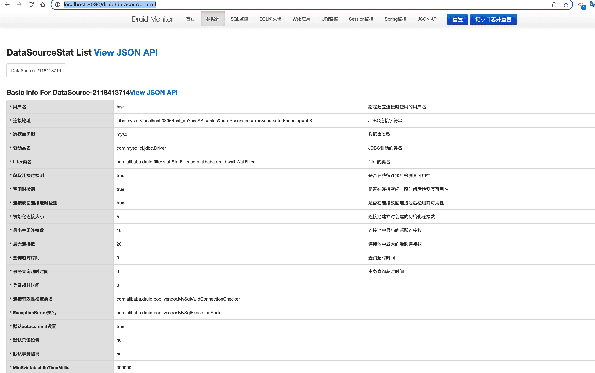
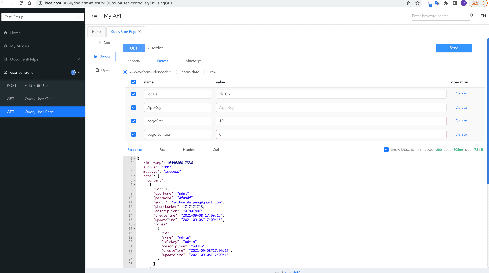
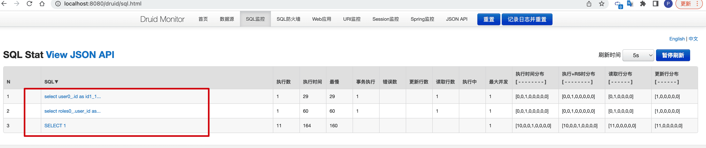

Druid连接池是阿里巴巴开源的数据库连接池项目。Druid连接池为监控而生，内置强大的监控功能，监控特性不影响性能。功能强大，能防SQL注入，内置Loging能诊断Hack应用行为。

* Github项目地址 https://github.com/alibaba/druid
* 文档 https://github.com/alibaba/druid/wiki/%E5%B8%B8%E8%A7%81%E9%97%AE%E9%A2%98
* 下载 http://repo1.maven.org/maven2/com/alibaba/druid/
* 监控DEMO http://120.26.192.168/druid/index.html

## 简单示例
### POM 配置
```xml
<!-- https://mvnrepository.com/artifact/com.alibaba/druid-spring-boot-starter -->
<dependency>
    <groupId>com.alibaba</groupId>
    <artifactId>druid-spring-boot-starter</artifactId>
    <version>1.2.9</version>
</dependency>
```
### yml配置
```yaml
spring:
  datasource:
    url: jdbc:mysql://localhost:3306/test_db?useSSL=false&autoReconnect=true&characterEncoding=utf8
    driver-class-name: com.mysql.cj.jdbc.Driver
    username: root
    password: bfXa4Pt2lUUScy8jakXf
    # Druid datasource
    type: com.alibaba.druid.pool.DruidDataSource
    druid:
      # 初始化大小
      initial-size: 5
      # 最小连接数
      min-idle: 10
      # 最大连接数
      max-active: 20
      # 获取连接时的最大等待时间
      max-wait: 60000
      # 一个连接在池中最小生存的时间，单位是毫秒
      min-evictable-idle-time-millis: 300000
      # 多久才进行一次检测需要关闭的空闲连接，单位是毫秒
      time-between-eviction-runs-millis: 60000
      # 配置扩展插件：stat-监控统计，log4j-日志，wall-防火墙（防止SQL注入），去掉后，监控界面的sql无法统计
      filters: stat,wall
      # 检测连接是否有效的 SQL语句，为空时以下三个配置均无效
      validation-query: SELECT 1
      # 申请连接时执行validationQuery检测连接是否有效，默认true，开启后会降低性能
      test-on-borrow: true
      # 归还连接时执行validationQuery检测连接是否有效，默认false，开启后会降低性能
      test-on-return: true
      # 申请连接时如果空闲时间大于timeBetweenEvictionRunsMillis，执行validationQuery检测连接是否有效，默认false，建议开启，不影响性能
      test-while-idle: true
      # 是否开启 StatViewServlet
      stat-view-servlet:
        enabled: true
        # 设置白名单，不填则允许所有访问
        allow: 127.0.0.1
        # 控制台管理用户名和密码
        login-username: admin
        login-password: admin
      # FilterStat
      filter:
        stat:
          # 是否开启 FilterStat，默认true
          enabled: true
          # 是否开启 慢SQL 记录，默认false
          log-slow-sql: true
          # 慢 SQL 的标准，默认 3000，单位：毫秒
          slow-sql-millis: 5000
          # 合并多个连接池的监控数据，默认false
          merge-sql: false
  jpa:
    open-in-view: false
    generate-ddl: false
    show-sql: false
    properties:
      hibernate:
        dialect: org.hibernate.dialect.MySQLDialect
        format_sql: true
        use-new-id-generator-mappings: false
```
更多的配置，请参考[官方配置](https://github.com/alibaba/druid/wiki/DruidDataSource%E9%85%8D%E7%BD%AE%E5%B1%9E%E6%80%A7%E5%88%97%E8%A1%A8)。

### 测试
访问`http://localhost:8080/druid/datasource.html`

`admin/admin`登录



访问接口，进行 SQL 查询



SQL 和慢查询监控



## Druid 多数据源
### yml配置
```yaml
spring:
  # datasource 数据源配置内容
  datasource:
    # 订单数据源配置
    orders:
      url: jdbc:mysql://127.0.0.1:3306/test_orders?useSSL=false&useUnicode=true&characterEncoding=UTF-8
      driver-class-name: com.mysql.jdbc.Driver
      username: root
      password:
      type: com.alibaba.druid.pool.DruidDataSource # 设置类型为 DruidDataSource
      # Druid 自定义配置，对应 DruidDataSource 中的 setting 方法的属性
      min-idle: 0 # 池中维护的最小空闲连接数，默认为 0 个。
      max-active: 20 # 池中最大连接数，包括闲置和使用中的连接，默认为 8 个。
    # 用户数据源配置
    users:
      url: jdbc:mysql://127.0.0.1:3306/test_users?useSSL=false&useUnicode=true&characterEncoding=UTF-8
      driver-class-name: com.mysql.jdbc.Driver
      username: root
      password:
      type: com.alibaba.druid.pool.DruidDataSource # 设置类型为 DruidDataSource
      # Druid 自定义配置，对应 DruidDataSource 中的 setting 方法的属性
      min-idle: 0 # 池中维护的最小空闲连接数，默认为 0 个。
      max-active: 20 # 池中最大连接数，包括闲置和使用中的连接，默认为 8 个。
    # Druid 自定已配置
    druid:
      # 过滤器配置
      filter:
        stat: # 配置 StatFilter ，对应文档 https://github.com/alibaba/druid/wiki/%E9%85%8D%E7%BD%AE_StatFilter
          log-slow-sql: true # 开启慢查询记录
          slow-sql-millis: 5000 # 慢 SQL 的标准，单位：毫秒
      # StatViewServlet 配置
      stat-view-servlet: # 配置 StatViewServlet ，对应文档 https://github.com/alibaba/druid/wiki/%E9%85%8D%E7%BD%AE_StatViewServlet%E9%85%8D%E7%BD%AE
        enabled: true # 是否开启 StatViewServlet
        login-username: admin # 账号
        login-password: admin # 密码
```
### 数据源配置类
```java
// DataSourceConfig.java

@Configuration
public class DataSourceConfig {

    /**
     * 创建 orders 数据源
     */
    @Primary
    @Bean(name = "ordersDataSource")
    @ConfigurationProperties(prefix = "spring.datasource.orders") // 读取 spring.datasource.orders 配置到 HikariDataSource 对象
    public DataSource ordersDataSource() {
        return DruidDataSourceBuilder.create().build();
    }

    /**
     * 创建 users 数据源
     */
    @Bean(name = "usersDataSource")
    @ConfigurationProperties(prefix = "spring.datasource.users")
    public DataSource usersDataSource() {
        return DruidDataSourceBuilder.create().build();
    }
}
```
