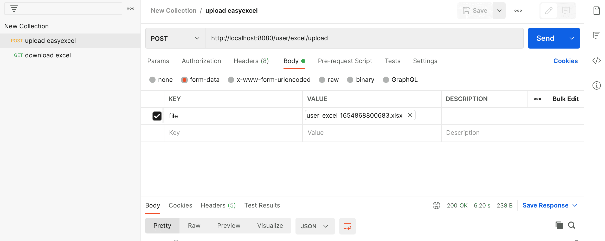
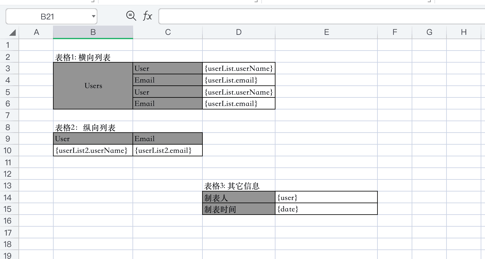

EasyExcel 是一个基于 Java 的、快速、简洁、解决大文件内存溢出的 Excel 处理工具。它能让你在不用考虑性能、内存的等因素的情况下，快速完成 Excel 的读、写等功能。它是基于 POI 来封装实现的，主要解决其易用性，封装性和性能问题。

## 实现案例
### POM 依赖
```xml
<dependency>
    <groupId>com.alibaba</groupId>
    <artifactId>easyexcel</artifactId>
    <version>3.1.1</version>
</dependency>
```
### 导出Excel
```java
// User类
package tech.springboot.file.excel.easyexcel.entity;

import com.alibaba.excel.annotation.ExcelProperty;
import lombok.AllArgsConstructor;
import lombok.Builder;
import lombok.Data;
import lombok.NoArgsConstructor;

@Builder
@Data
@AllArgsConstructor
@NoArgsConstructor
public class User implements BaseEntity {

    @ExcelProperty("ID")
    private Long id;

    @ExcelProperty("Name")
    private String userName;

    @ExcelProperty("Email")
    private String email;

    @ExcelProperty("Phone")
    private long phoneNumber;

    @ExcelProperty("Description")
    private String description;

}
```
`UserController`中导出的方法
```java
@ApiOperation("Download Excel")
@GetMapping("/excel/download")
public void download(HttpServletResponse response) {
    try {
        response.reset();
        response.setContentType("application/vnd.ms-excel");
        response.setHeader("Content-disposition",
                "attachment;filename=user_excel_" + System.currentTimeMillis() + ".xlsx");
        userService.downloadExcel(response.getOutputStream());
    } catch (Exception e) {
        e.printStackTrace();
    }
}
```
`UserServiceImple`中导出 Excel 的主方法
```java
@Override
public void downloadExcel(ServletOutputStream outputStream) {
    EasyExcelFactory.write(outputStream, User.class).sheet("User").doWrite(this::getUserList);
}
private List<User> getUserList() {
    return Collections.singletonList(User.builder()
            .id(1L).userName("pdai").email("pdai@pdai.tech").phoneNumber(121231231231L)
            .description("hello world")
            .build());
}
```
### 导入Excel
我们将上面导出的 excel 文件导入。

`UserController`中导入的方法
```java
@ApiOperation("Upload Excel")
@PostMapping("/excel/upload")
public ResponseResult<String> upload(@RequestParam(value = "file", required = true) MultipartFile file) {
    try {
        userService.upload(file.getInputStream());
    } catch (Exception e) {
        e.printStackTrace();
        return ResponseResult.fail(e.getMessage());
    }
    return ResponseResult.success();
}
```
`UserServiceImpl`中导入 Excel 的主方法
```java
@Override
public void upload(InputStream inputStream) throws IOException {
    // ReadListener不是必须的，它主要的设计是读取excel数据的后置处理(并考虑一次性读取到内存潜在的内存泄漏问题)
    EasyExcelFactory.read(inputStream, User.class, new ReadListener<User>() {

        @Override
        public void invoke(User user, AnalysisContext analysisContext) {
            cachedDataList.add(user);
        }

        @Override
        public void doAfterAllAnalysed(AnalysisContext analysisContext) {
            cachedDataList.forEach(user -> log.info(user.toString()));
        }
    }).sheet().doRead();
}
```
通过 PostMan 进行接口测试



这里注意下，需要有字体的支持，比如如果没有字体支撑将会报如下告警：
```
Warning: the font "Times" is not available, so "Lucida Bright" has been substituted, but may have unexpected appearance or behavor. Re-enable the "Times" font to remove this warning.
```
### 填充Excel模板
我们先来准备一个 excel 模板，考虑了横向表和纵向列表，以及单一信息等，基本上能满足多数的应用场景。



`UserController`中下载填充后的 Excel 方法
```java
@ApiOperation("Fill Excel Template")
@GetMapping("/excel/fill")
public void fillTemplate(HttpServletResponse response) {
    try {
        response.reset();
        response.setContentType("application/vnd.ms-excel");
        response.setHeader("Content-disposition",
                "attachment;filename=user_excel_template_" + System.currentTimeMillis() + ".xlsx");
        userService.fillExcelTemplate(response.getOutputStream());
    } catch (Exception e) {
        e.printStackTrace();
    }
}
```
`UserServiceImpl`中填充 excel 模板的方法
```java
// 模板注意 用{} 来表示你要用的变量 如果本来就有"{","}" 特殊字符 用"\{","\}"代替
// {} 代表普通变量 {.} 代表是list的变量 {前缀.} 前缀可以区分不同的list
@Override
public void fillExcelTemplate(ServletOutputStream outputStream) {

    // 确保文件可访问，这个例子的excel模板，放在根目录下面
    String templateFileName = "/Users/pdai/Downloads/user_excel_template.xlsx";

    // 方案1
    try (ExcelWriter excelWriter = EasyExcelFactory.write(outputStream).withTemplate(templateFileName).build()) {
        WriteSheet writeSheet = EasyExcelFactory.writerSheet().build();
        FillConfig fillConfig = FillConfig.builder().direction(WriteDirectionEnum.HORIZONTAL).build();
        // 如果有多个list 模板上必须有{前缀.} 这里的前缀就是 userList，然后多个list必须用 FillWrapper包裹
        excelWriter.fill(new FillWrapper("userList", getUserList()), fillConfig, writeSheet);
        excelWriter.fill(new FillWrapper("userList", getUserList()), fillConfig, writeSheet);

        excelWriter.fill(new FillWrapper("userList2", getUserList()), writeSheet);
        excelWriter.fill(new FillWrapper("userList2", getUserList()), writeSheet);

        Map<String, Object> map = new HashMap<>();
        map.put("user", "pdai");
        map.put("date", new Date());

        excelWriter.fill(map, writeSheet);
    }
}
```
访问`http://localhost:8080/user/excel/fill`下载。
