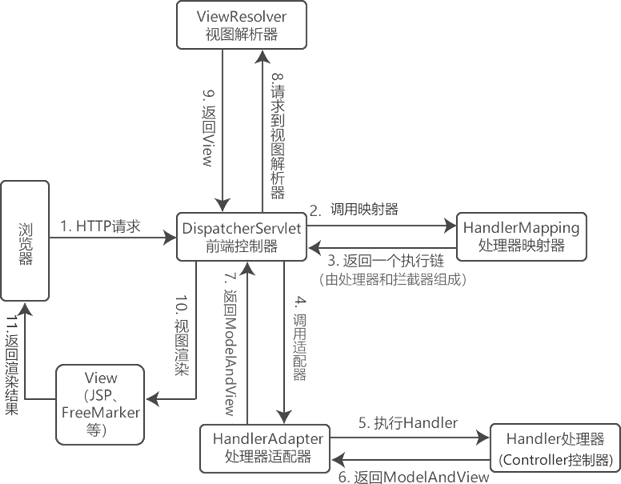

## MVC模式是什么
MVC 模式，全称为`Model-View-Controller`（模型-视图-控制器）模式，它是一种软件架构模式，其目标是将软件的用户界面（即前台页面）和业务逻辑分离，使代码具有更高的可扩展性、可复用性、可维护性以及灵活性。

通常情况下，一个完整的 Java Web 应用程序，其结构如下图所示。

MVC 模式将应用程序划分成模型（`Model`）、视图（`View`）、控制器（`Controller`）等三层，如下图所示。

`Model`（模型）是应用程序的主体部分，主要由以下 2 部分组成：
* 实体类`Bean`：专门用来存储业务数据的对象，它们通常与数据库中的某个表对应，例如`User、Student`等。
* 业务处理`Bean`：指`Service`或`Dao`的对象，专门用于处理业务逻辑、数据库访问。

一个模型可以为多个视图（`View`）提供数据，一套模型（`Model`）的代码只需写一次就可以被多个视图重用，有效地减少了代码的重复性，增加了代码的可复用性。

`View`（视图）指在应用程序中专门用来与浏览器进行交互，展示数据的资源。在 Web 应用中，`View`就是我们常说的前台页面，通常由 HTML、JSP、CSS、JavaScript 等组成。

`Controller`（控制器）通常指的是，应用程序的 Servlet。它负责将用户的请求交给模型（`Model`）层进行处理，并将`Model`层处理完成的数据，返回给视图（`View`）渲染并展示给用户。

在这个过程中，`Controller`层不会做任何业务处理，它只是`View`（视图）层和`Model`（模型）层连接的枢纽，负责调度`View`层和`Model`层，将用户界面和业务逻辑合理的组织在一起，起粘合剂的效果。
### MVC模式 VS 三层架构
和 MVC 模式类似，三层架构同样将系统划分成了 3 层：
* 表示层（UI）：用来实现与用户的交互，接收用户请求，并将请求交给业务逻辑层（BLL）和数据访问层（DAL）进行处理，最后将处理结果返回给用户。
* 业务逻辑层（BLL）：起到承上启下的作用，接收表示层传递来的请求，并针对业务对数据进行处理，以实现业务目标。
* 数据访问层（DAL）：用于实现与数据库的交互和访问，例如从数据库中获取数据、保存或修改数据库中的数据等。

虽然三层架构和 MVC 模式一样，都是将应用划分成了 3 层，但它们的划分方式是不同的。

下图展示了三层架构的划分方式，我们可以很清楚地分辨出它与 MVC 模式的不同。

从上图可以看出，三层架构是由表示层（UI）、业务逻辑层（BLL）和数据访问层（DAL）三个层次构成的，而 MVC 则是由视图（View）层、控制（Controller）层以及模型（Model）层，且它们之间并不是一一对应的。

三层架构和 MVC 模式中各层对应关系如下：
三层架构中的表示层（UI）包含 HTML、JSP 等前台页面以及后台的 Servlet，即它相当于 MVC 模式中的 View 层 + Controller 层。
三层架构中的业务逻辑层（BLL），则只包含了 Service 接口及其实现类（Servicelmpl）的代码，即它相当于 MVC 模式中 Model 层的一部分，并不包含 Dao 和实体类。
三层架构中的数据访问层（DAL），则只包含了 Dao 接口及其实现类（DaoImpl）的代码，即它相当于 MVC 模式中 Model 层的一部分，并不包含 Service 和实体类。

三层架构将应用中的各个模块划分为表示层（UI）、业务逻辑层（BLL）和数据访问层（DAL）等三层，各层之间采用接口相互访问，并通过实体类作为数据传递的载体。不同的实体类一般对应于数据库中不同的数据表，且实体类的属性与数据库表的字段名一一对应 。

从上面的划分方式来看，三层架构和 MVC 模式确实是不一样的，但从它们的核心来看，两者又是一样的，它们的核心都是“分层、解耦”。
### MVC 的工作流程
MVC 的工作流程如下：
用户发送请求到服务器；
在服务器中，请求被控制层（Controller）接收；
Controller 调用相应的 Model 层处理请求；
Model 层处理完毕将结果返回到 Controller；
Controller 再根据 Model 返回的请求处理结果，找到相应的 View 视图；
View 视图渲染数据后最终响应给浏览器。

### MVC 的优点
MVC 模式具有以下优点：
降低代码耦合性：在 MVC 模式中，三层之间相互独立，各司其职。一旦某一层的需求发生了变化，我们就只需要更改相应层中的代码即可，而不会对其他层中的代码造成影响。
有利于分工合作：在 MVC 模式中，将应用系统划分成了三个不同的层次，可以更好地实现开发分工。例如，网页设计人员专注于视图（View）层的开发，而那些对业务熟悉的开发人员对 Model 层进行开发，其他对业务不熟悉的开发人员则可以对 Controller 层进行开发。
有利于组件的重用：在 MVC 中，多个视图（View）可以共享同一个模型（Model），大大提高了系统中代码的可重用性。
### MVC 的不足
MVC 模式存在以下不足之处：
增加了系统结构和实现的复杂性：对于简单的应用，如果也严格遵循 MVC 模式，按照模型、视图与控制器对系统进行划分，无疑会增加系统结构的复杂性，并可能产生过多的更新操作，降低运行效率。
视图与控制器间的联系过于紧密：虽然视图与控制器是相互分离的，但它们之间联系却是十分紧密的。视图没有控制器的存在，其应用是很有限的，反之亦然，这样就妨碍了它们的独立重用。
视图对模型数据的低效率访问：视图可能需要多次调用才能获得足够的显示数据。对未变化数据的不必要的频繁访问，也将损害操作性能。

MVC 并不适合小型甚至中型规模的项目，花费大量时间将 MVC 应用到规模并不是很大的应用程序中，通常会得不偿失，因此对于 MVC 设计模式的使用要根据具体的应用场景来决定。
## Spring MVC是什么
Spring MVC（全称 Spring Web MVC）是 Spring 框架提供的一款基于 MVC 模式的轻量级 Web 开发框架，是 Spring 为表示层（UI）开发提供的一整套完备的解决方案。

Spring MVC 使用 MVC 架构模式的思想，将 Web 应用进行职责解构，把一个复杂的 Web 应用划分成模型（Model）、控制器（Contorller）以及视图（View）三层，有效地简化了 Web 应用的开发，降低了出错风险，同时也方便了开发人员之间的分工配合。

Spring MVC 各层的职责如下：
Model：负责对请求进行处理，并将结果返回给 Controller；
View：负责将请求的处理结果进行渲染，展示在客户端浏览器上；
Controller：是 Model 和 View 交互的纽带；主要负责接收用户请求，并调用 Model 对请求处理，然后将 Model 的处理结果传递给 View。

Spring MVC 本质是对 Servlet 的进一步封装，其最核心的组件是 DispatcherServlet，它是 Spring MVC 的前端控制器，主要负责对请求和响应的统一地处理和分发。Controller 接收到的请求其实就是 DispatcherServlet 根据一定的规则分发给它的。

Spring MVC 框架内部采用松耦合、可插拔的组件结构，具有高度可配置性，比起其他的 MVC 框架更具有扩展性和灵活性。此外，Spring MVC 的注解驱动（annotation-driven）和对 REST 风格的支持，也是它最具有特色的功能。

Spring MVC 是 Spring 框架的众多子项目之一，自 Spring 框架诞生之日起就包含在 Spring 框架中了，它可以与 Spring 框架无缝集成，在性能方面具有先天的优越性。对于开发者来说，Spring MVC 的开发效率要明显高于其它的 Web 框架，因此 Spring MVC 在企业中得到了广泛的应用，成为目前业界最主流的 MVC 框架之一。

### Spring MVC 的特点
Spring MVC 具有以下特点：
Spring MVC 是 Spring 家族原生产品，可以与 IoC 容器等 Spring 基础设施无缝对接；
Spring MVC 支持各种视图技术，例如 JSP、Thymeleaf、 JSP 和 FreeMaker 等。
Spring MVC 基于原生的 Servlet 实现，通过功能强大的前端控制器 DispatcherServlet，对请求和响应进行统一处理；
Spring MVC 对表示层各细分领域需要解决的问题全方位覆盖，并提供一整套全面的解决方案；
代码清新简洁，大幅度提升开发效率；
内部组件化程度高，可插拔式组件即插即用，想要使用什么功能，配置相应组件即可；
性能卓著，尤其适合现代大型、超大型互联网项目的开发。

## Spring MVC工作流程

SpringMVC 的执行流程如下。
用户通过浏览器发起一个 HTTP 请求，该请求会被 DispatcherServlet（前端控制器）拦截；
DispatcherServlet 调用 HandlerMapping（处理器映射器）找到具体的处理器（Handler）及拦截器，最后以 HandlerExecutionChain 执行链的形式返回给 DispatcherServlet。
DispatcherServlet 将执行链返回的 Handler 信息发送给 HandlerAdapter（处理器适配器）；
HandlerAdapter 根据 Handler 信息找到并执行相应的 Handler（即 Controller 控制器）对请求进行处理；
Handler 执行完毕后会返回给 HandlerAdapter 一个 ModelAndView 对象（Spring MVC 的底层对象，包括 Model 数据模型和 View 视图信息）；
HandlerAdapter 接收到 ModelAndView 对象后，将其返回给 DispatcherServlet ；
DispatcherServlet 接收到 ModelAndView 对象后，会请求 ViewResolver（视图解析器）对视图进行解析；
ViewResolver 解析完成后，会将 View 视图并返回给 DispatcherServlet；
DispatcherServlet 接收到具体的 View 视图后，进行视图渲染，将 Model 中的模型数据填充到 View 视图中的 request 域，生成最终的 View（视图）；
视图负责将结果显示到浏览器（客户端）。

### Spring MVC 常用组件
Spring MVC 的常用组件共有 6 个，它们分别是： DispatcherServlet（前端控制器）、HandlerMapping（处理器映射器）、HandlerAdapter（处理器适配器）、Handler（处理器）、ViewResolver（视图解析器）和 View（视图）。

| 组件                         | 提供者     | 描述                                                             |
|----------------------------|---------|----------------------------------------------------------------|
| DispatcherServlet 前端控制器 | 框架提供    | 它是整个 Spring MVC 流程控制中心，负责统一处理请求和响应，调用其他组件对用户请求进行处理             |
| HandlerMapping 处理器映射器   | 框架提供    | 根据请求的 url、method 等信息查找相应的 Handler                              |
| Handler 处理器             | 开发人员提供  | 通常被称为 Controller（控制器）。它可以在 DispatcherServlet 的控制下，对具体的用户请求进行处理 |
| HandlerAdapter 处理器适配器   | 框架提供    | 负责调用具体的控制器方法，对用户发来的请求来进行处理。                                    |
| ViewResolver 视图解析器      | 框架提供    | 其职责是对视图进行解析，得到相应的视图对象。                                         |
| View 视图                 | 开发人员提供	 | 将模型（Model）数据通过页面展示给用户                                          |
