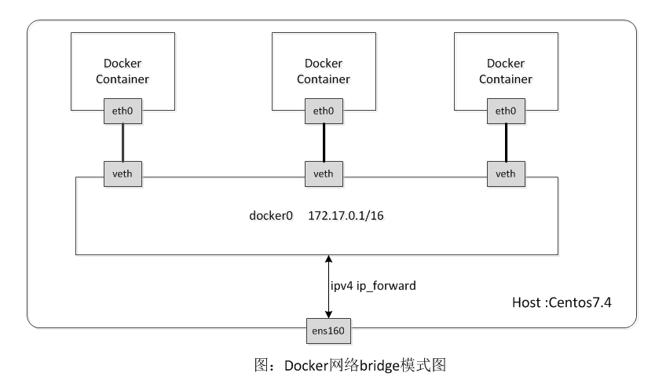
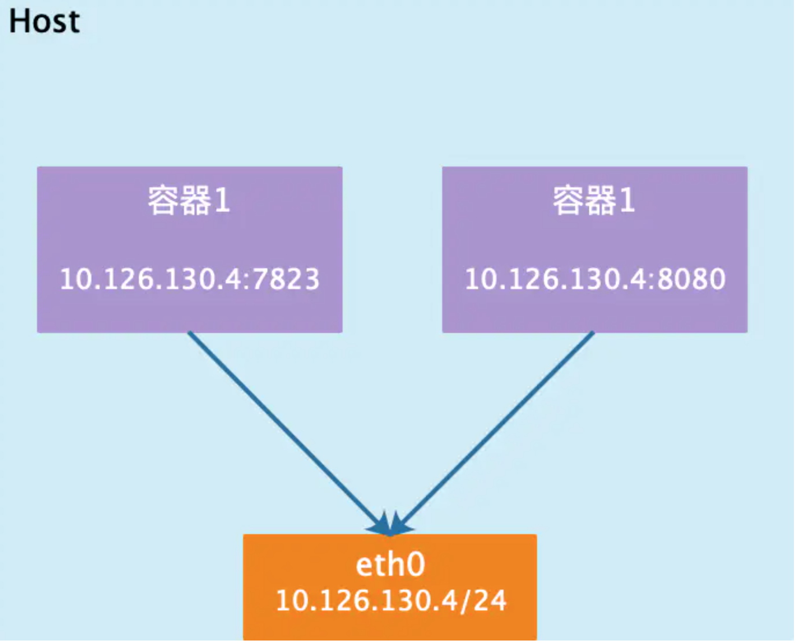
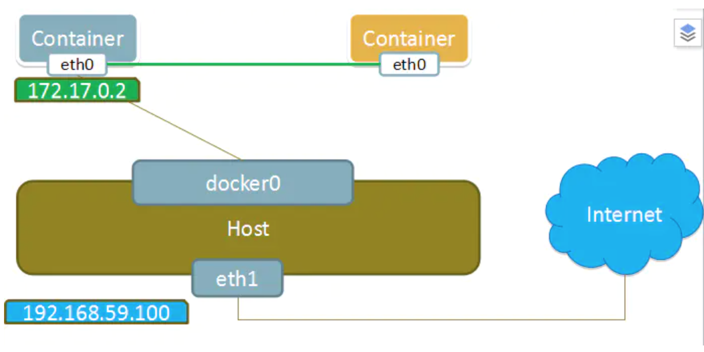
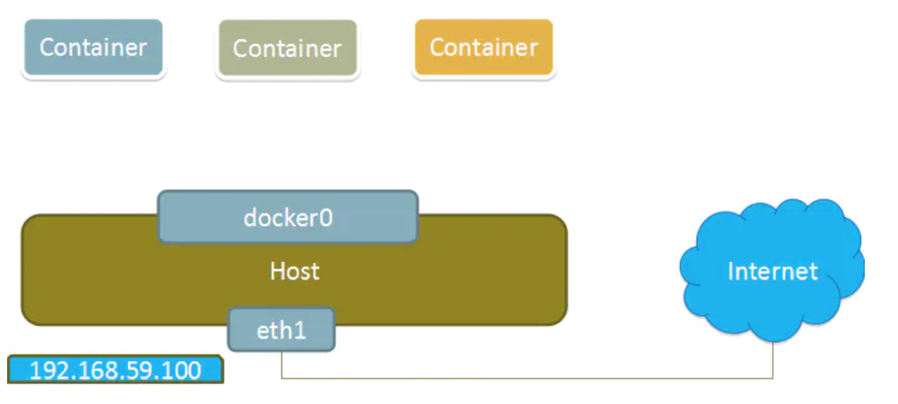
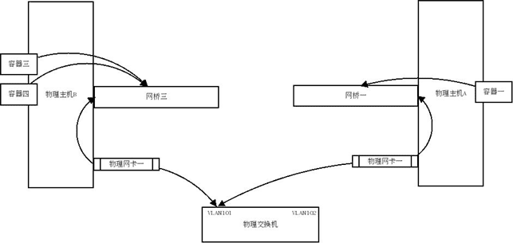

## 使用网络
Docker 允许通过外部访问容器或容器互联的方式来提供网络服务。
### 外部访问容器
容器中可以运行一些网络应用，要让外部也可以访问这些应用，可以通过`-P`或`-p`参数来指定端口映射。
* 当使用`-P`标记时，Docker 会随机映射一个端口到内部容器开放的网络端口。
* `-p`则可以指定要映射的端口，并且，在一个指定端口上只可以绑定一个容器。支持的格式有`ip:hostPort:containerPort | ip::containerPort | hostPort:containerPort`。

**映射所有接口地址**

本地的 80 端口映射到容器的 80 端口，可以执行
```shell
docker run -d -p 80:80 nginx:alpine
```
**映射到指定地址的指定端口**

可以使用`ip:hostPort:containerPort`格式指定映射使用一个特定地址，比如`localhost`地址`127.0.0.1`
```shell
docker run -d -p 127.0.0.1:80:80 nginx:alpine
```
**映射到指定地址的任意端口**

使用`ip::containerPort`绑定`localhost`的任意端口到容器的 80 端口，本地主机会自动分配一个端口。
```shell
docker run -d -p 127.0.0.1::80 nginx:alpine
```
还可以使用`udp`标记来指定`udp`端口
```shell
docker run -d -p 127.0.0.1:80:80/udp nginx:alpine
```

**`-p`标记可以多次使用来绑定多个端口**
```shell
docker run -d -p 80:80  -p 443:443 nginx:alpine
```
## Docker网络原理
当 Docker 启动时，会自动在主机上创建一个`docker0`虚拟网桥，实际上是 Linux 的一个`bridge`，可以理解为一个虚拟交换机。它会在挂载到它的网口之间进行转发。

同时，Docker 随机分配一个本地未占用的私有网段中的一个地址给`docker0`接口。比如`172.17.0.1`，掩码为`255.255.0.0`。此后启动的容器内的网口也会自动分配一个同一网段（`172.17.0.0/16`）的地址。

当创建一个 Docker 容器的时候，同时会创建了一对`veth pair`接口（当数据包发送到一个接口时，另外一个接口也可以收到相同的数据包）。这对接口一端在容器内，即`eth0`；另一端在本地并被挂载到`docker0`网桥，名称以`veth`开头（例如`vethAQI2QT`）。通过这种方式，主机可以跟容器通信，容器之间也可以相互通信。Docker 就创建了在主机和所有容器之间一个虚拟共享网络。


### 理解 Docker 默认网桥
在安装 Docker 服务后默认会创建一个`docker0`网桥（其上有一个`docker0`内部接口），它在内核层连通了其他的物理或虚拟网卡，这就将所有容器和本地主机都放到同一个物理网络。

我们可用`docker network ls`命令查看：
```shell
[root@localhost ~]# docker network ls
NETWORK ID     NAME      DRIVER    SCOPE
1b5de2e1b9cd   bridge    bridge    local
04840f8a5cc6   host      host      local
15db1739ccef   none      null      local
```
Docker 安装时会自动在`host`上创建三个网络：`none、host`和`bridge`。我们看下`docker0`网桥：(`brctl`可以通过`yum install bridge-utils`安装)
```shell
[root@localhost ~]# brctl show
bridge name     bridge id               STP enabled     interfaces
docker0         8000.024236f275b4       no
[root@localhost ~]# ip a
1: lo: <LOOPBACK,UP,LOWER_UP> mtu 65536 qdisc noqueue state UNKNOWN group default qlen 1000
    link/loopback 00:00:00:00:00:00 brd 00:00:00:00:00:00
    inet 127.0.0.1/8 scope host lo
       valid_lft forever preferred_lft forever
    inet6 ::1/128 scope host 
       valid_lft forever preferred_lft forever
2: eth0: <BROADCAST,MULTICAST,UP,LOWER_UP> mtu 1500 qdisc mq state UP group default qlen 1000
    link/ether 52:54:00:d3:d4:65 brd ff:ff:ff:ff:ff:ff
    inet 10.2.20.4/22 brd 10.2.23.255 scope global eth0
       valid_lft forever preferred_lft forever
    inet6 fe80::5054:ff:fed3:d465/64 scope link 
       valid_lft forever preferred_lft forever
3: docker0: <NO-CARRIER,BROADCAST,MULTICAST,UP> mtu 1500 qdisc noqueue state DOWN group default 
    link/ether 02:42:36:f2:75:b4 brd ff:ff:ff:ff:ff:ff
    inet 172.17.0.1/16 brd 172.17.255.255 scope global docker0
       valid_lft forever preferred_lft forever
    inet6 fe80::42:36ff:fef2:75b4/64 scope link 
       valid_lft forever preferred_lft forever

[root@localhost ~]# ip route
default via 10.2.20.1 dev eth0 
10.2.20.0/22 dev eth0 proto kernel scope link src 10.2.20.4 
169.254.0.0/16 dev eth0 scope link metric 1002 
172.17.0.0/16 dev docker0 proto kernel scope link src 172.17.0.1 
```
再用`docker network inspect`指令查看`bridge`网络：其`Gateway`就是网卡/接口`docker0`的 IP 地址：`172.17.0.1`。
```shell
[root@localhost ~]# docker network inspect bridge
[
    {
        "Name": "bridge",
        "Id": "1b5de2e1b9cde4609f7272df118ea890d827e3fee5cbfc7a299defb0623cb434",
        "Created": "2024-08-01T10:35:07.355894408+08:00",
        "Scope": "local",
        "Driver": "bridge",
        "EnableIPv6": false,
        "IPAM": {
            "Driver": "default",
            "Options": null,
            "Config": [
                {
                    "Subnet": "172.17.0.0/16",
                    "Gateway": "172.17.0.1"
                }
            ]
        },
        "Internal": false,
        "Attachable": false,
        "Ingress": false,
        "ConfigFrom": {
            "Network": ""
        },
        "ConfigOnly": false,
        "Containers": {},
        "Options": {
            "com.docker.network.bridge.default_bridge": "true",
            "com.docker.network.bridge.enable_icc": "true",
            "com.docker.network.bridge.enable_ip_masquerade": "true",
            "com.docker.network.bridge.host_binding_ipv4": "0.0.0.0",
            "com.docker.network.bridge.name": "docker0",
            "com.docker.network.driver.mtu": "1500"
        },
        "Labels": {}
    }
]
```
从上面你可以看到`bridge`的配置信息和容器信息。
### 理解容器创建时的IP分配
为了理解容器创建时的 IP 分配，这里需要清理所有已经启动的环境，然后再启动容器，看前后对比我们清理所有容器实例，下面展示的就是 docker 安装之后的, 注意和上面的对比下：
```shell
[root@localhost ~]# docker ps -a
CONTAINER ID   IMAGE     COMMAND   CREATED   STATUS    PORTS     NAMES
[root@localhost ~]# docker network ls
NETWORK ID     NAME      DRIVER    SCOPE
1b5de2e1b9cd   bridge    bridge    local
04840f8a5cc6   host      host      local
15db1739ccef   none      null      local
[root@localhost ~]# docker network inspect bridge
[
    {
        "Name": "bridge",
        "Id": "1b5de2e1b9cde4609f7272df118ea890d827e3fee5cbfc7a299defb0623cb434",
        "Created": "2024-08-01T10:35:07.355894408+08:00",
        "Scope": "local",
        "Driver": "bridge",
        "EnableIPv6": false,
        "IPAM": {
            "Driver": "default",
            "Options": null,
            "Config": [
                {
                    "Subnet": "172.17.0.0/16",
                    "Gateway": "172.17.0.1"
                }
            ]
        },
        "Internal": false,
        "Attachable": false,
        "Ingress": false,
        "ConfigFrom": {
            "Network": ""
        },
        "ConfigOnly": false,
        "Containers": {},
        "Options": {
            "com.docker.network.bridge.default_bridge": "true",
            "com.docker.network.bridge.enable_icc": "true",
            "com.docker.network.bridge.enable_ip_masquerade": "true",
            "com.docker.network.bridge.host_binding_ipv4": "0.0.0.0",
            "com.docker.network.bridge.name": "docker0",
            "com.docker.network.driver.mtu": "1500"
        },
        "Labels": {}
    }
]
[root@localhost ~]# ip a
1: lo: <LOOPBACK,UP,LOWER_UP> mtu 65536 qdisc noqueue state UNKNOWN group default qlen 1000
    link/loopback 00:00:00:00:00:00 brd 00:00:00:00:00:00
    inet 127.0.0.1/8 scope host lo
       valid_lft forever preferred_lft forever
    inet6 ::1/128 scope host 
       valid_lft forever preferred_lft forever
2: eth0: <BROADCAST,MULTICAST,UP,LOWER_UP> mtu 1500 qdisc mq state UP group default qlen 1000
    link/ether 52:54:00:d3:d4:65 brd ff:ff:ff:ff:ff:ff
    inet 10.2.20.4/22 brd 10.2.23.255 scope global eth0
       valid_lft forever preferred_lft forever
    inet6 fe80::5054:ff:fed3:d465/64 scope link 
       valid_lft forever preferred_lft forever
3: docker0: <NO-CARRIER,BROADCAST,MULTICAST,UP> mtu 1500 qdisc noqueue state DOWN group default 
    link/ether 02:42:36:f2:75:b4 brd ff:ff:ff:ff:ff:ff
    inet 172.17.0.1/16 brd 172.17.255.255 scope global docker0
       valid_lft forever preferred_lft forever
    inet6 fe80::42:36ff:fef2:75b4/64 scope link 
       valid_lft forever preferred_lft forever
[root@localhost ~]# brctl show
bridge name     bridge id               STP enabled     interfaces
docker0         8000.024236f275b4       no
```
Docker 在创建一个容器的时候，会执行如下操作：
* 创建一对虚拟接口/网卡，也就是`veth pair`，分别放到本地主机和新容器中；
* 本地主机一端桥接到默认的`docker0`或指定网桥上，并具有一个唯一的名字，如`vethxxxxx`；
* 容器一端放到新容器中，并修改名字作为`eth0`，这个网卡/接口只在容器的名字空间可见；
* 从网桥可用地址段中（也就是与该`bridge`对应的`network`）获取一个空闲地址分配给容器的`eth0`，并配置默认路由到桥接网卡`vethxxxx`。

让我们启动一个容器，看下变化：
```shell
[root@localhost ~]# docker run -d --name nginx nginx
4c5ea34f51285140bf6bd4f270f693ef2cdbd679506f53120193df66dbde1fbb
[root@localhost ~]# brctl show
bridge name     bridge id               STP enabled     interfaces
docker0         8000.024236f275b4       no              vethd9746c7
[root@localhost ~]# ip a | grep vethd9746c7
27: vethd9746c7@if26: <BROADCAST,MULTICAST,UP,LOWER_UP> mtu 1500 qdisc noqueue master docker0 state UP group default
[root@localhost ~]# docker network inspect bridge
[
    {
        "Name": "bridge",
        "Id": "1b5de2e1b9cde4609f7272df118ea890d827e3fee5cbfc7a299defb0623cb434",
        "Created": "2024-08-01T10:35:07.355894408+08:00",
        "Scope": "local",
        "Driver": "bridge",
        "EnableIPv6": false,
        "IPAM": {
            "Driver": "default",
            "Options": null,
            "Config": [
                {
                    "Subnet": "172.17.0.0/16",
                    "Gateway": "172.17.0.1"
                }
            ]
        },
        "Internal": false,
        "Attachable": false,
        "Ingress": false,
        "ConfigFrom": {
            "Network": ""
        },
        "ConfigOnly": false,
        "Containers": {
            "4c5ea34f51285140bf6bd4f270f693ef2cdbd679506f53120193df66dbde1fbb": {
                "Name": "nginx",
                "EndpointID": "a4ee4c931d0702872a0a90279de3e2d12e159b35b9e3004d68e255168e84819f",
                "MacAddress": "02:42:ac:11:00:02",
                "IPv4Address": "172.17.0.2/16",
                "IPv6Address": ""
            }
        },
        "Options": {
            "com.docker.network.bridge.default_bridge": "true",
            "com.docker.network.bridge.enable_icc": "true",
            "com.docker.network.bridge.enable_ip_masquerade": "true",
            "com.docker.network.bridge.host_binding_ipv4": "0.0.0.0",
            "com.docker.network.bridge.name": "docker0",
            "com.docker.network.driver.mtu": "1500"
        },
        "Labels": {}
    }
]
```
如果不指定`--network`，创建的容器默认都会挂到`docker0`上，使用本地主机上`docker0`接口的 IP 作为所有容器的默认网关当有多个容器创建后，容器网络拓扑结构如下：



### 理解容器和docker0的虚拟网卡的配对
在上图中容器中`eth0`是怎么和`host`中虚拟网卡配对上的呢？
```shell
[root@localhost ~]# docker ps -a
CONTAINER ID   IMAGE     COMMAND                  CREATED         STATUS         PORTS     NAMES
4c5ea34f5128   nginx     "/docker-entrypoint.…"   7 minutes ago   Up 7 minutes   80/tcp    nginx
[root@localhost ~]# docker exec -it 4c5ea34f5128 /bin/bash
[root@localhost ~]# apt-get update && apt-get install -y iproute2
root@4c5ea34f5128:/# ip a
1: lo: <LOOPBACK,UP,LOWER_UP> mtu 65536 qdisc noqueue state UNKNOWN group default qlen 1000
    link/loopback 00:00:00:00:00:00 brd 00:00:00:00:00:00
    inet 127.0.0.1/8 scope host lo
       valid_lft forever preferred_lft forever
    inet6 ::1/128 scope host 
       valid_lft forever preferred_lft forever
26: eth0@if27: <BROADCAST,MULTICAST,UP,LOWER_UP> mtu 1500 qdisc noqueue state UP group default 
    link/ether 02:42:ac:11:00:02 brd ff:ff:ff:ff:ff:ff link-netnsid 0
    inet 172.17.0.2/16 brd 172.17.255.255 scope global eth0
       valid_lft forever preferred_lft forever
```
我们可以看到`host`上`27: vethd9746c7@if26`对应着容器中`26: eth0@if27`；即`host`中`index=27`的接口/网卡`vethd9746c7`的`peer inferface index`是 26，`container`中`index=26`的网卡`eth0`的`peer interface index`是 27。可以利用`ethtool`来确认这种对应关系：分别在`host`和`container`中运行指令`ethtool -S <interface>`：
```shell
[root@localhost ~]# ethtool -S vethd9746c7
NIC statistics:
     peer_ifindex: 27
[root@localhost ~]# docker exec -it 4c5ea34f5128 /bin/bash
root@4c5ea34f5128:/# ip a | grep 26
26: eth0@if27: <BROADCAST,MULTICAST,UP,LOWER_UP> mtu 1500 qdisc noqueue state UP group default 
root@4c5ea34f5128:/#
```
## 四类网络模式
安装 Docker 时，它会自动创建三个网络，`bridge`（创建容器默认连接到此网络）、`none`、`host`。

|  网络模式   | 说明                                                                                  |
|:---------:|:------------------------------------------------------------------------------------|
|   Host    | 容器将不会虚拟出自己的网卡，配置自己的 IP 等，而是使用宿主机的 IP 和端口。                                           |
|  Bridge   | 此模式会为每一个容器分配、设置 IP 等，并将容器连接到一个 docker0 虚拟网桥，通过 docker0 网桥以及 Iptables nat 表配置与宿主机通信。 |
|   None    | 该模式关闭了容器的网络功能。                                                                      |
| Container | 创建的容器不会创建自己的网卡，配置自己的 IP，而是和一个指定的容器共享 IP、端口范围。                                       |

我们在使用`docker run`创建 Docker 容器时，可以用`--net`选项指定容器的网络模式，Docker 可以有以下 4 种网络模式：
* `host`模式：使用`--net=host`指定
* `none`模式：使用`--net=none`指定
* `bridge`模式：使用`--net=bridge`指定，默认设置。
* `container`模式：使用`--net=container:NAME_or_ID`指定。

### host模式
相当于 Vmware 中的桥接模式，与宿主机在同一个网络中，但没有独立 IP 地址。

Docker 使用了 Linux 的`Namespaces`技术来进行资源隔离，如`PID Namespace`隔离进程，`Mount Namespace`隔离文件系统，`Network Namespace`隔离网络等。

一个`Network Namespace`提供了一份独立的网络环境，包括网卡、路由、`Iptable`规则等都与其他的`Network Namespace`隔离。一个 Docker 容器一般会分配一个独立的`Network Namespace`。但如果启动容器的时候使用`host`模式，那么这个容器将不会获得一个独立的`Network Namespace`，而是和宿主机共用一个`Network Namespace`。容器将不会虚拟出自己的网卡，配置自己的 IP 等，而是使用宿主机的 IP 和端口。

使用`host`模式的容器可以直接使用宿主机的 IP 地址与外界通信，容器内部的服务端口也可以使用宿主机的端口，不需要进行 NAT，`host`最大的优势就是网络性能比较好，但是`docker host`上已经使用的端口就不能再用了，网络的隔离性不好。

例如，我们在`172.25.6.1/24`的机器上用`host`模式启动一个`ubuntu`容器
```shell
[root@localhost ~]# docker run -it --network=host ubuntu
```
`Host`模式如下图所示：



### container模式
这个模式指定新创建的容器和已经存在的一个容器共享一个`Network Namespace`，而不是和宿主机共享。新创建的容器不会创建自己的网卡，配置自己的 IP，而是和一个指定的容器共享 IP、端口范围等。同样，两个容器除了网络方面，其他的如文件系统、进程列表等还是隔离的。两个容器的进程可以通过`lo`网卡设备通信。

`Container`模式示意图：



### none模式
该模式将容器放置在它自己的网络栈中，但是并不进行任何配置。实际上，该模式关闭了容器的网络功能在以下两种情况下是有用的：
* 容器并不需要网络（例如只需要写磁盘卷的批处理任务）。
* `overlay`：在 docker1.8 新加入的一个`overlay`网络模式。Docker 对于网络访问的控制也是在逐渐完善的。

`None`模式示意图:



### bridge模式
相当于 Vmware 中的 NAT 模式，容器使用独立`network Namespace`，并连接到`docker0`虚拟网卡（默认模式）。通过`docker0`网桥以及`Iptables nat`表配置与宿主机通信；`bridge`模式是 Docker 默认的网络设置，此模式会为每一个容器分配`Network Namespace`、设置 IP 等，并将一个主机上的 Docker 容器连接到一个虚拟网桥上。

当 Docker 进程启动时，会在主机上创建一个名为`docker0`的虚拟网桥，此主机上启动的 Docker 容器会连接到这个虚拟网桥上。虚拟网桥的工作方式和物理交换机类似，这样主机上的所有容器就通过交换机连在了一个二层网络中。

从`docker0`子网中分配一个 IP 给容器使用，并设置`docker0`的 IP 地址为容器的默认网关。在主机上创建一对虚拟网卡`veth pair`设备，Docker 将`veth pair`设备的一端放在新创建的容器中，并命名为`eth0`（容器的网卡），另一端放在主机中，以`vethxxx`这样类似的名字命名，并将这个网络设备加入到`docker0`网桥中。可以通过`brctl show`命令查看。

`bridge`模式是 Docker 的默认网络模式，不写`--net`参数，就是`bridge`模式。使用`docker run -p`时，Docker 实际是在`iptables`做了 DNAT 规则，实现端口转发功能。可以使用`iptables -t nat -vnL`查看。

`bridge`模式如下图所示：

[Host 模式](Docker的网络/4.png)

## 多物理机之间互联
如果在企业内部应用，或者做多个物理主机的集群，可能需要将多个物理主机的容器组到一个物理网络中来，那么就需要将这个网桥桥接到我们指定的网卡上。
### 拓扑图
主机 A 和主机 B 的网卡一都连着物理交换机的同一个`vlan 101`，这样网桥一和网桥三就相当于在同一个物理网络中了，而容器一、容器三、容器四也在同一物理网络中了，他们之间可以相互通信，而且可以跟同一`vlan`中的其他物理机器互联。



### ubuntu 示例
下面以 ubuntu 为例创建多个主机的容器联网: 创建自己的网桥，编辑`/etc/network/interface`文件
```
auto br0
iface br0 inet static
address 192.168.7.31
netmask 255.255.240.0
gateway 192.168.7.254
bridge_ports em1
bridge_stp off
dns-nameservers 8.8.8.8 192.168.6.1
```
将 Docker 的默认网桥绑定到这个新建的`br0`上面，这样就将这台机器上容器绑定到`em1`这个网卡所对应的物理网络上了。ubuntu 修改`/etc/default/docker`文件，添加最后一行内容
```
# Docker Upstart and SysVinit configuration file
# Customize location of Docker binary (especially for development testing).
#DOCKER="/usr/local/bin/docker"
# Use DOCKER_OPTS to modify the daemon startup options.
#DOCKER_OPTS="--dns 8.8.8.8 --dns 8.8.4.4"

# If you need Docker to use an HTTP proxy, it can also be specified here.
#export http_proxy="http://127.0.0.1:3128/"

# This is also a handy place to tweak where Docker's temporary files go.
#export TMPDIR="/mnt/bigdrive/docker-tmp"

DOCKER_OPTS="-b=br0"
```
在启动 Docker 的时候 使用`-b`参数将容器绑定到物理网络上。重启 Docker 服务后，再进入容器可以看到它已经绑定到你的物理网络上了。
```shell
root@localhost:~# docker ps
CONTAINER ID        IMAGE               COMMAND             CREATED             STATUS              PORTS                        NAMES
58b043aa05eb        desk_hz:v1          "/startup.sh"       5 days ago          Up 2 seconds        5900/tcp, 6080/tcp, 22/tcp   yanlx
root@localhost:~# brctl show
bridge name     bridge id               STP enabled     interfaces
br0             8000.7e6e617c8d53       no              em1
```
这样就直接把容器暴露到物理网络上了，多台物理主机的容器也可以相互联网了。需要注意的是，这样就需要自己来保证容器的网络安全了。
