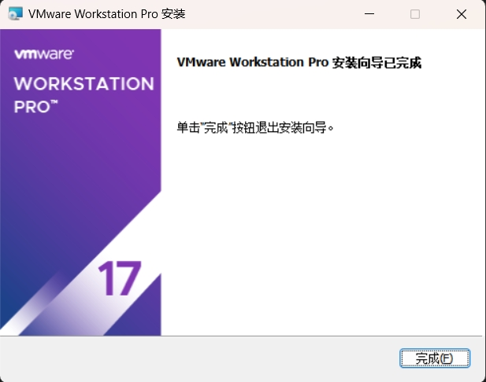

## 安装VMware
VMware Workstation 是一款桌面虚拟机软件，我们可以利用它来创建 Windows、Linux 等虚拟机。

下载[VMware Workstation Pro 17 安装包](https://pan.baidu.com/s/1o_LwUasa7_JUiIg9fVyPzQ?pwd=e5cw)，双击安装包进行安装，点击“下一步”。


勾选“我接受许可协议中的条款”，然后“下一步”。


选择安装位置，然后“下一步”。


勾选两个选项，然后“下一步”。


点击“安装”。


点击“许可证”。


许可证密钥已内置，直接点击“输入”。


完成安装。



## 安装 CentOS9
准备镜像文件：`CentOS-8.1.1911-x86_64-dvd1.iso`。

官网下载地址：`https://www.centos.org/download`。

双击，运行 VMware Workstation 软件，点击“文件”-->新建虚拟机-->选择“自定义（高级）”-->下一步。


选择兼容性，下一步。


选择“稍后安装操作系统”，下一步。


选择客户机操作系统，这里没有 Centos9，选择 Centos8 或 7即可。


设置虚拟机名称；选择虚拟机安装位置。


设置虚拟机处理器的数量。


设置虚拟机内存大小。


设置网络类型。


选择 I/O控制器类型，默认即可。


选择磁盘类型，默认即可。


选择磁盘，默认即可。


指定磁盘容量，一般 40G。
:::tip
注意：选择该模式并不会立即分配磁盘容量。它的磁盘空间是随着用户数据的添加而不断变大。
:::


指定磁盘文件名称。


点击“完成”，完成虚拟机创建。


挂载虚拟光驱，根据箭头方向指示即可。


启动虚拟机。


## 安装操作系统
启动虚拟机，选择第一行，进行安装。


选择系统使用的语言。


选择安装目标位置。


安装目标位置默认即可，点击完成。


点击软件选择，选择要安装的软件。


基本环境：
* 带有 GUI 的服务器（`Server with GUI`）：一个集成的、易于管理的服务器，具有图形界面。
* 服务器（`Server`）：一个集成的、易于管理的服务器。
* 最少安装（`Minimal Install`）：（服务器首选）基本功能
* 工作站（`Workstation`）：（个人用户系统）工作站是一个用户友好的笔记本电脑和个人电脑桌面系统
* 自定义操作系统（`Custom Operating System`）：自定义 RHEL 系统的基本构建块
* 虚拟化主机（`Virtualization Host`）：最小虚拟化主机

环境的附加软件：

|               选项               |      软件名      | 说明                                        |
|:------------------------------:|:-------------:|:------------------------------------------|
|        Debugging Tools         |     调试工具      | 用于调试行为不端的应用程序和诊断性能问题的工具                   |
|        DNS Name Server         |   DNS名称服务器    | 此程序包组允许您在系统上运行DNS名称服务器（BIND）              |
|    File and Storage Server     |   文件和存储服务器    | CIFS、SMB、NFS、ISCSI、ISER和ISNS网络存储服务器       |
|           FTP Server           |    FTP服务器     | FTP服务器                                    |
|          Guest Agents          |    代理         | 在虚拟机监控程序下运行时使用的代理                         |
|       Infiniband Support       | Infiniband支持  | Infiniband相关                              |
|          Mail Server           |     邮件服务器     | 这些软件包允许您配置IMAP或SMTP邮件服务器                  |
|   Network File System Client   |   网络文件系统客户端   | 使系统能够连接到网络存储                              |
|        Network Servers         |     网络服务器     | 这些软件包包括基于网络的服务器，如DHCP、Kerberosan和NIS      |
|       Performance Tools        |     性能工具      | 用于诊断系统和应用程序级别性能问题的工具                      |
|     Remote Desktop Clients     |    远程桌面客户端    | Red Hat Enterprise Linux的远程管理界面           |
|  Remote Management for Linux   |  Linux的远程管理   | Red Hat Enterprise Linux的远程管理界面           |
|      Windows File Server       | Windows文件服务器  | 该软件包组允许您在Linux和MS Windows（tm）系统之间共享文件     |
|     Virtualization Client      |    虚拟化客户端     | 用于安装和管理虚拟化实例的客户端                          |
|   Virtualization Hypervisor    |     管理程序      | 尽可能小的虚拟化主机安装                              |
|      Virtualization Tools      |     虚拟化工具     | 用于脱机虚拟映像管理的工具                             |
|        Basic Web Server        |   基本Web服务器    | Web服务器                                    |
|   Legacy UNIX Compatibility    |   旧版UNIX兼容性   | 用于从旧UNIX环境迁移或使用旧UNIX环境的兼容性程序              |
|     Console Internet Tools     | 控制台Internet工具 | 管理员经常使用的控制台互联网访问工具                        |
|      Container Management      |     容器管理      | 用于管理Linux容器的工具                            |
|       Development Tools        |     开发工具      | 基本开发环境                                    |
|        .NET Development        |    .NET开发     | .NET应用程序开发和/或运行的工具                        |
| Graphical Administration Tools |    图形管理工具     | 用于管理系统多个方面的图形系统管理工具                       |
|      Headless Management       | Headless 管理工具 | 无需连接图形控制台即可管理系统的工具                        |
|     RPM Development Tools      |    RPM开发工具    | 用于构建RPMS的工具，如rpmbuild                     |
|       Scientific Support       |     科学支持      | 数学和科学计算工具以及并行计算                           |
|         Security Tools         |     安全工具      | 用于完整性和信任验证的安全工具                           |
|       Smart Card Support       |     智能卡支持     | 支持使用智能卡身份验证                               |
|          System Tools          |     系统工具      | 此组是系统的各种工具的集合，例如用于连接SMB共享的客户端和用于监控网络流量的工具 |
|             GNOME              |      桌面       | GNOME是一个非常直观和用户友好的桌面环境                    |
| Hardware Monitoring Utilities  |   硬件监控实用程序    | 一组用于监视服务器硬件的工具                            |
|            Standard            |     标准安装      | Red Hat Enterprise Linux的标准安装             |
|    Virtualization Platform     |     虚拟化平台     | 提供用于访问和控制虚拟化任务和容器的接口                      |

键盘、语言支持、KDUMP、安全配置文件、安装源、时间和日期默认即可。

网络和主机名设置。


root 密码设置，简单密码需要点击两次完成。


点击“开始安装”，等待完成安装。


重启然后使用吧！


## ssh 远程连接Centos9
关闭防火墙。
```shell
systemctl stop firewalld
systemctl disable firewalld
```
修改`sshd_config`。
```shell
vi /etc/ssh/sshd_config
```
修改选项：
```shell
Port 22
ListenAddress 0.0.0.0
PermitRootLogin yes
PasswordAuthentication yes
# 其它选项省略输出
```
