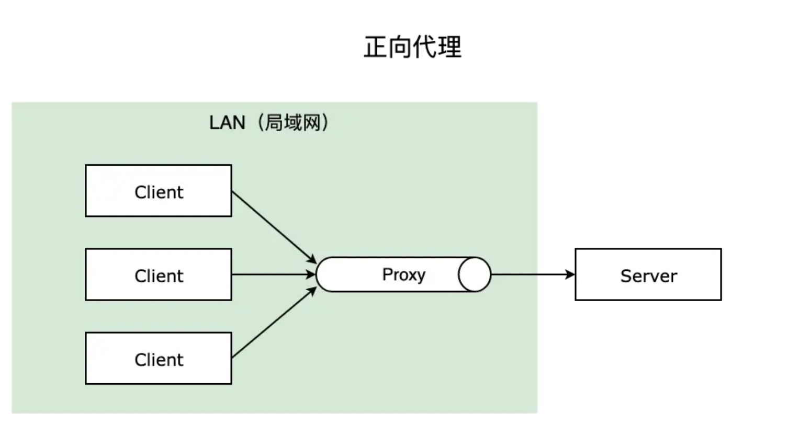
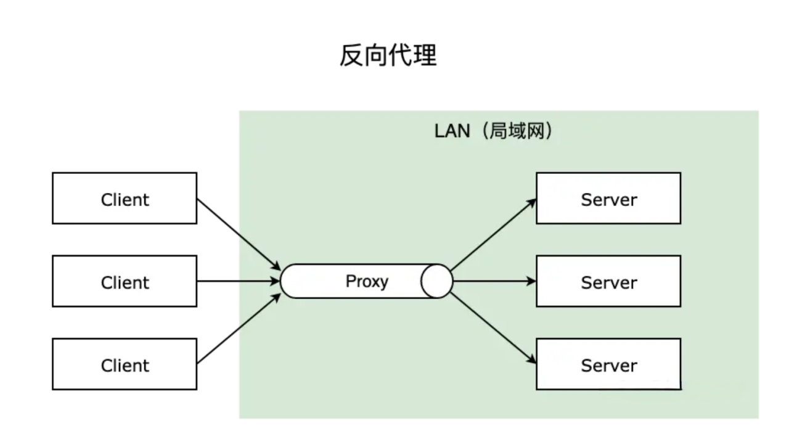
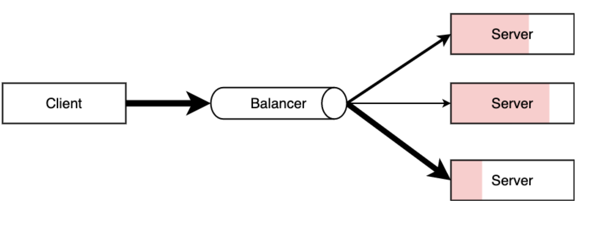
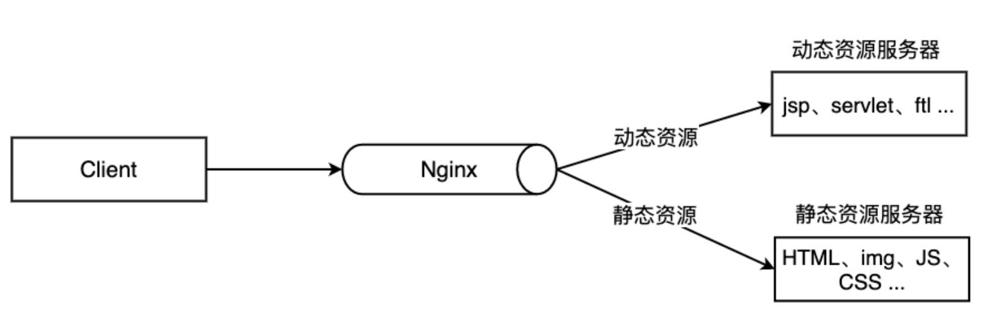

## 相关概念
### 正向代理和反向代理
正向代理： 一般的访问流程是客户端直接向目标服务器发送请求并获取内容，使用正向代理后，客户端改为向代理服务器发送请求，并指定目标服务器（原始服务器），然后由代理服务器和原始服务器通信，转交请求并获得的内容，再返回给客户端。正向代理隐藏了真实的客户端，为客户端收发请求，使真实客户端对服务器不可见。



反向代理：与一般访问流程相比，使用反向代理后，直接收到请求的服务器是代理服务器，然后将请求转发给内部网络上真正进行处理的服务器，得到的结果返回给客户端。反向代理隐藏了真实的服务器，为服务器收发请求，使真实服务器对客户端不可见。一般在处理跨域请求的时候比较常用。现在基本上所有的大型网站都设置了反向代理。



简单的说，一般给客户端做代理的都是正向代理，给服务器做代理的就是反向代理。
### 负载均衡
一般情况下，客户端发送多个请求到服务器，服务器处理请求，其中一部分可能要操作一些资源比如数据库、静态资源等，服务器处理完毕后，再将结果返回给客户端。

这种模式对于早期的系统来说，功能要求不复杂，且并发请求相对较少的情况下还能胜任，成本也低。随着信息数量不断增长，访问量和数据量飞速增长，以及系统业务复杂度持续增加，这种做法已无法满足要求，并发量特别大时，服务器容易崩。

很明显这是由于服务器性能的瓶颈造成的问题，除了堆机器之外，最重要的做法就是负载均衡。

请求爆发式增长的情况下，单个机器性能再强劲也无法满足要求了，这个时候集群的概念产生了，单个服务器解决不了的问题，可以使用多个服务器，然后将请求分发到各个服务器上，将负载分发到不同的服务器，这就是负载均衡，核心是「分摊压力」。Nginx 实现负载均衡，一般来说指的是将请求转发给服务器集群。



### 动静分离
为了加快网站的解析速度，可以把动态页面和静态页面由不同的服务器来解析，加快解析速度，降低原来单个服务器的压力。



一般来说，都需要将动态资源和静态资源分开，由于 Nginx 的高并发和静态资源缓存等特性，经常将静态资源部署在 Nginx 上。如果请求的是静态资源，直接到静态资源目录获取资源，如果是动态资源的请求，则利用反向代理的原理，把请求转发给对应后台应用去处理，从而实现动静分离。

使用前后端分离后，可以很大程度提升静态资源的访问速度，即使动态服务不可用，静态资源的访问也不会受到影响。
## Nginx安装
### yum安装
```shell
# 方法一，利用阿里镜像源
[root@localhost ~]# yum install nginx -y
# 方法二，利用nginx官方镜像源
[root@localhost ~]# vim /etc/yum.repos.d/nginx.repo
# 复制粘贴下面镜像源地址
[nginx-stable]
name=nginx stable repo
baseurl=http://nginx.org/packages/centos/$releasever/$basearch/
gpgcheck=0
enabled=1
gpgkey=https://nginx.org/keys/nginx_signing.key
module_hotfixes=true

[root@localhost ~]# yum install nginx -y
```
查看 nginx 相关目录文件：
```shell
[root@localhost ~]# rpm -ql nginx
/etc/logrotate.d/nginx
/etc/nginx/fastcgi.conf
/etc/nginx/fastcgi.conf.default
/etc/nginx/fastcgi_params
/etc/nginx/fastcgi_params.default
/etc/nginx/koi-utf
/etc/nginx/koi-win
/etc/nginx/mime.types
/etc/nginx/mime.types.default
/etc/nginx/nginx.conf
/etc/nginx/nginx.conf.default
/etc/nginx/scgi_params
/etc/nginx/scgi_params.default
/etc/nginx/uwsgi_params
/etc/nginx/uwsgi_params.default
/etc/nginx/win-utf
/usr/bin/nginx-upgrade
/usr/lib/systemd/system/nginx.service
/usr/lib64/nginx/modules
/usr/sbin/nginx
/usr/share/doc/nginx-1.20.1
/usr/share/doc/nginx-1.20.1/CHANGES
/usr/share/doc/nginx-1.20.1/README
/usr/share/doc/nginx-1.20.1/README.dynamic
/usr/share/doc/nginx-1.20.1/UPGRADE-NOTES-1.6-to-1.10
/usr/share/licenses/nginx-1.20.1
/usr/share/licenses/nginx-1.20.1/LICENSE
/usr/share/man/man3/nginx.3pm.gz
/usr/share/man/man8/nginx-upgrade.8.gz
/usr/share/man/man8/nginx.8.gz
/usr/share/nginx/html/404.html
/usr/share/nginx/html/50x.html
/usr/share/nginx/html/en-US
/usr/share/nginx/html/icons
/usr/share/nginx/html/icons/poweredby.png
/usr/share/nginx/html/img
/usr/share/nginx/html/index.html
/usr/share/nginx/html/nginx-logo.png
/usr/share/nginx/html/poweredby.png
/usr/share/nginx/modules
/usr/share/vim/vimfiles/ftdetect/nginx.vim
/usr/share/vim/vimfiles/ftplugin/nginx.vim
/usr/share/vim/vimfiles/indent/nginx.vim
/usr/share/vim/vimfiles/syntax/nginx.vim
/var/lib/nginx
/var/lib/nginx/tmp
/var/log/nginx
/var/log/nginx/access.log
/var/log/nginx/error.log
```
* `/etc/nginx/nginx.conf`是主配置文件
* `/usr/share/nginx/html/`文件夹是存放静态文件的目录
* `/var/log/nginx/`是 Nginx 日志存放目录

### 源码包安装
```shell
# 安装依赖
yum -y install gcc zlib zlib-devel pcre-devel openssl openssl-devel
# 下载tar包
wget http://nginx.org/download/nginx-1.24.0.tar.gz
tar -xvf nginx-1.24.0.tar.gz
# 进入nginx目录
cd nginx-1.24.0
# 执行命令
./configure
# ./configure --help查看帮助信息
make
make install
```
安装完成会在`/usr/local`目录下出现`nginx`目录。
:::tip
如果需要支持`https`需要加上`./configure  --with-http_ssl_module`
:::
配置`nginx.conf`。
```shell
vim /usr/local/nginx/conf/nginx.conf

server {
    listen       80;
    server_name  localhost;
    ...
}
```
启动 nginx。
```shell
# 源码包安装的启动命令
/usr/local/nginx/sbin/nginx -s reload
# 二进制包安装的启动命令
systemctl start nginx

ps -ef | grep nginx
```
### 启动可能遇到的问题
`logs`文件夹目录没有。
```shell
 [alert] could not open error log file: open() "/usr/local/nginx/logs/error.log" failed (2: No such file or directory)
```
解决方案：在提示的指定目录创建`logs`文件夹。

`nginx.pid`异常
```shell
 [error] 21478#0: open() "/usr/local/nginx/logs/nginx.pid" failed (2: No such file or directory)
```
解决方案：先设置配置文件。
```shell
/usr/local/nginx/sbin/nginx -c /usr/local/nginx/conf/nginx.conf
```
## nginx运行
```shell
# 设置nginx开机自启
[root@localhost ~]# systemctl enable nginx
Created symlink from /etc/systemd/system/multi-user.target.wants/nginx.service to /usr/lib/systemd/system/nginx.service.
[root@localhost ~]# systemctl start nginx
[root@localhost ~]# systemctl status nginx
nginx.service - The nginx HTTP and reverse proxy server
   Loaded: loaded (/usr/lib/systemd/system/nginx.service; enabled; vendor preset: disabled)
   Active: active (running) since Mon 2022-10-10 01:51:36 CST; 14s ago
  Process: 5517 ExecStart=/usr/sbin/nginx (code=exited, status=0/SUCCESS)
  Process: 5514 ExecStartPre=/usr/sbin/nginx -t (code=exited, status=0/SUCCESS)
  Process: 5512 ExecStartPre=/usr/bin/rm -f /run/nginx.pid (code=exited, status=0/SUCCESS)
 Main PID: 5519 (nginx)
    Tasks: 3
   Memory: 2.1M
   CGroup: /system.slice/nginx.service
           ├─5519 nginx: master process /usr/sbin/nginx
           ├─5520 nginx: worker process
           └─5521 nginx: worker process

Oct 10 01:51:36 VM-20-4-centos systemd[1]: Starting The nginx HTTP and reverse proxy server...
Oct 10 01:51:36 VM-20-4-centos nginx[5514]: nginx: the configuration file /etc/nginx/nginx.conf syntax is ok
Oct 10 01:51:36 VM-20-4-centos nginx[5514]: nginx: configuration file /etc/nginx/nginx.conf test is successful
Oct 10 01:51:36 VM-20-4-centos systemd[1]: Started The nginx HTTP and reverse proxy server.
```
## Nginx 操作常用命令
Nginx 的命令在控制台中输入`nginx -h`就可以看到完整的命令，这里列举几个常用的命令：
```shell
nginx -s reload  # 向主进程发送信号，重新加载配置文件，热重启
nginx -s reopen	 # 重启 Nginx
nginx -s stop    # 快速关闭
nginx -s quit    # 等待工作进程处理完成后关闭
nginx -T         # 查看当前 Nginx 最终的配置
nginx -t -c <配置路径> # 检查配置是否有问题，如果已经在配置目录，则不需要-c
```
Nginx 服务管理命令：
```shell
systemctl start nginx    # 启动 Nginx
systemctl stop nginx     # 停止 Nginx
systemctl restart nginx  # 重启 Nginx
systemctl reload nginx   # 重新加载 Nginx，用于修改配置后
systemctl enable nginx   # 设置开机启动 Nginx
systemctl disable nginx  # 关闭开机启动 Nginx
systemctl status nginx   # 查看 Nginx 运行状态
```
## Nginx 配置语法
Nginx 的主配置文件是`/etc/nginx/nginx.conf`。
```shell
[root@localhost ~]# cat /etc/nginx/nginx.conf
user nginx;
worker_processes auto;
error_log /var/log/nginx/error.log;
pid /run/nginx.pid;

# Load dynamic modules. See /usr/share/doc/nginx/README.dynamic.
include /usr/share/nginx/modules/*.conf;

events {
    worker_connections 1024;
}

http {
    log_format  main  '$remote_addr - $remote_user [$time_local] "$request" '
                      '$status $body_bytes_sent "$http_referer" '
                      '"$http_user_agent" "$http_x_forwarded_for"';

    access_log  /var/log/nginx/access.log  main;

    sendfile            on;
    tcp_nopush          on;
    tcp_nodelay         on;
    keepalive_timeout   65;
    types_hash_max_size 4096;

    include             /etc/nginx/mime.types;
    default_type        application/octet-stream;

    # Load modular configuration files from the /etc/nginx/conf.d directory.
    # See http://nginx.org/en/docs/ngx_core_module.html#include
    # for more information.
    include /etc/nginx/conf.d/*.conf;

    server {
        listen       80;
        listen       [::]:80;
        server_name  _;
        root         /usr/share/nginx/html;

        # Load configuration files for the default server block.
        include /etc/nginx/default.d/*.conf;

        error_page 404 /404.html;
        location = /404.html {
        }

        error_page 500 502 503 504 /50x.html;
        location = /50x.html {
        }
    }

# Settings for a TLS enabled server.
#
#    server {
#        listen       443 ssl http2;
#        listen       [::]:443 ssl http2;
#        server_name  _;
#        root         /usr/share/nginx/html;
#
#        ssl_certificate "/etc/pki/nginx/server.crt";
#        ssl_certificate_key "/etc/pki/nginx/private/server.key";
#        ssl_session_cache shared:SSL:1m;
#        ssl_session_timeout  10m;
#        ssl_ciphers HIGH:!aNULL:!MD5;
#        ssl_prefer_server_ciphers on;
#
#        # Load configuration files for the default server block.
#        include /etc/nginx/default.d/*.conf;
#
#        error_page 404 /404.html;
#            location = /40x.html {
#        }
#
#        error_page 500 502 503 504 /50x.html;
#            location = /50x.html {
#        }
#    }

}
```
`nginx.conf`结构图可以这样概括：
```
main        # 全局配置，对全局生效
├── events  # 配置影响 Nginx 服务器或与用户的网络连接
├── http    # 配置代理，缓存，日志定义等绝大多数功能和第三方模块的配置
│   ├── upstream # 配置后端服务器具体地址，负载均衡配置不可或缺的部分
│   ├── server   # 配置虚拟主机的相关参数，一个 http 块中可以有多个 server 块
│   ├── server
│   │   ├── location  # server 块可以包含多个 location 块，location 指令用于匹配 uri
│   │   ├── location
│   │   └── ...
│   └── ...
└── ...
```
配置文件的语法规则：
* 配置文件由指令与指令块构成
* 每条指令以`;`分号结尾，指令与参数间以空格符号分隔
* 指令块以`{}`大括号将多条指令组织在一起
* `include`语句允许组合多个配置文件以提升可维护性
* 使用`#`符号添加注释，提高可读性
* 使用`$`符号使用变量
* 部分指令的参数支持正则表达式

### location
`server`块可以包含多个`location`块，`location`指令用于匹配 URI。
```shell
location [ = | ~ | ~* | ^~] uri {}
```
指令后面：
* `=`精确匹配路径，用于不含正则表达式的`uri`前，如果匹配成功，不再进行后续的查找；比如`location = /index`，那么只有路径为`/index`的才会匹配到
* `^~`用于不含正则表达式的`uri`前，进行`uri`的前缀精确匹配，表示如果该符号后面的字符是最佳匹配，采用该规则，不再进行后续的查找
  比如`location ^~ /user/`，那么只要是路径以`/user/`开头的都会匹配到
* `~`表示用该符号后面的正则去匹配路径，区分大小写，匹配到后不再进行其他匹配
  比如`location ~ /user/`，当路径包含`/user/`时会匹配，比如`/admin/user/`或者`/user/admin/`
  比如`location ~ ^/user(.*)admin$`，能够匹配以`/user`开头，`admin`结尾的路径，`.*`表示的是任意字
* `~*`表示用该符号后面的正则去匹配路径，不区分大小写。跟`~`优先级都比较低，如有多个`location`的正则能匹配的话，则使用正则表达式最长的那个 
* 无匹配符号的精确匹配。没有符号，按照路径开头精确匹配，但是匹配到后不会立即返回，还会继续匹配其他普通匹配，如果匹配到，则会舍弃之前匹配的路径
  比如`location /user/`, 当访问`/user/`开头时会匹配到
  比如`location /user/admin`，当访问`/user/admin`时会匹配到

如果`uri`包含正则表达式，则必须要有`~`或`~*`标志。

:::tip
修改配置文件后，要运行 nginx -s reload 重新加载配置文件。
:::
### location匹配案例
匹配以`.html~.css`为后缀的所有资源请求。
```
location ~ .*\.(html|htm|gif|jpg|jpeg|bmp|png|ico|txt|js|css)
```
* `~`表示用该符号后面的正则去匹配路径，区分大小写
* `.*`代表任意字符都可以出现零次或多次，即资源名不限制
* `\.`代表匹配后缀分隔符.
* `(html|...|css)`代表匹配括号里所有静态资源类型


匹配以`.jsp`结尾的路径，将其转发至端口为 8080 的`tomcat`服务。
```nginx
server {
  listen 81;

  location ~ (.*)\.jsp {
    proxy_pass http://localhost:8080;
    proxy_set_header HOST $host;
    proxy_http_version 1.1;
  }
}
```

:::tip
`.`是单一字符通配符，所以要添加`\`做转义，才能表示成本身点的含义。
:::

三台不同的`tomcat`，端口分别为 8080，8081，8083，分别承担不同的业务，将路径以`/user`开头的请求转发至`tomcat 8080`，以`/order`开头的转发至`tomcat 8081`，路径包含`/product`跳转到`tomcat 8083`的首页。
```nginx
server {
  listen 81;

  location ^~ /user {
    proxy_pass http://localhost:8080/;
    proxy_set_header HOST $host;
    proxy_http_version 1.1;
  }

  location ^~ /order {
    proxy_pass http://localhost:8081/;
    proxy_set_header HOST $host;
    proxy_http_version 1.1;
}

  location ~* /product {
    return http://192.168.10.41:8083/index.jsp;
  }
}
```
## 全局变量
Nginx 有一些常用的全局变量，可以在配置的任何位置使用它们：

|       全局变量名       | 说明 |
|:-----------------:|:---|
|       $host       | 请求信息中的 Host，如果请求中没有 Host 行，则等于设置的服务器名，不包含端口   |
|  $request_method  | 客户端请求类型，如 GET、POST   |
|   $remote_addr    | 客户端的 IP 地址   |
|       $args       | 请求中的参数   |
|  $arg_PARAMETER   | GET 请求中变量名 PARAMETER 参数的值，例如：$http_user_agent(Uaer-Agent 值), $http_referer...   |
|  $content_length  | 请求头中的 Content-length 字段   |
| $http_user_agent	 | 客户端agent信息   |
|   $http_cookie    | 户端cookie信息   |
|   $remote_addr    | 客户端的IP地址   |
|   $remote_port    | 客户端的端口   |
| $http_user_agent  | 客户端agent信息   |
| $server_protocol  | 请求使用的协议，如 HTTP/1.0、HTTP/1.1   |
|   $server_addr    | 服务器地址   |
|   $server_name    | 服务器名称   |
|   $server_port    | 服务器的端口号   |
|      $scheme      | HTTP 方法（如http，https）   |

## proxy_pass配置反向代理
转发地址`url`分为带`/`和不带`/`，带杠的为绝对根路径，会直接在路径后拼接上不带匹配路径的转发地址；如果没有杠表示相对路径，则会将匹配路径也带上进行转发，举例说明：
```nginx
location /user/ {
  proxy_pass url;
}
```
访问路径固定为：`http://192.168.10.21/user/index.html`。

1. 当`proxy_pass http://192.168.10.21:8080/`时
   会跳转至`http://192.168.10.21:8080/index.html`，带`/`表示绝对路径，匹配路径`/user/`会被消除
2. 当`proxy_pass http://192.168.10.21:8080`时
   会跳转至`http://192.168.10.21:8080/user/index.html`，相对路径，匹配路径`/user/`不会被消除
3. 当`proxy_pass http://192.168.10.21:8080/admin/`时
   会跳转至`http://192.168.10.21:8080/admin/index.html`，匹配路径`/user/`被消除，并且保留转发路径里的`/admin/`
4. 当`proxy_pass http://192.168.10.21:8080/admin`时
   会跳转至`http://192.168.10.21:8080/admin/index.html`，因为`proxy_pass`中也包含了`/`了，表示绝对路径，所以`/user/`会被消除

总言之记住一点，带`/`表示绝对路径，请求路径中的匹配路径（`location`）转发时会被消除。
### server和location模块中proxy_pass的区别
在`server`模块中的`proxy_pass`只需要配置`ip`（或域名）和端口，相当于端口转发；而在`location`中的`proxy_pass`，也就是我们更加常用的，可以配置域名、`ip`、端口、`uri`，此外还需要提供协议：`http`或`https`，相当于地址转发。
```conf
server {
  listen 80;
  proxy_responses 1;
  proxy_timeout 20s;
  proxy_pass xxx.com:8080;
  # proxy_pass 192.168.244.21:8080;

  location /user/ {
    proxy_pass http://192.168.244.21:8081;
  }
}
```
## 开启gzip压缩
使用`gzip`不仅需要 Nginx 配置，浏览器端也需要配合，需要在请求消息头中包含`Accept-Encoding: gzip`。一般在请求 html 和 css 等静态资源的时候，支持的浏览器在`request`请求静态资源的时候，会加上`Accept-Encoding: gzip`这个`header`，表示自己支持`gzip`的压缩方式，Nginx 在拿到这个请求的时候，如果有相应配置，就会返回经过`gzip`压缩过的文件给浏览器，并在`response`相应的时候加上`content-encoding: gzip`来告诉浏览器自己采用的压缩方式（因为浏览器在传给服务器的时候一般还告诉服务器自己支持好几种压缩方式），浏览器拿到压缩的文件后，根据自己的解压方式进行解析。
```nginx
http {
  # 开启压缩机制
  gzip on;
  # 指定会被压缩的文件类型(也可自己配置其他类型)
  gzip_types text/plain application/javascript text/css application/xml text/javascript image/jpeg image/gif image/png;
  # 检查是否存在请求静态文件的 gz 结尾的文件，如果有则直接返回该 .gz 文件内容
  gzip_static on;
  # 设置压缩级别，越高资源消耗越大，但压缩效果越好
  gzip_comp_level 5;
  # 在头部中添加Vary: Accept-Encoding（建议开启）
  gzip_vary on;
  # 处理压缩请求的缓冲区数量和大小
  gzip_buffers 16 8k;
  # 对于不支持压缩功能的客户端请求不开启压缩机制
  gzip_disable "MSIE [1-6]\."; # 低版本的IE浏览器不支持压缩
  # 设置压缩响应所支持的HTTP最低版本
  gzip_http_version 1.1;
  # 设置触发压缩的最小阈值
  gzip_min_length 2k;
  # 关闭对后端服务器的响应结果进行压缩
  gzip_proxied off;
}
```

|        参数项        | 释义                                                                                               |
|:-----------------:|:-------------------------------------------------------------------------------------------------|
|       gzip        | 开启或关闭压缩机制                                                                                        |
|    gzip_types     | 要采用 gzip 压缩的 MIME 文件类型，其中 text/html 被系统强制启用                                                      |
|   gzip_static     | 默认 off，该模块启用后，Nginx 首先检查是否存在请求静态文件的 gz 结尾的文件，如果有则直接返回该 .gz 文件内容                                  |
|  gzip_comp_level  | gzip 压缩比，压缩级别是 1-9，1 压缩级别最低，9 最高，级别越高压缩率越大，压缩时间越长，建议 4-6                                         |
|     gzip_vary     | 用于在响应消息头中添加 Vary：Accept-Encoding，使代理服务器根据请求头中的 Accept-Encoding 识别是否启用 gzip 压缩                    |
|   gzip_buffers    | 获取多少内存用于缓存压缩结果，16 8k 表示以 8k*16 为单位获得                                                             |
|   gzip_disable    | 针对不同客户端的请求来设置是否开启压缩                                                                              |
| gzip_http_version | 默认 1.1，启用 gzip 所需的 HTTP 最低版本                                                                     |
|  gzip_min_length  | 允许压缩的页面最小字节数，页面字节数从header头中的 Content-Length 中进行获取。默认值是 0，不管页面多大都压缩。建议设置成大于 1k 的字节数，小于 1k 可能会越压越大 |
|   gzip_proxied    | 对于后端服务器的响应结果是否开启压缩                                                                               |

在上述的压缩配置中，最后一个`gzip_proxied`选项，可以根据系统的实际情况决定，总共存在多种选项：
* `off`：关闭 Nginx 对后台服务器的响应结果进行压缩。
* `expired`：如果响应头中包含`Expires`信息，则开启压缩
* `no-cache`：如果响应头中包含`Cache-Control:no-cache`信息，则开启压缩
* `no-store`：如果响应头中包含`Cache-Control:no-store`信息，则开启压缩
* `private`：如果响应头中包含`Cache-Control:private`信息，则开启压缩
* `no_last_modified`：如果响应头中不包含`Last-Modified`信息，则开启压缩
* `no_etag`：如果响应头中不包含`ETag`信息，则开启压缩
* `auth`：如果响应头中包含`Authorization`信息，则开启压缩
* `any`：无条件对后端的响应结果开启压缩机制

:::info
那么为啥 Nginx 已经有了 gzip 压缩，Webpack/Vite 又整了个 gzip 呢？

因为如果全都是使用 Nginx 来压缩文件，会耗费服务器的计算资源，如果服务器的 gzip_comp_level 配置的比较高，就更增加服务器的开销，相应增加客户端的请求时间，得不偿失。

如果压缩的动作在前端打包的时候就做了，把打包之后的高压缩等级文件作为静态资源放在服务器上，Nginx 会优先查找这些压缩之后的文件返回给客户端，相当于把压缩文件的动作从 Nginx 提前给 Webpack 打包的时候完成，节约了服务器资源，所以一般推介在生产环境应用 Webpack 配置 gzip 压缩。
:::
## 配置动静分离
通过`location`指定不同的后缀名实现不同的请求转发。通过`expires`参数设置，可以设置浏览器缓存过期时间，减少与服务器之前的请求和流量。

具体`expires`定义：是给一个资源设定一个过期时间，也就是说无需去服务端验证，直接通过浏览器自身确认是否过期即可，所以不会产生额外的流量。此种方法非常适合不经常变动的资源。设置`3d`，表示在这 3 天之内访问这个URL，发送一个请求，比对服务器该文件最后更新时间没有变化。则不会从服务器抓取，返回状态码 304，如果有修改，则直接从服务器重新下载，返回状态码 200。

```shell
server {
  location /www/ {
  	root /data/;
    index index.html index.htm;
  }
  
  location /image/ {
  	root /data/;
  	expires 3d;
  	# 开启静态资源列目录
    autoindex on;
  }
}
```
## 配置负载均衡
```nginx
http {
  upstream myserver {
    server http://127.0.0.1:8081;  # 负载均衡目的服务地址
    server http://127.0.0.1:8080;
    server http://127.0.0.1:8082 weight=10;  # weight 方式，不写默认为 1
  }
 
  server {
    listen      9000;
    server_name test.com;
    location / {
      proxy_pass       myserver;
      proxy_set_header Host $proxy_host;
      proxy_set_header X-Real-IP $remote_addr;
      proxy_set_header X-Forwarded-For $proxy_add_x_forwarded_for;
    }
  }
}
```
Nginx 提供了好几种分配方式，默认为轮询，就是轮流来。有以下几种分配方式：
* 轮询，默认方式，每个请求按时间顺序逐一分配到不同的后端服务器，如果后端服务挂了，能自动剔除
* `weight`，权重分配，指定轮询几率，权重越高，在被访问的概率越大，用于后端服务器性能不均的情况
* `ip_hash`，每个请求按访问 IP 的`hash`结果分配，这样每个访客固定访问一个后端服务器，可以解决动态网页`session`共享问题。负载均衡每次请求都会重新定位到服务器集群中的某一个，那么已经登录某一个服务器的用户再重新定位到另一个服务器，其登录信息将会丢失，这样显然是不妥的
* `fair`（第三方），按后端服务器的响应时间分配，响应时间短的优先分配，依赖第三方插件`nginx-upstream-fair`，需要先安装

## 配置HTTPS
SSL 证书配置过程：
1. 先去 CA 机构或云控制台中申请 SSL 证书，审核通过后下载 Nginx 版本的证书
2. 下载数字证书后，完整的文件总共有三个：`.crt、.key、.pem`：
   * `.crt`：数字证书文件，`.crt`是`.pem`的拓展文件
   * `.key`：服务器的私钥文件，及非对称加密的私钥，用于解密公钥传输的数据
   * `.pem`：`Base64-encoded`编码格式的源证书文本文件，可自行根需求修改拓展名
3. 在 Nginx 目录下新建`certificate`目录，并将下载好的证书/私钥等文件上传至该目录
4. 最后修改一下`nginx.conf`：
```nginx
# ----------HTTPS配置-----------
server {
    # 监听HTTPS默认的443端口,打开SSL加密传输
    listen 443 ssl http2 default_server;
    # 配置自己项目的域名
    server_name www.xxx.com;

    # 配置自己下载的数字证书
    ssl_certificate  /etc/nginx/certificate/xxx.pem;
    # 配置自己下载的服务器私钥
    ssl_certificate_key /etc/nginx/certificate/xxx.key;
    # 停止通信时，加密会话的有效期，在该时间段内不需要重新交换密钥  
    ssl_session_timeout 5m;
    # TLS握手时，服务器采用的密码套件
    ssl_ciphers ECDHE-RSA-AES128-GCM-SHA256:ECDHE:ECDH:AES:HIGH:!NULL:!aNULL:!MD5:!ADH:!RC4;
    # 服务器支持的TLS版本
    ssl_protocols TLSv1 TLSv1.1 TLSv1.2;  
    # 开启由服务器决定采用的密码套件
    ssl_prefer_server_ciphers on;  
  
    location / {
        # 输入域名后，首页文件所在的目录
        root /usr/share/nginx/html;
        # 配置首页的文件名  
        index index.html index.htm;
    }  
}  
  
# ---------HTTP请求转HTTPS-------------  
server {
    # 监听HTTP默认的80端口
    listen 80;
    # 如果80端口出现访问该域名的请求
    server_name www.xxx.com;
    # 将请求改写为HTTPS（这里写你配置了HTTPS的域名）
    rewrite ^(.*)$ https://www.xxx.com;  
}
```
写完`nginx -t -q`校验一下，没问题就`nginx -s reload`。
## 图片防盗链
```shell
server {
  listen       80;        
  server_name  *.sherlocked93.club;
  
  # 图片防盗链
  location ~* \.(gif|jpg|jpeg|png|bmp|swf)$ {
    # 只允许本机 IP 外链引用，将百度和qq也加入白名单
    valid_referers none blocked server_names ~\.baidu\. *.qq.com;  
    if ($invalid_referer){
      return 403;
    }
  }
}
```
## 配置静态文件缓存
由于图片、字体、音频、视频等静态文件在打包的时候通常会增加了`hash`，所以缓存可以设置的长一点，先设置强制缓存，再设置协商缓存；如果存在没有`hash`值的静态文件，建议不设置强制缓存，仅通过协商缓存判断是否需要使用缓存。
```shell
# 图片缓存时间设置
location ~ .*\.(css|js|jpg|png|gif|swf|woff|woff2|eot|svg|ttf|otf|mp3|m4a|aac|txt)$ {
	expires 10d;
}

# 如果不希望缓存
expires -1;
```
## 支持websocket
```shell
server {
    listen       80;
    server_name  www.xxx.com;

    location / {
        proxy_pass http://192.168.10.224:8080/;
        proxy_read_timeout 300;
        proxy_connect_timeout 300;
        # 主要配置项
        proxy_set_header Upgrade $http_upgrade;
        proxy_set_header Connection "upgrade";
    }
}
```
## 设置请求body大小
nginx body请求体默认是 1M。
```nginx
http {
  client_max_body_size 100M;
}
```
## root和alias的区别
```nginx
location /request_path/image/ {
  root /local_path/image/;
}
```

这样配置的结果就是当客户端请求`/request_path/image/cat.png`的时候，Nginx 把请求映射为`/local_path/image/request_path/image/cat.png`。

注意这时候除了`root`的路径，还会带上请求路径（例如这里：`/request_path/image/`）。
```nginx
location /request_path/image/ {
    alias /local_path/image/;
}
```
这时候，当客户端请求`/request_path/image/cat.png`的时候， Nginx 把请求映射为`/local_path/image/cat.png`。

注意：`alias`中的路径最后必须跟上`/`，`root`的路径最后可跟可不跟，`alias`支持正则表达式路径，`root`不支持。
## 单页面项目 history 路由配置
```nginx
server {
  listen       80;
  server_name  fe.sherlocked93.club;
  
  location / {
    root       /usr/share/nginx/html/dist;  # vue 打包后的文件夹
    index      index.html index.htm;
    try_files  $uri $uri/ /index.html @rewrites;  
    
    expires -1;                          # 首页一般没有强制缓存
    add_header Cache-Control no-cache;
  }
  
  # 接口转发，如果需要的话
  #location ~ ^/api {
  #  proxy_pass http://be.sherlocked93.club;
  #}
  
  location @rewrites {
    rewrite ^(.+)$ /index.html break;
  }
}
```
