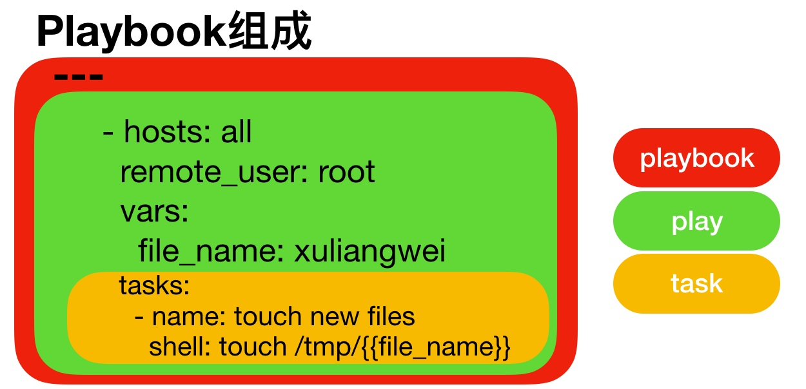
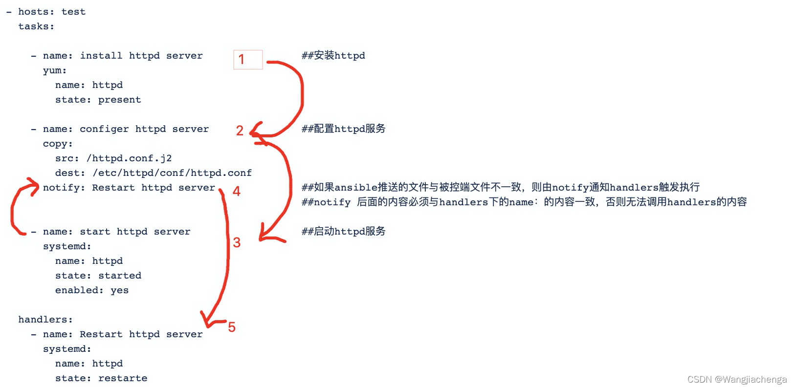

[PlayBook](https://docs.ansible.com/ansible/latest/reference_appendices/playbooks_keywords.html#playbook-keywords) 剧本是由一个或多个"Play"组成的列表。Play 的主要功能在于将预定义的一组主机，装扮成事先通过 Ansible 中的 Task 定义好的角色。

从根本上来讲，所谓的 Task 无非是调用 Ansible 的一个`module`。将多个 Play 组织在一个 PlayBook 中，即可以让它们联合起来按事先编排的机制完成某一任务。

`playbook`文件是采用 YAML 语言 编写的。通过`ansible-playbook`命令进行解析，`ansbile-playbook`命令会根据自上而下的顺序依次执行`playbook`文件中的内容。
## 核心元素

| 元素         | 说明                                      |
|------------|-----------------------------------------|
| Hosts      | 主机组                                     |
| Tasks      | 任务列表                                    |
| Variables  | 内置变量或自定义变量在 PlayBook 中调用                |
| Templates  | 模板文件，即使用模板语法的文件，比如配置文件等                 |
| Handlers   | 和 notity 结合使用，由特定条件触发的操作，满足条件方才执行，否则不执行 |
| Tags       | 标签，指定某条任务执行，用于选择运行 PlayBook中的部分代码       |

PlayBook 翻译过来就是剧本，可以简单理解为使用不同的模块完成一件事情， 具体 PlayBook 组成如下：
* Play：定义的是主机的角色
* Task：定义的是具体执行的任务
* PlayBook：由一个或多个 Play 组成，一个 Play 可以包含多个 Task 任务



## 优势
* 功能比 ad-hoc 更全
* 能很好的控制先后执行顺序，以及依赖关系
* 语法展现更加的直观
* ad-hoc 无法持久使用，PlayBook 可以持久使用

## 核心组件
一个 PlayBook 中由多个组件组成，其中所用到的常见组件类型如下：

| 元素        | 说明                                                                                       |
|-----------|------------------------------------------------------------------------------------------|
| Hosts     | 运行指定任务的目标主机                                                                              |
| Tasks     | 任务集，由多个 task 的元素组成的列表实现，每个 task 是一个字典，一个完整的代码块功能需最少元素需包括 name 和 task，一个 name 只能包括一个 task |
| Variables | 内置变量或自定义变量 在 PlayBook 中调用                                                                |
| Templates | 模板，可替换模板文件中的变量并实现一些简单逻辑的文件                                                               |
| Handlers  | 和 notify 结合使用，由特定条件触发的操作，满足条件方才执行，否则不执行                                                  |
| Tags      | 标签 指定某条任务执行，用于选择运行 playbook 中的部分代码                                                       |

### hosts 组件
PlayBook 中的每一个 Play 的目的都是为了让特定主机以某个指定的用户身份执行任务。`hosts`用于指定要执行指定任务的主机，须事先定义在主机清单中。
```yaml
- hosts: websrvs:appsrvs
```
### remote_user 组件
可用于 Host 和 task 中。也可以通过指定其通过`sudo`的方式在远程主机上执行任务，其可用于`play`全局或某任务；此外，甚至可以在`sudo`时使用`sudo_user`指定`sudo`时切换的用户。
```yaml
remote_user: root            # 方式一
    
tasks:
   - name: test connection
     ping:
       remote_user: magedu    # 方式二
       sudo: yes         		  # 默认 sudo 为 root
       sudo_user: wang    			# sudo 为 wang
```
### task 列表和 action 组件
Play 的主体部分是`task list`，`task list`中有一个或多个`task`，各个`task`按次序逐个在`hosts`中指定的所有主机上执行，即在所有主机上完成第一个`task`后，再开始第二个`task`。

`task`的目的是使用指定的参数执行模块，而在模块参数中可以使用变量。模块执行是幂等的，这意味着多次执行是安全的，因为其结果均一致。

每个`task`都应该有其`name`，用于 PlayBook 的执行结果输出，建议其内容能清晰地描述任务执行步骤。如果未提供`name`，则`action`的结果将用于输出。
```shell
action: module arguments  # 示例: action: shell wall hello 
module: arguments         # 建议使用 # 示例: shell: wall hello 
```
注意： Shell 和 Command 模块后面跟命令，而非 key=value
```shell
[root@ansible ansible] cat hello.yaml
---
# first yaml file 
- hosts: websrvs
  remote_user: root
  gather_facts: no   # 不收集系统信息, 提高执行效率
  
  tasks:
    - name: test network connection
      ping:
    - name: wall
      shell: wall "hello world!"
      
# 检查语法
[root@ansible ansible] ansible-playbook --syntax-check hello.yaml

# 验证脚本 ( 不真实执行 )
# 模拟执行 hello.yaml 文件中定义的 playbook, 不会在被控节点上应用任何更改
[root@ansible ansible] ansible-playbook -C hello.yaml

# 真实执行
[root@ansible ansible] ansible-playbook hello.yaml
```
```shell
[root@ansible ansible] vim test.yml
---
# 初识 Ansible
- hosts: websrvs
  remote_user: root
  gather_facts: yes     # 需开启,否则无法收集到主机信息

  tasks:
    - name: '存活性检测'
      ping:
    - name: '查看主机名信息'
      setup: filter=ansible_nodename
    - name: '查看操作系统版本'
      setup: filter=ansible_distribution_major_version
    - name: '查看内核版本'
      setup: filter=ansible_kernel
    - name: '查看时间'
      shell: date

  tasks:
    - name: '安装 HTTPD'
      yum: name=httpd
    - name: '启动 HTTPD'                                                                   
      service: name=httpd state=started enabled=yes
      
# 检查语法
[root@ansible ansible] ansible-playbook --syntax-check test.yml

# 执行脚本
[root@ansible ansible] ansible-playbook test.yml
```
### 其它组件
某任务的状态在运行后为`changed`时，可通过`notify`通知给相应的`handlers`任务。

还可以通过`tags`给`task`打标签，可在`ansible-playbook`命令上使用`-t`指定进行调用。
## playbook 命令
```text
// 格式
ansible-playbook <filename.yml> [options]
```
| 参数                                     | 说明                        |
|----------------------------------------|---------------------------|
| --syntax-check                         | 语法检查                      |
| --check, -C                            | 模拟执行，只检测可能会发生的改变，但不真正执行操作 |
| --list-hosts                           | 列出运行任务的主机                 |
| --list-tags                            | 列出 tag                    |
| --list-tasks                           | 列出 task                   |
| --limit 主机                             | 针对主机列表中的特定主机执行            |
| -i INVENTORY                           | 指定主机清单文件                  |
| -v -vv -vvvv                           | 显示过程                      |
| --start-at-task taskname               | 从指定 task 开始执行, 而非从头开始     |
| -e EXTRA_VARS, --extra-vars EXTRA_VARS | 设置命令行变量传递给yaml配置文件        |

```shell
ansible-playbook hello.yaml --list-hosts
ansible-playbook hello.yaml --list-tasks
ansible-playbook hello.yaml --limit 192.168.80.28
ansible-playbook hello.yaml -i /root/hosts
ansible-playbook hello.yml --start-at-task="start httpd"
```
## ignore_errors 忽略错误
如果一个`Task`出错，默认将不会继续执行后续的其它`Task`。

我们可以利用`ignore_errors:yes`忽略此`Task`的错误，继续向下执行 PlayBook 其它`Task`。
```yaml
- hosts: websrvs
  
  tasks:
    - name: error test
      command: /bin/false    # 返回失败结果的命令
      ignore_errors: yes     # 忽略错误, 继续执行
    - name: continue
      command: wall continue
```
## handlers 和 notify
`handlers`本质是`task list`，类似于 MySQL 中的触发器触发的行为，其中的`task`与前述的`task`并没有本质上的不同，主要用于当关注的资源发生变化时，才会采取一定的操作。

而`notify`对应的`action`可用于在每个`play`的最后被触发，这样可避免多次有改变发生时每次都执行指定的操作，仅在所有的变化发生完成后一次性地执行指定操作。在`notify`中列出的操作称为`handler`，也即`notify`中调用`handler`中定义的操作。

注意：
* 如果多个`Task`通知了相同的`handlers`，此`handlers`仅会在所有`Tasks`结束后运行一次。
* 只有`notify`对应的`task`发生改变了才会通知`handlers`，没有改变则不会触发`handlers`。
* `handlers`是在所有前面的`tasks`都成功执行才会执行，如果前面任何一个`task`失败，会导致`handler`跳过执行，可以使用`force_handlers:yes`强制执行`handler`。

```shell
---
- hosts: websrvs
  remote_user: root
  gather_facts: no
  
  tasks:
    - name : Install httpd
      yum: name=httpd state=present
    - name : Install configure file
      copy: src=files/httpd.conf dest=/etc/httpd/conf/
    # 修改 http 服务的端口号
    - name: config httpd conf
      lineinfile: "path=/etc/httpd/conf/httpd.conf regexp='^Listen' line='Listen 8080'"
      notify:
        - restart httpd 
        - wall
    - name: ensure apache is running
      service: name=httpd state=started enabled=yes

  handlers:
    - name: restart httpd
      service: name=httpd state=restarted
    - name: wall
      command: wall "The config file is changed"
```
在 Ansible 中，`handlers`部分 用于定义当某些条件满足时应该执行的任务。

这些任务通常是由`notify`指令触发的，这些`notify`指令可以放在其他任务中。

当任务完成并且其状态发生变化时，与任务相关联的`notify`指令会触发相应的`handler`。
```shell
[root@ansible ansible] vim files/nginx.conf
    server {
        listen       80;                # 修改该行
        listen       [::]:80;
        server_name  _;
        root         /usr/share/nginx/html;

[root@ansible ansible] vim install_nginx.yml
---
# install nginx
- hosts: websrvs
  remote_user: root
  gather_facts: no

  tasks:
    - name: "Add Nginx Group"
      group: name=nginx state=present
    - name: "Add Nginx User"
      user: name=nginx state=present group=nginx
    - name: "Install Nginx"
      yum: name=nginx state=present
    - name: "Copy Nginx Config File"
      copy: src=files/nginx.conf dest=/etc/nginx/nginx.conf
      notify: Restart Nginx Service    # 定义 notify 触发器
    - name: "Copy Web Page File"
      copy: src=files/index.html dest=/usr/share/nginx/html/index.html
    - name: "Start Nginx Service"
      service: name=nginx state=started enabled=yes
        
   
  handlers:    # 触发如下操作
    - name: "Restart Nginx Service"
      service: name=nginx state=restarted enabled=yes
      
[root@ansible ansible] ansible-playbook install_nginx.yml
```


强制执行`handlers`
```yaml
- hosts: websrvs
  force_handlers: yes # 无论 task 中的任何一个 task 失败, 仍强制执行 handlers
  tasks:
    - name: config file
      copy: src=nginx.conf dest=/etc/nginx/nginx.conf
      notify: restart nginx
    - name: install package
      yum: name=no_exist_package
    
  handlers:
    - name: "restart nginx"
      service: name=nginx state=restarted
```
## tags 组件
如果写了一个很长的 PlayBook，其中有很多的任务，这并没有什么问题，不过在实际使用这个剧本时，可能只是想要执行其中的一部分任务。或者，你只想要执行其中一类任务而已，而并非想要执行整个剧本中的全部任务，这个时候我们就可以借助`tags`标签实现这个需求。

`tags`可以帮助我们对任务进行打标签的操作，与模块名同级，当任务存在标签以后，我们就可以在执行 PlayBook 时，借助标签，指定执行哪些任务，或者指定不执行哪些任务了。

在 PlayBook 文件中，利用`tags`组件，为特定`task`指定标签。 当在执行 PlayBook 时，可以只执行特定`tags`的`task`，而非整个 PlayBook 文件。可以一个`task`对应多个`tag`，也可以多个`task`对应一个`tag`。

还有另外 3 个特殊关键字用于标签，`tagged，untagged`和`all`，它们分别是仅运行已标记，只有未标记和所有任务。
```shell
[root@ansible ~] vim httpd.yml
---
# tags example
- hosts: websrvs
  remote_user: root
  gather_facts: no
  
tasks:
  - name: "Install httpd"
    yum: name=httpd state=present
  - name: "Install configure file"
    copy: src=files/httpd.conf dest=/etc/httpd/conf/
    tags: [ conf,file ]    # 写在一行
      - conf               # 写成多行
      - file
  - name: "start httpd service"
    tags: service          # 写在一行
    service: name=httpd state=started enabled=yes

# 查看标签
[root@ansible ~] ansible-playbook --list-tags httpd.yml

# 仅执行标签动作
[root@ansible ~] ansible-playbook -t conf,service httpd.yml

# 跳过标签动作 
[root@ansible ~] ansible-playbook --skip-tags conf httpd.yml
[root@ansible ~] ansible-playbook httpd.yml --skip-tags untagged
```
## 使用变量
Playbook 中同样也支持变量， 变量名仅能由字母、数字和下划线组成，且只能以字母开头。

变量调用方式：
* 通过`{{ variable_name }}`调用变量，且变量名前后建议加空格
* 有时用`"{{ variable_name }}"`才生效

### 变量来源
1. Ansible 的`setup facts`远程主机的所有变量都可直接调用。
2. 通过命令行指定变量，优先级最高。
```shell
ansible-playbook -e varname=value test.yml
```
3. 在 PlayBook 文件中定义。
```yaml
- hosts: webservers
  vars:
  	var1: value1
  	var2: value2
```
4. 在独立的变量 YAML 文件中定义。
```yaml
- hosts: all
  vars_files:
    - vars.yml
```
5. 在主机清单文件中定义：
* 主机（普通）变量：主机组中主机单独定义，优先级高于公共变量
* 组（公共）变量：针对主机组中所有主机定义统一变量

```text
[test]
host1 var1=value1
host2

[test:vars]
ntp_server=ntp.example.com
proxy=proxy.example.com
```
6. 在项目中针对主机和主机组定义
在项目目录中创建`host_vars`和`group_vars`目录
7. 在`role`中定义

变量的优先级从高到低如下：
* `-e`选项定义变量
* playbook 中`vars_files`
* playbook 中`vars`变量定义
* `host_vars`/主机名 文件
* 主机清单中主机变量
* `group_vars`/主机组名文件
* `group_vars/all`文件
* 主机清单组变量

### 使用 setup 模块中变量
本模块自动在 PlayBook 调用，不要用 Ansible 命令调用，生成的系统状态信息，并存放在`facts`变量中。

`facts`包括的信息很多，**如: **主机名，IP，CPU，内存，网卡等。`facts`变量的实际使用场景案例：
* 通过`fact`变量获取被控端 CPU 的个数信息，从而生成不同的 Nginx 配置文件
* 通过`fact`变量获取被控端内存大小信息，从而生成不同的 memcached 的配置文件
* 通过`fact`变量获取被控端主机名称信息，从而生成不同的 Zabbix 配置文件
* ......

```shell
[root@centos8 ~] ansible 192.168.80.18 -m setup -a "filter=ansible_nodename"
[root@centos8 ~] ansible 192.168.80.18 -m setup -a 'filter="ansible_default_ipv4"'

```
```yaml
# var1.yml
- hosts: websrvs
  remote_user: root
  gather_facts: yes    # 注意: 这个需要 yes 启用
  
  tasks:
    - name: "create log file"
      file: name=/root/{{ ansible_nodename }}.log state=touch owner=wangj mode=600
```
显示 ens33 网卡的 IP 地址
```yaml
- hosts: websrvs
  
  tasks:
    - name: show eth0 ip address {{ ansible_facts["ens33"]["ipv4"]["address"] }}    # name 中也可以调用变量
      debug:
        msg: IP address {{ ansible_ens33.ipv4.address }}    # 注意: 网卡名称
        # msg: IP address {{ ansible_facts["eth0"]["ipv4"]["address"] }}
        # msg: IP address {{ ansible_facts.eth0.ipv4.address }}
        # msg: IP address {{ ansible_default_ipv4.address }}
        # msg: IP address {{ ansible_eth0.ipv4.address }}
        # msg: IP address {{ ansible_eth0.ipv4.address.split('.')[-1] }} # 取 IP 中的最后一个数字
```
### 命令行中定义变量
```shell
[root@ansible ~] vim var2.yml
---
- hosts: websrvs
  remote_user: root
  tasks:
    - name: "install package"
      yum: name={{ pkname }} state=present    # 调用变量

# 在 PlayBook 命令行中定义变量
[root@ansible ~] ansible-playbook -e pkname=vsftpd var2.yml
```
也可以将多个变量放在一个文件中
```shell
# 也可以将多个变量放在一个文件中
[root@ansible ~] cat vars
pkname1: memcached
pkname2: redis

[root@ansible ~] vim var2.yml
---
- hosts: websrvs
  remote_user: root
  tasks:
    - name: install package {{ pkname1 }}    # 名称也调用变量 ( 利于我们清楚正在安装什么软件包 )
      yum: name={{ pkname1 }} state=present
    - name: install package {{ pkname2 }}
      yum: name={{ pkname2 }} state=present

# 方式一
[root@ansible ~] ansible-playbook -e pkname1=memcached -e pkname2=redis var2.yml

# 方式二 ( 指定存放着变量的文件 )
[root@ansible ~] ansible-playbook -e '@vars' var2.yml
```
### 在 PlayBook 文件中定义变量
```yaml
- hosts: websrvs
  remote_user: root
  vars:
    username: user1        # 定义变量
    groupname: group1      # 定义变量
  tasks:
    - name: "create group {{ groupname }}"
      group: name={{ groupname }} state=present
    - name: "create user {{ username }}"
      user: name={{ username }} group={{ groupname }} state=present
```
变量之间的相互调用
```shell
[root@ansible ~] vim var4.yaml
---
- hosts: websrvs
  remote_user: root
  vars:
    collect_info: "/data/test/{{ansible_default_ipv4['address']}}/"	# 基于默认变量定义了一个新的变量

  tasks:
    - name: "Create IP directory"
      file: name="{{collect_info}}" state=directory		# 引用变量

# 执行结果
tree /data/test/
/data/test/
└── 192.168.80.18

1 directory, 0 files
```
```shell
[root@ansible ansible] cat var2.yml
---
- hosts: websrvs
  vars:
    suffix: "txt"
    file: "{{ ansible_nodename }}.{{suffix}}"		# 基于默认变量定义了一个新的变量
    
  tasks:
    - name: test var
      file: path="/data/{{file}}" state=touch		# 引用变量
```
安装多个包
```yaml
# 实例一
- hosts: websrvs
  vars:
    web: httpd
    db: mariadb-server
    
  tasks:
    - name: install {{ web }} {{ db }}
      yum:
        name:
          - "{{ web }}"
          - "{{ db }}"
        state: latest
# 实例二      
- hosts: websrvs2
  tasks:
    - name: install packages
      yum: name={{ pack }}
      vars:
        pack:
          - httpd
          - memcached
```
### 使用变量文件
可以在一个 独立的 PlayBook 文件 中定义变量，在另一个 PlayBook 文件中引用变量文件中的变量，比 PlayBook 中定义的变量优化级高。
```shell
# 编写变量文件
vim vars.yml
---
# variables file
  package_name: mariadb-server
  service_name: mariadb
```
```shell
# 在 PlayBook 调用变量文件
vim var5.yml
---
# install package and start service
- hosts: dbsrvs
  remote_user: root
  vars_files:            # 在 PlayBook 调用变量文件
    - vars.yml
    
  tasks:
    - name: "install package"
      yum: name={{ package_name }}
      tags: install
    - name: "start service"
      service: name={{ service_name }} state=started enabled=yes
```
### 针对主机和主机组定义变量
#### 在主机清单中针对所有项目的主机和主机分组对应变量
所有项目的主机变量
在主机清单文件中为指定的主机定义变量 以便于在 PlayBook 中使用
```text
// 范例: 定义主机变量
[websrvs]
www1.magedu.com http_port=80 maxRequestsPerChild=808
www2.magedu.com http_port=8080 maxRequestsPerChild=909
```
所有项目的组（公共）变量
在主机清单文件中赋予给指定组内所有主机上
在 PlayBook 中可用的变量，如果和主机变量是同名，优先级低于主机变量
```text
// 范例: 公共变量
[websrvs:vars]
http_port=80
ntp_server=ntp.magedu.com
nfs_server=nfs.magedu.com
```
```shell
[root@ansible ~] vim /etc/ansible/hosts
[websrvs]
192.168.80.18 hname=www1 domain=magedu.io    # 定义主机变量 ( 主机变量 优先级高 )
192.168.80.28 hname=www2

[websrvs:vars]        # 定义分组变量
mark="-"

[all:vars]            # 定义公共变量 ( 公共变量优先级低 )
domain=magedu.org

# 调用变量 ( 修改主机名 )
[root@ansible ~] ansible websrvs -m hostname -a 'name={{ hname }}{{ mark }}{{ domain }}'
# 命令行指定变量:
# -e 定义变量的优先级更高
[root@ansible ~] ansible websrvs -e domain=magedu.cn -m hostname -a 'name={{ hname }}{{ mark }}{{ domain }}'
```
#### 针对当前项目的主机和主机组的变量
上面的方式是针对所有项目都有效，而官方更建议的方式是使用 Ansible 特定项目的主机变量和组变量。生产建议在项目目录中创建额外的两个变量目录，分别是`host_vars` 和`group_vars`。
* `host_vars`：下面的文件名和主机清单主机名一致，针对单个主机进行变量定义，格式：`host_vars/hostname`（ 主机变量 ）
* `group_vars`：下面的文件名和主机清单中组名一致，针对单个组进行变量定义，格式：`gorup_vars/groupname`（ 分组变量 ）
* `group_vars/all`：文件内定义的变量对所有组都有效（ 公共变量 ）

建议：主机清单不定义变量（仅存放主机分组信息），变量统一定义在项目目录下的变量目录中（条理非常清晰）。
```shell
# 创建项目目录
[root@ansible ansible] mkdir /data/ansible/test_project -p
[root@ansible ansible] cd /data/ansible/test_project

# 编写项目主机清单文件 ( 仅存放主机分组信息 )
[root@ansible test_project] vim hosts
[websrvs]
192.168.80.18
192.168.80.28

# 创建项目主机变量目录
[root@ansible test_project] mkdir host_vars

# 创建项目分组变量目录
[root@ansible test_project] mkdir group_vars

# 定义项目主机变量信息
[root@ansible test_project] vim host_vars/192.168.80.18
id: 1
[root@ansible test_project] vim host_vars/192.168.80.28
id: 2

# 定义项目分组变量信息
[root@ansible test_project] vim group_vars/websrvs 
name: web
[root@ansible test_project] vim group_vars/all
domain: magedu.org

# 验证项目变量文件
[root@ansible test_project] tree host_vars/ group_vars/
host_vars/
├── 192.168.80.18
└── 192.168.80.28
group_vars/
├── all
└── websrvs

0 directories, 4 files

# 定义 PlayBook 文件
[root@ansible test_project] vim test.yml
- hosts: websrvs

  tasks:
    - name: get variable
      command: echo "{{name}}{{id}}.{{domain}}"
      register: result
    - name: print variable
      debug:
        msg: "{{result.stdout}}"
        
# 执行
[root@ansible test_project] ansible-playbook test.yml
```
### register 注册变量
在 PlayBook 中可以使用`register`将捕获命令的输出保存在临时变量中，然后使用`debug`模块进行显示输出。
:::info
Ansible 执行结果一般都会返回一个字典类型的数据，你会看到很多你不关心的字段，可以通过指定字典的`key`，例如`stdout`或`stdout_lines`，只看到你关心的数据。
:::
```shell
[root@ansible ~] vim register1.yml
- hosts: 192.168.80.18
  tasks:
    - name: "get variable"
      shell: hostname
      register: name
      
    - name: "print variable"
      debug:
        msg: "{{ name }}"                   # 输出 register 注册的 name 变量的全部信息, 注意: 变量要加 "" 引起来
        # msg: "{{ name.cmd }}"             # 显示命令
        # msg: "{{ name.rc }}"              # 显示命令成功与否
        # msg: "{{ name.stdout }}"          # 显示命令的输出结果为字符串形式
        # msg: "{{ name.stdout_lines }}"    # 显示命令的输出结果为列表形式
        # msg: "{{ name.stdout_lines[0] }}" # 显示命令的输出结果的列表中的第一个元素
        # msg: "{{ name['stdout_lines'] }}" # 显示命令的执行结果为列表形式
        
# 说明
#在第一个 task 中, 使用了 register 注册变量名为 name;
#当 Shell 模块执行完毕后, 会将数据放到该变量中.
#在第二个 task 中, 使用了 debug 模块, 并从变量 name 中获取数据.

# 注意:
# 输出的 name 实际上相当于是一个字典
# 里面包含很多个键值对信息 ( 我们需要哪个键值对信息,需要指定性选择该键值 )
# 比如: name.stdout ( 在 name 变量后调用键信息 )
[root@centos8 ~] ansible-playbook register1.yml
```
Ansible 执行结果一般都会返回一个字典类型的数据，以此你会看到很多你不关心的字段，我们可以通过指定字典的`key`，例如`stdout`或`stdout_lines`，只看到你关心的数据。
```yaml
- hosts: 192.168.80.18
  tasks:
    - name: "get variable"
      shell: hostname
      register: name
      
    - name: "print variable"
      debug:
        msg: "{{ name.stdout }}"            # 取 name 变量的 stdout 键值
```
使用`register`注册变量创建文件
```yaml
- hosts: websrvs

  tasks:
    - name: "get variable"
      shell: hostname
      register: name
    - name: "create file"
      file: dest=/root/{{ name.stdout }}.log state=touch
```
安装启动服务并检查
```yaml
---
- hosts: websrvs
  vars:
    package_name: nginx
    service_name: nginx

  tasks:
    - name: "install {{ package_name }}"
      yum: name={{ package_name }}
    - name: "start {{ service_name }}"
      service: name={{ service_name }} state=started enabled=yes
    - name: "check service status"
      shell: ps aux | grep {{ service_name }}
      register: check_service
    - name: debug
      debug:
        msg: "{{ check_service.stdout_lines }}"
```
批量修改主机名
```yaml
- hosts: websrvs
  vars:
    host: web
    domain: wuhanjiayou.cn
  tasks:
    - name: "get variable"
      shell: echo $RANDOM | md5sum | cut -c 1-8
      register: get_random
    - name: "print variable"
      debug:
        msg: "{{ get_random.stdout }}"
    - name: "set hostname"
      hostname: name={{ host }}-{{ get_random.stdout }}.{{ domain }}
```
## 实战
### 安装nginx
```shell
# 编写 PlayBook 文件
[root@ansible ansible] vim install_nginx.yml
---
# install nginx
- hosts: websrvs
  remote_user: root
  gather_facts: no

  tasks:
    - name: "创建 nginx 用户组"
      group: name=nginx state=present
    - name: "创建 nginx 用户"
      user: name=nginx state=present group=nginx
    - name: "安装 nginx"
      yum: name=nginx state=present
    - name: "拷贝 nginx 配置文件"
      copy: src=files/nginx.conf dest=/etc/nginx/nginx.conf                                 
    - name: "拷贝 nginx 网页文件"
      copy: src=files/index.html dest=/usr/share/nginx/html/index.html
    - name: "启动 nginx 服务"
      service: name=nginx state=started enabled=yes
      
# 验证 PlayBook 脚本 ( 重要 )
[root@ansible ansible] ansible-playbook -C install_nginx.yml

# 执行 PalyBook 脚本
[root@ansible ansible] ansible-playbook install_nginx.yml

# 验证控制节点端口启用情况
[root@ansible ansible] ansible websrvs -m shell -a 'netstat -nltp | grep 8080'
```
```shell
$ vim remove-nginx.yaml
---
- hosts: websrvs
  name: 移除 nginx 软件
  remote_user: root
  gather_facts: no

  tasks:
    - name: 停止nginx服务
      service: name=nginx state=stopped
    - name: 移除nginx软件
      yum: name=nginx state=absent
    - name: 删除nginx用户
      user: name=nginx state=absent remove=yes
    - name: 删除nginx用户组
      group: name=nginx state=absent
```
### 安装mariadb
```yaml
---
# Installing MariaDB Binary Tarballs
- hosts: dbsrvs
  remote_user: root
  gather_facts: no
  tasks:
    - name: create group
      group: name=mysql gid=27 system=yes
    - name: create user
      user: name=mysql uid=27 system=yes group=mysql shell=/sbin/nologin home=/data/mysql create_home=no
    - name: mkdir datadir
      file: path=/data/mysql owner=mysql group=mysql state=directory
    - name: unarchive package
      unarchive: src=/data/ansible/files/mariadb-10.2.27-linux-x86_64.tar.gz dest=/usr/local/ owner=root group=root
    - name: link
      file: src=/usr/local/mariadb-10.2.27-linux-x86_64 path=/usr/local/mysql state=link
    - name: install database
      shell: chdir=/usr/local/mysql  ./scripts/mysql_install_db --datadir=/data/mysql --user=mysql
    - name: config file
      copy: src=/data/ansible/files/my.cnf  dest=/etc/ backup=yes
    - name: service script
      shell: /bin/cp /usr/local/mysql/support-files/mysql.server /etc/init.d/mysqld
    - name: start service
      service: name=mysqld state=started enabled=yes
    - name: PATH variable
      copy: content='PATH=/usr/local/mysql/bin:$PATH' dest=/etc/profile.d/mysql.sh   
```
### 安装 MySQL 5.6
```shell
# 下载 MySQL 软件包
[root@ansible ~] mkdir /data/ansible/files -p && cd /data/ansible/files
[root@ansible ~] wget https://ftp.iij.ad.jp/pub/db/mysql/Downloads/MySQL-5.6/mysql-5.6.46-linux-glibc2.12-x86_64.tar.gz

# MySQL 配置文件
[root@ansible ~] vim /data/ansible/files/my.cnf
[mysqld]
socket=/tmp/mysql.sock
user=mysql
symbolic-links=0
datadir=/data/mysql
innodb_file_per_table=1
log-bin
pid-file=/data/mysql/mysqld.pid

[client]
port=3306
socket=/tmp/mysql.sock

[mysqld_safe]
log-error=/var/log/mysqld.log

# 编写 MySQL 初始脚本
[root@ansible ~] vim /data/ansible/files/secure_mysql.sh
#!/bin/bash
/usr/local/mysql/bin/mysql_secure_installation <<EOF
y
123456
123456
y
y
y
y

[root@ansible files] chmod +x secure_mysql.sh

[root@ansible files]# tree /data/ansible/files/
/data/ansible/files/
├── my.cnf
├── mysql-5.6.46-linux-glibc2.12-x86_64.tar.gz
└── secure_mysql.sh

0 directories, 3 files
```
```shell
# 编写 PlayBook
[root@ansible ~] vim /data/ansible/install_mysql.yml
---
# install mysql-5.6.46-linux-glibc2.12-x86_64.tar.gz
- hosts: dbsrvs
  remote_user: root
  gather_facts: no
  
  tasks:
    - name: "install packages"
      yum: name=libaio,perl-Data-Dumper,perl-Getopt-Long
    - name: "create mysql group"
      group: name=mysql gid=306
    - name: "create mysql user"
      user: name=mysql uid=306 group=mysql shell=/sbin/nologin system=yes create_home=no home=/data/mysql
    - name: "copy tar to remote host and file mode"
      unarchive: src=/data/ansible/files/mysql-5.6.46-linux-glibc2.12-x86_64.tar.gz dest=/usr/local/ owner=root group=root
    - name: "create linkfile /usr/local/mysql"
      file: src=/usr/local/mysql-5.6.46-linux-glibc2.12-x86_64 dest=/usr/local/mysql state=link
    - name: "create dir /data/mysql"
      file: path=/data/mysql state=directory
    - name: "data dir"	# 该步骤貌似有点问题
      shell: chdir=/usr/local/mysql ./scripts/mysql_install_db --datadir=/data/mysql --user=mysql
      tags: data
      ignore_errors: yes	# 忽略错误,继续执行
    - name: "config my.cnf"
      copy: src=/data/ansible/files/my.cnf dest=/etc/my.cnf 
    - name: "service script"
      shell: /bin/cp /usr/local/mysql/support-files/mysql.server /etc/init.d/mysqld
    - name: "enable service"
      shell: /etc/init.d/mysqld start;chkconfig --add mysqld;chkconfig mysqld on
      
      tags: service
    - name: "PATH variable"
      copy: content='PATH=/usr/local/mysql/bin:$PATH' dest=/etc/profile.d/mysql.sh
    - name: "secure script"
      script: src=/data/ansible/files/secure_mysql.sh
      tags: script

# 执行 PlayBook 脚本
[root@ansible ~] ansible-playbook install_mysql.yml
```
## 循环
重复的任务可以用以下简写的方式：
```yaml
- name: add several users
  user: name={{ item }} state=present groups=wheel
  with_items:
     - testuser1
     - testuser2
```
如果你在变量文件中或者`vars`区域定义了一组 YAML 列表，你也可以这样做：
```text
with_items: "{{somelist}}"
```
还可以对对象列表使用循环。
```yaml
- name: add several users
  user: name={{ item.name }} state=present groups={{ item.groups }}
  with_items:
    - { name: 'testuser1', groups: 'wheel' }
    - { name: 'testuser2', groups: 'root' }
```
