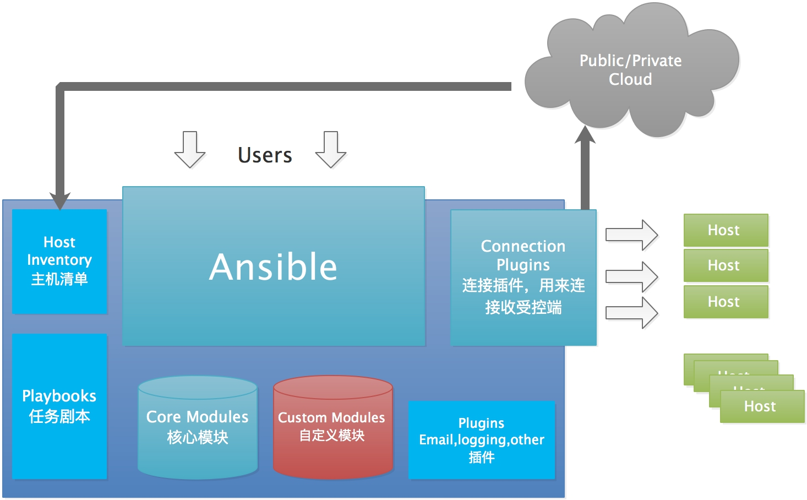
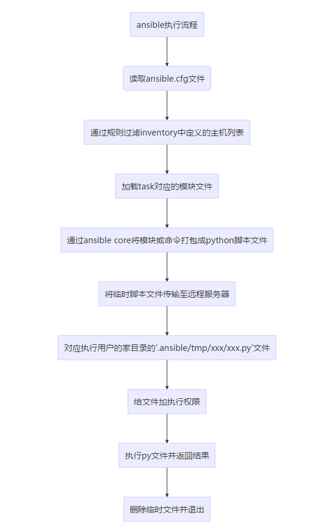

Ansible 2.9.x。
## ansible 简介
Ansible 是一种自动化运维工具，基于 Paramiko 开发的，并且基于模块化工作，Ansible 是一种集成 IT 系统的配置管理、应用部署、执行特定任务的开源平台，它是基于 Python 语言，由 Paramiko 和 PyYAML 两个关键模块构建。集合了众多运维工具的优点，实现了批量系统配置、批量程序部署、批量运行命令等功能。

Ansible 是基于模块工作的，本身没有批量部署的能力，真正具有批量部署的是 Ansible 所运行的模块，Ansible 只是提供一种框架。Ansible 不需要在远程主机上安装 Client、Agents，因为它们是基于 SSH 来和远程主机通讯的。

Ansible 的很多模块在执行时都会先判断目标节点是否要执行任务，所以，可以放心大胆地让 Ansible 去执行任务，重复执行某个任务绝大多数时候不会产生任何副作用。
### 特点
* 部署简单，只需在主控端部署 Ansible 环境，被控端无需做任何操作；
* 默认使用SSH协议对设备进行管理；
* 有大量常规运维操作模块，可实现日常绝大部分操作；
* 配置简单、功能强大、扩展性强；
* 支持 API 及自定义模块，可通过 Python 轻松扩展；
* 通过 Playbooks 来定制强大的配置、状态管理；
* 轻量级，无需在客户端安装agent，更新时，只需在操作机上进行一次更新即可；
* 提供一个功能强大、操作性强的Web管理界面和REST API接口——AWX平台。

### ansible 架构


从上图可以了解到 Ansible 由以下部分组成：
* 核心：Ansible
* 核心模块（`Core Modules`）：这些都是 Ansible 自带的模块
* 扩展模块（`Custom Modules`）：如果核心模块不足以完成某种功能，可以添加扩展模块
* 插件（`Plugins`）：完成模块功能的补充
* 剧本（`Playbooks`）：Ansible 的任务配置文件，将多个任务定义在剧本中，由 Ansible 完成执行
* 连接插件（`Connectior Plugins`）：Ansible 基于连接插件连接到各个主机上，虽然 Ansible 是使用 SSH 连接到各个主机的，但是它还支持其他的连接方法，所以需要有连接插件
* 主机清单（`Host Inventory`）：定义 Ansible 管理的主机

## 安装
安装有两种方式，`yum`安装和`pip`程序安装。
### 使用pip安装
首先，我们需要安装一个`python-pip`包，安装完成以后，则直接使用`pip`命令来安装我们的包，具体操作过程如下：
```shell
yum install python-pip
pip install ansible
```
### 使用yum安装
`yum`安装是我们很熟悉的安装方式了。我们需要先安装一个`epel-release`包，然后再安装我们的`ansible`即可。
```shell
wget -O /etc/yum.repos.d/CentOS-Base.repo http://mirrors.aliyun.com/repo/Centos-7.repo
yum install epel-release -y
yum install ansible –y
```
## 相关文件
Ansible 是一款自动化运维工具，它并不是一个服务。 因此，它没有对应的 Service 文件。Ansible 无需长期运行，只在需要使用时运行其二进制文件即可。（安装完成后，直接使用即可）

安装目录如下(`yum`安装)：

| 目录                                        | 说明       |
|-------------------------------------------|----------|
| /etc/ansible/                             | 配置文件目录   |
| /etc/ansible/ansible.cfg                  | 主配置文件    |
| /etc/ansible/hosts                        | 主机清单     |
| /etc/ansible/roles                        | 存放角色的目录  |
| /usr/bin/                                 | 执行文件目录   |
| /usr/lib/pythonX.X/site-packages/ansible/ | Lib库依赖目录 |
| /usr/share/doc/ansible-X.X.X/             | Help文档目录 |
| /usr/share/man/man1/                      | Man文档目录  |

## 主配置文件
Ansible 的配置文件可以放在多个不同地方，优先级从高到低顺序如下：
1. 环境变量`ANSIBLE_CONFIG`指向的路径文件(`export ANSIBLE_CONFIG=/etc/ansible.cfg`)
2. 项目目录下的`ansible.cfg`
3. `~/.ansible.cfg`
4. `/etc/ansible.cfg`(默认)

```shell
// 验证 Ansible
[root@ansible ~] ansible --version
ansible 2.9.6
  config file = /etc/ansible/ansible.cfg
  configured module search path = ['/root/.ansible/plugins/modules', '/usr/share/ansible/plugins/modules']
  ansible python module location = /usr/lib/python3/dist-packages/ansible
  executable location = /usr/bin/ansible
  python version = 3.8.10 (default, May 26 2023, 14:05:08) [GCC 9.4.0]


// 复制 Ansible 配置文件至当前目录
[root@ansible ~] cp /etc/ansible/ansible.cfg .

// 再次验证
[root@ansible ~] ansible --version
ansible 2.9.6
    config file = /root/ansible.cfg        # 注意配置文件路径优先级为当前目录的 ansible.cfg
    configured module search path = ['/root/.ansible/plugins/modules', '/usr/share/ansible/plugins/modules']
    ansible python module location = /usr/lib/python3/dist-packages/ansible
    executable location = /usr/bin/ansible
    python version = 3.8.10 (default, May 26 2023, 14:05:08) [GCC 9.4.0]
```
Ansible 的默认配置文件`/etc/ansible/ansible.cfg`有许多参数，一些常见的参数：
```
[defaults]
# inventory     = /etc/ansible/hosts    // 主机列表配置文件
# library = /usr/share/my_modules       // 库文件存放目录
# remote_tmp = $HOME/.ansible/tmp       // 临时py命令文件存放在远程主机目录
# local_tmp     = $HOME/.ansible/tmp    // 本机的临时命令执行目录
# forks         = 5                     // 默认并发数
# sudo_user     = root                  // 默认 sudo 用户
# ask_sudo_pass = True                  
# ask_pass     = True                  // 每次执行 ansible 命令是否询问 ssh 密码
# remote_port   = 22                   // 指定连接被管节点的管理端口，默认为22端口
# host_key_checking = False            // 检查对应服务器的 host_key, 建议取消此行注释, 实现第一次连接自动信任目标主机
# log_path=/var/log/ansible.log        // 日志文件, 建议启用
# module_name = command                // 默认模块, 可以修改为 shell 模块

[privilege_escalation]                 # 如果是普通用户则需要配置提权
# become=True
# become_method=sudo
# become_user=root
# become_ask_pass=False
```
## 主机清单
Ansible 的主要功能在于批量主机操作，为了便捷地使用其中的部分主机，可以在`Inventory`主机清单文件中将其分组组织。

默认的`inventory file`为`/etc/ansible/hosts`，当然也可以自定义，然后使用`-i`指定`inventory`文件位置。
:::warning
注意： 生产环境建议在每个项目目录下创建项目独立的 hosts 文件
:::
### 主机清单文件格式
* `inventory`文件遵循 INI 文件风格
* 中括号中的字符为组名。可以将同一个主机同时归并到多个不同的组中
* 此外，当如若目标主机使用了非默认的 SSH 端口，还可以在主机名称之后使用冒号加端口号来标明
* 如果主机名称遵循相似的命名模式，还可以使用列表的方式标识各主机

### 主机清单参数

| 参数                           | 说明                                                       |
|------------------------------|----------------------------------------------------------|
| ansible_ssh_host             | 将要连接的远程主机名，与你想要设定的主机的别名不同的话,可通过此变量设置                     |
| ansible_ssh_port             | ssh端口号，如果不是默认的端口号，通过此变量设置                                |
| ansible_ssh_user             | 默认的 ssh 用户名                                              |
| ansible_ssh_pass             | ssh 密码                                                   |
| ansible_sudo_pass            | sudo 密码                                                  |
| ansible_connection           | 与主机的连接类型，比如:local、ssh 或 paramiko                         |
| ansible_ssh_private_key_file | ssh 使用的私钥文件                                              |
| ansible_shell_type           | 目标系统的 shell 类型，默认情况下，命令的执行使用 'sh' 语法,可设置为 'csh' 或 'fish' |

```
# vim /etc/ansible/hosts ( 默认主机清单文件 )

172.16.10.101       # 被管理主机名或 IP 地址
[webservers]        # 将被管理主机分类
172.16.10.102:122   # 目标主机使用了非默认的 SSH 端口
bar.example.com
www[1:100].example.com
10.0.0.[1:100]
qkx1 ansible_ssh_port=5555 ansible_ssh_host=192.168.1.50

[dbservers]
172.16.10.103    # 仅填写主机 IP 地址也可以
two.example.com
three.example.com
db[1:3].magedu.com    # 可以使用列表的方式标识主机
db-[a:f].example.com


[targets]
localhost              ansible_connection=local
other1.example.com     ansible_connection=ssh        ansible_ssh_user=mpdehaan
other2.example.com     ansible_connection=ssh        ansible_ssh_user=mdehaan


// 定义 testsrvs 组包括两个其它分组, "实现组嵌套"
[testsrvs:children] 
webservers
dbservers

[local]
10.0.0.8 ansible_connection=local    # 指定本地连接, 无需 ssh 配置


[websrvs]    # 也可以在被控主机行添加如下信息 ( 不推荐, 会暴露主机安全 )
web01 ansible_ssh_host=10.0.0.101  # 执行 ansible 命令时显示别名, 如 web01
10.0.0.7 ansible_connection=ssh ansible_ssh_port=2222 ansible_ssh_user=wang ansible_ssh_password=magedu
10.0.0.6 ansible_connection=ssh ansible_ssh_user=root ansible_ssh_password=123456
```
### 主机变量
这些变量定义后可在 playbooks 中使用：
```
[test]
host1 http_port=80 maxRequestsPerChild=808
host2 http_port=303 maxRequestsPerChild=909
```
### 组的变量
也可以定义属于整个组的变量：
```
[test]
host1
host2

[test:vars]
ntp_server=ntp.example.com
proxy=proxy.example.com
```

## Ansible 相关工具

| 工具                        | 说明                        |
|---------------------------|---------------------------|
| /usr/bin/ansible          | AD-Hoc 临时命令执行工具           |
| /usr/bin/ansible-doc      | 查看配置文档，模块功能查看工具，相当于 man   |
| /usr/bin/ansible-galaxy   | 下载/上传优秀代码或 Roles 模块的官网平台  |
| /usr/bin/ansible-playbook | 定制自动化任务，编排剧本工具，相当于脚本      |
| /usr/bin/ansible-pull     | 远程执行命令的工具，拉取配置而非推送配置      |
| /usr/bin/ansible-vault    | 文件加密工具                    |
| /usr/bin/ansible-console  | 基于 Console 界面与用户交互的执行工具   |

利用 Ansible 实现管理的主要方式：
* Ansible Ad-Hoc：即利用`ansible`命令，主要用于临时命令使用场景
* Ansible PlayBook：主要用于长期规划好的，大型项目的场景，需要有前期的规划过程

### Ansible 使用前准备工作（建议）：
Ansible 相关工具大多数是通过 SSH 协议，实现对远程主机的配置管理、应用部署、任务执行等功能。因此，使用此工具前，先配置 Ansible 主控端能基于密钥认证的方式联系各个被管理节点。
```shell
# 解决: 远程被控端主机时, 自动回复 yes 选项
# 第一次远程连接某个主机时, 对方主机会默认询问你是否 xxx, 输入 yes 后, 默认会将远程主机公钥写入本机 known_hosts
1) 修改 SSH 客户端配置文件
vim /etc/ssh/ssh_config
StrictHostKeyChecking no   // "自动回复 yes 选项"

# 验证 known_hosts 文件
cat ~/.ssh/known_hosts

2) 或者, 修改 Ansible 配置文件
vim /etc/ansible/ansible.cfg
host_key_checking = False   // "建议取消该行注释"
```
```shell
// 基于密码认证 ( "不常用" )
# 注意: websrvs 组的所有主机密码 必须都是 123456
# 如果 websrvs 组的某个主机密码不是 123456, 则无法连接成功
# 因此推荐使用 Key 认证 !!!
ansible websrvs -m ping -k
SSH password: 123456
```
利用`sshpass`批量实现基于`key`验证脚本 1

这个脚本的作用是批量向指定的 IP 地址列表传送 SSH 公钥，并且在执行过程中忽略对远程主机主机密钥的严格检查。
```shell
// 修改下面一行 ( 允许连接新的主机时,不需要手动确认密钥 )
[root@centos8 ~] vim /etc/ssh/ssh_config
StrictHostKeyChecking no


[root@centos8 ~] vim push_ssh_key.sh
#!/bin/bash
IPLIST="
192.168.80.8
192.168.80.18
192.168.80.28"
rpm -q sshpass &> /dev/null || yum -y install sshpass  
[ -f /root/.ssh/id_rsa ] || ssh-keygen -f /root/.ssh/id_rsa  -P '' export SSHPASS=123456  # 主机密码
for IP in $IPLIST;do
    {
    sshpass -e ssh-copy-id -o StrictHostKeyChecking=no $IP 
    }&
done 
wait
```
实现基于 key 验证的脚本 2

这段脚本主要用于在局域网中扫描活动的主机，然后通过 SSH 在这些主机之间传递 SSH 密钥以便后续相互访问时不需要手动确认密钥。

该脚本会实现主机之间相互免密认证。
```shell
#!/bin/bash
PASS=redhat        # 主机密码
# 设置网段最后的地址, 4-255 之间, 越小扫描越快
END=254

IP=`ip a s eth0 | awk -F'[ /]+' 'NR==3{print $3}'`    # 注意网卡名称
NET=${IP%.*}.

rm -f /root/.ssh/id_rsa
[ -e ./SCANIP.log ] && rm -f SCANIP.log
for((i=3;i<="$END";i++));do
ping -c 1 -w 1  ${NET}$i &> /dev/null  && echo "${NET}$i" >> SCANIP.log &
done
wait

ssh-keygen -P "" -f /root/.ssh/id_rsa
rpm -q sshpass || yum -y install sshpass
sshpass -p $PASS ssh-copy-id -o StrictHostKeyChecking=no $IP 

AliveIP=(`cat SCANIP.log`)
for n in ${AliveIP[*]};do
sshpass -p $PASS scp -o StrictHostKeyChecking=no -r /root/.ssh root@${n}:
done

# 把 .ssh/known_hosts 拷贝到所有主机, 使它们第一次互相访问时不需要输入回车
for n in ${AliveIP[*]};do
scp /root/.ssh/known_hosts ${n}:.ssh/
done

[root@centos7 ~] bash push_ssh_key.sh
```
### ansible Ad-Hoc
Ansible 的执行方式的主要工具就是`ansible`（专业名词：Ad-Hoc）。用于执行一次性的任务，临时任务。
```shell
# 格式
ansible <host-pattern> [-m module_name] [-a args]
```
也可以通过`ansible -h`来查看帮助，比较常用的选项：

| 选项                      | 说明                                             |
|-------------------------|------------------------------------------------|
| -a MODULE_ARGS          | 模块的参数                                          |
| -k，--ask-pass           | 提示输入 ssh 连接密码, 默认 Key 验证                       |
| -K, --ask-become-pass   | 提示输入 sudo 时的口令                                 |
| --ask-vault-pass        | 假设我们设定了加密的密码，则用该选项进行访问                         |
| -C, --check             | 模拟运行环境并进行预运行，可以进行查错测试                          |
| -f FORKS, --forks FORKS | 指定并发同时执行 ansible 任务的主机数，默认为5                   |
| -i INVENTORY            | 指定主机清单的路径，默认为/etc/ansible/hosts                |
| --list-hosts            | 显示主机列表, 可简写 --list                             |
| -m MODULE_NAME          | 执行模块的名字，默认使用 command 模块，所以如果是只执行单一命令可以不用 -m 参数 |
| -o                      | 压缩输出，尝试将所有结果在一行输出，一般针对收集工具使用                   |
| -S                      | 用 su 命令                                        |
| -R SU_USER              | 指定 su 的用户，默认为 root 用户                          |
| -s                      | 用 sudo 命令                                      |
| -U SUDO_USER            | 指定 sudo 到哪个用户，默认为 root 用户                      |
| -T, --timeout=TIMEOUT   | 指定 ssh 默认超时时间，默认为10s，也可在配置文件中修改                |
| -u, --user=REMOTE_USER  | 远程用户，默认为 root 用户                               |
| -v, -vv, -vvv           | 查看详细信息                                         |
| -b, --become            | 代替旧版的 sudo 切换                                  |
| --become-user=USERNAME  | 指定 sudo 的 runas 用户, 默认为 root                   |

```shell
# 特殊案例 ( localhost: 代表本机)
ansible localhost -m ping
# 列出 Ansible 可控制的所有主机
ansible all --list-hosts
# 列出 Ansible 可控制的 websrvs 组主机
ansible websrvs --list-hosts
```
```shell
# 先在被控制端 授权普通用户 sudo 权限
[root@centos8 ~] useradd wangj
[root@centos8 ~] echo 123456 | passwd --stdin wangj
[root@centos8 ~] vim /etc/sudoers
wangj    ALL=(ALL) NOPASSWD: ALL

# 以 wangj 普通用户身份连接主机, 并利用 sudo 授权 root 权限执行 whoami 命令
[root@ansible ~] ansible 192.168.80.8 -m shell -a 'whoami' -u wangj -k -b --become-user=root
SSH password:        // 输入远程主机 wangj 用户 ssh 连接密码
10.0.0.8 | CHANGED | rc=0 >>
root
```
#### host-pattern
用于匹配被控制的主机列表。
```shell
# all：表示所有 Inventory 中的所有主机
ansible all -m ping
# *：通配符
ansible "*" -m ping
ansible 192.168.1.* -m ping

# 或 关系
# websrvs 或 dbsrvs 主机
ansible "websrvs:dbsrvs" -m ping
# 192.168.80.18 或 192.168.80.28 主机
ansible "192.168.80.18:192.168.80.28" -m ping

# 逻辑 与
# 在 websrvs 组并且在 dbsrvs 组中的主机
ansible "websrvs:&dbsrvs" -m ping

# 逻辑 非
# 在 websrvs 组, 但不在 dbsrvs 组中的主机
# 注意: 此处为单引号
ansible 'websrvs:!dbsrvs' -m ping

# 综合 逻辑
ansible 'websrvs:dbsrvs:&appsrvs:!ftpsrvs' -m ping

# 正则 表达式
ansible "websrvs:dbsrvs" -m ping
ansible "~(web|db).*\.magedu\.com" -m ping
```
#### ansible 命令执行过程
1. 加载默认配置文件`/etc/ansible/ansible.cfg`
2. 查找对应的主机配置文件，找到要执行的主机或者组；
3. 加载相应的模块，如`command`
4. Ansible 生成临时 Python 文件，并传输到远程服务器的`$HOME/.ansible/tmp/ansible-tmp-数字/XXX.PY`
5. 为文件添加执行权限
6. 执行并返回结果
7. 删除临时`py`文件并退出



#### Ansible 的执行状态
```shell
[root@centos8 ~] grep -A 14 '\[colors\]' /etc/ansible/ansible.cfg
[colors]
# highlight = white
# verbose = blue
# warn = bright purple
# error = red
# debug = dark gray
# deprecate = purple
# skip = cyan
# unreachable = red
# ok = green
# changed = yellow
# diff_add = green
# diff_remove = red
# diff_lines = cyan
```
Ansible 执行返回 -> 颜色信息说明：
* 绿色：成功执行，没有发生状态改变
* 黄色：成功执行，有发生状态改变
* 红色：执行失败

### ansible-doc
`ansible-doc`命令用于获取模块信息及其使用帮助，相当于`man`。
```shell
ansible-doc -l				#获取全部模块的信息
ansible-doc -s MOD_NAME		#获取指定模块的使用帮助
```
```shell
# 列出所有模块
ansible-doc -l

# 查看指定模块帮助用法 ( 详细说明 )
ansible-doc ping

# 查看指定模块帮助用法 ( 简单说明 )
ansible-doc -s ping
ansible-doc -l | grep ^ping
# "重要"
# 查看模块的 "使用案例"
ansible-doc ping | grep -A 100 EXA
ansible-doc file | grep -A 100 EXA
```
### ansible-console
此工具可交互执行命令，支持`tab`。

提示符格式：`执行用户@当前操作的主机组 (当前组的主机数量)[f:并发数]$`

常用子命令：
* 设置并发数：`forks n`，例如：`forks 10`
* 切换组：`cd`主机组，例如：`cd web`
* 列出当前组主机列表：`list`
* 列出所有的内置命令：`?`或`help`

```shell
[01:13:41 root@ansible ~]# ansible-console
Welcome to the ansible console.
Type help or ? to list commands.


root@all (3)[f:5]$ list
192.168.80.8
192.168.80.18
192.168.80.28
root@all (3)[f:5]$ cd websrvs
root@websrvs (2)[f:5]$ list
192.168.80.18
192.168.80.28
root@websrvs (2)[f:5]$ forks 1
root@websrvs (2)[f:1]$ ping
192.168.80.18 | SUCCESS => {
    "ansible_facts": {
        "discovered_interpreter_python": "/usr/libexec/platform-python"
    }, 
    "changed": false, 
    "ping": "pong"
}
192.168.80.28 | SUCCESS => {
    "ansible_facts": {
        "discovered_interpreter_python": "/usr/libexec/platform-python"
    }, 
    "changed": false, 
    "ping": "pong"
}
root@appsrvs (2)[f:5]$ yum name=httpd state=present
root@appsrvs (2)[f:5]$ service name=httpd state=started
```
### ansible-playbook
此工具用于执行编写好的 PlayBook 任务。
```shell
[root@ansible ~] vim hello.yml
---
# hello world yml file
- hosts: websrvs
  remote_user: root
  gather_facts: no
  
  tasks:
    - name: hello world
      command: /usr/bin/wall hello world

[root@ansible ~] ansible-playbook hello.yml
```
### ansible-vault
此工具可以用于加密解密`yml`文件。
```shell
ansible-vault [create|decrypt|edit|encrypt|rekey|view]
```
```shell
ansible-vault encrypt hello.yml     # 加密
ansible-vault decrypt hello.yml     # 解密
ansible-vault view hello.yml        # 查看
ansible-vault edit hello.yml        # 编辑加密文件
ansible-vault rekey hello.yml       # 修改口令
ansible-vault create new.yml        # 创建新文件
```
### ansible-galaxy
Galaxy 是一个免费网站，类似于 GitHub 网站，网站上发布了很多的共享的`Roles`角色。

Ansible 提供了`ansible-galaxy`命令行工具连接`https://galaxy.ansible.com`网站下载相应的`Roles`，进行`init`(初始化)、`search`(查询)、`install`(安装)、`remove`(移除)等操作。
```shell
# 搜索项目
[root@ansible ~] ansible-galaxy search lamp

# 列出所有已安装的 galaxy
ansible-galaxy list

# 安装 galaxy, 默认下载到 ~/.ansible/roles 下
ansible-galaxy install geerlingguy.mysql
ansible-galaxy install geerlingguy.redis

# 删除 galaxy
ansible-galaxy remove geerlingguy.redis
```
