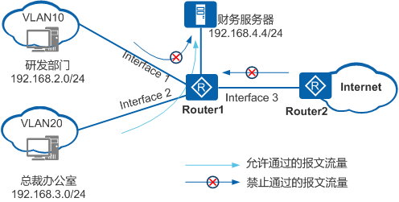
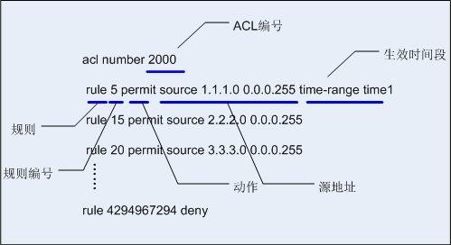
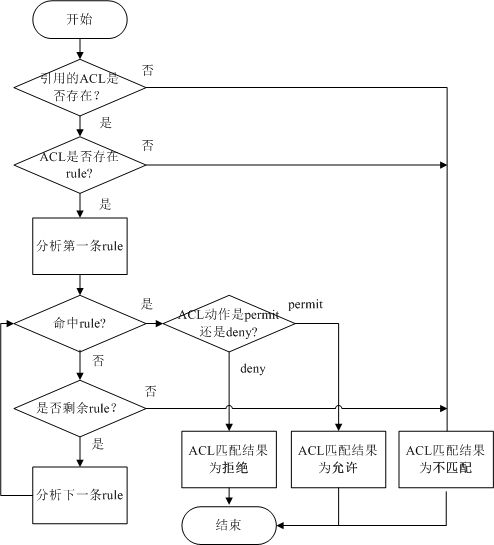
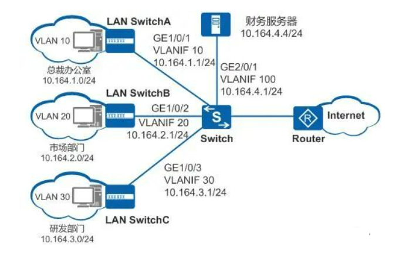

ACL（`Access Control List`，访问控制列表）是由一系列`permit`或`deny`语句组成的、有序的规则集合，它通过匹配报文的相关字段实现对报文的分类。

ACL 本身只是一组规则，只能区分某一类报文，换句话说，ACL 更像是一个工具，当我们希望通过 ACL 来实现针对特定流量的过滤时，就需要在适当的应用中调用已经定义好的 ACL。

ACL 的主要使用场景：
* 被流量策略调用，用于过滤流量（可基于源、目的IP地址、协议类型、端口号等元素）
* 在`route-policy`中被调用，用于匹配特定的路由前缀，从而执行路由策略
* 在 VPN 中调用，用于匹配感兴趣数据流
* 在防火墙的策略部署中调用，用于匹配流量
* 其他

ACL  是一个列表形式的一组规则。ACL 能够识别一个 IP 数据包中的源 IP 地址、目的 IP 地址、协议类型、源目的端口等元素，从而能够针对上述元素进行报文的匹配。

例如一个网络设备在某个接口上源源不断地接收各种网络流量，现在我们希望对这些流量中的某些特定流量进行识别，以便做进一步的动作，那么就可以用到 ACL 了。此外，除了能够用于匹配数据，ACL 还能够用于匹配路由，使得我们能够针对不同的路由部署不同的路由策略。

## 典型的 ACL 应用组网场景



某企业为保证财务数据安全，禁止研发部门访问财务服务器，但总裁办公室不受限制。

实现方式：在`Interface1`的入方向上部署 ACL，禁止研发部门访问财务服务器的报文通过。`Interface2`上无需部署 ACL，总裁办公室访问财务服务器的报文默认允许通过。

保护企业内网环境安全，防止 Internet 病毒入侵。

实现方式：在`Interface3`的入方向上部署 ACL，将病毒经常使用的端口予以封堵。

## ACL的基本语句
ACL 由一系列规则组成，通过将报文与 ACL 规则进行匹配，设备可以过滤出特定的报文。



**ACL编号**：用于标识 ACL，表明该 ACL 是数字型 ACL。

**规则**：即描述报文匹配条件的判断语句。

**规则编号**：用于标识 ACL 规则。可以自行配置规则编号，也可以由系统自动分配。

ACL 规则的编号范围是`0～4294967294`，所有规则均按照规则编号从小到大进行排序。所以，上图中的`rule 5`排在首位，而规则编号最大的`rule 4294967294`排在末位。系统按照规则编号从小到大的顺序，将规则依次与报文匹配，一旦匹配上一条规则即停止匹配。

**动作**：包括`permit/deny`两种动作，表示允许/拒绝。

**匹配项**：ACL 定义了极其丰富的匹配项。除了图中的源地址和生效时间段，ACL 还支持很多其他规则匹配项。例如，二层以太网帧头信息（如源 MAC、目的 MAC、以太帧协议类型）、三层报文信息（如目的地址、协议类型）以及四层报文信息（如 TCP/UDP 端口号）等。
## ACL的匹配机制
设备将报文与 ACL 规则进行匹配时，遵循“一旦命中立即停止匹配”的机制。



* 首先系统会查找设备上是否配置了 ACL。
* 如果 ACL 不存在，则返回ACL匹配结果为：不匹配。
* 如果 ACL 存在，则查找设备是否配置了 ACL 规则。
* 如果匹配上了`permit`规则，则停止查找规则，并返回 ACL 匹配结果为：匹配（允许）。
* 如果匹配上了`deny`规则，则停止查找规则，并返回 ACL 匹配结果为：匹配（拒绝）。
* 如果未匹配上规则，则继续查找下一条规则，以此循环。如果一直查到最后一条规则，报文仍未匹配上，则返回 ACL 匹配结果为：不匹配。
* 如果规则不存在，则返回 ACL 匹配结果为：不匹配。
* 如果规则存在，则系统会从 ACL 中编号最小的规则开始查找。

## 步长
步长，是指系统自动为 ACL 规则分配编号时，每个相邻规则编号之间的差值。也就是说，系统是根据步长值自动为 ACL 规则分配编号的。
```shell
[HUAWEI-acl-basic-2000]display acl 2000
Basic ACL 2000,3 rules
ACL’s step is 5
  rule 5 permit source 1.1.1.0 0.0.0.255(match-counter 0)
  rule 10 permit source 2.2.2.0 0.0.0.255(match-counter 0)
  rule 15 permit source 3.3.3.0 0.0.0.255(match-counter 0)
  
[HUAWEI-acl-basic-2000]step 2
[HUAWEI-acl-basic-2000]display acl 2000
ACL’s step is 5
  rule 2 permit source 1.1.1.0 0.0.0.255(match-counter 0)
  rule 4 permit source 2.2.2.0 0.0.0.255(match-counter 0)
  rule 6 permit source 3.3.3.0 0.0.0.255(match-counter 0)
```
ACL 的缺省步长值是 5。通过`display acl acl-number`命令，可以查看 ACL 规则、步长等配置信息。通过`step number`命令，可以修改 ACL 步长值。

实际上，设置步长的目的，是为了方便在 ACL 规则之间插入新的规则。

假设，一条 ACL 中，已包含了下面三条规则 5、10、15。如果你希望源 IP 地址为`1.1.1.3`的报文也被禁止通过，该如何处理呢？
```
rule 5 deny source 1.1.1.1 0  //表示禁止源IP地址为1.1.1.1的报文通过                  
rule 10 deny source 1.1.1.2 0 //表示禁止源IP地址为1.1.1.2的报文通过                   
rule 15 permit source 1.1.1.0 0.0.0.255 //表示允许源IP地址为1.1.1.0网段的报文通过
```
我们来分析一下。由于 ACL 匹配报文时遵循“一旦命中即停止匹配”的原则，所以源 IP 地址为`1.1.1.1`和`1.1.1.2`的报文，会在匹配上编号较小的`rule 5`和`rule 10`后停止匹配，从而被系统禁止通过；而源 IP 地址为`1.1.1.3`的报文，则只会命中`rule 15`，从而得到系统允许通过。要想让源 IP 地址为`1.1.1.3`的报文也被禁止通过，我们必须为该报文配置一条新的`deny`规则。
```
rule 5 deny source 1.1.1.1 0  //表示禁止源IP地址为1.1.1.1的报文通过                  
rule 10 deny source 1.1.1.2 0 //表示禁止源IP地址为1.1.1.2的报文通过                   
rule 11 deny source 1.1.1.3 0 //表示禁止源IP地址为1.1.1.3的报文通过 
rule 15 permit source 1.1.1.0 0.0.0.255 //表示允许源IP地址为1.1.1.0网段的报文通过
```
在`rule 10`和`rule 15`之间插入`rule 11`后，源 IP 地址为`1.1.1.3`的报文，就可以先命中`rule 11`而停止继续往下匹配，所以该报文将会被系统禁止通过。

试想一下，如果这条 ACL 规则之间间隔不是 5，而是 1（`rule 1、rule 2、rule 3…`），这时再想插入新的规则，只能先删除已有的规则，然后再配置新规则，最后将之前删除的规则重新配置回来。如果这样做，那付出的代价可真是太大了！

所以，通过设置 ACL 步长，为规则之间留下一定的空间，后续再想插入新的规则，就非常轻松了。

## ACL的分类
### 基于ACL标识方法的划分
* 数字型 ACL：传统的 ACL 标识方法。创建 ACL 时，指定一个唯一的数字标识该 ACL。
* 命名型 ACL：通过名称代替编号来标识 ACL。

用户在创建 ACL 时可以为其指定编号，不同的编号对应不同类型的 ACL。同时，为了便于记忆和识别，用户还可以创建命名型 ACL，即在创建 ACL 时为其设置名称。命名型 ACL，也可以是“名称数字”的形式，即在定义命名型 ACL 时，同时指定 ACL 编号。如果不指定编号，系统则会自动为其分配一个数字型 ACL 的编号。

### 基于ACL规则定义方式的划分
* 基本 ACL
* 高级 ACL
* 二层 ACL
* 用户自定义 ACL

#### 高级ACL
既可使用 IPv4 报文的源 IP 地址，也可使用目的 IP 地址、IP 协议类型、ICMP 类型、TCP 源/目的端口、UDP 源/目的端口号、生效时间段等来定义规则。编号范围 3000～3999。
```shell
[Huawei]acl 3001
# 在 ACL3001 中配置规则，允许源 IP 地址是 192.168.1.3 的主机
# 且目的 IP 地址是 192.168.2.0/24 网段地址的 ICMP 报文通过。
[Huawei-acl-adv-3001]rule permit icmp source 192.168.1.3 0 destination 192.168.2.00.0.0.255
```
#### 二层ACL
使用报文的以太网帧头信息来定义规则，如根据源 MAC 地址、目的 MAC 地址、二层协议类型等。编号范围 4000～4999。
```shell
[Huawei]acl 4001
# 在 ACL4001 中配置规则，允许目的 MAC 地址是 0000-0000-0001、
# 源 MAC 地址是 0000-0000-0002 的 ARP 报文（二层协议类型值为0x0806）通过。
[Huawei-acl-L2-4001]rule permit destination-mac 0000-0000-0001 source-mac 0000-0000-0002|2-protocol 0x0806
```
#### 用户自定义ACL
可根据报文偏移位置和偏移量来定义规则。编号范围 5000～5999。

|    ACL类别    |                                       规则定义描述                                       |    编号范围    |
|:-----------:|:----------------------------------------------------------------------------------:|:----------:|
|    基本ACL    |                            仅使用报文的源IP地址、分片标记和时间段信息来定义规则。                            | 2000～2999  |
| 高级ACL       | 既可使用报文的源IP地址，也可使用目的地址、IP优先级、ToS、DSCP、IP协议类型、ICMP类型、TCP源端口/目的端口、UDP源端口/目的端口号等来定义规则。 | 3000～3999  |
|   二层ACL	    |                   可根据报文的以太网帧头信息来定义规则，如根据源MAC地址、目的MAC地址、以太帧协议类型等。                   | 4000～4999  |
|  用户自定义ACL   |                                可根据报文偏移位置和偏移量来定义规则。                                 | 5000～5999  |

## 基本ACL
仅使用报文的源 IP 地址、分片信息和生效时间段信息来定义规则。编号范围 2000～2999。

配置基本 ACL 分为 2 步：
1. 创建 ACL 的编号
2. 配置规则

```shell
# number为可选，
acl [number] number
# rule-id为规则编号
# source-wildcard是源地址通配符
# any表示任意源地址，等价于 0.0.0.0 255.255.255.255
# time-range用来规定acl生效的时间段
# fragment用来对分片的报文进行匹配
rule [rule-id] {permit|deny} [source {source-address source-wildcard|any}|fragment|logging|time-range time-name]
```
```shell
[Huawei]acl ?
  INTEGER<2000-2999>  Basic access-list(add to current using rules)
  INTEGER<3000-3999>  Advanced access-list(add to current using rules)
  INTEGER<4000-4999>  Specify a L2 acl group
  ipv6                ACL IPv6 
  name                Specify a named ACL
  number              Specify a numbered ACL
# 进入 acl 视图
[Huawei]acl number 2000
[Huawei-acl-basic-2000]rule ?
  INTEGER<0-4294967294>  ID of ACL rule
  deny                   Specify matched packet deny
  permit                 Specify matched packet permit
[Huawei-acl-basic-2000]rule permit ?
  fragment             Check fragment packet
  none-first-fragment  Check the subsequence fragment packet  
  source               Specify source address
  time-range           Specify a special time
  vpn-instance         Specify a VPN-Instance
  <cr>                 Please press ENTER to execute command 
[Huawei-acl-basic-2000]rule permit source 1.1.1.0 0 # 可以不指定rule-id
[Huawei-acl-basic-2000]rule deny source 10.1.1.0 0.0.0.255
[Huawei-acl-basic-2000]rule 8 permit source 8.8.8.8 0 # 可以指定rule-id
[Huawei-acl-basic-2000]display this
[V200R003C00]
#
acl number 2000  
 rule 5 permit source 1.1.1.0 0 
 rule 8 permit source 8.8.8.8 0 
 rule 10 deny source 10.1.1.0 0.0.0.255 
#
return
[Huawei-acl-basic-2000]
```
## 高级 ACL
高级 ACL可以根据源 IP 地址、目的IP地址、IP优先级、TOS、IP 协议类型、ICMP 类型、TCP 源端口/目的端口、UDP 源端口/目的端口号等信息对 IPv4 报文进行分类。配置高级 ACL 时，需要先创建一个高级 ACL，高级 ACL编号范围是 3000~3999。

基本语法：
```shell
# number为可选，
acl [number] number
# rule-id为规则编号
# source-wildcard是源地址通配符
# any表示任意源地址，等价于 0.0.0.0 255.255.255.255
# time-range用来规定acl生效的时间段
# fragment用来对分片的报文进行匹配
rule [rule-id] {permit|deny} {ip|tcp|udp|ospf} [destination {destination-address destination-wildcard|any}|source {source-address source-wildcard|any}|time-range time-name]
```
```shell
[Huawei]acl 3000
[Huawei-acl-adv-3000]rule permit ?
  <1-255>  Protocol number
  gre      GRE tunneling(47)
  icmp     Internet Control Message Protocol(1)
  igmp     Internet Group Management Protocol(2)
  ip       Any IP protocol
  ipinip   IP in IP tunneling(4)
  ospf     OSPF routing protocol(89)
  tcp      Transmission Control Protocol (6)
  udp      User Datagram Protocol (17)
[Huawei-acl-adv-3000]rule permit tcp destination 10.1.1.1 0 ?
  destination-port     Specify destination port
  dscp                 Specify dscp
  fragment             Check fragment packet
  none-first-fragment  Check the subsequence fragment packet  
  precedence           Specify precedence
  source               Specify source address
  source-port          Specify source port
  tcp-flag             Specify tcp flag
  time-range           Specify a special time
  tos                  Specify tos
  vpn-instance         Specify a VPN-Instance
  <cr>                 Please press ENTER to execute command 
[Huawei-acl-adv-3000]rule permit tcp destination 10.1.1.1 0 destination-port ?
  eq     Equal to given port number
  gt     Greater than given port number
  lt     Less than given port number
  range  Between two port numbers

[Huawei-acl-adv-3000]rule permit tcp destination 10.1.1.1 0 destination-port eq ?
  <0-65535>  Port number
  CHARgen    Character generator (19)
  bgp        Border Gateway Protocol (179)
  cmd        Remote commands (rcmd, 514)
  daytime    Daytime (13)
  discard    Discard (9)
  domain     Domain Name Service (53)
  echo       Echo (7)
  exec       Exec (rsh, 512)
  finger     Finger (79)
  ftp        File Transfer Protocol (21)
  ftp-data   FTP data connections (20)
  gopher     Gopher (70)
  hostname   NIC hostname server (101)
  irc        Internet Relay Chat (194)
  klogin     Kerberos login (543)
  kshell     Kerberos shell (544)
  login      Login (rlogin, 513)
  lpd        Printer service (515)
  nntp       Network News Transport Protocol (119)
  pop2       Post Office Protocol v2 (109)
  pop3       Post Office Protocol v3 (110)
  smtp       Simple Mail Transport Protocol (25)
  sunrpc     Sun Remote Procedure Call (111)
  tacacs     TAC Access Control System (49)
  talk       Talk (517)
  telnet     Telnet (23)
  time       Time (37)
  uucp       Unix-to-Unix Copy Program (540)
  whois      Nicname (43)
  www        World Wide Web (HTTP, 80)
```
## 基于时间的 ACL
网络中某些业务应用 ACL 时需要限制在一定的时间范围内生效，比如在企业中需要限制员工工作时间段内才能浏览互联网，其他时间不允许访问。可以通过 ACL 为用户创建生效时间段,通过在规则中引用时间段信息限制 ACL 生效的时间范围，从而使得该业务能在一定的时间范围内生效。

创建时间段语法：
```shell
#start-time指定开始时间，格式为hh:mm
time-range time-name { start-time to end-time days|from time1 date1 [to time2 date2]}
```
```shell
# 创建一个工作时间段（周一至周五）每天9:00~18:00
[Huawei]time-range time1 9:00 to 18:00 working-day daily
# 创建一个绝对时间段
[Huawei]time-range time2 from 12:00 2016/1/1 to 14:00 2016/1/1
```
```shell
[Huawei]time-range FTP 9:00 to 18:00 working-day daily
[Huawei]acl 2000
[Huawei-acl-basic-2000]rule 10 permit source 172.16.10.1 0
[Huawei-acl-basic-2000]rule 20 deny source 172.16.20.1 0 time-range FTP
```
## 实战
某公司通过交换机实现各部门之间的互连。要求只允许公司内网用户可以访问内网中的财务服务器，外网用户不允许访问。



1. 配置接口加入 VLAN，并配置 VLANIF 接口的 IP 地址
将`GE1/0/1～GE1/0/3`分别加入`VLAN10、20、30`，这三个`vlan`中，也就是给公司三个部门各分配一个`vlan`。

`GE2/0/1`加入`VLAN100`，并配置各`VLANIF`接口的IP地址，也就是内网财务服务器的端口单独加一个`vlan`。
```
<HUAWEI>system-view
[HUAWEI]sysname Switch
[Switch]vlan batch 10 20 30 100
[Switch]interface gigabitethernet 1/0/1
[Switch-gigabitethernet-1/0/1]port link-type trunk
[Switch-gigabitethernet-1/0/1]port trunk allow-pass vlan 10
[Switch-gigabitethernet-1/0/1]quit
[Switch]interface vlanif 10
[Switch-Vlanif10]ip address 10.164.1.1 255.255.255.0
```
```
[Switch]interface gigabitethernet 1/0/2
[Switch-gigabitethernet-1/0/2]port link-type trunk
[Switch-gigabitethernet-1/0/2]port trunk allow-pass vlan 20
[Switch-gigabitethernet-1/0/2]quit
[Switch]interface vlanif 20
[Switch-Vlanif20]ip address 10.164.2.1 255.255.255.0
```
```
[Switch]interface gigabitethernet 2/0/1
[Switch-gigabitethernet-2/0/1]port link-type trunk
[Switch-gigabitethernet-2/0/1]port trunk allow-pass vlan 100
[Switch-gigabitethernet-2/0/1]quit
[Switch]interface vlanif 100
[Switch-Vlanif100]ip address 10.164.4.1 255.255.255.0
```
2. 配置ACL
创建高级 ACL 3002 并配置 ACL 规则，允许位于内网的总裁办公室、市场部和研发部访问财务服务器的报文通过，拒绝外网用户访问财务服务器的报文通过。
```
[Switch]acl 30002
[Switch-acl-adv-3002]rule permit ip source 10.164.1.0 0.0.0.255 destination 10.164.4.4 0.0.0.0 //允许总裁办公室访问务服务器
[Switch-acl-adv-3002]rule permit ip source 10.164.2.0 0.0.0.255 destination 10.164.4.4 0.0.0.0 //允许市场部访问务服务器
[Switch-acl-adv-3002]rule permit ip source 10.164.3.0 0.0.0.255 destination 10.164.4.4 0.0.0.0 //允许研发部访问务服务器
[Switch-acl-adv-3002]rule deny ip destination 10.164.4.4 0.0.0.0 //禁止其他用户访问财务服务器
[Switch-acl-adv-3002]quit
```
3. 配置基于ACL的流分类
配置流分类`c_network`，对匹配 ACL 3002 的报文进行分类。
```
[Switch]traffic classifier c_network // 创建流分类
[Switch-classifier-c_network]if-match acl 3002 // 将 acl 与流分类关联
```
4. 配置流行为
配置流行为`b_network`，动作为允许报文通过（缺省值，不需配置）。
```
[Switch]traffic behavior b_network // 创建流行为
```
5. 配置流策略
```
[Switch]traffic policy p_network // 创建流策略
// 配置流策略p_network，将流分类c_network与流行为b_network关联。
[Switch-trafficpolicy-p_network]classifier c_network behavior b_network
```
6. 应用流策略
由于内外网访问服务器的流量均从接口`GE2/0/1`出口流向服务器，所以可以在`GE2/0/1`接口的出方向应用流策略`p_network`。
```
[Switch]interface gigabitethernet 2/0/1
[Switch-gigabitethernet-2/0/1]traffic-policy p_network outbound
```
