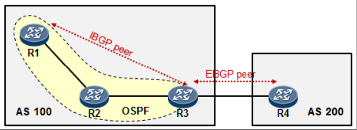
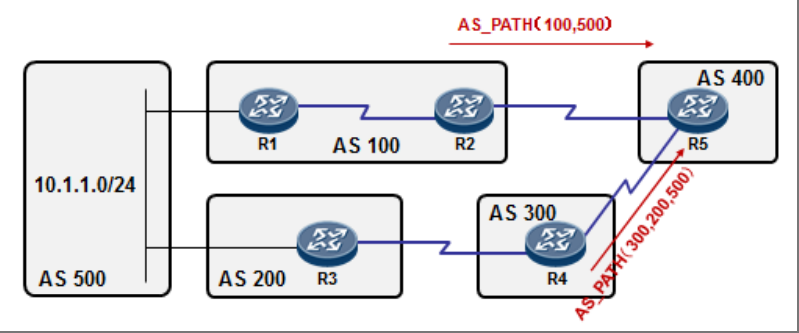
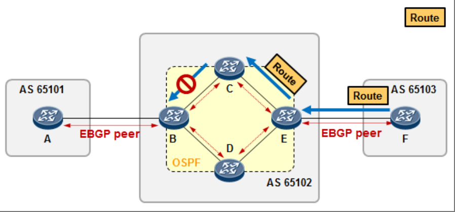
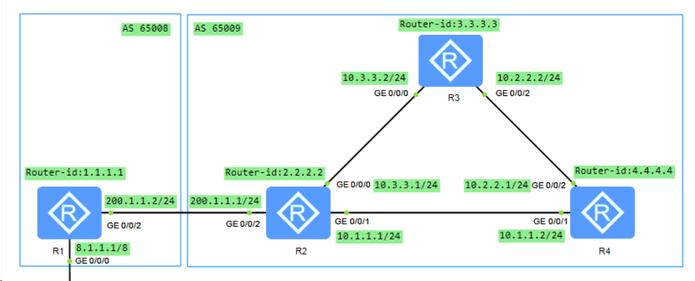

IGP 也即内部网关路由协议，典型代表有 OSPF、IS-IS 等。IGP 工作的“着眼点”在 AS（自治系统）内部，它的主要职责就是负责 AS 内的路由发现和快速收敛，而且其承载的路由前缀就是本 AS 内的前缀。

AS（`Autonomous system`，自治系统）指的是在同一个组织或机构管理下、使用相同策略的设备的集合。我们可以简单的将 AS 理解为一个独立的机构或者企业（例如中国联通）所管理的网络。

不同的 AS 通过 AS 号区分，AS 号取值范围 1－65535，其中 64512－65535 是私有 AS 号，在私有网络可随意使用。IANA 负责 AS 号的分发，如果要使用公有 AS 号，则需要向 IANA 申请。

BGP（`Border Gateway Protocol`，边界网关协议），是一种距离矢量路由协议，严格的说应该叫路径矢量路由协议，主要用于在 AS 之间传递路由信息，适用于大规模的网络环境，Internet 的骨干网络正是得益于 BGP 才能承载如此大批量的路由前缀。总的来说，无论是内部网关路由协议，或者外部网关路由协议，最终的目的都是为了实现路由的互通，从而最终实现数据的互通。
## BGP的协议特征
* BGP 在传输层使用 TCP 以确保可靠传输，所使用的 TCP 目的端口号为179；
* BGP 会在需要交换路由的路由器之间建立 TCP 连接，这些路由器被称为 BGP 对等体，也叫 BGP 邻居。有两种 BGP 邻居关系：EBGP 邻居关系，以及 IBGP 邻居关系。
* BGP 的邻居关系可以跨路由器建立，而不像 OSPF 及 RIP 那样，必须要求直连。
* BGP 对等体在邻居关系建立时交换整个 BGP 路由表。
* 在邻居关系建立完成后，BGP 路由器只发送增量更新或触发更新（不会周期性更新）。
* BGP 具有丰富的路径属性和强大的策略工具。
* BGP 能够承载大批量的路由前缀，用于大规模的网络中。

## BGP报文
BGP报文是被承载在TCP报文之上的，使用端口号179。共有五种报文：

| 报文名称          | 作用 | 发包时间 |
|---------------|----|------|
| OPEN          |协商BGP邻居的各项参数，建立邻居关系   | 通过TCP建立BGP连接，发送open报文     |
| UPDATE        | 进行路由信息的交换   | 连接建立后，有路由需要发送或路由变化时，发送UPDATE通告对端路由信息     |
| KEEPALIVE     | 维持邻居关系   | 定时发送KEEPALIVE报文以保持BGP邻居关系的有效性     |
| NOTIFICATION  | 报告错误，中止邻居关系   | 当BGP在运行中发现错误时，要发送NOTIFICATION报文通告BGP对端     |
| Route-refresh | 为保证网络稳定，触发更新路由的机制   | 当路由策略发生变化时，触发请求邻居重新通告路由     |

## BGP对等体类型
运行 BGP 的路由器被称为`BGP speaker`。BGP 路由器之间要交互 BGP 路由，前提是要建立正常的 BGP 邻居关系。要建立正确的 BGP 邻居关系，首先 BGP 对等体之间要先建立 TCP 连接，由于 BGP 是承载在 TCP 之上的，因此 BGP 没有“邻居必须直连”的限制。

有两种 BGP 邻居关系：
* EBGP 邻居（`External BGP peer`）：位于不同 AS 的 BGP 路由器之间的 BGP 邻居关系

在上图中，R1、R2、R3 属于一个 AS，AS 号为 100；R4 属于另一个 AS，AS 号为 200。由于 R3 及 R4 分别属于两个不同的 AS，因此它们之间建立的 BGP 邻居关系就是 EBGP 邻居关系。 
要建立 EBGP 邻接关系必须至少满足两个条件：
1. 两个 EBGP 邻居所属 AS 号不同；
2. `Peer`命令所指定的 IP 地址要路由可达，并且两者之间 TCP 连接能够建立。
* IBGP 邻居关系（`Internal BGP peer`）：位于相同 AS 的 BGP 路由器之间的 BGP 邻接关系
在上图中，在 AS100 内，R1、R2、R3 运行了一个 IGP，也就是 OSPF，运行 OSPF 的目的是为了让 AS 内的路由能够打通。另一方面，R1 与 R3 之间建立一个 BGP 邻居关系，由于 R1 及 R3 同属一个 AS，因此它们之间建立的 BGP 连接是 IBGP 的邻居关系。
值得注意的是，R2 并没有运行 BGP，R1-R3 之间并非直连，这在 BGP 中是被允许的，因为 BGP 是被承载在 TCP 之上的。建立 IBGP 邻接关系，必须至少满足两个条件：
1. 两个 IBGP 邻居所属  AS 号相同；
2. `Peer`命令所指定的IP地址要路由可达，并且TCP连接能够建立。

不同的 BGP 邻居关系，对路由的操作是有明显区别的。
## BGP的路径矢量特征
BGP 是一个路径矢量路由协议。在某些层面上，它与 RIP 非常相似，在 BGP 邻居之间互相更新的是路由表，BGP 路由同样有距离的概念，只不过这里的距离，与 RIP 的所谓跳数是完全不同的。

BGP 在将路由更新给邻居时，会给每条路由粘附许多路径属性（`Path Attribute`）。BGP 定义了丰富的路径属性，使得 BGP 对路由的操控及策略部署变得异常的灵活。每条 BGP 路由都携带了若干路径属性，路径属性是 BGP 的一个非常重要的基本概念，可以理解是为用于描述每条路由的特征的一系列属性值。就好像一个人，有身高、体重、年龄等这么一些属性。其中一个非常重要的路径属性就是`AS_PATH`，称为 AS 列表，它用于描述一条路由经过的 AS 号。每条 BGP 路由都必须携带`AS_PATH`属性。



相比于 IGP 着眼于 AS 内，BGP 的“心胸”可就开阔得多了，在 BGP 眼里，一跳，就是一个 AS。在上图中，AS500 内有条路由`10.1.1.0/24`，这条路由被 AS500 的边界路由器（在图中未画出）通告给了 EBGP 邻居 R1 及 R3。在路由传出 AS500 的时候，边界路由器会将路由的`AS_PATH`属性值设置为 500。现在 R1 收到了这条路由，它又将路由通告给了自己的 IBGP 邻居 R2，由于这条路由没有被传出 AS100，因此`AS_PATH`没有发生改变，值依然为 500。

接下去 R2 将路由通告给了 EBGP 邻居 R5，由于这时路由要传出 AS，因此 R2 为路由的`AS_PATH`插入一个值为 100 的号码（也就是本地 AS 号，在列表的前面插入），这样一来 R2 传递给 R5 的 BGP 路由`10.1.1.0/24`中，`AS_PATH`属性值就变成了 100,500，这是一个 AS 的列表，当 R5 收到这条路由时，它就知道，我要去往`10.1.1.0/24`，是需要先到 AS100，然后再到 AS500，只需要经过 2 跳 AS。

另一方面，R5 也从 R4 收到了关于`10.1.1.0/24`的BGP路由更新，`AS_PATH`为 300 200 500，R5 就知道，从 AS300 也能到达`10.1.1.0/24`，不过需要经过 3 跳 AS。`AS_PATH`在 BGP 中是非常重要的路径属性。一方面能够用来作为 BGP 路由优选的依据，另一方面可用于在 AS 之间防止路由环路的发生。例如在上图中，R5 同时收到两条到达`10.1.1.0/24`的路由，在不考虑其他因素的情况下，R5 会优选`AS_PATH`更短的路由，因为“距离的 AS 跳数”更少，所以最终优选从 R2 走。

另外，`10.1.1.0/24`被 AS500 的边界路由器通告给 R1 后，完全有可能从`R2-R5-R4-R3`再通告回来，这就形成了路由环路，庆幸的是有`AS_PATH`这个路径属性。如果 AS500 的边界路由器发现，EBGP 邻居 R3 通告给它的路由的`AS_PATH`属性值里出现了自己的 AS 号，它就认为出现了环路，因此将忽略这个路由更新。
## IBGP水平分割


在AS之间，BGP的路由防环很大程度上是通过AS_PATH实现的，而AS_PATH仅仅在路由离开AS才会被更改，因此在AS内，IBGP路由就没有EBGP路由那样的防环能力了，这就是为什么我们需要“IBGP水平分割”：为了防止路由环路的出现，BGP路由器不会将自己从IBGP邻居学习过来的路由再通告给其他IBGP邻居。IBGP水平分割在华为网络设备上默认已经开启。

IBGP水平分割加上AS_PATH路径属性，能够在极大程度上解决BGP的路由环路问题，但是，在某些环境中，IBGP水平分割也带来一些问题。

在上图中：路由器A属于AS65101、路由器BCDE属于AS65102、路由器F属于AS65103；AB，EF之间建立EBGP邻居关系；BC，CE，BD，DE之间建立IBGP邻居关系；现在F路由器将一条路由通过BGP更新给了E，E从EBGP邻居学习到这条路由后，会将其通告给C，而C从自己的IBGP邻居E那学习到这条路由后，根据iBGP水平分割规则，它不能再将该路由通告给自己的IBGP邻居B了，因此B路由器无法学习到去往AS65103的路由。这就是IBGP水平分割带来的问题。

那么，为了规避这个问题，我们就不得不在AS65102内建立IBGP全互联，也就是BCDE四台路由器两两都建立IBGP邻居关系。这种方法在路由器数量较少的时候尚且可行，可是如果数量很多，路由器就将会因为需要维护过多的BGP邻居关系而导致性能下降。为了解决这个问题，BGP设计了两个机制：路由反射器，以及联邦。

## 同步规则及中转AS内的IBGP互联问题


## 配置实例
###　基本功能配置
#### 实验拓扑

#### 实验要求
所有路由器间运行 BGP 协议，其中 R1、R2 之间建立 EBGP 连接，R2、R3、R4之间建立 IBGP 连接。
#### 实验步骤
1. 配置各设备接口 IP 地址。
2. 配置 R2、R3、R4 之间的 IBGP 连接。每个对等体连接均需要在双方设备上分别配置，且 IBGP 对等体中，双方都处于同一个 AS 内。IBGP 连接的源接口和源 IP 地址均缺省采用设备的物理接口和物理接口的 IP 地址。
```shell
[R2]bgp 65009
[R2-bgp]router-id 2.2.2.2
[R2-bgp]peer 10.3.3.2 as-number 65009
[R2-bgp]peer 10.1.1.2 as-number 65009
```
```shell
[R3]bgp 65009
[R3-bgp]router-id 3.3.3.3
[R3-bgp]peer 10.3.3.1 as-number 65009
[R3-bgp]peer 10.2.2.1 as-number 65009
```
```shell
[R4]bgp 65009
[R4-bgp]router-id 4.4.4.4
[R4-bgp]peer 10.1.1.1 as-number 65009
[R4-bgp]peer 10.2.2.2 as-number 65009
```
3. 配置 R1、R2 之间的 EBGP 连接。也需要在双方分别配置，也采用缺省的物理接口和物理接口的 IP 地址作为 EBGP 连接源接口和源 IP 地址。
```shell
[R1]bgp 65008
[R1-bgp]router-id 1.1.1.1
[R1-bgp]peer 200.1.1.1 as-number 65009 
```
```shell
[R2]bgp 65009
[R2-bgp]peer 200.1.1.2 as-number 65008
```
4. 查看各设备上的 BGP 对等体的连接状态。
```shell
[R1]display bgp peer

 BGP local router ID : 1.1.1.1
 Local AS number : 65008
 Total number of peers : 1		  Peers in established state : 1

  Peer            V          AS  MsgRcvd  MsgSent  OutQ  Up/Down       State PrefRcv

  200.1.1.1       4       65009        4        5     0 00:02:32 Established       0 
```
```shell
[R2]display bgp peer

 BGP local router ID : 2.2.2.2
 Local AS number : 65009
 Total number of peers : 3		  Peers in established state : 3

  Peer            V          AS  MsgRcvd  MsgSent  OutQ  Up/Down       State PrefRcv

  10.1.1.2        4       65009        5        6     0 00:03:34 Established       0
  10.3.3.2        4       65009       29       30     0 00:27:43 Established       0
  200.1.1.2       4       65008        3        3     0 00:01:28 Established       0
```
```shell
[R3]display bgp peer 

 BGP local router ID : 3.3.3.3
 Local AS number : 65009
 Total number of peers : 2		  Peers in established state : 2

  Peer            V          AS  MsgRcvd  MsgSent  OutQ  Up/Down       State PrefRcv

  10.2.2.1        4       65009        7        8     0 00:05:16 Established       0
  10.3.3.1        4       65009       31       31     0 00:29:35 Established       0
```
```shell
[R4]display bgp peer

 BGP local router ID : 4.4.4.4
 Local AS number : 65009
 Total number of peers : 2		  Peers in established state : 2

  Peer            V          AS  MsgRcvd  MsgSent  OutQ  Up/Down       State PrefRcv

  10.1.1.1        4       65009        7        7     0 00:05:52 Established       0
  10.2.2.2        4       65009        7        7     0 00:05:42 Established       0
```
5. 配置 R1 发布与 EBGP 对等体之间的非直连路由`8.0.0.0/8`。这里要在对应的地址视图下进行配置，因为如果是在 BGP 视图下发布，将在多种地址族下生效。
```shell
[R1]bgp 65008
[R1-bgp]ipv4-family ?
  multicast     Specify multicast address family
  unicast       Specify unicast address family
  vpn-instance  Specify VPN instance
  vpnv4         Specify VPNv4 address family
[R1-bgp]ipv4-family unicast
[R1-bgp-af-ipv4]network 8.0.0.0 255.0.0.0
```
通过`display bgp routing-table`查看各路由器上的 BGP 路由表信息，发现它们均已有 R1 发布的`8.0.0.0/8`这条路由信息。前边带`*`的路由表示有效路由。
```shell
[R1]display bgp routing-table 

 BGP Local router ID is 1.1.1.1 
 Status codes: * - valid, > - best, d - damped,
               h - history,  i - internal, s - suppressed, S - Stale
               Origin : i - IGP, e - EGP, ? - incomplete


 Total Number of Routes: 1
      Network            NextHop        MED        LocPrf    PrefVal Path/Ogn

 *>   8.0.0.0            0.0.0.0         0                     0      i
```
```
[R2]display bgp routing-table 

 BGP Local router ID is 2.2.2.2 
 Status codes: * - valid, > - best, d - damped,
               h - history,  i - internal, s - suppressed, S - Stale
               Origin : i - IGP, e - EGP, ? - incomplete


 Total Number of Routes: 1
      Network            NextHop        MED        LocPrf    PrefVal Path/Ogn

 *>   8.0.0.0            200.1.1.2       0                     0      65008i
```
```shell
[R3]display bgp routing-table 

 BGP Local router ID is 3.3.3.3 
 Status codes: * - valid, > - best, d - damped,
               h - history,  i - internal, s - suppressed, S - Stale
               Origin : i - IGP, e - EGP, ? - incomplete


 Total Number of Routes: 1
      Network            NextHop        MED        LocPrf    PrefVal Path/Ogn

   i  8.0.0.0            200.1.1.2       0          100        0      65008i
```
```shell
[R4]display bgp routing-table 

 BGP Local router ID is 4.4.4.4 
 Status codes: * - valid, > - best, d - damped,
               h - history,  i - internal, s - suppressed, S - Stale
               Origin : i - IGP, e - EGP, ? - incomplete


 Total Number of Routes: 1
      Network            NextHop        MED        LocPrf    PrefVal Path/Ogn

   i  8.0.0.0            200.1.1.2       0          100        0      65008i
```
R3、R4 虽然也收到了 R1 发布的`8.0.0.0/8`路由信息，但因为下一跳`200.1.1.2`不可达（因为目前还没有 BGP 路由到达），所以不是有效路由
6. 为了解决 R3、R4 可以到达`8.0.0.0/8`路由的下一跳`200.1.1.2`，只需在它们共同连接的 R2 上使 BGP 协议引入直连路由即可。
```shell
[R2]bgp 65009
[R2-bgp]ipv4-family ?
  multicast     Specify multicast address family
  unicast       Specify unicast address family
  vpn-instance  Specify VPN instance
  vpnv4         Specify VPNv4 address family
[R2-bgp]ipv4-family unicast 
[R2-bgp-af-ipv4]import-route ?
  direct  Connected routes
  isis    Intermediate System to Intermediate System (IS-IS) routes
  ospf    Open Shortest Path First (OSPF) routes
  rip     Routing Information Protocol (RIP) routes
  static  Static routes
  unr     User network routes
[R2-bgp-af-ipv4]import-route direct 
```
此时可以看到在 R1 的 BGP 路由表中，除了`8.0.0.0/8`路由外，还有 R2 引入的 3 条直连路由。
```shell
[R1]display bgp routing-table 

 BGP Local router ID is 1.1.1.1 
 Status codes: * - valid, > - best, d - damped,
               h - history,  i - internal, s - suppressed, S - Stale
               Origin : i - IGP, e - EGP, ? - incomplete


 Total Number of Routes: 4
      Network            NextHop        MED        LocPrf    PrefVal Path/Ogn

 *>   8.0.0.0            0.0.0.0         0                     0      i
 *>   10.1.1.0/24        200.1.1.1       0                     0      65009?
 *>   10.3.3.0/24        200.1.1.1       0                     0      65009?
      200.1.1.0          200.1.1.1       0                     0      65009?
```
R3 的 BGP 路由表中也有 R2 引入的 3 条直连路由。另外，原来的`8.0.0.0/8`路由也变成了有效路由。
```shell
[R3]display bgp routing-table 

 BGP Local router ID is 3.3.3.3 
 Status codes: * - valid, > - best, d - damped,
               h - history,  i - internal, s - suppressed, S - Stale
               Origin : i - IGP, e - EGP, ? - incomplete


 Total Number of Routes: 4
      Network            NextHop        MED        LocPrf    PrefVal Path/Ogn

 *>i  8.0.0.0            200.1.1.2       0          100        0      65008i
 *>i  10.1.1.0/24        10.3.3.1        0          100        0      ?
   i  10.3.3.0/24        10.3.3.1        0          100        0      ?
 *>i  200.1.1.0          10.3.3.1        0          100        0      ?
```


