## DHCP出现
电脑或手机需要 IP 地址才能上网。大刘有两台电脑和两台手机，小美有一台笔记本电脑、一台平板电脑和两台手机，老王、阿丽、敏敏也有几台终端设备。如果为每台设备手动配置 IP 地址，那会非常繁琐，一点儿也不方便。特别是手机、笔记本电脑、平板电脑等设备，每移动到一个新的地方，接入不同的网络，都要重新设置 IP 地址，实在是太麻烦了。


于是就有了 DHCP 协议(`Dynamic Host Configuration Protocol`，动态主机配置协议)，会自动配置设备的网络参数，包括 IP 地址、子网掩码、网关地址、DNS 服务器等，替代手动配置。还能统一 IP 地址分配，方便网络管理。


## DHCP 简介
DHCP 允许设备动态地获取 IP 地址，而不是静态指定每台主机地址。

DHCP 能够分配其它的配置参数，客户端仅用一个消息就获取它所需要的所有配置信息。

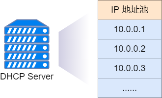

设备使用 DHCP 功能后，只要连接到网络，就可以进行 TCP/IP 通信。对于路由器和交换机，通常是手动配置 IP 地址等参数。

DHCP 是一种`C/S`模式的网络协议，由`DHCP Client`向`DHCP Server`提出配置申请，`DHCP Server`返回为`DHCP Client`分配的配置信息。这里的`Client`和`Server`是应用程序，可以运行在电脑、服务器、路由器等设备上。


举个栗子：大刘的电脑开机后，自动运行`DHCP Client`，`DHCP Client`主动向其它设备上的`DHCP Server`提出请求，`DHCP Server`根据预先配置的策略，返回相应 IP 配置信息，`DHCP Client`使用获得的 IP 配置信息与其它设备进行通信。

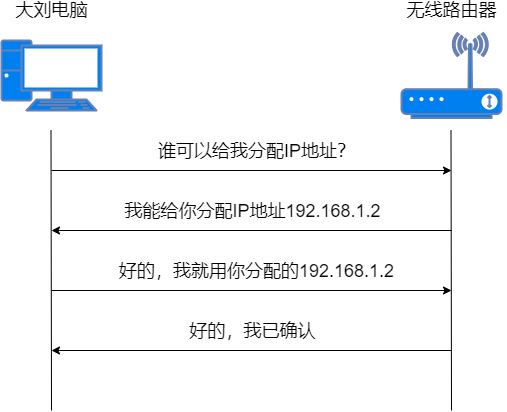
## DHCP 分配机制
DHCP 提供了两种地址分配机制，可以根据网络需求为不同的 `Client` 选择不同的分配策略。
* 动态分配机制：通过 DHCP 为`Client`分配一个有使用期限的 IP 地址。如果 `Client` 没有及时续约，到达使用期限后，这个地址可能会被其它`Client`使用。绝大多数`Client`使用的都是这种动态分配的地址。
* 静态分配机制：通过 DHCP 为特定的`Client`分配固定的 IP 地址。固定 IP 地址可以永久使用，`Client`通常是打印机、服务器等设备。

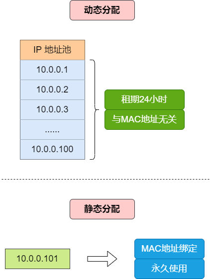

在实际情况中，我们发现 `DHCP Client` 重启后，也能获得相同的 IP 地址。`DHCP Server` 为 `DHCP Client` 分配 IP 地址时，采用如下的顺序：
* `DHCP Server`中与`DHCP Client`的 MAC 地址静态绑定的 IP 地址；
* `DHCP Client`曾经使用过的 IP 地址；
* 最先找到的可用 IP 地址。

如果没找到可用的 IP 地址，就依次查询超过租期、发生冲突的 IP 地址，如果找到就进行分配，否则报错处理。

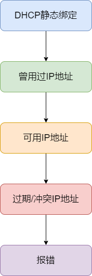

## DHCP 系统组成
DHCP 系统由`DHCP Server`（DHCP 服务器）、`DHCP Client`（DHCP 客户端）、`DHCP Relay`（DHCP 中继）等组成。

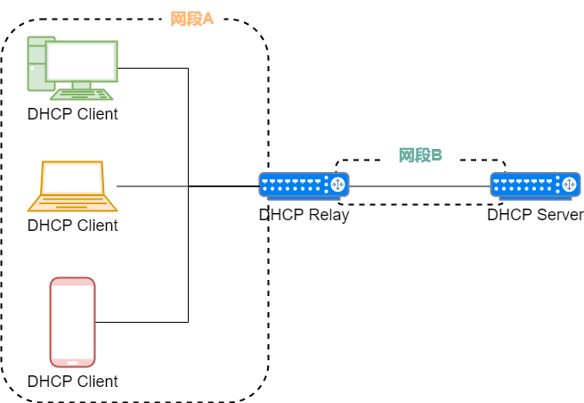

* `DHCP Server`：提供网络参数给`DHCP Client`，通常是一台提供 DHCP 服务功能的服务器或网络设备（路由器或三层交换机）。比如：家里用的无线路由器。
* `DHCP Client`：通过`DHCP Server`获取网络参数，通常是一台主机或网络设备。比如：大刘的电脑、小美的手机。
* `DHCP Relay`：通常情况下，DHCP 采用广播方式实现报文交互，DHCP 服务仅限在本地网段使用。如果需要跨网段实现 DHCP ，那么使用 `DHCP Relay` 技术实现。在`DHCP Server`和`DHCP Client`之间转发跨网段 DHCP 报文的设备，通常是三层网络设备。

## DHCP基本流程
DHCP 协议报文采用 UDP 方式封装，`DHCP Server`侦听的端口号是 67，`DHCP Client`的端口号是 68。

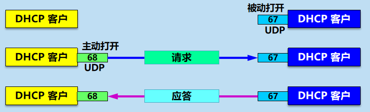

DHCP 的基本工作流程分为 4 个阶段，即发现阶段、提供阶段、请求阶段、确认阶段。

下面将描述 PC 第一次是如何通过 DHCP 获取 IP 地址的。

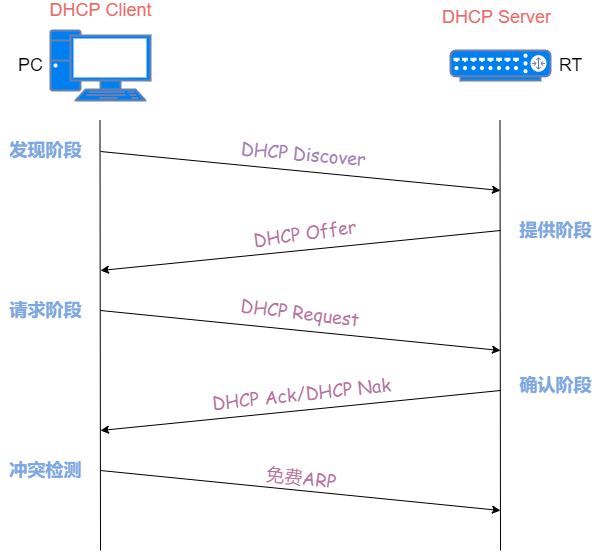

### 发现阶段
`DHCP Client`在本地网段中**广播**一个`DHCP Discover`报文，目的是寻找能够分配 IP 地址的`DHCP Server`。

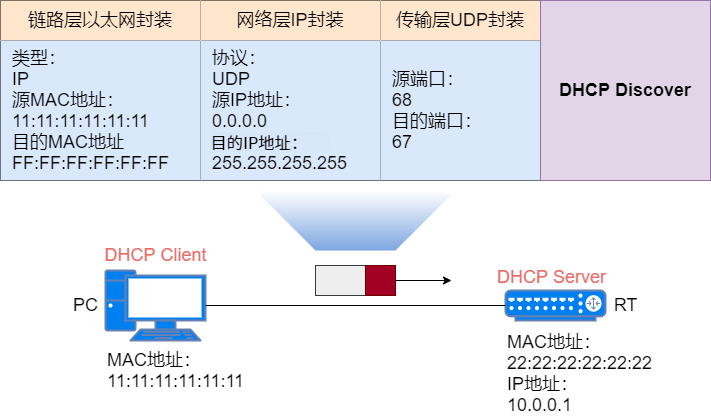

### 提供阶段
本地网段的`DHCP Server`收到`DHCP Discover`报文后，**单播**回应`DHCP Offer`报文。`DHCP Offer`报文包含了可用 IP 地址和其它网络参数。如果存在多个`DHCP Server`，每个`DHCP Server`都会响应。

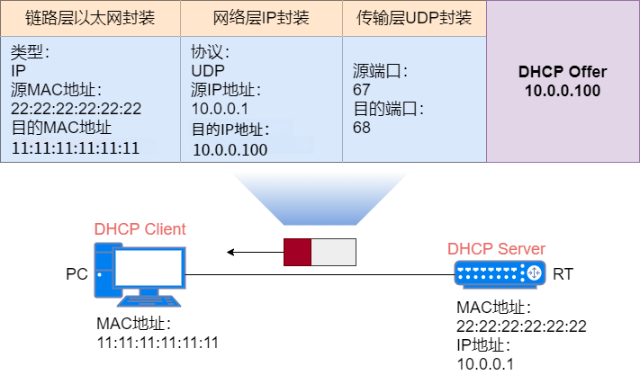

`DHCP Client`通过对比`Discover`报文和`Offer`报文中的`xid`字段是否相同，来判断`Offer`报文是不是发给自己的。
### 请求阶段
`DHCP Client`会收到`DHCP Server`发送的`DHCP Offer`报文。如果有多个`DHCP Server`，那么每个`DHCP Server`都会回应`DHCP Offer`报文。通常`DHCP Client`会选择最先收到的`Offer`报文，并**广播**`DHCP Request`报文来表明哪个`DHCP Server`被选择，其余`DHCP Server`就凉凉了。

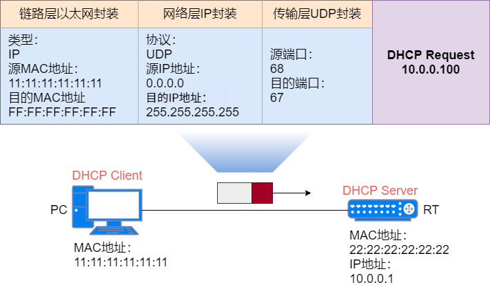

如果`DHCP Client`在一定时间后一直没收到`DHCP Offer`报文，那么它就会重新发送`DHCP Discover`报文。
### 确认阶段
`DHCP Server`收到`DHCP Request`广播报文后，**单播**发送`DHCP Ack`报文作为回应，其中包含`DHCP Client`的网络参数。`DHCP Ack`报文和之前`DHCP Offer`报文的参数不能有冲突，否则`DHCP Server`会回应一个`DHCP Nak`报文。

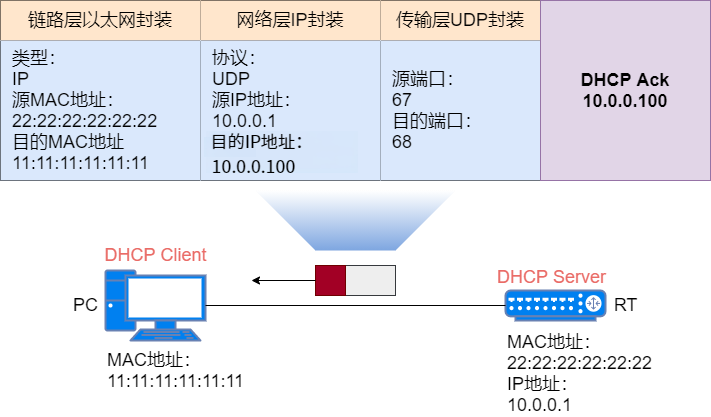

当`DHCP Client`收到`DHCP Ack`报文后，会发送免费 ARP 报文进行探测，目的地址为获得的 IP 地址，如果探测此地址没有被使用，那么`DHCP Client`就会使用这个地址，并完成配置。如果有主机使用该 IP 地址，`DHCP Client`会向`DHCP Server`发送`DHCP Decline`报文，通知服务器该 IP 地址已被占用。然后`DHCP Client`会向服务器重新申请 IP 地址。
## DHCP 租期
从 DHCP 协议上看，`DHCP Server`才有 IP 地址的所有权，而`DHCP Client`只有 IP 地址的使用权。`DHCP Server`每次给`DHCP Client`分配一个 IP 地址时，会约定一个 IP 地址的租期，通常是 24 小时。在租期内，`DHCP Client`才能使用相应的 IP 地址。当租期到期后，`DHCP Client`将不能继续使用这个 IP 地址。当然了，在租期还没到期的时候，`DHCP Client`是可以申请续租这个 IP 地址的。

租用期的数值应由`DHCP Server`决定。`DHCP Client`也可在自己发送的报文中（例如，发现报文）提出对租用期的要求。

T1 时刻是租期到一半的时候，T2 时刻是租期到 87.5% 的时候。在 T1 时刻`DHCP Client`会**单播**一个`DHCP Request`报文给`DHCP Server`，请求续租 IP 地址。如果`DHCP Client`收到了`DHCP Ack`回应报文，则说明续租成功。

如果直到 T2 时刻，`DHCP Client`都未收到`DHCP Ack`回应报文，那么会**广播**发送一个`DHCP Request`报文，继续请求续租 IP 地址。如果`DHCP Client`收到了`DHCP Ack`回应报文，则说明续租成功。

如果直到租期到期，`DHCP Client`都未收到`DHCP Ack`回应报文，那么必须停止使用原来的 IP 地址。`DHCP Client`将从发现阶段开始，重新来申请一个 IP 地址。

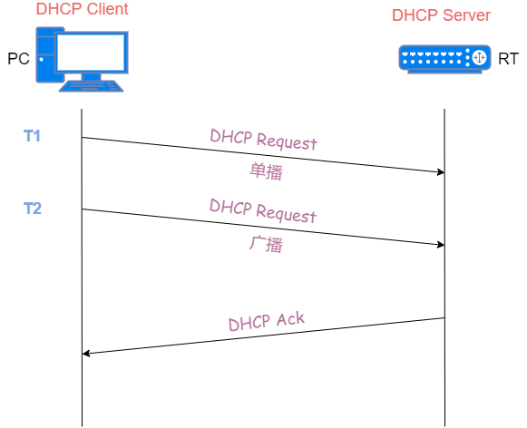

## DHCP 中继(Relay)
动态获取 IP 地址的过程中，使用广播方式发生报文，因此 DHCP 只适用于`DHCP Client`和`DHCP Server`在同一个子网内的情况。如果为每个网段配置一个`DHCP Server`，这显然太浪费了。实际上还有`DHCP Relay`这种角色。`DHCP Client`通过`DHCP Relay`实现跨网段与`DHCP Server`通信，获取 IP 地址。这样，多个子网上的`DHCP Client`可以使用同一个`DHCP Server`，既节省成本，又方便集中管理。


`DHCP Relay`的工作原理：
* `DHCP Client`发送`DHCP Discover`或`DHCP Request`**广播**报文，具有`DHCP Relay`功能的网络设备收到后，根据配置将报文**单播**给指定的`DHCP Server`；
* `DHCP Server`进行 IP 地址的分配，**单播**发送给`DHCP Relay`，`DHCP Relay`再将配置信息**广播**给`DHCP Client`，完成对`DHCP Client`的动态配置。

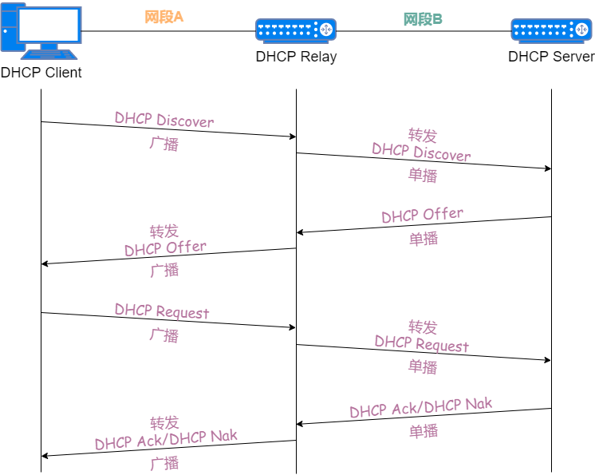

## DHCP 协议报文
常见的 5 种报文类型有：`DHCP Discover、DHCP Offer、DHCP Request、DHCP Ack`和`DHCP Release`，用得少的 3 种报文类型有：`DHCP Nak、DHCP Decline`和`DHCP Inform`。

| 报文类型          | 含义                                                                                                                                                                             |
|---------------|--------------------------------------------------------------------------------------------------------------------------------------------------------------------------------|
| DHCP Discover | DHCP Client 首次接入网络，DHCP 交互过程的第一个报文，用来寻找 DHCP Server 的请求报文。                                                                                                                     |
| DHCP Offer    | DHCP Server 用来回应 DHCP Discover 报文的，并携带网络参数，包括：IP 地址、子网掩码、默认网关、DNS 服务器等                                                                                                         |
| DHCP Request  | DHCP Client 发送的报文，有三种使用场景：<br>根据策略选择相应的 DHCP Server，并回应 DHCP Offer 报文；<br>DHCP Client 非首次接入网络，直接发送 DHCP Request 报文来申请之前使用过的 IP 地址等参数；<br>当 IP 地址的租约到期后，发送 DHCP Request 进行租期更新。 |
| DHCP Ack      | DHCP Server 对 DHCP Request 报文的回应报文，进行最终确认。DHCP Client 收到这个报文后，才能获得 IP 地址和相应网络参数。                                                                                               |
| DHCP Nak      | DHCP Server 对 DHCP Request 报文的回应报文，当 DHCP Request 报文中的各个参数都正确时，回应 DHCP Ack 报文，否则回应 DHCP Nak 报文，告诉 DHCP Client 禁止使用获得的 IP 地址                                                    |
| DHCP Decline  | 当 DHCP Client 收到 DHCP Ack 报文后，还会发送免费 ARP 报文，确认申请的 IP 地址是否已经在网络上使用了。如果 IP 地址已经被其它 Client 使用，那么 DHCP Client 发送 DHCP Decline 报文，拒绝分配的 IP 地址，并重新向 DHCP Server 申请地址                 |
| DHCP Release  | 当 DHCP Client 想要释放获得的 IP 地址时，向 DHCP Server 发送 DHCP Release 报文，DHCP Server 收到报文后，可将这个 IP 地址分配给其它的 Client                                                                        |
| DHCP Inform   | DHCP Client 通过手动方式获得 IP 地址后，还想向 DHCP Server 获取更多网络参数时，比如：默认网关地址、DNS 服务器地址，DHCP Client 就向 DHCP Server 发送 DHCP Inform 报文进行申请                                                     |

## DHCP 状态机
如果把功能各异的 8 种报文串起来，就是整个 DHCP 协议交互流程。状态指出下一步使用的报文类型，状态转换是通过报文的接收、发送或超时。下面是`Client`的状态机。

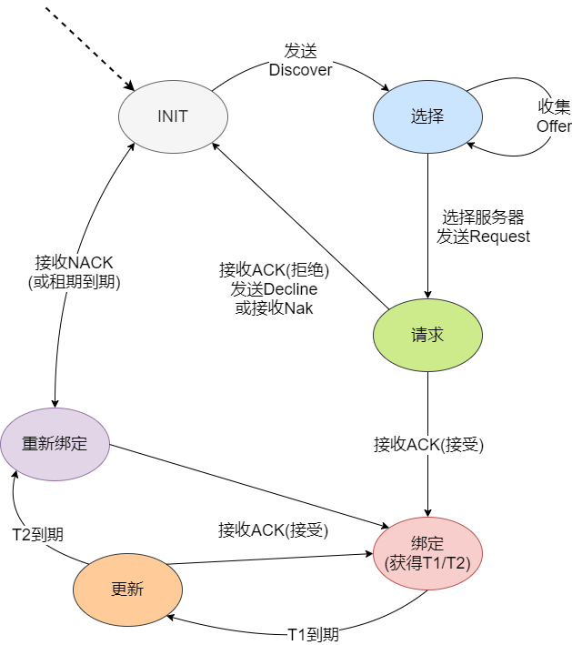

`Client`从`INIT`状态开始，广播`DHCP Discover`报文。在选择状态时，它收到`DHCP Offer`报文，并决定使用哪个地址和`Server`。做出选择后，通过`DHCP Request`报文进入请求状态。如果分配的地址和曾使用过的地址不一致，那么回应`DHCP Nak`报文进行拒绝，并返回`INIT`状态；如果分配的地址已经被占用，那么回应`DHCP Decline`报文进行拒绝，也返回到`INIT`状态。通常是收到一个需要的地址，回应`DHCP Ack`报文，获得租期超时值 T1 和 T2 ，并进入绑定状态，这个时候就可以使用这个地址直到租期到期。当 T1 到期时，进入更新状态并进行续租申请。如果续租成功，那么可以收到`DHCP Ack`报文，并返回到绑定状态；如果续租不成功，那么在 T2 到期时，再次进行续租申请。如果租期最终到期，那么`Client`将禁止使用所租用的地址，并返回到`INIT`状态。

## DHCP 报文格式

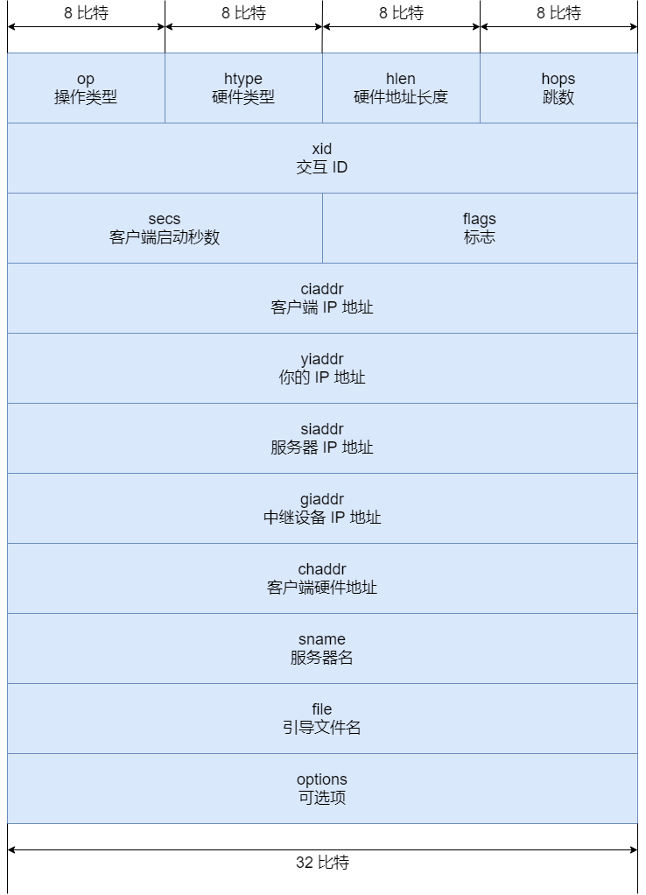

字段说明：
* `op`（操作类型）：表示报文的格式。当值为 1 时，表示客户端的请求报文；当值为 2 时，表示服务器的响应报文。
* `htype`（硬件类型）：不同的硬件类型取不同的值，最常见的以太网，值是 1。
* `hlen`（硬件地址长度）：表示硬件地址长度，以太网的值是 6，也就是 MAC 地址的长度。
* `hops`（跳数）：DHCP 报文经过的 DHCP 中继的数量。
* `xid`（交互 ID）：DHCP 客户端取的随机值，收到 DHCP 服务器的响应报文时，查看`xid`值是否相同，来判断报文是否是发送给自己的。
* `secs`（客户端启动秒数）：记录 IP 地址的使用时间。
* `flags`（标志）：广播响应标志位，当值为 0 时，表示服务器以单播形式发送响应报文；当值为 1 时，服务器以广播形式发送响应报文。
* `ciaddr`（客户端 IP 地址）：客户端的 IP 地址，可以是分配的地址，也可以是正在使用的地址，还可以是的`0.0.0.0`。`0.0.0.0`是客户端初始状态没有地址的时候，仅用于临时通信，不是有效的地址。
* `yiaddr`（你的 IP 地址）：当服务器发送响应报文时，将分配给客户端的 IP 地址填入这个字段。
* `siaddr`（服务器 IP 地址）：用来标识服务器的 IP 地址。
* `giaddr`（中继设备 IP 地址）：表示 DHCP 中继的 IP 地址，服务器通过识别这个字段来判断出客户端的网段地址，从而选择合适的地址池，为客户端分配该网段的 IP 地址。
* `chaddr`（客户端硬件地址）：用来标识客户端的硬件地址，当客户端发送广播发现报文时，这个字段就是自己的硬件地址。
* `sname`（服务器名）：可选项，DHCP 服务器填写这个字段。
* `file`（引导文件名）：可选项，DHCP 服务器填写这个字段。
* `options`（可选项）：可选项，DHCP 客户端获取网络参数，DHCP 服务器提供网络参数，都是使用的这个字段。内容有很多，例如：租期、子网掩码、默认网关地址、DNS 服务器地址等。

拿着 DHCP 报文格式，就可以看懂抓包获取的报文内容。

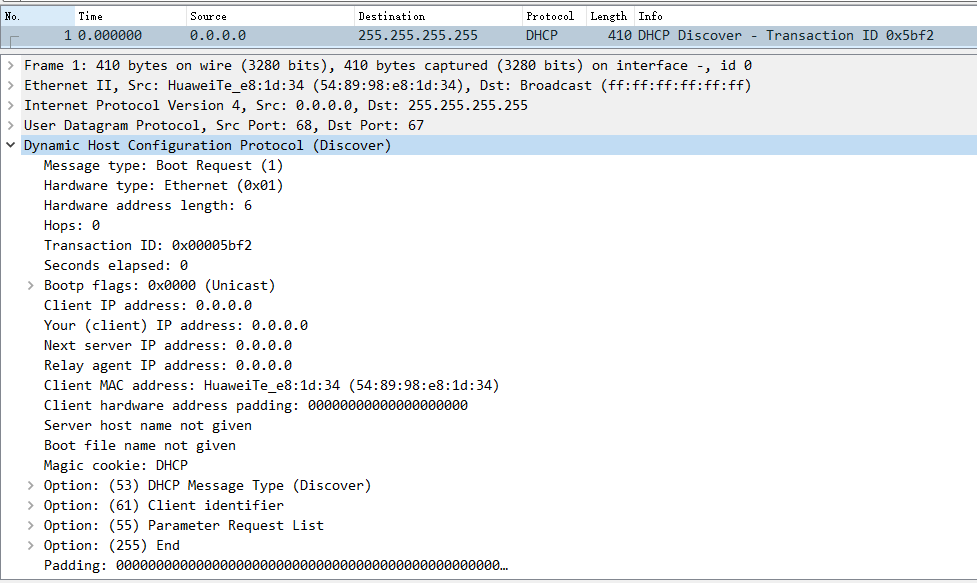

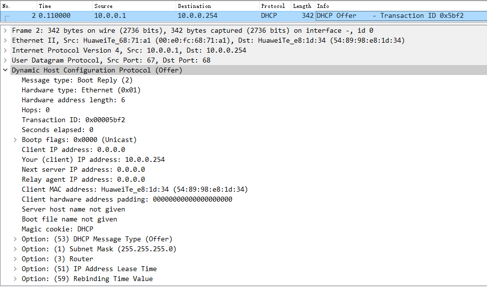

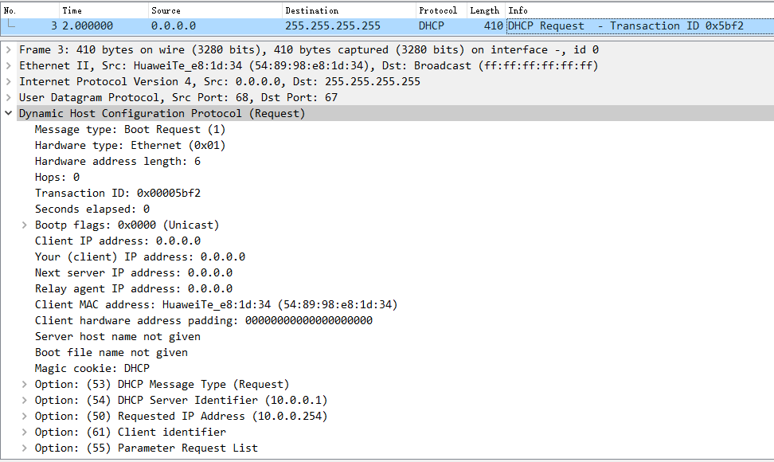

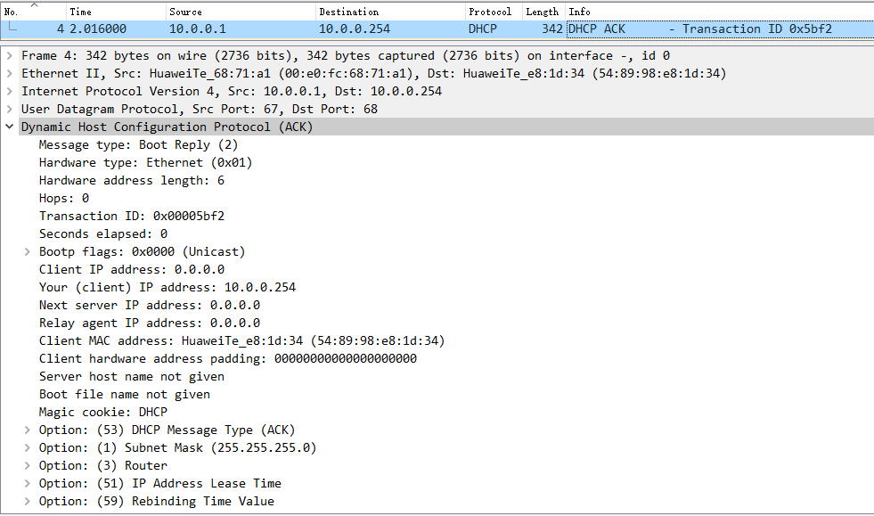

## 常见问题
### 为什么DHCP用UDP，能不能改用TCP?
主要原因还是因为 TCP 是面向连接的，而 UDP 是无连接的。DHCP 由于一开始并不知道要跟谁建立连接，所以只能通过广播的形式发送消息。


同样是在本地网段内发广播消息，UDP 只需要发给`255.255.255.255`。这个地址有特殊含义，只要设了这个目的地址，就会在一定本地网段内进行广播。

而 TCP 却不同，它需要先建立连接，但实际上`255.255.255.255`对应的机器并不存在，因此也不能建立连接。如果同样要做到广播的效果，就需要先得到本地网段内所有机器的 IP，然后挨个建立连接，再挨个发消息。这就很低效了。

因此 DHCP 选择了 UDP，而不是 TCP。
### 为什么第二阶段不是广播，而是单播?
这是 DHCP 协议的一个小优化。原则上大家在`DHCP Offer`阶段，都用广播，那肯定是最稳的，目标机器收到后自然就会进入第三阶段`DHCP Request`。而非目标机器，收到后解包后发现目的机器的 MAC 地址跟自己的不同，也会丢掉这个包。

但是问题就出在，这个非目的机器需要每次都在网卡收到包，并解完包，才发现原来这不是给它的消息。 如果本地网段内这样的包满天飞，也浪费机器性能。

如果能用单播，那当然是最好的。但这时候目的机器其实并没有 IP 地址，有些系统在这种情况下能收单播包，有些则认为不能收，这个跟系统的实现有关。因此，对于能收单播包的系统，会在发`DHCP Discover`阶段设一个`Broadcast flag = 0 (unicast)`的标志位，告诉服务器，支持单播回复，于是服务器就会在`DHCP Offer`阶段以单播的形式进行回复。

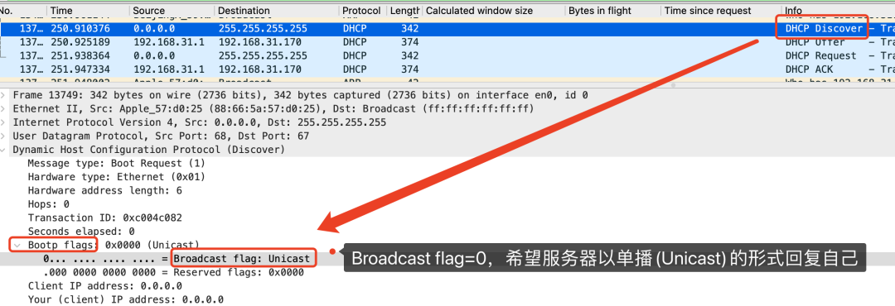

### 是不是每次联网都要经历DHCP四个阶段？
当然不需要。

我们会发现每次断开 wifi 再打开 wifi 时，机子会经历一个从没网到有网的过程。

这时候去抓个包，会发现。

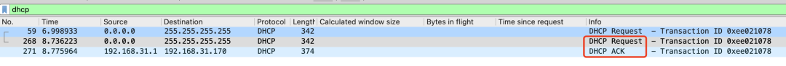

其实只发生了 DHCP 的第三和第四阶段。这是因为机子记录了曾经使用过`192.168.31.170`这个 IP，重新联网后，会优先再次请求这个 IP，这样就省下了第一第二阶段的广播了。

另外需要注意的是，抓包图里`DHCP Request`之所以出现两次，是因为第一次`Request`发出后太久没得到回应，因此重发。
### DHCP分配下来的IP一定不会重复吗？
一般来说 DHCP 服务器会在它维护的 IP 池里找到一个没人用的 IP 分配给机子。这个 IP 如果重复分配了，那本地网段内就会出现两个同样的 IP，这个 IP 下面却对应两个不同的 MAC 地址。但其他机器上的 ARP 缓存中却只会记录其中一条 MAC 地址到 IP 的映射关系。

于是，数据在传递的过程中就会出错。

因此本地网段内 IP 必须唯一。

那么 DHCP 分配下来的 IP 有没有可能跟别的 IP 是重复的？都这么问了，那肯定是可能的。

有两个常见的情况会出现 IP 重复。

IP 是可以自己手动配的，自己配的 IP 是有可能跟其他 DHCP 分配下来的 IP 是相同的。解决方案也很简单，尽量不要手动去配 IP，统一走 DHCP。或者在 DHCP 服务器里维护的 IP 范围里，将这条 IP剔除。

一个本地网段内，是可以有多个 DHCP 服务器的，而他们维护的 IP 地址范围是有可能重叠的，于是就有可能将相同的 IP 给到不同的机子。解决方案也很简单，修改两台 DHCP 服务器的维护的 IP 地址范围，让它们不重叠就行了。

不过上面的解决方案，都需要有权限去修改 DHCP 服务器。

得到`DHCP ACK`之后立马就能使用这个 IP 了吗？

不。

在得到`DHCP ACK`之后，机子不会立刻就用这个 IP。

而是会先发三条 ARP 消息。

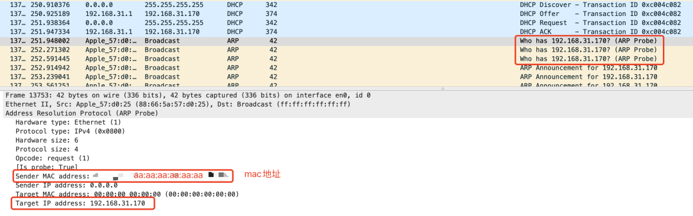

大家知道 ARP 消息的目的是通过 IP 地址去获得 mac 地址。所以普通的 ARP 消息里，是填了 IP 地址，不填 mac 地址的。

但这三条 ARP 协议，比较特殊，它们叫免费 ARP，特点是它会把 IP 和 mac 地址都填好了，而且填的还是自己的 IP 和 mac 地址。

目的有两个：
* 一个是为了告诉本地网段内所有机子，从现在起，xx IP 地址属于 xx mac 地址，让大家记录在 ARP 缓存中。
* 另一个就是看下本地网段里有没有其他机子也用了这个 IP，如果有冲突的话，那需要重新再走一次 DHCP 流程。

在三次无偿 ARP 消息之后，确认没有冲突了，才会开始使用这个 IP 地址进行通信。

## 实战
### 地址池
DHCP 服务器的地址池是用来定义分配给主机的 IP 地址范围，有两种形式：
1. 接口地址池为连接到同一网段的主机或终端分配 IP 地址。可以在服务器的接口下执行`dhcp select interface`命令，配置 DHCP 服务器采用接口地址池的 DHCP 服务器模式为客户端分配 IP 地址。
2. 全局地址池为所有连接到 DHCP 服务器的终端分配 IP 地址。可以在服务器的接口下执行`dhcp select global`命令，配置 DHCP 服务器采用全局地址池的 DHCP 服务器模式为客户端分配 IP 地址。

接口地址池的优先级比全局地址池高。配置了全局地址池后，如果又在接口上配置了地址池，客户端将会从接口地址池中获取 IP 地址。

在地址池中，应该排除分配给 DNS 等服务器的 IP 地址，DHCP 服务器接口的 IP 地址等，避免 IP 地址冲突。
### 配置基于接口地址池的DHCP
#### 网络拓扑
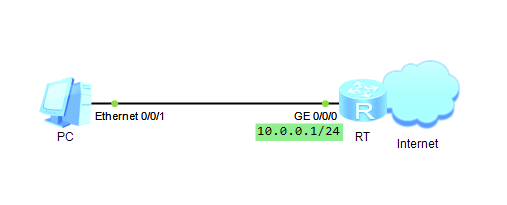

#### 实验要求
RT（路由器）配置`DHCP Server`，PC 动态获取 IP 地址等网络参数。
#### 操作步骤
配置思路：
1. 在 RT 上开启 DHCP 功能
2. 在 RT 的接口下配置 DHCP，实现`DHCP Server`功能

配置命令：
* 使用 DHCP 功能之前，先要开启 DHCP 功能。系统视图下，使用命令`dhcp enable`启动 DHCP 功能。
* 在接口视图下，使用`dhcp server dns-list ip-address`配置 DNS 服务器的 IP 地址。
* `dhcp server lease { day day [ hour hour [ minute minute ] ] | unlimited }`：配置 IP 地址的租期，默认租期是 1 天。
* `dhcp server excluded-ip-address start-ip-address [ end-ip-address ]`：在可分配的地址中，设置不分配的 IP 地址。比如：地址池是`192.168.100.0/24`，可设置`192.168.100.1 - 192.168.100.10`不参与地址分配。
* 在 RT 的接口下配置引用，命令为`dhcp select interface`。

```shell
<Huawei>system-view 
[Huawei]sysname RT
# 开启DHCP功能
[RT]dhcp enable
[RT]interface GigabitEthernet 0/0/0
[RT-GigabitEthernet0/0/0]ip address 10.0.0.1 24
# 开启接口采用接口地址池的DHCP服务端功能
[RT-GigabitEthernet0/0/0]dhcp select interface
[RT-GigabitEthernet0/0/0]dhcp server ?
  dns-list             Configure DNS servers
  domain-name          Configure domain name 
  excluded-ip-address  Mark disable IP addresses 
  import               Imports the following network configuration parameters   
                       from a central server into local ip pool database: domain
                       name, dns server and netbios server.
  lease                Configure the lease of the IP pool
  nbns-list            Configure the windows's netbios name servers 
  netbios-type         Netbios node type
  next-server          The address of the server to use in the next step of the 
                       client's bootstrap process.
  option               Configure the DHCP options
  option121            DHCP option 121 
  option184            DHCP option 184
  recycle              Recycle IP address
  static-bind          Static bind
# 指定接口地址池下的DNS服务器地址
[RT-GigabitEthernet0/0/0]dhcp server dns-list 114.114.114.114
# 配置DHCP服务器接口地址池中IP地址的租用有效期限功能
# dhcp server lease { day day [ hour hour [ minute minute ] ] | unlimited }
[RT-GigabitEthernet0/0/0]dhcp server lease day 0 hour 1
# 配置接口地址池中不参与自动分配的IP地址范围
# dhcp server excluded-ip-address start-ip-address [end-ip-address]
[RT-GigabitEthernet0/0/0]dhcp server excluded-ip-address 10.0.0.254 
[RT-GigabitEthernet0/0/0]dhcp select interface
[RT-GigabitEthernet0/0/0]display ip pool interface GigabitEthernet0/0/0 
  Pool-name      : GigabitEthernet0/0/0
  Pool-No        : 0
  Lease          : 0 Days 1 Hours 0 Minutes
  Domain-name    : -
  DNS-server0    : -               
  NBNS-server0   : -               
  Netbios-type   : -               
  Position       : Interface       Status           : Unlocked
  Gateway-0      : 10.0.0.1        
  Mask           : 255.255.255.0
  VPN instance   : --
 -----------------------------------------------------------------------------
         Start           End     Total  Used  Idle(Expired)  Conflict  Disable
 -----------------------------------------------------------------------------
        10.0.0.1      10.0.0.254   253     1        251(0)         0        1
 -----------------------------------------------------------------------------
[RT-GigabitEthernet0/0/0]display ip pool interface GigabitEthernet0/0/0 used 
  Pool-name      : GigabitEthernet0/0/0
  Pool-No        : 0
  Lease          : 0 Days 1 Hours 0 Minutes
  Domain-name    : -
  DNS-server0    : -               
  NBNS-server0   : -               
  Netbios-type   : -               
  Position       : Interface       Status           : Unlocked
  Gateway-0      : 10.0.0.1        
  Mask           : 255.255.255.0
  VPN instance   : --
 -----------------------------------------------------------------------------
         Start           End     Total  Used  Idle(Expired)  Conflict  Disable
 -----------------------------------------------------------------------------
        10.0.0.1      10.0.0.254   253     1        251(0)         0        1
 -----------------------------------------------------------------------------

  Network section : 
  --------------------------------------------------------------------------
  Index              IP               MAC      Lease   Status  
  --------------------------------------------------------------------------
    252      10.0.0.253    5489-98ca-6dd2         20   Used       
  --------------------------------------------------------------------------
```
#### 功能验证
PC 上查看动态获取地址情况。

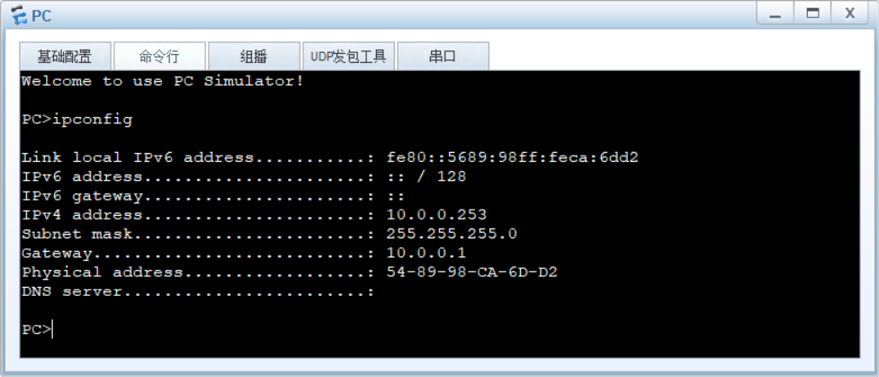

### 配置基于全局地址池的DHCP
#### 网络拓扑


#### 实验要求
RT（路由器）配置`DHCP Server`，PC 动态获取 IP 地址等网络参数。
#### 操作步骤
配置思路：
1. 在 RT 上开启 DHCP 功能
2. 创建一个地址池
3. 配置地址池的相关参数
4. 在 RT 的接口下引用地址池，实现 DHCP Server 功能

配置命令：
* 使用 DHCP 功能之前，先要开启 DHCP 功能。系统视图下，使用命令`dhcp enable`启动 DHCP 功能。
* 动态分配 IP 地址，就需要有多个可分配的 IP 地址，使用`ip pool ip-pool-name`命令来创建全局地址池，`ip-pool-name`表示地址池的名称。
* 在全局地址池视图下，通过命令`network ip-address [ mask { mask | mask-length } ]`配置可分配的 IP 地址段。`mask {mask|mask-length}`表示子网掩码，通常根据设备数量来确定掩码长度。
* 有了 IP 地址和子网掩码，再加上默认网关，终端设备就能网络互通了。在全局地址池视图下，使用命令`gateway-list ip-address`配置网关 IP 地址。
* 网络互通，还不能正常访问网站，需要配置 DNS 服务器，用于域名解析。在全局地址池视图下，使用`dns-list ip-address`配置 DNS 服务器的 IP 地址。
* 地址池配置中，常用的可选命令如下，可根据需求进行选择性设置：
  * `lease { day day [ hour hour [ minute minute ] ] | unlimited }`：配置 IP 地址的租期，默认租期是 1 天。 
	* `excluded-ip-address start-ip-address [ end-ip-address ]`：在可分配的地址池中，设置不分配的 IP 地址。比如：地址池是`192.168.100.0/24`，可设置`192.168.100.1 - 192.168.100.10`不参与地址分配。
	* `static-bind ip-address ip-address mac-address mac-address`：为`Client`固定分配一个 IP 地址。
* 配置完地址池，还需要进行引用，`DHCP Server`功能就能正常使用了。在 RT 的接口下配置引用，命令为`dhcp select global`。

```shell
<Huawei>system-view 
[Huawei]sysname RT
[RT]dhcp enable
# 创建全局地址池
[RT]ip pool dhcpserver01
# 配置全局地址池可动态分配的IP地址范围
[RT-ip-pool-dhcpserver01]network 10.0.0.0 mask 24
# 配置DHCP客户端的网关地址
[RT-ip-pool-dhcpserver01]gateway-list 10.0.0.1
# 配置DHCP客户端的DNS服务器地址
[RT-ip-pool-dhcpserver01]dns-list 114.114.114.114
# 配置IP地址租期
[RT-ip-pool-dhcpserver01]lease day 0 hour 1
[RT-ip-pool-dhcpserver01]quit
[RT]interface GigabitEthernet 0/0/0
[RT-GigabitEthernet0/0/0]ip address 10.0.0.1 24
# 使能接口的DHCP服务器功能
[RT-GigabitEthernet0/0/0]dhcp select global
[RT-GigabitEthernet0/0/0]quit
[RT]display ip pool name dhcpserver01  
  Pool-name      : dhcpserver01
  Pool-No        : 0
  Lease          : 0 Days 1 Hours 0 Minutes
  Domain-name    : -
  DNS-server0    : 114.114.114.114               
  NBNS-server0   : -               
  Netbios-type   : -               
  Position       : Local           Status           : Unlocked
  Gateway-0      : 10.0.0.1        
  Mask           : 255.255.255.0
  VPN instance   : --
 -----------------------------------------------------------------------------
         Start           End     Total  Used  Idle(Expired)  Conflict  Disable
 -----------------------------------------------------------------------------
        10.0.0.1      10.0.0.254   253     0        253(0)         0        0
 -----------------------------------------------------------------------------
```
#### 功能验证
配置完成后，理论上是 DHCP 功能正常工作了，实际情况的话，可通过命令`display ip pool name pool-name used`，查看地址池的配置情况，和地址分配情况。在 RT 上查看`DHCP Server`地址分配状态。
```shell
[RT]display ip pool name dhcpserver01 used 
  Pool-name      : dhcpserver01
  Pool-No        : 0
  Lease          : 0 Days 1 Hours 0 Minutes
  Domain-name    : -
  DNS-server0    : -               
  NBNS-server0   : -               
  Netbios-type   : -               
  Position       : Local           Status           : Unlocked
  Gateway-0      : 10.0.0.1        
  Mask           : 255.255.255.0
  VPN instance   : --
 -----------------------------------------------------------------------------
         Start           End     Total  Used  Idle(Expired)  Conflict  Disable
 -----------------------------------------------------------------------------
        10.0.0.1      10.0.0.254   253     1        252(0)         0        0
 -----------------------------------------------------------------------------

  Network section : 
  --------------------------------------------------------------------------
  Index              IP               MAC      Lease   Status  
  --------------------------------------------------------------------------
    253      10.0.0.254    5489-9896-1395         16   Used       
  --------------------------------------------------------------------------
```
同时也在 PC 上查看动态获取地址情况，进行双向验证。

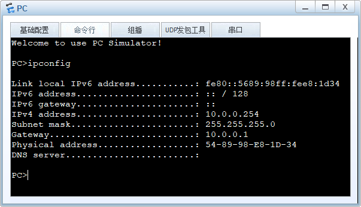

抓包还可以看到 DHCP 报文交互的详细过程，同时也是检验理论知识是否正确。

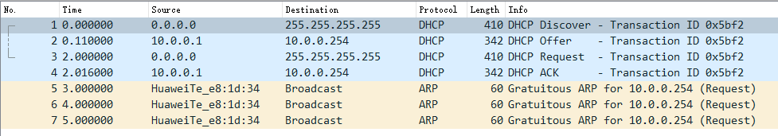

这里我们发现抓包看到的是`DHCP Offer`单播报文。其实`DHCP Offer`报文有可能是单播，也有可能是广播。DHCP 在报文的标志字段有一个广播位，如果`Client`支持接收`Offer`单播报文，那么`Client`就会将发送报文中的广播位设为 0，否则为 1。
### DHCP Relay 示例
#### 网络拓扑

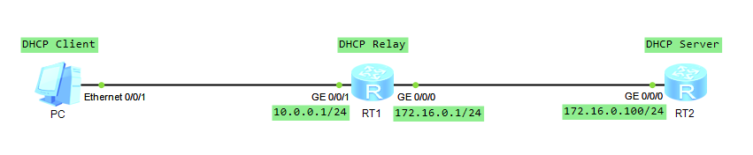

#### 实验要求
`DHCP Client`和`DHCP Server`在不同网段，`DHCP Client`通过`DHCP Relay`获取到 IP 地址等网络参数。
#### 操作步骤
1. PC（ DHCP Client ）开启 DHCP 功能；
	 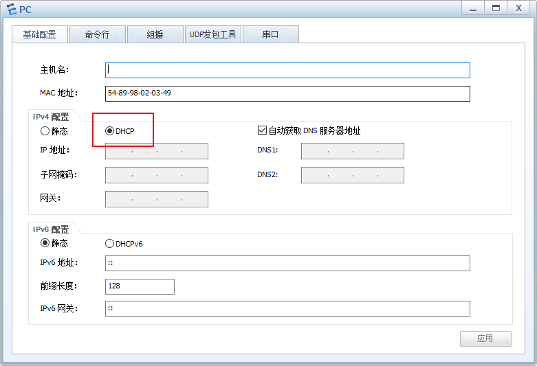
2. RT1（`DHCP Relay`）使用`dhcp select relay`命令开启`DHCP Relay`功能，在`G0/0/1`口下使用`dhcp relay server-ip ip-address`命令，配置`DHCP Server`的 IP 地址；
```shell
<Huawei>system-view 
Enter system view, return user view with Ctrl+Z.
[Huawei]sysname RT1
[RT1]dhcp enable 
Info: The operation may take a few seconds. Please wait for a moment.done.
[RT1]interface GigabitEthernet 0/0/0
[RT1-GigabitEthernet0/0/0]ip address 172.16.0.1 24
Apr 21 2025 11:58:53-08:00 RT1 %%01IFNET/4/LINK_STATE(l)[2]:The line protocol IP
 on the interface GigabitEthernet0/0/0 has entered the UP state. 
[RT1-GigabitEthernet0/0/0]quit
[RT1]interface GigabitEthernet 0/0/1
[RT1-GigabitEthernet0/0/1]ip address 10.0.0.1 24
Apr 21 2025 11:59:09-08:00 RT1 %%01IFNET/4/LINK_STATE(l)[3]:The line protocol IP
 on the interface GigabitEthernet0/0/1 has entered the UP state. 
[RT1-GigabitEthernet0/0/1]dhcp select ?
  global     Local server
  interface  Interface server pool
  relay      DHCP relay
[RT1-GigabitEthernet0/0/1]dhcp select relay 
[RT1-GigabitEthernet0/0/1]dhcp relay ?
  release        Release
  server-ip      Dhcp server-ip
  server-select  Server_select
[RT1-GigabitEthernet0/0/1]dhcp relay server-ip 172.16.0.100
[RT1-GigabitEthernet0/0/1]quit
[RT1]display ip interface brief 
*down: administratively down
^down: standby
(l): loopback
(s): spoofing
The number of interface that is UP in Physical is 3
The number of interface that is DOWN in Physical is 1
The number of interface that is UP in Protocol is 3
The number of interface that is DOWN in Protocol is 1

Interface                         IP Address/Mask      Physical   Protocol  
GigabitEthernet0/0/0              172.16.0.1/24        up         up        
GigabitEthernet0/0/1              10.0.0.1/24          up         up        
GigabitEthernet0/0/2              unassigned           down       down      
NULL0                             unassigned           up         up(s)
[RT1]display dhcp relay all
 DHCP relay agent running information of interface GigabitEthernet0/0/1 :
 Server IP address [01] : 172.16.0.100
 Gateway address in use : 10.0.0.1
```
3. RT2（`DHCP Server`）开启 DHCP 功能，创建地址池并配置相关参数，在接口下引用地址池，实现`DHCP Server`功能。
```shell
<Huawei>system-view 
[Huawei]sysname RT2
[RT2]dhcp enable
[RT2]ip pool server01
[RT2-ip-pool-server01]network 10.0.0.0 mask 24
[RT2-ip-pool-server01]gateway-list 10.0.0.1
[RT2-ip-pool-server01]dns-list 114.114.114.114
[RT2-ip-pool-server01]quit
[RT2]interface GigabitEthernet 0/0/0
[RT2-GigabitEthernet0/0/0]ip address 172.16.0.100 24
[RT2-GigabitEthernet0/0/0]dhcp select global
[RT2-GigabitEthernet0/0/0]quit
[RT2]ip route-static 10.0.0.0 24 172.16.0.1
[RT2]display ip pool name server01 used 
  Pool-name      : server01
  Pool-No        : 0
  Lease          : 1 Days 0 Hours 0 Minutes
  Domain-name    : -
  DNS-server0    : 114.114.114.114 
  NBNS-server0   : -               
  Netbios-type   : -               
  Position       : Local           Status           : Unlocked
  Gateway-0      : 10.0.0.1        
  Mask           : 255.255.255.0
  VPN instance   : --
 -----------------------------------------------------------------------------
         Start           End     Total  Used  Idle(Expired)  Conflict  Disable
 -----------------------------------------------------------------------------
        10.0.0.1      10.0.0.254   253     1        252(0)         0        0
 -----------------------------------------------------------------------------

  Network section : 
  --------------------------------------------------------------------------
  Index              IP               MAC      Lease   Status  
  --------------------------------------------------------------------------
    253      10.0.0.254    5489-9896-1395          2   Used       
  --------------------------------------------------------------------------

```
#### 功能验证
PC 端能获取到 IP 配置，并且获取的配置正确。

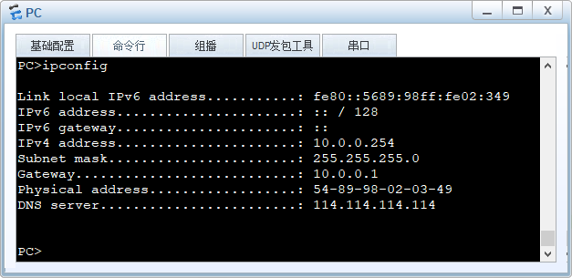

在 RT1 的`G0/0/1`抓包，查看`DHCP Client`和`DHCP Relay`的报文交互过程。

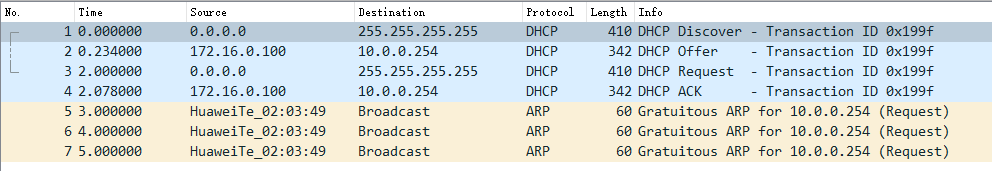

在 RT1 的`G0/0/0`抓包，查看`DHCP Server`和`DHCP Relay`的报文交互过程。

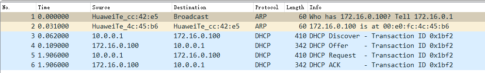
