# HTTP 与 HTTPS
## HTTP 与 HTTPS 有哪些区别？
* HTTP 是超文本传输协议，信息是明文传输，存在安全风险的问题。HTTPS 则解决 HTTP 不安全的缺陷，在 TCP 和 HTTP 网络层之间加入了 SSL/TLS 安全协议，使得报文能够加密传输。
* HTTP 连接建立相对简单， TCP 三次握手之后便可进行 HTTP 的报文传输。而 HTTPS 在 TCP 三次握手之后，还需进行 SSL/TLS 的握手过程，才可进入加密报文传输。
* 两者的默认端口不一样，HTTP 默认端口号是 80，HTTPS 默认端口号是 443。
* HTTPS 协议需要向 CA（证书权威机构）申请数字证书，来保证服务器的身份是可信的。

## HTTPS 解决了 HTTP 的哪些问题？
HTTP 由于是明文传输，所以安全上存在以下三个风险：
* 窃听风险，比如通信链路上可以获取通信内容，用户号容易没。
* 篡改风险，比如强制植入垃圾广告，视觉污染，用户眼容易瞎。
* 冒充风险，比如冒充淘宝网站，用户钱容易没。

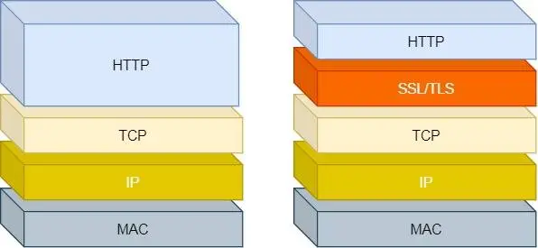

HTTPS 在 HTTP 与 TCP 层之间加入了 TLS 协议，可以很好的解决了上述的风险：
* 信息加密： HTTP 交互信息是被加密的，第三方就无法被窃取；
* 校验机制：校验信息传输过程中是否有被第三方篡改过，如果被篡改过，则会有警告提示；
* 身份证书：证明淘宝是真的淘宝网；

可见，有了 TLS 协议，能保证 HTTP 通信是安全的了，那么在进行 HTTP 通信前，需要先进行 TLS 握手。

TLS 的握手过程，如下图：

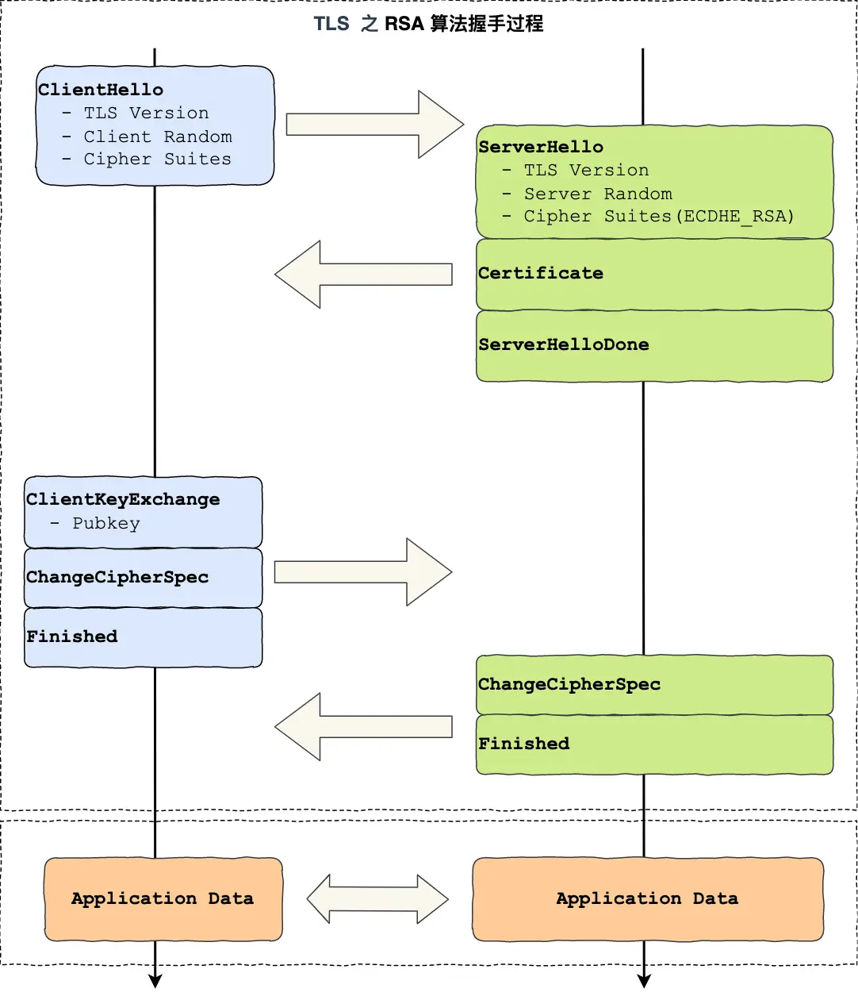

上图简要概述了 TLS 的握手过程，其中每一个「框」都是一个记录（record），记录是 TLS 收发数据的基本单位，类似于 TCP 里的 `segment`。多个记录可以组合成一个 TCP 包发送，所以通常经过「四个消息」就可以完成 TLS 握手，也就是需要 2个 RTT 的时延，然后就可以在安全的通信环境里发送 HTTP 报文，实现 HTTPS 协议。

所以可以发现，HTTPS 是应用层协议，需要先完成 TCP 连接建立，然后走 TLS 握手过程后，才能建立通信安全的连接。

事实上，不同的密钥交换算法，TLS 的握手过程可能会有一些区别。

因为考虑到性能的问题，所以双方在加密应用信息时使用的是对称加密密钥，而对称加密密钥是不能被泄漏的，为了保证对称加密密钥的安全性，所以使用非对称加密的方式来保护对称加密密钥的协商，这个工作就是密钥交换算法负责的。

接下来，我们就以最简单的 RSA 密钥交换算法，来看看它的 TLS 握手过程。
# RSA 握手过程
传统的 TLS 握手基本都是使用 RSA 算法来实现密钥交换的，在将 TLS 证书部署服务端时，证书文件其实就是服务端的公钥，会在 TLS 握手阶段传递给客户端，而服务端的私钥则一直留在服务端，一定要确保私钥不能被窃取。

在 RSA 密钥协商算法中，客户端会生成随机密钥，并使用服务端的公钥加密后再传给服务端。根据非对称加密算法，公钥加密的消息仅能通过私钥解密，这样服务端解密后，双方就得到了相同的密钥，再用它加密应用消息。

我用 Wireshark 工具抓了用 RSA 密钥交换的 TLS 握手过程，你可以从下面看到，一共经历了四次握手：


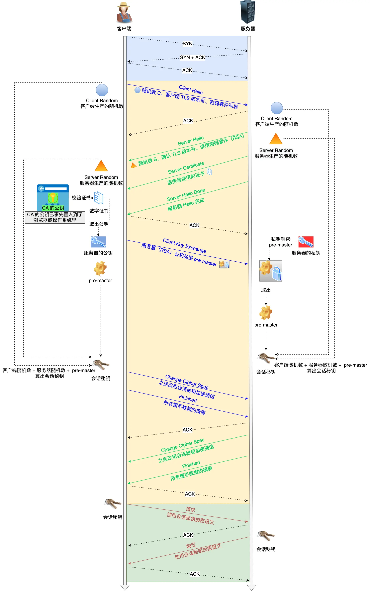

## TLS 第一次握手
客户端首先会发一个`Client Hello`消息，字面意思我们也能理解到，这是跟服务器「打招呼」。

消息里面有客户端使用的 TLS 版本号、支持的密码套件列表，以及生成的随机数（`Client Random`），这个随机数会被服务端保留，它是生成对称加密密钥的材料之一。
## TLS 第二次握手
当服务端收到客户端的`Client Hello`消息后，会确认 TLS 版本号是否支持，和从密码套件列表中选择一个密码套件，以及生成随机数（`Server Random`）。

接着，返回`Server Hello`消息，消息里面有服务器确认的 TLS 版本号，也给出了随机数（`Server Random`），然后从客户端的密码套件列表选择了一个合适的密码套件。

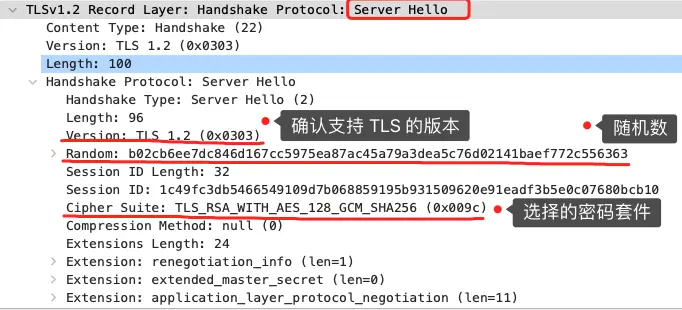

可以看到，服务端选择的密码套件是`Cipher Suite: TLS_RSA_WITH_AES_128_GCM_SHA256`。

这个密码套件看起来真让人头晕，好一大串，但是其实它是有固定格式和规范的。基本的形式是「密钥交换算法 + 签名算法 + 对称加密算法 + 摘要算法」， 一般 WITH 单词前面有两个单词，第一个单词是约定密钥交换的算法，第二个单词是约定证书的验证算法。比如刚才的密码套件的意思就是：
* 由于 WITH 单词只有一个 RSA，则说明握手时密钥交换算法和签名算法都是使用 RSA；
* 握手后的通信使用 AES 对称算法，密钥长度 128 位，分组模式是 GCM；
* 摘要算法 SHA256 用于消息认证和产生随机数；

就前面这两个客户端和服务端相互「打招呼」的过程，客户端和服务端就已确认了 TLS 版本和使用的密码套件，而且你可能发现客户端和服务端都会各自生成一个随机数，并且还会把随机数传递给对方。

那这个随机数有啥用呢？其实这两个随机数是后续作为生成「会话密钥」的条件，所谓的会话密钥就是数据传输时，所使用的对称加密密钥。

然后，服务端为了证明自己的身份，会发送`Server Certificate`给客户端，这个消息里含有数字证书。


随后，服务端发了`Server Hello Done`消息，目的是告诉客户端，我已经把该给你的东西都给你了，本次打招呼完毕。


## 客户端验证证书
在这里刹个车，客户端拿到了服务端的数字证书后，要怎么校验该数字证书是真实有效的呢？
### 数字证书和 CA 机构
在说校验数字证书是否可信的过程前，我们先来看看数字证书是什么，一个数字证书通常包含了：
* 公钥；
* 持有者信息；
* 证书认证机构（CA）的信息；
* CA 对这份文件的数字签名及使用的算法；
* 证书有效期；
* 还有一些其他额外信息；

那数字证书的作用，是用来认证公钥持有者的身份，以防止第三方进行冒充。说简单些，证书就是用来告诉客户端，该服务端是否是合法的，因为只有证书合法，才代表服务端身份是可信的。

我们用证书来认证公钥持有者的身份（服务端的身份），那证书又是怎么来的？又该怎么认证证书呢？

为了让服务端的公钥被大家信任，服务端的证书都是由 CA（`Certificate Authority`，证书认证机构）签名的，CA 就是网络世界里的公安局、公证中心，具有极高的可信度，所以由它来给各个公钥签名，信任的一方签发的证书，那必然证书也是被信任的。

之所以要签名，是因为签名的作用可以避免中间人在获取证书时对证书内容的篡改。
### 数字证书签发和验证流程
如下图图所示，为数字证书签发和验证流程：

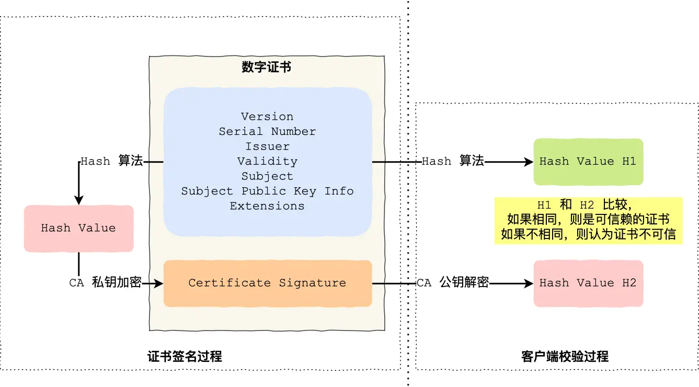

CA 签发证书的过程，如上图左边部分：
* 首先 CA 会把持有者的公钥、用途、颁发者、有效时间等信息打成一个包，然后对这些信息进行 Hash 计算，得到一个 Hash 值；
* 然后 CA 会使用自己的私钥将该 Hash 值加密，生成`Certificate Signature`，也就是 CA 对证书做了签名；
* 最后将`Certificate Signature`添加在文件证书上，形成数字证书；

客户端校验服务端的数字证书的过程，如上图右边部分：
* 首先客户端会使用同样的 Hash 算法获取该证书的 Hash 值 H1；
* 通常浏览器和操作系统中集成了 CA 的公钥信息，浏览器收到证书后可以使用 CA 的公钥解密`Certificate Signature`内容，得到一个 Hash 值 H2；
* 最后比较 H1 和 H2，如果值相同，则为可信赖的证书，否则则认为证书不可信。

### 证书链
但事实上，证书的验证过程中还存在一个证书信任链的问题，因为我们向 CA 申请的证书一般不是根证书签发的，而是由中间证书签发的，比如百度的证书，从下图你可以看到，证书的层级有三级：

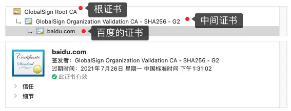

对于这种三级层级关系的证书的验证过程如下：
* 客户端收到`baidu.com`的证书后，发现这个证书的签发者不是根证书，就无法根据本地已有的根证书中的公钥去验证 baidu.com 证书是否可信。于是，客户端根据`baidu.com`证书中的签发者，找到该证书的颁发机构是`GlobalSign Organization Validation CA - SHA256 - G2`，然后向 CA 请求该中间证书。
* 请求到证书后发现`GlobalSign Organization Validation CA - SHA256 - G2`证书是由`GlobalSign Root CA`签发的，由于`GlobalSign Root CA`没有再上级签发机构，说明它是根证书，也就是自签证书。应用软件会检查此证书有否已预载于根证书清单上，如果有，则可以利用根证书中的公钥去验证`GlobalSign Organization Validation CA - SHA256 - G2`证书，如果发现验证通过，就认为该中间证书是可信的。
* `GlobalSign Organization Validation CA - SHA256 - G2`证书被信任后，可以使用`GlobalSign Organization Validation CA - SHA256 - G2`证书中的公钥去验证`baidu.com`证书的可信性，如果验证通过，就可以信任`baidu.com`证书。

在这四个步骤中，最开始客户端只信任根证书`GlobalSign Root CA`证书的，然后`GlobalSign Root CA`证书信任`GlobalSign Organization Validation CA - SHA256 - G2`证书，而`GlobalSign Organization Validation CA - SHA256 - G2`证书又信任`baidu.com`证书，于是客户端也信任`baidu.com`证书。

总括来说，由于用户信任`GlobalSign`，所以由`GlobalSign`所担保的`baidu.com`可以被信任，另外由于用户信任操作系统或浏览器的软件商，所以由软件商预载了根证书的`GlobalSign`都可被信任。

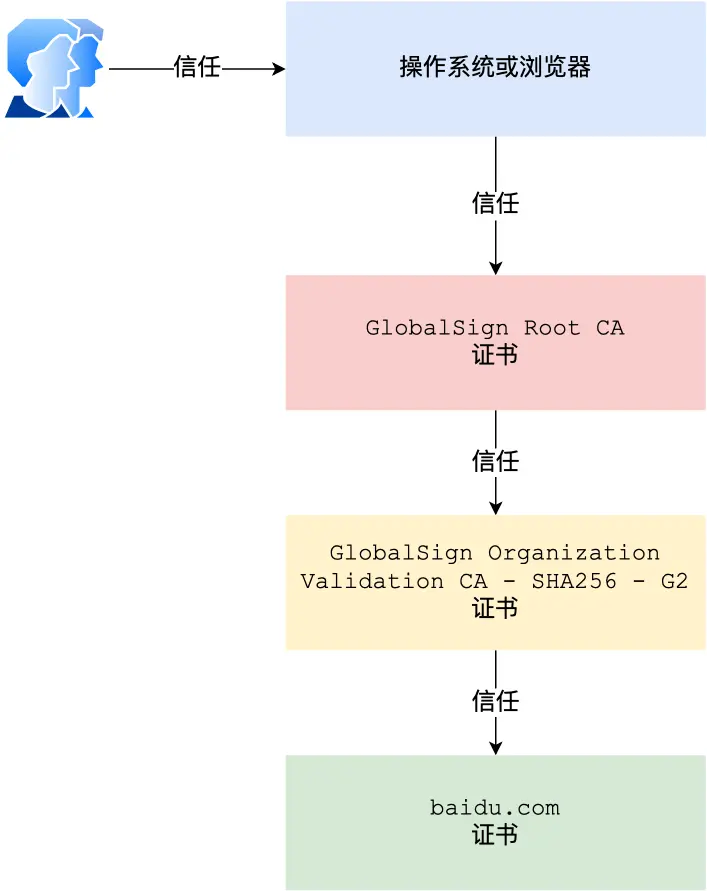

这样的一层层地验证就构成了一条信任链路，整个证书信任链验证流程如下图所示：


## TLS 第三次握手
客户端验证完证书后，认为可信则继续往下走。

接着，客户端就会生成一个新的随机数 (`pre-master`)，用服务器的 RSA 公钥加密该随机数，通过`Client Key Exchange`消息传给服务端。


服务端收到后，用 RSA 私钥解密，得到客户端发来的随机数 (`pre-master`)。

至此，客户端和服务端双方都共享了三个随机数，分别是`Client Random、Server Random、pre-master`。

于是，双方根据已经得到的三个随机数，生成会话密钥（Master Secret），它是对称密钥，用于对后续的 HTTP 请求/响应的数据加解密。

生成完「会话密钥」后，然后客户端发一个「Change Cipher Spec」，告诉服务端开始使用加密方式发送消息。


然后，客户端再发一个`Encrypted Handshake Message（Finishd）`消息，把之前所有发送的数据做个摘要，再用会话密钥加密一下，让服务器做个验证，验证加密通信「是否可用」和「之前握手信息是否有被中途篡改过」。


可以发现，「Change Cipher Spec」之前传输的 TLS 握手数据都是明文，之后都是对称密钥加密的密文。

## TLS 第四次握手
服务器也是同样的操作，发「Change Cipher Spec」和「Encrypted Handshake Message」消息，如果双方都验证加密和解密没问题，那么握手正式完成。

最后，就用「会话密钥」加解密 HTTP 请求和响应了。
## RSA 算法的缺陷
使用 RSA 密钥协商算法的最大问题是不支持前向保密。

因为客户端传递随机数（用于生成对称加密密钥的条件之一）给服务端时使用的是公钥加密的，服务端收到后，会用私钥解密得到随机数。所以一旦服务端的私钥泄漏了，过去被第三方截获的所有 TLS 通讯密文都会被破解。

为了解决这个问题，后面就出现了 ECDHE 密钥协商算法，我们现在大多数网站使用的正是 ECDHE 密钥协商算法。
# ECDHE 握手解析
## 离散对数
ECDHE 密钥协商算法是 DH 算法演进过来的，所以我们先从 DH 算法说起。

DH 算法是非对称加密算法， 因此它可以用于密钥交换，该算法的核心数学思想是离散对数。

离散对数是「离散 + 对数」的两个数学概念的组合，所以我们先来复习一遍对数。

要说起对数，必然要说指数，因为它们是互为反函数，指数就是幂运算，对数是指数的逆运算。

举个栗子，如果以 2 作为底数，那么指数和对数运算公式，如下图所示：

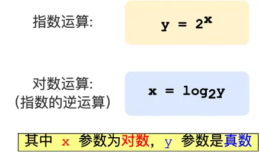

那么对于底数为 2 的时候， 32 的对数是 5，64 的对数是 6，计算过程如下：


对数运算的取值是可以连续的，而离散对数的取值是不能连续的，因此也以「离散」得名，

离散对数是在对数运算的基础上加了「模运算」，也就说取余数，对应编程语言的操作符是「%」，也可以用 mod 表示。离散对数的概念如下图：


上图的，底数 a 和模数 p 是离散对数的公共参数，也就说是公开的，b 是真数，i 是对数。知道了对数，就可以用上面的公式计算出真数。但反过来，知道真数却很难推算出对数。

特别是当模数 p 是一个很大的质数，即使知道底数 a 和真数 b，在现有的计算机的计算水平是几乎无法算出离散对数的，这就是 DH 算法的数学基础。

## DH 算法
认识了离散对数，我们来看看 DH 算法是如何密钥交换的。

现假设小红和小明约定使用 DH 算法来交换密钥，那么基于离散对数，小红和小明需要先确定模数和底数作为算法的参数，这两个参数是公开的，用 P 和 G 来代称。

然后小红和小明各自生成一个随机整数作为私钥，双方的私钥要各自严格保管，不能泄漏，小红的私钥用 a 代称，小明的私钥用 b 代称。

现在小红和小明双方都有了 P 和 G 以及各自的私钥，于是就可以计算出公钥：

小红的公钥记作 A，A = G ^ a (mod P)；
小明的公钥记作 B，B = G ^ b (mod P)；

A 和 B 也是公开的，因为根据离散对数的原理，从真数（A 和 B）反向计算对数 a 和 b 是非常困难的，至少在现有计算机的计算能力是无法破解的，如果量子计算机出来了，那就有可能被破解，当然如果量子计算机真的出来了，那么密钥协商算法就要做大的升级了。

双方交换各自 DH 公钥后，小红手上共有 5 个数：P、G、a、A、B，小明手上也同样共有 5 个数：P、G、b、B、A。

然后小红执行运算： B ^ a (mod P)，其结果为 K，因为离散对数的幂运算有交换律，所以小明执行运算： A ^ b (mod P)，得到的结果也是 K。

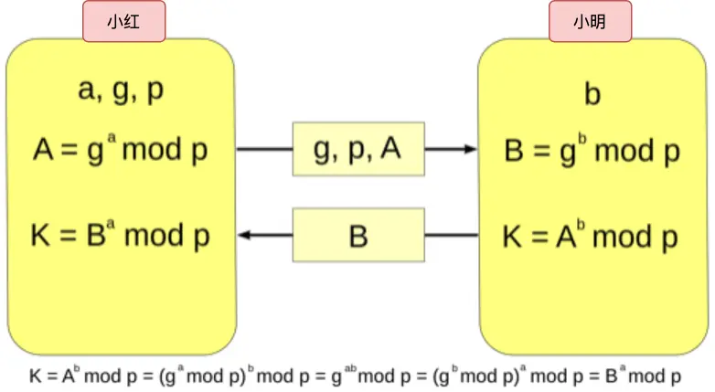

这个 K 就是小红和小明之间用的对称加密密钥，可以作为会话密钥使用。

可以看到，整个密钥协商过程中，小红和小明公开了 4 个信息：P、G、A、B，其中 P、G 是算法的参数，A 和 B 是公钥，而 a、b 是双方各自保管的私钥，黑客无法获取这 2 个私钥，因此黑客只能从公开的 P、G、A、B 入手，计算出离散对数（私钥）。

前面也多次强调， 根据离散对数的原理，如果 P 是一个大数，在现有的计算机的计算能力是很难破解出 私钥 a、b 的，破解不出私钥，也就无法计算出会话密钥，因此 DH 密钥交换是安全的。
## DHE 算法
根据私钥生成的方式，DH 算法分为两种实现：
* static DH 算法，这个是已经被废弃了；
* DHE 算法，现在常用的；

static DH 算法里有一方的私钥是静态的，也就说每次密钥协商的时候有一方的私钥都是一样的，一般是服务器方固定，即 a 不变，客户端的私钥则是随机生成的。

于是，DH 交换密钥时就只有客户端的公钥是变化，而服务端公钥是不变的，那么随着时间延长，黑客就会截获海量的密钥协商过程的数据，因为密钥协商的过程有些数据是公开的，黑客就可以依据这些数据暴力破解出服务器的私钥，然后就可以计算出会话密钥了，于是之前截获的加密数据会被破解，所以 static DH 算法不具备前向安全性。

既然固定一方的私钥有被破解的风险，那么干脆就让双方的私钥在每次密钥交换通信时，都是随机生成的、临时的，这个方式也就是 DHE 算法，E 全称是 `ephemeral`（临时性的）。

所以，即使有个牛逼的黑客破解了某一次通信过程的私钥，其他通信过程的私钥仍然是安全的，因为每个通信过程的私钥都是没有任何关系的，都是独立的，这样就保证了「前向安全」。
## ECDHE 算法
DHE 算法由于计算性能不佳，因为需要做大量的乘法，为了提升 DHE 算法的性能，所以就出现了现在广泛用于密钥交换算法 —— ECDHE 算法。

ECDHE 算法是在 DHE 算法的基础上利用了 ECC 椭圆曲线特性，可以用更少的计算量计算出公钥，以及最终的会话密钥。

小红和小明使用 ECDHE 密钥交换算法的过程：

双方事先确定好使用哪种椭圆曲线，和曲线上的基点 G，这两个参数都是公开的；
双方各自随机生成一个随机数作为私钥d，并与基点 G相乘得到公钥Q（Q = dG），此时小红的公私钥为 Q1 和 d1，小明的公私钥为 Q2 和 d2；
双方交换各自的公钥，最后小红计算点`(x1，y1) = d1Q2`，小明计算点`(x2，y2) = d2Q1`，由于椭圆曲线上是可以满足乘法交换和结合律，所以`d1Q2 = d1d2G = d2d1G = d2Q1`，因此双方的 x 坐标是一样的，所以它是共享密钥，也就是会话密钥。
这个过程中，双方的私钥都是随机、临时生成的，都是不公开的，即使根据公开的信息（椭圆曲线、公钥、基点 G）也是很难计算出椭圆曲线上的离散对数（私钥）。
## ECDHE 握手过程
知道了 ECDHE 算法基本原理后，我们就结合实际的情况来看看。

我用 Wireshark 工具抓了用 ECDHE 密钥协商算法的 TSL 握手过程，可以看到是四次握手：

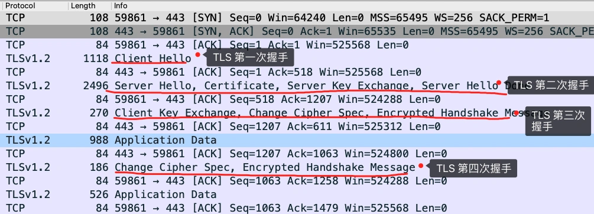

细心的小伙伴应该发现了，使用了 ECDHE，在 TLS 第四次握手前，客户端就已经发送了加密的 HTTP 数据，而对于 RSA 握手过程，必须要完成 TLS 四次握手，才能传输应用数据。

所以，ECDHE 相比 RSA 握手过程省去了一个消息往返的时间，这个有点「抢跑」的意思，它被称为是`TLS False Start`，跟`TCP Fast Open`有点像，都是在还没连接完全建立前，就发送了应用数据，这样便提高了传输的效率。

接下来，分析每一个 ECDHE 握手过程。

### TLS 第一次握手
客户端首先会发一个`Client Hello`消息，消息里面有客户端使用的 TLS 版本号、支持的密码套件列表，以及生成的随机数（`Client Random`）。

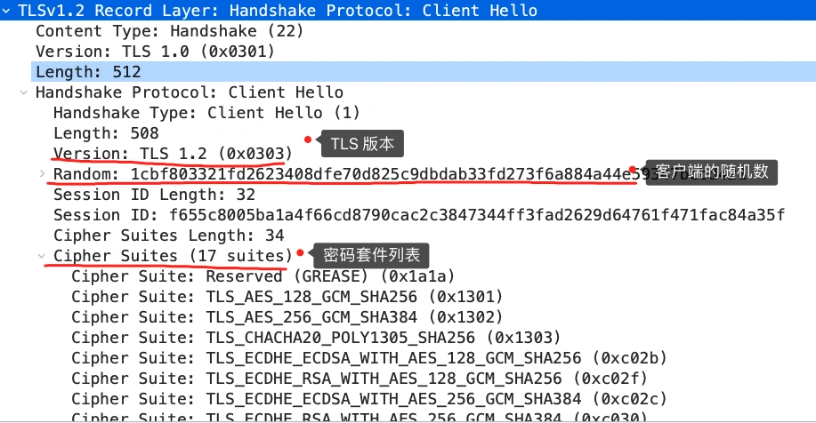

### TLS 第二次握手
服务端收到客户端的「打招呼」，同样也要回礼，会返回`Server Hello`消息，消息面有服务器确认的 TLS 版本号，也给出了一个随机数（`Server Random`），然后从客户端的密码套件列表选择了一个合适的密码套件。


不过，这次选择的密码套件就和 RSA 不一样了，我们来分析一下这次的密码套件的意思。
```
 TLS_ECDHE_RSA_WITH_AES_256_GCM_SHA384
```
* 密钥协商算法使用 ECDHE；
* 签名算法使用 RSA；
* 握手后的通信使用 AES 对称算法，密钥长度 256 位，分组模式是 GCM；
* 摘要算法使用 SHA384；

接着，服务端为了证明自己的身份，发送`Certificate`消息，会把证书也发给客户端。


这一步就和 RSA 握手过程有很大的区别了，因为服务端选择了 ECDHE 密钥协商算法，所以会在发送完证书后，发送`Server Key Exchange`消息。

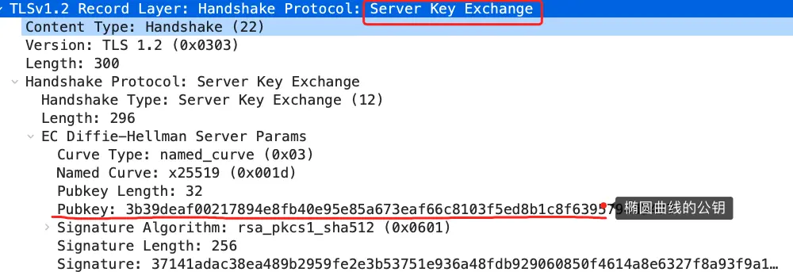

这个过程服务器做了三件事：
1. 选择了名为 x25519 的椭圆曲线，选好了椭圆曲线相当于椭圆曲线基点 G 也定好了，这些都会公开给客户端；
2. 生成随机数作为服务端椭圆曲线的私钥，保留到本地；
3. 根据基点 G 和私钥计算出服务端的椭圆曲线公钥，这个会公开给客户端。
	 为了保证这个椭圆曲线的公钥不被第三方篡改，服务端会用 RSA 签名算法给服务端的椭圆曲线公钥做个签名。

随后，就是`Server Hello Done`消息，服务端跟客户端表明：“这些就是我提供的信息，打招呼完毕”。


至此，TLS 两次握手就已经完成了，目前客户端和服务端通过明文共享了这几个信息：`Client Random、Server Random`、使用的椭圆曲线、椭圆曲线基点 G、服务端椭圆曲线的公钥，这几个信息很重要，是后续生成会话密钥的材料。
### TLS 第三次握手
客户端收到了服务端的证书后，自然要校验证书是否合法，如果证书合法，那么服务端到身份就是没问题的。校验证书的过程会走证书链逐级验证，确认证书的真实性，再用证书的公钥验证签名，这样就能确认服务端的身份了，确认无误后，就可以继续往下走。

客户端会生成一个随机数作为客户端椭圆曲线的私钥，然后再根据服务端前面给的信息，生成客户端的椭圆曲线公钥，然后用`Client Key Exchange`消息发给服务端。


至此，双方都有对方的椭圆曲线公钥、自己的椭圆曲线私钥、椭圆曲线基点 G。于是，双方都就计算出点（x，y），其中 x 坐标值双方都是一样的，前面说 ECDHE 算法时候，说 x 是会话密钥，但实际应用中，x 还不是最终的会话密钥。

还记得 TLS 握手阶段，客户端和服务端都会生成了一个随机数传递给对方吗？

最终的会话密钥，就是用「客户端随机数 + 服务端随机数 + x（ECDHE 算法算出的共享密钥）」三个材料生成的。

之所以这么麻烦，是因为 TLS 设计者不信任客户端或服务器「伪随机数」的可靠性，为了保证真正的完全随机，把三个不可靠的随机数混合起来，那么随机的程度就非常高了，足够让黑客计算不出最终的会话密钥，安全性更高。

算好会话密钥后，客户端会发一个`Change Cipher Spec`消息，告诉服务端后续改用对称算法加密通信。


接着，客户端会发`Encrypted Handshake Message`消息，把之前发送的数据做一个摘要，再用对称密钥加密一下，让服务端做个验证，验证下本次生成的对称密钥是否可以正常使用。


###　TLS 第四次握手
最后，服务端也会有一个同样的操作，发`Change Cipher Spec`和`Encrypted Handshake Message`消息，如果双方都验证加密和解密没问题，那么握手正式完成。于是，就可以正常收发加密的 HTTP 请求和响应了。

# 总结
RSA 和 ECDHE 握手过程的区别：
* RSA 密钥协商算法「不支持」前向保密，ECDHE 密钥协商算法「支持」前向保密；
	使用了 RSA 密钥协商算法，TLS 完成四次握手后，才能进行应用数据传输，而对于 ECDHE 算法，客户端可以不用等服务端的最后一次 * TLS 握手，就可以提前发出加密的 HTTP 数据，节省了一个消息的往返时间；
	使用 ECDHE，在 TLS 第 2 次握手中，会出现服务器端发出的`Server Key Exchange`消息，而 RSA 握手过程没有该消息；
