IP 是尽力传输的网络协议，提供的数据传输服务是不可靠的、无连接的，不能保证数据包能成功到达目的地。那么问题来了：如何确定数据包成功到达目的地？


这需要一个网络层协议，提供错误检测功能和报告机制功能，于是出现了 ICMP（`Internet Control Message Protocol`，互联网控制消息协议）。ICMP 的主要功能是，确认 IP 包是否成功送达目的地址，通知发送过程中 IP 包被丢弃的原因。有了这些功能，就可以检查网络是否正常、网络配置是否正确、设备是否异常等信息，方便进行网络问题诊断。

举个栗子：如果在传输过程中，发生了某个错误，设备便会向源设备返回一条 ICMP 消息，告诉它发生的错误类型。


## ICMP 消息封装
ICMP 报文是封装在 IP 包里面，它⼯作在网络层，因而不保证可靠的提交。

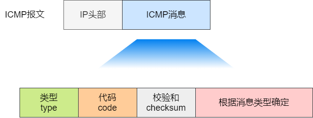

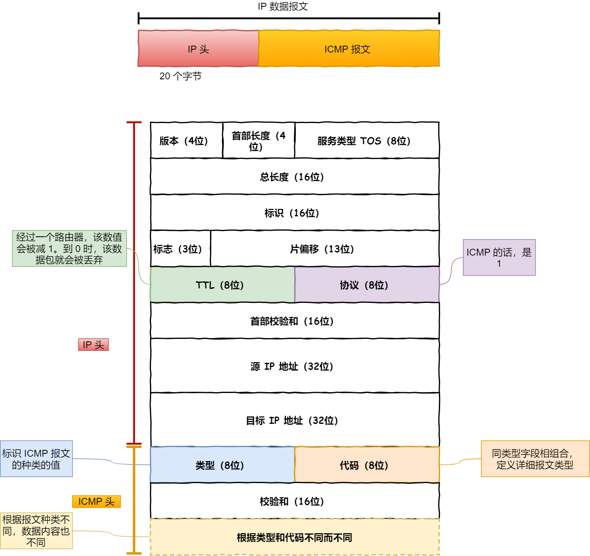

其中`type`（类型）字段表示 ICMP 消息的类型，`code`（代码）字段表示 ICMP 消息的具体含义。

ICMP 包头的类型字段，大致可以分为两大类：
* 一类是用于诊断的查询消息，也就是「查询报文类型」
* 另一类是通知出错原因的错误消息，也就是「差错报文类型」

常见的 ICMP 类型：

| 类型值 | 内容                                 |  种类  |
|:---:|:-----------------------------------|:----:|
|  0  | 回送响应消息<br>(Echo Replay)            | 查询报文 |
|  3  | 目的不可达<br>(Destination Unreachable) | 差错报文 |
|  4  | 源点抑制<br>(Source Quench)            | 差错报文 |
|  5  | 重定向或改变路由<br>(Redirect)             | 差错报文 |
|  8  | 回送请求消息<br>(Echo Request)           | 查询报文 |
| 11  | 超时<br>(Time Exceeded)              | 差错报文 |
| 12  | 参数问题<br>(Parameter Problem)        | 差错报文 |
| 13  | 时间戳请求<br>(Timestamp Request)       | 查询报文 |
| 14  | 时间戳响应<br>(Timestamp Reply)         | 查询报文 |

### 查询报文类型
回送消息用于进行通信的主机或路由器之间，判断所发送的数据包是否已经成功到达对端的一种消息，`ping`命令就是利用这个消息实现的。
* 回送请求消息（`Echo Request`，类型 8）：是由源设备（主机或路由器等）向一个指定的目的设备发出的请求。这种消息用来测试目的地是否可达。
* 回送响应消息（`Echo Reply`，类型 0）：对`Echo Request`的响应。目的设备发送`Echo Reply`来响应收到的`Echo Request`。

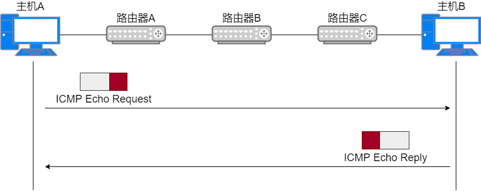

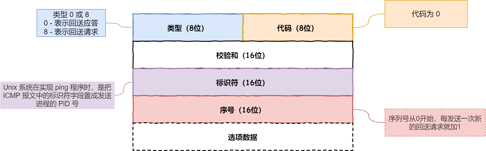

相比原生的 ICMP，这里多了两个字段：
* 标识符：用以区分是哪个应用程序发 ICMP 包，比如用进程 PID 作为标识符；
* 序号：序号从 0 开始，每发送一次新的回送请求就会加 1，可以用来确认网络包是否有丢失。

在选项数据中，`ping`还会存放发送请求的时间值，来计算往返时间，说明路程的长短。
### 差错报文类型
几个常用的 ICMP 差错报文：
* 目的不可达消息 —— 类型 3
* 原点抑制消息 —— 类型 4
* 重定向消息 —— 类型 5
* 超时消息 —— 类型 11

#### 目的不可达消息
路由器无法将 IP 数据包发送给目标地址时，会给发送端主机返回一个目标不可达的 ICMP 消息，并在这个消息中显示不可达的具体原因，原因记录在 ICMP 包头的代码字段。

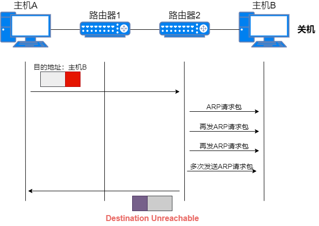

由此，根据 ICMP 不可达的具体消息，发送端主机也就可以了解此次发送不可达的具体原因。

6 种常见的目标不可达类型的代码：

| 代码值 | 说明                          | 描述                                                                                                                         |
|-----|-----------------------------|----------------------------------------------------------------------------------------------------------------------------|
| 0   | 网络不可达（`Network Unreachable`）| IP 地址是分为网络号和主机号的，所以当路由器中的路由器表匹配不到接收⽅ IP 的网络号，就通过 ICMP 协议以网络不可达的原因告知主机。自从不再有网络分类以后，网络不可达也渐渐不再使用了。                           |
| 1   | 主机不可达（`Host Unreachable`）  | 当路由表中没有该主机的信息，或者该主机没有连接到网络，那么会通过 ICMP 协议以主机不可达的原因告知主机。                                                                     |
| 2   | 协议不可达（`Protocol Unreachable`） | 当主机使用 TCP 协议访问对端主机时，能找到对端的主机了，可是对端主机的防火墙已经禁止 TCP 协议访问，那么会通过 ICMP 协议以协议不可达的原因告知主机。                                          |
| 3   | 端口不可达（`Port Unreachable`）   | 当主机访问对端主机 8080 端口时，这次能找到对端主机了，防火墙也没有限制，可是发现对端主机没有进程监听 8080 端口，那么会通过 ICMP 协议以端口不可达的原因告知主机。                                  |
| 4   | 需要进行分片但设置了不分片               | 发送端主机发送 IP 数据报时，将 IP 首部的分片禁止标志位设置为 1。根据这个标志位，途中的路由器遇到超过 MTU 大小的数据包时，不会进行分片，而是直接抛弃。随后，通过一个 ICMP 的不可达消息类型，代码为 4 的报文，告知发送端主机。 |

#### 参数问题消息
路由器发现 IP 包头出现错误或非法值后，向源设备发送一个`Parameter Problem`消息。这个消息包含有问题的 IP 头，或错误字段的提示信息。

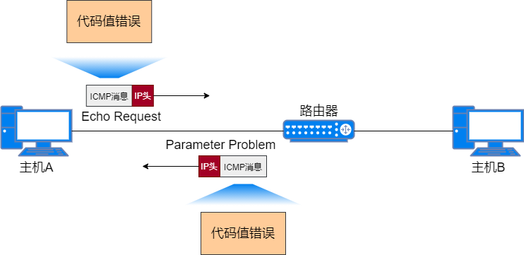
#### 原点抑制消息
在使用低速⼴域线路的情况下，连接 WAN 的路由器可能会遇到网络拥堵的问题。ICMP 原点抑制消息的目的就是为了缓和这种拥堵情况。

当路由器向低速线路发送数据时，其发送队列的缓存变为零而⽆法发送出去时，可以向 IP 包的源地址发送一个 ICMP 原点抑制消息。

收到这个消息的主机借此了解在整个线路的某一处发生了拥堵的情况，从而增大 IP 包的传输间隔，减少网络拥堵的情况。

然而，由于这种 ICMP 可能会引起不公平的网络通信，一般不被使用。
#### 重定向消息
如果路由器发现一条更优的路径发送数据，那么它就会返回一个重定向消息给主机。这个消息包含了最合适的路由信息和源数据。

实际情况下，这种重定向消息会引发路由问题，所以不进行这种设置。比如：路由器的路由表不准确时，ICMP 有可能就无法正常工作。

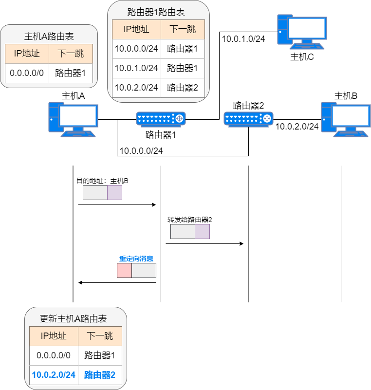

#### 超时消息
IP 包中有一个字段 TTL（`Time To Live`，生存周期），它的值随着每经过一次路由器就会减 1，直到减到 0 时该 IP 包会被丢弃。这时，路由器会发送一个`Time Exceeded`消息给源设备，并通知 IP 包已被丢弃。

设置 TTL 的主要目的，是当路由发生环路时，避免 IP 包无休止的在网络上转发。还可以用 TTL 控制 IP 包的可达范围，比如设置一个较小的 TTL 值。

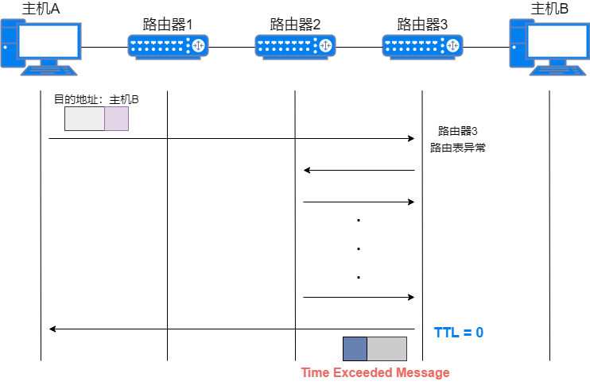

#### 时间戳请求/时间戳响应
时间戳可以记录 ICMP 消息一次往返所需的时间。源设备发送一个带有发送时间的`Timestamp Request`消息，目的设备收到后，发送一个带有原设备发送时间、目的设备接收时间以及目的设备发送时间的`Timestamp Reply`消息。源设备收到`Timestamp Reply`时，并同时记录到达时间。这些时间戳可以估计网络上的传输时间。

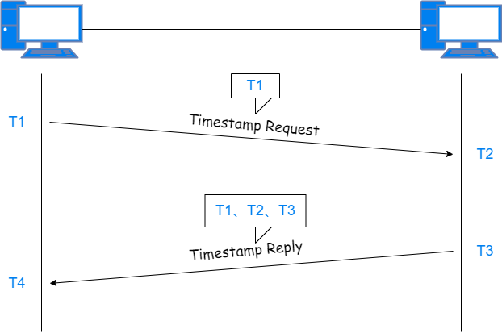

## ICMP 的应用
ICMP 被广泛应用于网络测试，最常用的`ping`和`tracert`网络测试工具，都是使用 ICMP 协议实现的。
### ping—查询报文类型的使用
通过`ping`可以测试网络的可达性，即网络上的报文能否成功到达目的地。使用`ping`命令时，源设备向目的设备发送`Echo request`消息，目的地址是目的设备的 IP 地址。目的设备收到`Echo request`消息后，向源设备回应一个`Echo reply`消息，可知目的设备是可达的。也可以通过`ping`命令来判断目标主机是否启用。

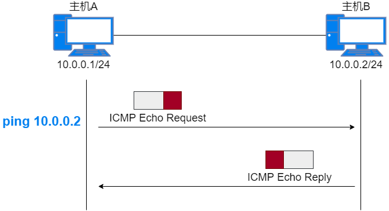

如果中间某个路由器没有到达目的网络的路由，便会向源设备回应一个`Destination Unreachable`消息，告知目的设备不可达。

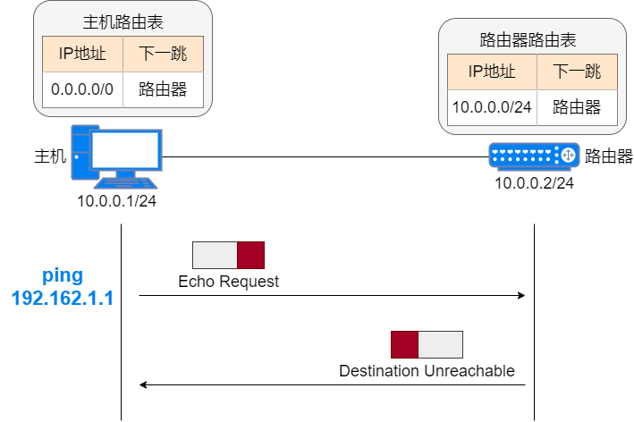

如果源主机在一定时间内无法收到回应报文，就认为目的设备不可达，并显示超时。


需要注意的是`ping`过程是双向的消息通信，只有双向都成功传输时，才能说明通信是正常的。另外主机也可能因为防火墙拦截，导致`ping`不通。
#### ping的发送和接收过程
同个⼦网下的主机 A 和 主机 B，主机 A 执行`ping`主机 B 后，我们来看看其间发送了什么。

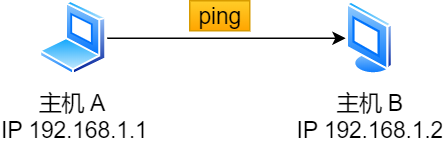

`ping`命令执行的时候，源主机首先会构建一个`Echo request`消息数据包。

ICMP 数据包内包含多个字段，最重要的是两个：
* 第一个是类型，对于`Echo request`消息而⾔该字段为 8
* 另外一个是序号，主要用于区分连续`ping`的时候发出的多个数据包

每发出一个请求数据包，序号会自动加 1。为了能够计算往返时间 RTT，它会在报文的数据部分插⼊发送时间。


然后，由 ICMP 协议将这个数据包连同地址`192.168.1.2`一起交给 IP 层。IP 层将以`192.168.1.2`作为目的地址，本机 IP 地址作为源地址，协议字段设置为 1 表示是 ICMP 协议，再加上一些其他控制信息，构建一个 IP 数据包。


接下来，需要加入 MAC 头。如果在本地 ARP 映射表中查找出 IP 地址`192.168.1.2`所对应的 MAC 地址，则可以直接使用；如果没有，则需要发送 ARP 协议查询 MAC 地址，获得 MAC 地址后，由数据链路层构建一个数据帧，目的地址是 IP 层传过来的 MAC 地址，源地址则是本机的 MAC 地址；还要附加上一些控制信息，依据以太网的介质访问规则，将它们传送出去。


主机 B 收到这个数据帧后，先检查它的目的 MAC 地址，并和本机的 MAC 地址对比，如符合，则接收，否则就丢弃。

接收后检查该数据帧，将 IP 数据包从帧中提取出来，交给本机的 IP 层。同样，IP 层检查后，将有用的信息提取后交给 ICMP 协议。

主机 B 会构建一个 ICMP 回送响应消息数据包，回送响应数据包的类型字段为 0，序号为接收到的请求数据包中的序号，然后再发送出去给主机 A。


在规定的时候间内，源主机如果没有接到 ICMP 的应答包，则说明目标主机不可达；如果接收到了 ICMP 回送响应消息，则说明目标主机可达。

此时，源主机会检查，用当前时刻减去该数据包最初从源主机上发出的时刻，就是 ICMP 数据包的时间延迟。

针对上面发送的事情，总结成了如下图：


当然这只是最简单的，同一个局域网里面的情况。如果跨网段的话，还会涉及网关的转发、路由器的转发等等。

但是对于 ICMP 的头来讲，是没什么影响的。会影响的是根据目标 IP 地址，选择路由的下一跳，还有每经过一个路由器到达一个新的局域网，需要换 MAC 头里面的 MAC 地址。

说了这么多，可以看出`ping`这个程序是使用了 ICMP 里面的`echo request`（类型为 8）和`echo reply`（类型为 0）。
#### ping 常用命令
`ping`的作用主要为：
1. 用来检测网络的连通情况和分析网络速度
2. 根据域名得到服务器 IP
3. 根据`ping`返回的 TTL 值来判断对方所使用的操作系统及数据包经过路由器数量

我们通常会用它来直接`ping ip`地址，来测试网络的连通情况。
```shell
PS C:\Users\ThinkPad> ping 172.16.20.50

正在 Ping 172.16.20.50 具有 32 字节的数据:
来自 172.16.20.50 的回复: 字节=32 时间=1ms TTL=61
来自 172.16.20.50 的回复: 字节=32 时间=1ms TTL=61
来自 172.16.20.50 的回复: 字节=32 时间=1ms TTL=61
来自 172.16.20.50 的回复: 字节=32 时间=2ms TTL=61

172.16.20.50 的 Ping 统计信息:
    数据包: 已发送 = 4，已接收 = 4，丢失 = 0 (0% 丢失)，
往返行程的估计时间(以毫秒为单位):
    最短 = 1ms，最长 = 2ms，平均 = 1ms
```
各值解释：
* 字节=32：数据包大小，也就是字节
* 时间=1ms：响应时间，这个时间越小，说明你连接这个地址速度越快
* TTL=61：`Time To Live`, 表示 DNS 记录在 DNS 服务器上存在的时间，它是 IP 协议包的一个值，告诉路由器该数据包何时需要被丢弃。

`ping`命令除了直接`ping`网络的`ip`地址，验证网络畅通和速度之外，它还有这些用法。
```shell
PS C:\Users\ThinkPad> ping /?

用法: ping [-t] [-a] [-n count] [-l size] [-f] [-i TTL] [-v TOS]
            [-r count] [-s count] [[-j host-list] | [-k host-list]]
            [-w timeout] [-R] [-S srcaddr] [-c compartment] [-p]
            [-4] [-6] target_name

选项:
    -t             Ping 指定的主机，直到停止。
                   若要查看统计信息并继续操作，请键入 Ctrl+Break；
                   若要停止，请键入 Ctrl+C。
    -a             将地址解析为主机名。
    -n count       要发送的回显请求数。
    -l size        发送缓冲区大小。
    -f             在数据包中设置“不分段”标记(仅适用于 IPv4)。
    -i TTL         生存时间。
    -v TOS         服务类型(仅适用于 IPv4。该设置已被弃用，
                   对 IP 标头中的服务类型字段没有任何
                   影响)。
    -r count       记录计数跃点的路由(仅适用于 IPv4)。
    -s count       计数跃点的时间戳(仅适用于 IPv4)。
    -j host-list   与主机列表一起使用的松散源路由(仅适用于 IPv4)。
    -k host-list    与主机列表一起使用的严格源路由(仅适用于 IPv4)。
    -w timeout     等待每次回复的超时时间(毫秒)。
    -R             同样使用路由标头测试反向路由(仅适用于 IPv6)。
                   根据 RFC 5095，已弃用此路由标头。
                   如果使用此标头，某些系统可能丢弃
                   回显请求。
    -S srcaddr     要使用的源地址。
    -c compartment 路由隔离舱标识符。
    -p             Ping Hyper-V 网络虚拟化提供程序地址。
    -4             强制使用 IPv4。
    -6             强制使用 IPv6。
```
* **ping -t**：不间断地`ping`指定计算机，直到管理员中断。
```shell
PS C:\Users\ThinkPad> ping -t 172.16.10.1

正在 Ping 172.16.10.1 具有 32 字节的数据:
来自 172.16.10.1 的回复: 字节=32 时间=4ms TTL=64
来自 172.16.10.1 的回复: 字节=32 时间=3ms TTL=64
来自 172.16.10.1 的回复: 字节=32 时间=3ms TTL=64
来自 172.16.10.1 的回复: 字节=32 时间=3ms TTL=64
来自 172.16.10.1 的回复: 字节=32 时间=3ms TTL=64
来自 172.16.10.1 的回复: 字节=32 时间=3ms TTL=64
来自 172.16.10.1 的回复: 字节=32 时间=3ms TTL=64
来自 172.16.10.1 的回复: 字节=32 时间=3ms TTL=64

172.16.10.1 的 Ping 统计信息:
    数据包: 已发送 = 8，已接收 = 8，丢失 = 0 (0% 丢失)，
往返行程的估计时间(以毫秒为单位):
    最短 = 3ms，最长 = 4ms，平均 = 3ms
Control-C
PS C:\Users\ThinkPad> 
```
* **ping -a**：解析计算机名与 NetBios 名。就是可以通过`ping`它的`ip`地址，可以解析出主机名。
```shell
PS C:\Users\ThinkPad> ping -a 172.16.10.89

正在 Ping DESKTOP-IDC8UD1 [172.16.10.89] 具有 32 字节的数据:
来自 172.16.10.89 的回复: 字节=32 时间=11ms TTL=128
来自 172.16.10.89 的回复: 字节=32 时间=8ms TTL=128
来自 172.16.10.89 的回复: 字节=32 时间=8ms TTL=128
来自 172.16.10.89 的回复: 字节=32 时间=13ms TTL=128

172.16.10.89 的 Ping 统计信息:
    数据包: 已发送 = 4，已接收 = 4，丢失 = 0 (0% 丢失)，
往返行程的估计时间(以毫秒为单位):
    最短 = 8ms，最长 = 13ms，平均 = 10ms
```
* **ping -n count**：在默认情况下，一般都只发送四个数据包，通过这个命令可以自己定义发送的个数。
* **ping -l size**：默认的情况下 Windows 的`ping`发送的数据包大小为`32byte`，最大能发送`65500byte`。当一次发送的数据包大于或等于`65500byte`时，将可能导致接收方计算机宕机。所以微软限制了这一数值；这个参数配合其它参数以后危害非常强大，比如攻击者可以结合`-t`参数实施 DOS 攻击。

### tracert
`ping`工具只能测试目的设备的连通性，但是看不到数据包的传输路径。所以在网络不通的情况下，无法知道网络问题发生在哪个位置。`tracert`工具可以查看数据包的整条传输路径，包括途中经过的中间设备。

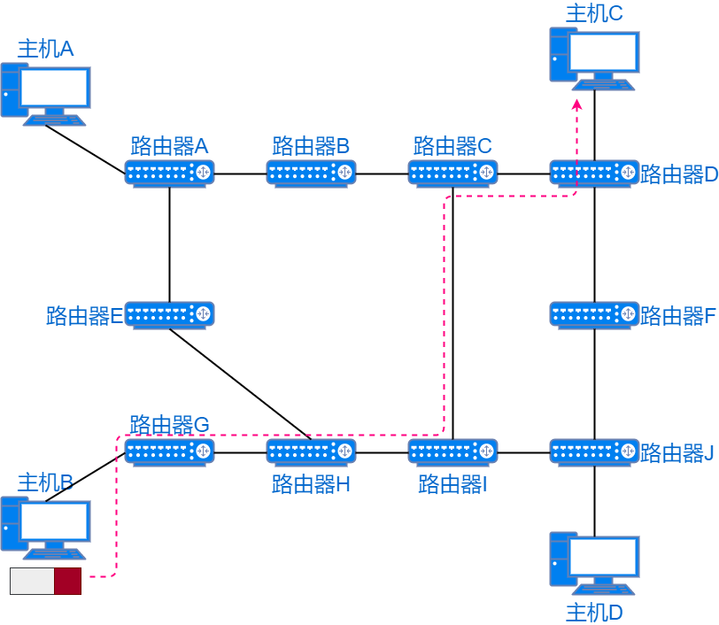

tracert 使用 UDP 封装跟踪数据。

IP 头部的 TTL 字段是为避免数据包循环转发而设计的。每经过一个路由器，数据包头中的 TTL 值减 1。如果 TTL 值为 0 则丢弃报文，并向源设备回应一个`Time Exceeded`消息，告知错误类型。`tracert`就是基于 TTL 字段和 ICMP 协议实现的。在 Windows 中命令是`tracert`，在 Unix、MacOS 中命令是`traceroute`。

```shell
PS C:\Users\ThinkPad> tracert /?

用法: tracert [-d] [-h maximum_hops] [-j host-list] [-w timeout]
               [-R] [-S srcaddr] [-4] [-6] target_name

选项:
    -d                 不将地址解析成主机名。
    -h maximum_hops    搜索目标的最大跃点数。
    -j host-list       与主机列表一起的松散源路由(仅适用于 IPv4)。
    -w timeout         等待每个回复的超时时间(以毫秒为单位)。
    -R                 跟踪往返行程路径(仅适用于 IPv6)。
    -S srcaddr         要使用的源地址(仅适用于 IPv6)。
    -4                 强制使用 IPv4。
    -6                 强制使用 IPv6。
```

使用`tracert`命令时，源设备的`tracert`逐跳发送数据包，并等待每一个响应报文。发送第一个数据包时，TTL 值设为 1。第一个路由器收到数据包后 TTL 值减 1，随即丢弃数据包，并返回一个`Time Exceeded`消息。源设备的`tracert`收到响应报文后，取出源 IP 地址，即路径上的第一个路由器地址。然后`tracert`发送一个 TTL 值为 2 的数据包。第一个路由器将 TTL 值减 1，并转发数据包。第二个路由器再将 TTL 值减 1，丢弃数据包并返回一个`Time Exceeded`消息。`tracert`收到响应报文后，取出源 IP 地址，即路径上的第二个路由器地址。类似步骤，`tracert`逐跳获得每一个路由器的地址，并探测到目的设备的可达性。

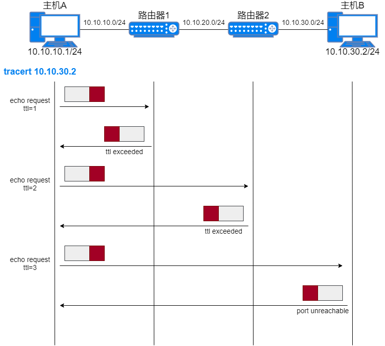

`tracert`过程也是双向的消息通信，只有双向都成功传输时，才能正确探测路径。另外主机安装了防火墙，也可能造成路径探测失败。
## 实战
在 Windows 电脑上使用`ping`命令，并查看返回信息。

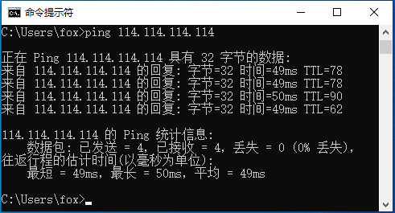

同步抓包进行验证。

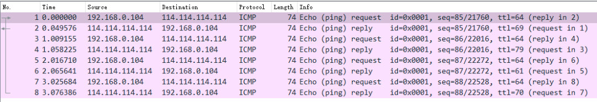

在 Windows 电脑上使用`tracert`命令，并查看返回信息。

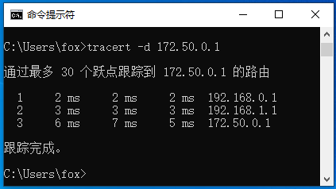

同步抓包进行验证。

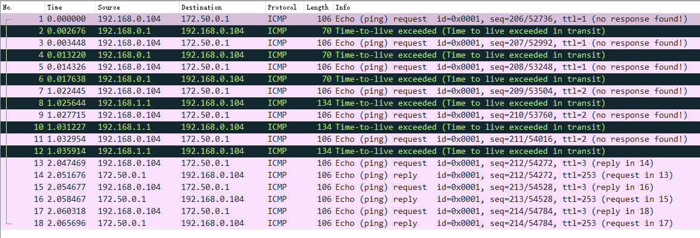
