## IS-IS
OSI 定义了七层模型，那为啥叫 OSI 参考模型？因为 OSI 不仅定义了七层模型，还定义了各层的网络协议，比如：CLNS 、CONP 、IS-IS 等等。但是很多协议，几年时间都无法定稿，定稿的部分也很复杂，实现成本过高。最后，OSI 大部分项目不了了之，几乎只剩下参考模型。

其中 IS-IS 是为数不多的、现网还在使用的 OSI 网络协议。IS-IS，即`Intermediate System to Intermediate System`，中间系统到中间系统，是一种链路状态路由协议。与 OSPF 很像，IS-IS 通过`Hello`报文发现对方，建立邻居关系，交互 LSP，LSP 会存储在自己的 LSDB 中，采用 SPF 算法进行计算，最后得到 IS-IS 路由。

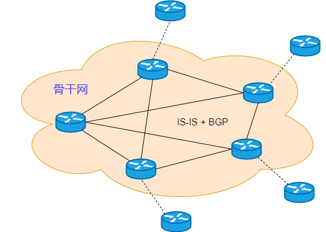

IS-IS 是为 CLNP（`ConnectionLess Network Protocol`，无连接网络协议）的动态路由协议，可以把 OSI 中的 CLNP 理解为 TCP/IP 的 IP 协议，两个协议的功能非常相似。IS-IS 是无法运行在 TCP/IP 环境中的，后来对 IS-IS 进行了扩展，让它可以同时支持 IP 路由，这种 IS-IS 叫做集成 IS-IS（ `Integrated IS-IS`）。

## 常用名词
* ISO：国际标准化组织，即在国际上促进各领域的标准化实现，比如 ISO9000 质量体系、OSI 参考模型。
OSI 模型有两种通信类型：CONS（面向连接的网络服务）和 CLNS（无连接网络服务）。
* CONS：面向连接的网络服务。CONP 连接的网络协议，用来支持 CONS 服务。但现在 CLNS 已经取代了 CONS 服务。
* CLNS：无连接的网络服务。由 CLNP 协议支持。
* CLNP：无连接网络协议，类似 IP 协议，是 OSI 模式下的 CLNS 的网络协议。有时也叫 CLNS 协议。IS-IS、ES-IS、CLNP 都是网络层协议，直接封装在数据链路层帧内。而 TCP/IP 的 OSPF 报文是封装在 IP 报文里的。
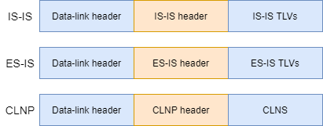
* IS：中间系统。IS-IS 协议中，路由器就是中间系统。
* ES：终端系统。IS-IS 协议中，比如主机、服务器等。
* IS-IS：中间系统到中间系统，是 OSI 协议中的动态链路协议，在 CLNS 环境中，IS 之间动态的交换路由信息的协议,后来扩展到同时支持 TCP/IP 协议。OSPF 是 TCP/IP 下的动态链路协议。
* 集成 IS-IS：IS-IS 仅支持 CLNS 网络环境，不支持 IP 网络环境。后来 IETF 对 IS-IS 进行了修改和扩展，叫做集成 IS-IS（`Integrated IS-IS`）。集成 IS-IS 能同时在 TCP/IP 和 OSI 网络中，为提供动态的路由信息交换。集成 IS-IS 能同时处理多个网络层协议，比如 IP 和 CLNP，而 OSPF 只支持 IP 一种。
* ES-IS：终端系统与中间系统的通信协议。不属于路由协议。ES 和 IS 间建立邻接关系，数据链路地址到网络地址的映射。类似于 TCP/IP 协议中的 MAC 地址到 IP 地址的映射。
* LSP：链路状态报文，是 IS-IS 用于描述链路状态信息，类似 OSPF 的 LSA。IS 把网络中的 LSP 搜集起来，再装载到自己的 LSDB 中，然后基于 LSP 进行路由计算。LSP 分为两种：`Level-1 LSP`和`Level-2 LSP`。
* PDU：数据单元，OSI 网络层协议报文，类似于 TCP/IP 中的 IP 报文。

### OSI 地址
#### NSAP
在 OSI 协议栈中，NSAP，即网络服务器接入点，是 OSI 网络层的地址，在 OSI 协议栈中定位资源的地址。不但包含标识设备的地址信息，还包含标识上层协议类型或服务类型的内容。类似于 TCP/IP 中的 IP 地址和 TCP 或 UDP 端口号的组合。

NSAP 地址由 IDP（初始域部分）和 DSP（域指定部分）组成，IDP 和 DSP 又进一步划分。IDP 和 DSP 长度可变，那么 NSAP 地址的总长度也不固定，最短是 `8byte`，最长是`20byte`。


* `AFI`：长度是`1 byte`，表示地址的分配机构，也指定地址的格式。`AFI`值是 49 时，表示本地管理，即私有地址空间。
* `IDI`：表示域，长度可变。
* `High Order DSP`：长度可变，在一个域中进一步划分区域。
* `System ID`：表示一个区域内的某台设备，长度固定`6 byte`，通常使用 16 进制表示，比如`1234.abcd.5678`。同时，要保证域内设备的`System ID`必须是唯一的。设备的 MAC 地址刚好是`6 byte`，使用设备的 MAC 地址作为`System ID`是个不错的方案。
* `SEL`：长度是 1 byte ，表示上层协议类型或服务类型。相当于 TCP/IP 中的端口。
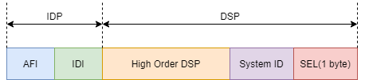
* `IDP`：相当于 IP 地址的网络号，由`AFI`和`IDI`组成。`AFI`表示地址分配机构和地址格式，`IDI`表示域。
* `DSP`：相当于 IP 地址的子网号和主机地址。由`High Order DSP`、`System ID`和`SEL`组成。`High Order DSP`用来分隔区域，`System ID`用来区分主机，`SEL`用来表示服务类型。
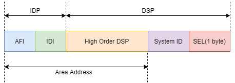
* `Area Address`：长度可变，最短是`1 byte`。由`IDP`和`DSP`的`High Order DSP`组成，既能够表示路由域，又能表示域中的区域，叫做区域地址，相当于 OSPF 中的区域编号。

#### NET
OSI 协议栈中，还有一个重要的地址，它就是 NET，即网络实体名称。`SEL`值为 0 的 NASP 地址就是 NET，它表示设备的网络地址。`SEL`为 0，即未标识上层协议类型，只用于表示设备本身。即使在纯 TCP/IP 环境中部署 IS-IS，也必须为每台运行 IS-IS 的设备分配 NET，否则无法正常工作。为设备指定 NET 后，设备就可以解析出区域 ID，以及设备的系统 ID。通常，一个设备指定一个 NET，当然，也支持指定多个 NET，但是系统 ID 必须相同。系统 ID 相当于 OSPF 的`Router-ID`。

NSAP 是使用一个地址表示一台路由器，而 IP 是路由器的每个端口都分配一个 IP 地址。

在 NET 中，区域 ID 的长度可变，因此 NET 的长度不固定。设备如何识别出区域 ID 和系统 ID 呢？以`49.0001.1234.abcd.5678.00`为例。


NET 最后一个字节是`SEL`，对应的值必须是 0，相邻的六个字节是系统 ID，其余部分就是区域 ID。在同一个区域的两台 IS-IS 设备，区域 ID 必须相同，系统 ID 必须不同。

配置举例：

```shell
[router]isis 1
[router-isis-1]network-entity 49.1234.abcd.1111.2222.3333.00
```
`isis`命令创建进程，并进入配置视图，`isis`命令可指定进程`Process-ID`。如果未指定`Process-ID`，系统就会自动分配一个默认的。配置视图下，`network-entity`命令配置 NET，NET 是`49.1234.abcd.1111.2222.3333.00`，系统 ID 是`1111.2222.3333`，也可以是接口的 MAC 地址；区域 ID 是`49.1234.abcd`。配置 NET 时，只需要关注区域 ID 和系统 ID 这两个信息。
## 分层结构
链路状态协议的分层结构，可以减少 LSA 的数量，降低设备的性能消耗。OSPF 有骨干区域、常规区域、特殊区域，而 IS-IS 就简单些，只有骨干网络和常规区域。

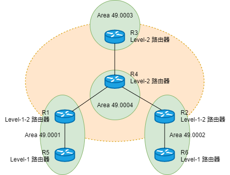

ISIS 的骨干网络是由连续的`Level-2`和`Level-1-2`路由器组成。图中的 R1、R2、R3 和 R4 构成骨干网络。连续的`Level-1`和`Level-1-2`路由器构成的区域叫做`Level-1`区域。比如`Area 49.0001`和`Area 49.0002`。`Level-2`区域，由连续的、同一个区域的`Level-2`和`Level-1-2`路由器构成。比如`Area 49.0003`和`Area 49.0004`。`Level-1`区域可能有多个，骨干网络也可能覆盖多个`Level-2`区域。

IS-IS 的区域，不是按照接口划分的，而是按照设备划分的。配置 IS-IS 时，要指定设备的区域，一个设备可以同时属于多个区域。配完后，设备的所有接口都属于这个区域。比如 R1 和 R5 建立 `Level-1` 的邻居关系，R3 和 R4 建立`Level-2`的邻居关系。同时，区域的交界不在设备上，而是在链路上。比如`Area 49.0001`和`Area 49.0004`的交界就是 R1 和 R4 连接的链路上。

IS-IS 的每个`Level-1`区域必须和骨干网络直连，比如`Area 49.0001`就是通过 R1 连接到骨干网络。`Level-1-2`路由器作为`Level-1`区域和骨干网络的桥梁，`Level-1`区域内的路由通过`Level-2 LSP`通告给骨干网络。而`Level-1-2`路由器不会把骨干网络的路由通告给`Level-1`区域，而是下发默认路由给`Level-1`路由器。跟 OSPF 的 Totally NSSA 类似。`Level-1`路由器只知道区域内的路由，区域外的网络，通过默认路由到达。

## 路由器分类
运行 IS-IS 的路由器，根据`Level`的不同，可分为两类：`Level-1`和`Level-2`。路由器可以是`Level-1`类型，或`Level-2`类型，还可以同时是`Level-1`和`Level-2`类型，即`Level-1-2`类型，实际上`Level-1-2`并不是一种单独的 IS-IS 路由器类型。

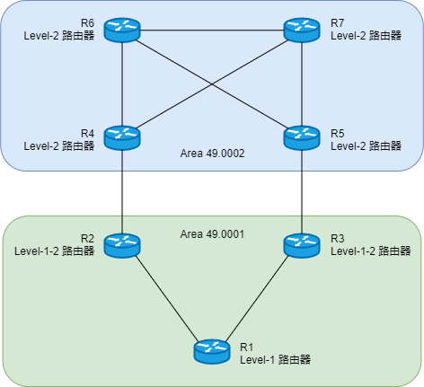

### Level-1 路由器
`Level-1`路由器，比如图中的 R1，只能和同一区域内的其它`Level-1`或`Level-1-2`路由器建立 IS-IS 邻居关系，也叫做`Level-1`邻居关系。它无法与`Level-2`路由器建立邻居关系。`Level-1`路由器只维护`Level-1 LSDB`，根据链路状态信息计算区域内的网络拓扑及最优路由。`Level-1`只能通过`Level-1-2`路由器接入骨干网络访问其它网络区域。
### Level-2 路由器
`Level-2`路由器，比如图中的 R4、R5、R6、R7，可以看做 IS-IS 骨干网络的路由器，其实骨干网络是由连续的`Level-2`路由器及`Level-1-2`路由器组成的。`Level-2`路由器只能和`Level-1-2`或`Level-2`路由器建立邻居关系，也叫做`Level-2`邻居关系。`Level-2`路由器只维护`Level-2`的 LSDB，`Level-2`路由器有整个 IS-IS 域的所有路由信息。
### Level-1-2 路由器
`Level-1-2`路由器，比如图中的 R2、R3，同时是`Level-1`和`Level-2`级别的路由器，可以和同一区域的`Level-1`、`Level-1-2`路由器建立`Level-1`邻居关系，也可以和`Level-2`路由器或`Level-1-2`路由器建立`Level-2`邻居关系。`Level-1-2`路由器同时维护`Level-1`的 LSDB 和`Level-2`的 LSDB，分别计算`Level-1`路由和`Level-2`路由。通常，`Level-1-2` 路由器连接一个`Level-1`区域，也连着骨干网络，作为`Level-1`区域与其它区域通信的桥梁，下发的`Level-1 LSP`中设置 ATT 位，`Level-1`路由器根据这条 LSP，生成一条指向`Level-1-2`路由器的默认路由。默认状态下，路由器的全局`Level`为`Level-1-2`。可通过命令修改设备类型。
## 度量值
IS-IS 使用`Cost`作为路由度量值，也叫做开销、成本、代价。`Cost`值越小，路由越优。每个接口都有`Cost`值，默认值为 10，与接口带宽不相关。某些情况下就会出现问题，比如设备选择`Cost`更优的低带宽路径，不选择`Cost`更劣的高带宽路径。这时，就要根据实际情况，修改接口`Cost`值。


IS-IS 路由的`Cost`等于源设备到目的网段所有出接口的`Cost`总和。R1 通过 IS-IS 获取到`3.3.3.0/24`的路由，`Cost`值为 30。默认情况下，`Cost`类型是`Narrow`，接口`Cost`长度是`6bit`，取值范围是 1~63。路由`Cost`长度是`10bit`，最大值为 1023。但在大型网络中，度量值范围太小，不能满足需求，就引入了`Wide`类型`Cost`。`Wide`类型时，接口`Cost`是`24bit`，取值范围是 1～16777215。同时，路由`Cost`值可达到 4261412864。从而能够支持更大规模的网络，`Cost`的路由控制也更灵活。`Wide`配置命令：
```shell
[router]isis 1
[router-isis-1]cost-style wide
```
路由器使用的`Cost`类型是`Narrow`时，只能接收和发送`Cost`类型是`Narrow`的路由。同理，`Cost`类型改为`Wide`后，只能接收和发送`Cost`类型是`Wide`的路由。当然，为了兼容两种模式，就有了`Compatible`类型，可同时接收和发送`Narrow`类型和`Wide`类型的路由。

| Cost类型            | 接收          | 发送          |
|-------------------|-------------|-------------|
| narrow            | narrow      | narrow      |
| narrow-compatible | narrow&wide | narrow      |
| compatible        | narrow&wide | narrow&wide |
| wide-compatible   | narrow&wide | wide        |
| wide              | wide        | wide        |


默认情况下，IS-IS `Cost`类型为`Narrow`时，`Cost`值为 10。无论接口的带宽是多少，值都是 10。简单的方法，就是手动修改接口`Cost`。既然路由都能动态生成，那么`Cost`还要手动修改，显然不合适。肯定有自动计算接口`Cost`的功能，使用`auto-cost enable`命令激活。接口的`Cost`值 = ( `bandwidth-reference` / 接口带宽值 ) × 10。`bandwidth-reference`值默认是 100，可通过命令修改。比如千兆接口的带宽是`1000Mbps`，结果是 1，即`Cost`值为 1。当然，只有`Cost`类型为`Wide`或`Wide-compatible`时，自动计算才生效。如果`Cost`类型为`Narrow`、`Narrow-compatible`或`Compatible`时，根据带宽和度量值的对应关系表设置`Cost`值。

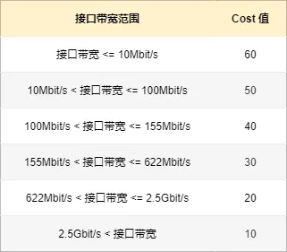

## 三张表
IS-IS 维护了三张重要的数据表，分别是邻居表、LSDB、IS-IS 路由表。

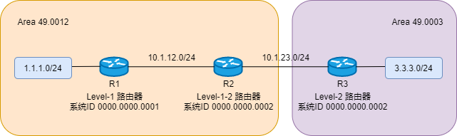

### 邻居表
相邻两台路由器要先建立邻居关系，才开始交互 LSP。路由器在直连链路上发现的邻居加载到邻居表中。使用`display isis peer`命令查看邻接表，包含邻居的系统 ID、状态、保活时间和类型等信息。

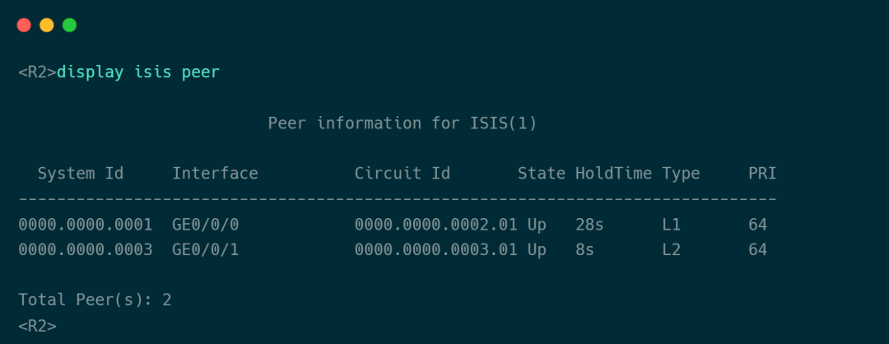

R2 发现了两个邻居，`GE0/0/0`接口发现了邻居 R1，邻居状态是 UP，还有 28 秒保持时间，邻居类型是`Level-1`，接口优先级是 64；`GE0/0/1`接口发现了邻居 R3，邻居类型是 Level-2 。
### LSDB
直连的两台路由器建立邻居关系后，开始交互 LSP。路由器把自己生成的、网络中泛洪的 LSP 存储到 LSDB 中。用这些信息绘制网络拓扑、计算路由。使用`display isis lsdb`命令，查看路由器的 IS-IS LSDB。

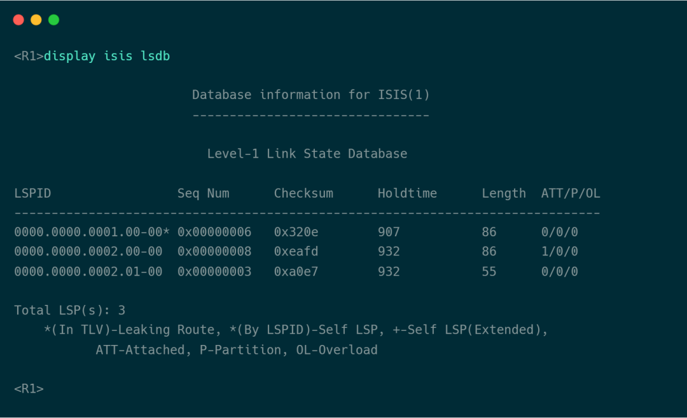

R1 是一台`Level-1`路由器，只维护`Level-1 LSDB`，LSDB 中有三个 LSP。每个 LSP 使用 LSP ID 标识，LSP ID 由三部分组成：系统 ID：6byte，生成 LSP 的路由器的系统 ID。伪节点 ID：1byte。字段值有 0 和非 0 两种情况。值为 0 时，表示普通 LSP。值为非 0 时，由 DIS 分配，表示伪节点 LSP。分片号：1byte，如果 LSP 过大，会进行分片。通过不同的分片号，标识和区分不同的 LSP 分片。同一个 LSP 的不同分片，必须要有相同的系统 ID 和伪节点 ID。下面以 R1 生成的 LSP 为例，LSD ID 是`0000.0000.0001.00-00`。LSP ID 后面带星号 “*”，表示是路由器自己生成的。


LSDB 的`Seq Num`表示 LSP 的序列号，用来表示 LSP 的新旧。R1 也不会有 R3 的 LSP，因为其它区域的 LSP 不会泛洪到`Level-1`区域内。R2 是`Level-1-2`路由器，会同时维护`Level-1 LSDB`和`Level-2 LSDB`。

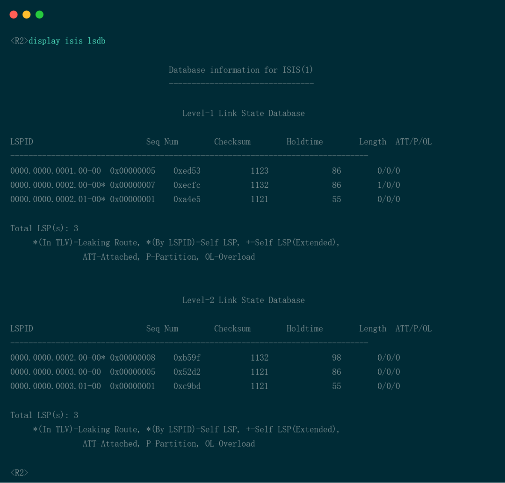

### IS-IS 路由表
路由器基于 LSDB，运行路由算法，计算出最优路由。计算出的路由存放在 IS-IS 路由表中，使用`display isis route`命令查看 IS-IS 路由表，是否会加载到全局路由表中，取决于路由优先级等因素。查看 R1 的 IS-IS 路由表：
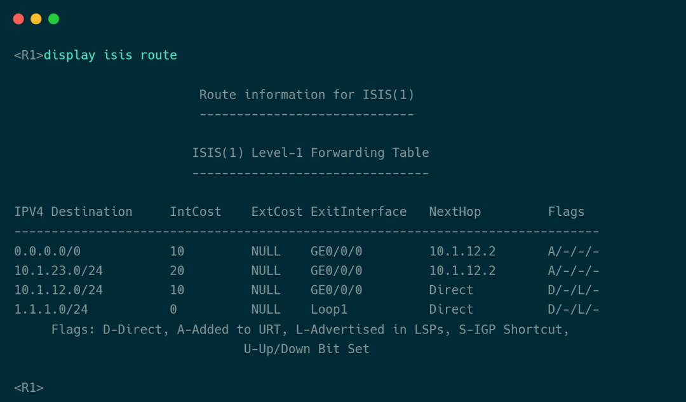
查看 R2 的 IS-IS 路由表：
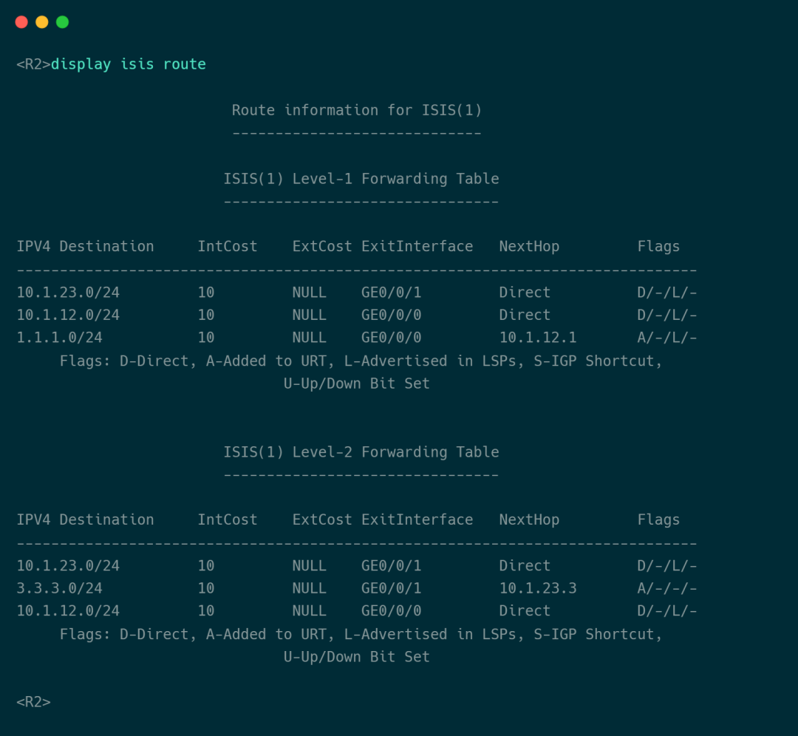
R2 通过 IS-IS 学习到`Level-1`路由`1.1.1.0/24`和`Level-2`路由`3.3.3.0/24`。`Level-1`路由根据`Level-1 LSDB`计算出的路由，`Level-2`路由根据`Level-2 LSDB`计算出的路由。当到达目的网段，既有`Level-1`路由，又有`Level-2`路由时，优选`Level-1`路由，与路由`Cost`无关。查看 R2 的全局路由表：
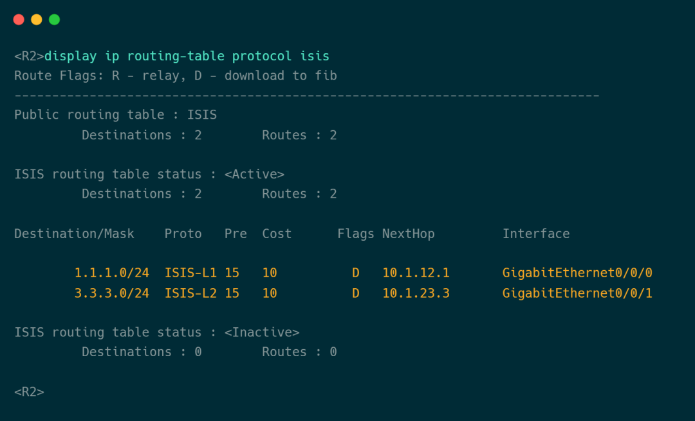

## 协议报文
IS-IS 的协议报文直接采用数据链路层封装，对比 OSPF 少了 IP 层封装，IS-IS 报文的封装效率更高。IS-IS 报文直接封装在以太网数据帧中，使用几种 PDU：
### IIH (IS-IS Hello)
IIH PDU 用于建立和维护 IS-IS 的邻居关系。有三种 IIH PDU：`Level-1 LAN IIH、Level-2 LAN IIH`和`P2P IIH`。其中`Level-1 LAN IIH`和`Level-2 LAN IIH`用于`Broadcast`类型的网络，`Level-1`设备只发送和侦听`Level-1 LAN IIH`，`Level-2`设备只发送和侦听`Level-2 LAN IIH`，`Level-1-2`设备发送和侦听两种类型的`LAN IIH`。`P2P IIH`用于 P2P 类型的网络中。

### LSP (Link-State Packet)
ISIS 使用 LSP 存放链路状态信息，LSP 是一种独立的 PDU。LSP 分为`Level-1 LSP`和`Level-2 LSP`，根据邻居关系类型，发送对应的 LSP。比如`Level-1`邻居关系，交互`Level-1 LSP`，`Level-1-2`邻居关系，`Level-1 LSP`和`Level-2 LSP`都会交互。

### CSNP (Complete Sequence Number PDU)
CSNP 用于 LSDB 同步，包含路由器 LSDB 所有 LSP 摘要。CSNP 也分为`Level-1 CSNP`和`Level-2 CSNP`，不同邻居关系交互不同类型的 CSNP。CSNP 包含设备的 LSDB 所有 LSP 摘要信息，一条 LSP 的摘要信息包括 LSP 的 LSP ID、序列号、剩余生存时间、校验和，这四个信息是 LSP 头部的关键信息。

### PSNP (Partial Sequence Number PDU)
PSNP 只包含一部分 LSP 的摘要信息，用于请求 LSP 更新，也分为`Level-1 PSNP`和`Level-2 PSNP`。PSNP 还用于 P2P 网络中，对收到的 LSP 进行确认。

### IS-IS PDU
IS-IS PDU 报文结构主要是三个部分：通用的头部、PDU 特有的头部、可变长部分。通用的头部，是指所有 IS-IS PDU 都有的、相同格式的头部。每种 PDU 都有自己特有的头部。可变长部分，使用三元组格式存储内容，也就是 TLV ，全称`Type-Length-Value`，也就是类型、长度、值的三元组。


TLV 的各元素描述如下：

`Type`（类型）：`1byte` ，表示 TLV 的类型，不同 TLV 类型携带不同的信息。

| 类型组 | 名称        | 使用这个TLV的PDU | 备注                       |
|-----|-----------|-------------|--------------------------|
| 1   | 区域地址      | IIH、LSP     | 设备所在区域的地址                |
| 2   | IS邻居      | LSP         | 设备的IS-IS邻居，到达邻居的Cost     |
| 6   | IS邻居      | LAN IIH     | 设备LAN发现的IS-IS邻居          |
| 8   | 填充        | IIH         | 报文填充                     |
| 9   | LSP条目     | CSNP、PSNP   | 各条LSP的摘要信息               |
| 10  | 认证        | 所有报文        | 认证信息                     |
| 128 | IP内部可达性信息 | LSP         | IS-IS域内的目的网段，到达目的网段的Cost |
| 130 | IP外部可达性信息 | LSP         | IS-IS域内的目的网段，到达目的网段的Cost |
| 132 | IP接口地址    | IIH、LSP     | 设备的接口IP地址                |

`Length`（长度）：`1byte`，表示`Value`的长度。不同 TLV 类型，长度也不同。

`Value`（值）：字节数的长度是`Length`的值，表示 TLV 的有效内容。

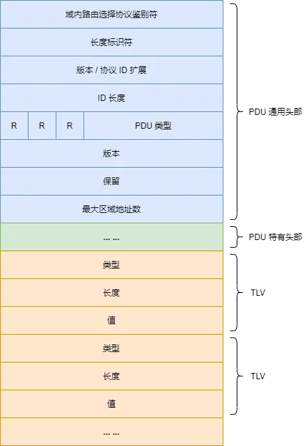

每种 PDU 都有一定数量的 TLV，TLV 非常灵活、方便扩展。不对协议做大改动的情况下，引入新的 TLV 就可以实现新功能的支持，这就是 TLV 的绝对优势。
## LSP
IS-IS 使用 LSP 来描述网络拓扑和网段信息，有两种 LSP：`Level-1 LSP`和`Level-2 LSP`。LSP 由 PDU 通用头部和 LSP 报文组成，LSP 报文包含 LSP 特有头部和 TLV。

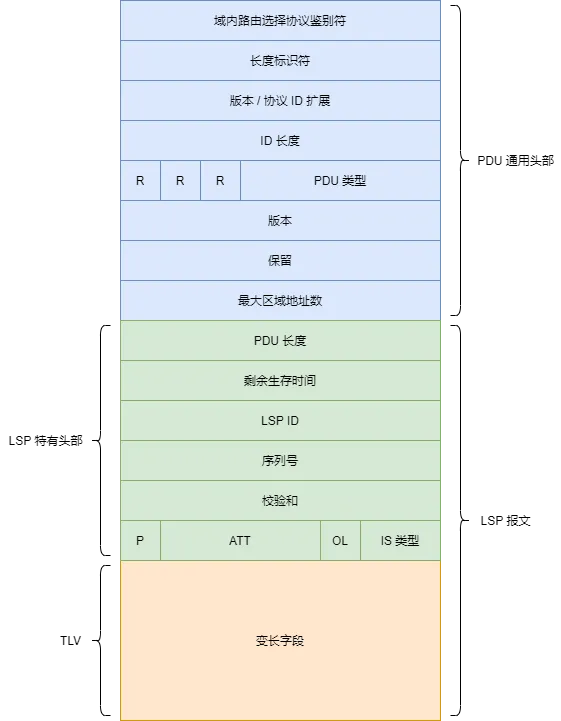

LSP 字段及说明：
* PDU 长度（`PDU Length`）：PDU 的总长度，单位是字节。
* 剩余生存时间（`Remaining Lifetime`）：LSP 的剩余存活时间，单位是秒。
* LSP 标识符（`LSP ID`）：三部分组成：设备的系统 ID 、伪节点 ID 、分配编号，用于标识不同的 LSP。
* 序列号（`Sequence Number`）：LSP 的序列号，用于区分 LSP 的新旧。
* 校验和（`Checksum`）：校验和。
* P（`Partition Repair`）：如果设备支持区域划分修复特性，那么生成的 LSP 中 P 值设为 1。
* ATT（`Attached bits`）：关联位，`Level-1-2`路由器，既连着`Level-1`区域，又连着`Level-2`区域，生成的`Level-1 LSP`中 ATT 值为 1。
* OL（`Overload bit`）：过载位，通常 IS-IS 设备生成的 LSP 中 OL 值为 0。值为 1 时，表示设备已经过载，只计算生成 LSP 设备的直连路由，不计算其它网段的路由。
* IS 类型（`IS Type`）：二进制值为 01 时，表示 `Level-1` 路由器。二进制值为 11 时，表示`Level-2`路由器。

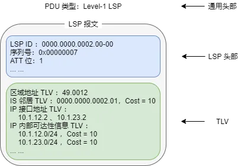

使用`display isis lsdb`命令加上`verbose`关键字，可查看 LSP 的详细信息。R2 的输出如下：

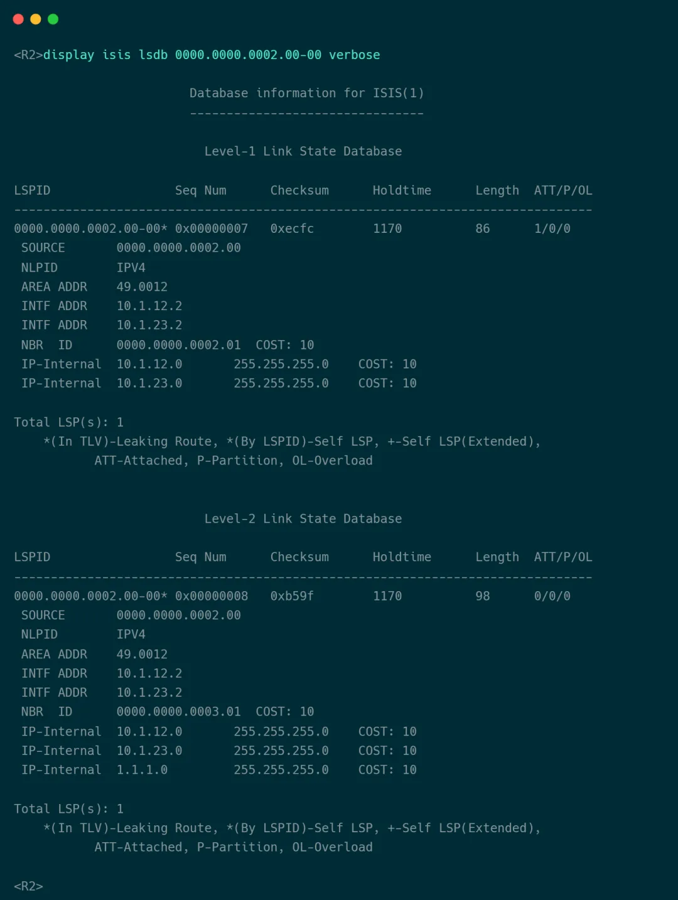

## 网络类型
IS-IS 支持两种网络类型：`Broadcast`（广播）和 P2P（点对点）。IS-IS 会根据接口的数据链路层封装，决定接口的 IS-IS 网络类型。在以太网接口激活 IS-IS 时，接口类型为`Broadcast`，在广域网接口激活时，比如 PPP 或 HDLC 等，接口网络类型为 P2P。

### Broadcast 网络类型
在`Broadcast`网络中，会进行 DIS 选举，跟 OSPF 的 DR 类似。`Broadcast`类型的接口上使用两种 IIH PDU，分别是`Level-1 LAN IIH`和`Level-2 LAN IIH`。使用哪种 PDU，取决于设备接口的`Level`。`Level-1 LAN IIH`的目的 MAC 地址是组播地址`0180-c200-0014`，`Level-2 LAN IIH`的目的 MAC 地址是组播地址`0180-c200-0015`。

DIS 会周期性泛洪 CSNP，确保网络中的 IS-IS 设备有一样的 LSDB。CSNP 包含 DIS 所有 LSP 的摘要信息，使用 TLV 装载 LSP 摘要。同一个`Broadcast`网络中的其它 IS-IS 设备收到 CSNP 后，与自己的 LSDB 对比，如果一致，就忽略这条 CSNP；如果缺少某些 LSP，就向 DIS 发送 PSNP，请求 LSP 的完整信息。DIS 就把对应的 LSP 发送给对方。收到 LSP 后更新到自己的 LSDB 中，无需向 DIS 进行确认。
### P2P 网络类型
P2P 网络无需选举 DIS，使用 P2P IIH 发现和维护 IS-IS 邻居关系。默认时，`Hello`报文发送间隔是 10 秒。建立邻接关系后，开始交互 LSP。收到 LSP 后，使用 PSNP 进行确认，告诉对方自己收到了 LSP。如果一段时候后，对方没收到 PSNP，就会对 LSP 进行重传。CSNP 只在邻居关系建立后，双方进行一次交互，后面不再发送。收到 CSNP 后，和自己的 LSDB 对比，相同则忽略这条 CSNP ，缺少某些 LSP，就向邻居发送 PSNP 请求 LSP 的完整信息。
### NBMA 网络类型
IS-IS 不支持 NBMA 网络类型。比如在`Frame-Relay`环境中，IS-IS 只能在接口上使用 P2P 网络类型，不支持修改成`Broadcast`。`Frame-Relay`接口使用一条 PVC 连接一台设备，如果一个接口要连接多台设备，就需要使用子接口接入 NBMA 网络，当然也是 P2P 类型的子接口。

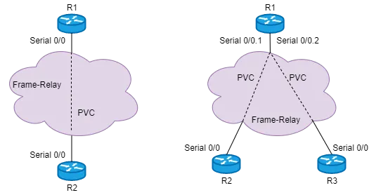

## DIS 和 伪节点
网络类型是`Broadcast`时，IS-IS 会选举 DIS（指定中间系统），DIS 在 LAN 中虚拟出一个伪节点（`Pseudonodes`），并生成伪节点 LSP。

伪节点不是一台真实的物理设备，而是 DIS 生成的一台虚拟设备。LAN 内设备的 LSP 只需描述和伪节点的邻居关系即可，不需要描述和其它非伪节点的邻居关系。伪节点的 LSP 包括伪节点和 LAN 中所有设备的邻居关系，根据伪节点的 LSP 就能计算出 LAN 内的拓扑，DIS 生成伪节点的 LSP。伪节点和伪节点的 LSP 让 LSP 的数量减少，当拓扑发生变化时，泛洪的 LSP 数量也减少了，设备的负担自然也减小了。

为了保证 LSDB 的同步，DIS 会在 LAN 内周期性泛洪 CSNP，LAN 中设备收到后，会进行一致性检查，保证本地 LSDB 和 DIS 同步。


R1、R2、R3、R4 连在一台交换机上，都是`Level-1`设备，属于同一个区域，就需要进行 DIS 选举。R4 和 R5 使用 P2P 链路互联，不需要选举 DIS，也不存在伪节点。

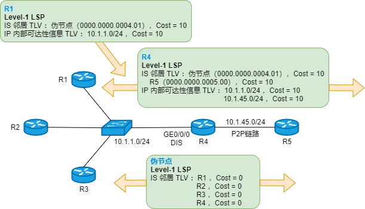

如果 R4 的`GE0/0/0`接口选举为 DIS，那么 R4 会生成一个伪节点，并生成伪节点的 LSP。图中有 R1 和 R4 的 LSP，以及伪节点的 LSP。

先查看 LSDB，因为所有设备属于同一个区域，所以 LSDB 是相同的。R1 使用`display isis lsdb`命令查看：


可以看到每台设备生成的 LSP，R4 生成了两个`Level-1 LSP`，LSP ID 是`0000.0000.0004.01-00`的 LSP，就是 R4 作为 DIS 生成的伪节点 LSP。

查看 R1 生成的 LSP 详情：

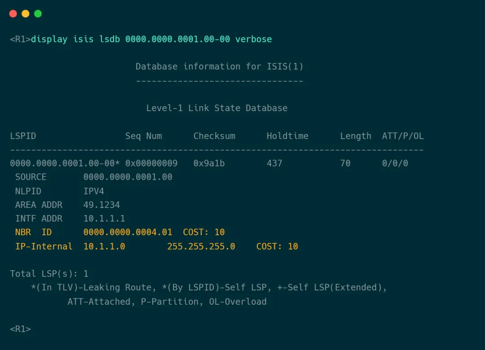

LSP 中的邻居是`0000.0000.0004.01`，也就是伪节点，以及一个 IP 网段`10.1.1.0/24`。R2 和 R3 生成的`Level-1 LSP`也类似。实际上，每台路由器会和所有路由器建立 IS-IS 邻居关系，但是生成的 LSP 只描述自己和伪节点的邻居关系。

再看伪节点 LSP 的详情：

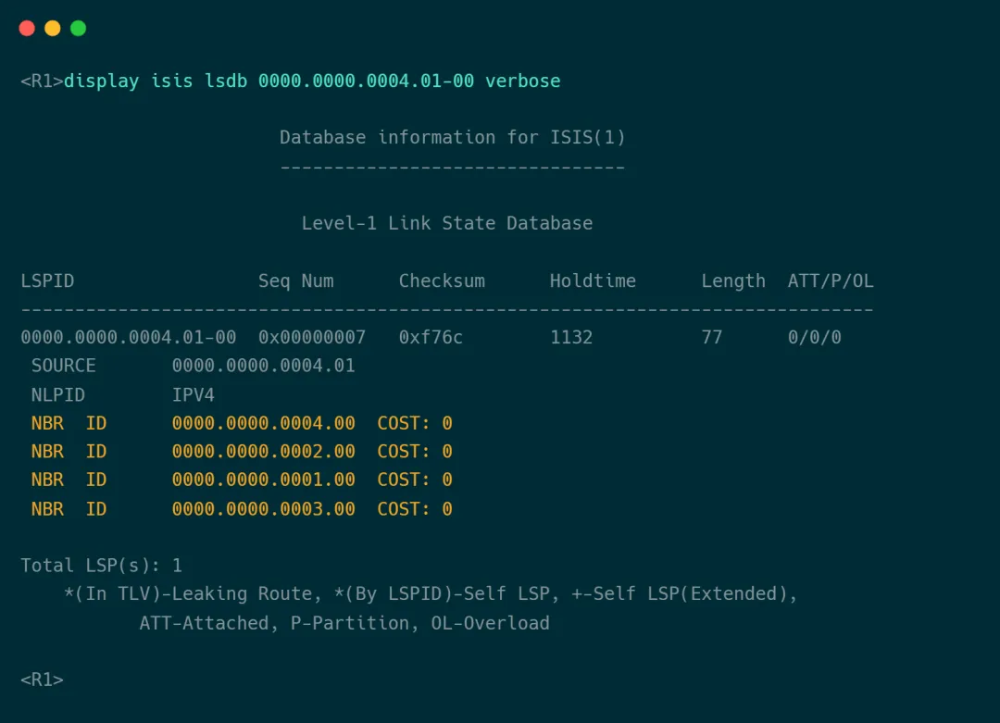

DIS 生成一个`Level-1`伪节点 LSP，并描述了和 R1、R2、R3、R4 的邻居关系。随着这条 LSP 的泛洪，区域内的其它设备就可以计算出 LAN 内的拓扑。

IS-IS 在 LAN 中选举 DIS 的顺序如下：
* 接口 DIS 优先级最高的设备成为 DIS。DIS 优先级的值越大，优先级越高。
* 如果 DIS 优先级相同，那么接口 MAC 地址最大的设备称为 DIS。

注意事项：
* 在一个 LAN 中部署 IS-IS，LAN 中所有设备都会和 DIS 以及非 DIS 设备建立邻居关系。
* 在一个 LAN 中，`Level-1`和`Level-2`的 DIS 独立选举，互不干扰。完全有可能出现一种情况：`Level-1 DIS`和`Level-2 DIS`不是同一个设备。
* IS-IS 没有备份 DIS，当 DIS 发生故障时，立即选举新的 DIS。
* DIS 可抢占。比如一个已经选举出 DIS 的 LAN 中，新加一台优先级更高的设备，那么这台设备会抢占 DIS 的角色，成为新的 DIS。