随着互联网用户的快速增长，全球的公网 IPv4 地址已耗尽。在 IPv4 地址耗尽前，使用 NAT（`Network Address Translation`）技术解决 IPv4 地址不够用的问题，并持续至今。

NAT 技术就是将私有地址转换成公网地址，使私有网络中的主机可以通过少量公网地址访问互联网。

但 NAT只是一种过渡技术，从根本上解决问题，是采用支持更大地址空间的下一代 IP 技术，即 IPv6 协议，它提供了几乎用不完的地址空间。


## NAT 技术
IP 地址中预留了 3 个私有地址网段，在私有网络内，可以任意使用。

<table style="width: 400px">
  <tr><th align=center colspan=2>私有地址范围</th></tr>
  <tr><td align=center>A类地址</td><td>10.0.0.0 ~ 10.255.255.255</td></tr>
  <tr><td align=center>B类地址</td><td>172.16.0.0 ~ 172.31.255.255</td></tr>
  <tr><td align=center>C类地址</td><td>192.168.0.0 ~ 192.168.255.255</td></tr>
</table>

其余的 IP 地址可以在互联网上使用，由 IANA 统一管理，称为公网地址。

典型的 NAT 组网模型，网络通常是被划分为私网和公网两部分，各自使用独立的地址空间。私网使用私有地址，而公网使用公网地址。为了让主机 A 和 B 访问互联网上的服务器`Server`，需要在网络边界部署一台 NAT 设备用于执行地址转换。NAT 设备通常是路由器或防火墙。

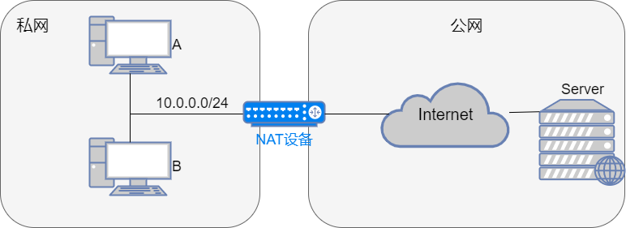

## 基本 NAT
基本 NAT 是最简单的一种地址转换方式，它只对数据包的 IP 层参数进行转换，它可分为静态 NAT 和动态 NAT。

静态 NAT 是公网 IP 地址和私有 IP 地址有一对一的关系，一个公网 IP 地址对应一个私有 IP 地址，建立和维护一张静态地址映射表。

动态 NAT 是公网 IP 地址和私有 IP 地址有一对多的关系，同一个公网 IP 地址分配给不同的私网用户使用，使用时间必须错开。它包含一个公有 IP 地址池和一张动态地址映射表。
### 动态 NAT
私网主机 A（`10.0.0.1`）需要访问公网的服务器 Server（`61.144.249.229`），在路由器 RT 上配置 NAT，地址池为`219.134.180.11 ~ 219.134.180.20`，地址转换过程如下：

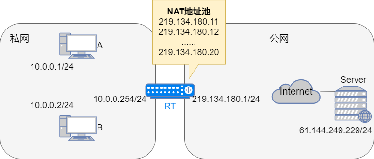

1. A 向 Server 发送报文，网关是`10.0.0.254`，源地址是`10.0.0.1`，目的地址是`61.144.249.229`。


2. RT 收到 IP 报文后，查找路由表，将 IP 报文转发至出接口，由于出接口上配置了 NAT，因此 RT 需要将源地址`10.0.0.1`转换为公网地址。

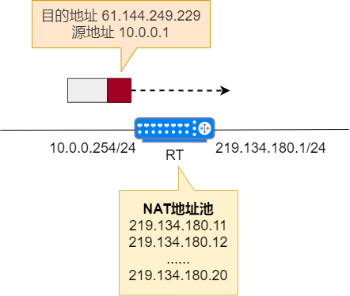

3. RT 从地址池中查找第一个可用的公网地址`219.134.180.11`，用这个地址替换数据包的源地址，转换后的数据包源地址为`219.134.180.11`，目的地址不变。这叫 SNAT（`Source Network Address Translation`，源地址转换）。同时 RT 在自己的 NAT 表中添加一个表项，记录私有地址`10.0.0.1`到公网地址`219.134.180.11`的映射。RT 再将报文转发给目的地址`61.144.249.229`。

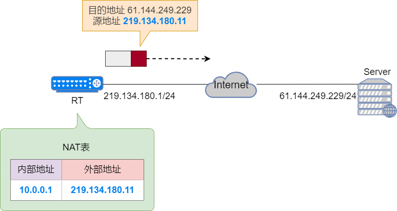

4. Server 收到报文后做相应处理。

5. Server 发送回应报文，报文的源地址是`61.144.249.229`，目的地址是`219.134.180.11`。

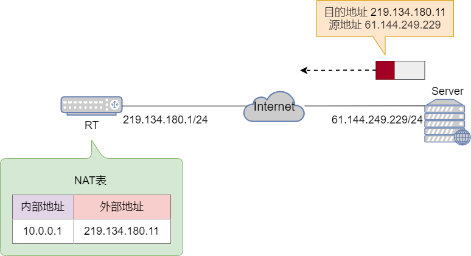

6. RT 收到报文，发现报文的目的地址`219.134.180.11`在 NAT 地址池内，于是检查 NAT 表，找到对应表项后，使用私有地址`10.0.0.1`替换公网地址`219.134.180.11`，转换后的报文源地址不变，目的地址为`10.0.0.1`。RT 在将报文转发给 A。这也叫 DNAT（`Destination Network Address Translation`，目的地址转换）。


7. A 收到报文，地址转换过程结束。


如果 B 也要访问 Server，则 RT 会从地址池中分配另一个可用公网地址`219.134.180.12`，并在 NAT 表中添加一个相应的表项，记录 B 的私有地址`10.0.0.2`到公网地址`219.134.180.12`的映射关系。

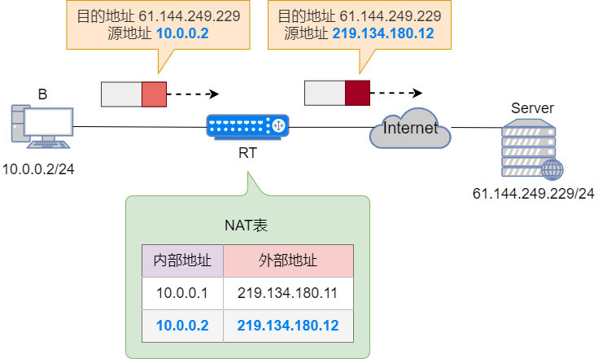

整个过程下来，NAT 悄悄的改了 IP 数据包的发送和接收端 IP 地址，但对真正的发送方和接收方来说，他们却对这件事情，一无所知。

这就是基本 NAT 的工作原理。

当 NAT 路由器具有`n`个全球 IP 地址时，专用网内最多可以同时有`n`台主机接入到互联网。这样就可以使专用网内较多数量的主机，轮流使用 NAT 路由器有限数量的全球 IP 地址。

通过 NAT 路由器的通信必须由专用网内的主机发起。专用网内部的主机不能充当服务器用，因为互联网上的客户无法请求专用网内的服务器提供服务。

为了更加有效地利用 NAT 路由器上的全球 IP 地址，现在常用的 NAT 转换表把运输层的端口号也利用上。这样，就可以使多个拥有本地地址的主机，共用一个 NAT 路由器上的全球 IP 地址，因而可以同时和互联网上的不同主机进行通信。

使用端口号的 NAT 叫做网络地址与端口号转换 NAPT(`Network Address and Port Translation`，网络地址端口转换)，而不使用端口号的 NAT 就叫做基本的 NAT。
## NAPT
在基础 NAT 中，私有地址和公网地址存在一对一地址转换的对应关系，即一个公网地址同时只能分配给一个私有地址。它只解决了公网和私网的通信问题，并没有解决公网地址不足的问题。

NAPT 对数据包的 IP 地址、协议类型、传输层端口号同时进行转换，可以明显提高公网 IP 地址的利用率。


### 举个栗子
私网主机 A（`10.0.0.1`）需要访问公网的服务器 Server 的 WWW 服务（`61.144.249.229`），在路由器 RT 上配置 NAPT，地址池为`219.134.180.11~219.134.180.20`，地址转换过程如下：
1. A 向 Server 发送报文，网关是 RT（`10.0.0.254`），源地址和端口是`10.0.0.1:1024`，目的地址和端口是`61.144.249.229:80`。

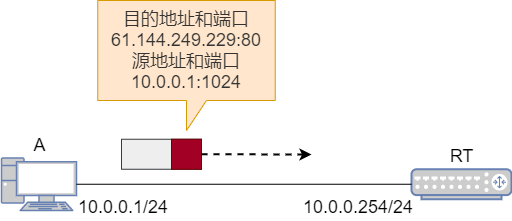

2. RT 收到 IP 报文后，查找路由表，将 IP 报文转发至出接口，由于出接口上配置了 NAPT，因此 RT 需要将源地址`10.0.0.1:1024`转换为公网地址和端口。

3. RT 从地址池中查找第一个可用的公网地址`219.134.180.11`，用这个地址替换数据包的源地址，并查找这个公网地址的一个可用端口，例如 2001，用这个端口替换源端口。转换后的数据包源地址为`219.134.180.11:2001`，目的地址和端口不变。同时 RT 在自己的 NAT 表中添加一个表项，记录私有地址`10.0.0.1:1024`到公网地址`219.134.180.11:2001`的映射。RT 再将报文转发给目的地址`61.144.249.229`。

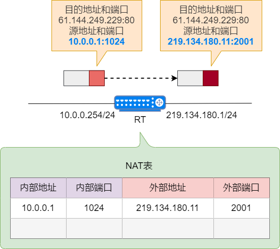

4. Server 收到报文后做相应处理。

5. Server 发送回应报文，报文的源地址是`61.144.249.229:80`，目的地址是`219.134.180.11:2001`。

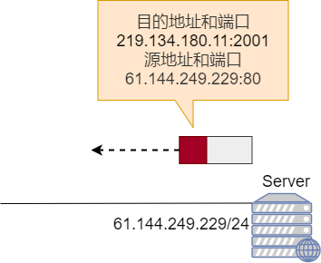

6. RT 收到报文，发现报文的目的地址在 NAT 地址池内，于是检查 NAT 表，找到对应表项后，使用私有地址和端口`10.0.0.1:1024`替换公网地址`219.134.180.11:2001`，转换后的报文源地址和端口不变，目的地址和端口为`10.0.0.1:1024`。RT 再将报文转发给 A。

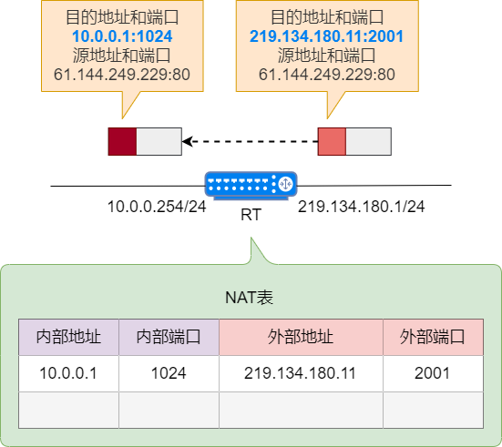

7. A 收到报文，地址转换过程结束。

如果 B 也要访问 Server，则 RT 会从地址池中分配同一个公网地址`219.134.180.11`，但分配另一个端口 3001，并在 NAT 表中添加一个相应的表项，记录 B 的私有地址`10.0.0.2:1024`到公网地址`219.134.180.12:3001`的映射关系。

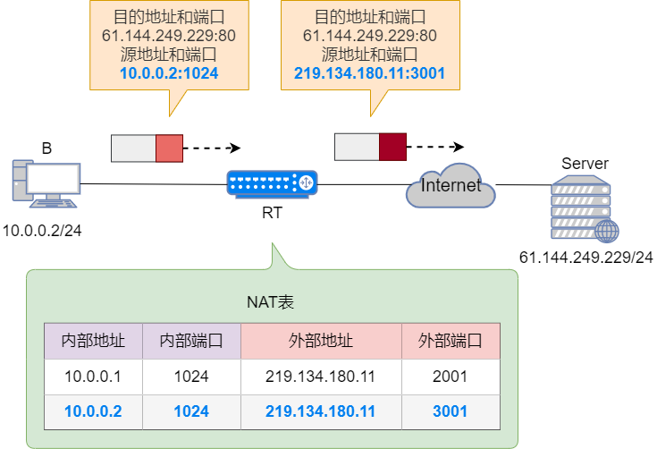

如果局域网内有多个设备，他们就会映射到不同的公网端口上，毕竟端口最大可达 65535，完全够用。这样大家都可以相安无事。

像这种同时转换 IP 和端口的技术，就是 NAPT（`Network Address Port Transfer`, 网络地址端口转换）。

那这么说只有用到端口的网络协议才能被 NAT 识别出来并转发？

但这怎么解释`ping`命令？`ping`基于 ICMP 协议，而 ICMP 协议报文里并不带端口信息。我依然可以正常的`ping`通公网机器并收到回包。


事实上针对 ICMP 协议，NAT 路由器做了特殊处理。`ping`报文头里有个`Identifier`的信息，它其实指的是放出`ping`命令的进程`id`。

对 NAT 路由器来说，这个`Identifier`的作用就跟端口一样。

另外，当我们去抓包的时候，就会发现有两个`Identifier`，一个后面带个BE（`Big Endian`），另一个带个LE（`Little Endian`）。

其实他们都是同一个数值，只不过大小端不同，读出来的值不一样。就好像同样的数字 345，反着读就成了 543。这是为了兼容不同操作系统下大小端不同的情况。

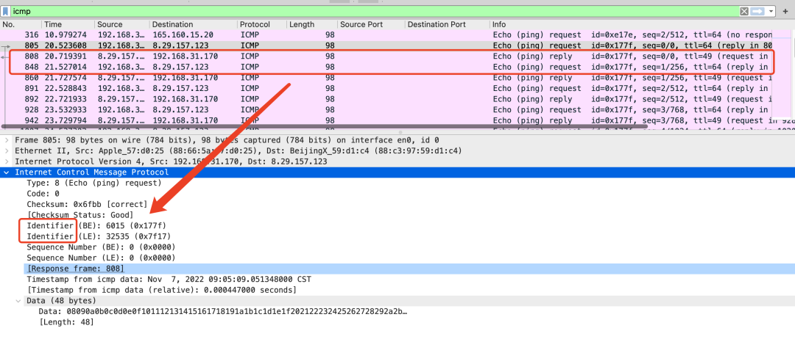

## Easy IP
在标准的 NAPT 配置中需要创建公网地址池，也就是必须先知道公网 IP 地址的范围。而在拨号接入的上网方式中，公网 IP 地址是由运营商动态分配的，无法事先确定，标准的 NAPT 无法做地址转换。要解决这个问题，就要使用 Easy IP。

Easy IP 又称为基于接口的地址转换。在地址转换时，Easy IP 的工作原理与 NAPT 相同，对数据包的 IP 地址、协议类型、传输层端口号同时进行转换。但 Easy IP 直接使用公网接口的 IP 地址作为转换后的源地址。Easy IP 适用于拨号接入互联网，动态获取公网 IP 地址的场合。

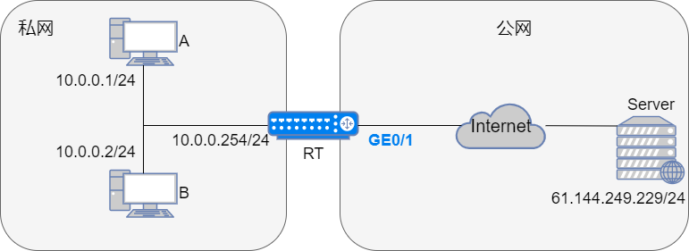

Easy IP 无需配置地址池，只需要配置一个 ACL（访问控制列表），用来指定需要进行 NAT 转换的私有 IP 地址范围。
## NAT Server
从基本 NAT 和 NAPT 的工作原理可知，NAT 表项由私网主机主动向公网主机发起访问而生成，公网主机无法主动向私网主机发起连接。因此 NAT 隐藏了内部网络结构，具有屏蔽主机的作用。但是在实际应用中，内网网络可能需要对外提供服务，例如 Web 服务，常规的 NAT 就无法满足需求了。

为了满足公网用户访问私网内部服务器的需求，需要使用 NAT Server 功能，将私网地址和端口静态映射成公网地址和端口，供公网用户访问。

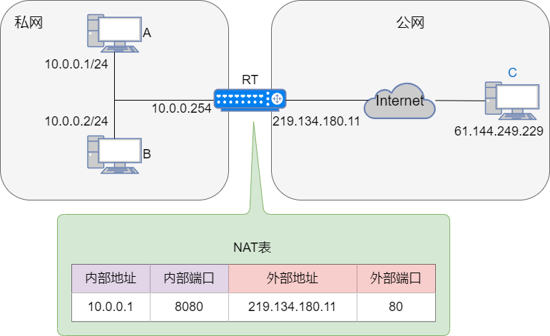

### 举个栗子
A 的私网地址为`10.0.0.1`，端口 8080 提供 Web 服务，在对公网提供 Web 服务时，要求端口号为 80。在 NAT 设备上启动 NAT Server 功能，将私网 IP 地址和端口`10.0.0.1:8080`映射成公网 IP 地址和端口`219.134.180.11:80`，这样公网主机 C 就可以通过`219.134.180.11:80`访问 A 的 Web 服务。
## NAT ALG
基本 NAT 和 NAPT 只能识别并修改 IP 报文中的 IP 地址和端口号信息，无法修改报文内携带的信息，因此对于一些 IP 报文内携带网络信息的协议，例如 FTP、DNS、SIP、H.323 等，是无法正确转换的。

ALG 能够识别应用层协议内的网络信息，在转换 IP 地址和端口号时，也会对应用层数据中的网络信息进行正确的转换。
### 举个栗子：ALG 处理 FTP 的 Active 模式
FTP 是一种基于 TCP 的协议，用于在客户端和服务器间传输文件。FTP 协议工作时建立 2 个通道：`Control`通道和`Data`通道。`Control`用于传输 FTP 控制信息，`Data`通道用于传输文件数据。

私网 A（`10.0.0.1`）访问公网 Server（`61.144.249.229`）的 FTP 服务，在 RT 上配置 NAPT，地址池为`219.134.180.11~219.134.180.20`，地址转换过程如下：

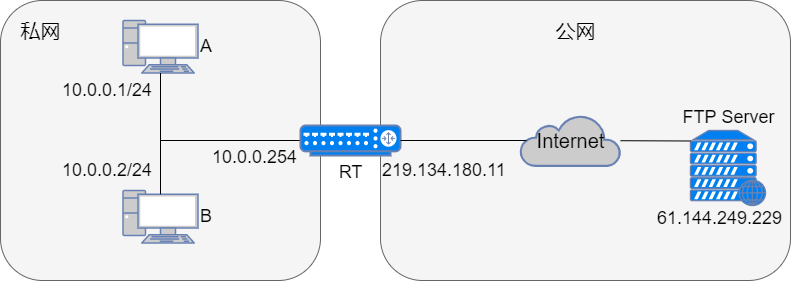

1. A 发送到 Server 的 FTP `Control`通道建立请求，报文源地址和端口为`10.0.0.1:1024`，目的地址和端口为`61.144.249.229:21`，携带数据是 `IP=10.0.0.1 port=5001`，即告诉 Server 自己使用 TCP 端口 5001 传输`Data`。

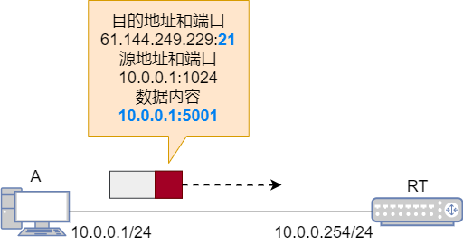

2. RT 收到报文，建立`10.0.0.1:1024`到`219.134.180.11:2001`的映射关系，转换源 IP 地址和 TCP 端口。根据目的端口 21，RT 识别出这是一个 FTP 报文，因此还要检查应用层数据，发现原始数据为`IP=10.0.0.1 port=5001`，于是为`Data`通道`10.0.0.1:5001`建立第二个映射关系：`10.0.0.1:5001`到`219.134.180.11:2002`，转换后的报文源地址和端口为`219.134.180.11:2001`，目的地址和端口不变，携带数据为`IP=219.134.180.11 port=2002`。

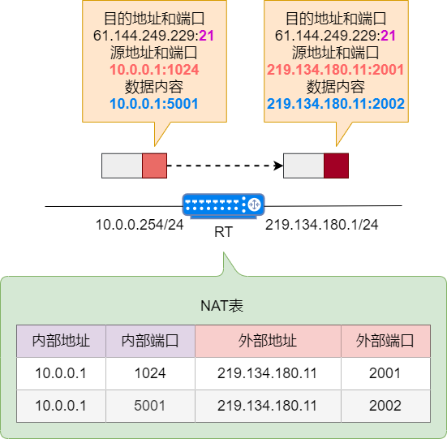

3. Server 收到报文，向 A 回应`command okay`报文，FTP `Control`通道建立成功。同时 Server 根据应用层数据确定 A 的`Data`通道网络参数为 `219.134.180.11:2002`。

4. A 需要从 FTP 服务器下载文件，于是发起文件请求报文。Server 收到请求后，发起`Data`通道建立请求，IP 报文的源地址和端口为`61.144.249.229:20`，目的地址和端口为`219.134.180.11:2002`，并携带 FTP 数据。

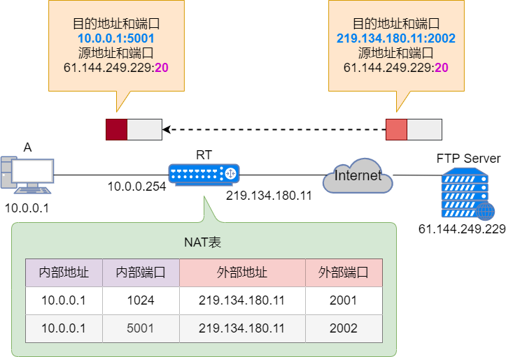

## NAT其它常见问题
### NAT 缺点
由于 NAT/NAPT 都依赖于自己的转换表，因此会有以下的问题：
* 外部无法主动与 NAT 内部服务器建立连接，因为 NAPT 转换表没有转换记录。
* 转换表的生成与转换操作都会产生性能开销。
* 通信过程中，如果 NAT 路由器重启了，所有的 TCP 连接都将被重置。

### 内网穿透
使用了 NAT 上网的话，前提得内网机器主动请求公网 IP，这样 NAT 才能将内网的 IP 端口转成外网 IP 端口。

反过来公网的机器想主动请求内网机器，就会被拦在 NAT 路由器上，此时由于 NAT 路由器并没有任何相关的 IP 端口的映射记录，因此也就不会转发数据给内网里的任何一台机器。

举个现实中的场景就是，你在你家里的电脑上启动了一个 HTTP 服务，地址是`192.168.30.5:5000`，此时你在公司办公室里想通过手机去访问一下，却发现访问不了。

说到底，因为 NAT 的存在，我们只能从内网主动发起连接，否则 NAT 设备不会记录相应的映射关系，没有映射关系也就不能转发数据。

所以我们就在公网上加一台服务器 x，并暴露一个访问域名，再让内网的服务主动连接服务器 x，这样 NAT 路由器上就有对应的映射关系。接着，所有人都去访问服务器 x，服务器 x 将数据转发给内网机器，再原路返回响应，这样数据就都通了。这就是所谓的内网穿透。

像上面提到的服务器 x，你也不需要自己去搭，已经有很多现成的方案，比如花某壳。

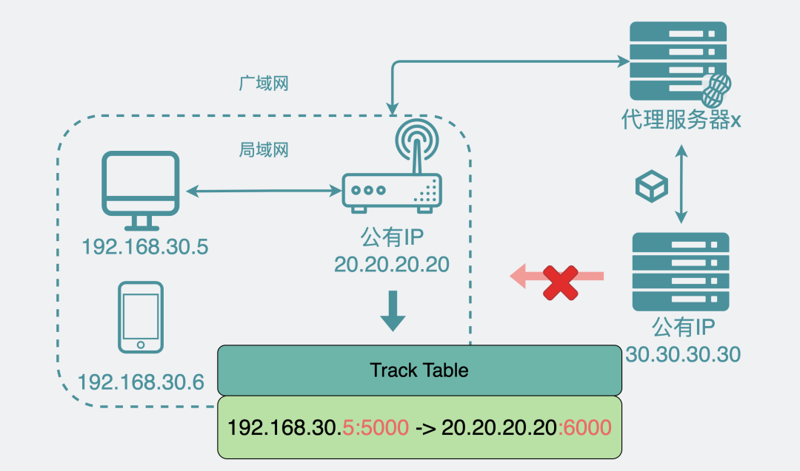

### 为什么我在公司里访问不了家里的电脑？
那是因为家里的电脑在局域网内，局域网和广域网之间有个 NAT 路由器。由于 NAT 路由器的存在，外网服务无法主动连通局域网内的电脑。
### 两个内网的聊天软件如何建立通讯
我家机子是在我们小区的局域网里，班花家的机子也是在她们小区的局域网里。都在局域网里，且 NAT 只能从内网连到外网，那我电脑上登录的QQ是怎么和班花电脑里的QQ连上的呢？


上面这个问法其实是存在个误解，误以为两个qq客户端应用是直接建立连接的。

然而实际上并不是，两个qq客户端之间还隔了一个服务器。

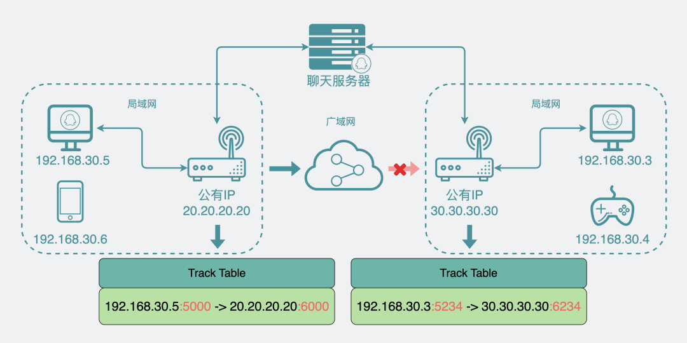

也就是说，两个在内网的客户端登录qq时都会主动向公网的聊天服务器建立连接，这时两方的 NAT 路由器中都会记录有相应的映射关系。当在其中一个qq上发送消息时，数据会先到服务器，再通过服务器转发到另外一个客户端上。反过来也一样，通过这个方式让两台内网的机子进行数据传输。
### 两个内网的应用如何直接建立连接
上面的情况，是两个客户端通过第三方服务器进行通讯，但有些场景就是要抛开第三端，直接进行两端通信，比如P2P下载，这种该怎么办呢？

这种情况下，其实也还是离不开第三方服务器的帮助。

假设还是 A 和 B 两个局域网内的机子，A 内网对应的 NAT 设备叫`NAT_A`，B 内网里的 NAT 设备叫`NAT_B`，和一个第三方服务器`server`。

流程如下。

step1 和 2: A 主动去连`server`，此时A对应的`NAT_A`就会留下 A 的内网地址和外网地址的映射关系，`server`也拿到了 A 对应的外网 IP 地址和端口。

step3 和 4: B 的操作和 A 一样，主动连第三方`server`，`NAT_B`内留下 B 的内网地址和外网地址的映射关系，然后`server`也拿到了 B 对应的外网 IP 地址和端口。

step5  和 step6 以及 step7: 重点来了。此时`server`发消息给 A，让 A 主动发 UDP 消息到 B 的外网 IP 地址和端口。此时`NAT_B`收到这个 A 的 UDP 数据包时，这时候根据`NAT_B`的设置不同，导致这时候有可能`NAT_B`能直接转发数据到 B，那此时 A 和 B 就通了。但也有可能不通，直接丢包，不过丢包没关系，这个操作的目的是给`NAT_A`上留下有关 B 的映射关系。

step8 和 step9 以及 step10: 跟 step5 一样熟悉的配方，此时`server`再发消息给 B，让 B 主动发 UDP 消息到 A 的外网 IP 地址和端口。`NAT_B`上也留下了关于 A 到映射关系，这时候由于之前`NAT_A`上有过关于 B 的映射关系，此时`NAT_A`就能正常接受 B 的数据包，并将其转发给 A。到这里 A 和 B 就能正常进行数据通信了。这就是所谓的 NAT 打洞。

step11: 注意，之前我们都是用的 UDP 数据包，目的只是为了在两个局域网的 NAT 上打个洞出来，实际上大部分应用用的都是 TCP 连接，所以，这时候我们还需要在 A 主动向 B 发起 TCP 连接。到此，我们就完成了两端之间的通信。

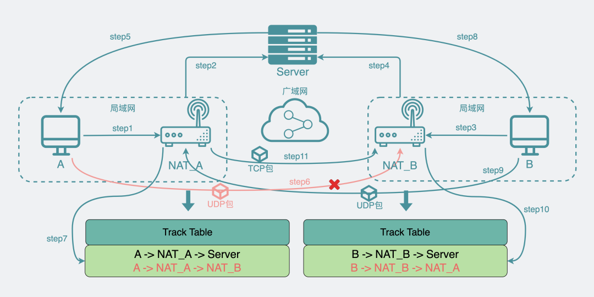

这里估计大家会有疑惑。

端口已经被 UDP 用过了，TCP 再用，那岂不是端口重复占用（`address already in use`）？

其实并不会，端口重复占用的报错常见于两个 TCP 连接在不使用`SO_REUSEADDR`的情况下，重复使用了某个 IP 端口。而 UDP 和 TCP 之间却不会报这个错。之所以会有这个错，主要是因为在一个linux内核中，内核收到网络数据时，会通过五元组（传输协议，源 IP，目的 IP，源端口，目的端口）去唯一确定数据接受者。当五元组都一模一样的时候，内核就不知道该把数据发给谁。而 UDP 和 TCP 之间"传输协议"不同，因此五元组也不同，所以也就不会有上面的问题。


NAPT 还分为好多种类型，上面的 NAT 打洞方案，都能成功吗？

关于 NAPT，确实还细分为好几种类型。我们现在常见的都是锥形 NAT。上面的打洞方案适用于大部分场景，这其中包括限制最多的端口受限锥形 NAT。

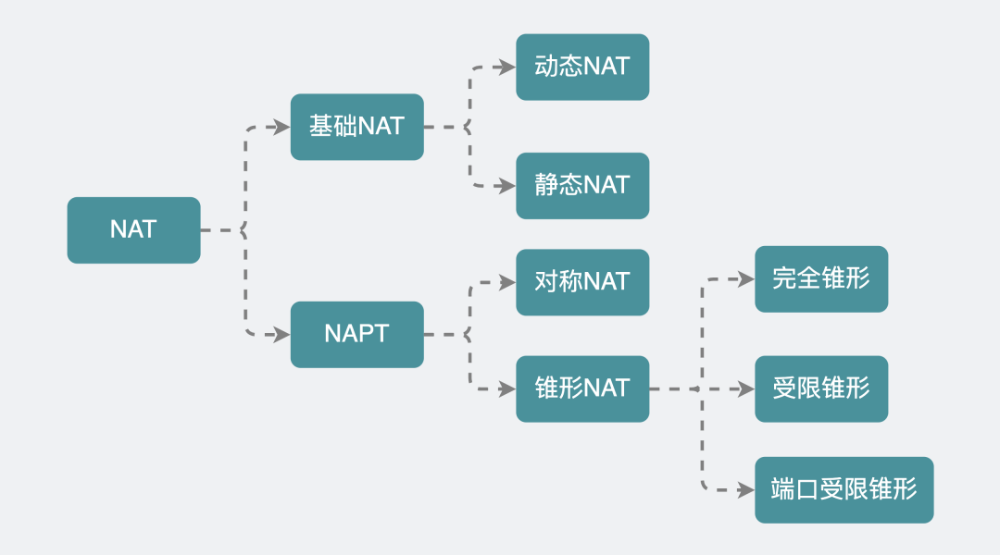

## 实战
### 基本 NAT 实验
#### 实验拓扑图

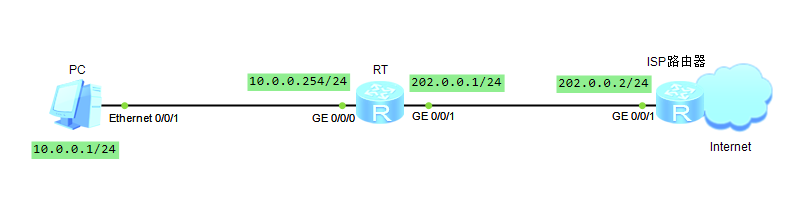

#### 实验要求
PC 通过公网地址访问互联网

#### 实验步骤
根据接口 IP 地址表，配置各个设备的接口地址。

| 设备  | 子接口            | IP地址          | 网关         |
|-----|----------------|---------------|------------|
| PC  | Ethernet 0/0/1 | 10.0.0.1/24   | 10.0.0.254 |
| RT  | GE 0/0/0       | 10.0.0.254/24 |            |
| RT  | GE 0/0/1       | 202.0.0.1/24  |            |
| ISP | GE 0/0/1       | 202.0.0.2/24  |            |

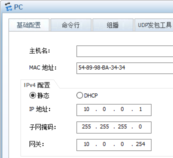

```shell
# RT配置
[RT]interface GigabitEthernet 0/0/0
[RT-GigabitEthernet0/0/0]ip address 10.0.0.254 24
[RT-GigabitEthernet0/0/0]quit
[RT]interface GigabitEthernet 0/0/1
[RT-GigabitEthernet0/0/1]ip address 202.0.0.1 24
[RT-GigabitEthernet0/0/1]quit
[RT]display ip interface brief 
*down: administratively down
^down: standby
(l): loopback
(s): spoofing
The number of interface that is UP in Physical is 3
The number of interface that is DOWN in Physical is 1
The number of interface that is UP in Protocol is 3
The number of interface that is DOWN in Protocol is 1

Interface                         IP Address/Mask      Physical   Protocol  
GigabitEthernet0/0/0              10.0.0.254/24        up         up        
GigabitEthernet0/0/1              202.0.0.1/24         up         up        
GigabitEthernet0/0/2              unassigned           down       down      
NULL0                             unassigned           up         up(s)     
```
```shell
# ISP配置
[ISP]interface GigabitEthernet 0/0/1
[ISP-GigabitEthernet0/0/1]ip address 202.0.0.2 24
[ISP-GigabitEthernet0/0/1]quit
[ISP]display ip interface brief
*down: administratively down
^down: standby
(l): loopback
(s): spoofing
The number of interface that is UP in Physical is 2
The number of interface that is DOWN in Physical is 2
The number of interface that is UP in Protocol is 2
The number of interface that is DOWN in Protocol is 2

Interface                         IP Address/Mask      Physical   Protocol  
GigabitEthernet0/0/0              unassigned           down       down      
GigabitEthernet0/0/1              202.0.0.2/24         up         up        
GigabitEthernet0/0/2              unassigned           down       down      
NULL0                             unassigned           up         up(s)  
```
在 RT 上配置 NAT 配置。
```shell
[RT]nat ?
  address-group    IP address-group of NAT
  alg              Application level gateway
  dns-map          DNS mapping
  filter-mode      NAT filter mode
  link-down        Link down reset session function
  mapping-mode     NAT mapping mode
  overlap-address  Overlap address pool to temp address pool map
  static           Specify static NAT
[RT]interface GigabitEthernet 0/0/1
[RT-GigabitEthernet0/0/1]nat ?
  outbound  Specify net address translation
  server    Specify NAT server
  static    Specify static NAT
[RT-GigabitEthernet0/0/1]nat static ?
  enable    Enable function
  global    Specify global information of NAT
  protocol  Specify protocol
# 接口视图下配置静态NAT
# nat static global{ global-address} inside {host-address }
# global参数用于配置外部公有地址，inside参数用于配置内部私有地址
[RT-GigabitEthernet0/0/1]nat static global 202.0.0.3 inside 10.0.0.1
[RT-GigabitEthernet0/0/1]quit
[RT]ip route-static 0.0.0.0 0 202.0.0.2
[RT]display nat static
  Static Nat Information:
  Interface  : GigabitEthernet0/0/1
    Global IP/Port     : 202.0.0.3/---- 
    Inside IP/Port     : 10.0.0.1/----
    Protocol : ----     
    VPN instance-name  : ----                            
    Acl number         : ----
    Netmask  : 255.255.255.255 
    Description : ----

  Total :    1
```
配置基本 NAT 只需要一条命令：把私有 IP 地址转换成公网 IP 地址，在接口视图下配置`nat static global global-address inside host-address`命令。默认路由是网关路由器上的常见配置。使用`display nat static`命令查看 RT 上的静态 NAT 配置。

在 PC 上验证联网功能。

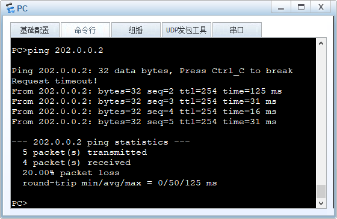

抓包查看 NAT 转换效果。分别抓包 RT 的内网口`G0/0/0`和外网口`G0/0/1`的报文，看出发送的`Echo Request`报文和接收的`Echo Reply`报文都有进行 NAT 转换。

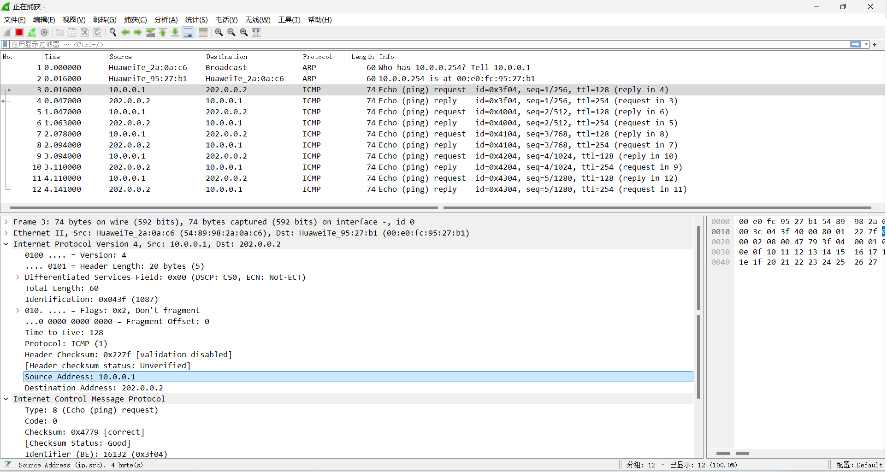

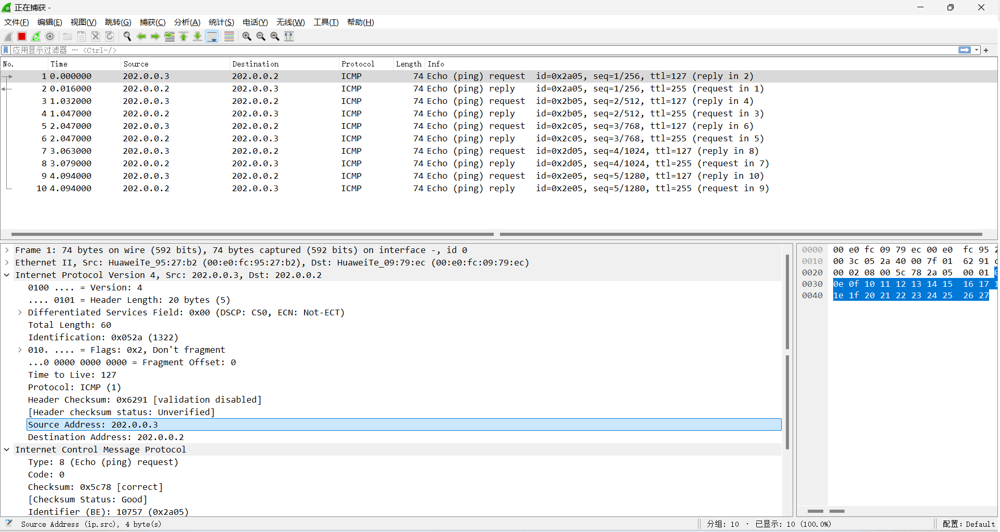

### NAPT 实验
#### 实验拓扑图

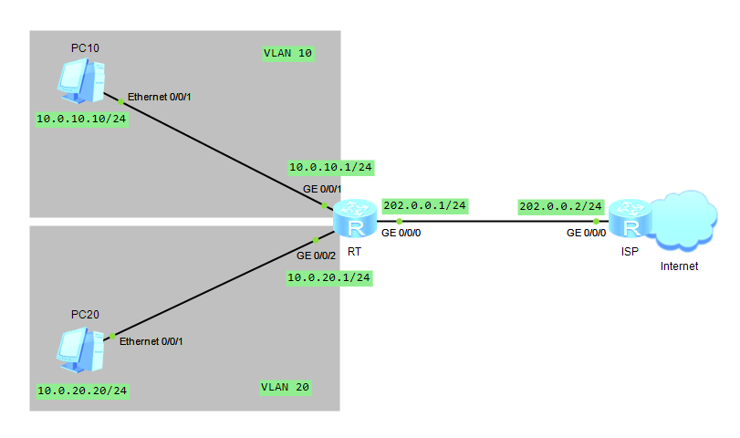

#### 实验要求
* RT 使用 NAPT 功能
* ISP 分配 4 个可用的公网地址：`202.0.0.3~202.0.0.6`
* VLAN 10 的用户使用两个公网地址
* VLAN 20 的用户使用另外两个公网地址

#### 实验步骤
根据接口 IP 地址表，配置各个设备的接口地址。配置命令可参考上一个实验步骤 1。

| 设备   | 子接口            | IP地址          | 网关        |
|------|----------------|---------------|-----------|
| PC10 | Ethernet 0/0/1 | 10.0.10.10/24 | 10.0.10.1 |
| PC20 | Ethernet 0/0/1 | 10.0.20.20/24 | 10.0.20.1 |
| RT   | GE 0/0/0       | 202.0.0.1/24  |           |
| RT   | GE 0/0/1       | 10.0.10.1/24  |           |
| RT   | GE 0/0/2       | 10.0.20.1/24  |           |
| ISP  | GE 0/0/0       | 202.0.0.2/24  |           |

在 RT 上配置 NAPT 配置。
```shell
[RT]acl 2010
[RT-acl-basic-2010]rule permit source 10.0.10.0 0.0.0.255
[RT-acl-basic-2010]quit
[RT]acl 2020
[RT-acl-basic-2020]rule permit source 10.0.20.0 0.0.0.255
[RT-acl-basic-2020]quit
# 创建地址池
# nat address-group group-index start-address end-address
# 配置公有地址范围，其中group-index为地址池编号，start-address、end-address分别为地址池起始地址、结束地址
[RT]nat address-group 1 202.0.0.3 202.0.0.4
[RT]nat address-group 2 202.0.0.5 202.0.0.6
[RT]interface GigabitEthernet 0/0/0
[RT-GigabitEthernet0/0/0]nat outbound ?
  INTEGER<2000-3999>  Apply basic or advanced ACL

[RT-GigabitEthernet0/0/0]nat outbound 2010 address-group 1 ?
  no-pat  Not use PAT
  <cr>    Please press ENTER to execute command 
# 接口下关联ACL与地址池进行动态地址转换，no-pat参数指定不进行端口转换
[RT-GigabitEthernet0/0/0]nat outbound 2010 address-group 1
[RT-GigabitEthernet0/0/0]nat outbound 2020 address-group 2
[RT-GigabitEthernet0/0/0]quit 
[RT]ip route-static 0.0.0.0 0 202.0.0.2
[RT]display nat address-group 

 NAT Address-Group Information:
 --------------------------------------
 Index   Start-address      End-address
 --------------------------------------
 1           202.0.0.3        202.0.0.4
 2           202.0.0.5        202.0.0.6
 --------------------------------------
  Total : 2
[RT]display nat outbound 
 NAT Outbound Information:
 --------------------------------------------------------------------------
 Interface                     Acl     Address-group/IP/Interface      Type
 --------------------------------------------------------------------------
 GigabitEthernet0/0/0         2010                              1       pat
 GigabitEthernet0/0/0         2020                              2       pat
 --------------------------------------------------------------------------
  Total : 2
```
在 NAPT 的配置中，使用基本 ACL 来指定私有 IP 地址范围。ACL 2010 指定 VLAN 10 的 IP 地址空间，ACL 2020 指定 VLAN 20 的 IP 地址空间。使用`nat address-group group-index start-address end-address`命令指定公网 IP 地址范围，分别指定了两个 NAT 地址组，编号分别选择了 1 和 2。在外网接口上，使用`nat outbound acl-number address-group group-index`，绑定 NAT 转换关系。

使用`display nat address-group`命令查看 RT 上的 NAT 地址组配置。命令`display nat outbound`查看出方向 NAT 的转换关系。

分别在 PC10 和 PC20 上验证上网功能。

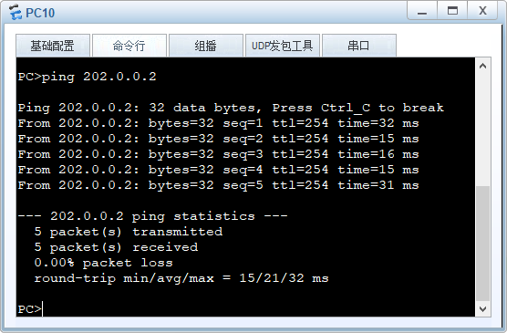


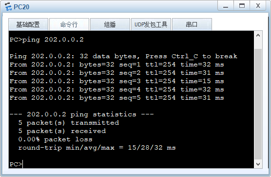

抓包查看 NAT 转换效果。分别抓包 RT 的内网口`G0/0/1`和外网口`G0/0/0`的报文，查看 VLAN 10 的用户出发送的`Echo Request`报文和接收的`Echo Reply`报文都有进行 NAT 转换。

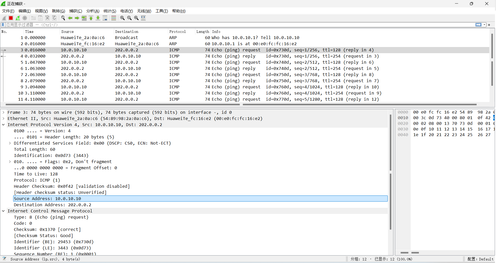

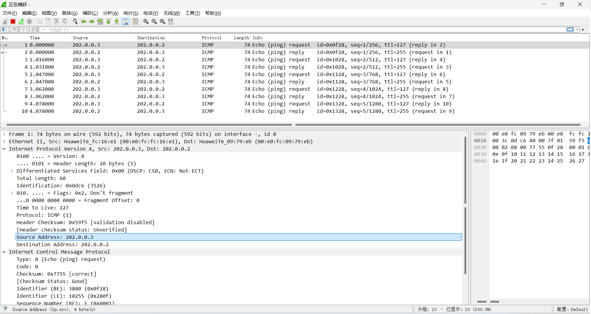

### EasyIP 实验
#### 实验拓扑图


#### 实验要求
* RT 使用 Easy IP 功能，让内网所有地址通过`202.0.0.1`访问公网

#### 实验步骤
```shell
[RT]acl 2010
[RT-acl-basic-2010]rule permit source 10.0.0.0 0.0.255.255
[RT-acl-basic-2010]quit
[RT]interface GigabitEthernet 0/0/1
[RT-GigabitEthernet0/0/1]nat outbound 2010
```
### 其它常用 NAT 命令
NAT Server 是在接口视图下配置，命令格式为：
```shell
nat server protocol { tcp|udp } global global-address global-port inside host-address host-port
```
检查 NAT Server 配置信息命令：`display nat server`。

检查 NAT 会话命令：`display nat session all`。

启动 NAT ALG 功能命令：`nat alg all enable`。

查看 NAT ALG 功能命令：`display nat alg`。
