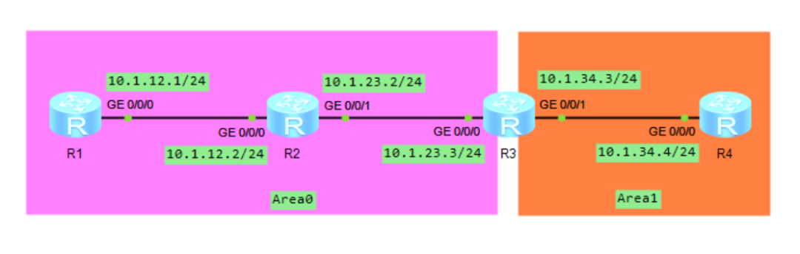

## OSPF 基础命令
掌握三条命令，就能玩转 OSPF：
* 创建 OSPF 进程，进入配置视图
* 创建 OSPF 区域
* 接口激活 OSPF

### 创建 OSPF 进程
在系统视图下，使用 OSPF 命令，创建 OSPF 进程。
```shell
[Router]ospf 1 Router-id 1.1.1.1
```
上面的命令，是在`Router`上创建`Process-ID`为 1 的 OSPF 进程，并进入配置视图。使用的`Router-ID`是`1.1.1.1`。

`Process-ID`是可选参数，表示 OSPF 进程的编号，只在设备本身生效，也就是说，两台设备建立 OSPF 邻居时，不要求双方的`Process-ID`一样。如果不指定`Process-ID`，会分配一个默认值作为`Process-ID`。

`router-id`也是可选参数，用来指定设备的`Router-ID`。通常，手动配置`Router-ID`，不会使用默认值。
### 创建 OSPF 区域
创建完 OSPF 进程后，就需要创建 OSPF 区域。在配置视图下，使用`area`命令创建区域，并指定区域 ID。
```shell
[Router]ospf 1 Router-id 1.1.1.1
[Router-ospf-1]area 1
```
在 OSPF 进程 1 中，创建`Area1`。
### 接口激活 OSPF
默认状态下，所有接口都没有激活 OSPF，要在接口激活 OSPF，有两种方法：
#### 在区域视图激活 OSPF
在区域视图下，使用`network`命令，再加上 IP 地址和通配符掩码，满足条件的接口激活 OSPF。
```
[Router]ospf 1 Router-id 1.1.1.1
[Router-ospf-1]area 0
[Router-ospf-1-area-0.0.0.0]network 192.168.1.0 0.0.0.255
```
举个栗子：`network 192.168.1.0 0.0.0.255`，IP 地址是`192.168.1.0`，通配符掩码是`0.0.0.255`。通配符掩码中，比特位为 0 的需要匹配，比特位为 1 的不需要匹配。命令中匹配的 IP 地址是`192.168.1.0`至`192.168.1.255`。


计算方法是，把`192.168.1.0`用二进制表示，把通配符掩码`0.0.0.255`也换算成二进制，每个比特位对应。前 24 位全为 0，后 8 位全为 1。匹配的 IP 地址，以`192.168.1`开头，后面是 0 至 255 的任意值。接口 IP 地址在这个范围内，且 IP 地址掩码长度大于或等于`network`命令的 0 比特位数，就在接口上激活 OSPF。

有两个特殊的`network`命令，一个是`network x.x.x.x 0.0.0.0`，比如`network 192.168.1.1 0.0.0.0`，IP 地址是`192.168.1.1`的接口激活 OSPF，无论网络掩码长度多少。另一个是`network 0.0.0.0 255.255.255.255`，匹配任意 IP 地址，所有配置了 IP 地址的接口，都会激活 OSPF。
#### 在指定接口激活 OSPF
上面的方法，可以使用一条命令，在多个接口激活 OSPF。另一个方法就是在指定接口激活 OSPF。先创建 OSPF 进程和区域，然后进入接口视图，使用`ospf enable`命令激活。
```shell
[Router]ospf 1 Router-id 1.1.1.1 #创建OSPF进程
[Router-ospf-1]area 0 #创建Area0
[Router-ospf-1-area-0.0.0.0]quit
[Router-ospf-1]quit
[Router]interface GigabitEthernet 0/0 #进入GE0/0接口视图
[Router-GigabitEthernet0/0]ospf enable 1 area 0 #激活OSPF
```
## OSPF 单区域实验


路由器 RT1 的两个接口分别连接`172.16.1.0/24`和`172.16.2.0/24`网段，另一个接口连接路由器 RT2。RT2 创建`Loopback`接口，配置 IP 地址`172.16.255.2/24`，模拟 RT2 的直连网段。在 RT1 和 RT2 上运行 OSPF，让 PC 可以访问全部网段。

RT1 配置：
```shell
<Huawei>system-view 	
[Huawei]sysname RT1
[RT1]interface GigabitEthernet 0/0/0
[RT1-GigabitEthernet0/0/0]ip address 172.16.1.254 24
[RT1-GigabitEthernet0/0/0]quit
[RT1]interface GigabitEthernet 0/0/1
[RT1-GigabitEthernet0/0/1]ip address 172.16.2.254 24
[RT1-GigabitEthernet0/0/1]quit
[RT1]interface GigabitEthernet 0/0/2
[RT1-GigabitEthernet0/0/2]ip address 172.16.12.1 30
[RT1-GigabitEthernet0/0/2]quit
[RT1]ospf 1 router-id 1.1.1.1
[RT1-ospf-1]area 0
[RT1-ospf-1-area-0.0.0.0]network 172.16.1.0 0.0.0.255
[RT1-ospf-1-area-0.0.0.0]network 172.16.2.0 0.0.0.255
[RT1-ospf-1-area-0.0.0.0]network 172.16.12.0 0.0.0.3
```
RT2 配置：
```shell
<Huawei>system-view 
[Huawei]sysname RT2
[RT2]interface GigabitEthernet 0/0/2
[RT2-GigabitEthernet0/0/2]ip address 172.16.12.2 30
[RT2-GigabitEthernet0/0/2]quit
[RT2]interface LoopBack 0
[RT2-LoopBack0]ip address 172.16.255.2 24
[RT2-LoopBack0]quit
[RT2]ospf 1 router-id 2.2.2.2
[RT2-ospf-1]area 0
[RT2-ospf-1-area-0.0.0.0]network 172.16.12.0 0.0.0.3
[RT2-ospf-1-area-0.0.0.0]network 172.16.255.0 0.0.0.255
```
配置完成后，RT1 和 RT2 建立邻接关系，交换 LSA。查看 RT1 的邻居表：
```shell
[RT1]display ospf ?
  INTEGER<1-65535>    Process ID
  abr-asbr            Information of the OSPF ABR and ASBR
  asbr-summary        Information of aggregate addresses for OSPF(only for ASBR)
  bfd                 Bidirectional forwarding detection
  brief               Brief information of OSPF processes
  cumulative          Statistics information
  error               Error information
  global-statistics   OSPF global statistics
  graceful-restart    Display GR information
  interface           Interface information
  ldp-sync            LDP-OSPF synchronization Information
  lsdb                Link state database
  mesh-group          Detail information for Mesh-Group
  mpls-te             Traffic engineering function
  nexthop             Nexthop information
  peer                A neighbor router
  request-queue       Link state request list
  retrans-queue       Link state retransmission list
  routing             OSPF route table
  sham-link           Sham Link
  spf-statistics      Statistics of SPF calculation
  statistics          Statistics information
  traffic-adjustment  Traffic adjustment feature
  vlink               Virtual link information
[RT1]display ospf peer

	 OSPF Process 1 with Router ID 1.1.1.1
		 Neighbors 

 Area 0.0.0.0 interface 172.16.12.1(GigabitEthernet0/0/2)'s neighbors
 Router ID: 2.2.2.2          Address: 172.16.12.2     
   State: Full  Mode:Nbr is  Master  Priority: 1
   DR: 172.16.12.1  BDR: 172.16.12.2  MTU: 0    
   Dead timer due in 37  sec 
   Retrans timer interval: 5 
   Neighbor is up for 00:00:24     
   Authentication Sequence: [ 0 ] 
```
邻接表中，RT1 在`Area0`发现邻居，`Router-ID`是`2.2.2.2`，接口 IP 地址是`172.16.12.2`，邻居状态是`Full`，对端是`Master`。

再看 RT1 的 OSPF 路由表：
```text
[RT1]display ospf routing ?
  IP_ADDR<X.X.X.X>  Destination IP Address
  interface         Interface information
  nexthop           Nexthop
  router-id         Router type route
  |                 Matching output
  <cr>              Please press ENTER to execute command 
[RT1]display ospf routing 

	 OSPF Process 1 with Router ID 1.1.1.1
		  Routing Tables 

 Routing for Network 
 Destination        Cost  Type       NextHop         AdvRouter       Area
 172.16.1.0/24      1     Stub       172.16.1.254    1.1.1.1         0.0.0.0
 172.16.2.0/24      1     Stub       172.16.2.254    1.1.1.1         0.0.0.0
 172.16.12.0/30     1     Transit    172.16.12.1     1.1.1.1         0.0.0.0
 172.16.255.2/32    1     Stub       172.16.12.2     2.2.2.2         0.0.0.0

 Total Nets: 4  
 Intra Area: 4  Inter Area: 0  ASE: 0  NSSA: 0 
```
命令`display ospf routing`，是查看 OSPF 路由表，并不是路由器的全局路由器。这些 OSPF 路由表能否加载到全局路由表，还要看路由表优先级等因素。这里发现 R2 的`Loopback0`接口路由，是一条主机路由，实际上，`Loopback0`接口的掩码长度是 24，而不是 32。这是因为 OSPF 把`Loopback`接口作为末梢网络，无论实际掩码是多少，`Type-1 LSA`中，都以`255.255.255.255`进行通告。

查看 RT2 的`Type-1 LSA`：
```shell
[RT2]display ospf lsdb ?
  age               Only display the LSAs that age in the scope
  asbr              ASBR summary link states
  ase               AS external link states
  brief             Database summary
  network           Network link states
  nssa              NSSA external link states
  opaque-area       Opaque area link states
  opaque-as         Opaque AS link states
  opaque-link       Opaque Link-Local link states
  originate-router  Advertising router link states
  router            Router link states
  self-originate    Self-originated link states
  summary           Network summary link states
  |                 Matching output
  <cr>              Please press ENTER to execute command 
[RT2]display ospf lsdb router 2.2.2.2

	 OSPF Process 1 with Router ID 2.2.2.2
		         Area: 0.0.0.0
		 Link State Database 


  Type      : Router
  Ls id     : 2.2.2.2
  Adv rtr   : 2.2.2.2  
  Ls age    : 777 
  Len       : 48 
  Options   :  E  
  seq#      : 80000008 
  chksum    : 0x696f
  Link count: 2
   * Link ID: 172.16.12.1  
     Data   : 172.16.12.2  
     Link Type: TransNet     
     Metric : 1
   * Link ID: 172.16.255.2 
     Data   : 255.255.255.255 
     Link Type: StubNet      
     Metric : 0 
     Priority : Medium
```
如果希望 RT2 的`Type-1 LSA`描述`Loopback`接口的实际掩码信息，可以把接口的网络类型改成`Broadcast`或 NBMA，比如：
```shell
[RT2]interface LoopBack 0
[RT2-LoopBack0]ospf network-type broadcast
```
再看 RT2 的 `Type-1 LSA`：
```shell
[RT2]display ospf lsdb router 2.2.2.2

	 OSPF Process 1 with Router ID 2.2.2.2
		         Area: 0.0.0.0
		 Link State Database 


  Type      : Router
  Ls id     : 2.2.2.2
  Adv rtr   : 2.2.2.2  
  Ls age    : 16 
  Len       : 48 
  Options   :  E  
  seq#      : 8000000a 
  chksum    : 0x399f
  Link count: 2
   * Link ID: 172.16.12.1  
     Data   : 172.16.12.2  
     Link Type: TransNet     
     Metric : 1
   * Link ID: 172.16.255.0 
     Data   : 255.255.255.0 
     Link Type: StubNet      
     Metric : 0 
     Priority : Low
```
RT2 以实际掩码信息通告`Loopback0`接口。现在看下 RT1 的路由表中 OSPF 路由：
```shell
[RT1]display ip routing-table protocol ospf
Route Flags: R - relay, D - download to fib
------------------------------------------------------------------------------
Public routing table : OSPF
         Destinations : 1        Routes : 1        

OSPF routing table status : <Active>
         Destinations : 1        Routes : 1

Destination/Mask    Proto   Pre  Cost      Flags NextHop         Interface

   172.16.255.0/24  OSPF    10   1           D   172.16.12.2     GigabitEthernet0/0/2

OSPF routing table status : <Inactive>
         Destinations : 0        Routes : 0
```
RT1 把`172.16.255.0/24`网段加载到路由表。同时，RT2 也获得到达`172.16.1.0/24`和`172.16.2.0/24`的路由。这样 PC 就能访问网络中的各个网段。
```shell
[RT2]display ip routing-table protocol ospf
Route Flags: R - relay, D - download to fib
------------------------------------------------------------------------------
Public routing table : OSPF
         Destinations : 2        Routes : 2        

OSPF routing table status : <Active>
         Destinations : 2        Routes : 2

Destination/Mask    Proto   Pre  Cost      Flags NextHop         Interface

     172.16.1.0/24  OSPF    10   2           D   172.16.12.1     GigabitEthernet0/0/2
     172.16.2.0/24  OSPF    10   2           D   172.16.12.1     GigabitEthernet0/0/2

OSPF routing table status : <Inactive>
         Destinations : 0        Routes : 0
```
## Silent-Interface


上个实验的拓扑图中，RT1 的`GE0/0/0`和`GE0/0/1`接口连接终端网段，只有终端 PC，没有 OSPF 路由器。然而，接口已经激活了 OSPF，会周期性的发送`Hello`报文，但是 PC 无法识别、也不需要识别`Hello`报文。这时，可以把 RT1 的`GE0/0/0`和`GE0/0/1`配置成静默接口（`Silent-Interface`），接口就会禁止收发`Hello`报文。

RT1 的配置：
```shell
[RT1]ospf 1
[RT1-ospf-1]silent-interface GigabitEthernet 0/0/0
[RT1-ospf-1]silent-interface GigabitEthernet 0/0/1
```
虽然两个接口指定为`Silent-Interface`，但是已经使用`network`命令激活 OSPF，因此 RT2 还是能通过 OSPF 学习到这两个接口网段的路由。
```shell
[RT1-ospf-1]display ospf brief 

	 OSPF Process 1 with Router ID 1.1.1.1
		 OSPF Protocol Information

 RouterID: 1.1.1.1          Border Router: 
 Multi-VPN-Instance is not enabled
 Global DS-TE Mode: Non-Standard IETF Mode
 Graceful-restart capability: disabled
 Helper support capability  : not configured
 Applications Supported: MPLS Traffic-Engineering 
 Spf-schedule-interval: max 10000ms, start 500ms, hold 1000ms
 Default ASE parameters: Metric: 1 Tag: 1 Type: 2
 Route Preference: 10 
 ASE Route Preference: 150 
 SPF Computation Count: 13    
 RFC 1583 Compatible
 Retransmission limitation is disabled
 Area Count: 1   Nssa Area Count: 0 
 ExChange/Loading Neighbors: 0
 Process total up interface count: 3
 Process valid up interface count: 3
 
 Area: 0.0.0.0          (MPLS TE not enabled)
 Authtype: None   Area flag: Normal
 SPF scheduled Count: 13    
 ExChange/Loading Neighbors: 0
 Router ID conflict state: Normal
 Area interface up count: 3

 Interface: 172.16.1.254 (GigabitEthernet0/0/0)
 Cost: 1       State: DR        Type: Broadcast    MTU: 1500  
 Priority: 1
 Designated Router: 172.16.1.254
 Backup Designated Router: 0.0.0.0
 Timers: Hello 10 , Dead 40 , Poll  120 , Retransmit 5 , Transmit Delay 1 
 Silent interface, No hellos

 Interface: 172.16.2.254 (GigabitEthernet0/0/1)
 Cost: 1       State: DR        Type: Broadcast    MTU: 1500  
 Priority: 1
 Designated Router: 172.16.2.254
 Backup Designated Router: 0.0.0.0
 Timers: Hello 10 , Dead 40 , Poll  120 , Retransmit 5 , Transmit Delay 1 
 Silent interface, No hellos

 Interface: 172.16.12.1 (GigabitEthernet0/0/2)
 Cost: 1       State: DR        Type: Broadcast    MTU: 1500  
 Priority: 1
 Designated Router: 172.16.12.1
 Backup Designated Router: 172.16.12.2
 Timers: Hello 10 , Dead 40 , Poll  120 , Retransmit 5 , Transmit Delay 1 
```
## OSPF 多区域实验


RT1 和 RT2 是两台汇聚交换机，各自下挂两个终端网段，同时上连核心交换机 RT3。在三台路由器上部署 OSPF，使用多区域 OSPF 的设计，实现全网各个网段的数据互通。

RT1 的配置：
```bash
<Huawei>system-view 
[Huawei]sysname RT1
[RT1]interface GigabitEthernet 0/0/0
[RT1-GigabitEthernet0/0/0]ip address 172.16.0.1 30
[RT1-GigabitEthernet0/0/0]quit 
[RT1]interface GigabitEthernet 0/0/1
[RT1-GigabitEthernet0/0/1]ip address 172.16.1.254 24
[RT1-GigabitEthernet0/0/1]quit 
[RT1]interface GigabitEthernet 0/0/2
[RT1-GigabitEthernet0/0/2]ip address 172.16.2.254 24
[RT1-GigabitEthernet0/0/2]quit
[RT1]ospf 1 router-id 1.1.1.1
[RT1-ospf-1]area 1
[RT1-ospf-1-area-0.0.0.1]network 172.16.1.0 0.0.0.255
[RT1-ospf-1-area-0.0.0.1]network 172.16.2.0 0.0.0.255
[RT1-ospf-area-0.0.0.1]quit
[RT1-ospf-1]area 0
[RT1-ospf-1-area-0.0.0.0]network 172.16.0.0 0.0.0.3
```
RT2 的配置：
```shell
<Huawei>system-view 
[Huawei]sysname RT2
[RT2]interface GigabitEthernet 0/0/0
[RT2-GigabitEthernet0/0/0]ip address 172.16.0.5 30
[RT2-GigabitEthernet0/0/0]quit 
[RT2]interface GigabitEthernet 0/0/1
[RT2-GigabitEthernet0/0/1]ip address 172.16.9.254 24
[RT2-GigabitEthernet0/0/1]quit
[RT2]interface GigabitEthernet 0/0/2
[RT2-GigabitEthernet0/0/2]ip address 172.16.10.254 24
[RT2-GigabitEthernet0/0/2]quit 
[RT2]ospf 1 router-id 2.2.2.2
[RT2-ospf-1]area 2
[RT2-ospf-1-area-0.0.0.2]network 172.16.9.0 0.0.0.255
[RT2-ospf-1-area-0.0.0.2]network 172.16.10.0 0.0.0.255
[RT2-ospf-1-area-0.0.0.2]quit
[RT2-ospf-1]area 0
[RT2-ospf-1-area-0.0.0.0]network 172.16.0.4 0.0.0.3
```
RT3 的配置：
```shell
<Huawei>system-view 
[Huawei]sysname RT3
[RT3]interface GigabitEthernet 0/0/1
[RT3-GigabitEthernet0/0/1]ip address 172.16.0.2  30
[RT3-GigabitEthernet0/0/1]quit
[RT3]interface GigabitEthernet 0/0/2
[RT3-GigabitEthernet0/0/2]ip address 172.16.0.6 30
[RT3-GigabitEthernet0/0/2]quit
[RT3]ospf 1 router-id 3.3.3.3
[RT3-ospf-1]area 0
[RT3-ospf-1-area-0.0.0.0]network 172.16.0.0 0.0.0.3
[RT3-ospf-1-area-0.0.0.0]network 172.16.0.4 0.0.0.3
```
查看 RT3 的 OSPF 邻居表：
```shell
[RT3]display ospf peer 

	 OSPF Process 1 with Router ID 3.3.3.3
		 Neighbors 

 Area 0.0.0.0 interface 172.16.0.2(GigabitEthernet0/0/1)'s neighbors
 Router ID: 1.1.1.1          Address: 172.16.0.1      
   State: Full  Mode:Nbr is  Slave  Priority: 1
   DR: 172.16.0.1  BDR: 172.16.0.2  MTU: 0    
   Dead timer due in 38  sec 
   Retrans timer interval: 5 
   Neighbor is up for 00:01:30     
   Authentication Sequence: [ 0 ] 

		 Neighbors 

 Area 0.0.0.0 interface 172.16.0.6(GigabitEthernet0/0/2)'s neighbors
 Router ID: 2.2.2.2          Address: 172.16.0.5      
   State: Full  Mode:Nbr is  Slave  Priority: 1
   DR: 172.16.0.5  BDR: 172.16.0.6  MTU: 0    
   Dead timer due in 38  sec 
   Retrans timer interval: 5 
   Neighbor is up for 00:01:11     
   Authentication Sequence: [ 0 ] 
```
RT3 和 RT1、RT2 建立的`FULL`的邻接关系，我们再看看 RT3 的路由表：
```shell
[RT3]display ip routing-table protocol ospf
Route Flags: R - relay, D - download to fib
------------------------------------------------------------------------------
Public routing table : OSPF
         Destinations : 4        Routes : 4        

OSPF routing table status : <Active>
         Destinations : 4        Routes : 4

Destination/Mask    Proto   Pre  Cost      Flags NextHop         Interface

     172.16.1.0/24  OSPF    10   2           D   172.16.0.1      GigabitEthernet0/0/1
     172.16.2.0/24  OSPF    10   2           D   172.16.0.1      GigabitEthernet0/0/1
     172.16.9.0/24  OSPF    10   2           D   172.16.0.5      GigabitEthernet0/0/2
    172.16.10.0/24  OSPF    10   2           D   172.16.0.5      GigabitEthernet0/0/2

OSPF routing table status : <Inactive>
         Destinations : 0        Routes : 0
```
`Area0`的路由器 RT3，已经学到了 RT1 和 RT2 下连的终端网段路由。这些路由都是区域间路由，根据 RT1 和 RT2 在`Area0`泛洪的`Type-3 LSA`计算得出，而 RT3 要计算到达`Area1`和`Area2`的区域间路由，除了这些网段的`Type-3 LSA`，还需要指定 ABR 的位置。作为 ABR，RT1 和 RT2 在泛洪`Type-1 LSA`时，会把 B 比特位设置为 1。因此，通过`Area0`内泛洪的`Type-1`、`Type-2 LSA`，RT3 能计算到达 ABR 的最佳路径。使用`display ospf abr-asbr`命令查看 ABR 和 ASBR 信息：
```shell
[RT3]display ospf abr-asbr 

	 OSPF Process 1 with Router ID 3.3.3.3
		 Routing Table to ABR and ASBR 

 RtType      Destination       Area       Cost  Nexthop         Type
 Intra-area  1.1.1.1           0.0.0.0    1     172.16.0.1      ABR 
 Intra-area  2.2.2.2           0.0.0.0    1     172.16.0.5      ABR 
```
在 RT1 和 RT2 上查看路由表，看到两台路由器都学到了全网的路由，RT1 和 RT2 下挂的 PC 就可以到达全网各个网段。
```shell
[RT1]display ip routing-table protocol ospf 
Route Flags: R - relay, D - download to fib
------------------------------------------------------------------------------
Public routing table : OSPF
         Destinations : 3        Routes : 3        

OSPF routing table status : <Active>
         Destinations : 3        Routes : 3

Destination/Mask    Proto   Pre  Cost      Flags NextHop         Interface

     172.16.0.4/30  OSPF    10   2           D   172.16.0.2      GigabitEthernet
0/0/0
     172.16.9.0/24  OSPF    10   3           D   172.16.0.2      GigabitEthernet
0/0/0
    172.16.10.0/24  OSPF    10   3           D   172.16.0.2      GigabitEthernet
0/0/0

OSPF routing table status : <Inactive>
         Destinations : 0        Routes : 0
```
```shell
[RT2]display ip routing-table protocol ospf 
Route Flags: R - relay, D - download to fib
------------------------------------------------------------------------------
Public routing table : OSPF
         Destinations : 3        Routes : 3        

OSPF routing table status : <Active>
         Destinations : 3        Routes : 3

Destination/Mask    Proto   Pre  Cost      Flags NextHop         Interface

     172.16.0.0/30  OSPF    10   2           D   172.16.0.6      GigabitEthernet
0/0/0
     172.16.1.0/24  OSPF    10   3           D   172.16.0.6      GigabitEthernet
0/0/0
     172.16.2.0/24  OSPF    10   3           D   172.16.0.6      GigabitEthernet
0/0/0

OSPF routing table status : <Inactive>
         Destinations : 0        Routes : 0

```
## OSPF Cost 值


R1 和 R2 连接到相同的一个网段：`192.168.100.0/24`，同时下连 R3。R1、R2、R3 都激活 OSPF，在相同的`Area`中，接口的`Cost`又是默认值，这时 R3 的路由表中，到达`192.168.100.0/24`会有两条等价路由：
```shell
[R3]display ip routing-table protocol ospf
Route Flags: R - relay, D - download to fib
------------------------------------------------------------------------------
Public routing table : OSPF
         Destinations : 1        Routes : 2        

OSPF routing table status : <Active>
         Destinations : 1        Routes : 2

Destination/Mask    Proto   Pre  Cost      Flags NextHop         Interface

  192.168.100.0/24  OSPF    10   2           D   192.168.0.2     GigabitEthernet0/0/1
                    OSPF    10   2           D   192.168.0.6     GigabitEthernet0/0/2

OSPF routing table status : <Inactive>
         Destinations : 0        Routes : 0
```
如果两条链路以主备方式工作，该如何实现呢？一个最简单的方法就是调整接口`Cost`值。比如把 R3 的`G0/0/2`接口`Cost`值调大，到达`192.168.100.0/24`的报文会转发给 R1，当 R1 故障时，R3 自动把流量切到 R2。

R3 的配置：
```shell
[R3]interface GigabitEthernet 0/0/2
[R3-GigabitEthernet0/0/2]ospf cost 100
```
查看接口参数：
```shell
[R3]display ospf interface GigabitEthernet 0/0/2

	 OSPF Process 1 with Router ID 3.3.3.3
		 Interfaces 


 Interface: 192.168.0.5 (GigabitEthernet0/0/2)
 Cost: 100     State: BDR       Type: Broadcast    MTU: 1500  
 Priority: 1
 Designated Router: 192.168.0.6
 Backup Designated Router: 192.168.0.5
 Timers: Hello 10 , Dead 40 , Poll  120 , Retransmit 5 , Transmit Delay 1 
```
再查看 R3 的路由表：
```shell
[R3]display ip routing-table protocol ospf
Route Flags: R - relay, D - download to fib
------------------------------------------------------------------------------
Public routing table : OSPF
         Destinations : 1        Routes : 1        

OSPF routing table status : <Active>
         Destinations : 1        Routes : 1

Destination/Mask    Proto   Pre  Cost      Flags NextHop         Interface

  192.168.100.0/24  OSPF    10   2           D   192.168.0.2     GigabitEthernet0/0/1

OSPF routing table status : <Inactive>
         Destinations : 0        Routes : 0
```
配置生效。
## OSPF 特殊区域


R1、R2、R3 运行 OSPF，R3 把自己的静态路由引入 OSPF，让域内的路由器学习到外部路由。
### 1、OSPF 基本配置
```shell
[R1]ospf 1 router-id 1.1.1.1
[R1-ospf-1]area 1
[R1-ospf-1-area-0.0.0.1]network 10.1.12.0 0.0.0.255
```
```shell
[R2]ospf 1 router-id 2.2.2.2
[R2-ospf-1]area 1
[R2-ospf-1-area-0.0.0.1]network 10.1.12.0 0.0.0.255
[R2-ospf-1-area-0.0.0.1]quit
[R2-ospf-1]area 0
[R2-ospf-1-area-0.0.0.0]network 10.1.23.0 0.0.0.255
```
```shell
[R3]ip route-static 10.3.1.0 24 NULL 0
[R3]ip route-static 10.3.2.0 24 NULL 0
[R3]ospf 1 router-id 3.3.3.3
[R3-ospf-1]area 0
[R3-ospf-1-area-0.0.0.0]network 10.1.23.0 0.0.0.255
[R3-ospf-1-area-0.0.0.0]quit
[R3-ospf-1]import-route static
```
观察 R1 的路由表：
```shell
[R1]display ip routing-table protocol ospf 
Route Flags: R - relay, D - download to fib
------------------------------------------------------------------------------
Public routing table : OSPF
         Destinations : 3        Routes : 3        

OSPF routing table status : <Active>
         Destinations : 3        Routes : 3

Destination/Mask    Proto   Pre  Cost      Flags NextHop         Interface

      10.1.23.0/24  OSPF    10   2           D   10.1.12.2       GigabitEthernet0/0/0
       10.3.1.0/24  O_ASE   150  1           D   10.1.12.2       GigabitEthernet0/0/0
       10.3.2.0/24  O_ASE   150  1           D   10.1.12.2       GigabitEthernet0/0/0

OSPF routing table status : <Inactive>
         Destinations : 0        Routes : 0
```
R1 学习到了区域间路由和外部路由，外部路由标记位`O_ASE（OSPF AS External）`。再看看 R1 的 LSDB：
```shell
[R1]display ospf lsdb 

	 OSPF Process 1 with Router ID 1.1.1.1
		 Link State Database 

		         Area: 0.0.0.1
 Type      LinkState ID    AdvRouter          Age  Len   Sequence   Metric
 Router    2.2.2.2         2.2.2.2            364  36    80000005       1
 Router    1.1.1.1         1.1.1.1            365  36    80000004       1
 Network   10.1.12.2       2.2.2.2            364  32    80000002       0
 Sum-Net   10.1.23.0       2.2.2.2            384  28    80000001       1
 Sum-Asbr  3.3.3.3         2.2.2.2            336  28    80000001       1
 

		 AS External Database
 Type      LinkState ID    AdvRouter          Age  Len   Sequence   Metric
 External  10.3.1.0        3.3.3.3            337  36    80000001       1
 External  10.3.2.0        3.3.3.3            337  36    80000001       1
```
R1 的 LSDB，有`Type-1、Type-2、Type-3、Type-4、Type-5 LSA`。`Type-3 LSA` 描述到达`10.1.23.0/24`的区域间路由。`Type-4 LSA`描述到达 ASBR，也就是 R3 的路由，是由 ABR R2 产生。`Type-5 LSA`描述外部路由`10.3.1.0/24`和`10.3.2.0/24`，并在整个 OSPF 域内泛洪，这时 R1 有到达各个网段的路由。

### 2、Area1 配置为 Stub 区域
先把 `Area1` 配置为`Stub`区域，R1 和 R2 的配置如下：
```shell
[Rl]ospf 1
[R1-ospf-1]area 1
[R1-ospf-1-area-0.0.0.1]stub
```
```shell
[R2]ospf 1
[R2-ospf-1]area 1
[R2-ospf-1-area-0.0.0.1]stub
```
某个区域为`Stub`区域，区域内的路由器都要配置成`Stub`区域，否则无法正确建立邻居关系。`Stub`区域的 ABR，即 R2，会阻挡`Type-4、Type-5 LSA`进入区域内，减少 LSA 泛洪的数量，从而减小路由表规模，降低设备负担。

现在 R1 无法学到 OSPF 外部路由，同时 R2 会下发一条用`Type-3 LSA`描述的外部路由，让`Area1`内的路由器访问域外的网络。观察 R1 的路由表和 LSDB：
```shell
[R1]display ip routing-table protocol ospf
Route Flags: R - relay, D - download to fib
------------------------------------------------------------------------------
Public routing table : OSPF
         Destinations : 2        Routes : 2        

OSPF routing table status : <Active>
         Destinations : 2        Routes : 2

Destination/Mask    Proto   Pre  Cost      Flags NextHop         Interface

        0.0.0.0/0   OSPF    10   2           D   10.1.12.2       GigabitEthernet0/0/0
      10.1.23.0/24  OSPF    10   2           D   10.1.12.2       GigabitEthernet0/0/0

OSPF routing table status : <Inactive>
         Destinations : 0        Routes : 0
```
```shell
[R1]display ospf lsdb

	 OSPF Process 1 with Router ID 1.1.1.1
		 Link State Database 

		         Area: 0.0.0.1
 Type      LinkState ID    AdvRouter          Age  Len   Sequence   Metric
 Router    2.2.2.2         2.2.2.2             37  36    80000005       1
 Router    1.1.1.1         1.1.1.1             41  36    80000005       1
 Network   10.1.12.2       2.2.2.2             37  32    80000002       0
 Sum-Net   0.0.0.0         2.2.2.2             82  28    80000001       1
 Sum-Net   10.1.23.0       2.2.2.2             82  28    80000001       1
```
R1 的路由表减少，不再有`Type-4`和`Type-5 LSA`，只有`Type-1、Type-2、Type-3 LSA`。
### 3、Area1 配置为 Totally-Stub 区域
如果要进一步减少 LSA 泛洪，可以把区域间的路由也阻挡。在上个实验的基础上，R2 配置如下：
```shell
[R2]ospf 1
[R2-ospf-1]area 1
[R2-ospf-1-area-0.0.0.1]stub no-summary
```
这时，R2 阻挡`Type-3、Type-4、Type-5 LSA`进入`Area1`，同时自动下发一条默认路由，使用`Type-3 LSA`描述。这样当 R1 访问区域外的网络时，就使用默认路由转发数据。

查看 R1 路由表和 LSDB：
```shell
[R1]display ip routing-table protocol ospf
Route Flags: R - relay, D - download to fib
------------------------------------------------------------------------------
Public routing table : OSPF
         Destinations : 1        Routes : 1        

OSPF routing table status : <Active>
         Destinations : 1        Routes : 1

Destination/Mask    Proto   Pre  Cost      Flags NextHop         Interface

        0.0.0.0/0   OSPF    10   2           D   10.1.12.2       GigabitEthernet0/0/0

OSPF routing table status : <Inactive>
         Destinations : 0        Routes : 0
```
```shell
[R1]display ospf lsdb

	 OSPF Process 1 with Router ID 1.1.1.1
		 Link State Database 

		         Area: 0.0.0.1
 Type      LinkState ID    AdvRouter          Age  Len   Sequence   Metric
 Router    2.2.2.2         2.2.2.2             12  36    80000006       1
 Router    1.1.1.1         1.1.1.1              6  36    8000000A       1
 Network   10.1.12.1       1.1.1.1              6  32    80000002       0
 Sum-Net   0.0.0.0         2.2.2.2            165  28    80000001       1
```
R1 路由表只有一条`0.0.0.0/0`的默认路由，极大简化了路由表。同时，R1 的 LSDB 也非常简洁。
### 4、Area1 配置为 NSSA


网络发生变化，`Area1`的 R1 连着一个外部路由，需要引入 OSPF，让域内路由器获得外部路由，但又希望保持`Stub`区域特性，那么可以把`Area1`配置为 NSSA。在上个实验的基础上，R1 配置：
```bash
[R1]ip route-static 10.1.1.0 24 NULL 0 #模拟外部路由
[R1]ospf 1
[Rl-ospf-l]area 1
[R1-ospf-1-area-0.0.0.1]undo stub
[R1-ospf-1-area-0.0.0.1]nssa
[R1-ospf-1-area-0.0.0.1]quit
[R1-ospf-1]import-route static
```
在 R1 创建静态路由，模拟成外部路由，先取消`Stub`配置，然后配置 NSSA，再把外部路由引入 OSPF。

R2 配置：
```shell
[R2]ospf 1
[R2-ospf-1]area 1
[R2-ospf-1-area-0.0.0.1]undo stub
[R2-ospf-1-area-0.0.0.1]nssa
```
某个区域配置为 NSSA，则区域内的所有路由器都要进行相应配置，否则建立邻居关系会出现问题。`Area1`区域成为 NSSA 后，会阻挡`Type-4、Type-5 LSA`进入区域。但是 ABR R2 会下发一条`Type-7 LSA`的默认路由，让区域内的路由器，通过默认路由到达域外网络。同时，会向`Area0`通告`Type-5 LSA`描述`10.1.1.0/24`路由，让 OSPF 其它区域的路由器都学习到这条路由。

查看 R1 的 LSDB：
```shell
[R1-ospf-1]display ospf lsdb

	 OSPF Process 1 with Router ID 1.1.1.1
		 Link State Database 

		         Area: 0.0.0.1
 Type      LinkState ID    AdvRouter          Age  Len   Sequence   Metric
 Router    2.2.2.2         2.2.2.2             21  36    80000004       1
 Router    1.1.1.1         1.1.1.1             18  36    80000007       1
 Network   10.1.12.1       1.1.1.1             19  32    80000002       0
 Sum-Net   10.1.23.0       2.2.2.2             29  28    80000001       1
 NSSA      10.1.1.0        1.1.1.1            133  36    80000001       1
 NSSA      0.0.0.0         2.2.2.2             29  36    80000001       1
```
R1 的 LSDB 中，有`Type-1、Type-2、Type-3、Type-7 LSA`，其中两条`Type-7 LSA`，一条是 R1 生成的，描述引入的外部路由`10.1.1.0/24`，另一条是 R2 生成的，是一条默认路由。再看看 R1 的路由表：
```shell
[R1]display ip routing-table protocol ospf
Route Flags: R - relay, D - download to fib
------------------------------------------------------------------------------
Public routing table : OSPF
         Destinations : 2        Routes : 2        

OSPF routing table status : <Active>
         Destinations : 2        Routes : 2

Destination/Mask    Proto   Pre  Cost      Flags NextHop         Interface

        0.0.0.0/0   O_NSSA  150  1           D   10.1.12.2       GigabitEthernet0/0/0
      10.1.23.0/24  OSPF    10   2           D   10.1.12.2       GigabitEthernet0/0/0

OSPF routing table status : <Inactive>
         Destinations : 0        Routes : 0
```
再看看 R3 的 LSDB:
```shell
[R3]display ospf lsdb 

	 OSPF Process 1 with Router ID 3.3.3.3
		 Link State Database 

		         Area: 0.0.0.0
 Type      LinkState ID    AdvRouter          Age  Len   Sequence   Metric
 Router    2.2.2.2         2.2.2.2            769  36    80000006       1
 Router    3.3.3.3         3.3.3.3           1673  36    80000004       1
 Network   10.1.23.2       2.2.2.2           1680  32    80000002       0
 Sum-Net   10.1.12.0       2.2.2.2            769  28    80000005       1
 

		 AS External Database
 Type      LinkState ID    AdvRouter          Age  Len   Sequence   Metric
 External  10.3.1.0        3.3.3.3           1673  36    80000001       1
 External  10.3.2.0        3.3.3.3           1673  36    80000001       1
 External  10.1.1.0        2.2.2.2            761  36    80000001       1
```
R3 有三条`Type-5 LSA`，其中两条是自己生成的，描述外部路由`10.3.1.0/24`和`10.3.2.0/24`，另一条是 R2 生成的，描述外部路由`10.1.1.0/24`。R2 把从 `Area1` 收到的 Type-7 LSA 转换成 `Type-5 LSA`，并通告到 `Area0` 中。查看 R3 路由表：
```shell
[R3]display ip routing-table protocol ospf 
Route Flags: R - relay, D - download to fib
------------------------------------------------------------------------------
Public routing table : OSPF
         Destinations : 2        Routes : 2        

OSPF routing table status : <Active>
         Destinations : 2        Routes : 2

Destination/Mask    Proto   Pre  Cost      Flags NextHop         Interface

       10.1.1.0/24  O_ASE   150  1           D   10.1.23.2       GigabitEthernet0/0/0
      10.1.12.0/24  OSPF    10   2           D   10.1.23.2       GigabitEthernet0/0/0

OSPF routing table status : <Inactive>
         Destinations : 0        Routes : 0
```
## 5、Area1 配置为 Totally NSSA
为了进一步减少`Area1`的 LSA，把`Area1`配置成 Totally NSSA 实现。在上个实验的基础上，R2 配置如下：
```shell
[R2]ospf 1
[R2-ospf-1]area 1
[R2-ospf-1-area-0.0.0.1]nssa no-summary
```
这样 `Area1` 内不会有`Type-3 LSA`泛洪，R1 也学不到区域间路由。

看下 R1 的 LSDB：
```shell
[R1]display ospf lsdb

	 OSPF Process 1 with Router ID 1.1.1.1
		 Link State Database 

		         Area: 0.0.0.1
 Type      LinkState ID    AdvRouter          Age  Len   Sequence   Metric
 Router    2.2.2.2         2.2.2.2              9  36    80000005       1
 Router    1.1.1.1         1.1.1.1              3  36    8000000C       1
 Network   10.1.12.1       1.1.1.1              3  32    80000002       0
 Sum-Net   0.0.0.0         2.2.2.2             14  28    80000001       1
 NSSA      10.1.1.0        1.1.1.1           1331  36    80000001       1
 NSSA      0.0.0.0         2.2.2.2             14  36    80000001       1
```
R1 的 LSDB 中，只有`Type-1、Type-2、Type-7 LSA`和一条描述的默认路由`Type-3 LSA`。当 NSSA 内同时存在`Type-3 LSA`和`Type-7 LSA`描述的默认路由时，路由器优先使用`Type-3 LSA`的默认路由，忽略`Type-7 LSA`的默认路由。
## Virtual Link


R1、R2、R3 运行 OSPF，规划两个区域`Area0`和`Area23`。R3 有两条路由到达`192.168.2.0/24`网段，因为 R3 不能使用非 0 区域的`Type-3 LSA`来计算区域间路由，因此无论路径的`Cost`如何，R3 都会选择 R1 到达目的网段。查看 R3 的 OSPF 路由表：


如果向让 R3 从 R2 到达`192.168.2.0/24`，即使用高带宽链路转发，一个简单的方法是，在 R2 和 R3 之间跨越`Area23`建立一条`Virtual Link`，通过这条`Virtual Link`，R2 直接把`Type-1 LSA`发送给 R3。

R2 配置如下：
```shell
[R2]ospf 1
[R2-ospf-1]area 23
[R2-ospf-1-area-0.0.0.23]vlink-peer 3.3.3.3
```
R3 配置如下：
```shell
[R3]ospf 1
[R3-ospf-1]area 23
[R3-ospf-1-area-0.0.0.23]vlink-peer 2.2.2.2
```
配置完成后，R2 和 R3 建立一条`Virtual Link`，`Virtual Link`穿过`Area23`，在 R3 查看`Virtual Link`信息：


`Virtual Link`建立完成后，状态为`Full`，Cost 为 1，再看下 R3 的 OSPF 路由表：


`192.168.2.0/24`路由的下一跳变成了`192.168.23.2`，说明到达这个网段的下一跳切换到了 R2，达到预期目标。

## OSPF 报文认证


OSPF 支持两种报文认证方式：区域认证和接口认证。R1、R2、R3、R4 运行 OSPF，`Area0` 开启区域认证，MD5 的验证方式，密码为`123456`。R3 和 R4 之间开启 OSPF 接口认证，使用明文的认证方式，密码为 `654321`。R1、R2、R3 的区域认证配置如下：
```shell
[R1]ospf 1
[R1-ospf-1]area 0
[R1-ospf-1-area-0.0.0.0]authentication-mode ?
  hmac-md5  Use HMAC-MD5 algorithm
  keychain  Keychain authentication mode
  md5       Use MD5 algorithm
  simple    Simple authentication mode
[R1-ospf-1-area-0.0.0.0]authentication-mode md5 ?
  INTEGER<1-255>  Key ID
  <cr>            Please press ENTER to execute command 
[R1-ospf-1-area-0.0.0.0]authentication-mode md5 1 ?
  STRING<1-255>/<20-392>  The password (key)
  cipher                  Encryption type (Cryptogram)
  plain                   Encryption type (Plain text)
[R1-ospf-1-area-0.0.0.0]authentication-mode md5 1 ci	
[R1-ospf-1-area-0.0.0.0]authentication-mode md5 1 cipher ?
  STRING<1-255>/<20-392>  The password (key)
[R1-ospf-1-area-0.0.0.0]authentication-mode md5 1 cipher 123456
```
```shell
[R2]ospf 1
[R2-ospf-1]area 0
[R2-ospf-1-area-0.0.0.0]authentication-mode md5 1 cipher 123456
```
```shell
[R3]ospf 1
[R3-ospf-1]area 0
[R3-ospf-1-area-0.0.0.0]authentication-mode md5 1 cipher 123456
```
R3、R4 激活接口认证配置：
```shell
[R3]interface GigabitEthernet 0/0/1
[R3-GigabitEthernet0/0/1]ospf authentication-mode simple ?
  STRING<1-8>/<32>  The password (key)
  cipher            Encryption type (Cryptogram)
  plain             Encryption type (Plain text)
  <cr>              Please press ENTER to execute command 
[R3-GigabitEthernet0/0/1]ospf authentication-mode simple cipher 654321
```
```shell
[R4]interface GigabitEthernet 0/0/0
[R4-GigabitEthernet0/0/0]ospf authentication-mode simple cipher 654321
```
接口认证优先级高于区域认证方式，如果同时配置两种认证方式，只有接口认证方式生效。命令中的`simple`关键字表示明文，即认证口令是明文保存在 OSPF 报文中，这样是不安全的，推荐使用 MD5 的方式。
## 其他常用命令
```shell
# 设置每次泛洪更新 LSA 的数量为 100
[R-ospf-1]flooding-control number 100

# 设置接口的网络类型
[R-GigabitEthernet0/0/0]ospf network-type broadcast

# 设置接口在选举 DR 时的优先级
[R-GigabitEthernet0/0/0]ospf dr-priority 8

# OSPF 引入外部路由
# 引入 RIP 进程 40 的路由，并设置外部路由类型为 Type 2，路由标记为 33，开销值为 50
[R-ospf-1]import-route rip 40 type 2 tag 33 cost 50

# 将缺省路由通告到 OSPF 区域
[R-ospf-1]default-route-advertise alaways

# 路由聚合
[R-ospf-1]abr-summary 10.2.0.0 255.255.0.0
[R-ospf-1]asbr-summary 10.2.0.0 255.255.0.0 not-advertise tag 2 cost 100

# 修改Hello间隔和路由器失效时间
[R]interface g0/0/0
[R-GigabitEthernet0/0/0]ospf timer hello 15
[R-GigabitEthernet0/0/0]ospf timer dead 45
```