## 路由汇总
网络规模越大，使用的网段也就越多，每台路由器需要维护的路由表也就越大，会增加路由器的资源消耗，直接影响路由器的性能。网络拓扑发生变化，会导致变更信息传播到全网。

在保障数据可达的前提下，有必要进行路由信息优化，那就是减少路由器的路由表规模，常见又有效的办法就是进行路由汇总。也就是把多条路由汇总成一条路由，减少路由表条目，优化路由器的资源消耗。汇总前的路由叫做明细路由，汇总后的路由叫做汇总路由。

为了让路由汇总更可控，OSPF 需要手动实施，不支持路由自动汇总。OSPF 有两种路由汇总方法，一种是部署在 ABR 上，另一种是部署在 ASBR 上。
### ABR 路由汇总

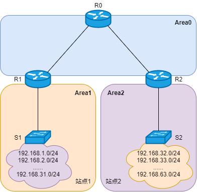

R0、R1、R2 构成 OSPF 网络的骨干区域，站点 1 和站点 2 分别是`Area1`和`Area2`。两个站点中，各有一台交换机，分别挂着多个网段，而且网段是有规律的。路由器 R0 通过 OSPF 知道了到达两个站点的所有明细路由，随着站点网段的增加，R0 的路由表会变得臃肿，这时就可以在 ABR 上对区域内的路由进行汇总，比如在`Area1`的 ABR，即 R1 上，对`Area1`内的路由进行汇总，汇总成 `192.168.0.0/19`，并只把这条汇总路由通告给`Area0`，这样 R0 和 R2 只会学到这条汇总路由，而不会学习到站点 1 内的明细路由。只要站点 1 内有一条有效的明细路由，R1 就会向`Area0`通告汇总路由，当所有的明细路由全部失效时，R1 就不会再向`Area0`通告汇总路由。同样，R2 进行路由汇总，汇总成`192.168.32.0/19`，并只通告汇总路由到`Area0`。这样 R0 就只会学习到站点 1 和 站点 2 的两条汇总路由，路由表项极大的精简了。
### ASBR 路由汇总
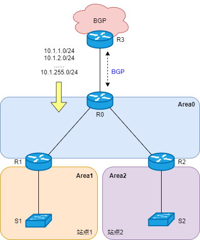

当 ASBR 把外部路由进入 OSPF 时，也能执行路由汇总。R0 有一条上联线路连着 R3 路由器，R0 和 R3 建立 BGP 对等体关系，R3 向 R0 通告 BGP 路由，R0 把学习到的 BGP 路由引入 OSPF。BGP 通常有大量的路由信息，全部引入 OSPF，会有巨大风险，我们肯定会进行路由过滤，只把需要的路由引入进来。现在要把 `10.1.1.0/24`、`10.1.2.0/24` ...... 、`10.1.255.0/24`都引入 OSPF，OSPF 内的所有路由器的路由表规模会增大很多。这时，我们可以在 R0 上进行路由汇总，将外部路由汇总成 `10.1.0.0/16`，屏蔽明细路由，把 255 条路由汇总成一条，极大的减小了 OSPF 网络的压力，OSPF 内的设备可以通过这条汇总路由到达 BGP 网络。只要 `10.1.0.0/16` 汇总路由内的明细路由有一条是活跃的，R0 就会向 OSPF 发布这条汇总路由，而如果所有的明细路由全部失效，R0 会立即撤销这条汇总路由。

## Virtual Link
OSPF 网络中，如果有多个区域，就必须要部署骨干区域`Area0`，而且所有非骨干区域必须和`Area0`直连。如果某个非骨干区域没有和`Area0`直连，那么 LSA 泛洪会有问题，OSPF 的路由计算也会出现问题。如果出现这种情况，通常是的解决方法是修改 OSPF 的规划和配置，让网络满足 OSPF 的要求。但是如果不能做这么大的变更，就有另一种临时的解决方案：`Virtual Link`（虚链路）。

`Virtual Link`是一种虚拟的、逻辑的链路，部署在两台 OSPF 路由器之间，和`Area0`非直连的骨干区域，穿过中间的非骨干区域，实现和`Area0`的连接。当两台路由器穿过一个非骨干区域，建立虚链路后，这两台路由器就尝试建立邻接关系，当基于`Virtual Link`的邻接关系建立起来后，路由器会生成`Type-1 LSA`描述这条`Virtual Link`。另外，`Virtual Link`不能部署在`Stub`区域内。

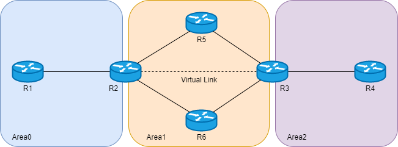

这个网络中，`Area2`并没有和`Area0`直连，那么 R3 并不是 ABR，也无法向`Area1`通告`Area2`内的网段路由，也就是`Area2`无法向`Area1`通告`Type-3 LSA`。当然，也无法向`Area2`内通告到达`Area0`和`Area1`内的网段路由。于是，`Area2`就成了一座孤岛。

在 R2 和 R3 之间建立一条`Virtual Link`，穿过`Area1`，实现`Area2`和`Area0`的连接。`Virtual Link`作为`Area0`的延伸，R2 和 R3 会建立邻接关系。一旦`Virtual Link`建立起来，R2 和 R3 就有了一条逻辑通道，而 R3 就成了 ABR，生成描述到达`Area2`各网段的路由，也是就`Type-3 LSA`，通告给`Area1`和`Area0`。另外，`Area0`的`Type-1 LSA`和`Type-2 LSA`也会通告给 R3，R3 也会向`Area2`通告到达`Area0`和`Area1`的`Type-3 LSA`。这样，网络中的各个路由可以完成全网 OSPF 路由的计算。

在`Virtual Link`邻接关系建立后，两台路由器会周期性发送`Hello`报文，用于确认对端的存活状态。另外，`Type-5 LSA`不会通过`Virtual Link` 传播，否则可能造成 LSA 重复泛洪。

`Virtual Link`作为一种临时的技术手段，来解决非骨干区域没有和`Area0`直连的问题，实际上一个合理规划的 OSPF 网络不应该出现这样的问题。使用`Virtual Link`会让 OSPF 网络不易维护和管理，也让逻辑结构更复杂。另一个问题是，频繁部署`Virtual Link`，可能会引发环路。
## 默认路由
默认路由（`Default Route`），是指目的地址和网络掩码都是 0 的路由，做为路由器的兜底路由。当目的网络找不到匹配的路由时，而且路由表中有默认路由，那么路由器会使用默认路由来转发数据。
### 在常规区域发布默认路由
默认情况下，常规区域的路由器是不会发布 OSPF 默认路由的，即使它的路由表中存在一条默认路由，也需要通过配置才能让路由器把默认路由通告到 OSPF 网络中。

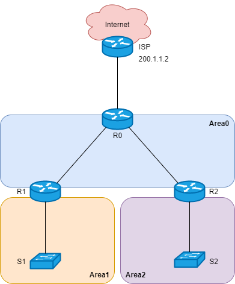

R0 是出口路由器，连着一条 Internet 出口线路。为了让内网用户可以访问 Internet，需要下发一条默认路由，让内网用户 Internet 流量到达 R0，再转发到 Internet。R0 可能已经有一条静态默认路由：`ip route-static 0.0.0.0 0.0.0.0 200.1.1.2`，但是 OSPF 域内的路由器是看不到的。如果使用路由引入把这条路由引入 OSPF，可能会引发环路的风险，默认路由是不会被引入的。OSPF 定义了专门的命令，把默认路由引入 OSPF。比如在 R0 上，配置如下：
```shell
[R0]ospf 1
[R0-ospf-1]default-route-advertise cost 10 type 2
```
`default-route-advertise`命令向 OSPF 域内发布一条默认路由，使用`Type-5 LSA`描述，属于外部路由。使用这种方式的前提是 R0 的路由表中已经有一条默认路由，可以是静态的，也可以是动态的。如果命令中增加`always`关键字，就不管 R0 的路由表是否存在默认路由，都会向 OSPF 网络下发默认路由。
### 在 Stub 区域发布默认路由
当一个 OSPF 区域配置成`Stub`区域时，这个区域不允许`Type-5 LSA`进入，区域内的路由器就无法学习到区域外的路由，那么这些路由器如何访问区域外网络呢？这时，`Stub`区域的 ABR 会自动下发一条默认路由，使用`Type-3 LSA`描述，这样`Stub`区域内的路由器就能通过 ABR，访问区域外网络。
### 在 Totally Stub 区域发布默认路由
`Totally Stub`区域禁止`Type-3 LSA`在区域内泛洪，区域内的路由器就无法学习到区域外的路由，`Totally Stub`区域的 ABR 会自动下发一条默认路由，也是使用`Type-3 LSA`描述，这样区域内部的路由器就能通过 ABR ，达到其它区域和 OSPF 域外。
### 在 NSSA 发布默认路由
当一个区域配置为 NSSA 时，这个区域就不允许`Type-4 LSA`和`Type-5 LSA`进入，同时，NSSA 允许引入少量的外部路由，NSSA 的 ABR 自动向 NSSA 发布一条默认路由，使用`Type-7 LSA`描述。

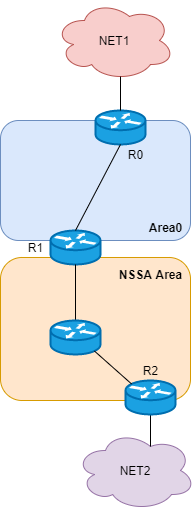

R0 连着外部网络`NET1`，R0 把到达`NET1`的静态路由引入 OSPF，这些路由使用`Type-5 LSA`描述，在整个 OSPF 域内泛洪，当`Area1`配置成 NSSA 后，R1 会阻挡`Type-5 LSA`进入`Area1`。同时，R1 会自动下发一条默认路由到`Area1`，使用`Type-7 LSA`描述。这样，NSSA 内的路由器的路由表规模减小，还能通过默认路由到达`NET1`。这条 `Type-7 LSA` 的默认路由，只能在 NSSA 内传递。

如果出现另一种需求，希望通过 NSSA 内的 R2 下发默认路由，那就要在 R2 上进行配置。
```shell
[R2]ospf 1
[R2-ospf-1]area 1
[R2-ospf-1-area-0.0.0.1]nssa default-route-advertise
```
配置完后，R2 会向 NSSA 通告一条`Type-7 LSA`描述的默认路由，这条默认路由只会在 NSSA 内传播，不会被 ABR 转成`Type-5 LSA`进入`Area0`。当然，仅当 NSSA 的 ASBR 在自己的路由表中，已经存在一条默认路由时，这条命令才生效，否则默认路由不会导入。
### 在 Totally NSSA 发布默认路由
`Totally NSSA`禁止`Type-3`、`Type-4`、`Type-5 LSA`在区域内泛洪，同时区域的 ABR 会自动下发一条默认路由，使用`Type-3 LSA`描述，这样 NSSA 内的路由器可以到达其它区域或域外的网络。
## 报文认证

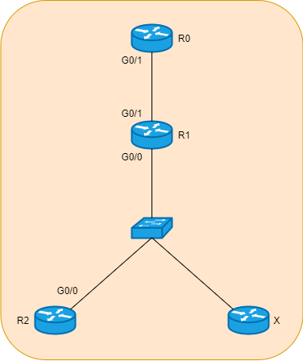

R1 和 R2 连接在同一台二层交换机上，接口已经启动 OSPF，并形成邻接关系。如果攻击者在交换机上接入一台非法路由器 X，也在接口启动 OSPF。R1 和 R2 通过`Hello`报文发现 X，并和 X 建立邻接关系。然后，X 向 OSPF 网络导入大量垃圾路由，让整个 OSPF 的路由计算发生问题，网络数据不能正常转发到目的地。

为了避免类似问题，OSPF 设计了报文认证功能。OSPF 报文的头部中，有几个和认证相关的字段，用于报文的认证功能。OSPF 有三种认证方式：
* 空认证（`Null Authentication`）
* 简单口令认证（`Simple Password`）
* 密文认证（`Cipher Authentication`）

对应 “认证类型” 字段值的 0、1、2。

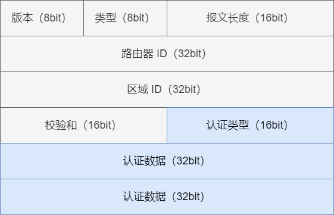

### 空认证
默认情况下，OSPF 接口的认证方式是空认证，也就是说，对接口的 OSPF 报文不做认证，认证类型字段值为 0。
### 简单口令认证
简单口令认证，又叫做明文认证，认证数据字段中有一个明文口令，用来认证 OSPF 的报文收发。其实这种认证方式不安全，只要可以对网络环境进行抓包，就可以分析报文内容，直接看到明文口令。认证类型字段值为 1。
### 密文认证
密文认证，OSPF 报文就不是包含明文口令，而是包含一个哈希（`Hash`）值，这个值是把配置的口令等内容，经过 MD5 算法计算的结果。MD5 算法是一种理论上不可逆的散列算法。即使对 OSPF 报文抓包，也无法对哈希值反推明文口令，所以这种认证方式更加安全。

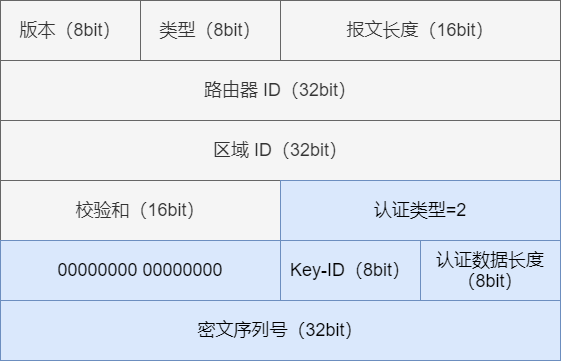

采用密文认证，报文格式也发生了变化。认证类型字段值为 2，表示密文认证方式，其它字段描述如下：
* `Key-ID`（`Key-Identification`）：口令标识。如果两个路由器都启动了报文认证，那么双方的`Key-ID`和口令必须一致。
* 认证数据长度（`Authentication Data Length`）：把口令使用散列算法进行计算，得到的数据追加在 OSPF 报文尾部，不在 OSPF 报文头部中，也并不当作是 OSPF 协议报文的一部分，报文头部的 “报文长度” 字段值未包含认证数据长度，“认证数据长度”字段就表示这个认证数据的长度。
* 密码序列号（`Cryptographic Sequence Number`）：一个持续递增的序列号，防范 OSPF 报文的重放攻击。在`Broadcast`网络中，非法路由器抓到 OSPF 报文，改成自己伪造的 OSPF 报文，伪造报文使用抓包报文中认证的相关内容，伪装成合法的 OSPF 邻居。由于这个字段的值，只增不减，当收到 OSPF 报文的密码序列号等于或小于目前的序列号时，路由器就认为是重放攻击报文，于是将其丢弃。

## 转发地址
在 OSPF 的`Type-5 LSA`和`Type-7 LSA`中有一个特殊的字段：转发地址（`Forwarding Address，FA`），FA 是用来避免次优路径问题的。

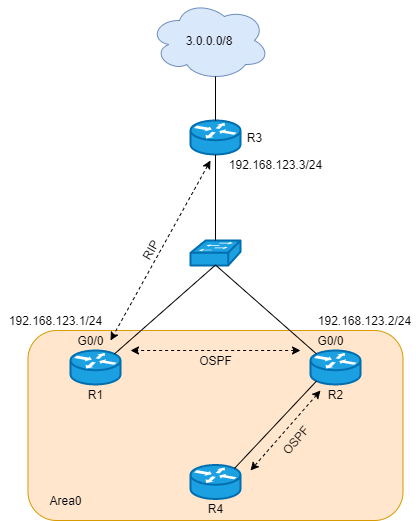

R1、R2、R3 三台路由器连接在同一台二层交换机上，三台路由器的接口 IP 地址都在相同网段，R1 和 R2 是 OSPF 路由器，都在`G0/0`接口启动了 OSPF，而 R3 没有运行 OSPF，只是和 R1 通过 RIP 交互路由信息，R3 把`3.0.0.0/8`路由通过 RIP 通告给 R1。为了让整个 OSPF 网络都能学到`3.0.0.0/8`路由，R1 将 RIP 路由引入 OSPF，使用`Type-5 LSA`在整个 OSPF 域内泛洪。域内的路由器去往`3.0.0.0/8`时，会先把数据包转发到外部路由的 ASBR，也就是 R1。比如 R4 发送数据到`3.0.0.0/8`网段，先将数据包转发给 R2，R2 转发给 R1，R1 再转发给 R3。这里发现，数据包没必要经过 R1 转发给 R3，这就是次优路径。

OSPF 使用 FA 字段，解决次优路径问题。只有`Type-5 LSA`和`Type-7 LSA`有 FA 字段，类似外部网络出口的概念。路由器使用`Type-5 LSA`计算路由时，会根据`Type-5 LSA`的链路状态 ID 和 LSA 的网络掩码进行与运算，得到路由的目的网络地址和掩码。另外，路由器还会检查 ASBR 的可达性，如果 ASBR 不可达，那不会使用`Type-5 LSA`计算路由，只有 ASBR 可达时，这条 LSA 才是有效的。如果 LSA 的 FA 为`0.0.0.0`，那么到达目的网段的数据包会发往 ASBR。如果 FA 不是 `0.0.0.0`，那么路由器会把到达目的网络的数据包发往这个 FA。这时路由器会查询到达 FA 的路由，如果有匹配 FA 的路由，就使用这个 FA 的下一跳作为这条外部路由的下一跳地址。如果没有匹配的路由，那么就不会用这条`Type-5 LSA`来计算路由。

我们再来看看 R1 生成的`Type-5 LSA`，FA 为 R3 的接口地址`192.168.123.3`，因为 R1 自己到达`3.0.0.0/8`的下一跳就是`192.168.123.3`。

R2 收到这个`Type-5 LSA`后，进行外部路由计算。它发现 FA 不是`0.0.0.0`，于是查询到达 FA（`192.168.123.3`）的路由，发现自己的直连路由可达，因此把`3.0.0.0/8`加载到路由表时，下一跳设置为`192.168.123.3`。这样，R4 发往`3.0.0.0/8`的数据包，转发到 R2 时，会直接转发给 R3，而不用从 R1 绕一下。

通常`Type-5 LSA`的 FA 字段值为`0.0.0.0`，当满足特定条件时，FA 字段才设置成非`0.0.0.0`的值。条件如下：
* 引入外部路由的 ASBR 在连接外部网络的接口启动了 OSPF；
* 这个接口没有配置为`Silent-Interface`；
* 这个接口的网络类型是`Broadcast`或 NBMA ；
* 这个接口的 IP 地址在配置的`network`命令范围内。

只有同时满足这四个条件，FA 才允许设置成非`0.0.0.0`的值，否则 FA 为`0.0.0.0`。
## OSPF 路由防环机制
OSPF 的路由器使用 LSA 交互路由信息，路由计算也是基于各种 LSA 进行的，所以 OSPF 路由的防环机制依赖于 LSA。
### 区域内部路由防环
每台 OSPF 路由器都会生成`Type-1 LSA`，`Type-1 LSA`描述路由的直接接口状况，并只在接口所在区域内泛洪。`Type-2 LSA`由 DR 生成，描述接入 MA 网络的所有路由器，和 MA 网络的掩码信息。通过区域内泛洪的`Type-1`和`Type-2 LSA`，路由器能够知道区域内的网络拓扑和网段信息。每个区域维护一个独立的 LSDB，基于这个 LSDB 计算出以自己为根、无环的最短路径树。为什么是无环，是因为路由器能够通过 LSA 了解区域的完整拓扑和网段信息。

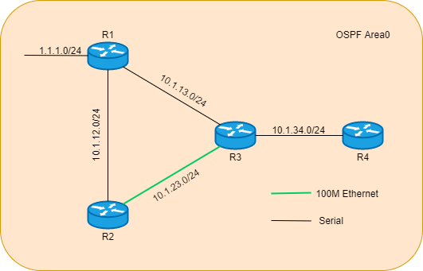

R1、R2、R3、R4 的接口都在`Area0`，四台路由器都会生成`Type-1 LSA`，并且在区域内泛洪。以太网接口默认是`Broadcast`网络类型，也会进行 DR 和 BDR 的选举，DR 会生成`Type-2 LSA`，并在区域内泛洪。在 LSDB 同步完成后，每台路由器都知道了整个区域的拓扑和网段信息。

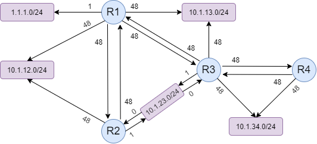

接下来，每台路由器都以自己为根，计算一棵无环的最短路径树，比如 R3 的最短路径树。


计算出每个网段的最优路径，并把路径添加到路由表中，实现域内的路由无环。
### 区域间路由防环
1. OSPF 所有的非骨干区域必须和`Area0`直连，区域间路由需要经过`Area0`中转。这个规则让区域间的路由传递不能发生在两个非骨干区域之间，很大程度上规避了区域间路由环路的发生，也让 OSPF 的区域架构在逻辑上形成了一个类似星型的拓扑。
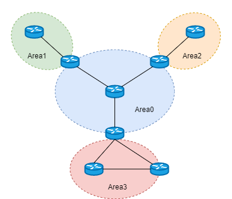
2. ABR 从非骨干区域收到的`Type-3 LSA`不能用于计算区域路由。ABR 在使用`Type-3 LSA`计算区域间的路由时，只会使用在`Area0`收到的`Type-3 LSA`进行计算，而从非骨干区域收到的`Type-3 LSA`是不会用来计算路由的，这样可以有效避免环路的产生。

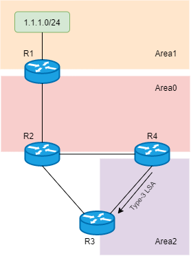

R4 作为一台 ABR，会把到达`Area0`和`Area1`各网段路由的`Type-3 LSA`通告到`Area2`中，由于 R3 和 R4 建立了邻接关系，位于`Area2`的 R3 收到`Type-3 LSA`，会用来计算区域间路由。


如果 R2 和 R3 在`Area0`建立邻接关系，那么 R3 就成为 ABR。R3 会把`Area2`收到的`Type-3 LSA`保存在自己的 LSDB 中，但不会 LSA 计算区域间的路由。R3 只能使用在`Area0`收到的`Type-3 LSA`进行区域间路由计算。这样的话，R3 收到访问`Area0`网段，或访问`Area1`的`1.1.1.0/24`网段的，都会送到 R2，再由 R2 把流量转发出去。

3. ABR 只能把自己区域内部路由通告给骨干区域，区域间路由则不允许通告。另外，可以把区域内路由和区域间路由通告给非骨干区域。
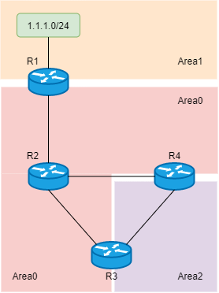
R3 会在`Area2`中收到`Type-1 LSA`，可能还会有`Type-2 LSA`，根据这些 LSA 计算出到达`Area2`的区域内路由。R3 作为 ABR，会把`Area2`区域内路由通过`Type-3 LSA`通告到`Area0`。R3 也会在`Area2`收到 R4 通告的`Type-3 LSA`。这时，R3 不能使用这些 LSA 计算区域间路由，更不会把描述这些路由的`Type-3 LSA`通告到`Area0`。这样可以有效防止区域间路由倒灌回`Area0`。同时，R3 会在`Area0`收到`Type-1 LSA`，可能还会有`Type-2 LSA`，也会收到描述`Area1`区域间路由的`Type-3 LSA`，R3 可以使用这些 LSA 计算到达`Area0`各网段的区域内路由，以及到达`Area1`各网段的区域间路由，并把描述`Area0`和`Area1`各路由的`Type-3 LSA`通告给`Area2`。

4. ABR 不会把到达某个区域内网段路由的`Type-3 LSA`再通告给这个区域。


OSPF 区域间路由的通告行为，跟距离矢量路由协议类似。在`Area1`中，R1 和 R2 都会生成`Type-1 LSA`，可能还会有`Type-2 LSA`，两台路由器都能计算出区域内路由。R2 作为 ABR，还会向`Area0`通告到达`Area1`的区域间路由，也就是向`Area0`通告到达`Area1`各网段的区域间路由的`Type-3 LSA`，而这些`Type-3 LSA`是不会通告回`Area1`的，和距离矢量路由协议的水平分割规则类似。

接下来，R3 使用这些`Type-3 LSA`计算出到达`Area1`各网段的区域间路由，并且生成新的`Type-3 LSA`通告给`Area2`，而这些`Type-3 LSA`也不会通告回`Area0`的。

5. `Type-3 LSA` 有个 `Down-Bit` 字段，用于 MPLS VPN 路由防环。

### 外部路由防环
当 OSPF 路由器把外部路由引入 OSPF 域后，引入的外部路由以`Type-5 LSA`在整个 OSPF 域内泛洪。路由器使用`Type-5 LSA`计算出路由有两个前提：
* 一个是收到`Type-5 LSA`
* 另一个是知道如何到达生成这个`Type-5 LSA`的 ASBR

和 ASBR 同一个区域的路由器，可以根据区域内的`Type-1`、`Type-2 LSA`计算出到达 ASBR 的最短路径，从而计算出外部路由。而其它区域的路由器，无法收到 ASBR 生成的`Type-1 LSA`，需要`Type-4 LSA`才能计算出到达 ASBR 的最优路径，进而利用这个 ASBR 生成的`Type-5 LSA`计算外部路由。

`Type-5 LSA`会泛洪到整个 OSPF 域，它本身没有什么防环能力，但实际上不需要，因为它可以依赖`Type-1 LSA`、`Type-2 LSA`、`Type-4 LSA`来实现防环。另外，`Type-5 LSA`的`“Route Tag”`字段用在 MPLS VPN 环境下外部路由的防环。
## OSPF 路由类型和优先级
OSPF 路由有几种类型，优先级按下面的顺序排列：
* 区域内路由（`Intra Area Route`）：是指路由器根据区域内泛洪的`Type-1 LSA`和`Type-2 LSA`计算得到的路由，这些路由可以到达直连区域内的网段。
* 区域间路由（`Inter Area Route`）：是指路由器根据`Type-3 LSA`计算得到的路由，这些路由可以到达其它区域的网段。
* `Type1`外部路由（`Metric-Type-1 External Route`）：是指路由器根据`Type-5 LSA（Metric-Type-1）`计算出的外部路由。
* `Type2`外部路由（`Metric-Type-2 External Route`）：是指路由器根据`Type-5 LSA（Metric-Type-2）`计算出的外部路由。

如果去往一个目的网段，有两条路由可达时，一条是区域内路由，另一条是区域间路由，那么无论两条路由的度量值是多少，路由器都会选择区域内路由加载到路由表中，直到这条路由失效，才会使用区域间路由。
