路由信息协议 RIP（`Routing Information Protocol`）是一种基于距离矢量（`Distance-Vector`）算法的协议，使用跳数作为度量来衡量到达目的网络的距离。

RIP 是一种比较简单的内部网关协议。RIP 使用了基于距离矢量的贝尔曼-福特算法（`Bellman-Ford`）来计算到达目的网络的最佳路径。

最初的 RIP 协议开发时间较早，所以在带宽、配置和管理方面要求也较低，因此，RIP 主要适合于规模较小的网络中。

RIP 协议中定义的相关参数也比较少。例如，RIPv1 不支持 VLSM 和 CIDR，也不支持认证功能。

RIP 协议的主要特点：
* 配置简单
* 易于维护
* 适合小型网络

## RIP工作原理
路由器启动时，路由表中只会包含直连路由。运行 RIP 之后，路由器会发送路由更新请求(`Request`报文)，用来请求邻居路由器的 RIP 路由。运行 RIP 的邻居路由器收到该`Request`报文后，会根据自己的路由表，生成`Response`报文进行回复。路由器在收到`Response`报文后，会将相应的路由添加到自己的路由表中。

RIP 网络稳定以后，每个路由器会周期性地向邻居路由器通告自己的整张路由表中的路由信息，默认周期为 30 秒。邻居路由器根据收到的路由信息刷新自己的路由表。

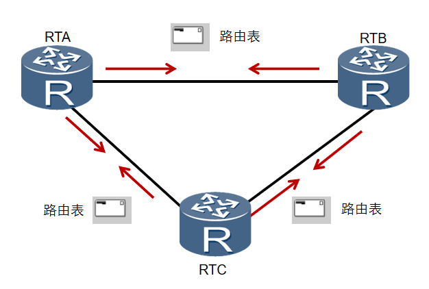

RIP 的路由条目包含：目的网络地址/网络掩码、度量值、下一跳地址、老化计时器以及路由状态标识等信息。

下面举个栗子，看下运行了 RIP 的路由器是如何完成路由信息的学习和收敛的。
#### 1、路由器启动


R1、R2 和 R3 三台路由器直连，三台路由器都已开启 RIP。在启动路由器后，所有路由器自动发现自己的直连路由，并将直连路由添加到路由表中。比如：R1 的路由表中添加了`192.168.12.0/24`和`1.0.0.0/8`两条直连路由。直连路由的 RIP 度量值为 0 跳，0 跳表示到达这个网段不需要经过路由器。
#### 2、第一次交换路由信息
运行了 RIP 的路由器会将自己的路由通过 RIP 报文周期性的从接口发送出去。第一次交换路由信息，R1、R2 和 R3 都是通告自己的直连路由。R2 会将自己的路由表从`G0/0`和`G0/1`接口发送出去。以`192.168.23.0/24`为例，R2 从`G0/0`口发送给 R1 时，会将路由的度量值从 0 跳改为 1 跳，RIP 路由器将路由发送出去时会把跳数加 1，意思是要到达`192.168.23.0/24`需要经过一个 RIP 路由器。R1 收到 R2 发出的路由更新后，发现自己的路由表没有`192.168.23.0/24`这条路由，于是把这条路由添加到路由表中，路由的度量值为 1 跳，出接口设置为`G0/0`。


R3 也会收到 R2 的路由更新，R2 也会收到 R1 和 R3 发送的路由更新。经过第一轮的路由通告和学习，R1 学习到`192.168.23.0/24`的路由，R2 学习到`1.0.0.0/8`和`3.0.0.0/8`两条路由，R3 学习到`192.168.12.0/24`的路由。
#### 3、路由收敛


来到下一个更新周期时，所有路由器又会把自己的路由发送出去。R1 收到 R2 通告的路由，发现`3.0.0.0/8`不在路由表中，R1 就把这条路由添加到路由表，度量值为 2 跳，表示 R1 到达`3.0.0.0/8`需要经过两个路由器。另一边的 R3 也从 R2 学到了`1.0.0.0/8`的路由。这样三台路由器就有了全网各个网段的路由，路由表也稳定下来，这个状态说明网络中的路由已经完成了收敛。网络收敛后，路由器还是会周期性的通告路由，确保路由的有效性。

如果从单台 RIP 路由器上看，它只是监听直连 RIP 路由器的路由更新通告，学习路由，并加载到路由表中。同时，它也将自己路由表中的 RIP 路由通告出去，让其它直连的路由器能够学习到。实际上，路由器是不知道整个网络的拓扑结构的。

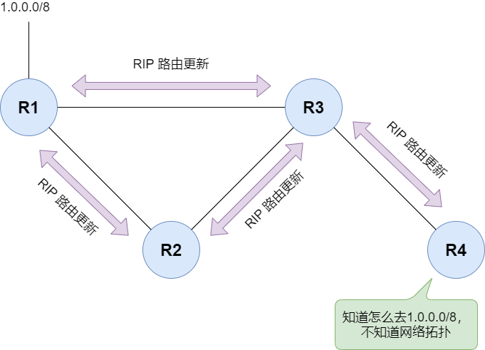

## 度量值
度量值是到达目的网络的代价。每一种路由协议都定义了路由的度量值，但是对度量值的定义不尽相同。度量值的大小会影响路由器到达目的网段的路由选择。

RIP 使用跳数作为度量值来衡量到达目的网络的距离。跳数就是到达目的网络需要经过的路由器个数，跳数越少，路由越优。

在 RIP 中，路由器到与它直接相连网络的跳数为 0，每经过一个路由器后跳数加 1。为限制收敛时间，RIP 规定跳数的取值范围为 0~15 之间的整数，大于 15 的跳数被定义为无穷大，即目的网络或主机不可达。


路由器运行 RIP 后，认为直连路由的跳数为 0。R1 的直连网段`1.0.0.0/8`的度量值是 0。R1 从`G0/0`接口通告路由时，会把`1.0.0.0/8`的度量值 +1 后通告给 R2。R2 收到后，将`1.0.0.0/8`路由学习过来，添加到路由表中，并将度量值设置为 1。接着 R2 将`1.0.0.0/8`路由从`G0/1`接口通告出去，R2 将路由的度量值 +1 后通告给 R3。R3 也学习到`1.0.0.0/8`路由，度量值为 2。

RIP 使用跳数作为度量值，可以让路由器知道自己距离目的网络的跳数。在路由选择过程中，比较度量值选择一条最优路径，也就是跳数最小的路径添加到路由表中。


通过跳数来计算网络的路径非常简单和直观，但是也有个问题。如果网络链路带宽不一致，RIP 的路径选择可能不合理，因为 RIP 并不关注链路带宽，只关注经过的路由器个数。这种场景下，可以对 RIP 路由的度量值进行适当调整，改变数据流量的转发路径。


RIP 的路由跳数是在路由器发出路由通告之前增加的。
## 路由表更新原则
路由器从某一邻居路由器收到路由更新报文（`Response`报文）时，将根据以下原则更新本路由器的 RIP 路由表：
* 对于本路由表中已有的路由条目，路由条目的下一跳与发送`Response`报文的路由器相同时，不论路由的度量值是增大或是减少，都更新这条路由。度量值相同时，只重置路由的老化计时器。
* 对于本路由表中已有的路由条目，路由条目的下一跳与发送`Response`报文的路由器不同时，只有在路由的度量值减少时，才更新这条路由。
* 对于本路由表中不存在的路由条目，且度量值小于 16 时，才添加进路由表。

某路由项的度量值变为不可达后，该路由会在`Response`报文中发布四次（120 秒），然后从路由表中清除。

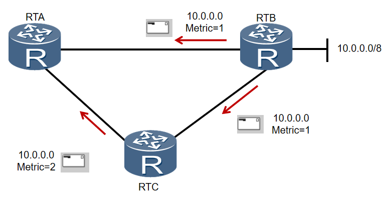

路由器 RTA 通过两个接口学习路由信息，每条路由信息都有相应的度量值，到达目的网络的最佳路由就是通过这些度量值计算出来的。
## RIPv1 vs RIPv2
RIP 包括 RIPv1 和 RIPv2 两个版本：
* RIPv1 为有类别路由协议，不支持 VLSM 和 CIDR。RIPv2 为无类别路由协议，支持 VLSM，支持路由聚合与 CIDR。
* RIPv1 使用广播发送报文；RIPv2 有两种发送方式：广播方式和组播方式，缺省是组播方式。RIPv2 的组播地址为`224.0.0.9`。组播发送报文的好处是在同一网络中那些没有运行 RIP 的网段可以避免接收 RIP 的广播报文；另外，组播发送报文还可以使运行 RIPv1 的网段避免错误地接收和处理 RIPv2 中带有子网掩码的路由。
* RIPv1 不支持认证功能，RIPv2 支持明文认证和 MD5 密文认证。

### RIPv2
RIPv1 是有类路由协议，不支持 VLSM，因此只能在特定的网络环境中使用。其中一个原因是，RIPv1 的`Response`报文中只有 IP 地址（目的网络地址）而没有目的网络掩码，使得 RIPv1 在使用 VLSM 的网络中会出现问题。

R1 连接着`172.16.1.0/24`，R3 连接着`172.168.3.0/24`，这时`172.16.0.0/16`这个 B 类地址被`192.168.12.0/24`和`192.168.23.0/24`两个 C 类地址隔开，这就是不连续的主类网络。

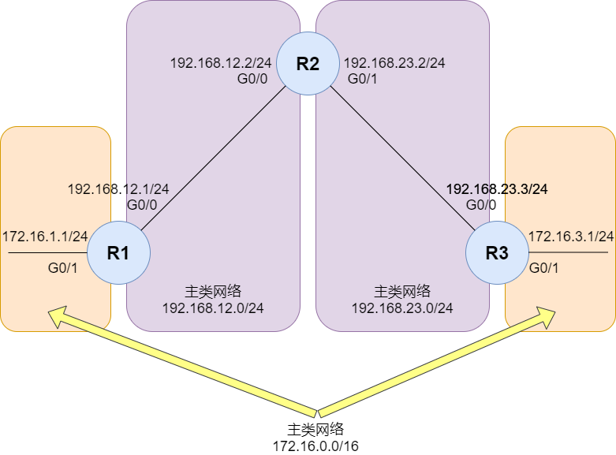

R1、R2 和 R3 三台路由器都运行了 RIPv1，泛洪的`Response`报文中是不携带目的网络掩码的，会自动汇总成主类路由进行通告。R1 和 R3 都会向 R2 发送`Response`报文，报文都包含`172.16.0.0`路由，R2 收到两份`Response`报文，将两条路由都添加到路由表中，这样 R2 的路由表`172.16.0.0/16`路由会有两个等价的下一跳。R2 转发`172.16.3.0/24`的数据包，可能发往 R1 导致故障；R2 转发`172.16.1.0/24`的数据包，可能发往 R3 导致故障；这就是 RIPv1 在不连续主类网络时存在的问题。推荐的解决办法就是使用 RIPv2 而不是 RIPv1。

RIPv2 的改进点包括使用组播发送 RIP 报文；支持无类路由选择；在`Response`报文中携带目的网络掩码；支持报文认证；增加下一跳特性；增加路由标记功能；支持手动路由汇总等。
### 报文发送方式
RIPv1 使用广播发送协议报文，报文目的 IP 地址是`255.255.255.255`，这是一个广播 IP 地址，同一个广播域的设备都能收到报文，即使有些设备不需要也要耗费资源去处理。比如：广播域中的主机、服务器等未运行 RIP 的设备，收到一个 RIPv1 报文后，要层层解封装，直到看到报文的目的 UDP 端口，发现未侦听 UDP 520 端口才会将报文丢弃。

RIPv2 采用组播地址`224.0.0.9`作为报文的目的 IP 地址，所有 RIPv2 设备都会侦听这个组播地址，可以减少对广播域其它设备的影响。
### 报文认证
R1 和 R2 交互着 RIP 报文，现在 R3 连接到交换机上，开始在广播域泛洪`Response`报文，这些伪造的`Response`报文携带大量垃圾路由，这会造成 R1 和 R2 的路由出现混乱，或者路由表被大量垃圾路由填充，设备资源也会被大量消耗。


RIPv2 的解决方法是 RIP 报文认证。通过在 R1 和 R2 的接口上激活 RIP 认证并在两端配置相同的认证口令，可使 RIP 报文的交互更加安全。只有 RIP 报文的相关认证字段匹配认证口令，报文才是有效的，否则是非法报文并被丢弃。

RIP 认证是基于报文的，路由器接口上配置 RIP 报文认证后，这个接口发送的 RIP 报文会携带认证信息。认证信息会占用第一个路由项，此时一个`Response`报文可携带的最大路由条目数量从 25 条变成 24 条。RIP 认证方式有：
* 简单认证
* MD5 认证

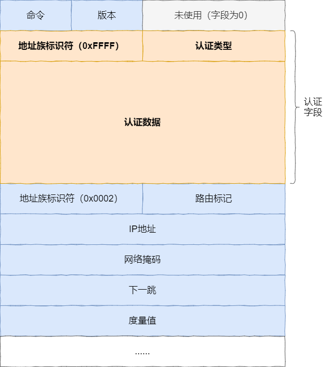

### 下一跳字段
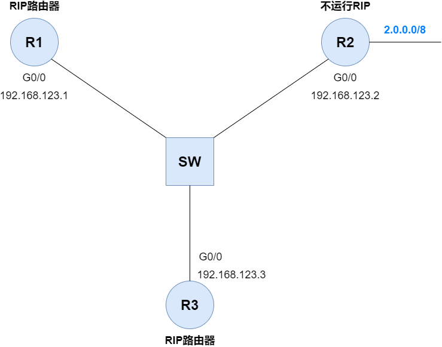

R1 、R2 和 R3 连在同一台交换机上，R1 和 R3 运行 RIPv2，但 R2 不支持 RIP。R2 直连着`2.0.0.0/8`，为了让 R1 能够访问这个网段，在 R1 上部署静态路由：`ip route-static 2.0.0.0 8 192.168.123.2`。现在让 R3 也能够访问`2.0.0.0/8`，而且希望通过 RIP 学习到这条路由，R1 将静态路由引入 RIP。这样 R3 把路由添加到路由表，认为 R1 是下一跳。这样的话，从 R3 到`2.0.0.0/8`的数据包会先转发给 R1，再由 R1 转发给 R2，这就是次优路径。对于距离矢量路由协议而言，路由的通告者就是路由的下一跳。


在同一个网络拓扑结构中，如果存在两种不同的路由协议，会造成网络中路由信息的隔离。在路由协议的边界设备上，将路由信息引入到另一种路由协议中，这就称为路由引入或路由重分发。

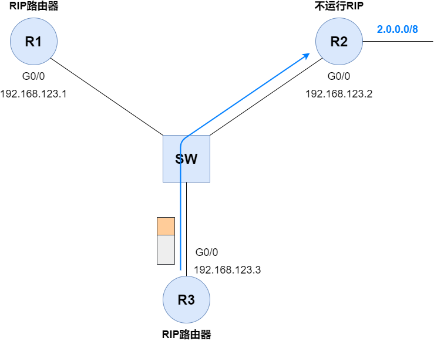

RIPv2 增加下一跳字段解决这个问题，当 R1 将`2.0.0.0/8`路由通过 RIP 通告给 R3 时，`Response`报文会携带下一跳字段，值为 R1 到达目的网段的直连下一跳地址，也就是直连网段中的`192.168.123.2`（R2 的接口地址）。R3 收到`Response`报文后，将路由`2.0.0.0/8`添加到路由表，下一跳设置为`192.168.123.2`（这个地址直连可达）。R3 去往`2.0.0.0/8`的数据包会直接转发给 R2，而不会经过 R1 去转发。
### 路由标记
RIPv2 增加了路由标记（`Route Tag`）字段，从外部引入 RIP 的路由能够携带特定的标记信息。由连续的 RIP 路由器构成的网络称为 RIP 域，RIP 域内的路由通告`network`命令发布路由，整个域内的 RIP 路由器都能学习到，这些路由的路由标记字段值为 0。当一条外部路由，比如静态路由、OSFP 或 BGP 路由等，重分发到 RIP 时，RIP 为这条路由设置路由标记。
### 路由汇总
路由汇总是同一个网段内的不同子网路由在向外通告时汇总成一条路由的行为。路由汇总主要用于减小网络设备的路由表规模，进而减小网络中路由更新的流量及设备资源消耗。在一个大型的网络中路由汇总是必须考虑的一种网络优化手段。

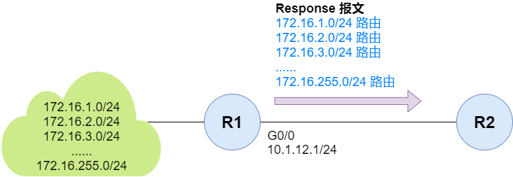

R1 连着`172.16.1.0/24、172.16.2.0/24`和`172.16.3.0/24`等大量网段，如果 R1 将路由全部通告给 R2，那么 R2 的路由表会变得臃肿，而且更新路由又要占用不少带宽资源。仔细一看，发现这些网络是可以通过路由汇总进行优化的。


如果我们在 R1 上部署路由汇总，那么 R1 不再通告`172.16.0.0/16`的子网路由给 R2 ，而是通告汇总路由`172.16.0.0/16`，那么 R2 的路由表将从 256 条精简到 1 条，R2 转发这些子网的报文是，可以使用汇总路由来转发。同时要记住，路由汇总的前提是 IP 地址规划合理，子网可以进行路由汇总。

RIP 支持路由自动汇总，路由自动汇总是 RIP 路由器把一个主类网络的子网路由通告给另一个主类网络时，自动将子网路由汇总成主类网络路由，只把主类网络路由通告给直连 RIP 路由器的过程。因为 RIP 路由自动汇总只能把明细路由汇总成主类网络路由，这就会存在准确度不高的问题。
* RIPv1 的路由自动汇总功能默认是开启状态，而且不能关闭；
* RIPv2 的路由自动汇总功能默认是开启状态，但是可以通过命令关闭。


R1 启动路由自动汇总功能后，R1 向 R2 通告`172.16.0.0/16`的子网路由时，R1 会执行路由自动汇总，将明显路由汇总成主类网络路由`172.16.0.0/16`通告给 R2。在路由汇总的执行过程中，只要存在一条明细路由，则这条明细路由对应的主类网络汇总路由就会被通告，而如果所有的明细路由都失效，那么 RIP 不再通告对应的汇总路由。


路由自动汇总功能使用方便，但是在某些场景中使用时可能存在问题。R1、R2 和 R3 都运行 RIPv2，R1 左侧连接着`172.16.1.0/24、172.16.2.0/24 ······ 172.16.31.0/24`这些子网，会将子网路由汇总成主类路由`172.16.0.0/16`进行通告，遗憾的是 R3 会进行同样的操作，也会向 R2 通告`172.16.0.0/16`汇总路由，这样 R2 会分别收到 R1 和 R3 的`172.16.0.0/16`路由的更新，R2 会根据度量值进行路由选择，如果度量值相等，那么 R2 会执行路由等价负载分担，也就是把这两条路由都加载到路由表中，这就会出现问题，转发给 R1 的流量可能会转发给 R3。


造成问题的原因是汇总路由的准确度不高，也就是说汇总路由的掩码不够精准。如果关闭自动汇总，路由表又会变得臃肿。那该如何解决呢？答案是使用 RIP 手动路由汇总，也就是在 R1 和 R3 上先关闭路由自动汇总，然后使用手动汇总来指定 RIP 通告的精确汇总路由。手动汇总可以自定义汇总路由的目的网络地址及网络掩码，而不受地址类别的限制。R1 关闭 RIP 路由自动汇总后使用 RIP 路由手动汇总，向 R2 通告汇总路由`172.16.0.0/19`，而 R3 也关闭 RIP 路由自动汇总并向 R2 通告另一条汇总路由`172.16.32.0/19`。这两条汇总路由都精确包括了相应的明细路由，并不会在 R2 上形成冲突，解决路由自动汇总产生的问题。

## 报文类型及格式
RIP 协议报文使用 UDP 封装，使用的端口号是 520。RIP 有两种报文，分别是请求报文和响应报文。RIPv1 和 RIPv2 的功能不同，所以报文中的字段定义有一些差别。`Request`报文是向邻居请求全部或部分 RIP 路由信息，`Response`报文是发送 RIP 路由更新，`Response`报文中携带路由及路由的度量值等信息。

当路由器的接口激活 RIP 后，这个接口会立即发送一个`Request`报文和`Response`报文，并开始侦听 RIP 协议报文。然后开始周期性的发送`Response`报文。当 RIP 路由器收到`Request`报文后，会使用`Response`报文进行回应，在报文中携带对方请求的路由信息。当 RIP 路由器收到`Response`报文后，会解析报文中的路由信息，如果路由信息是自己未发现的，并且路由的度量值有效，那么路由器将学习这条路由并添加到路由表中，同时为这条路由关联度量值、出接口和下一跳信息。
### RIPv1 报文结构


RIPv1 以广播形式发送路由信息，目的 IP 地址为广播地址`255.255.255.255`。


报文结构中每个字段的值和作用：
* 命令（`Command`）：表示 RIP 报文类型。值为 1 表示`Request`报文，向直连路由器请求全部或部分路由信息。值为 2 表示`Response`报文，用于发送路由更新。可以是`Request`报文的回应，也可以是路由器主动发送的。
* 版本（`Version`）：表示 RIP 的版本信息。对于 RIPv1，该字段的值为 1。
* 地址族标识符（`Address Family Identifier，AFI`）：表示地址标识信息，值为 2 表示 IP 协议。如果是请求整个路由表的`Request`报文，则值为 0，同时`Request`报文有且只有一个路由条目，路由的目的网段为`0.0.0.0`，度量值为 16。
* IP 地址（`IP Address`）：表示该路由条目的目的 IP 地址。这一项可以是网络地址、主机地址。
* 度量值（`Metric`）：标识该路由条目的度量值，取值范围 1-16。 

一个`Response`报文最多携带 25 个路由条目，每个路由条目都携带了目的网络的地址和度量值。当路由数量超过 25 时，会使用多个`Response`报文发送。整个 RIP 报文大小限制为不超过 504 字节。
### RIPv2 报文结构
RIPv2 在 RIPv1 基础上进行了扩展，但 RIPv2 的报文格式仍然同 RIPv1 类似。


RIPv2 使用组播地址`224.0.0.9`作为协议报文的目的 IP 地址。

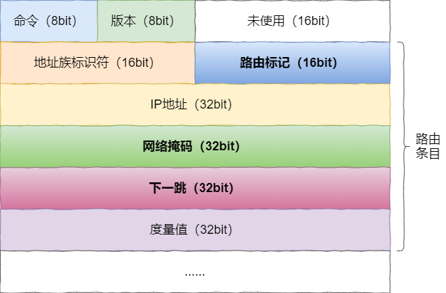

报文结构中每个字段的值和作用：
* 命令（`Command`）：和 RIPv1 相同。
* 版本（`Version`）：RIPv2 时，值为 2。
* 地址族标识符（`Address Family Identifier，AFI`）：和 RIPv1 相同。
* 路由标记（`Route Tag`）：用于标记路由信息，默认值为 0。当有一条外部路由引入并形成一条 RIP 路由时，这条路由设置路由标记。
* IP 地址（`IP Address`）：和 RIPv1 相同。
* 网络掩码（`Netmask`）：RIPv2 定义的字段，用于表示路由的目的网络掩码，支持 VLSM（可变长子网掩码）。RIPv1 没有定义这个字段，不支持 VLSM。
* 下一跳（`Next Hop`）：RIPv2 定义的字段，多路访问网络中，可自定义指定最优路径。通常路由器发送的路由更新中，下一跳字段为`0.0.0.0`，收到的路由器将路由条目添加到路由表中，将路由的发送方设置为目的网段的下一跳。在特殊场景下，字段值会设置为非`0.0.0.0`。
* 度量值（`Metric`）：和 RIPv1 相同。

## 计时器
RIP 有三个重要的计时器：
* 更新计时器（`Update Timer`）：RIP 路由器周期性发送`response`报文的时间间隔。默认时间是 30 秒。
* 老化计时器（`Age Timer`）：每一条 RIP 路由器都有老化计时器。当 RIP 路由添加到路由表时，马上为这条路由启动老化计时器，默认时间是 180 秒，启动后即开始计时。路由器再次收到这条路由的更新，老化计时器会重置并重新开始计时。当一条路由的老化计时器超时，路由表会删除这条路由，但是还会保存在 RIP 数据库中，以便路由随时能够恢复。在老化计时器超时的同时，这条路由的垃圾回收计时器也会立即启动。有趣的地方是，老化计时器超时失效的 RIP 路由，依然会在路由器发送的`Response`报文中，不过路由的度量值设置为 16 跳，即不可达。
* 垃圾回收计时器（`Garbage-Collect Timer`）：垃圾回收计时器默认值是 120 秒。当 RIP 路由的老化计时器超时，路由会不可达并从路由表中删除，但是会保存在 RIP 数据库中，同时立即为这条路由启动垃圾回收计时器。在垃圾回收计时器的这段时间，路由器会这条路由的度量值设置为 16 跳进行通告，告诉其他路由器这个网络不可达。如果垃圾回收计时器也超时，那么路由会被彻底删除。 
* 抑制定时器（`Suppress timer`）：当 RIP 设备收到对端的路由更新，其`cost`为 16，对应路由进入抑制状态，并启动抑制定时器。为了防止路由震荡，在抑制定时器超时之前，即使再收到对端路由`cost`小于 16 的更新，也不接受。当抑制定时器超时后，就重新允许接受对端发送的路由更新报文。默认：120 秒。

RIP 路由与定时器之间的关系：
* RIP 的更新信息发布是由更新定时器控制的，默认为每 30 秒发送一次。
* 每一条路由表项对应两个定时器：老化定时器和垃圾收集定时器。当学到一条路由并添加到 RIP 路由表中时，老化定时器启动。如果老化定时器超时，设备仍没有收到邻居发来的更新报文，则把该路由的度量值置为 16（表示路由不可达），但会通告该路由，并启动垃圾收集定时器。如果垃圾收集定时器超时，设备仍然没有收到更新报文，则在 RIP 路由表中删除该路由。

## RIP 防环机制
如果网络中的路由信息不正确，会导致数据包在设备之间来回转发，不能正确发往目的地，还会消耗带宽和设备性能，影响正常的业务流量，这种问题就是路由环路问题。路由环路对于网络而言，是具有严重危害的，我们应该重视并尽量规避这种问题，RIP 便有考虑路由环路的规避机制。
### 环路的产生
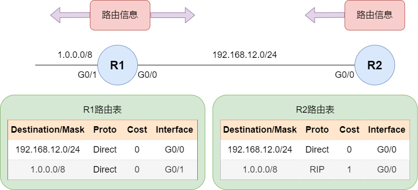

R1 和 R2 都运行了 RIP，当网络收敛后，R2 通过 RIP 学习到了`1.0.0.0/8`路由。现在 R1 的`G0/1`接口发生故障，R1 感知到这个拓扑变化，并立刻删除`1.0.0.0/8`路由。然而 R2 并不知道这个拓扑变化，R1 准备在下一个更新周期进行通告。这时就会出现一种可能，R1 在更新之前，R2 的更新周期到了，从`G0/0`接口发生`Response`报文，报文包含`1.0.0.0/8`路由，且跳数为 2。R1 收到这个`Response`报文后，发现`1.0.0.0/8`可以通过 R2 到达，且跳数为 2，于是 R1 将`1.0.0.0/8`路由添加到路由表中。

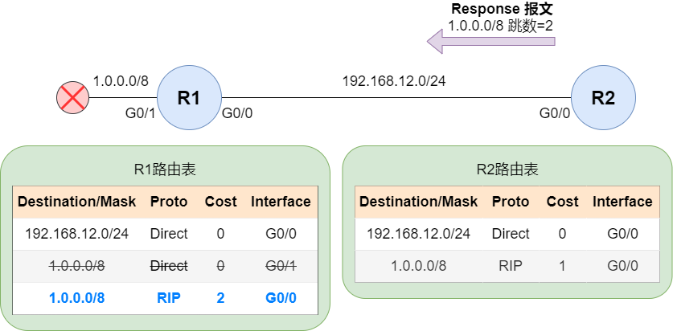

这就出现了环路。如果 R2 收到一个发往`1.0.0.0/8`的数据包，R2 查询路由表发现有目的地址的路由，下一跳是 R1，于是 R2 将数据包转发给 R1。而 R1 查询路由表，发现到达`1.0.0.0/8`下一跳是 R2，于是数据包又被转发给 R2，如此反复，数据包会在 R1 和 R2 之间不停转发，直到报文的 TTL 值变为 0。

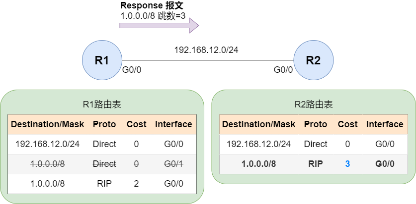

另外，RIP 每隔 30 秒泛洪一次路由表，每个更新周期都会泛洪`Response`报文里的`1.0.0.0/8`路由。R1 更新周期到来时，会把`1.0.0.0/8`路由通告给 R2，R2 收到报文后，刷新路由表，把这条路由的跳数更新为 3 跳。当 R2 更新周期到来时，将`1.0.0.0/8`发送给 R1，R1 收到后，刷新路由表，跳数更新为 4 跳，如此反复，跳数也会持续加大到无穷大。

这些都是因为 RIP 路由器并不了解整个网络的拓扑结构，使得网络中非常容易出现环路，路由环路对网络而言也是危害巨大，因此从网络设计和协议设计都要考虑到环路的可能性，并加以规避。
### 最大跳数
为了规避 RIP 路由在网络中无止境的泛洪，RIP 定义了路由的最大跳数是 15 跳，当一条路由的度量值达到 16 跳时，这条路由会被认为是不可用的，路由指向的网段是不可达的。

定义最大跳数，虽然解决了路由无限泛洪的问题，但是也限制了 RIP 能够支持的网络规模，而且没有从根本上解决路由环路的问题。
### 水平分割
水平分割（`Split Horizon`）的原理是，路由器从某个接口学到的路由，不会从该接口再发回给邻居路由器。具体地说，不能把从邻居学习到的路由发送给那个邻居。这个机制消除了 RIP 路由的环路隐患。

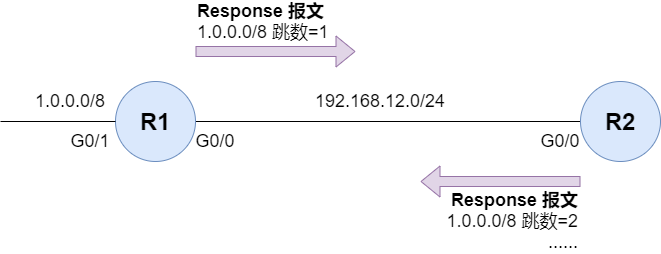

R1 和 R2 运行了 RIP，现在 R1 将本地直连路由`1.0.0.0/8`通过`Response`报文通告出去，路由度量值为 1。R2 从`G0/0`接口收到后，学习到`1.0.0.0/8`路由，并添加到路由表中。当 R2 的更新周期到来时，如果 R2 的`G0/0`接口激活了水平分割，R2 不会把从`G0/0`接口收到的 RIP 路由再从这个接口通告出去，也就是说，R2 不会把`1.0.0.0/8`路由从`G0/0`接口通告出去。这样路由环路的问题就可以很好的规避。


### 毒性逆转
毒性逆转（`Poison Reverse`）是另一种防止路由环路的机制，原理是 RIP 从接口学习到路由后，当它从这个接口发送`Response`报文时会携带这些路由，但是路由度量值设置为 16 跳，16 跳意味着路由不可达。使用这种方式，可以清楚对方路由表中的无用路由。毒性逆转也可以防止产生路由环路。

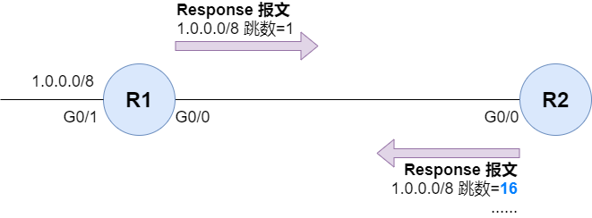

R1 和 R2 两台路由器运行了 RIP，开始交互 RIP 路由。R1 将`1.0.0.0/8`路由通告给 R2。如果 R2 激活了毒性逆转，那么它从`G0/0`接口发送`Response`报文时，报文包含`1.0.0.0/8`路由，但是路由的度量值为 16 跳。

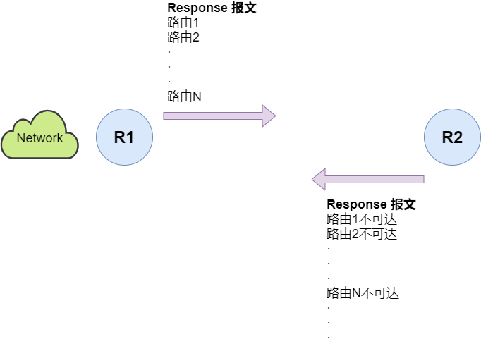

由于 R2 到达`1.0.0.0/8`的路由是从 R1 学习到的，意味着这个网段是在 R1 侧，可能是 R1 的直连网络，也可能是 R1 通过其它路由器到达这个网段。换句话说，R1 不会从 R2 到达`1.0.0.0/8`，也就不会出现环路。所以毒性逆转的思路是 R2 认为这条路由是 R1 给的，那么 R1 不可能从我这里到达这个网段，所以我就告诉 R1，这个网络从我这里走是不可达的。这条不可达路由可以彻底杜绝 R1 从 R2 到达`1.0.0.0/8`，避免环路出现的可能性。

总结为一句话：毒性反转是指路由器从某个接口学到路由后，将该路由的跳数设置为 16，并从原接收接口发回给邻居路由器。
#### 水平分割&毒性逆转
毒性逆转和水平分割实现了同一个功能，但是又互相矛盾。对水平分割，简单理解就是：到达某个目的网段的路由既然是你告诉我的，那么我就不应该再说回给你听。这是一种相对消极的举动。而毒性逆转则显得更主动积极：到达某个目的网段的路由是你告诉我的，那么我主动告诉你这个网段从我这走不通，杜绝你从我这走的可能。从这个层面上看，毒性逆转比水平分割更靠谱。如果路由器的接口同时激活水平分割和毒性逆转，只有毒性逆转生效。

水平分割和毒性反转都是基于每个接口来配置的。缺省情况下，每个接口都启用了`rip split-horizon`命令（NBMA 网络除外）以防止路由环路。


```shell
[RTC]interface GigabitEthernet 0/0/0 
[RTC-GigabitEthernet0/0/0]rip split-horizon
[RTC-GigabitEthernet0/0/0]rip poison-reverse
[RTC] display rip 1 interface GigabitEthernet0/0/0 verbose 
 GigabitEthernet0/0/0(192.168.1.2)
  State           : UP          MTU    : 500
  Metricin        : 2       
  Metricout       : 1       
  Input           : Enabled     Output : Enabled     
  Protocol        : RIPv2 Multicast
  Send version    : RIPv2 Multicast Packets 
  Receive version : RIPv2 Multicast and Broadcast Packets
  Poison-reverse                : Enabled 
  Split-Horizon                 : Enabled
  Authentication type           : None 
  Replay Protection             : Disabled 

```
两个特性同时配置后，只有`rip poison-reverse`会生效。

命令`display rip <process_id> interface <interface> verbose`用来确认路由器接口的 RIP 配置。命令回显中会显示相关 RIP 参数，包括 RIP 版本以及接口上是否应用了水平分割和毒性反转。此例中显示 RTC 的`GigabitEthernet0/0/0`接口配置了 RIPv2，`metricin`为 2，还启用了水平分割和毒性反转的功能。
### 触发更新
缺省情况下，一台 RIP 路由器每 30 秒会发送一次路由表更新给邻居路由器。这在网络稳定时没有问题，但是网络拓扑出现变化时，那就要等到下一个更新周期才能发送路由更新，这就不合理，而且容易引发路由环路。


触发更新机制是当路由器感知到拓扑变化或路由度量值变化时，它不是等下一个更新周期，而是立即发送`Response`报文。举个栗子，R1 、R2 和 R3 三台路由器运行了 RIP，R1 通告的`1.0.0.0/8`路由的度量值发生变化，从 1 跳变为 2 跳，R1 向 R2 发送`Response`报文进行通告。因为 R2 的`1.0.0.0/8`路由就是从 R1 学过来的，所以即使新的度量值 2 跳更远，R2 也会立即刷新自己的路由表，并且不等下一个更新周期，立即触发一个`Response`报文给 R3。R3 收到报文后，立即刷新自己的路由表。


触发更新是指当路由信息发生变化时，立即向邻居设备发送触发更新报文。从而加速了网络收敛。
### 毒性路由
度量值为 16 跳的路由是不可达的，当一个网络变为不可达时，路由器立即发送一个 16 跳的路由更新，通知网络中的路由器目的网络已经不可达，这种路由叫做毒性路由。


R1 的直连网段`1.0.0.0/8`变为不可达后，R1 立即发送`Response`报文通告这个更新，报文里的`1.0.0.0/8`路由度量值设置为 16。R2 收到这个`Response`报文后，发现`1.0.0.0/8`不可达了，于是从路由表中移除这条路由。其中，R2 虽然将路由从路由表中删除，但是依然保存在 RIP 数据库中，同时启动垃圾回收计时器。

## RIP配置
### RIP基本配置
`rip [process-id]`命令用来使能 RIP 进程。该命令中，`process-id`指定了 RIP 进程 ID。如果未指定`process-id`，命令将使用 1 作为缺省进程 ID。

命令`version 2`可用于使能 RIPv2 以支持扩展能力，比如支持 VLSM、认证等。

`network <network-address>`命令可用于在 RIP 中通告网络，`network-address`必须是一个自然网段的地址。只有处于此网络中的接口，才能进行 RIP 报文的接收和发送。

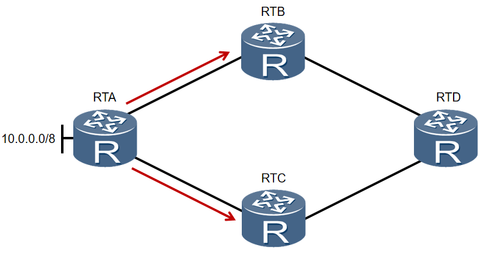

```shell
[RTA]rip
[RTA-rip-1]version 2 
[RTA-rip-1]network 10.0.0.0

[RTC] display rip 1 interface GigabitEthernet0/0/0 verbose 
 GigabitEthernet0/0/0(192.168.1.2)
  State           : UP          MTU    : 500
  Metricin        : 2       
  Metricout       : 1       
  Input           : Enabled     Output : Enabled     
  Protocol        : RIPv2 Multicast
  Send version    : RIPv2 Multicast Packets 
  Receive version : RIPv2 Multicast and Broadcast Packets
  Poison-reverse                : Enabled 
  Split-Horizon                 : Enabled
  Authentication type           : None 
  Replay Protection             : Disabled 
```

RIPV1、V2兼容问题：
* 不配置版本时，默认时发送 V1，但接收 V1、V2
* 如果配置版本，则只能发送和接收所配置版本的路由
* 接口下配置的版本优先于 RIP 下的版本

命令`display rip <process_id> interface <interface> verbose`用来确认路由器接口的 RIP 配置。命令回显中会显示相关 RIP 参数，包括 RIP 版本以及接口上是否应用了水平分割和毒性反转。此例中显示 RTC 的`GigabitEthernet0/0/0`接口配置了 RIPv2，`metricin`为 2，还启用了水平分割和毒性反转的功能。
### RIP配置-Metricin
在 RIP 网络中，命令`rip metricin <metric value>`用于修改接口上应用的度量值（注意：该命令所指定的度量值会与当前路由的度量值相加）。当路由器的一个接口收到路由时，路由器会首先将接口的附加度量值增加到该路由上，然后将路由加入路由表中。

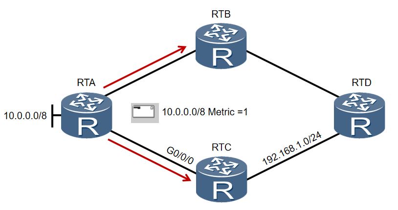

```shell
[RTC]interface GigabitEthernet 0/0/0 
[RTC-GigabitEthernet1/0/0]rip metricin 2
```
本示例中，RTA发送的`10.0.0.0/8`路由条目的度量值为 1，由于在 RTC 的`GigabitEthernet0/0/0`接口上配置了`rip metricin 2`，所以当路由到达 RTC 的接口时，RTC 会将该路由条目的度量值加 2，最后该路由的度量值为 3。
### RIP配置-Metricout
命令`rip metricout`用于路由器在通告 RIP 路由时修改路由的度量值。

一般情况下，在将路由表项转发到下一跳之前，RIP 会将度量值加 1。如果配置了`rip metricout`命令，则只应用命令中配置的度量值。即，当路由器发布一条路由时，此命令配置的度量值会在发布该路由之前附加在这条路由上，但本地路由表中的度量值不会发生改变。

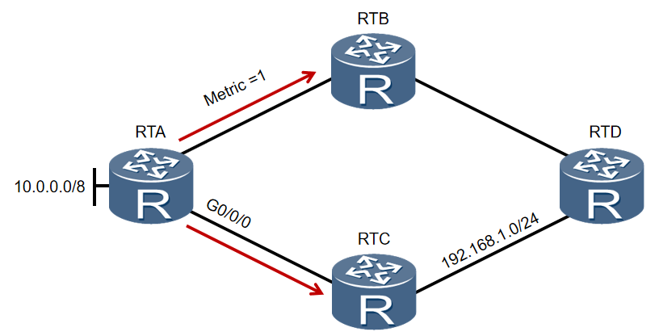

```shell
[RTA]interface GigabitEthernet 0/0/0 
[RTA-GigabitEthernet0/0/0]rip metricout 2
```
在本示例中，缺省情况下，RTA 发送的`10.0.0.0/8`路由条目的度量值为 1。但是，由于在 RTA 的`GigabitEthernet0/0/0`接口上配置了`rip metricout 2`，所以 RTA 会将该路由条目的度量值设置为 2，然后发送给 RTC。

`rip metricin`用于在接收到路由后，给其增加一个附加度量值，再加入自身路由器的路由表中，使得路由表中的度量值发生变化。运行该命令会影响到本地设备和其他设备的路由选择。

`rip metricout`用于自身路由的发布，发布时设置度量值，但自身路由表中的度量值不会发生变化。运行该命令不会影响本地设备的路由选择，但是会影响其他设备的路由选择。

### RIPv2 基础配置
下面的拓扑图中有三台路由器，我们在路由器上部署 RIPv2 ，让网络中的各个网段能够实现互通。


RT1 配置：
```shell
<Huawei>system-view
[Huawei]sysname RT1
[RT1]interface GigabitEthernet 0/0/0
[RT1-GigabitEthernet0/0/0]ip address 192.168.1.1 30
[RT1-GigabitEthernet0/0/0]quit
[RT1]interface GigabitEthernet 0/0/1
[RT1-GigabitEthernet0/0/1]ip address 172.16.1.254 24
[RT1-GigabitEthernet0/0/1]quit
[RT1]rip 1
[RT1-rip-1]version 2
[RT1-rip-1]network 192.168.1.0
[RT1-rip-1]network 172.16.0.0
```
配置说明：
* `rip 1`：数字 1 表示 RIP 的进程 ID。如果不配置，系统会自动生成一个。一个设备运行不同 RIP 进程，使用进程 ID 区分，且相互独立。
* `version 2`：配置 RIP 的版本，这里配置的是 RIPv2。
* `network 192.168.1.0`：`network`命令用于网段的激活。
* `network 172.16.0.0`：需要注意的是`network`命令指定的必须是主类网络地址，而不是子网地址。如果使用`network 172.16.1.0`命令，那么系统会报错，因为`172.16.1.0`是一个子网地址，而不是主类地址。

### RIP 手工路由汇总
```shell
[RT2]interface GigabitEthernet 0/0/0
[RT2-GigabitEthernet0/0/0]rip summary-address 172.16.0.0 255.255.0.0
```
### 配置路由认证
```shell
[RT2]interface GigabitEthernet 0/0/0
[RT2-GigabitEthernet0/0/0]rip authentication-mode md5 usual 123456
# 第二种方式
[RT2-GigabitEthernet0/0/0]rip authentication-mode simple 123456
```