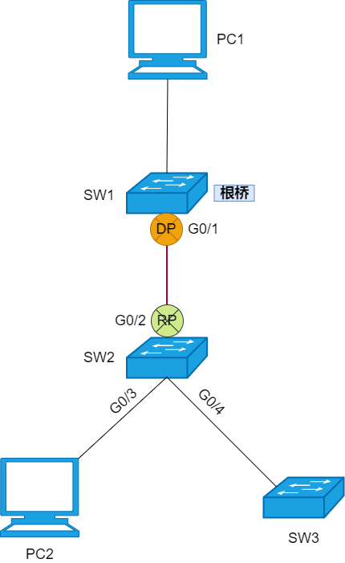

## STP 的弊端
* 网络收敛速度慢：BPDU 的`Max Age`值是 20 秒，接口从侦听到学习状态和从学习到转发状态分别有一个 15 秒的转发延迟时间，因此一个接口从阻塞到转发状态需要 30~50 秒的时间，这段时间内接口无法正常使用。


* 接口状态不合理：STP 接口的禁用、阻塞、侦听状态类似，功能高度重合。

| 状态名称        | 状态描述                                     |
|-------------|------------------------------------------|
| 禁用Disable   | 不能收发BPDU，不能转发数据帧                         |
| 阻塞Blocking  | 端口只能接收并处理BPDU，不能发送BPDU，不能转发数据帧，不会学习MAC地址 |
| 侦听Listening | 可以收发并处理BPDU，但不能转发数据帧，不会学习MAC地址           |

* 拓扑变化依赖计时器：根交换机发送配置 BPDU 的`Hello Time`是 2 秒，非根交换机即使没收到 BPDU，也要在`Max Age`的 20 秒后，才会重新计算 STP。


:::info
什么是收敛？

收敛是指网络进入稳定状态。比如在 STP 中所有接口获得接口角色，进入转发或阻塞状态。收敛时间是指网络从发生变化到进入稳定状态的时间。
:::
## RSTP
鉴于 STP 的优缺点都很明显，弃之又觉得可惜，还是抢救一下吧。于是升级版的 RSTP 出现了，对 STP 进行了大量的改进。

RSTP 增加新的接口角色，其中的替代接口可在交换机的根接口失效时，立即成为新的根接口，获取新的路径到达根桥。RSTP 使用 P/A 机制，让指定接口能够快速进入转发状态，而不用像 STP 那样经过`Forward Delay`时间。RSTP 还新增边缘接口的概念，让交换机接入终端设备的接口立即进入转发状态。
### RSTP 接口角色
RSTP 在 STP 的基础上增加了接口角色，4 种接口角色分别是：根接口（RP）、指定接口（DP）、替代接口（`Alternate Port ，AP`）和备份接口（`Backup Port ，BP`）。根接口和指定接口与 STP 中定义相同，对于 STP 的非根非指定接口，RSTP 将其分为两种，一种是替代接口，另一种是备份接口。

| STP接口角色 | RSTP接口角色   |
|---------|------------|
| 根接口     | 根接口<br>RP  |
| 指定接口    | 指定接口<br>DP |
| 非根非指定接口 | 替代接口<br>AP |
| 非根非指定接口 | 备份接口<br>BP |

#### 替代接口（Alternate Port，AP）
替代接口就是根接口的备份，由于收到其它交换机发送的更优 BPDU 而被阻塞的接口。如果根接口发生故障，那么替代接口会成为新的根接口。接口切换过程中，无需延时，无需 BPDU 交互，立马进入到转发状态。一台交换机如果是非根桥，那么它有且只有一个根接口，但是这台交换机可以没有替代接口，也可以有，当有替代接口时，可以有一个或多个。当交换机的根接口发生故障时，最优的替代接口将成为新的根接口。


如上图所示，SW1 是网络中的根桥，SW3 有两个接口接入到网络中，由于`G0/11`比`G0/12`到达根桥的 RPC 更小，`G0/11`成为 SW3 的根接口。`G0/12`收到 SW2 发送的 BPDU，经过 SW3 计算后决定阻塞，成为 SW3 的替代接口。
#### 备份接口（Backup Port，BP）
备份接口也是指定接口的备份，备份接口是交换机收到了自己发送的 BPDU 而被阻塞的接口。如果一台交换机的多个接口在同一个物理网段内，其中一个选举为指定接口，其它接口选举为备份接口且处于丢弃状态，备份接口作为这个网段到达根桥的冗余接口。如果交换机的指定接口发生故障，最优的备份接口成为新的指定接口，为根交换机与这条链路提供另一条转发通道，实现与这个网段的数据交互。

备份接口通常在这两种情况下出现，一种是交换机的多个接口连接到一台集线器（Hub）上，但是集线器和共享网络几乎绝迹。另一种情况是同一台交换机的两个接口通过一条网线连接起来，这种通常是人为的误操作。因此备份接口比较少见。


如上图所示，SW1 是网络中的根桥，SW2 的`G0/11`和`G0/12`接口形成自环，RSTP 能够检测到这个环路，并在这两个接口中选择一个进行阻塞。由于`G0/11`接口的接口 ID 更小，成为 SW2 的指定接口，而`G0/12`接口成为备份接口，备份接口被阻塞。


如上图所示，SW2 的两个接口连接在同一台集线器（Hub）上，集线器收到数据后会拷贝到其它所有接口，而且集线器不支持 STP/RSTP，因此 SW2 从`G0/11`接口发出的 BPDU 会被集线器发送到 SW2 的`G0/12`接口，反之亦然。当 SW2 的指定接口`G0/11`出现故障时，备份接口`G0/12`将接替它的工作，负责与相应的网段实现数据交互。
### RSTP 接口状态
STP 有 5 种接口状态，分别是禁用、阻塞、侦听、学习和转发，而 RSTP 对接口状态进行了简化，把禁用、阻塞、侦听状态合并为丢弃状态（`Discarding`）。因为这三类状态的功能区别不大，接口都不学习 MAC 地址，也不转发数据，这也是丢弃状态接口的处理方式。那么 RSTP 就是 3 种状态，即丢弃状态（`Discarding`）、学习状态（`Learning`）和转发状态（`Forwarding`）。学习和转发状态保持不变，和 STP 中的定义相同。

| STP接口状态                                       | RSTP接口状态         |
|-----------------------------------------------|------------------|
| 禁用(Disabled)<br>阻塞(Blocking)<br>侦听(Listening) | 丢弃(Discarding)   |
| 学习(Learning)                                  | 学习(Learning)     |
| 转发(Forwarding)                                | 转发(Forwarding)   |

### 边缘接口
如果交换机的接口连接的是终端设备，比如 PC、服务器、打印机等，而不是其它交换机的接口，那么这些接口不太可能造成环路。我们就可以将交换机的接口配置为边缘接口（`Edge Port`），边缘接口默认不参加生成树计算。当边缘接口被开启后，立即切换到转发状态并开始收发数据流量，而不用经历转发延迟时间，提升网络效率。边缘接口的开启和关闭都不会触发 RSTP 拓扑变更。


### P/A 机制
在 STP 中，交换机的一个接口成为指定接口后，还需要经过侦听和学习状态，即经过 30 秒时间，才能进入转发状态。而 RSTP 引入 P/A 机制（`Proposal/Agreement`，握手/赞同），让指定接口与对端接口进行握手，并逐级进行传递避免环路，这个过程不使用计时器。也就是说，完成握手的 RSTP 指定接口从丢弃状态直接进入到转发状态，而不需要经过其它状态，加速生成树的收敛。


`Proposal`消息和`Agreement`消息都是 BPDU。交换机通过 BPDU 中的`Flag`（标记）字段来标识 BPDU 的不同类型，包括`Proposal BPDU`和`Agreement BPDU`。


如上图所示，在 SW1 和 SW2 新增一条链路，由于 SW1 的桥优先级最高，成为这个网络中的根桥，SW1 的`G0/1`接口成为指定接口，SW2 的`G0/2`接口成为根接口。如果是运行 STP，那么指定接口和根接口必须经历侦听和学习状态才能进入转发状态。

如果网络中运行的是 RSTP，当 SW1 与 SW2 之间新增一条链路后。
1. SW1 和 SW2 马上在各自的接口上发送 BPDU ，开始的时候双方都认为自己是根桥。
	 
2. 经过 BPDU 交互后，SW2 认为 SW1 才是根桥。这时 SW1 的`G0/1`接口成为指定接口，SW2 的`G0/2`接口则成为根接口，并马上停止发送 BPDU。这两个接口都处于丢弃状态。
	 
3. 接下来 P/A 过程会发生在 SW1 和 SW2 之间。SW1 从`G0/1`接口发送`Proposal`消息，希望自己能够立刻进入转发状态。
	 
4. 而 SW2 在收到`Proposal`消息后，首先会判断接收`Proposal`消息的接口是不是根接口。在确认自己收到`Proposal`的接口是根接口后，SW2 为了避免出现环路，阻塞自己所有非边缘的指定接口，使这些接口都进入到丢弃状态，这个操作称为 P/A 同步机制。边缘接口不参与这个过程。
	 
5. 在 SW2 所有接口完成同步后，SW2 清楚的知道自己的接口不存在环路，马上将根接口`G0/2`切换到转发状态，并从根接口向 SW1 发送`Agreement`消息。
	 
6. SW1 在`G0/1`接口上收到`Agreement`消息后，立刻将`G0/1`接口切换成转发状态，这时 PC1 和 PC2 就可以通信了。
	 

整个 P/A 过程很快就完成了，在新增链路后的极短时间内，PC2 就可以和 PC1 通信。另外，由于 SW2 的指定接口`G0/4`还是处于丢弃状态，那么这个接口也会向下游交换机发起一个 P/A 过程。
### 保护功能
交换机有多种保护功能，用于提升生成树协议的稳定性。
#### 1、BPDU保护（BPDU Protection）
当边缘接口收到 BPDU 后，会马上变成一个普通的 RSTP 接口，可能引发网络中 RSTP 重新计算，从而对网络造成影响。通常边缘接口连接终端设备，应该不会收到 BPDU，但是如果误接了交换机，那么这个边缘接口就有可能收到 BPDU，会引入环路隐患。还有一种情况是恶意用户连接边缘接口后，发起 BPDU 攻击，也会对网络造成很大影响。

通过在交换机上开启 BPDU 保护功能就可以解决这个问题。当交换机开启这个功能后，如果边缘接口收到 BPDU，那么交换机马上把接口关闭，置为`Error-Down`，同时触发告警。


如果受到保护的边缘接口因为收到 BPDU 而被关闭，默认情况下是不会自动恢复的，需要在交换机上手动执行命令开启来恢复接口。除此之外，还可以手动设置接口自动恢复功能，在指定时间后自动恢复。
#### 根保护（Root Protection）
RSTP 根据根桥计算出无环拓扑，根桥是很重要的。在已经完成收敛的 RSTP 网络中，如果根桥发生变化，那么 RSTP 就会重新计算，重新计算时网络将不可用。通常我们会选择网络中性能最好和位置最重要的设备作为根桥，将其优先级设置为最小值 0 ，但是这个措施并不能保证这个设备永远是网络中的根桥，毕竟根桥的角色是可以抢占的。如果网络中新接入的交换机优先级被配置为 0 ，恰好 MAC 地址比根桥更小，那么新交换机将抢占成为新的根桥，还会造成网络的 RSTP 重新计算，从而对网络造成影响。


在交换机的相关接口部署根保护功能，就可以规避这个问题。当根桥的指定接口开启根保护功能后，这个指定接口如果收到更优的 BPDU，就会过滤这个 BPDU，并将接口切换至丢弃状态，这样根桥的地位就可以保持。如果这个指定接口不再收到更优的 BPDU，那么两倍的转发延迟时间后，接口自动恢复到转发状态。
#### 环路保护（Loop Protection）
当网络中出现线路单向故障或者网络拥塞时，交换机的根接口和丢弃状态的替代接口将无法正常接收 BPDU，就会导致交换机重新进行 RSTP 重新计算，接口的角色和状态会发生变化，可能会在网络中引入环路。


如上图所示，SW1 是根桥，SW3 的`G0/11`是根接口，`G0/12`是替代接口处于丢弃状态。SW3 的`G0/12`接口虽然处于丢弃状态，但是会持续侦听 BPDU。当网络正常时，SW3 会在`G0/12`接口上周期性的收到 BPDU。如果 SW2 和 SW3 的链路出现单向故障，从 SW2 到 SW3 不通，从 SW3 到 SW2 正常。那么 SW3 的`G0/12`接口无法收到 SW2 发送的 BPDU，导致 SW3 认为`G0/12`接口的上游设备故障。过了`Max Age`时间后，SW3 的`G0/12`接口会成为指定接口，并切换到转发状态，然后开始发送流量。但是 SW2 并未发生故障，因此一旦 SW3 的`G0/12`接口切换到转发状态，网络中便出现了环路。

使用环路保护功能可以规避这个问题：
* 在根接口上开启环路保护功能后，如果根接口长时间没有收到 BPDU，交换机会重新选举根接口，原来的根接口调整为指定接口，且接口状态切换成丢弃状态，从而避免出现环路。
* 在替代接口上开启环路保护功能后，如果替代接口长时间没有收到 BPDU，交换机会把替代接口调整为指定接口，且接口状态保持在丢弃状态，从而避免出现环路。

#### 拓扑变更保护（TC Protection）
一个稳定的网络是不会频繁出现拓扑变更的，一旦网络拓扑出现变更，TC BPDU（ TC 置位的 BPDU）会泛洪到全网，而 TC BPDU 会让交换机执行 MAC 地址表删除的操作。如果网络环境很不稳定，导致 TC BPDU 频繁的泛洪，或者是网络中存在恶意用户，发送大量的 TC BPDU 对网络进行攻击，那么会极大消耗交换机的性能。交换机开启拓扑变更保护功能后，默认将在 2 秒内只进行一次的 TC BPDU 处理，如果在 2 秒内收到了 2 个及以上的 TC BPDU，那么交换机只会处理一次，对于超出的部分，必须等待 2 秒后才进行处理。

### BPDU
RSTP 的配置 BPDU 称为 RST BPDU（`Rapid Spanning Tree BPDU`），它的格式和 STP 的配置 BPDU 差不多，只有个别字段做了修改。RST BPDU 的“协议版本 ID” 字段值是`0x02`，“BPDU 类型”字段值是`0x02`。主要变化是在“标志”字段，这个字段一共 8 bit，STP 只使用了最高比特位和最低比特位，而 RSTP 使用了剩余的 6 个比特位，并对这些比特位分别进行了定义。


RST BPDU 的 `Aggrement`（同意）和 `Proposal`（提议）比特位用于 P/A（`Proposal/Aggrement`）机制。`Port Role`（接口角色）比特位是 2 bit，用于标识 RST BPDU 发送接口的接口角色，01 表示根接口，10 表示替代接口，11 表示指定接口，而 00 保留使用。最后的`Forwarding`（转发）和`Learning`（学习）比特位表示 RST BPDU 发送接口的接口状态。RSTP 与 STP 不同，在网络收敛后，无论是根桥还是非根桥，都会周期性的发送配置 BPDU，对于非根桥，不需要在根接口收到 BPDU 之后而产生自己的配置 BPDU，而是自发的、周期性发送 BPDU。
## MSTP
虽然 RSTP 对 STP 进行了改进，但是还有一个缺陷，那就是所有 VLAN 共用一棵生成树。这样就无法实现负载分担，导致线路带来利用率低、设备资源利用率低。


如果有一种生成树协议，基于 VLAN 进行生成树的计算，那么这种技术有哪些优缺点？优点很明显，交换机为每一个 VLAN 单独计算一棵生成树，可以实现流量的负载分担。但是也有一个缺陷，如果网络中的 VLAN 数量很多，那么所有交换机都要为每一个 VLAN 计算一棵生成树，那么设备的资源消耗巨大，甚至会影响到正常流量的处理。


为了解决这个问题，MSTP（`Multiple Instances Spanning Tree Protocol`）出现了，兼容 STP 和 RSTP。生成树不是基于 VLAN 运行的，而是基于`Instance`（实例）运行的。`Instance`是一个或多个 VLAN 的集合。

我们可以将一个或多个 VLAN 映射到一个`Instance`，然后 MSTP 基于`Instance`计算生成树。基于`Instance`的生成树称为 MSTI（`Multiple Spanning Tree Instance`，多生成树实例），MSTP 为每一个`Instance`维护独立的 MSTI。映射到同一个 `Instance` 的 VLAN 共享一棵生成树。可根据实际需求，在交换机上创建多个`Instance`，然后将指定的 VLAN 映射到相应的`Instance`。一个`Instance`可以包含多个 VLAN，但是一个 VLAN 只能被映射到一个`Instance`。

在创建`Instance`后，我们可以对 MSTI 进行主根桥、次根桥、接口优先级或`Cost`等配置。如果网络中有大量 VLAN，那么我们可以将 VLAN 按照一定规律分别映射到不同的`Instance`中，从而实现负载分担，而交换机仅对这几个`Instance`进行生成树计算，设备资源消耗大大降低。


MSTP 引入了域（`Region`）的概念，我们可以将网络划分成多个 MST 域（`Multiple Spanning Tree Region`，多生成树域），一个 MST 域可以包含一台或多台交换机，同一个 MST 域的交换机必须配置相同的域名（`Region Name`）、相同的修订级别（`Revision Level`），以及相同的 VLAN 与`Instance`的映射关系。

## 替代方案
学完 STP/RSTP/MSTP 后，解决网络中的二层环路问题，想到的解决方案就是生成树协议。但是生成树协议有天生的缺陷，收敛速度慢，虽然 RSTP/MSTP 对 STP 进行了改进，但是在毫秒级切换的要求下，生成树就不适用了。而且生成树的原理是将环路中的接口进行阻塞，导致被阻塞的线路无法承载流量，造成网络资源的浪费。MSTP 在这方面进行了优化，让不同 VLAN 的流量可以在不同线路进行负载分担，可是对于单个 VLAN 来说，始终会有一些线路无法承载流量。现在已经有许多其它技术或解决方案用于替代生成树协议。
### 1、Smart Link
`Smart Link` 是为双上行组网定做的解决方案。


如上图所示，交换机 SW3 一条上行链路连接 SW1，另一条上行链路连接 SW2。在 SW3 上创建`Smart Link`组，将 SW3 的两个上行接口添加到这个组里，`G0/1`口指定为`Master`接口、`G0/2`口指定为 `Slave` 接口。默认只有`Master`接口是活跃的（`Active`），这个接口可以正常收发流量，而`G0/2`接口会被阻塞（`Inactive`）。这样网络中的二层环路将被打破。


如上图所示，当 SW3 的`G0/1`接口发生故障，或者线路发生故障，`Smart Link`会马上感知到，并且实现毫秒级的快速切换，`G0/2`接口将立即切换到`Active`状态，并开始收发流量。在`Smart Link`切换过程中，SW3 还可以使用`Flush`报文去刷新上联设备，即 SW1 和 SW2 的 MAC 地址表等数据，加快网络收敛。

`Smart Link`配置简单，切换时间快。由于工作机制的限制，只能适用于特定的双上行组网场景。SW1 、SW2 和 SW3 使用`Smart Link`防环后，也就不需要使用生成树协议了。

#### 2、iStack/CSS
iStack 是华为盒式交换机的堆叠技术。而 CSS（ Cluster Switch System ，集群交换系统）是华为框式交换机的集群技术。
:::info
什么是堆叠？

所谓堆叠，是指多台物理交换机通过特定的线缆连接，并通过相应的配置，组成逻辑上的一台设备的技术。

:::

STP/RSTP/MSTP 或`Smart Link`都是采用阻塞特定接口的方式实现网络的无环化，使得网络资源得不到充分利用。一旦使用堆叠/集群技术，情况就不一样了。如上图所示，假设 SW1 和 SW2 都是盒式交换机，且都支持 iStack，那么可以使用堆叠线缆把 SW1 和 SW2 连接起来，然后组建堆叠系统，建立完成后，SW1 和 SW2 不再是两台单独的交换机，而是一个有两个槽位的框式交换机。那么网络结构将大大简化，由于 SW1 和 SW2 在逻辑上是一台设备，设备的管理和配置将变得简单。SW3 分别与 SW1、SW2 互联的线路，现在可以看做是两台交换机之间的两条链路，我们可以将这两条链路进行聚合，这样网络中将不存在二层环路，也无需部署防环技术。而且所有的链路都处于工作状态，没有接口被阻塞，设备资源和链路资源的利用率将最大化。
### 3、无二层环路场景


在一些网络中，我们会人为的将网络中的二层环路打破，从而规避防环技术的应用。如上图所示，汇聚层交换机 DSW1 、DSW2 与接入层交换机 ASW1、ASW2 构成一个倒 U 型组网，ASW1 和 ASW2 之间未连线，因此这四台交换机组成的网络中，并不存在二层环路，也就无需使用生成树技术或其它防环技术了。

这个网络中，服务器使用了双上行链路，服务器的两张网卡以主备的方式运行，假设连接 ASW1 的网卡为主网卡。如果 ASW1 和 DSW1 的链路发生故障，服务器是无法感知到的，依然会从主网卡发送数据，而数据到达 ASW1 后被丢弃。一种解决方案就是在服务器上部署相应的应用程序，周期性的从主网卡发出探测报文，来探测到默认网关的可达性，DSW1 和 DSW2 上配置服务器的默认网关，如果发现主网卡到默认网关不可达，则自动将流量切换到备网卡。

另一种解决方案就是使用华为的`Monitor Link`技术。`Monitor Link`是一种接口联动技术，交换机部署后会持续监控`Monitor Link`的上行接口（可指定接口），当上行接口发生故障时，交换机马上将下行接口（可指定接口）关闭。ASW1 可部署`Monitor Link`技术，将 DSW1 的接口配置为上行接口，将连接服务器网卡的接口配置为下行接口。这样的话，当 ASW1 的上行接口发生故障，交换机立马将连接服务器的下行接口关闭，从而使得服务器立即感知到故障的发生，然后将连接 ASW2 的网卡切换成主网卡，并在新的主网卡上发送数据。
## 总结
STP 可以在网络中形成一棵无环路的树，解决环路故障并实现冗余备份。


RSTP 在 STP 功能基础上，通过替代接口让根接口快速进入转发状态、采用 P/A 机制和设置边缘接口等方法，实现了更快的收敛速度。


MSTP 则在大规模、多 VLAN 环境下形成多个生成树实例，从而提供多 VLAN 负载均衡。


MSTP 同时兼容 STP、RSTP，运行 MSTP 的设备可以识别 STP、RSTP 两种协议报，并应用于生成树计算。

另外 RSTP/MSTP 与 STP 的接口状态不同，从 STP 的 5 种变成 3 种。

| STP接口状态                                       | RSTP接口状态         |
|-----------------------------------------------|------------------|
| 禁用(Disabled)<br>阻塞(Blocking)<br>侦听(Listening) | 丢弃(Discarding)   |
| 学习(Learning)                                  | 学习(Learning)     |
| 转发(Forwarding)                                | 转发(Forwarding)   |

RSTP/MSTP 中，把禁用、阻塞、侦听三种状态合并为丢弃状态，减少状态数量，简化生成树计算，加快收敛速度。


RSTP/MSTP 有更快的收敛速度，简化的端口状态；MSTP 能够实现不同 VLAN 的负载分担。因此尽量使用 MSTP 来避免环路。

## 实战
### RSTP 功能
#### 替代接口
我们用 3 台交换机搭建一个网络环境，部署 RSTP 对网络进行破环，验证 RSTP 新增的替代接口角色。替代接口是根接口的备份。

**实验拓扑**


**实验要求**

三台交换机（SW）配置 RSTP 功能，在 SWC 上使用命令查看替代接口。

**操作步骤**

1. 三台 SW 按照网络拓扑图，对相应的接口进行连接。SW 默认的生成树工作模式是 MSTP。在三台交换机上分别配置工作模式从默认的 MSTP 改成 RSTP，并且启动 STP 功能。`stp mode`命令用来修改交换机的工作模式。
```shell
[SWA]stp ?
  bpdu-filter           STP BPDU filter
  bpdu-protection       Specify BPDU protection function
  bridge-diameter       Specify bridge diameter
  converge              Specify STP converge mode
  disable               Disable Spanning Tree Protocol (STP)
  edged-port            Specify edge port
  enable                Enable Spanning Tree Protocol (STP)
  instance              Spanning tree instance
  max-hops              Specify max hops
  mcheck                Specify mcheck
  mode                  Specify state machine mode
  pathcost-standard     Specify STP port path cost standard
  priority              Specify bridge priority
  process               The MSTP process
  region-configuration  Enter MSTP region view
  root                  Specify root switch
  snooping              STP snooping
  tc-protection         Enable the TC-BPDU Protection function
  timer                 Specify timer configuration
  timer-factor          Specify aged out time factor

[SWA]stp mode ?
  mstp  Multiple Spanning Tree Protocol (MSTP) mode
  rstp  Rapid Spanning Tree Protocol (RSTP) mode
  stp   Spanning Tree Protocol (STP) mode

[SWA]stp mode rstp
[SWA]stp enable
```
```shell
#SWB
[SWB]stp mode rstp
[SWB]stp enable
```
```shell
#SWC
[SWC]stp mode rstp
[SWC]stp enable
```

**功能验证**

1. 在设备上使用`display stp`命令查看 RSTP 状态，发现 SWA 的 MAC 地址最小，选举为根桥。SWA 的桥 ID 是`32768.4c1f-cca3-01f2`，其中 32768 是 SWA 的优先级值，`4c1f-cca3-01f2`是 SWA 的 MAC 地址。根桥的 MAC 地址是 SWA 的 MAC 地址，说明 SWA 就是根桥。
```shell
[SWA]display stp
-------[CIST Global Info][Mode RSTP]-------
CIST Bridge         :32768.4c1f-cca3-01f2
Config Times        :Hello 2s MaxAge 20s FwDly 15s MaxHop 20
Active Times        :Hello 2s MaxAge 20s FwDly 15s MaxHop 20
CIST Root/ERPC      :32768.4c1f-cca3-01f2 / 0
CIST RegRoot/IRPC   :32768.4c1f-cca3-01f2 / 0
CIST RootPortId     :0.0
BPDU-Protection     :Disabled
TC or TCN received  :5
TC count per hello  :0
STP Converge Mode   :Normal 
Time since last TC  :0 days 0h:0m:25s
Number of TC        :7
Last TC occurred    :GigabitEthernet0/0/2
----[Port1(GigabitEthernet0/0/1)][FORWARDING]----
 Port Protocol       :Enabled
 Port Role           :Designated Port
 Port Priority       :128
 Port Cost(Dot1T )   :Config=auto / Active=20000
 Designated Bridge/Port   :32768.4c1f-cca3-01f2 / 128.1
 Port Edged          :Config=default / Active=disabled
 Point-to-point      :Config=auto / Active=true
 Transit Limit       :147 packets/hello-time
 Protection Type     :None
 Port STP Mode       :RSTP 
 Port Protocol Type  :Config=auto / Active=dot1s
 BPDU Encapsulation  :Config=stp / Active=stp
 PortTimes           :Hello 2s MaxAge 20s FwDly 15s RemHop 20
 TC or TCN send      :5
 TC or TCN received  :1
 BPDU Sent           :35             
          TCN: 0, Config: 0, RST: 35, MST: 0
 BPDU Received       :3             
          TCN: 0, Config: 0, RST: 3, MST: 0
----[Port2(GigabitEthernet0/0/2)][FORWARDING]----
 Port Protocol       :Enabled
 Port Role           :Designated Port
 Port Priority       :128
 Port Cost(Dot1T )   :Config=auto / Active=20000
 Designated Bridge/Port   :32768.4c1f-cca3-01f2 / 128.2
 Port Edged          :Config=default / Active=disabled
 Point-to-point      :Config=auto / Active=true
 Transit Limit       :147 packets/hello-time
 Protection Type     :None
 Port STP Mode       :RSTP 
 Port Protocol Type  :Config=auto / Active=dot1s
 BPDU Encapsulation  :Config=stp / Active=stp
 PortTimes           :Hello 2s MaxAge 20s FwDly 15s RemHop 20
 TC or TCN send      :3
 TC or TCN received  :3
 BPDU Sent           :39             
          TCN: 0, Config: 0, RST: 39, MST: 0
 BPDU Received       :7             
          TCN: 0, Config: 0, RST: 7, MST: 0
```
```shell
[SWB]display stp
-------[CIST Global Info][Mode RSTP]-------
CIST Bridge         :32768.4c1f-ccf8-6e53
Config Times        :Hello 2s MaxAge 20s FwDly 15s MaxHop 20
Active Times        :Hello 2s MaxAge 20s FwDly 15s MaxHop 20
CIST Root/ERPC      :32768.4c1f-cca3-01f2 / 20000
CIST RegRoot/IRPC   :32768.4c1f-ccf8-6e53 / 0
CIST RootPortId     :128.1
BPDU-Protection     :Disabled
TC or TCN received  :16
TC count per hello  :0
STP Converge Mode   :Normal 
Time since last TC  :0 days 0h:0m:50s
Number of TC        :7
Last TC occurred    :GigabitEthernet0/0/1
----[Port1(GigabitEthernet0/0/1)][FORWARDING]----
 Port Protocol       :Enabled
 Port Role           :Root Port
 Port Priority       :128
 Port Cost(Dot1T )   :Config=auto / Active=20000
 Designated Bridge/Port   :32768.4c1f-cca3-01f2 / 128.1
 Port Edged          :Config=default / Active=disabled
 Point-to-point      :Config=auto / Active=true
 Transit Limit       :147 packets/hello-time
 Protection Type     :None
 Port STP Mode       :RSTP 
 Port Protocol Type  :Config=auto / Active=dot1s
 BPDU Encapsulation  :Config=stp / Active=stp
 PortTimes           :Hello 2s MaxAge 20s FwDly 15s RemHop 0
 TC or TCN send      :1
 TC or TCN received  :4
 BPDU Sent           :2             
          TCN: 0, Config: 0, RST: 2, MST: 0
 BPDU Received       :46             
          TCN: 0, Config: 0, RST: 46, MST: 0
----[Port2(GigabitEthernet0/0/2)][DISCARDING]----
 Port Protocol       :Enabled
 Port Role           :Alternate Port
 Port Priority       :128
 Port Cost(Dot1T )   :Config=auto / Active=20000
 Designated Bridge/Port   :32768.4c1f-cca9-09a0 / 128.2
 Port Edged          :Config=default / Active=disabled
 Point-to-point      :Config=auto / Active=true
 Transit Limit       :147 packets/hello-time
 Protection Type     :None
 Port STP Mode       :RSTP 
 Port Protocol Type  :Config=auto / Active=dot1s
 BPDU Encapsulation  :Config=stp / Active=stp
 PortTimes           :Hello 2s MaxAge 20s FwDly 15s RemHop 0
 TC or TCN send      :0
 TC or TCN received  :4
 BPDU Sent           :2             
          TCN: 0, Config: 0, RST: 2, MST: 0
 BPDU Received       :50             
          TCN: 0, Config: 0, RST: 50, MST: 0
```
```shell
[SWC]display stp
-------[CIST Global Info][Mode RSTP]-------
CIST Bridge         :32768.4c1f-cca9-09a0
Config Times        :Hello 2s MaxAge 20s FwDly 15s MaxHop 20
Active Times        :Hello 2s MaxAge 20s FwDly 15s MaxHop 20
CIST Root/ERPC      :32768.4c1f-cca3-01f2 / 20000
CIST RegRoot/IRPC   :32768.4c1f-cca9-09a0 / 0
CIST RootPortId     :128.1
BPDU-Protection     :Disabled
TC or TCN received  :6
TC count per hello  :0
STP Converge Mode   :Normal 
Time since last TC  :0 days 0h:1m:51s
Number of TC        :8
Last TC occurred    :GigabitEthernet0/0/2
----[Port1(GigabitEthernet0/0/1)][FORWARDING]----
 Port Protocol       :Enabled
 Port Role           :Root Port
 Port Priority       :128
 Port Cost(Dot1T )   :Config=auto / Active=20000
 Designated Bridge/Port   :32768.4c1f-cca3-01f2 / 128.2
 Port Edged          :Config=default / Active=disabled
 Point-to-point      :Config=auto / Active=true
 Transit Limit       :147 packets/hello-time
 Protection Type     :None
 Port STP Mode       :RSTP 
 Port Protocol Type  :Config=auto / Active=dot1s
 BPDU Encapsulation  :Config=stp / Active=stp
 PortTimes           :Hello 2s MaxAge 20s FwDly 15s RemHop 0
 TC or TCN send      :3
 TC or TCN received  :0
 BPDU Sent           :5             
          TCN: 0, Config: 0, RST: 5, MST: 0
 BPDU Received       :70             
          TCN: 0, Config: 0, RST: 70, MST: 0
----[Port2(GigabitEthernet0/0/2)][FORWARDING]----
 Port Protocol       :Enabled
 Port Role           :Designated Port
 Port Priority       :128
 Port Cost(Dot1T )   :Config=auto / Active=20000
 Designated Bridge/Port   :32768.4c1f-cca9-09a0 / 128.2
 Port Edged          :Config=default / Active=disabled
 Point-to-point      :Config=auto / Active=true
 Transit Limit       :147 packets/hello-time
 Protection Type     :None
 Port STP Mode       :RSTP 
 Port Protocol Type  :Config=auto / Active=dot1s
 BPDU Encapsulation  :Config=stp / Active=stp
 PortTimes           :Hello 2s MaxAge 20s FwDly 15s RemHop 20
 TC or TCN send      :2
 TC or TCN received  :0
 BPDU Sent           :71             
          TCN: 0, Config: 0, RST: 71, MST: 0
 BPDU Received       :0             
          TCN: 0, Config: 0, RST: 0, MST: 0
```
2. SWB 有两个接口接入网络，由于从`GE0/0/1`到达根桥的 RPC 更小，因此`GE0/0/1`成为 SWB 的根接口，`GE0/0/2`成为替代接口。使用`display stp brief`命令查看 RSTP 接口的状态。`Role`为`ROOT`时表示根接口，`Role`为`DESI`（即`Designated`）时表示指定接口，SWB 的`GigabitEthernet0/0/2`为`ALTE`（即`Alternate`）表示替代接口。接口状态符合预期，实验成功！
```shell
[SWA]display stp brief 
 MSTID  Port                        Role  STP State     Protection
   0    GigabitEthernet0/0/1        DESI  FORWARDING      NONE
   0    GigabitEthernet0/0/2        DESI  FORWARDING      NONE
```
```shell
[SWB]display stp brief 
 MSTID  Port                        Role  STP State     Protection
   0    GigabitEthernet0/0/1        ROOT  FORWARDING      NONE
   0    GigabitEthernet0/0/2        ALTE  DISCARDING      NONE
```
```shell
[SWC]display stp brief 
 MSTID  Port                        Role  STP State     Protection
   0    GigabitEthernet0/0/1        ROOT  FORWARDING      NONE
   0    GigabitEthernet0/0/2        DESI  FORWARDING      NONE
```
3. 还可以抓包查看替代接口的 BPDU 报文，详细分析字段代表的含义，深入理解 RSTP。


#### 备份接口
RSTP 新增了备份接口角色，是指定接口的备份，搭建网络实验进行验证。

**实验拓扑**


**实验要求**

在替代接口的实验拓扑基础上，新增一台 HUB，连接 SWC 的两个接口，使用命令查看备份接口。操作步骤按照网络拓扑图，新增一台 HUB，并连接相应的接口。对应 SWC 来说，它的`Ethernet0/0/1`和`Ethernet0/0/2`接口形成环路，RSTP 能够检测到，并在两个接口中选择一个阻塞。

**功能验证**

在 SWC 中，`Ethernet0/0/1`接口的接口 ID 更小，成为指定接口，而`Ethernet0/0/2`接口成为备份接口，备份接口被阻塞。在 SWC 上使用`display stp brief`命令查看接口状态，接口状态符合预期，实验成功！
```shell
[SWC]display stp brief 
 MSTID  Port                        Role  STP State     Protection
   0    GigabitEthernet0/0/1        ROOT  FORWARDING      NONE
   0    GigabitEthernet0/0/2        DESI  FORWARDING      NONE
   0    Ethernet0/0/1               DESI  FORWARDING      NONE
   0    Ethernet0/0/2               BACK  DISCARDING      NONE
```
#### 边缘接口
RSTP 新增的边缘接口角色不参与生成树的计算，当边缘接口开启后，立即切换到转发状态并开始收发流量。

**实验拓扑**

**实验要求**
* 在替代接口的实验拓扑基础上，新增两台 PC，分别连接 SWC 的两个接口，其中一个接口使用默认配置，观察接口状态。
* 另一个接口配置边缘接口，查看接口状态变化。

**操作步骤**
1. 新增 PC1，连接 SWC 的`Ethernet0/0/1`接口。
2. 在 SWC 的`Ethernet0/0/2`接口使用命令`stp edged-port enable`配置成边缘接口。新增 PC2 连接`Ethernet0/0/2`接口。
```shell
[SWC]interface Ethernet 0/0/2
[SWC-Ethernet0/0/2]stp edged-port enable
```

**功能验证**

新增 PC1 时，使用`display stp brief`命令查看 SWC 的`Ethernet0/0/1`接口状态。未配置边缘接口时，接口状态从`Discarding`到`Learning` 15 秒时间，`Learning`再到 `Forwarding` 15 秒时间。
```shell
[SWC]display stp brief 
 MSTID  Port                        Role  STP State     Protection
   0    GigabitEthernet0/0/1        ROOT  FORWARDING      NONE
   0    GigabitEthernet0/0/2        DESI  FORWARDING      NONE
   0    Ethernet0/0/1               DESI  DISCARDING      NONE
   
[SWC]display stp brief 
 MSTID  Port                        Role  STP State     Protection
   0    GigabitEthernet0/0/1        ROOT  FORWARDING      NONE
   0    GigabitEthernet0/0/2        DESI  FORWARDING      NONE
   0    Ethernet0/0/1               DESI  LEARNING        NONE
   
[SWC]display stp brief 
 MSTID  Port                        Role  STP State     Protection
   0    GigabitEthernet0/0/1        ROOT  FORWARDING      NONE
   0    GigabitEthernet0/0/2        DESI  FORWARDING      NONE
   0    Ethernet0/0/1               DESI  FORWARDING      NONE
```
2. 新增 PC2 时，使用`display stp brief`命令查看 SWC 的`Ethernet0/0/2`接口状态。配置边缘接口时，接口直接切换到`Forwarding`状态并开始收发数据，而不用经历`Forward Delay`时间。
```shell
[SWC]display stp brief 
 MSTID  Port                        Role  STP State     Protection
   0    GigabitEthernet0/0/1        ROOT  FORWARDING      NONE
   0    GigabitEthernet0/0/2        DESI  FORWARDING      NONE
   0    Ethernet0/0/1               DESI  FORWARDING      NONE
   0    Ethernet0/0/2               DESI  FORWARDING      NONE
```
### RSTP 保护功能


