## 网络环路
网络通信中，通常是以一条链路能够正常工作为前提，如果链路断开或节点故障，那么互联的设备就无法正常通信了，这类网络问题叫做单点故障。没有备份的链路或节点，出现故障会直接断网。

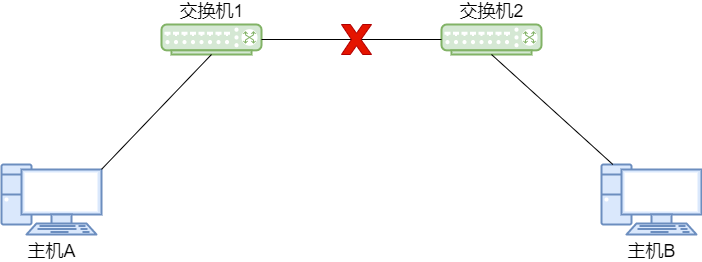

如果要提供 24 小时不间断的服务，那就需要在网络中提前部署冗余。避免出现单点故障，合理的做法是在网络中的关键设备和关键链路添加冗余。在冗余的网络环境中，任意一条链路发生故障断开，都不会影响网络，直接使用其它链路继续转发数据，解决单点故障的隐患。

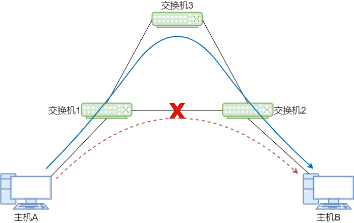

但同时也带来了另外的网络问题。这种组网会构成二层环路，会引发广播风暴、重复帧、MAC 地址漂移等问题，严重时会占满链路带宽，或打爆设备 CPU，导致设备无法正常工作，最终造成网络瘫痪。当然，在实际的网络中，不少二层环路是由于人为的错误操作导致的，比如接错了网线。

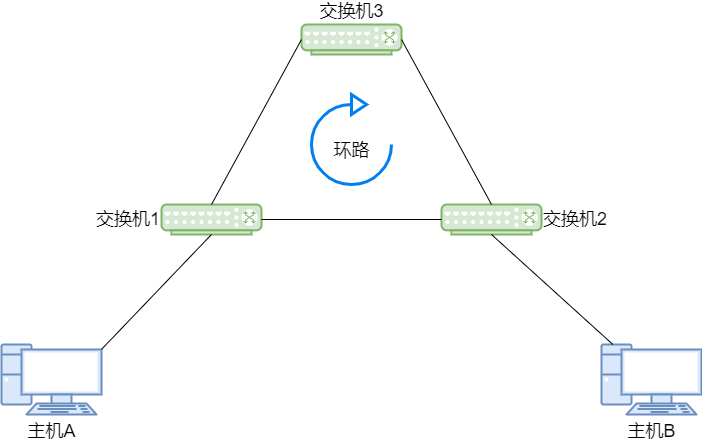

举个栗子：大刘的主机想要与小美的主机进行通信，现在只知道小美主机的 IP 地址，不知道 MAC 地址。有 IP 地址，就可以通过 ARP 协议来获取小美主机的 MAC 地址。我们来看看有冗余的网络中数据交换的过程：

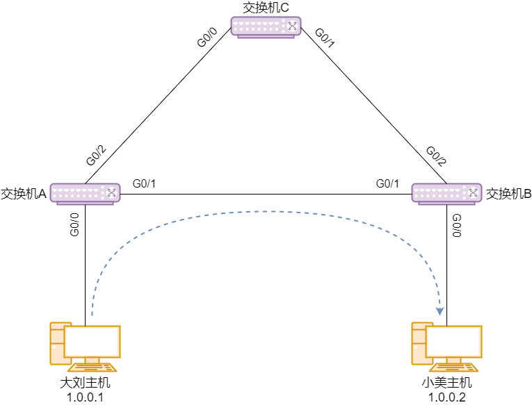

1. 大刘主机向交换机 A 发送 ARP 广播帧，来解析小美主机的 MAC 地址；
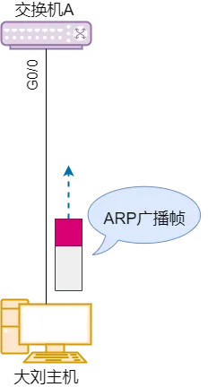
2. 交换机 A 收到广播帧后，查看自己的 MAC 地址表，没找到相应的表项，就向所有端口（除接收端口之外）泛洪这个广播帧。也就是向`G0/1`和`G0/2`两个端口泛洪广播帧；
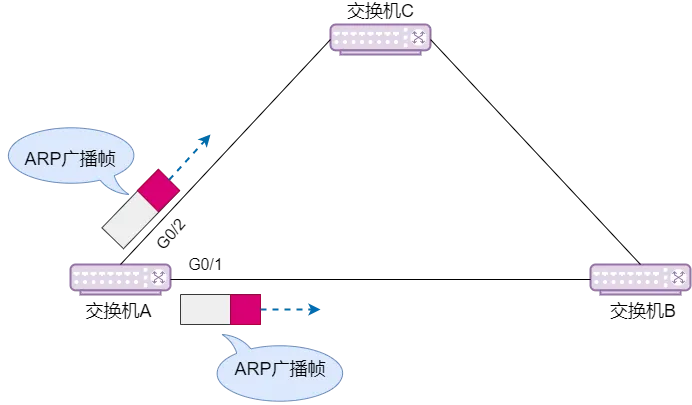
3. 交换机 B 和交换机 C 收到广播帧后，没有对应 MAC 地址表项，也将广播帧所有端口（除接收端口之外）泛洪出去；
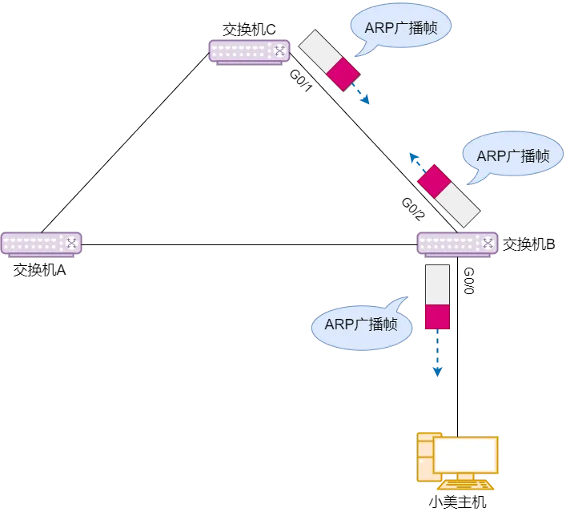
4. 小美主机终于收到了大刘发送的 ARP 广播帧，发现是查询自己的 MAC 地址后，小美主机将会通过单播帧返回自己的 MAC 地址；
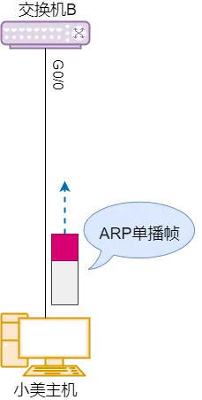
5. 这个过程看似正常，大刘主机发送的 ARP 广播帧顺利到达小美主机，小美主机也进行了响应，但是网络中广播帧的传输还没有结束。在第 3 步中，交换机 C 也把 ARP 广播帧泛洪到交换机 B 。这时交换机 B 就收到了两个相同的 ARP 广播帧，分别来自交换机 A 和交换机 C，收到的广播帧都会泛洪出去。那么，小美主机也会收到两个相同的 ARP 广播帧，也就是重复帧。出现这种现象说明网络中存在不合理的冗余链路；
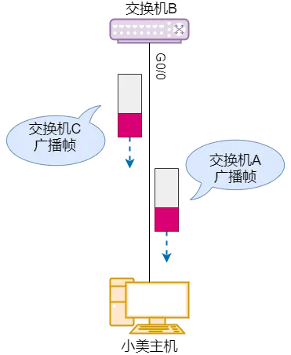
6. 接下来我们看下交换机 C，交换机 C 收到从交换机 A 发过来的广播帧，同时交换机 C 的 MAC 地址表添加一条表项，记录大刘主机 MAC 地址和端口`G0/0`的映射关系。交换机 C 又从交换机 B 收到相同的广播帧，大刘主机 MAC 地址的映射端口从`G0/0`变成`G0/1`。从不同的端口收到相同的数据帧，导致 MAC 地址表项发生变化的现象，就叫做 MAC 地址漂移，这种现象说明网络中可能存在环路。这样一来，交换机 C 就无法确定大刘主机到底位于自己的哪个端口；
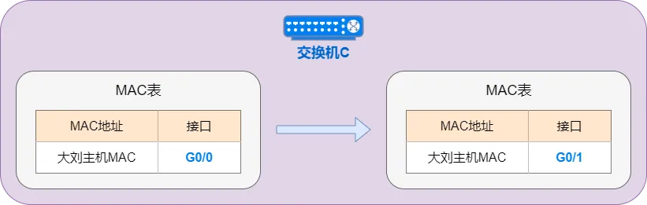
7. 主机收到广播帧，会进行解封装，查看上层的 IP 地址是否是发送给自己的，再进行下一步处理。交换机（只指二层交换机）收到广播帧，会直接进行泛洪。大刘主机发出的广播帧，经过交换机 A 后，从交换机 A 的`G0/1`口泛洪的广播帧，交换机 B 收到后再从`G0/2`口进行泛洪，交换机 C 收到广播帧后，又从`G0/0`口泛洪出去，结果广播帧回到了交换机 A，交换机 A 再从`G0/1`进行泛洪，最终这个广播帧会一直逆时针、永无止境的进行泛洪；同理，交换机 A 从`G0/2`口进行泛洪的广播帧，也会按顺时针、无休止的在三台交换机上进行泛洪。这种广播帧不停泛洪的现象，叫做广播风暴。广播风暴不仅会大量消耗网络设备的带宽和 CPU 使用率，也会影响到主机。主机收到一个广播帧后，会解封装上送网络层去处理，大量的广播帧泛洪，很可能导致主机瘫痪。

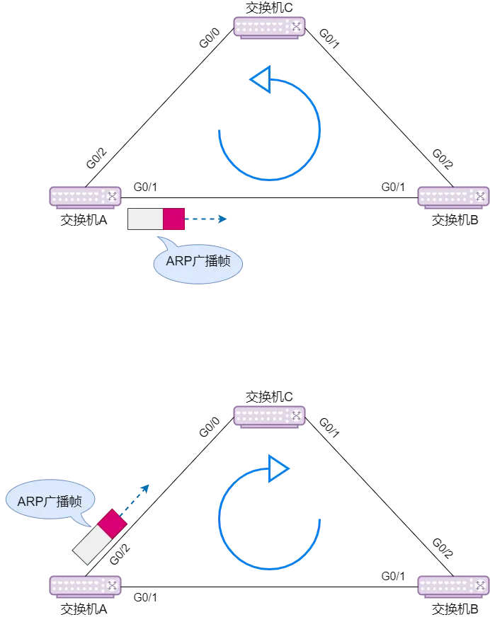

通过这个演示，我们看到了冗余链路带来的风险。重复帧、MAC 地址漂移和广播风暴，都是由一个广播帧引起的，可是网络中不可避免出现广播帧，也不能因为二层环路问题而忽略冗余链路增加网络可靠性的好处。

那么如何在保证网络冗余的情况下，消除二层环路呢？实际上交换机的二层环路是一个典型问题，解决方案也有不少。其中的一个解决方案就是 STP（生成树协议），能够阻断冗余链路来消除可能存在的环路，并且在网络故障时激活被阻断的冗余备份链路，恢复网络的连通性，保障业务的不间断服务。

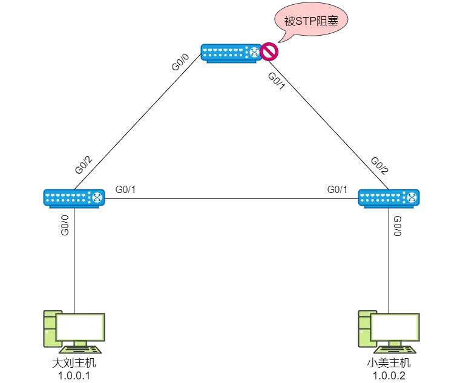

当网络中部署了 STP 后，交换机之间会交互相关协议报文，并计算出一个无环路的网络拓扑。当网络存在环路时，STP 会将网络中的一个或多个接口进行阻塞，将环路网络结构修剪成无环路的树状网络结构。被阻塞的接口不再转发数据，这样二层环路问题便迎刃而解。STP 会持续监控网络拓扑状况，当网络拓扑发生变化时，STP 能够及时感知，并动态调整被阻塞接口，而无需人工干预。

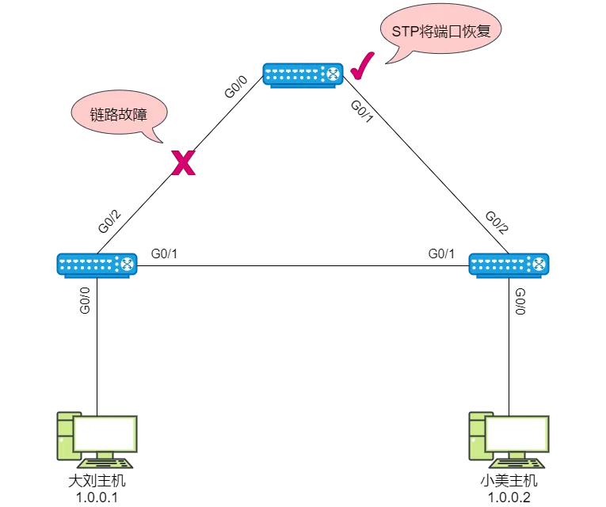

## STP 基本概念
STP 是用在局域网中消除数据链路层物理环路的协议，标准名称是`802.1D`。

STP 带来的好处有：
* 消除环路：STP 可以通过阻塞冗余端口，确保网络无环且连通；
* 链路备份：当使用的链路因故障断开时，可以检测到这种情况，并自动开启阻塞状态的冗余端口，网络迅速恢复正常。

在了解 STP 的原理之前，我们先来看看几个专业术语：
### 桥 ID（Bridge ID，BID）
在 STP 里使用不同的桥 ID 标识不同的交换机。每一台运行 STP 的交换机都有一个唯一的桥 ID。桥 ID 一共 8 字节，包含 2 字节的桥优先级和 6 字节的桥 MAC 地址。桥优先级的值可以人为设定，默认值是 32768。桥 MAC 地址通常是交换机默认`VLAN1`的 MAC 地址。

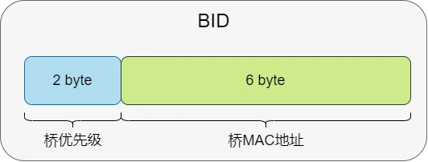

### 根桥（Root Bridge，RB）
STP 要在整个二层网络中计算出一棵无环的“树”，树形成了，网络中的无环拓扑也就形成了。其中最重要的就是树根，树根明确了，“树枝”才能沿着网络拓扑进行延伸。STP 的根桥就是这棵树的树根。当 STP 启动后，第一件事就是在网络中选举出根桥。在一个二层网络中，根桥只有一个，其余设备都是非根桥。当网络的拓扑发生变化时，根桥也可能会发生变化。

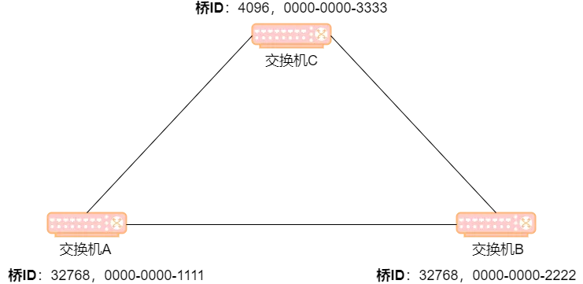

网络中桥 ID 最小的交换机将成为根桥。在比较桥 ID 大小时，首先比较的是桥优先级，桥优先级的值**最小**的交换机选为根桥；如果桥优先级相同，那么会比较 MAC 地址，MAC 地址**最小**的交换机选为根桥。

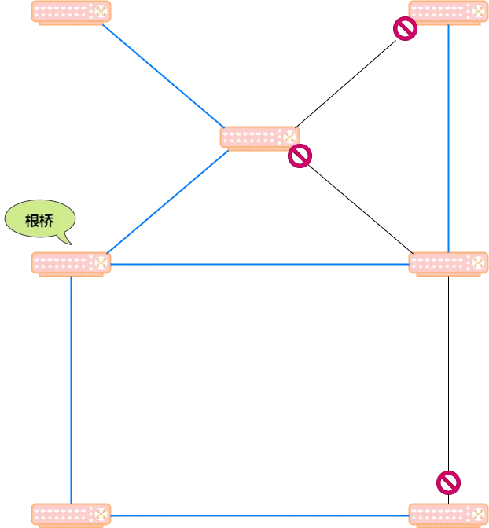

### 根路径开销（Root Path Cost，RPC）
STP 交换机每一个端口都对应一个开销值，这个值表示数据通过端口发送时的开销，这个值与端口带宽有关，带宽越高，开销值越小。对于端口开销值的定义有不同的标准，通常设备默认使用`IEEE 802.1t`中定义的开销值，同时还支持其它标准，以便兼容不同厂家的设备。

`Cost`值标准对比表：

| 接口速率    | IEEE 802.1D | IEEE 502.1t | 私有标准 |
|---------|-------------|-------------|------|
| 10Mbps  | 100         | 2000000     | 2000 |
| 100Mbps | 19          | 200000      | 200  |
| 1Gbps   | 4           | 20000       | 20   |
| 10Gbps  | 2           | 2000        | 2    |
| 40Gbps  | 1           | 500         | 1    |

非根桥到达根桥可能有多条路径，每条路径都有一个总开销值，也就是根路径开销（RPC），这个值是通过这条路径所有**出端口**的开销值累加而来的。STP 不会计算入端口的开销，只在数据通过端口发出时，才计算这个端口的开销。对于根桥来说，根路径开销是 0。

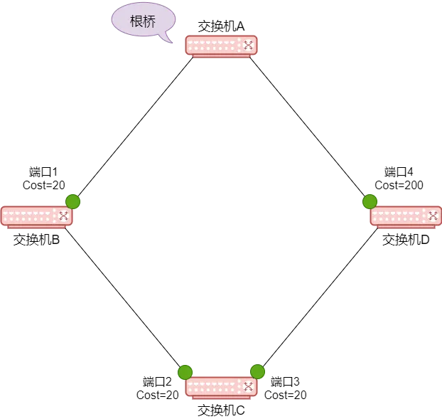

### 端口 ID（Port ID，PID）
运行 STP 的交换机使用端口 ID 标识每个端口，端口 ID 主要用于选举指定端口。端口 ID 长度为 16 比特，其中前 4 比特是端口优先级，后 12 比特是端口编号。在进行比较时，先比较端口优先级，**优先级小**的端口优先；在优先级相同时，再比较端口编号，**编号小**的端口优先。通常情况下，**端口编号无法改变**，可通过设置端口优先级来影响生成树的选路。

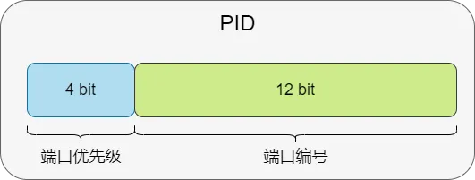

### BPDU
STP 协议使用 BPDU 报文进行交互，BPDU 包含与 STP 协议相关的所有信息，并且使用这些信息来完成生成树的计算。BPDU 是组播帧，地址为`0180-c200-0000`，并由 STP 交换机产生、发送、接收、处理，终端主机不参与。BPDU 分为两种类型：

1. 配置 BPDU（`Configuration BPDU`）：在 STP 的初始化过程中，每台交换机都会产生并发送配置 BPDU。在 STP 树形成后的稳定期，只有根桥才会周期性地发送配置 BPDU；相应的，非根桥会从自己的根端口收到配置 BPDU，并更新自己的配置 BPDU，再从指定端口发送出去。这个过程看起来像根桥发出的配置 BPDU 逐跳的经过了其它交换机。

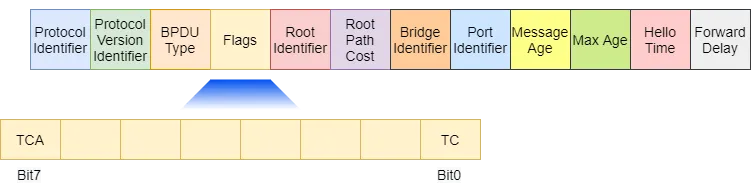

配置 BPDU 的参数：

| 字段                          | 字节数 | 描述                                             |
|-----------------------------|-----|------------------------------------------------|
| Protocol Identifier         | 2   | 协议ID，STP中值总为0                                  |
| Protocol Version Identifier | 1   | 协议版本ID，STP中值总为0                                |
| BPDU Type                   | 1   | BPDU类型，值为0x00就是配置BPDU；值为0x80就是TCN BPDU         |
| Flags                       | 1   | 标志位，最低位是TC标志，标识拓扑发生变化；<br>最高位是TCA标志，表示确认拓扑发生变化 |
| Root Identifier             | 8   | 根桥ID，根桥的桥ID                                    |
| Root Path Cost              | 4   | 根路径开销，到达根桥的路径开销                                |
| Bridge Identifier           | 8   | 桥ID，发送BPDU的交换机的桥ID                             |
| Port Identifier             | 2   | 接口ID，发送BPDU的端口ID                               |
| Message Age                 | 2   | 消息有效期，实际是指BPDU经过的交换机的个数                        |
| Max Age                     | 2   | 最大有效期，BPDU的最大存活时间，也叫老化时间，默认值是20s               |
| Hello Time                  | 2   | BPDU的发送时间间隔，默认值是2s                             |
| Forward Delay               | 2   | 转发延迟，接口在侦听和学习状态所停留的时间，默认值是15s                  |


2. 拓扑变化通知 BPDU（`Topology Change Notification BPDU`）：简称 TCN BPDU，是非根桥通过根端口向根桥发送的。当非根桥检测到拓扑变化后，就会生成一个描述拓扑变化的 TCN BPDU，并从自己的根端口发送出去。

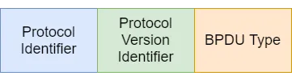
## STP 树的生成
STP 的基本原理是在一个有二层环路的网络中，交换机通过运行 STP，自动生成一个没有环路的网络拓扑。这个无环网络拓扑也叫做 STP 树（STP Tree），树节点为某些交换机，树枝为某些链路。当网络拓扑发生变化时，STP 树也会自动地发生相应的改变。

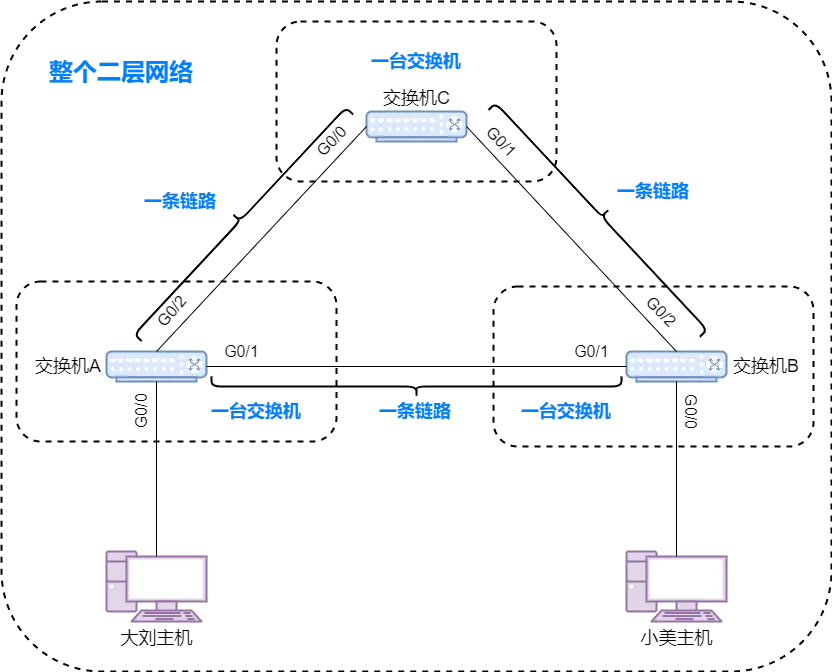

STP 树的生成过程是：**首先选举根桥，然后确定根端口和指定端口，最后阻塞备用端口**。既然是选举，我们就看下参选者和选举范围。

| 选举角色 | 参选者 | 选举范围   |
|------|-----|--------|
| 根桥   | 交换机 | 整个二层网络 |
| 根端口  | 端口  | 每台交换机  |
| 指定端口 | 端口  | 每条链路   |

STP 是通过比较 BPDU 中的信息进行选举的，最终的结果是：在整个 STP 网络中，唯一的一个根桥被选举出来；对于所有的非根桥，选举出根端口和指定端口，负责转发数据；落选的端口就是备用端口，处于阻塞状态，不能转发数据。

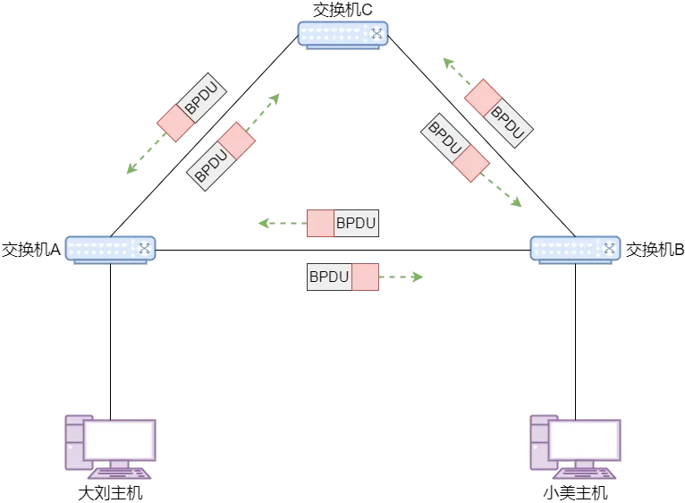

### 选举根桥
根桥是 STP 树的根节点。要生成一棵 STP 树，首先要确定一个根桥。根桥是整个二层网络的逻辑中心，但不一定是物理中心。在 STP 交换机刚连接到网络时，每台交换机都以自己为根桥，BPDU 中的根桥 ID字段为自己的桥 ID，从所有启动的端口发送 BPDU，宣告自己是根桥。收到 BPDU 的交换机会比较 BPDU 中的根桥 ID 与自己的根桥 ID，选择根桥 ID 值小的配置成自己 BPDU 中的根桥 ID。交换机不停地交互 BPDU，同时对根桥 ID 进行比较，直至选出一台根桥 ID 最小的交换机作为根桥。根桥会在固定的时间间隔发送 BPDU，其它设备对 BPDU 进行转发，从而保证网络拓扑的稳定。

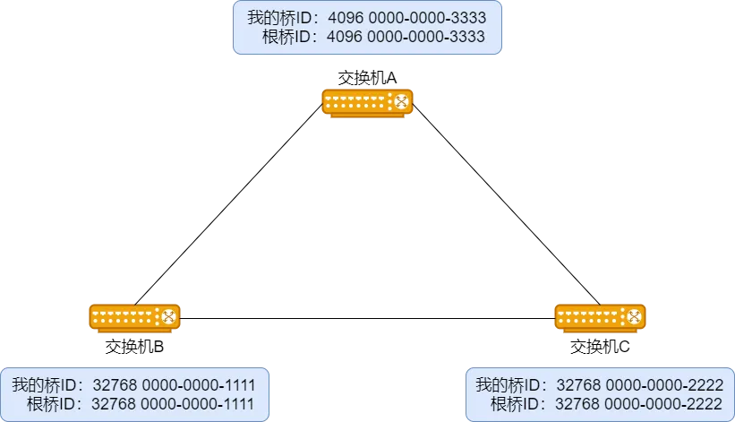

根桥交换机往往会承担这个网络中最大流量的转发工作，我们希望性能最高的交换机当选根桥交换机。但是 STP 在选举时，并不会把交换机的性能列入考量。为了让网络流量更合理的转发，可以通过配置桥优先级的值来影响根桥的选举。

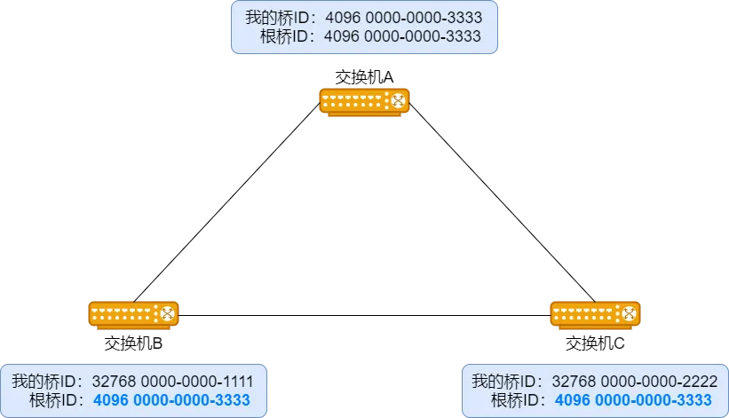

同时，根桥是可以抢占的，在 STP 完成网络收敛后，如果网络中接入一台新的交换机，且新增交换机的优先级比根桥交换机更优，那么新增交换机会成为网络中新的根桥。同时，STP 将会重新收敛、重新计算网络拓扑，这个过程会引发网络震荡，对流量的正常转发造成影响。

### 选举根端口（Root Port ，RP）
根桥选举出来后，其它没有成为根桥的交换机称为非根桥。STP 会为每个非根桥选举一个根接口，也就是在交换机的所有端口中，选择距离根桥最近的一个端口，这就是根端口。

在 STP 树形成后的稳定期，根桥依然会周期性的向网络中发送 BPDU，而非根桥的根端口会收到 BPDU，并向指定端口发送出去。

那是如何选择根端口的呢？根桥周期性的发送 BPDU，非根桥的所有端口都能收到 BPDU，对比端口收到的 BPDU 中的参数值。

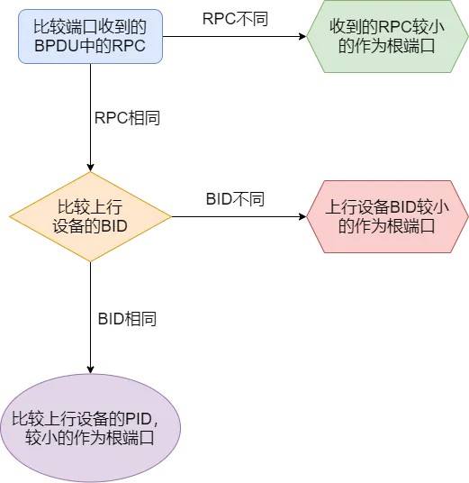

选择根路径开销（RPC）最小的端口；

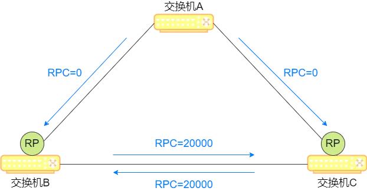

如果 RPC 相同，那就选对端桥 ID（BID）最小的端口；

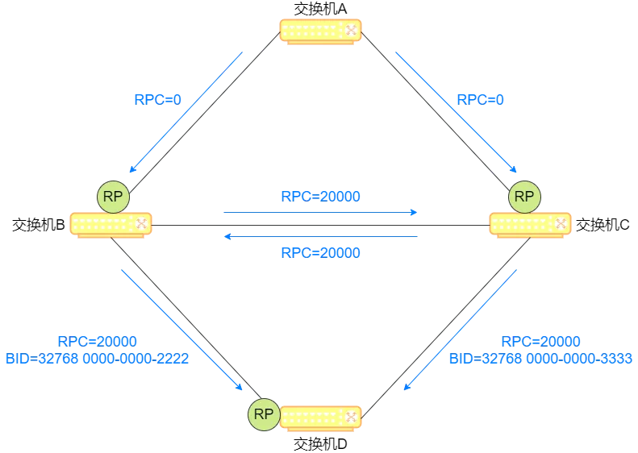

如果对端桥 ID 相同，那就选对端端口 ID（ PID ）最小的端口。

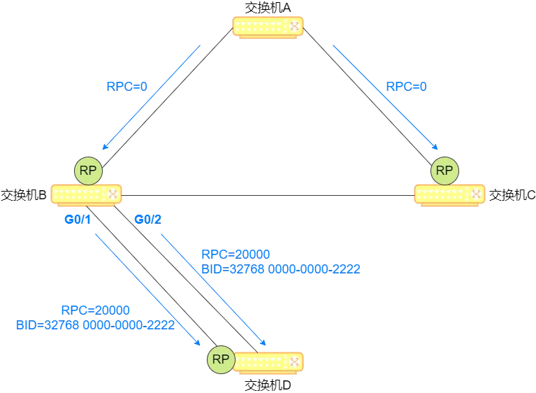

准确的说，选举根端口的目的是选举出 STP 网络中每台交换机上与根交换机通信效率最高的端口。
### 选举指定端口（Designated Port ，DP）
根端口确保了交换机到根桥的路径是唯一的，也是最优的。网络中的每条链路与根桥之间的路径也要是唯一且最优的。当一条链路中有两条或两条以上的路径到达根桥，就必须确定出一个唯一的指定端口，防止出现二层环路。指定端口不但是这条链路内所有端口中到达根桥的最优接口，还会向链路内发送 BPDU。虽然选举指定端口的范围和根端口不同，但是选举的原则是一致的。指定端口的选举同样会按照以下过程进行：

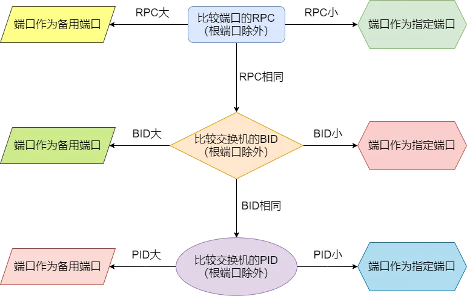

* 选择根路径开销（RPC）最小的端口；
* 如果 RPC 相同，那就选对端桥 ID 最小的端口；
* 如果对端桥 ID 相同，那就选对端端口 ID 最小的端口。

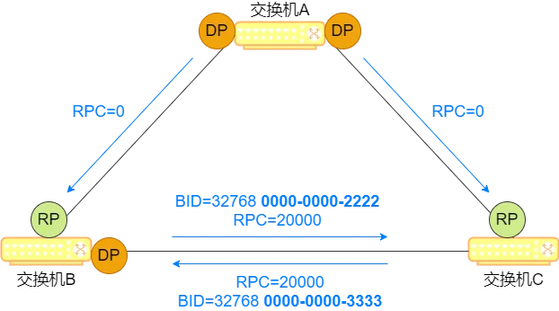

如果有人不小心将同一台交换机上的两个端口用网线连接起来，网络中就会产生环路。选举指定端口就是为了预防这种错误连接导致环路的情况。当出现这种连接时，STP 会以端口 ID 较小的端口作为指定端口，从而打破环路。
:::info
为什么根桥交换机的所有端口都是指定端口呢？

因为根桥交换机端口的根路径开销都是 0，根据选择选举原则，成为这条链路的指定端口。
:::
### 阻塞备用端口（Alternate Port ，AP）
在确定了根端口和指定端口后，交换机上剩下的非根端口和非指定端口都叫做备用端口。备用端口是打破环路的关键，STP 会对这些备用端口进行逻辑阻塞。逻辑阻塞，是指端口不会接收或发送任何数据，但是会监听 BPDU。当网络的一些端口出现故障时，STP 会让备用端口开始转发数据，用来恢复网络的正常通信。

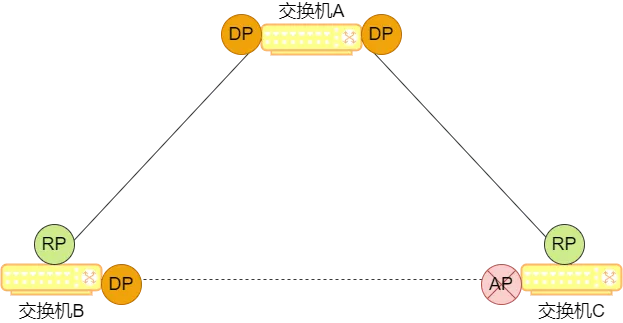

三种端口的异同如下：

| 端口名称 | 发送BPDU | 接收BPDU | 发送数据 | 接收数据 |
|------|:------:|:------:|:----:|:----:|
| 根端口  |   是    |   是    |  是   |  是   |
| 指定端口 |   是    |   是    |  是   |  是   |
| 备用端口 |   否    |   是    |  否   |  否   |

一旦备用端口被逻辑阻塞后，STP 树的生成过程就完成了。

## STP 端口状态机
STP 不但定义了 3 种端口角色：根端口、指定端口、备用端口，还定义了 5 种端口状态：禁用状态、阻塞状态、侦听状态、学习状态、转发状态。

| 状态名称           | 状态描述                                                            |
|----------------|-----------------------------------------------------------------|
| 禁用（Disable）    | 端口还未启用，不能收发BPDU，也不能转发数据帧                                        |
| 阻塞（Blocking）   | 这是一种稳定状态，被STP阻塞。端口只能接收并处理BPDU，不能发送BPDU，不能转发数据帧，不会学习MAC地址        |
| 侦听（Listening）  | 过渡状态，端口处于STP计算过程中，可能是根接口，也可能是指定接口。可以收发并处理BPDU，不能转发数据帧，不会学习MAC地址 |
| 学习（Learning）   | 过渡状态，端口可以收发并处理BPDU，接收数据帧并学习MAC地址，但还不能转发数据帧                      |
| 转发（Forwarding） | 稳定状态，也是根端口和指定端口的最终状态。端口可以正常收发数据帧，学习MAC地址，也会进行BPDU处理             |

STP 交换机的端口启动时，首先会从禁用状态自动进入到阻塞状态。在阻塞状态，端口只能接收和分析 BPDU，不能发送 BPDU。如果端口选为根端口或指定端口，则会进入侦听状态，这时端口可以接收并发送 BPDU，这种状态会持续一个`Forward Delay`的时间，默认是 15 秒。15 秒后端口会进入到学习状态，并持续一个`Forward Delay`的时间。学习状态的端口可以接收和发送 BPDU，同时开始进行 MAC 地址学习，为数据转发做好准备。最后，端口由学习状态进入到转发状态，就开始进行数据转发。在整个状态的迁移过程中，端口一旦关闭或发生链路故障，就会进入到禁用状态；如果端口不再是根端口或指定端口，那么端口状态会立刻退回到阻塞状态。

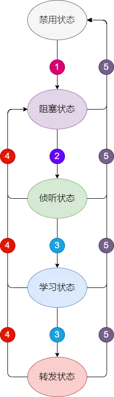

:::info
在 STP 的生成过程中，为什么要有两个 Forward Delay 时间？

在侦听状态有一个`Forward Delay`的时间，是因为 BPDU 泛洪到全网需要一定的时间，STP 完成全网拓扑的计算同样需要时间，所以停留 15 秒让 STP 有充分的时间计算全网拓扑，避免网络中出现临时的环路。在学习状态又有一个`Forward Delay`的时间，是由于交换机的接口上未学习到任何 MAC 地址，需要时间学习 MAC 地址，避免网络中出现不必要的数据帧泛洪现象。停留 15 秒，为进入转发状态做好准备。
:::
### STP 时间参数
STP 定义了 3 个重要的时间参数。
* `Hello Time`（`Hello`时间）：STP 交换机发送配置 BPDU 的时间间隔，默认是 2 秒。如果要修改时间参数，那么必须在根桥上修改才有效。
* `Forward Delay`（转发延迟）：接口从侦听状态进入学习状态，或从学习状态进入转发状态的延迟时间，默认值是 15 秒。避免在 STP 树的生成过程中可能出现的临时环路，或短暂的数据帧泛洪现象，分别在侦听和学习的端口状态各停留一个转发延迟时间。对于 STP 而言，一个阻塞端口选举为根接口或指定接口后，进入转发状态至少需要经历 30 秒的时间。
* `Max Age`（最大生存时间）：BPDU 的最大生存时间，也称为 BPDU 的老化时间，`Max Age`的值由根桥指定，默认值是 20 秒。如果端口在 20 秒内收到 BPDU，最大生存时间会重新计时；如果端口一直没收到 BPDU，那么 BPDU 将会老化，设备会重新在端口上选择最优 BPDU，也就是重新进行根接口的选举。

由于时间参数的设计，一个 STP 接口从阻塞状态进入到转发状态，可能需要 30~50 秒的时间，这段时间内，网络无法正常使用。
### 举例说明
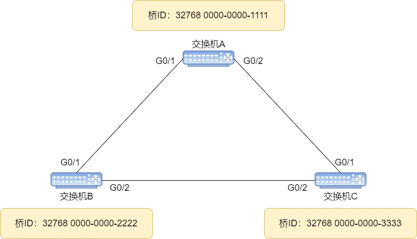

交换机 A、B、C 一起启动，各交换机的每个互联端口立即从禁用状态进入到阻塞状态。在阻塞状态的端口只能接收而不能发送 BPDU，所以任何端口都收不到 BPDU。在等待`Max Age`后，每台交换机都会认为自己是根桥，所有端口的角色都成为指定端口，并且端口的状态迁移为侦听状态。

交换机的端口进入到侦听状态后，开始发送自己产生的配置 BPDU，同时也收到其它交换机发送的配置 BPDU。

因为各个交换机发送 BPDU 的时间有一定的随机性，所以有可能交换机 B 和交换机 C 先选举根桥为交换机 B，再收到交换机 A 的配置 BPDU，最后选举出根桥为交换机 A。因此，无论交换机开始的状态如何，也不管中间过程有多大差异，最终的结果总是确定且唯一的：桥 ID 最小的交换机会成为根桥。

端口在侦听状态持续`Forward Delay`的时间后，开始进入学习状态。由于交换机 C 的`G0/2`端口已经成为备用端口，所以状态也会变成阻塞状态。

各个端口（交换机 C 的`G0/2`端口除外）陆续进入学习状态后，会持续`Forward Delay`的时间。在这段时间里，交换机开始学习 MAC 地址和端口的映射关系，同时希望 STP 树在这个时间内能够完全收敛。

之后各个端口（交换机 C 的`G0/2`端口除外）相继进入转发状态，开始进行数据帧的转发。
## 实战
### STP 基础配置
我们用 3 台交换机搭建一个网络环境，而且网络中存在二层环路。为了对网络进行破环，将在交换机上部署 STP。
#### 网络拓扑

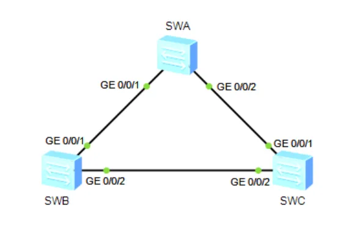

#### 实验要求
三台交换机（ SW ）配置 STP 功能，使用命令指定根桥交换机，使用命令改变端口状态。

#### 操作步骤
1. 三台 SW 按照网络拓扑图，对相应的端口进行连接。SW 默认的生成树工作模式是 MSTP，并且自动协商出了根桥、根端口和指定端口。交换机的桥优先级默认是 32768，MAC 地址最小的交换机成为网络中的根桥。通过命令查看，发现 SWC 选举为根桥。

```shell
# SWA
<Huawei>system-view 
[Huawei]sysname SWA
[SWA]display stp
-------[CIST Global Info][Mode MSTP]-------
CIST Bridge         :32768.4c1f-cc4c-6f4e
Config Times        :Hello 2s MaxAge 20s FwDly 15s MaxHop 20
Active Times        :Hello 2s MaxAge 20s FwDly 15s MaxHop 20
CIST Root/ERPC      :32768.4c1f-cc32-2e45 / 20000
CIST RegRoot/IRPC   :32768.4c1f-cc4c-6f4e / 0
CIST RootPortId     :128.2
BPDU-Protection     :Disabled
TC or TCN received  :2
TC count per hello  :0
STP Converge Mode   :Normal 
Time since last TC  :0 days 0h:2m:34s
Number of TC        :3
Last TC occurred    :GigabitEthernet0/0/1
----[Port1(GigabitEthernet0/0/1)][FORWARDING]----
 Port Protocol       :Enabled
 Port Role           :Designated Port
 Port Priority       :128
 Port Cost(Dot1T )   :Config=auto / Active=20000
 Designated Bridge/Port   :32768.4c1f-cc4c-6f4e / 128.1
 Port Edged          :Config=default / Active=disabled
 Point-to-point      :Config=auto / Active=true
 Transit Limit       :147 packets/hello-time
 Protection Type     :None
 Port STP Mode       :MSTP 
 Port Protocol Type  :Config=auto / Active=dot1s
 BPDU Encapsulation  :Config=stp / Active=stp
 PortTimes           :Hello 2s MaxAge 20s FwDly 15s RemHop 20
 TC or TCN send      :2
 TC or TCN received  :1
 BPDU Sent           :75             
          TCN: 0, Config: 0, RST: 0, MST: 75
 BPDU Received       :2             
          TCN: 0, Config: 0, RST: 0, MST: 2
----[Port2(GigabitEthernet0/0/2)][FORWARDING]----
 Port Protocol       :Enabled
 Port Role           :Root Port
 Port Priority       :128
 Port Cost(Dot1T )   :Config=auto / Active=20000
 Designated Bridge/Port   :32768.4c1f-cc32-2e45 / 128.1
 Port Edged          :Config=default / Active=disabled
 Point-to-point      :Config=auto / Active=true
 Transit Limit       :147 packets/hello-time
 Protection Type     :None
 Port STP Mode       :MSTP 
 Port Protocol Type  :Config=auto / Active=dot1s
 BPDU Encapsulation  :Config=stp / Active=stp
 PortTimes           :Hello 2s MaxAge 20s FwDly 15s RemHop 20
 TC or TCN send      :1
 TC or TCN received  :1
 BPDU Sent           :2             
          TCN: 0, Config: 0, RST: 0, MST: 2
 BPDU Received       :110             
          TCN: 0, Config: 0, RST: 0, MST: 110
#省略输出
```
```shell
# SWB
<Huawei>system-view
[Huawei]sysname SWB
[SWB]display stp
-------[CIST Global Info][Mode MSTP]-------
CIST Bridge         :32768.4c1f-cc79-56e9
Config Times        :Hello 2s MaxAge 20s FwDly 15s MaxHop 20
Active Times        :Hello 2s MaxAge 20s FwDly 15s MaxHop 20
CIST Root/ERPC      :32768.4c1f-cc32-2e45 / 20000
CIST RegRoot/IRPC   :32768.4c1f-cc79-56e9 / 0
CIST RootPortId     :128.2
BPDU-Protection     :Disabled
TC or TCN received  :4
TC count per hello  :0
STP Converge Mode   :Normal 
Time since last TC  :0 days 0h:3m:19s
Number of TC        :3
Last TC occurred    :GigabitEthernet0/0/2
----[Port1(GigabitEthernet0/0/1)][DISCARDING]----
 Port Protocol       :Enabled
 Port Role           :Alternate Port
 Port Priority       :128
 Port Cost(Dot1T )   :Config=auto / Active=20000
 Designated Bridge/Port   :32768.4c1f-cc4c-6f4e / 128.1
 Port Edged          :Config=default / Active=disabled
 Point-to-point      :Config=auto / Active=true
 Transit Limit       :147 packets/hello-time
 Protection Type     :None
 Port STP Mode       :MSTP 
 Port Protocol Type  :Config=auto / Active=dot1s
 BPDU Encapsulation  :Config=stp / Active=stp
 PortTimes           :Hello 2s MaxAge 20s FwDly 15s RemHop 20
 TC or TCN send      :1
 TC or TCN received  :2
 BPDU Sent           :2             
          TCN: 0, Config: 0, RST: 0, MST: 2
 BPDU Received       :95             
          TCN: 0, Config: 0, RST: 0, MST: 95
----[Port2(GigabitEthernet0/0/2)][FORWARDING]----
 Port Protocol       :Enabled
 Port Role           :Root Port
 Port Priority       :128
 Port Cost(Dot1T )   :Config=auto / Active=20000
 Designated Bridge/Port   :32768.4c1f-cc32-2e45 / 128.2
 Port Edged          :Config=default / Active=disabled
 Point-to-point      :Config=auto / Active=true
 Transit Limit       :147 packets/hello-time
 Protection Type     :None
 Port STP Mode       :MSTP 
 Port Protocol Type  :Config=auto / Active=dot1s
 BPDU Encapsulation  :Config=stp / Active=stp
 PortTimes           :Hello 2s MaxAge 20s FwDly 15s RemHop 20
 TC or TCN send      :1
 TC or TCN received  :2
 BPDU Sent           :3             
          TCN: 0, Config: 0, RST: 0, MST: 3
 BPDU Received       :102             
          TCN: 0, Config: 0, RST: 0, MST: 102
#省略输出
```
```shell
#SWC
<Huawei>system-view
[Huawei]sysname SWC
[SWC]display stp 
-------[CIST Global Info][Mode MSTP]-------
CIST Bridge         :32768.4c1f-cc32-2e45
Config Times        :Hello 2s MaxAge 20s FwDly 15s MaxHop 20
Active Times        :Hello 2s MaxAge 20s FwDly 15s MaxHop 20
CIST Root/ERPC      :32768.4c1f-cc32-2e45 / 0
CIST RegRoot/IRPC   :32768.4c1f-cc32-2e45 / 0
CIST RootPortId     :0.0
BPDU-Protection     :Disabled
TC or TCN received  :2
TC count per hello  :0
STP Converge Mode   :Normal 
Time since last TC  :0 days 0h:5m:57s
Number of TC        :2
Last TC occurred    :GigabitEthernet0/0/2
----[Port1(GigabitEthernet0/0/1)][FORWARDING]----
 Port Protocol       :Enabled
 Port Role           :Designated Port
 Port Priority       :128
 Port Cost(Dot1T )   :Config=auto / Active=20000
 Designated Bridge/Port   :32768.4c1f-cc32-2e45 / 128.1
 Port Edged          :Config=default / Active=disabled
 Point-to-point      :Config=auto / Active=true
 Transit Limit       :147 packets/hello-time
 Protection Type     :None
 Port STP Mode       :MSTP 
 Port Protocol Type  :Config=auto / Active=dot1s
 BPDU Encapsulation  :Config=stp / Active=stp
 PortTimes           :Hello 2s MaxAge 20s FwDly 15s RemHop 20
 TC or TCN send      :1
 TC or TCN received  :1
 BPDU Sent           :164             
          TCN: 0, Config: 0, RST: 0, MST: 164
 BPDU Received       :2             
          TCN: 0, Config: 0, RST: 0, MST: 2
----[Port2(GigabitEthernet0/0/2)][FORWARDING]----
 Port Protocol       :Enabled
 Port Role           :Designated Port
 Port Priority       :128
 Port Cost(Dot1T )   :Config=auto / Active=20000
 Designated Bridge/Port   :32768.4c1f-cc32-2e45 / 128.2
 Port Edged          :Config=default / Active=disabled
 Point-to-point      :Config=auto / Active=true
 Transit Limit       :147 packets/hello-time
 Protection Type     :None
 Port STP Mode       :MSTP 
 Port Protocol Type  :Config=auto / Active=dot1s
 BPDU Encapsulation  :Config=stp / Active=stp
 PortTimes           :Hello 2s MaxAge 20s FwDly 15s RemHop 20
 TC or TCN send      :2
 TC or TCN received  :1
 BPDU Sent           :166             
          TCN: 0, Config: 0, RST: 0, MST: 166
 BPDU Received       :3             
          TCN: 0, Config: 0, RST: 0, MST: 3
```
2. 在三台交换机上分别配置工作模式从默认的 MSTP 改成 STP，并且启动 STP 功能。`stp mode`命令用来修改交换机的工作模式。`stp enable`命令用在设备上激活生成树功能，默认处于激活状态，所以这条命令为可选。
```shell
[SWA]stp ?
  bpdu-filter           STP BPDU filter
  bpdu-protection       Specify BPDU protection function
  bridge-diameter       Specify bridge diameter
  converge              Specify STP converge mode
  disable               Disable Spanning Tree Protocol (STP)
  edged-port            Specify edge port
  enable                Enable Spanning Tree Protocol (STP)
  instance              Spanning tree instance
  max-hops              Specify max hops
  mcheck                Specify mcheck
  mode                  Specify state machine mode
  pathcost-standard     Specify STP port path cost standard
  priority              Specify bridge priority
  process               The MSTP process
  region-configuration  Enter MSTP region view
  root                  Specify root switch
  snooping              STP snooping
  tc-protection         Enable the TC-BPDU Protection function
  timer                 Specify timer configuration
  timer-factor          Specify aged out time factor

[SWA]stp mode ?
  mstp  Multiple Spanning Tree Protocol (MSTP) mode
  rstp  Rapid Spanning Tree Protocol (RSTP) mode
  stp   Spanning Tree Protocol (STP) mode

[SWA]stp mode stp
[SWA]stp enable
```
```shell
#SWB
[SWB]stp mode stp
[SWB]stp enable
```
```shell
#SWC
[SWC]stp mode stp
[SWC]stp enable
```
3. 在实际的网络部署中，我们通常会修改某台设备的优先级，确保它成为这个网络的根桥，从而保证 STP 的稳定性。假设 SWA 是高性能的核心交换机，SWB 和 SWC 是普通性能的接入交换机。可以将 SWA 设置成根桥。在 SWA 配置`stp root primary`命令让它成为网络中的根桥，实际上这条命令是把交换机的优先级设置成最小值 0，而且这个优先级不能修改。因此在 SWA 使用替代命令`stp priority 0`也能实现相同效果。`stp priority`命令可以修改设备的 STP 优先级，取值范围是 0~61440，而且要是 4096 的倍数，例如 0、4096、8192 等。

```shell
[SWA]stp root primary
# 等价于
#[SWA]stp priority 0
```
4. 在 SWA 上使用`display stp`命令查看 STP 状态。


```shell
[SWA]display stp
-------[CIST Global Info][Mode STP]-------
CIST Bridge         :0    .4c1f-cc4c-6f4e
Config Times        :Hello 2s MaxAge 20s FwDly 15s MaxHop 20
Active Times        :Hello 2s MaxAge 20s FwDly 15s MaxHop 20
CIST Root/ERPC      :0    .4c1f-cc4c-6f4e / 0
CIST RegRoot/IRPC   :0    .4c1f-cc4c-6f4e / 0
CIST RootPortId     :0.0
BPDU-Protection     :Disabled
CIST Root Type      :Primary root
TC or TCN received  :5
TC count per hello  :0
STP Converge Mode   :Normal 
Time since last TC  :0 days 0h:0m:1s
Number of TC        :6
Last TC occurred    :GigabitEthernet0/0/2
----[Port1(GigabitEthernet0/0/1)][FORWARDING]----
 Port Protocol       :Enabled
 Port Role           :Designated Port
 Port Priority       :128
 Port Cost(Dot1T )   :Config=auto / Active=20000
 Designated Bridge/Port   :0.4c1f-cc4c-6f4e / 128.1
 Port Edged          :Config=default / Active=disabled
 Point-to-point      :Config=auto / Active=true
 Transit Limit       :147 packets/hello-time
 Protection Type     :None
 Port STP Mode       :STP 
 Port Protocol Type  :Config=auto / Active=dot1s
 BPDU Encapsulation  :Config=stp / Active=stp
 PortTimes           :Hello 2s MaxAge 20s FwDly 15s RemHop 20
 TC or TCN send      :2
 TC or TCN received  :1
 BPDU Sent           :19             
          TCN: 0, Config: 19, RST: 0, MST: 0
 BPDU Received       :2             
          TCN: 1, Config: 1, RST: 0, MST: 0
----[Port2(GigabitEthernet0/0/2)][FORWARDING]----
 Port Protocol       :Enabled
 Port Role           :Designated Port
 Port Priority       :128
 Port Cost(Dot1T )   :Config=auto / Active=20000
 Designated Bridge/Port   :0.4c1f-cc4c-6f4e / 128.2
 Port Edged          :Config=default / Active=disabled
 Point-to-point      :Config=auto / Active=true
 Transit Limit       :147 packets/hello-time
 Protection Type     :None
 Port STP Mode       :STP 
 Port Protocol Type  :Config=auto / Active=dot1s
 BPDU Encapsulation  :Config=stp / Active=stp
 PortTimes           :Hello 2s MaxAge 20s FwDly 15s RemHop 20
 TC or TCN send      :4
 TC or TCN received  :1
 BPDU Sent           :21             
          TCN: 0, Config: 21, RST: 0, MST: 0
 BPDU Received       :2             
          TCN: 1, Config: 1, RST: 0, MST: 0
# 省略输出
```
交换机的桥 ID 是`0    .4c1f-cc4c-6f4e`，其中 0 为交换机的优先级值，这就是命令`stp root primary`的作用。`4c1f-cc4c-6f4e`是交换机的 MAC 地址，且根桥的 MAC 地址也是 `4c1f-cc4c-6f4e`，说明这台交换机就是根桥。

5. 还可以使用`display stp brief`命令查看接口的 STP 状态。
```shell
[SWA]display stp brief 
 MSTID  Port                        Role  STP State     Protection
   0    GigabitEthernet0/0/1        DESI  FORWARDING      NONE
   0    GigabitEthernet0/0/2        DESI  FORWARDING      NONE
```
由于 SWA 是根桥，所有端口都是指定接口（`DESI`），都处于转发状态（`FORWARDING`）。

6. SWB 的`G0/0/2`端口将会被阻塞，命令输出如下。为什么`G0/0/2`的端口状态是禁用，而不是阻塞。因为 STP 已经不再使用，交换机默认使用 MSTP，即使将生成树的模式修改为 STP，交换机的端口状态依然和 MSTP 保持一致。端口角色（`Role`）也是 MSTP 中的概念。

```shell
[SWB]display stp brief 
 MSTID  Port                        Role  STP State     Protection
   0    GigabitEthernet0/0/1        ROOT  FORWARDING      NONE
   0    GigabitEthernet0/0/2        ALTE  DISCARDING      NONE
```
7. 因为 SWB 的`G0/0/1`端口是根端口，收到的 BPDU 比`G0/0/2`收到的更优，所以端口被阻塞。如果我们希望阻塞的不是`G0/0/2`，而是`G0/0/1`端口，那就要让`G0/0/2`成为根端口，比如将`G0/0/1`端口的`Cost`值调大，让 SWB 的`G0/0/1`到达根桥的 RPC 比`G0/0/2`的更大。SWB 增加配置如下：

```shell
[SWB]interface GigabitEthernet 0/0/1
[SWB-GigabitEthernet0/0/1]stp cost 50000
```
我们再观察下 SWB 的端口状态，`G0/0/2`端口成为根端口，`G0/0/1`端口被阻塞。
```shell
[SWB-GigabitEthernet0/0/1]display stp brief 
 MSTID  Port                        Role  STP State     Protection
   0    GigabitEthernet0/0/1        ALTE  DISCARDING      NONE
   0    GigabitEthernet0/0/2        ROOT  DISCARDING      NONE
```
#### 功能验证
查看三台 STP 交换机的端口状态，是否符合预期结果。
```shell
[SWA]display stp brief 
 MSTID  Port                        Role  STP State     Protection
   0    GigabitEthernet0/0/1        DESI  FORWARDING      NONE
   0    GigabitEthernet0/0/2        DESI  FORWARDING      NONE
```
```shell
[SWB]display stp brief 
 MSTID  Port                        Role  STP State     Protection
   0    GigabitEthernet0/0/1        ALTE  DISCARDING      NONE
   0    GigabitEthernet0/0/2        ROOT  FORWARDING      NONE
```
```shell
[SWC]display stp brief 
 MSTID  Port                        Role  STP State     Protection
   0    GigabitEthernet0/0/1        ROOT  FORWARDING      NONE
   0    GigabitEthernet0/0/2        DESI  FORWARDING      NONE
```

还可以抓包验证 STP 交互的 BPDU 报文内容是否正常。

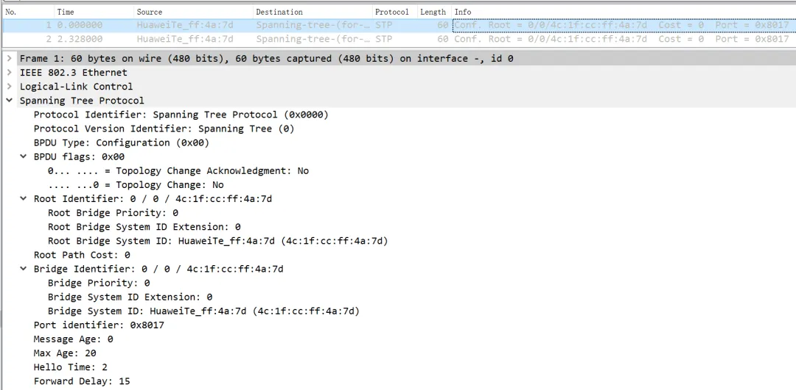

