传输层的作用是建立应用程序间的端到端连接，为数据传输提供可靠或不可靠的通信服务。传输层有两个重要协议，分别是 TCP(`Transmission Control Protocol`，传输控制协议) 和 UDP(`User Datagram Protocol`，用户数据报协议)。TCP 是面向连接的可靠传输协议，UDP 是无连接的不可靠传输协议。

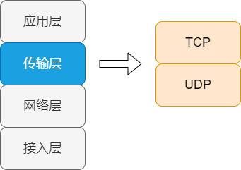

一个 IP 地址可以标识一台主机，IP 报文头部有一个字段，用来标识上层协议类型。根据这个字段的协议号，来识别 IP 传输的数据是 TCP 还是 UDP。IP 用协议号 6 标识 TCP，用协议号 17 标识 UDP。但一台主机可能同时有多个程序，传输层的 TCP 和 UDP，为了识别上一层的应用程序类型，使用端口号来识别具体的程序，从而使这些程序可以复用网络通道。

二层的帧通信和三层的包通信都是无连接的、不可靠的通信方式，四层的 TCP 却是一种可靠的通信方式。如果帧在传输中丢失，通信双方的二层功能模块发现不了；如果包在传输中丢失，通信双方的三层功能模块发现不了。然而，一个 TCP 段丢失了，TCP 模块一定能够发现。一个 TCP 段的丢失，意味着一个 IP 包的丢失，因为 TCP 段是封装在 IP 包里的；同理，一个 IP 包的丢失，意味着一个帧的丢失。因此，二层和三层通信的不可靠性在 TCP 这里得到补偿。

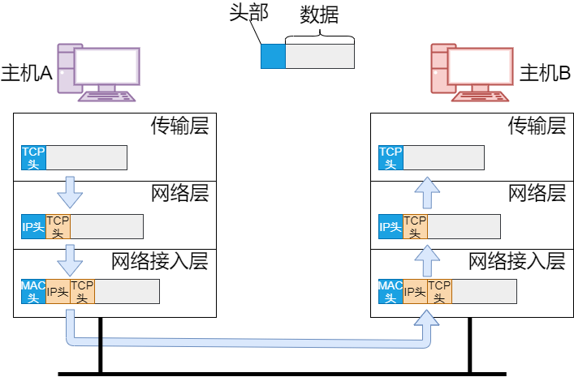

应用程序其实就是 TCP/IP 的应用协议，应用协议大多以客户端/服务端的形式运行。客户端（Client，使用服务的一方）是请求的发起端。而服务端（Server，提供服务的程序或主机）则是请求的处理端。作为服务端的程序有必要提前启动，随时准备接收客户端的请求。否则即使有客户端的请求发过来，也无法进行处理。

确认一个请求究竟是发给哪一个服务端，可以通过收到数据包的目的端口号轻松识别。当收到 TCP 的建立连接请求时，如果目的端口号是 22，则转给 SSH，如果是 80 则转给 HTTP。

## 端口号
数据链路层和网络层的地址，分别是 MAC 地址和 IP 地址。MAC 地址用来标识同一网段中不同的设备，IP 地址标识网络中的主机或路由器。传输层的地址就是端口号，端口号用来识别同一台主机中不同的应用程序，也被称为程序地址。

一台主机可以同时运行多个程序，比如 WWW 服务的 Web 浏览器、电子邮箱客户端等程序都可同时运行。传输层协议正是利用这些端口号，识别主机正在进行通信的应用程序，并准确的传输数据。

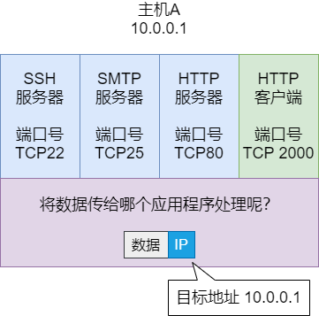

仅仅通过目的端口来识别某一个通信是不准确的。两台主机访问的目的端口号 80 相同，可以根据源端口号区分这两个通信。

目的端口号和源端口号相同，但是两台主机的源 IP地址不同；IP 地址和端口号都一样，只是协议号不同。这些情况，都会认为是两个不同的通信。

因此，网络通信中通常采用 5 个信息来识别一个通信。它们是源 IP 地址、目的 IP 地址、协议号、源端口号、目的端口号。只要其中一项不同，就会认为是不同的通信。

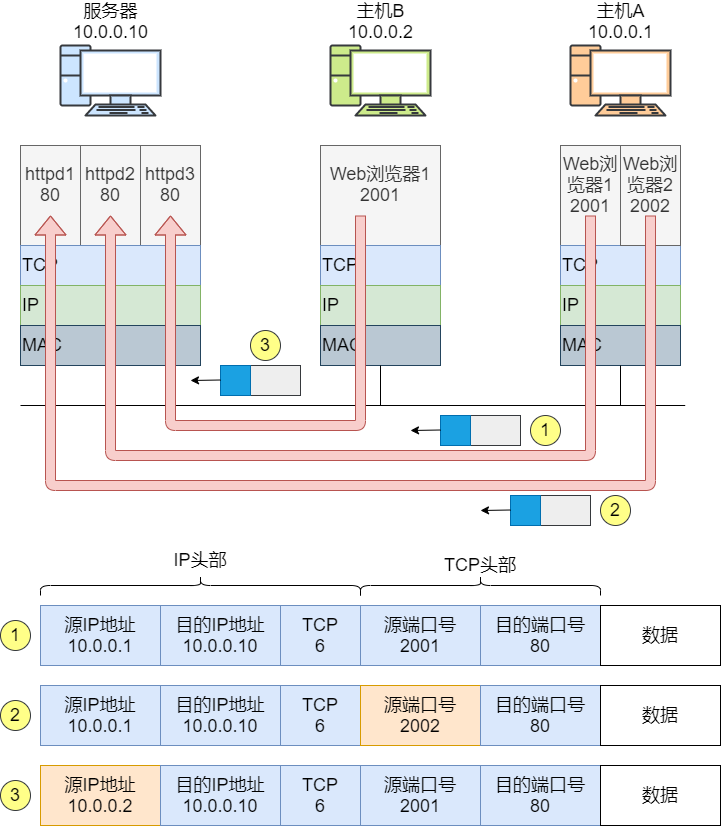

TCP/UDP 的端口号是一个 16 位二进制数，端口号范围为 0~65535。在实际进行通信时，要事先确定端口号。确定端口号的方法分为两种：

1. 标准端口号
这种方法也叫静态方法。它是指每个应用程序都有指定的端口号。HTTP、TELNET、FTP 等常用的应用程序所使用的端口号是固定的，这些端口号又称为知名端口号。知名端口号范围是 0~1023。
除了知名端口号外，还有一些端口号也被正式注册，称为注册端口。它们分布在 1024~49151 之间。使用这个范围的端口号必须在 IANA 登记，以防止重复。

| 端口号 | 对应协议        | 传输层协议 |
|-----|-------------|-------|
| 20  | FTP data    | TCP   |
| 21  | FTP control | TCP   |
| 22  | SSH         | TCP   |
| 23  | Telnet      | TCP   |
| 25  | SMTP        | TCP   |
| 53  | DNS         | UDP   |
| 69  | TFTP        | UDP   |
| 80  | HTTP        | TCP   |
| 110 | POP3        | TCP   |
| 143 | IMAP        | TCP   |
| 161 | SNMP        | UDP   |
| 162 | SNMP Trap   | UDP   |
| 179 | BGP         | TCP   |
| 443 | HTTPS       | TCP   |
| 520 | RIP         | UDP   |

2. 时序分配法
这种方法也叫动态分配法。服务端有必要确定监听的端口号，但是接受服务的客户端不需要确定端口号。

客户端应用程序不用设置端口号，由操作系统进行分配。操作系统可以为每个应用程序分配不冲突的端口号。比如：每需要一个新的端口号时，就在之前分配号码的基础上加 1。这样，操作系统就可以动态管理端口号了。

动态分配的端口号范围是 49152~65535 之间。

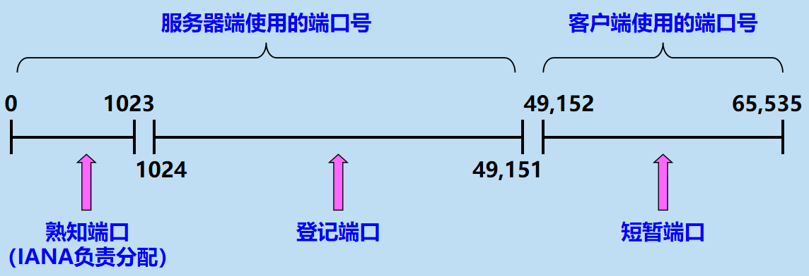

## TCP
TCP 是面向连接的、可靠的流协议。流就是不间断的数据，当应用程序采用 TCP 发送消息时，虽然是按顺序发送，但接收端收到是没有间隔的数据流。比如，在发送端应用程序发送了 10 次 100 字节的数据，那么在接收端，应用程序可能会收到一个 1000 字节连续不间断的数据。

TCP 为提供可靠性传输，实行顺序控制、重发控制机制。此外还有流量控制、拥塞控制、提高网络利用率等众多功能。

### TCP特点
UDP 将部分控制转移给应用程序去处理，只提供作为传输层协议的最基本功能。与 UDP 不同，TCP 是对传输、发送、通信进行控制的协议。主要特点如下：
* 三次握手建立连接：确保连接建立的可靠性。
* 端口号：通过端口号识别上层协议和服务，实现网络的多路复用。
* 完整性校验：通过计算校验和，保证接收端能检测出传输过程中可能出现的错误。
* 确认机制：对于正确收到的数据，接收端通过确认应答告知发送方，超出一定时间后，发送方将重传没有被确认的段，确保传输的可靠性。
* 序列号：发送的数据都有唯一的序列号，标识了每一个段。接收端可以利用序列号实现丢失检测、乱序重排等功能。
* 窗口机制：通过可调节的窗口，TCP 接收端可以告知希望的发送速度，控制数据流量。

TCP 实现了数据传输时各种控制功能，可以进行丢包时的重发控制，还可以对次序错误的分包进行顺序控制。作为一种面向有连接的协议，只有在确定对端存在时，才会发送数据，从而可以控制通信流量的浪费。由于 UDP 没有连接控制，即使对端不存在或中途退出网络，数据包还是能够发送出去。

### 连接
连接是指网络中进行通信的两个应用程序，为了相互传递消息而专有的、虚拟的通信线路，也叫做虚拟电路。

一旦建立了连接，进行通信的应用程序只使用这个虚拟线路发送和接收数据，就可以保障信息的传输。应用程序可以不用考虑 IP 网络上可能发生的各种问题，依然可以转发数据。TCP 则负责连接的建立、断开、保持等管理工作。

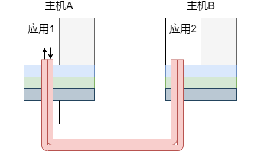

为了在不可靠的 IP 通信实现可靠性传输，需要考虑很多事情，数据的破坏、丢包、重复以及分片顺序混乱等问题。TCP 通过校验和、序列号、确认应答、重发控制、连接管理以及窗口控制等机制实现可靠性传输。

### TCP报文格式
TCP 头部由一个 20 字节的固定长度加上可变长的选项字段组成。TCP 头部最大长度为 60 字节。

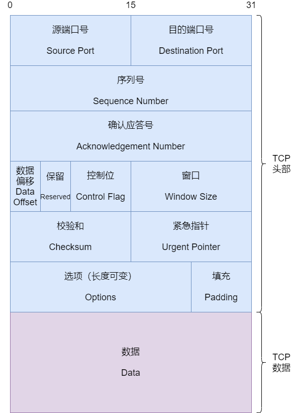

字段说明：
* 源端口号：字段长 16 位，表示发送端 TCP 端口号。
* 目的端口号：字段长 16 位，表示接收端 TCP 端口号。
* 序列号：字段长 32 位，是指 TCP 段数据的位置序号。根据序列号来判断是否存在重收、漏收、乱序等情况。TCP 传送的数据流中的每一个字节都有一个序号。序号增加到 $$2^32-1$$ 后，下一个序号就又回到 0。
* 确认号：字段长 32 位，是指下一次应该收到的数据的序列号。收到这个确认号，表示这个确认号之前的数据都已经正常收到。
* 数据偏移：字段长 4 位，表示 TCP 数据从哪一位开始计算，也可以看作 TCP 头部的长度。单位是 4 字节。数据偏移的最小值为 5，因为头部长度最小为 20 字节；由于 4 位二进制数能够表示的最大十进制数字是 15，因此最大值是 15*4=60，这也是 TCP 首部的最大长度(即选项长度不能超过 40 字节)。
* 保留：字段长 6 位，保留给以后扩展使用。目前应置为 0。
* 控制位：字段长 6 位，每 1 位标志位可以打开一个控制功能，也叫做控制位。从左到右分别是 URG、ACK、PSH、RST、SYN、FIN。
  
  * URG：标志位为 1 时，表示有需要紧急处理的数据。紧急指针字段有效。
  * ACK：标志位为 1 时，表示确认应答有效。在连接建立后所有传送的报文段都必须把`ACK`置 1。
  * PSH：标志位为 1 时，表示将数据立即上传给应用程序，而不是在缓冲区排队等到整个缓存都填满了后再向上交付。
  * RST：标志位为 1 时，表示 TCP 连接出现异常，必须强制断开连接。
  * SYN：标志位为 1 时，表示请求建立连接，并设置序列号的初始值。
  * FIN：标志位为 1 时，表示数据发送结束，请求断开 TCP 连接。
* 窗口：字段长 16 位，标明滑动窗口的大小，表示自己还能接收多少字节的数据。
* 校验和：字段长 16 位，是错误检查的字段，包括 TCP 头和 TCP 数据的内容计算得出，用于检查传输过程中出现的错误。
* 紧急指针：字段长 16 位，表示紧急数据的长度。当 URG 位为 1 时，这个字段才有效。紧急数据放在本报文段数据的前面。
* 选项：字段的长度是可变的，最长可达 40 字节。通过添加不同的选项，实现 TCP 的一些扩展功能。
* 填充：如果 TCP 段的头部不是 4 字节的整数倍，就填充一些 0，来保证头部长度是 4 字节的整数倍。
* 数据：TCP 段的数据部分，不是 TCP 头部内容，字段最大是 MSS。

#### 选项字段的其他选项
* MSS 选项：MSS 是 TCP 报文段中的数据字段的最大长度。
* 窗口扩大选项：占 3 字节，其中有一个字节表示移位值`S`。新的窗口值等于 TCP 首部中的窗口位数增大到`16+S`，相当于把窗口值向左移动`S`位后获得实际的窗口大小。
* 时间戳选项：占 10 字节，其中最主要的字段时间戳值字段（4 字节）和时间戳回送回答字段（4 字节）。
* 选择确认选项（`SACK`）。

窗口扩大选项是为了扩大窗口。我们知道，TCP 首部中窗口字段长度是 16 位，因此最大的窗口大小为 64K 字节。虽然这对早期的网络是足够用的，但对于包含卫星信道的网络，传播时延和带宽都很大，要获得高吞吐率需要更大的窗口大小。

窗口扩大选项可以在双方初始建立 TCP 连接时进行协商。如果连接的某一端实现了窗口扩大，当它不再需要扩大其窗口时，可发送`S = 0`的选项，使窗口大小回到 16。

时间戳选项有以下两个功能：
1. 用来计算往返时间 RTT。发送方在发送报文段时把当前时钟的时间值放入时间戳字段，接收方在确认该报文段时把时间戳字段值复制到时间戳回送回答字段。因此，发送方在收到确认报文后，可以准确地计算出 RTT。
2. 用于处理 TCP 序号超过 232的情况，又称为防止序号绕回 PAWS（`Protect Against Wrapped Sequence numbers`）。TCP 报文段的序号只有 32 位，而每增加 232 个序号就会重复使用原来用过的序号。当使用高速网络时，在一次 TCP 连接的数据传送中序号很可能会被重复使用。例如，当使用 2.5Gbit/s 的速率发送报文段，不到 14 秒钟序号就会重复。为了使接收方能够把新的报文段和迟到很久的报文段区分开，可以在报文段中加上这种时间戳。

### 序列号和确认应答
在 TCP 中，当发送端的数据到达接收主机时，接收端主机会返回一个已收到的消息。这个消息叫做确认应答（ACK）。

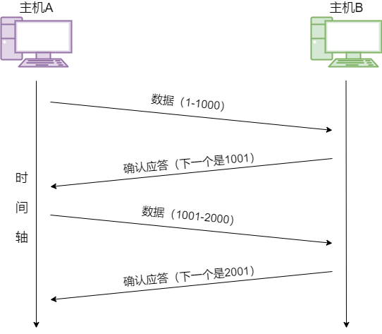

TCP 通过确认应答实现可靠的数据传输。当发送端将数据发出后，会等待对端的确认应答。如果有确认应答，说明数据已经成功到达对端。否则，数据可能已经丢失。

在一定时间内没有等到确认应答，发送端会认为数据已经丢失，并进行重发。这样，即使有丢包，仍能保证数据到达对端，实现可靠传输。

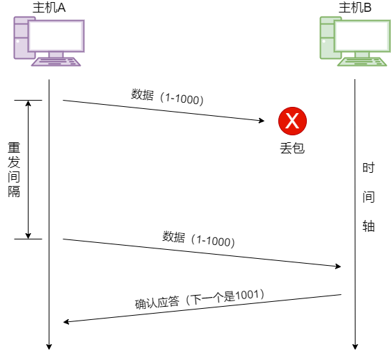

未收到确认应答，不一定是数据丢失。也可能对端已经收到数据，返回的确认应答在途中丢失，也会导致发送端重发。此外，也可能确认应答延迟到达，发送端重发数据后才收到。

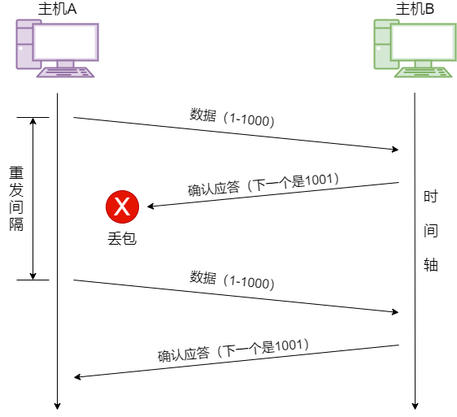

每一次传输数据时，TCP 都会标明段的起始序列号，以便对方确认。在 TCP 中并不直接确认收到哪些段，而是通知发送方下一次应该发送哪一个段，表示前面的段已经收到。比如：收到的确认应答序列号是 N + 1 时，表示 N 以及 N 之前的数据都收到了。

由于每一个段都有唯一的编号，这样的话，当接收端收到重复的段时容易发现，数据段丢失后也容易定位，乱序后也可以重新排列。
### 超时重发
超时重发是指在重发数据之前，等待确认应答到来的那个间隔时间。如果超过 RTT（往返时间），仍未收到确认应答，发送端将进行数据重发。

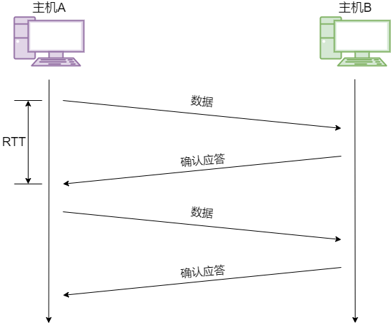

数据被重发后，若还收不到确认应答，则再次发送。这时，等待确认应答的时间将会以 2 倍、4 倍的指数函数增长。数据也不会无限地重发，达到一定的重发次数后，还没收到确认应答，就会认为网络或对端主机发送异常，强制关闭连接，并通知应用通信异常强行终止。

RTT 时间是一个非常重要的参数。过大的 RTT 会导致 TCP 重传非常慢，降低传输的速度；过小的 RTT 会导致 TCP 频繁重传，降低资源的使用效率。在实际情况下，通过实时跟踪数据往返的时间间隔来动态调整 RTT 的数值。
### 连接管理
TCP 提供面向有连接的通信传输，面向有连接是指在数据通信前做好通信两端的准备工作。在数据通信前，发送一个 SYN 包作为建立连接的请求。如果对端发来确认应答，则认为可以开始数据通信。如果对端的确认应答未能到达，就不会进行数据通信。在通信结束时，会使用 FIN 包进行断开连接的处理。

SYN 包和 FIN 包是通过 TCP 头部的控制字段来管理 TCP 连接。一个连接的建立与断开，正常过程至少需要来回发送 7 个包才能完成。建立一个 TCP 连接需要发送 3 个包，这个过程叫作三次握手。断开一个 TCP 连接需要发送 4 个包，这个过程也称作四次挥手。创建一个 TCP 连接，会产生一个 32 位随机序列号，因为每一个新的连接使用一个新的随机序列号。

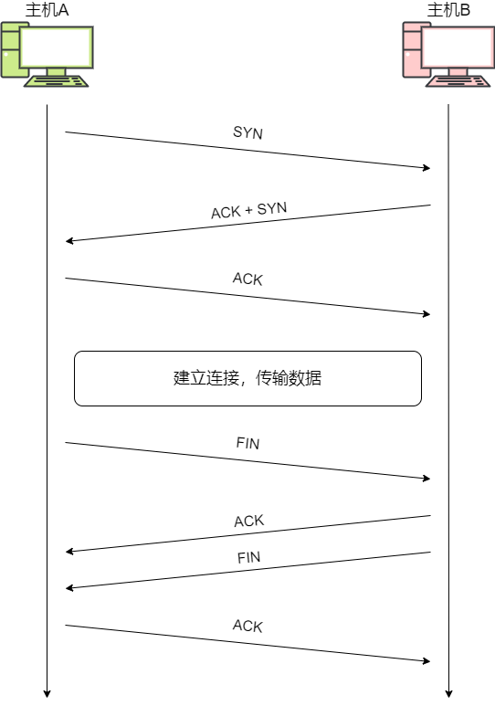

#### 三次握手
主机 A 想向主机 B 发送数据，TCP 模块通过三次握手建立连接 TCP 会话。

三次握手，是指 TCP 会话建立过程中共交换了 3 个 TCP 控制段，它们分布是 SYN 段、SYN + ACK 段、ACK 段。详细过程如下：
发送端主机 A 向接收端主机 B 发出 SYN 段，表示发起建立连接请求，同时把自己的状态告诉主机 B 。将段的序列号设为 a ，SYN 置位，表示 SYN 管理段。
主机 B 收到连接请求后，回应 SYN + ACK 段，将序列号设为 b ，确认号设为 a + 1 ，同时将 SYN 和 ACK 置位。
主机 A 收到主机 B 的连接确认后，发送 ACK 段再次进行确认，确认会话的建立，将 ACK 置位。主机 A 收到确认号是 a + 1 、序列号是 b 的段后，发送序列号为 a + 1 、确认号为 b + 1 的段进行确认。
主机 B 收到确认报文后，连接建立。双方可以开始传输数据。

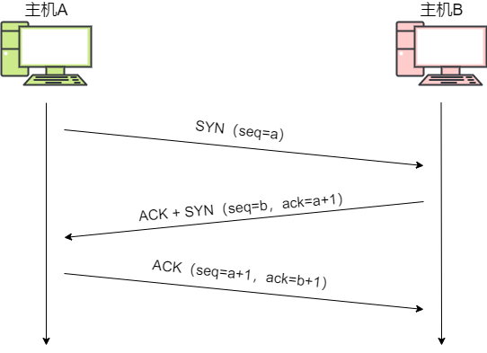

经过 3 次握手后，A 和 B 之间其实是建立了两个 TCP 会话，一个是从 A 指向 B 的 TCP 会话，另一个是从 B 指向 A 的 TCP 会话。A 发送的 SYN 段，表示 A 请求建立一个 从 A 指向 B 的 TCP 会话，目的是控制数据能够正常、可靠的从 A 传输到 B 。B 在收到 SYN 段后，会发送一个 SYN + ACK 段作为回应。SYN + ACK 的含义是：B 一方面同意了 A 的请求，另一方面也请求建立一个从 B 指向 A 的 TCP 会话，这个会话目的是控制数据能够正确、可靠的从 B 传输到 A 。A 收到 SYN + ACK 段后，回应一个 ACK ，表示同意 B 的请求。

#### 四次挥手
当 TCP 数据段的传输结束时，双方都需要发送 FIN 段和 ACK 段来终止 TCP 会话。这个方式叫做四次挥手，详细过程如下：
主机 A 想要终止连接，发送序列号为 p 的段，FIN 置位，表示 FIN 管理段。
主机 B 收到主机 A 发送的 FIN 段后，发送 ACK 段，确认号为 p + 1 ，同时关闭连接。
主机 B 发送序列号为 q的段，FIN 置位，通知连接关闭。
主机 A 收到主机 B 发送的 FIN 段后，发送 ACK 段，确认号为 q + 1 ，同时关闭连接。TCP 连接至此结束。

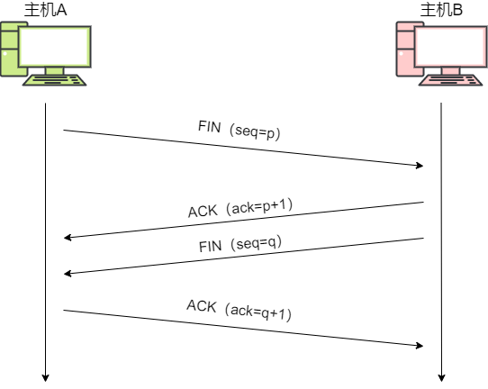

TCP 会话的终止分为两个部分。首先 A 发送 FIN 控制段，请求终止从 A 到 B 的 TCP 会话。B 回应 ACK 段，表示同意 A 的终止会话请求。A 收到 B 的 ACK 段后，才开始终止这个会话。同理，B 也会向 A 发起请求，终止从 B 到 A 的 TCP 会话。

### 单位段
经过传输层协议封装后的数据称为段。在建立 TCP 连接时，可以确定数据段的大小，也就是最大消息长度（MSS，`Maximum Segment Size`）。TCP 在传输大量数据时，是以 MSS 的大小将数据进行分割发送，重发也是以 MSS 为单位。

MSS 是在三次握手时，由两端主机计算出来的。两端主机在发出建立连接的请求时，会在 TCP 头部的选项部分写入 MSS 值。然后在两者间选择较小的值使用。MSS 默认值为 536 字节，理想值是 1460 字节，加上 IP 头部 20 字节和 TCP 头部 20字节，刚好在 IP 层不会被分片。

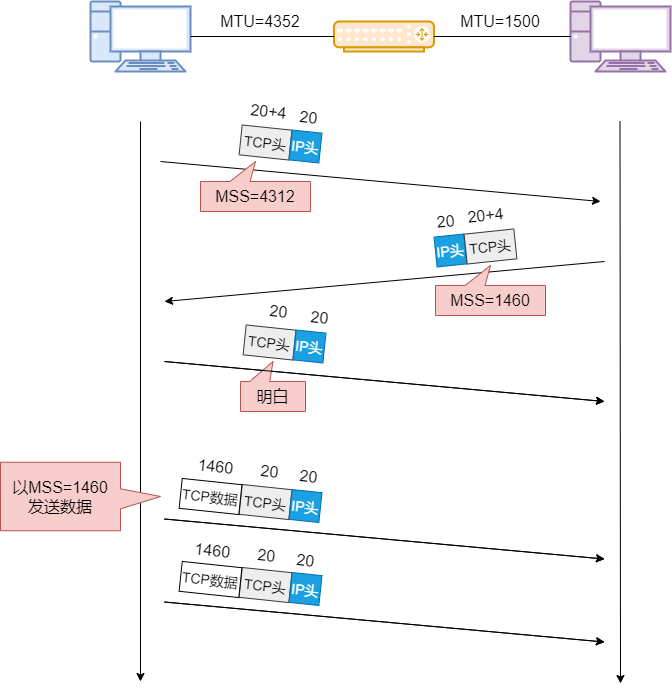

### 窗口控制
TCP 是以 1 个段为单位，每发一个段进行一次确认应答。如果包的往返时间越长，通信性能就越低。

为解决这个问题，TCP 引入了窗口的概念。确认应答不再是每个分段，而是以窗口的大小进行确认，转发时间被大幅度的缩短。窗口大小就是指无需等待确认应答，而可以继续发送数据的最大值。窗口大小是一个 16 位字段，因此窗口最大是 65535 字节。在 TCP 传输过程中，双方通过交换窗口的大小来表示自己剩余的缓冲区（ Buffer ）空间，以及下一次能够接受的最大数据量，避免缓冲区的溢出。

发送数据中，窗口内的数据即使没有收到确认应答也可以发送出去。如果窗口中的数据在传输中丢失，也需要进行重发。因此，发送端主机在收到确认应答前，必须在缓冲区保留这部分数据。

收到确认应答后，将窗口滑动到确认应答中的序列号位置。这样可以按顺序将多个段同时发送，这种机制也被称为滑动窗口控制。

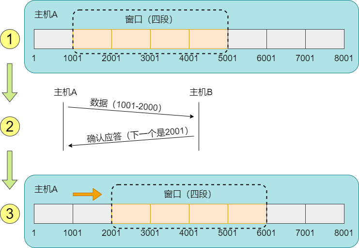

### 窗口控制和重发控制
在使用窗口控制时，如果出现确认应答未能返回的情况，数据已经到达对端，是不需要再进行重发的。然而，在没有使用窗口控制时，没收到确认应答的数据是会重发的。而使用了窗口控制，某些确认应答即使丢失也无需重发。

如果某个报文段丢失，接收主机收到序号不连续的数据时，会为已经收到的数据返回确认应答。即使接收端收到的包序号不是连续的，也不会将数据丢弃，而是暂时保存至缓冲区。出现报文丢失时，同一个序号的确认应答将会被重复发送。如果发送端收到连续 3 次同一个确认应答，就会将对应的数据进行重发。这种机制比超时管理更高效，也被称为高速重发机制。

### 流控制
接收端处于高负荷状态时，可能无法处理接收的数据，并丢弃数据，就会触发重发机制，导致网络流量无端浪费。

为了防止这种情况，TCP 提供一种机制可以让发送端根据接收端的实际接收能力控制发送的数据量，这就是流控制。它的具体操作是，接收端主机通知发送端主机自己可以接收数据的大小，于是发送端会发送不超过这个限度的数据。这个限度的大小就是窗口大小。TCP 头部中有一个字段用来通知窗口大小。

接收主机将缓冲区大小放入这个字段发送给接收端。当接收端的缓存不足或处理能力有限时，窗口大小的值会降低一半，从而控制数据发送量。也就是说，发送端主机会根据接收端主机的指示，对发送数据的量进行控制，也就形成了一个完整的 TCP 流控制。

若接收端要求窗口大小为 0，表示接收端已经接收全部数据，或者接收端应用程序没有时间读取数据，要求暂停发送。

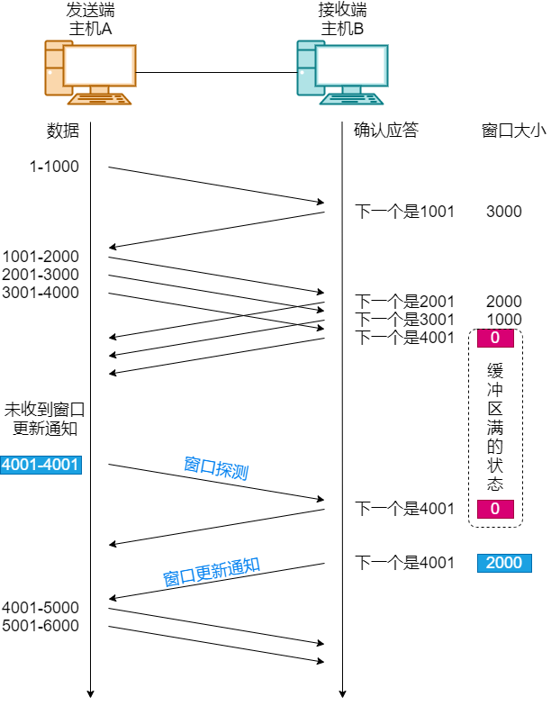

如果窗口更新的报文丢失，可能会导致无法继续通信。为避免这个问题，发送端主机会时不时的发送一个叫窗口探测的数据段，此数据段仅含一个字节以获取最新的窗口大小信息。
### 拥塞控制
有了 TCP 的窗口控制，收发主机之间不再以一个数据段为单位发送确认应答，也能够连续发送大量数据包。在网络出现拥堵时，如果突然发送一个较大量的数据，有可能会导致整个网络瘫痪。为了防止这个问题出现，在通信开始时，就会通过一个叫慢启动的算法得出的数值，对发送数据量进行控制。

为了在发送端调节发送数据的量，需要使用拥塞窗口(`cwnd, Congestion Window`)。在慢启动时，将拥塞窗口的大小设置为 1 MSS 发送数据，之后每收到一次确认应答（ACK）,拥塞窗口的值就加 1。在发送数据包时，将拥塞窗口的大小与接收端主机通知的窗口大小做比较，选择它们当中较小的值发送数据。这样可以有效减少通信开始时连续发包导致网络拥堵，还可以避免网络拥塞的发生。

## UDP
UDP 是不具有可靠性的协议，可靠性功能交给上层的应用去完成。UDP 虽然可以确保发送数据的大小，比如：发送端应用程序发送一个 100 字节的消息，那么接收端应用程序也会以 100 字节为长度接收数据。但不能保证数据一定会到达。因此，应用有时会根据需要进行重发处理。

UDP  全称`User Datagram Protocol`。UDP 不提供复杂的控制机制，利用 IP 提供面向无连接的、不可靠的通信服务。并且它是将应用程序发来的数据，在收到的那一刻，立即按照原样发送到网络上的一种机制。

即使在网络出现拥堵的情况下，UDP 也无法进行流量控制。传输途中出现丢包，UDP 也不负责重发。当出现包的到达顺序错误时也没有纠正的功能。如果需要这些细节控制，那么需要交由上层的应用程序去处理。也可以说，是损失信息传输的可靠性来提升信息传输的效率。

UDP 的特点：
* UDP 是无连接的：UDP 发送数据前不与对方建立连接。
* UDP 不对数据进行排序：UDP 报文的头部没有数据顺序的信息。
* UDP 对数据不发送确认，发送端不知道数据是否被正确接收，也不会重发数据。
* UDP 传送数据比 TCP 快，系统开销也少。
* UDP 缺乏拥塞控制机制，不能够检测到网络拥塞。

由于 UDP 面向无连接，它可以随时发送数据。再加上 UDP 本身的处理既简单又高效，因此常用于以下几个方面：
* 包总量较少的通信（ DNS 、SNMP 等）
* 视频、音频等多媒体通信（即时通信）
* 只在局域网使用的应用通信
* 广播通信（广播、多播）

接收方 UDP 对 IP 层交上来的 UDP，在去除首部后就原封不动地交付上层的应用进程，一次交付一个完整的报文。因此应用程序必须选择合适大小的报文。
* 若报文太长，UDP 把它交给 IP 层后，IP 层在传送时可能要进行分片，这会降低 IP 层的效率。
* 若报文太短，UDP 把它交给 IP 层后，会使 IP 数据报的首部的相对长度太大，这也降低了 IP 层的效率。

### UDP 报文格式
UDP 段由 UDP 头部和 UDP 数据组成。UDP 头部有源端口号、目的端口号、长度、校验和组成，UDP 头部长度为固定的 8 字节。

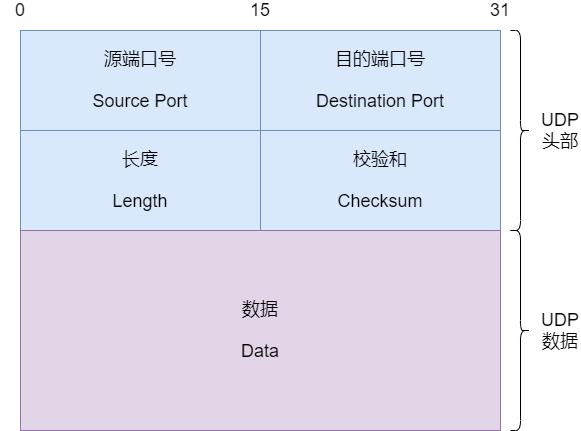

字段说明：
* 源端口号：字段长 16 位，表示发送端 UDP 端口号。
* 目的端口号：字段长 16 位，表示接收端 UDP 端口号。
* 长度：字段长 16 位，表示 UDP 头部和 UDP 数据的总长度。
* 校验和：字段长 16 位，是错误检查的字段，包括 UDP 头和 UDP 数据的内容计算得出，用于检查传输过程中出现的错误。有错就丢弃。

## TCP 和 UDP 的区别
TCP 是可靠的传输协议，一定会优于 UDP 吗？其实不然，TCP是面向连接的，并且具备顺序控制、重发控制等机制，可以为应用提供可靠传输。而 UDP 主要用于对高速传输和实时性有较高要求的通信。比如：通过 IP 电话进行通话。如果使用 TCP，数据如果丢失会重发，这样就无法流畅地传输通话的声音，导致无法进行正常交流。而采用 UDP，它不会进行重发处理。也就不会有声音大幅度延迟到达的问题。即使有部分数据丢失，也只会影响小部分的通话。因此，TCP 和 UDP 需要根据应用的目的选择使用。

| 功能项       | TCP                      | UDP                       |
|-----------|--------------------------|---------------------------|
| 连接服务的类型   | 面向连接                     | 无连接                       |
| 维护连接状态    | 维持端到端的连接状态               | 不维护连接状态                   |
| 对应用层数据的封装 | 对应用层数据进行分段和封装，用端口号识别应用程序 | 对应用层数据直接封装为数据报，用端口号识别应用程序 |
| 数据传输      | 通过序列号和应答机制确保可靠传输         | 不确保可靠传输                   |
| 流量控制      | 使用滑动窗口机制控制流量             | 无流量控制机制                   |

## 常见问题
### TCP和UDP可以使用同一个端口吗？
可以。

传输层有两个传输协议分别是 TCP 和 UDP，在内核中是两个完全独立的软件模块。

当主机收到数据包后，可以在 IP 包头的「协议号」字段知道该数据包是 TCP/UDP，所以可以根据这个信息确定送给哪个模块处理，送给 TCP/UDP 模块的报文根据「端口号」确定送给哪个应用程序处理。

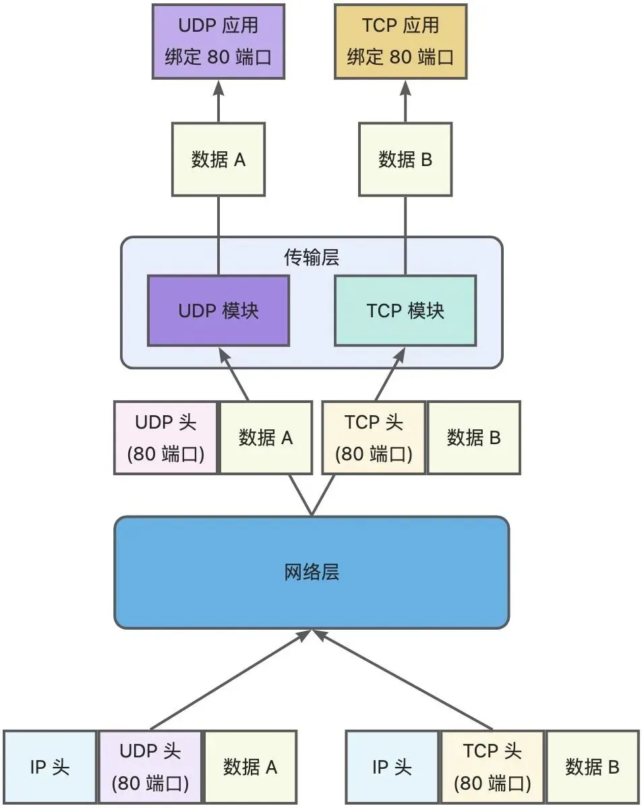

因此，TCP/UDP 各自的端口号也相互独立，如 TCP 有一个 80 号端口，UDP 也可以有一个 80 号端口，二者并不冲突。

