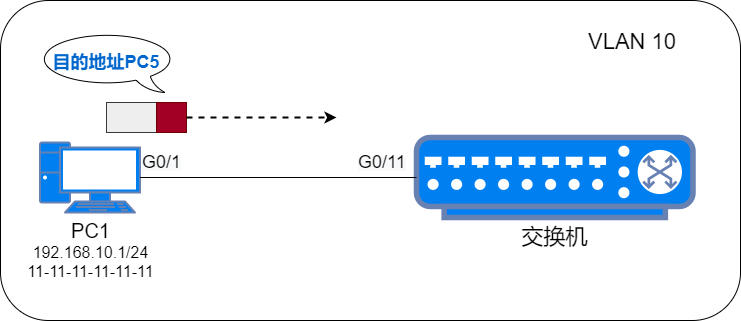
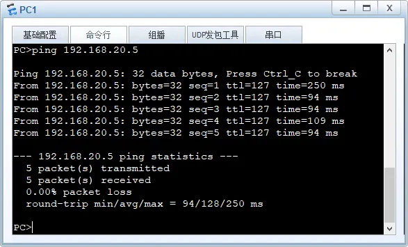

## 冲突和广播域
广播是一种信息的传播方式，指网络中的某一设备同时向网络中所有的其他设备发送数据，这个数据所能广播到的范围即为广播域。简单点说，广播域就是指网络中所有能接收到同样广播消息的设备的集合。

使用一个或多个交换机组成的以太网，所有站点都在同一个广播域。随着交换机变多，这个广播域的范围也会变大，于是就会出现难以维护、广播风暴以及安全等问题。

一个主机想要获取另外一个网段的主机 MAC 地址，需要发送 ARP 广播请求获取对方主机的 MAC 地址。这个广播请求会广播到每一个主机身上，容易导致广播风暴。

网络规模越大，广播域就越大，泛洪流量也越来越大，降低通信效率。在一个广播域内的任意两台主机之间可以任意通信，通信数据有被窃取的风险。


为了解决广播域扩大带来的性能问题和安全性降低问题，VLAN 技术应运而生。VLAN 技术能够在逻辑上把一个物理局域网分隔为多个广播域，每个广播域称为一个虚拟局域网（即 VLAN）。每台主机只能属于一个 VLAN，同属一个 VLAN 的主机通过二层直接通信，属于不同 VLAN 的主机只能通过 IP 路由功能才能实现通信。通过划分多个 VLAN，从而减小广播域传播的范围，过滤多余的包，提高网络的传输效率，同时提高了网络的安全性。


## VLAN 原理
VLAN 技术通过给数据帧插入 VLAN 标签（又叫 VLAN TAG）的方式，让交换机能够分辨出各个数据帧所属的 VLAN。

VLAN 标签是用来区分数据帧所属 VLAN 的，是 4 个字节长度的字段，插入到以太网帧头部上。VLAN 标签会插入到源 MAC 地址后面，IEEE 802.1Q 标准有这个格式定义和字段构成说明。


字段说明：
* TPID（标签协议标识符）：长度 2 个字节，值为`0x8100`，用来表示这个数据帧携带了 802.1Q 标签。不支持 802.1Q 标准的设备收到这类数据帧，会把它丢弃。
* TCI（标签控制信息）：长度 2 个字节，又分为三个子字段，用来表示数据帧的控制信息：
  * 优先级：长度为 3 比特，取值范围 0~7，用来表示数据帧的优先级。取值越大，优先级越高。当交换机发送拥塞是，优先转发优先级高的数据帧。
  * CFI（规范格式指示器）：长度为 1 比特，取值非 0 即 1。
  * VLAN ID（VLAN 标识符）：长度为 12 比特，用来表示 VLAN 标签的数值。取值范围是 1~4094。

### 划分 VLAN 后，交换机如何处理广播报文？
交换机上划分了多个 VLAN 时，在交换机接收到广播数据帧时，只会将这个数据帧在相同 VLAN 的端口进行广播。


### 划分 VLAN 后，交换机如何处理目的 MAC 地址不在 MAC 地址表中的单播数据帧？
交换机上划分了多个 VLAN 时，当交换机接收到一个目的 MAC 地址不存在于自己 MAC 地址表中的单播数据帧时，只会将这个数据帧在相同 VLAN 的端口进行泛洪。


### 划分 VLAN 后，不同 VLAN 的主机能否通信？
划分多 VLAN 的环境中，即使交换机 MAC 地址表里保存了某个数据帧的目的 MAC 地址条目，若这个目的 MAC 地址所对应的端口与数据帧的入端口在不同的 VLAN 中，交换机也不会通过 MAC 地址表中的端口发送数据帧。


在不使用路由转发的前提下，交换机不会从一个 VLAN 的端口中接收到的数据帧，转发给其它 VLAN 的端口。
### 怎么区分不同的 VLAN？
通过 VLAN ID 进行区分，例如 VLAN 10 和 VLAN 20 就是不同的 VLAN。
### VLAN 技术好处
* 增加了广播域的数量，减小了每个广播域的规模，也减少了每个广播域中终端设备的数量；
* 增强了网络安全性，保障网络安全的方法增加了；
* 提高了网络设计的逻辑性，可以规避地理、物理等因素对于网络设计的限制。

## 划分 VLAN
我们可以使用不同的方法，把交换机上的每个端口划分到某个 VLAN 中，以此在逻辑上分隔广播域。

交换机通常会使用基于端口划分 VLAN 的方法。在交换机上手动配置，绑定交换机端口和 VLAN ID 的关系。

优点：配置简单。想要把某个端口划分到某个 VLAN 中，只需要把端口的 PVID （端口 VLAN ID）配置到相应的 VLAN ID 即可。

缺点：当终端设备移动位置时，可能需要为终端设备连接的新端口重新划分 VLAN。

除了这种方法外，还可以使用基于 MAC 地址划分 VLAN、基于 IP 地址划分 VLAN、基于协议划分 VLAN、基于策略划分 VLAN 等方法来划分 VLAN。

> PVID：接口默认 VLAN ID，是交换机端口配置的参数，默认值是 1。

## 跨交换机 VLAN 原理
终端设备不会生成带 VLAN 标签的数据帧，它们发出的数据帧叫做无标记帧（`Untagged`）。它们连接的交换机会给无标记帧打上 VLAN 标签。交换机通过每个端口的 PVID，判断从这个接口收到的无标记帧属于哪个 VLAN，并在转发时，插入相应的 VLAN 标签，从而将无标记帧变为标记帧（`Tagged`）。

当两台交换机通过端口连接时，收到的数据帧是标记帧还是无标记帧？交换机端口会如何处理呢？


交换机根据连接的设备类型，判断各个接口收到的数据帧是否打标，来配置交换机接口的类型。
* 如果交换机接口收到无标记帧，由交换机根据这个接口所在 VLAN 为数据帧打上 VLAN 标签；同时接口发送数据帧时，也不携带 VLAN 标签。应该把这类接口配置为`Access`（接入）接口，`Access`接口连接的链路称为`Access`链路。
* 如果交换机接口收到多个 VLAN 的流量，也就是收到了标记帧；同时为了让对端设备能够区分不同 VLAN 的流量，通过接口发出的流量会打上 VLAN 标签。应该把这类接口配置为`Trunk`（干道）接口，相应的链路称为`Trunk`链路。

### 跨交换机发送数据


主机 A 以主机 F 的 MAC 地址作为目的 MAC 地址封装了一个数据帧，从网卡发送出去。

交换机 A 在`Access`接口收到数据帧。查询 MAC 地址表，发现数据帧的目的地址是与交换机 B 相连的`Trunk`接口。于是交换机给数据帧打上`Access`接口的 PVID 配置，即给数据帧打上 VLAN 10 的标签，并从`Trunk`接口转发给交换机 B。

交换机 B 在`trunk`接口收到数据帧。查看 MAC 地址表，发现是 VLAN 10 的数据帧，目的地址设备是连接在 VLAN 10 的一个`Access`接口上。于是去掉数据帧的 VLAN 标签，并从这个`Access`接口转发给主机 F。

## VLAN三种接口类型
* `Access`接口：这种接口只能属于一个 VLAN，只能接收和发送一个 VLAN 的数据。通常用于连接终端设备，比如主机或服务器等。
* `Trunk`接口：这种接口能够接收和发送多个 VLAN 的数据，通常用于连接交换机。
* `Hybrid`接口：这种接口能够接收和发送多个 VLAN 的数据，可用于交换机的链路，也可用于终端设备。与`Trunk`接口的区别是，发送数据时`Trunk`接口只会摘掉 PVID 标签，而`Hybrid`接口能够不携带 VLAN 标签发送多个 VLAN 数据。

`Access`接口接收数据帧处理过程：


`Access`接口发送数据帧处理过程：


`Trunk`接口接收数据帧处理过程：


`Trunk`接口发送数据帧处理过程：


## VLAN间路由
VLAN 隔离二层网络，必须通过三层网络设备实现。这些设备根据 IP 地址为不同 VLAN 间的流量执行路由转发的操作，称为 VLAN 间路由。


路由技术可以完成处于不同广播域的数据转发决策，而一个 VLAN 就是一个逻辑的广播域，是一个逻辑子网，那么不同 VLAN 的通信需要采用路由技术去解决，而 MAC 地址表只能解决同一 VLAN 内部的通信。

### VLAN 间通信的技术
* 多臂路由实现 VLAN 间通信
* 单臂路由实现 VLAN 间通信
* 三层交换机实现 VLAN 间通信

其中，多臂路由由于扩展性的匮乏在现网中少有应用，单臂路由是一种相对节约设备花费的解决方案，当然它的弱点在于转发性能不够强大，最后一种三层交换机上的实现方式是 VLANIF 技术，这种方式在现网中广泛应用。
### 多臂路由实现 VLAN 间通信
路由器的作用是在不同网络之间转发数据包，VLAN 则是在一台或一组交换机上划分不同的局域网，将它们隔离为不同的网段。因此，不同 VLAN 之间的通信需要路由器来进行转发，也就顺理成章了。不同的 VLAN 连接不同的路由器接口，一个路由器接口连接一个 VLAN 的交换机端口。


假设 PC 和路由器都有同网段中所有设备的 ARP 缓存表，交换机的 MAC 地址表也有各个设备的 MAC 地址信息。那么 PC1 向 PC5 发送数据时，整个过程如下：
1. PC1 查询路由表，发现 PC5 的 IP 地址在另一个网段，需要通过默认网关进行数据转发；
   
2. PC1 以 PC5 的 IP 地址为目的 IP 地址，以默认网关的 MAC 地址为目的 MAC 地址，封装数据帧后发送给交换机；
   
3. 交换机收到数据帧后，查询 MAC 地址表，找到目的 MAC 地址对应的端口，于是将数据帧从这个端口转发出去，即转发给路由器；
   
4. 路由器收到数据帧后，查看数据帧的目的 MAC 地址是自己，于是解封装查看目的 IP 地址。根据目的 IP 地址的网络号查询路由表，发现目的网段的直连路由，以及对应的出接口；
   
5. 路由器以 PC5 的 IP 地址作为目的 IP 地址，以 PC5 的 MAC 地址作为目的 MAC 地址封装报文，并从出接口转发出去，即转发给交换机；
    
6. 交换机查看数据帧的目的 MAC 地址，并根据目的 MAC 地址，将数据帧转发给 PC5。
   

#### 相同 VLAN 的主机如何互相通信？
PC1 向 PC2 发送数据时，由于目的 IP 地址与自己处于同一个网段，PC1 会使用 PC2 的 MAC 地址作为目的 MAC 地址封装数据帧；交换机也会直接通过 PC2 的端口，将数据帧转发给 PC2。


#### 如果不同 VLAN 的 PC1 和 PC3 通讯，交换机是否会直接根据 MAC 地址，把 PC1 发送的报文直接转发给 PC3？
MAC 地址表不仅记录了交换机端口和 MAC 地址的对应关系，还包括这个端口的 VLAN。交换机不会通过查询 MAC 地址表，就把数据帧从不同 VLAN 的端口转发出去。


### 单臂路由实现 VLAN 间通信
路由器用于连接异构网络，特点是有不同类型的物理接口，接口数量少；交换机则是用于组建局域网，特点是物理接口类型少，接口数量多。实际网络环境中，会在一台交换机上创建大量的 VLAN，每个 VLAN 使用一个路由器接口作为默认网关，路由器接口就不够用了。

为了节省路由器的接口，使用一个接口来连接交换机，无论哪个 VLAN 的流量都通过这一个接口进出路由器，实现所有 VLAN 之间的流量转发，这种方式称为单臂路由。


上面的物理拓扑图可能描述的不太清楚，查看下面单臂路由的逻辑拓扑图可以更好的理解原理。


#### 一个路由器接口能够像多个接口那样工作，同时用来传输多个不同 VLAN 的流量吗？
路由器提供了一种称为子接口的逻辑接口。子接口顾名思义，就是通过逻辑的方式，将一个路由器物理接口划分为多个逻辑子接口，来满足用一个物理接口连接多个网络的需求。
### 三层交换机实现 VLAN 间通信
多臂路由和单臂路由都存在固有的缺点，虽然单臂路由在现网应用很多，但是更常用的方案是把三层交换机作为主机的网关使用，此时就需要该交换机具备三层功能，即路由功能。

从流量走向上看单臂路由，是舍近求远的，交换机上两个不同 VLAN 的端口流量，无法通过交换机直接完成数据转发，还需要在路由器上绕一下。这是因为二层交换机没有三层转发能力，无法根据数据包的目的 IP 地址查看自己的路由表；二层交换机也无法成为所连主机的网关，需要一台路由器充当网关。

然后出现了一种在传统以太网交换机的基础上，添加专门路由转发硬件的设备。这类设备不仅有传统二层交换机的功能，还可以通过 ASIC（特殊应用集成电路）实现对数据包的路由。这种集成了三层数据包转发功能的交换机称为三层交换机。

一台三层交换机既可以实现将终端隔离在不同的 VLAN 中，同时位这些终端提供 VLAN 间路由的功能，不需要再借助路由器来转发不同 VLAN 之间的流量。


实现 VLAN 间路由需要给每一个 VLAN 分配一个独立的三层接口作为网关，三层交换机并不是使用三层物理接口连接各个 VLAN，而是通过创建虚拟 VLAN 接口，为每一个 VLAN 分配一个虚拟三层接口。


虚拟 VLAN 接口是由三层交换机创建的，因此三层交换机会作为直连接口，将它们所在的网络作为直连路由填充到路由表中。同时，虚拟 VLAN 接口和对应的 VLAN 中的物理二层端口处于同一个子网中，充当这个 VLAN 的网关。


三层交换机的转发效率和扩展性都远比单臂路由实现 VLAN 间路由更优，管理和配置也更加简单，目前这种方案已成为实现 VLAN 间路由方案的首选。
#### 三层交换机能取代路由器吗？
三层交换机的路由功能通常比较简单，主要是局域网的连接，包含大量的以太网接口，主要用途是提供快速数据交换功能，满足局域网数据交换频繁的应用特点。


而路由器则不同，是为了满足不同类型的网络连接，如局域网与广域网之间的连接、不同协议的网络之间的连接等。它最主要的功能是路由转发，解决各种复杂路径的网络连接，不仅适用于同种协议的局域网间，更适用于不同协议的局域网与广域网间。具有选择最佳路由、负荷分担、链路备份及和其他网络进行路由信息的交换等等功能。


因此，三层交换机与路由器存在着本质区别，三层交换机并不能完全取代路由器的工作。
## 实战
### Access 接口和 Trunk 接口的配置
#### 实验拓扑图


#### 实验要求
* 将 SW1（即交换机 1）和 SW2（即交换机 2）相连的接口配置为`Trunk`接口，允许传输 VLAN 5 的数据；
* 将 PC（即主机）与 SW 相连接口配置为`Access`接口，接口的 PVID 配置为 VLAN 5。

#### 实验步骤
SW 1 上的配置：
```shell
[SW1]vlan 5
[SW1-vlan5]quit
# 进入接口视图
[SW1]interface Ethernet 0/0/1
[SW1-Ethernet0/0/1]port link-type trunk
[SW1-Ethernet0/0/1]port trunk allow-pass vlan 5
[SW1-Ethernet0/0/1]quit
[SW1]interface Ethernet 0/0/2
[SW1-Ethernet0/0/2]port link-type access
[SW1-Ethernet0/0/2]port default vlan 5
[SW1-Ethernet0/0/2]quit
```
检查 SW1 的接口配置，使用命令`display vlan`查看接口 VLAN 情况。
```shell
[SW1]display vlan
The total number of vlans is : 2
--------------------------------------------------------------------------------
U: Up;         D: Down;         TG: Tagged;         UT: Untagged;
MP: Vlan-mapping;               ST: Vlan-stacking;
#: ProtocolTransparent-vlan;    *: Management-vlan;
--------------------------------------------------------------------------------

VID  Type    Ports                                                          
--------------------------------------------------------------------------------
1    common  UT:Eth0/0/1(U)     Eth0/0/3(D)     Eth0/0/4(D)     Eth0/0/5(D)     
                Eth0/0/6(D)     Eth0/0/7(D)     Eth0/0/8(D)     Eth0/0/9(D)     
                Eth0/0/10(D)    Eth0/0/11(D)    Eth0/0/12(D)    Eth0/0/13(D)    
                Eth0/0/14(D)    Eth0/0/15(D)    Eth0/0/16(D)    Eth0/0/17(D)    
                Eth0/0/18(D)    Eth0/0/19(D)    Eth0/0/20(D)    Eth0/0/21(D)    
                Eth0/0/22(D)    GE0/0/1(D)      GE0/0/2(D)                      

5    common  UT:Eth0/0/2(U)                                                     
             TG:Eth0/0/1(U)                                                     

VID  Status  Property      MAC-LRN Statistics Description      
--------------------------------------------------------------------------------
1    enable  default       enable  disable    VLAN 0001                         
5    enable  default       enable  disable    VLAN 0005   
```
### Hybrid 接口的配置
#### 实验拓扑图


#### 实验要求
新建 3 个 VLAN，PC1 属于 VLAN 2，PC2 属于 VLAN 3，Server 1（即服务器 1）属于 VLAN 10；

通过`Hybrid`接口实现 VLAN 2 和 VLAN 3 不能互通，但 VLAN 2 和 VLAN 3 都能与 VLAN 10 进行通信。
#### 实验步骤
SW1 的`E0/0/2`接口，只允许通过 VLAN 2，PC1 又需要访问 VLAN 10，但是无法识别 VLAN 标签信息，因此配置`Hybrid`的 PVID 为 VLAN 2，同时放通 VLAN 2 和 VLAN 10。`E0/0/3`接口配置同理。`E0/0/1`接口需要放通 VLAN 2、VLAN 3 和 VLAN 10 的流量，对端交换机又需要识别 VLAN 标签，因此以带 VLAN 标签的形式放通 VLAN 2、VLAN 3 和 VLAN 10 的流量。SW1 上的配置如下：

```shell
[SW1]vlan batch 2 3 10
[SW1]interface Ethernet 0/0/2
[SW1-Ethernet0/0/2]port link-type hybrid
[SW1-Ethernet0/0/2]port hybrid pvid vlan 2
[SW1-Ethernet0/0/2]port hybrid untagged vlan 2 10
[SW1-Ethernet0/0/2]quit
[SW1]interface Ethernet 0/0/3
[SW1-Ethernet0/0/3]port link-type hybrid
[SW1-Ethernet0/0/3]port hybrid pvid vlan 3
[SW1-Ethernet0/0/3]port hybrid untagged vlan 3 10
[SW1-Ethernet0/0/3]quit
[SW1]interface Ethernet 0/0/1
[SW1-Ethernet0/0/1]port link-type hybrid
[SW1-Ethernet0/0/1]port hybrid tagged vlan 2 3 10
[SW1-Ethernet0/0/1]quit

```
SW2 的`E0/0/1`接口配置和 SW1 的 E0/0/1 接口同理。SW2 的`E0/0/10`接口，只允许通过 VLAN 10，Server1 又需要放通 VLAN 2 和 VLAN 3 的流量，因此配置`Hybrid`的 PVID 为 VLAN 10，同时放通 VLAN 2、VLAN 3 和 VLAN 10。SW2 上的配置如下：
```shell
[SW2]vlan batch 2 3 10
[SW2]interface Ethernet 0/0/1
[SW2-Ethernet0/0/1]port link-type hybrid
[SW2-Ethernet0/0/1]port hybrid tagged vlan 2 3 10
[SW2-Ethernet0/0/1]quit
[SW2]interface Ethernet 0/0/10
[SW2-Ethernet0/0/10]port link-type hybrid
[SW2-Ethernet0/0/10]port hybrid pvid vlan 10
[SW2-Ethernet0/0/10]port hybrid untagged vlan 2310
[SW2-Ethernet0/0/10]quit
```
检查 VLAN 10 信息，分别在 SW1 和 SW2 上使用命令`display vlan 10`查看配置是否正确。
```shell
[SW1]display vlan 10
--------------------------------------------------------------------------------
U: Up;         D: Down;         TG: Tagged;         UT: Untagged;
MP: Vlan-mapping;               ST: Vlan-stacking;
#: ProtocolTransparent-vlan;    *: Management-vlan;
--------------------------------------------------------------------------------

VID  Type    Ports                                                          
--------------------------------------------------------------------------------
10   common  UT:Eth0/0/2(U)     Eth0/0/3(D)                                     
             TG:Eth0/0/1(U)                                                     

VID  Status  Property      MAC-LRN Statistics Description      
--------------------------------------------------------------------------------
10   enable  default       enable  disable    VLAN 0010   
```
```shell
[SW2]display vlan 10
--------------------------------------------------------------------------------
U: Up;         D: Down;         TG: Tagged;         UT: Untagged;
MP: Vlan-mapping;               ST: Vlan-stacking;
#: ProtocolTransparent-vlan;    *: Management-vlan;
--------------------------------------------------------------------------------

VID  Type    Ports                                                          
--------------------------------------------------------------------------------
10   common  UT:Eth0/0/10(U)                                                    
             TG:Eth0/0/1(U)                                                     

VID  Status  Property      MAC-LRN Statistics Description      
--------------------------------------------------------------------------------
10   enable  default       enable  disable    VLAN 0010   
```
### 单臂路由实验
#### 实验拓扑图


#### 实验要求
PC1 能 ping 通 PC5

#### 实验步骤
1. 根据接口 IP 地址表，配置路由器的子接口 IP 地址。
```shell
[RT]interface GigabitEthernet 0/0/1.10
[RT-GigabitEthernet0/0/1.10]dot1q ?
  termination  Termination
[RT-GigabitEthernet0/0/1.10]dot1q termination ?
  vid  Configure PE VLAN ID
[RT-GigabitEthernet0/0/1.10]dot1q termination vid 10
[RT-GigabitEthernet0/0/1.10]ip address 192.168.10.254 24
[RT-GigabitEthernet0/0/1.10]arp ?
  broadcast  ARP broadcast enable
  learning   ARP learning
[RT-GigabitEthernet0/0/1.10]arp broadcast ?
  enable  Enable ARP broadcast function
[RT-GigabitEthernet0/0/1.10]arp broadcast enable 
[RT-GigabitEthernet0/0/1.10]quit
[RT]interface GigabitEthernet 0/0/1.20
[RT-GigabitEthernet0/0/1.20]dot1q termination vid 20
[RT-GigabitEthernet0/0/1.20]ip address 192.168.20.254 24
[RT-GigabitEthernet0/0/1.20]arp broadcast enable 
[RT-GigabitEthernet0/0/1.20]quit 
```
* 命令`interface interface-type interface-number.sub-interface number`创建子接口。子接口编号范围是`1~4096`，与 VLAN ID 保持一致。
* 命令`dot1q termination vid`配置 802.1Q 封装并指定端口的 PVID，确保路由器子接口与对端的交换机端口封装模式一致。
* 命令`arp broadcast enable`启动子接口的 ARP 广播功能。默认状态下，ARP 广播功能是禁用的，收到 ARP 广播帧会直接丢弃。

```shell
[RT]display ip interface brief 
*down: administratively down
^down: standby
(l): loopback
(s): spoofing
The number of interface that is UP in Physical is 4
The number of interface that is DOWN in Physical is 2
The number of interface that is UP in Protocol is 3
The number of interface that is DOWN in Protocol is 3

Interface                         IP Address/Mask      Physical   Protocol  
GigabitEthernet0/0/0              unassigned           down       down      
GigabitEthernet0/0/1              unassigned           up         down      
GigabitEthernet0/0/1.10           192.168.10.254/24    up         up        
GigabitEthernet0/0/1.20           192.168.20.254/24    up         up        
GigabitEthernet0/0/2              unassigned           down       down      
NULL0                             unassigned           up         up(s)
```
```shell
[RT]display ip routing-table 
Route Flags: R - relay, D - download to fib
------------------------------------------------------------------------------
Routing Tables: Public
         Destinations : 10       Routes : 10       

Destination/Mask    Proto   Pre  Cost      Flags NextHop         Interface

      127.0.0.0/8   Direct  0    0           D   127.0.0.1       InLoopBack0
      127.0.0.1/32  Direct  0    0           D   127.0.0.1       InLoopBack0
127.255.255.255/32  Direct  0    0           D   127.0.0.1       InLoopBack0
   192.168.10.0/24  Direct  0    0           D   192.168.10.254  GigabitEthernet0/0/1.10
 192.168.10.254/32  Direct  0    0           D   127.0.0.1       GigabitEthernet0/0/1.10
 192.168.10.255/32  Direct  0    0           D   127.0.0.1       GigabitEthernet0/0/1.10
   192.168.20.0/24  Direct  0    0           D   192.168.20.254  GigabitEthernet0/0/1.20
 192.168.20.254/32  Direct  0    0           D   127.0.0.1       GigabitEthernet0/0/1.20
 192.168.20.255/32  Direct  0    0           D   127.0.0.1       GigabitEthernet0/0/1.20
255.255.255.255/32  Direct  0    0           D   127.0.0.1       InLoopBack0
```
2. 根据 VLAN 划分表，配置 SW 连接路由器端口的 VLAN。
```shell
[SW]interface GigabitEthernet 0/0/1
[SW-GigabitEthernet0/0/1]port link-type trunk 
[SW-GigabitEthernet0/0/1]port trunk allow-pass vlan 10 20
[SW-GigabitEthernet0/0/1]quit 
[SW]display vlan
The total number of vlans is : 3
--------------------------------------------------------------------------------
U: Up;         D: Down;         TG: Tagged;         UT: Untagged;
MP: Vlan-mapping;               ST: Vlan-stacking;
#: ProtocolTransparent-vlan;    *: Management-vlan;
--------------------------------------------------------------------------------

VID  Type    Ports                                                          
--------------------------------------------------------------------------------
1    common  UT:GE0/0/1(U)      GE0/0/2(D)      GE0/0/3(D)      GE0/0/4(D)      
                GE0/0/5(D)      GE0/0/6(D)      GE0/0/7(D)      GE0/0/8(D)      
                GE0/0/9(D)      GE0/0/10(D)     GE0/0/11(D)     GE0/0/12(D)     
                GE0/0/13(D)     GE0/0/14(D)     GE0/0/15(D)     GE0/0/16(D)     
                GE0/0/17(D)     GE0/0/18(D)     GE0/0/19(D)     GE0/0/20(D)     
                GE0/0/21(D)     GE0/0/22(D)     GE0/0/23(D)     GE0/0/24(D)     

10   common  TG:GE0/0/1(U)                                                      
20   common  TG:GE0/0/1(U)                                                      

VID  Status  Property      MAC-LRN Statistics Description      
--------------------------------------------------------------------------------
1    enable  default       enable  disable    VLAN 0001                         
10   enable  default       enable  disable    VLAN 0010                         
20   enable  default       enable  disable    VLAN 0020   
```
3. 测试：`PC1 ping PC5`成功，通过路由器的子接口实现 VLAN 间路由。


