VPN 技术还是企业比较常用的通信技术，如果一个企业的分公司和总部的互访，或者出差员工需要访问总部的网络，都会使用 VPN 技术。
## 什么是VPN
### VPN技术出现背景
在没有 VPN 之前，企业的总部和分部之间的互通都是采用运营商的 Internet 进行通信，那么 Internet 中往往是不安全的，通信的内容可能被窃取、修改等，从而造成安全事件。

那么有没有一种技术既能实现总部和分部间的互通，也能够保证数据传输的安全性呢？

当然有，那就是 VPN。VPN 通过在现有的 Internet 网中构建专用的虚拟网络，实现企业总部和分部的通信，解决了互通、安全、成本的问题。
### 什么是 VPN
`VPN(Virtual Private Network)`即虚拟专用网，指通过 VPN 技术在公有网络中构建专用的虚拟网络。用户在此虚拟网络中传输流量，从而在 Internet 网络中实现安全、可靠的连接。
* 专用：VPN 虚拟网络是专门为本机构的主机用于机构内部的通信，而不是用于和网络外非本机构的主机通信。
* 虚拟：相对于公有网络而言，VPN 网络是虚拟的，是逻辑意义上的一个专网。

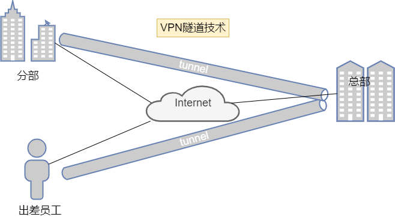

RFC 指明了一些专用地址。专用地址只能用作本地地址而不能用作全球地址。在互联网中的所有路由器，对目的地址是专用地址的数据报一律不进行转发。

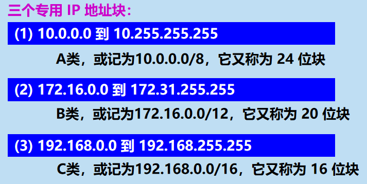

采用这样的专用 IP 地址的互连网络称为专用互联网或就叫做专用网。

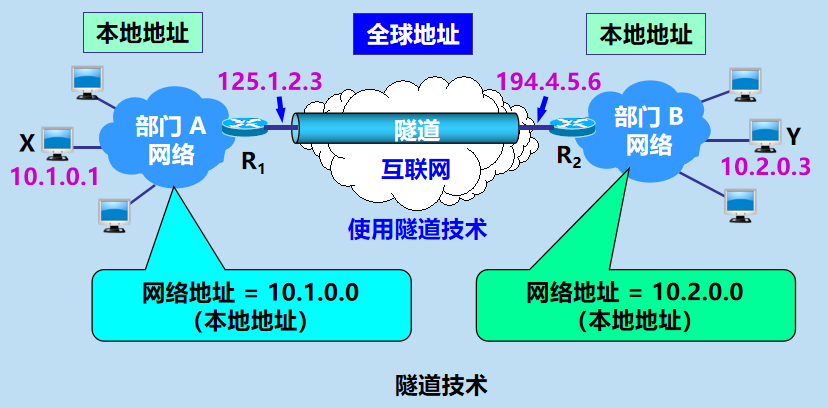

如果专用网不同网点之间的通信必须经过公用的互联网，但又有保密的要求，那么所有通过互联网传送的数据都必须加密。

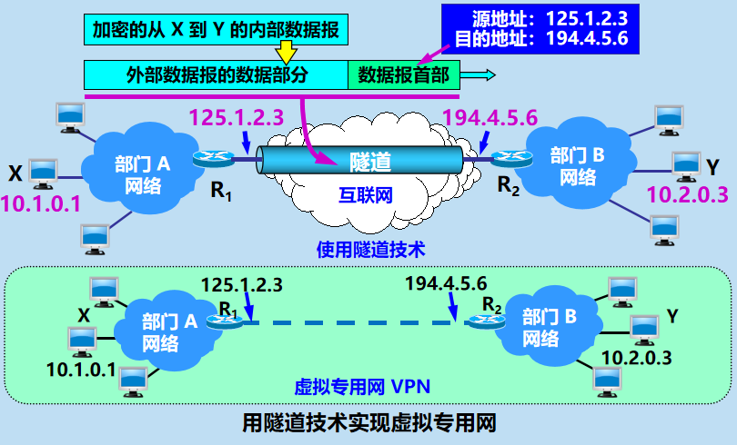

## VPN技术优势
* 安全：在远端用户、驻外机构、合作伙伴、供应商与公司总部之间建立可靠的连接，保证数据传输的安全性。这对于实现电子商务或金融网络与通讯网络的融合特别重要。
* 成本低：利用公共网络进行信息通讯，企业可以用更低的成本连接远程办事机构、出差人员和业务伙伴。
* 支持移动业务：支持出差 VPN 用户在任何时间、任何地点的移动接入，能够满足不断增长的移动业务需求。
* 可扩展性：由于 VPN 为逻辑上的网络，物理网络中增加或修改节点，不影响 VPN 的部署。

## 内联网和外联网
它们都是基于 TCP/IP 协议的。

由部门 A 和 B 的内部网络所构成的虚拟专用网 VPN 又称为内联网(`intranet`)，表示部门 A 和 B 都是在同一个机构的内部。一个机构和某些外部机构共同建立的虚拟专用网 VPN 又称为外联网(`extranet`)。

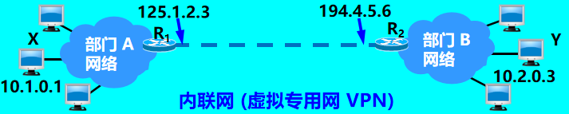

远程接入 VPN 可以满足外部流动员工访问公司网络的需求。

在外地工作的员工拨号接入互联网，而驻留在员工 PC 机中的 VPN 软件可在员工的 PC 机和公司的主机之间建立 VPN 隧道，因而外地员工与公司通信的内容是保密的，员工们感到好像就是使用公司内部的本地网络。
## VPN分类
### 根据 VPN 建设单位不同进行划分
#### 1. 租用运营商VPN专线搭建企业网络
运营商的专线网络大多数都是使用的MPLS VPN。

企业通过购买运营商提供的 VPN 专线服务实现总部和分部间的通信需求。VPN网关为运营商所有。

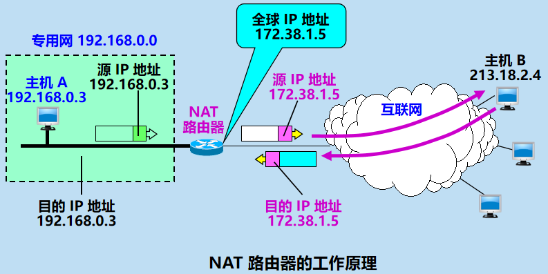

#### 2. 企业自建VPN网络
企业自己基于 Internet 自建 VPN 网络，常见的如 IPsec VPN、GRE VPN、L2TP VPN。

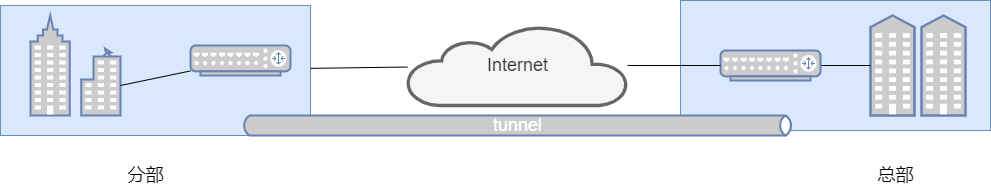

### 根据组网方式进行划分
1. 远程访问VPN
	 这种方式适用于出差员工拨号接入 VPN 的方式，员工可以在只要有 Internet 的地方都可以通过 VPN 接入访问内网资源。
	 最常见的就是SSL VPN、L2TP VPN。
	 
2. 站点到站点的 VPN
	 这种方式适用于企业两个局域网互通的情况。例如企业的分部访问总部。最常见的就是 MPLS VPN、IPSEC VPN。
	 

### 根据工作网络层次进行划分
VPN 可以按照工作层次进行划分：
* 应用层：SSL VPN
* 网络层：IPSEC VPN、GRE VPN
* 数据链路层：L2TP VPN、PPTP VPN

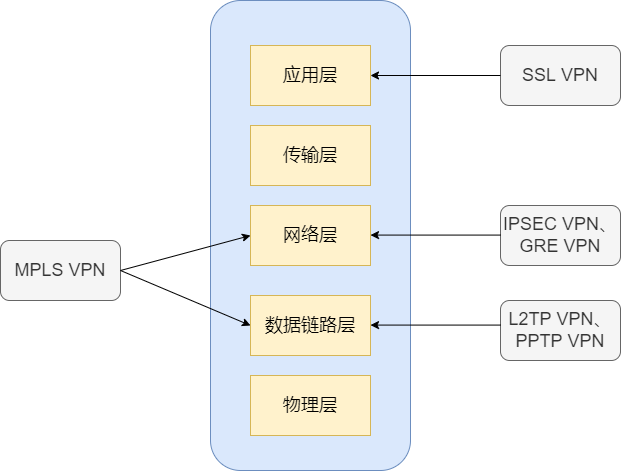

## VPN关键技术
### 隧道技术
VPN 技术的基本原理其实就是用的隧道技术，就类似于火车的轨道、地铁的轨道一样，从 A 站点到 B 站点都是直通的，不会堵车。对于乘客而言，就是专车。

隧道技术其实就是对传输的报文进行封装，利用公网的建立专用的数据传输通道，从而完成数据的安全可靠性传输。

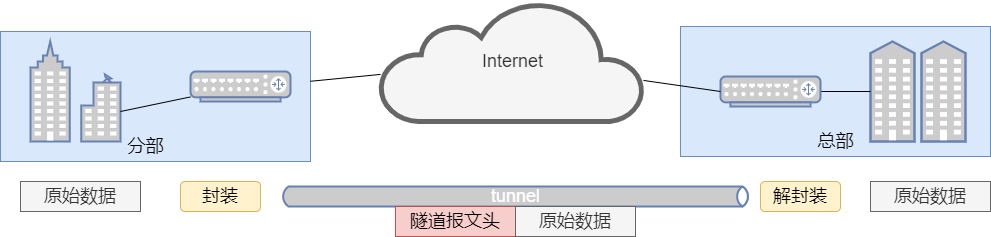

可以看到原始报文在隧道的一端进行封装，封装后的数据在公网上传输，在隧道另一端进行解封装，从而实现了数据的安全传输。

隧道通过隧道协议实现。如`GRE（Generic Routing Encapsulation）、L2TP（Layer 2 Tunneling Protocol）`等。

隧道协议通过在隧道的一端给数据加上隧道协议头，即进行封装，使这些被封装的数据能都在某网络中传输，并且在隧道的另一端去掉该数据携带的隧道协议头，即进行解封装。

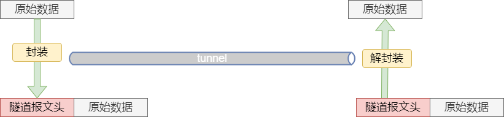

### 身份认证、数据加密、数据验证
身份认证、数据加密、数据验证可以有效保证 VPN 网络和数据的安全性。
* 身份认证：VPN网关对接入VPN的用户进行身份认证，保证接入的用户都是合法用户。
* 数据加密：将明文通过加密技术成密文，哪怕信息被获取了，也无法识别。
* 数据验证：通过数据验证技术验证报文的完整性和真伪进行检查，防止数据被篡改。

|  VPN  |          用户身份认证           |     数据加密和验证      | 备注 |
| :--: |:-------------------------:|:----------------:| :--: |
|  GRE  |            不支持            | 支持简单的关键字验证、校验和验证 | 可结合 IPSec 使用 |
| L2TP  | 支持基于 PPP 的CHAP、PAP、EAP 认证 |       不支持        | 可结合 IPSec 使用 |
| IPSec |            支持             |       支持         | 支持预共享密钥验证或证书验证；支持 IKEv2 的 EAP 认证 |
|  SSL  |            支持             |        支持        | 支持用户名/密码或证书认证 |
| MPLS  |            不支持            |       不支持        | 一般运行在专用的 VPN 骨干网络 |

## GRE
`GRE(Generic Routing Encapsulation)`，是一种VPN技术，通过GRE技术，我们能够对网络层数据进行封装，封装后的数据能够在公共网络中传输。

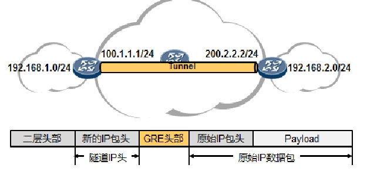

我们看上图，两个信息岛屿`192.168.1.0/24`及`192.168.2.0/24`要互相通信，一种最直接的办法就是打通全网的路由，让中间的公有传输网络中的所有路由器都有到达这两个网段的路由。但是可能有这样的需求：不希望中间的公有网络知道这两个网段的存在，但是仍然希望他们能够互访。这里就可以使用GRE这种VPN技术。

GRE的工作机制非常简单，就是在原始的IP报文的基础上，加上一个新的GRE的头部，然后再套上一个新的隧道IP头。这个新的隧道IP头部用于在中间的公有网络中传输被封装的原始IP数据包。这样一来，即使中间公有网络没有`192.168.1.0/24`及`2.0/24`的路由，两个信息岛屿也能通过我们预先建立好的隧道进行数据互通，互访数据被隧道边界设备封装上GRE头部以及新的隧道头部，然后送入公有网络，数据包在公有网络中传输时，转发数据包的中间设备只会查看隧道IP头并进行路由，最终数据包被转发到隧道对端的边界路由器上，它将数据包的隧道IP头及GRE头部解除封装，然后将里头承载的原始IP报文转发到目的地。

GRE的特点：
* 可用于在站点之间建立点到点的专用通信隧道；
* GRE头部的通用性非常高，能承载各种类型的上层协议，例如IPv4、IPv6等报文；
* GRE的实现机制及配置非常简单，采用手工方式建立隧道；
* 不提供数据加密功能，可配合IPSec来增强安全性；
* 不提供QoS能力；
* 建立好的GRE隧道支持动态路由协议。

### GRE的配置及实现

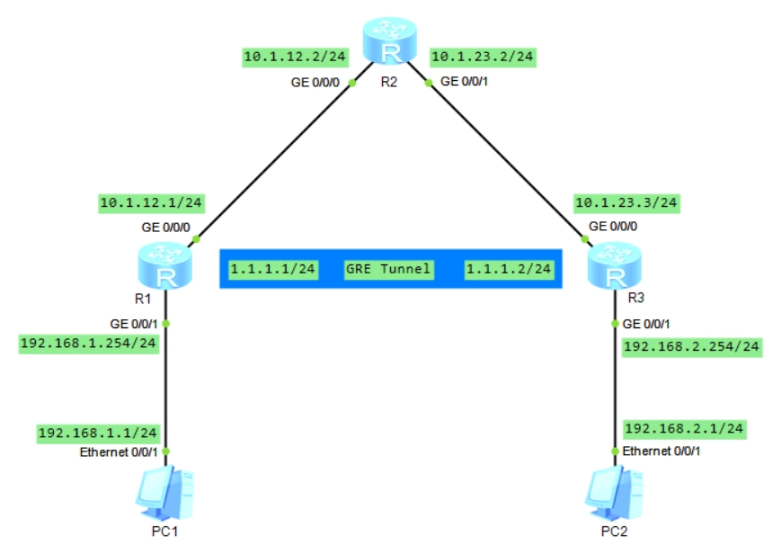
网络拓扑如上图所示。其中，R2只配置接口IP地址，并不配置任何静态路由，也不运行动态路由协议。在R1及R2之间建立GRE隧道，使得192.168.1.0/24与192.168.2.0/24网段能够互通。
```shell
[R1]interface GigabitEthernet 0/0/0
[R1-GigabitEthernet0/0/0]ip address 10.1.12.1 24
[R1-GigabitEthernet0/0/0]quit 
[R1]interface GigabitEthernet 0/0/1
[R1-GigabitEthernet0/0/1]ip address 192.168.1.254 24
[R1-GigabitEthernet0/0/1]quit 
[R1]ip route-static 0.0.0.0 0 10.1.12.2
[R1]interface ?
  Bridge-if         Bridge-if interface
  Dialer            Dialer interface
  Eth-Trunk         Ethernet-Trunk interface
  GigabitEthernet   GigabitEthernet interface
  Ima-group         ATM-IMA interface
  LoopBack          LoopBack interface
  MFR               MFR interface
  Mp-group          Mp-group interface
  NULL              NULL interface
  Tunnel            Tunnel interface
  Virtual-Ethernet  Virtual-Ethernet interface
  Virtual-Template  Virtual-Template interface
  Vlanif            Vlan interface
  Wlan-Ess          Wlan-Ess interface
# 创建Tunnel0/0/0接口
[R1]interface Tunnel 0/0/0
[R1-Tunnel0/0/0]tunnel-protocol ?
  gre        Generic Routing Encapsulation
  ipsec      IPSEC Encapsulation
  ipv4-ipv6  IP over IPv6 encapsulation
  ipv6-ipv4  IPv6 over IP encapsulation
  mpls       MPLS Encapsulation
  none       Null Encapsulation
# 指定Tunnel接口的协议类型为GRE
[R1-Tunnel0/0/0]tunnel-protocol gre
# 配置Tunnel接口的IP地址
[R1-Tunnel0/0/0]ip address 1.1.1.1 24
[R1-Tunnel0/0/0]source ?
  GigabitEthernet  GigabitEthernet interface
  NULL             NULL interface
  Tunnel           Tunnel interface
  X.X.X.X          IP address
# 指定Tunnel的本地源
[R1-Tunnel0/0/0]source GigabitEthernet 0/0/0
# 指定Tunnel的目的地址
[R1-Tunnel0/0/0]destination ?
  X.X.X.X       IP address
  vpn-instance  VPN Routing/Forwarding parameters on the interface
[R1-Tunnel0/0/0]destination 10.1.23.3
[R1-Tunnel0/0/0]quit 
# 配置静态路由，将去往192.168.2.0/24的流量引导向隧道接口
[R1]ip route-static 192.168.2.0 24 Tunnel 0/0/0
[R1]display ip routing-table 
Route Flags: R - relay, D - download to fib
------------------------------------------------------------------------------
Routing Tables: Public
         Destinations : 15       Routes : 15       

Destination/Mask    Proto   Pre  Cost      Flags NextHop         Interface

        0.0.0.0/0   Static  60   0          RD   10.1.12.2       GigabitEthernet0/0/0
        1.1.1.0/24  Direct  0    0           D   1.1.1.1         Tunnel0/0/0
        1.1.1.1/32  Direct  0    0           D   127.0.0.1       Tunnel0/0/0
      1.1.1.255/32  Direct  0    0           D   127.0.0.1       Tunnel0/0/0
      10.1.12.0/24  Direct  0    0           D   10.1.12.1       GigabitEthernet0/0/0
      10.1.12.1/32  Direct  0    0           D   127.0.0.1       GigabitEthernet0/0/0
    10.1.12.255/32  Direct  0    0           D   127.0.0.1       GigabitEthernet0/0/0
      127.0.0.0/8   Direct  0    0           D   127.0.0.1       InLoopBack0
      127.0.0.1/32  Direct  0    0           D   127.0.0.1       InLoopBack0
127.255.255.255/32  Direct  0    0           D   127.0.0.1       InLoopBack0
    192.168.1.0/24  Direct  0    0           D   192.168.1.254   GigabitEthernet0/0/1
  192.168.1.254/32  Direct  0    0           D   127.0.0.1       GigabitEthernet0/0/1
  192.168.1.255/32  Direct  0    0           D   127.0.0.1       GigabitEthernet0/0/1
    192.168.2.0/24  Static  60   0           D   1.1.1.1         Tunnel0/0/0
255.255.255.255/32  Direct  0    0           D   127.0.0.1       InLoopBack0
```
`source gigabitEthernet0/0/0`命令用于指定隧道在本设备的源接口，这条命令同时会将隧道的源地址指定为该接口的地址，也即`10.1.12.1`。使用`source 10.1.12.1`命令可以实现类似的效
果。
```shell
[R2]interface GigabitEthernet 0/0/0
[R2-GigabitEthernet0/0/0]ip address 10.1.12.2 24
[R2-GigabitEthernet0/0/0]quit
[R2]interface GigabitEthernet 0/0/1
[R2-GigabitEthernet0/0/1]ip address 10.1.23.2 24
```
```shell
[R3]interface GigabitEthernet 0/0/0
[R3-GigabitEthernet0/0/0]ip address 10.1.23.3 24
[R3-GigabitEthernet0/0/0]quit 
[R3]interface GigabitEthernet 0/0/1
[R3-GigabitEthernet0/0/1]ip address 192.168.2.254 24
[R3-GigabitEthernet0/0/1]quit 
[R3]ip route-static 0.0.0.0 0 10.1.23.2
[R3]interface Tunnel 0/0/0
[R3-Tunnel0/0/0]tunnel-protocol gre
[R3-Tunnel0/0/0]ip address 1.1.1.2 24
[R3-Tunnel0/0/0]source GigabitEthernet 0/0/0
[R3-Tunnel0/0/0]destination 10.1.12.1
[R3-Tunnel0/0/0]quit
[R3]ip route-static 192.168.1.0 24 Tunnel 0/0/0
```
完成配置后，PC1 即可与 PC2 相互通信。实际的报文交互过程如下：

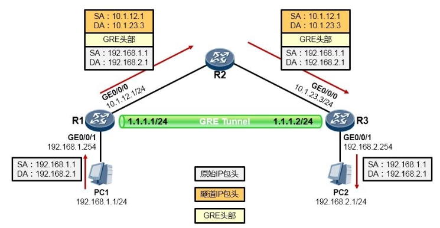

## IPSecVPN
### IPSec协议框架
IPSec 是一种开放的标准框架结构，是由 IETF 指定的标准，是特定的通信方之间在IP层通过加密和数据 摘要（`hash`）等手段，来保证数据包在公网上传输时的机密性(`confidentiality`) 、完整性(`data integrity`)和真实性(`origin authentication`)等。IPSec 只能工作在 IP 层，要求乘客协议和承载协议都是 IP 协议。

IPSec 并不是一个单一的协议，而是一个框架。

| 协议                  | 说明                                          |   |
|---------------------|---------------------------------------------|---|
| IKE(Internet密钥交换协议) | 负责建立和维护SA，重要的功能有：协商协议参数、对等体身份验证、协商密钥及对密钥的管理 |   |
| AH(认证包头协议)          | 实际保护流量的安全协议                                 |   |
| ESP(负载安全封装协议)       | 实际保护流量的安全协议                                 |   |

IPSec 的框架包含若干个协议。最重要的就是 IKE 和两个安全协议（AH、ESP）。其中 IKE（Internet 秘钥交换协议）是核心和根本，这是个混合协议，它包含三个协议：
* Oakley：提供了 IPSec 对各种技术的支持。例如对新的加密和散列算法的支持。实际上它是为 IPSec 提供一种框架
* SKEME：定义密钥交换的机制。
* ISAKMP：定义了消息交换的体系结构，包含对等体间消息的格式及状态转变

其实我们只要关注  ISAKMP 就好了，它是整个 IKE 的核心。ISAKMP 负责 IPSecVPN 中非常重要的几项工作：负责建立和维护 SA（IKE SA 及 IPsecSA）、协商协议 参数（如加密、验证协议等）、对等体身份验证、协商密钥、以及对密钥的管理。ISAKMP 还定义了消 息交换的体系结构，包含对等体之间用于 IPSec 协商的报文格式、状态机等。

IPSec 协议框架的另一个重要的协议类型：安全协议，它是真正负责保护用户数据的协议，包括两个：AH 及 ESP。
* `AH(Authentication Header)`：认证包头协议，提供数据源认证、数据完整性校验、防重放攻击等功能，不支持数据加密
* `ESP(Encapsulating Security Payload)`：负载安全载荷协议，提供数据源认证、数据完整性校验、防重放攻击、数据加密等功能

### IKE的两个阶段

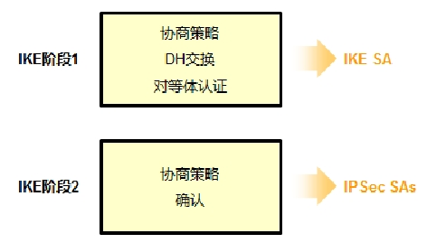

当我们在两个站点之间部署 IPSecVPN 时，IPSecVPN 的一个感兴趣报文到达后，将触发 IKE 的工作。IKE 通过两个阶段建立一条安全的 IPSecVPN 隧道，使得受保护的流量能够在公网中安全的传输，这两个阶段就是安全领域经典的 IKE 阶段一及阶段二。
#### IKE阶段一
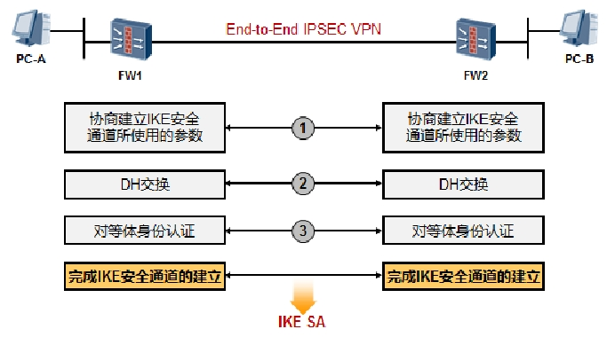

阶段一的主要工作内容是协商安全策略、进行 DH 交换、对等体认证。
* 与安全策略协商相关的内容，在华为的设备上的配置就是`IKE Proposal`，包括用于IKE隧道的加密算法、哈希算法、DH 算法组等策略，两个站点的策略要一致。
* DH  交换就是交换公共值，DH算法是一个神奇的算法，两个站点的防火墙之间通过交换几个公共值，再经过一系列的数学运算，最终得到三把秘钥。而即使有人侦听了DH公共值交换的报文，也无法
推导出这三把秘钥。
* 接下去就是对等体的身份认证，最简单的方式就是预共享秘钥的方式，两个站点在防火墙上配置一个统一的密码，如果密码一致则说明两个对等体是可信赖的。

阶段一完成的标志是 IKE SA 的建立，SA（`Security Associations`，安全关联）可以简单理解为 IPSec 对等体双方的一共安全共识。

SA 一共有两种，一种是这里提到的 IKE SA，IKE 对等体双方有一个共同的 IKE SA。另一种 SA 是IPSec SAs，一个 IPSec 会话有两个 IPSec SAs。阶段一有两个模式，我们上文中描述的是主模式，也是应用的较为广泛的模式，另一种模式是野蛮模式。

阶段一的工作可以理解为是在为阶段二做铺垫，阶段一协商妥当的相关安全策略如加密算法、哈希算法等，都是为了保护第二阶段的相关 ISAKMP 数据。
#### IKE阶段二
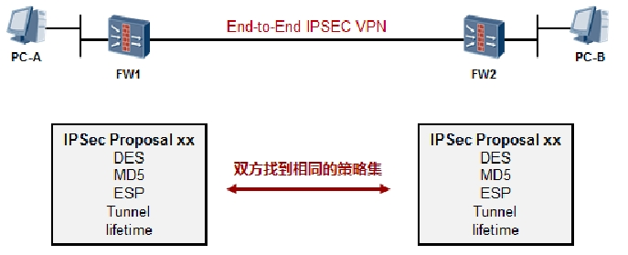

IKE 第一阶段完成后，就会进入 IKE 第二阶段，在阶段二最主要的任务是明确第二阶段的策略（在华为设备的配置中就是`IPSec Proposal`），这些策略包括加密算法、哈希算法等等，注意，这里的这些策略，要和阶段一的策略区分开来，这里所协商的策略是最终用于保护实际业务流量的策略，而阶段一的那些 策略是用于保护 IPSec 协商的数据（主要是为了保护 IKE 阶段二的协商过程）。

阶段二完成的标志是双方都明确了 IPSec SAs，这里的 IPSec SAs 实际上是包含两个 SA：入站及出站。FW1 上的出站 SA 用于保护从 FW1 发往 FW2 的数据，这个 SA 对应 FW2 上的入站 SA，而 FW1 的入站 SA 对应 FW2 的出站 SA。
#### IKE两个阶段完成后：
IKE 两个阶段完成后，IPSecVPN 的隧道就算是建立起来了，上面说了标志性的里程碑就是 IPSec SAs 的建立，如果 IPSecVPN 隧道正确建立，站点的 IPSecVPN 安全设备上应该有两个 IPSec SAs，一个是出站的 outbound SA，一个是入站的 Inbound SA。站点 1 的出站 SA 对应站点 2 的入站 SA，站点1 的入站 SA 对应站点 2 的出站 SA，如下图所示。

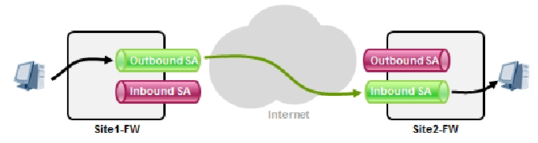

IPSec SAs 中保存着双方协商好的加密算法、哈希算法、秘钥信息等等。当站点 1 的 FW 收到来自本地内网的流量，如果该流量匹配了 IPSecVPN 的感兴趣数据流，它就会根据出站 SA 中指示的加密算法，以及秘钥对数据进行加密，并做加密后的数据做哈希，将处理好的数据封装在 ESP（安全协议，此处以 ESP 为例）后，并在ESP头部中写入明确SA的SPI（索引值，这个索引值对应`Site2-FW`的入站 SA），然后再封装上新的 IP 头以便数据能够在公网中传输。

`Site2-FW`收到数据后，将隧道 IP 头部去除，发现里头是个 ESP 封装的报文，于是从 ESP 头部中的 SPI 在本地查找，找到 SPI 值对应的 SA，也就是匹配的入站 SA，将数据做完整性校验，校验通过后对数据进行解密，最后得到明文的原始报文，然后将报文传递到本地内网目标节点。

### 路由器上的LAN-to-LAN IPSec VPN（IKE协商）
#### 实验拓扑

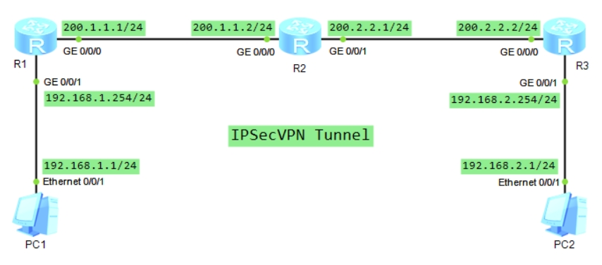

#### 实验要求
* 在 R1 及 R3 上配置高级 ACL 用于匹配 IPSecVPN 感兴趣流量。
* 在 R1 及 R3 上创建`IKE Proposal`，用于指定 IKE 阶段一的策略。
* 在 R1 及 R3 上配置`IKE peer`，用于指示对等体（地址等信息）。在本例中，使用的是域共享秘钥的方式进行对等体身份验证。
* 在 R1 及 R3 上创建`IPSec Proposal`，用于指定 IKE 阶段二的策略，以便协商 IPSec SA。
* 在 R1 及 R3 上创建`IPSec Policy`，用于将`ACL、IKE Proposal、IPSec Proposal、IKE Peer`等信息进行关联。
* 在 R1 及 R3 上将`IPSec Policy`应用在接口上。

#### 实验步骤
```shell
[R1]interface GigabitEthernet 0/0/0
[R1-GigabitEthernet0/0/0]ip address 200.1.1.1 24
[R1-GigabitEthernet0/0/0]quit
[R1]interface GigabitEthernet 0/0/1
[R1-GigabitEthernet0/0/1]ip address 192.168.1.254 24
[R1-GigabitEthernet0/0/1]quit
# R1配置IPSecVPN感兴趣数据流，这些流量将会被IPSecVPN保护
[R1]acl 3000
[R1-acl-adv-3000]rule permit ?
  <1-255>  Protocol number
  gre      GRE tunneling(47)
  icmp     Internet Control Message Protocol(1)
  igmp     Internet Group Management Protocol(2)
  ip       Any IP protocol
  ipinip   IP in IP tunneling(4)
  ospf     OSPF routing protocol(89)
  tcp      Transmission Control Protocol (6)
  udp      User Datagram Protocol (17)
[R1-acl-adv-3000]rule permit ip source 192.168.1.0 0.0.0.255 destination 192.168.2.0 0.0.0.255
[R1-acl-adv-3000]quit
# 配置默认路由，使得R1与R3能够互通
[R1]ip route-static 0.0.0.0 0 200.1.1.2
# R1配置IKE阶段一的策略IKE Proposal
[R1]ike ?
  heartbeat            IKE heartbeat detection
  heartbeat-timer      Specify IKE heartbeat timer
  local-name           Set local ID
  nat-keepalive-timer  Set the keepalive Interval parameter
  peer                 Specify IKE peer
  proposal             Config an IKE security proposal
[R1]ike proposal 1
# 加密算法
[R1-ike-proposal-1]encryption-algorithm ?
  3des-cbc     168 bits 3DES-CBC
  aes-cbc-128  Use AES-128
  aes-cbc-192  Use AES-192
  aes-cbc-256  Use AES-256
  des-cbc      56 bits DES-CBC
[R1-ike-proposal-1]encryption-algorithm aes-cbc-128
# 哈希算法
[R1-ike-proposal-1]authentication-algorithm ?
  aes-xcbc-mac-96  Select aes-xcbc-mac-96 as the hash algorithm
  md5              Select MD5 as the hash algorithm
  sha1             Select SHA as the hash algorithm
  sm3              Select sm3 as the hash algorithm
[R1-ike-proposal-1]authentication-algorithm sha1 
[R1-ike-proposal-1]quit
# R1配置对等体信息，用于IKE阶段一的身份验证
[R1]ike peer ?
  STRING<1-15>   IKE peer name, up to 15 characters
[R1]ike peer R3 ?
  v1    Only V1 SA's can be created
  v2    Only V2 SA's can be created
  <cr>  Please press ENTER to execute command 
[R1]ike peer R3 v1
# 关联上面定义的IKE Proposal 1
[R1-ike-peer-R3]ike-proposal 1
# 配置用于身份认证的密码
[R1-ike-peer-R3]pre-shared-key ?
  cipher  Pre-shared-key with cipher text
  simple  Pre-shared-key with plain text
[R1-ike-peer-R3]pre-shared-key cipher Huawei123
# 对等体的地址
[R1-ike-peer-R3]remote-address 200.2.2.2
# 本设备的地址
[R1-ike-peer-R3]local-address 200.1.1.1
[R1-ike-peer-R3]quit
[R1]ipsec ?
  anti-replay      Config IPSec Anti replay
  decrypt          Decrypt
  df-bit           Set the df-bit value
  efficient-vpn    Efficient-vpn
  fragmentation    Set fragmentation
  policy           Config IPSec security policy
  policy-template  Policy template
  profile          Config IPSec security profile
  proposal         Config IPSec security proposal
  remote           Remote side
  sa               Specify the parameters of security association(SA)
# R1配置IKE阶段二的策略IPSec Proposal
[R1]ipsec proposal myset
# 安全协议
[R1-ipsec-proposal-myset]transform ?
  ah      AH protocol defined in RFC2402
  ah-esp  ESP protocol first, then AH protocol
  esp     ESP protocol defined in RFC2406
[R1-ipsec-proposal-myset]transform esp
# 哈希算法
[R1-ipsec-proposal-myset]esp authentication-algorithm sha1
# 加密算法
[R1-ipsec-proposal-myset]esp encryption-algorithm ?
  3des     Use 3DES
  aes-128  Use AES-128
  aes-192  Use AES-192
  aes-256  Use AES-256
  des      Use DES
  sm1      Use SM1
  <cr>     Please press ENTER to execute command 
[R1-ipsec-proposal-myset]esp encryption-algorithm 3	
[R1-ipsec-proposal-myset]esp encryption-algorithm 3des 
[R1-ipsec-proposal-myset]quit
# R1上完成IPsec Policy的配置
[R1]ipsec policy ?
  STRING<1-15>   Name of IPSec security policy
[R1]ipsec policy mypolicy ?
  INTEGER<1-10000>  The sequence number of IPSec policy
  shared            Shared
[R1]ipsec policy mypolicy 10 ?
  isakmp  Indicates use IKE to establish the IPSec SA
  manual  Indicates use manual to establish the IPSec SA
  <cr>    Please press ENTER to execute command 
[R1]ipsec policy mypolicy 10 isakmp
[R1-ipsec-policy-isakmp-mypolicy-10]security ?
  acl  Specify the packets by acl
# 关联上面定义好的ACL3000
[R1-ipsec-policy-isakmp-mypolicy-10]security acl 3000
# 关联上面定义好的IPSec Proposal
[R1-ipsec-policy-isakmp-mypolicy-10]proposal myset
# 指定对等体
[R1-ipsec-policy-isakmp-mypolicy-10]ike-peer R3
[R1-ipsec-policy-isakmp-mypolicy-10]quit
# 在R1的出接口应用IPSecPolicy
[R1]interface GigabitEthernet 0/0/0
[R1-GigabitEthernet0/0/0]ipsec ?
  efficient-vpn  Efficient-vpn
  policy         Config IPSec security policy
[R1-GigabitEthernet0/0/0]ipsec policy ?
  STRING<1-15>   Name of IPSec security policy
[R1-GigabitEthernet0/0/0]ipsec policy mypolicy 
```
```shell
[R3]interface GigabitEthernet 0/0/0
[R3-GigabitEthernet0/0/0]ip address 200.2.2.2 24
[R3-GigabitEthernet0/0/0]quit
[R3]interface GigabitEthernet 0/0/1
[R3-GigabitEthernet0/0/1]ip address 192.168.2.254 24
[R3-GigabitEthernet0/0/1]quit

[R3]acl 3000
[R3-acl-adv-3000]rule permit ip source 192.168.2.0 0.0.0.255 destination 192.168.1.0 0.0.0.255
[R3-acl-adv-3000]quit

[R3]ip route-static 0.0.0.0 0 200.2.2.1
# R3配置IKE阶段一的策略IKE Proposal
[R3]ike proposal 1
[R3-ike-proposal-1]encryption-algorithm aes-cbc-128
[R3-ike-proposal-1]authentication-algorithm sha1 
[R3-ike-proposal-1]quit
# R3配置对等体信息，用于IKE阶段一的身份验证
[R3]ike peer R1 v1
[R3-ike-peer-R1]ike-proposal 1
[R3-ike-peer-R1]pre-shared-key cipher Huawei123
[R3-ike-peer-R1]remote-address 200.1.1.1
[R3-ike-peer-R1]local-address 200.2.2.2
[R3-ike-peer-R1]quit
# R3配置IKE阶段二的策略IPSec Proposal
[R3]ipsec proposal myset
[R3-ipsec-proposal-myset]transform esp
[R3-ipsec-proposal-myset]esp authentication-algorithm sha1
[R3-ipsec-proposal-myset]esp encryption-algorithm 3des 
[R3-ipsec-proposal-myset]quit
# R3上完成IPsec Policy的配置
[R3]ipsec policy mypolicy 10 isakmp
[R3-ipsec-policy-isakmp-mypolicy-10]security acl 3000
[R3-ipsec-policy-isakmp-mypolicy-10]proposal myset
[R3-ipsec-policy-isakmp-mypolicy-10]ike-peer R1
[R3-ipsec-policy-isakmp-mypolicy-10]quit
# 在R3的出接口应用IPSecPolicy
[R3]interface GigabitEthernet 0/0/0
[R3-GigabitEthernet0/0/0]ipsec policy mypolicy
```
```shell
[R2]interface GigabitEthernet 0/0/0
[R2-GigabitEthernet0/0/0]ip address 200.1.1.2 24
[R2-GigabitEthernet0/0/0]quit
[R2]interface GigabitEthernet 0/0/1
[R2-GigabitEthernet0/0/1]ip address 200.2.2.1 24
```
完成配置后，可在PC1上去`ping` PC2 的地址，这样一来将在R1上触发IPsec VPN的感兴趣流量，R1-R3 之间就会开始进行IKE的协商。协商成功的标志是，在R1及R3上生成安全关联SA：
```shell
[R1]display ike sa
    Conn-ID  Peer            VPN   Flag(s)                Phase  
  ---------------------------------------------------------------
       53    200.2.2.2       0     RD|ST                  2     
       52    200.2.2.2       0     RD|ST                  1     

  Flag Description:
  RD--READY   ST--STAYALIVE   RL--REPLACED   FD--FADING   TO--TIMEOUT
  HRT--HEARTBEAT   LKG--LAST KNOWN GOOD SEQ NO.   BCK--BACKED UP
[R1]display ipsec sa

===============================
Interface: GigabitEthernet0/0/0
 Path MTU: 1500
===============================

  -----------------------------
  IPSec policy name: "mypolicy"
  Sequence number  : 10
  Acl Group        : 3000
  Acl rule         : 5
  Mode             : ISAKMP
  -----------------------------
    Connection ID     : 53
    Encapsulation mode: Tunnel
    Tunnel local      : 200.1.1.1  #IPsec Tunnel的本地地址
    Tunnel remote     : 200.2.2.2  #IPSec Tunnel的远端地址
    Flow source       : 192.168.1.0/255.255.255.0 0/0 #感兴趣流量
    Flow destination  : 192.168.2.0/255.255.255.0 0/0
    Qos pre-classify  : Disable

    [Outbound ESP SAs]  #接口出站方向的ESP SAs
      SPI: 3741715135 (0xdf060abf)  #出站SPI，对应R3上的入站SPI
      Proposal: ESP-ENCRYPT-3DES-192 ESP-AUTH-SHA1
      SA remaining key duration (bytes/sec): 1887436800/3497
      Max sent sequence-number: 0
      UDP encapsulation used for NAT traversal: N

    [Inbound ESP SAs]   #接口入站方向的ESP SAs
      SPI: 2267390647 (0x8725a2b7)  #入站SPI，对应R3上的出站SPI
      Proposal: ESP-ENCRYPT-3DES-192 ESP-AUTH-SHA1
      SA remaining key duration (bytes/sec): 1887436800/3497
      Max received sequence-number: 0
      Anti-replay window size: 32
      UDP encapsulation used for NAT traversal: N

```
```shell
[R3]display ike sa
    Conn-ID  Peer            VPN   Flag(s)                Phase  
  ---------------------------------------------------------------
       13    200.1.1.1       0     RD                     2     
       12    200.1.1.1       0     RD                     1     

  Flag Description:
  RD--READY   ST--STAYALIVE   RL--REPLACED   FD--FADING   TO--TIMEOUT
  HRT--HEARTBEAT   LKG--LAST KNOWN GOOD SEQ NO.   BCK--BACKED UP
[R3]display ipsec sa

===============================
Interface: GigabitEthernet0/0/0
 Path MTU: 1500
===============================

  -----------------------------
  IPSec policy name: "mypolicy"
  Sequence number  : 10
  Acl Group        : 3000
  Acl rule         : 5
  Mode             : ISAKMP
  -----------------------------
    Connection ID     : 13
    Encapsulation mode: Tunnel
    Tunnel local      : 200.2.2.2
    Tunnel remote     : 200.1.1.1
    Flow source       : 192.168.2.0/255.255.255.0 0/0
    Flow destination  : 192.168.1.0/255.255.255.0 0/0
    Qos pre-classify  : Disable

    [Outbound ESP SAs]  #接口出站方向的ESP SAs
      SPI: 2267390647 (0x8725a2b7)  #出站SPI，对应R1上的入站SPI
      Proposal: ESP-ENCRYPT-3DES-192 ESP-AUTH-SHA1
      SA remaining key duration (bytes/sec): 1887237120/3067
      Max sent sequence-number: 13
      UDP encapsulation used for NAT traversal: N

    [Inbound ESP SAs]   #接口人站方向的ESP SAs
      SPI: 3741715135 (0xdf060abf)  #入站SPI，对应R1上的出站SPI
      Proposal: ESP-ENCRYPT-3DES-192 ESP-AUTH-SHA1
      SA remaining key duration (bytes/sec): 1887435900/3067
      Max received sequence-number: 15
      Anti-replay window size: 32
      UDP encapsulation used for NAT traversal: N
```


