wireshark 是非常流行的网络封包分析软件，简称小鲨鱼，可以截取各种网络封包，显示网络封包的详细信息。

wireshark 是开源软件，可以放心使用。对应的，linux 下的抓包工具是`tcpdump`。

wireshark可以实现本地抓包，同时 Wireshark 也支持`remote packet capture protocol（rpcapd）`协议远程抓包，只要在远程主机上安装相应的`rpcapd`服务例程就可以实现在本地电脑执行`wireshark`捕获远程电脑的流量了。
## Wireshark抓包原理
Wireshark 使用 WinPCAP 作为接口，直接与网卡进行数据报文交换。

Wireshark 使用的环境大致分为两种，一种是电脑直连网络的单机环境，另外一种就是应用比较多的网络环境，即连接交换机的情况。
* 单机情况下，Wireshark 直接抓取本机网卡的网络流量；
* 交换机情况下，Wireshark 通过端口镜像、ARP 欺骗等方式获取局域网中的网络流量。
* 端口镜像：利用交换机的接口，将局域网的网络流量转发到指定电脑的网卡上。
* ARP 欺骗：交换机根据 MAC 地址转发数据，伪装其他终端的 MAC 地址，从而获取局域网的网络流量。

## Wireshark软件安装
软件下载地址：`https://www.wireshark.org/`。下载完成后，按照软件提示一路`Next`安装。
## Wireshark抓包示例
一个使用 wireshark 工具抓取`ping`命令操作的示例。

1、打开 wireshark，主界面如下：

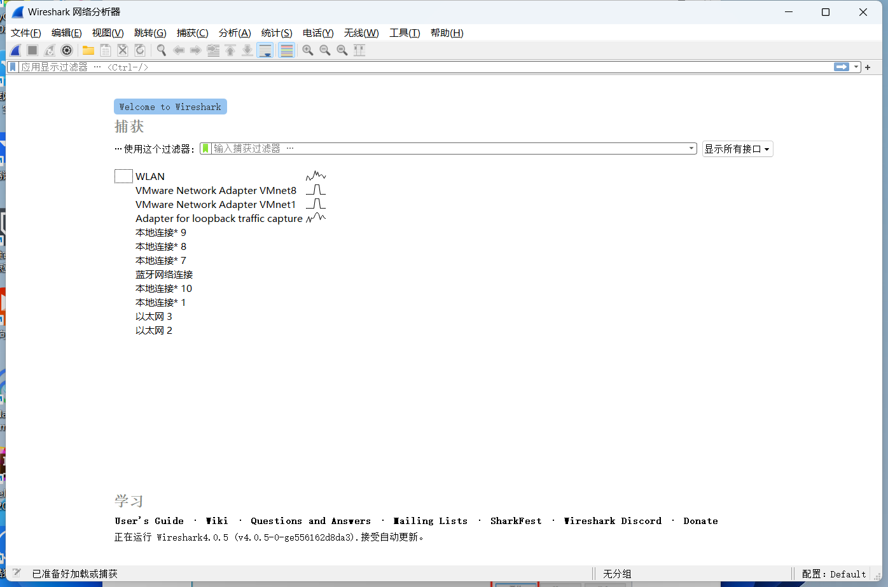

2、选择菜单栏上「捕获 -> 选项」，勾选 WLAN 网卡。这里需要根据各自电脑网卡使用情况选择，简单的办法可以看使用的 IP 对应的网卡。点击开始，启动抓包。

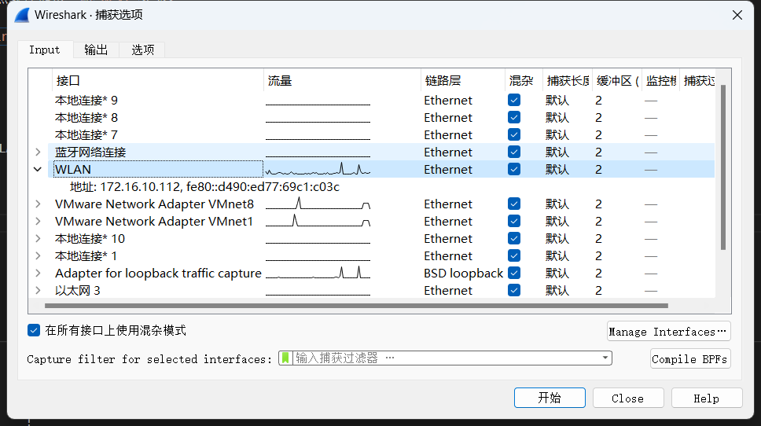

3、wireshark 启动后，wireshark 处于抓包状态中。

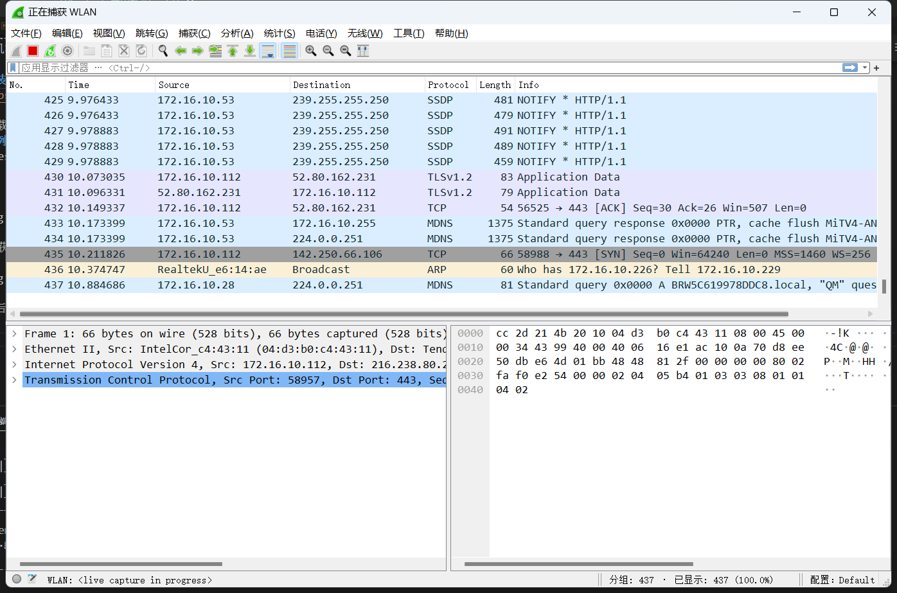

4、执行需要抓包的操作，如在 cmd 窗口下执行`ping www.baidu.com`。

5、操作完成后相关数据包就抓取到了，可以点击「停止捕获分组」按钮。

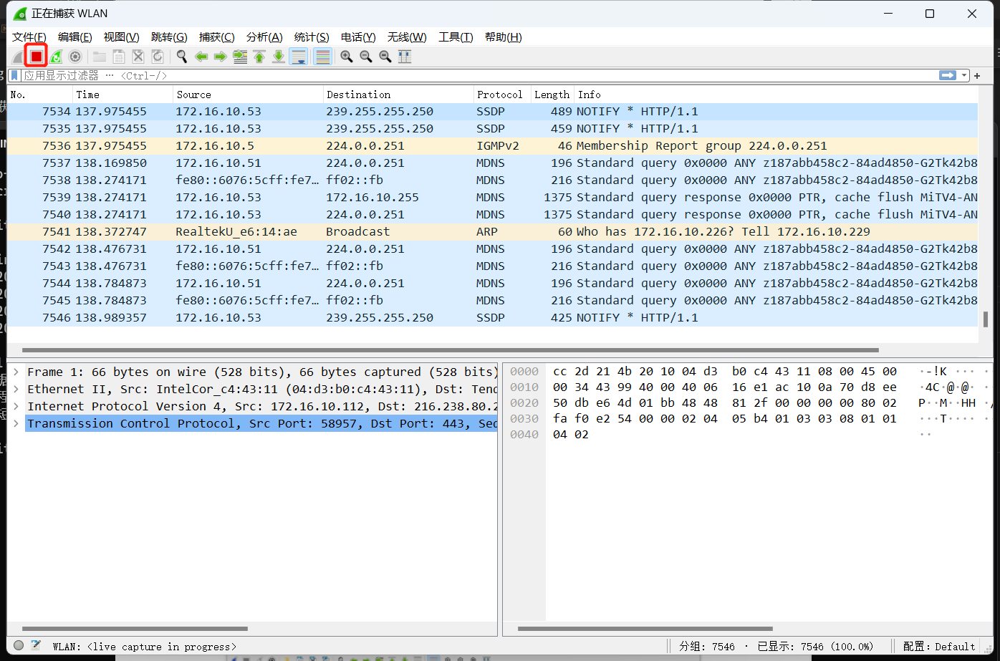

6、为避免其他无用的数据包影响分析，可以通过在过滤栏设置过滤条件进行数据包列表过滤，获取结果如下。说明：`ip.addr == 183.232.231.172 and icmp`表示只显示 ICPM 协议且主机 IP 为`183.232.231.172`的数据包。说明：协议名称`icmp`要小写。

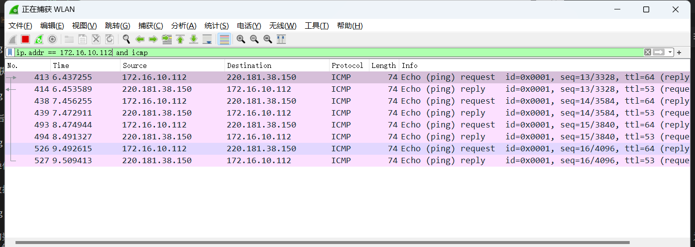

## Wireshakr抓包界面介绍
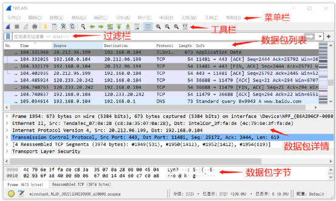

Wireshark 的主界面包含6个部分：
* 菜单栏：用于调试、配置
* 工具栏：常用功能的快捷方式
* 过滤栏：指定过滤条件，过滤数据包
* 数据包列表：核心区域，每一行就是一个数据包
* 数据包详情：数据包的详细数据
* 数据包字节：数据包对应的字节流，二进制

说明：数据包列表区中不同的协议使用了不同的颜色区分。协议颜色标识定位在菜单栏「视图 --> 着色规则」。

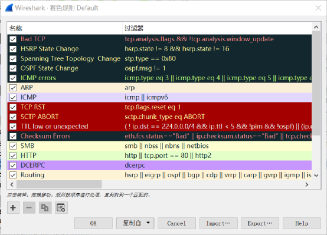

### WireShark 主要分为这几个界面
#### 1. Display Filter(显示过滤器)
用于设置过滤条件进行数据包列表过滤。菜单路径：分析 --> Display Filters。


#### 2. Packet List Pane(数据包列表)
显示捕获到的数据包，每个数据包包含编号，时间戳，源地址，目标地址，协议，长度，以及数据包信息。不同协议的数据包使用了不同的颜色区分显示。

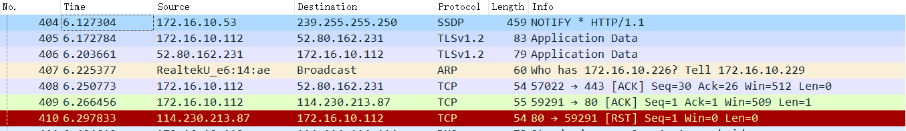

#### 3. Packet Details Pane(数据包详细信息)
在数据包列表中选择指定数据包，在数据包详细信息中会显示数据包的所有详细信息内容。数据包详细信息面板是最重要的，用来查看协议中的每一个字段。各行信息分别为
1. Frame:   物理层的数据帧概况
2. Ethernet II: 数据链路层以太网帧头部信息
3. Internet Protocol Version 4: 互联网层IP包头部信息
4. Transmission Control Protocol:  传输层T的数据段头部信息，此处是TCP
5. Hypertext Transfer Protocol:  应用层的信息，此处是HTTP协议

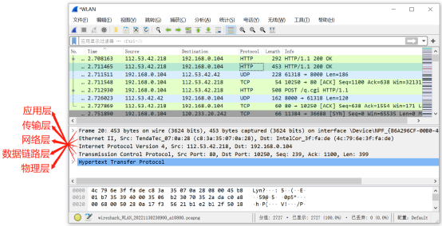

从下图可以看到 wireshark 捕获到的 TCP 包中的每个字段。

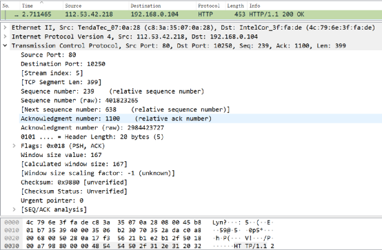
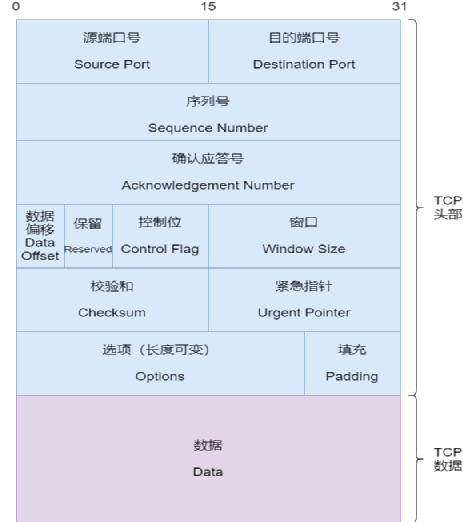

#### 4. Dissector Pane(数据包字节区)
报文原始内容。

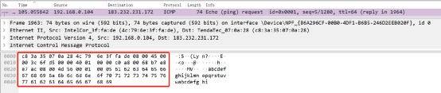

## Wireshark过滤器
wireshark 工具中自带了两种类型的过滤器，学会使用这两种过滤器会帮助我们在大量的数据中迅速找到我们需要的信息。
### 抓包过滤器
捕获过滤器的菜单栏路径为「捕获 --> 捕获过滤器」。用于在抓取数据包前设置。

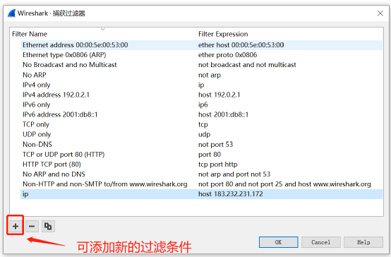

设置如下。

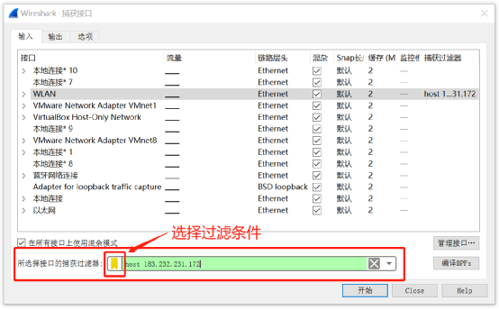

#### 常用的抓包过滤表达式
抓包过滤表达式的格式：【逻辑运算】+【协议】+【方向】+【类型】+【值】

* 逻辑运算：`and、or、not`
* 协议：`ether、ip、icmp、arp、tcp、udp、http、ftp`等
* 方向：`src、dst、src and dst、src or dst`
* 类型：`host、net、port、portrange`等


常用的抓包过滤表达式：

| 表达式                              | 说明 |
|----------------------------------|----|
| ether src host 74:25:8a:c4:f7:7a | 源MAC地址为74:25:8a:c4:f7:7a的数据包   |
| src host 10.88.14.119            | 源ip地址为10.88.14.119的数据包   |
| host 10.88.14.119                | ip地址为10.88.14.119的数据包   |
| not host 10.88.14.119            | 除了ip地址为10.88.14.119的其他数据包   |
| ip                               | ipv4的数据包   |
| tcp                              | tcp协议的数据包   |
| port 23                          | tcp端口为23或者udp端口为23的数据包   |
| src port 23                      | tcp源端口为23或者udp源端口为23的数据包 |
| tcp src port 23                  | 源端口为23的tcp数据包   |
| tcp dst port 23                  | 目标端口为23的tcp数据包   |
| tcp dst portrange 21-23               | 目标端口为21-23的tcp数据包   |
| tcp src port 2000 and tcp dst port 23 | 源端口为2000且目标端口为23的tcp数据包   |

4. 逻辑运算符
```
// 抓取主机地址为192.168.1.80、目的端口为80的数据包
src host 192.168.1.104 && dst port 80 
// 抓取主机为192.168.1.104或者192.168.1.102的数据包
host 192.168.1.104 || host 192.168.1.102 
// 不抓取广播数据包
!broadcast
```

### 显示过滤器语法
显示过滤器是用于在抓取数据包后设置过滤条件进行过滤数据包。

Wireshark 打开抓包文件后，在“显示过滤器”栏输入过滤表达式，便可得到经过显示过滤器后的数据包。

通常是在抓取数据包时设置条件相对宽泛或者没有设置导致抓取的数据包内容较多时使用显示过滤器设置条件过滤以方便分析。

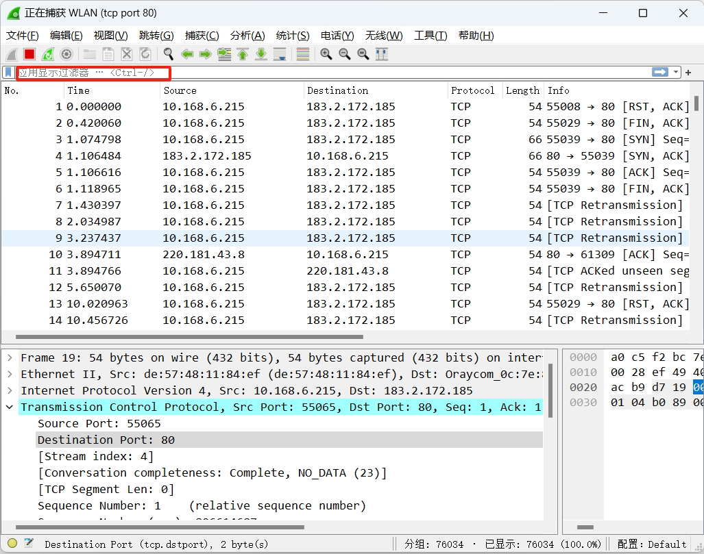

#### 常用的显示过滤表达式

| 表达式                                                          | 说明                                                    |
|--------------------------------------------------------------|-------------------------------------------------------|
| eth.addr == de:57:48:11:84:ef                                | 源或目MAC地址为de:57:48:11:84:ef的数据包                        |
| eth.src == de:57:48:11:84:ef                                 | 源MAC地址为de:57:48:11:84:ef的数据包                          |
| eth.dst == a0:c5:f2:bc:7e:84                                 | 目的MAC地址为0:c5:f2:bc:7e:84的数据包                          |
| eth.src == de:57:48:11:84:ef && eth.dst == a0:c5:f2:bc:7e:84 | 源MAC地址为de:57:48:11:84:ef，目的MAC地址为0:c5:f2:bc:7e:84的数据包 |
| arp.src.hw == de:57:48:11:84:ef                              | 源硬件地址为de:57:48:11:84:ef的arp数据包                        |
| arp.dst.hw == de:57:48:11:84:ef                              | 目标硬件地址为de:57:48:11:84:ef的arp数据包                       |
| icmp.type == 8                                               | imcp请求包                                               |
| icmp.type == 0                                               | imcp应答包                                               |
| 协议名称（小写）                                                     | 协议过滤                                                  |
| arp                                                          | arp数据包                                                |
| icmp                                                         | icmp数据包                                               |
| ip                                                           | ipv4报文                                                |
| tcp                                                          | tcp数据包                                                |
| ip.addr == 10.168.4.49                                       | 源或目ip地址为10.168.4.49的数据包                               |
| ip.src == 10.168.4.49                                        | 源ip地址为10.168.4.49的数据包                                 |
| ip.dst == 10.168.4.49                                        | 目标ip地址为10.168.4.49的数据包                                |
| ip.src == 10.168.6.25 \|\| ip.dst == 10.168.4.49             | 源ip地址为10.168.6.25或目标ip地址为10.168.4.49的数据包              |
| ip.ttl == 1                                                  | 显示ttl为1的数据包                                           |
| tcp.port == 23                                               | tcp源或目的端口为23的数据包                                      |
| tcp.srcport ==23                                             | tcp源端口为23的数据包                                         |
| tcp.dstport ==23                                             | tcp目标端口为23的数据包                                        |
| tcp.srcport == 2000 && tcp.dstport == 23                     | tcp源端口为2000且目标端口为23的数据包                               |
| http.request.method=="GET"                                   | 只显示 HTTP GET 方法的数据包 |

除了在“显示过滤器”栏输入过滤表达式，还可以按照数据包内容过滤。

右键需要过滤的数据包内容选择“作为过滤器应用”或“复制->作为过滤器”，会自动填入或生成显示过滤器表达式：

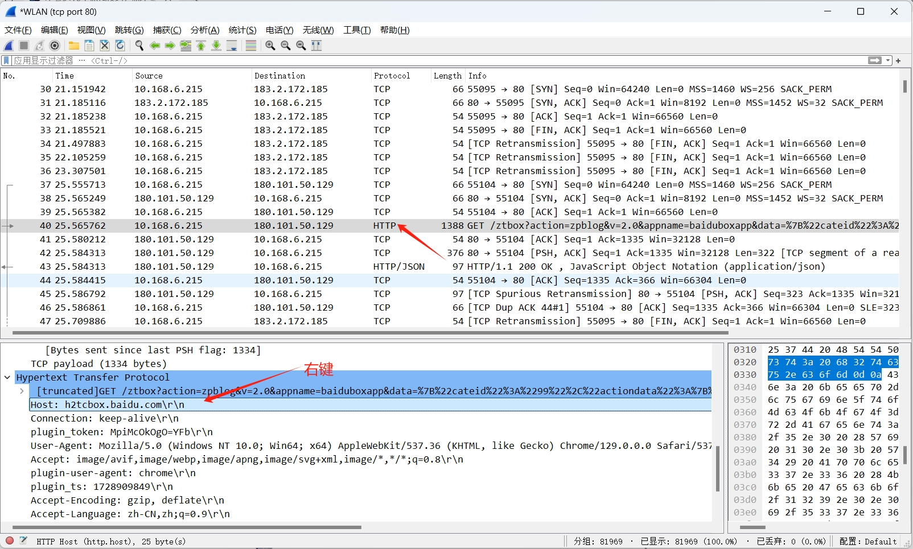

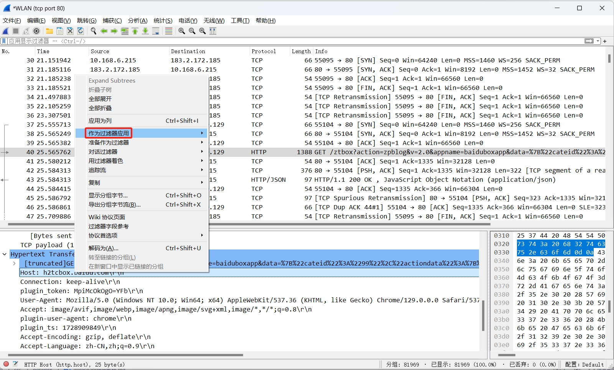

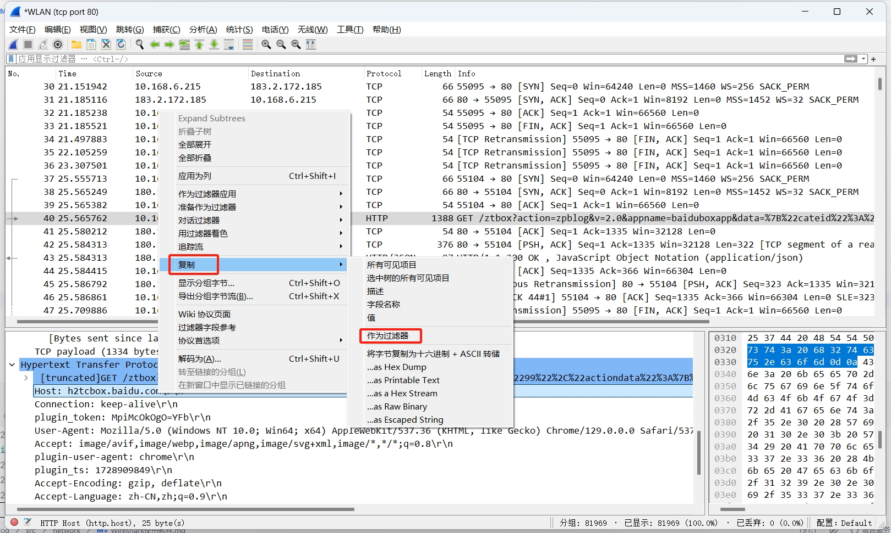
