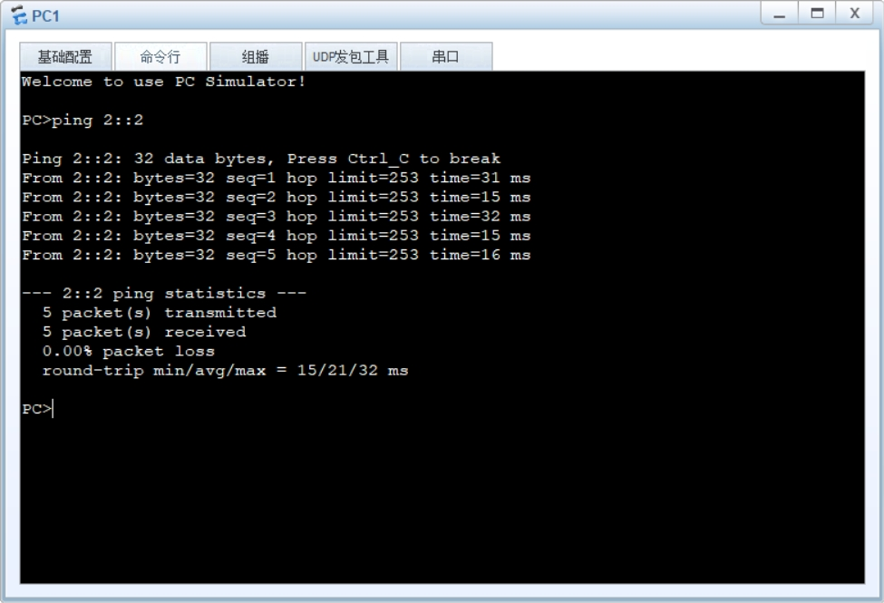
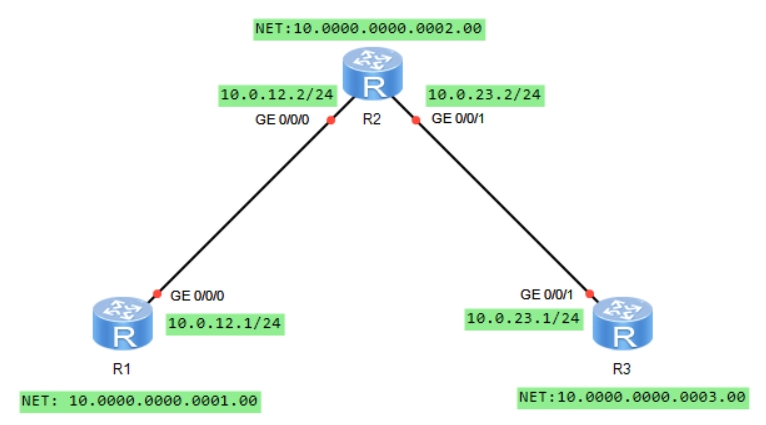

## 系统视图相关命令

| 命令              | 说明                               |
|-----------------|----------------------------------|
| system-view     | 进入系统视图，这是配置设备的基础模式，可以进一步进入其他配置模式 |
| quit 或 exit     | 退出当前视图，返回上一级视图或退出配置模式            |
| save            | 保存当前配置到设备，确保设备重启后配置不会丢失          |
| display version | 显示设备的软件版本、硬件信息和启动配置文件等详细信息       |
| display device  | 显示设备的基本信息，如设备型号、序列号等             |

## 网络安全配置

| 命令                                     | 说明                                        |
|----------------------------------------|-------------------------------------------|
| user-interface [interface-number]      | 进入用户接口（如控制台、VTY等）的配置视图                    |
| authentication-mode [mode]             | 设置用户接口的认证方式，如authentication-mode password |
| set authentication password [password] | 设置用户接口的认证密码                               |
| traffic-filter inbound                 | 进入入站流量过滤配置视图                              |
| traffic-filter outbound                | 进入出站流量过滤配置视图                              |
| firewall interzone [zone1] [zone2]     | 配置防火墙区域间策略，用于控制不同安全区域间的流量                 |
| ipsec proposal [proposal-name]         | 进入IPSec加密提案配置视图                           |
| ike proposal [proposal-name]           | 进入IKE（Internet密钥交换）提案配置视图                 |

## 帮助提示
### 完全帮助
当用户输入命令时，可以使用命令行的完全帮助获取全部关键字和参数的提示。

在任一命令视图下，键入`?`获取该命令视图下所有的命令及其简单描述。
```shell
<HUAWEI> ?
User view commands:
  backup         Backup electronic elabel
  cd             Change current directory
  check          Check information
  clear          Clear information
  clock          Specify the system clock
  compare        Compare function
...
```
键入一条命令的部分关键字，后接以空格分隔的`?`，如果该位置为关键字，则列出全部关键字及其简单描述。
```shell
<HUAWEI> system-view
[HUAWEI] ftp timeout ?
  INTEGER<1-35791>  The value of FTP timeout, the default value is 30 minutes
[HUAWEI] ftp timeout 35 ?
  <cr>

[HUAWEI] ftp timeout 35
```
其中，`INTEGER<1-35791>`是参数取值的说明，`The value of FTP timeout, the default value is 30 minutes`是对参数作用的简单描述。
### 部分帮助
当用户输入命令时，如果只记得此命令关键字的开头一个或几个字符，可以使用命令行的部分帮助获取以该字符串开头的所有关键字的提示。

键入一字符串，其后紧接`?`，列出以该字符串开头的所有关键字。
```shell
<HUAWEI> d?
  debugging                               delete
  dir                                     display
<HUAWEI> d
```
键入一条命令，后接一字符串紧接`?`，列出命令以该字符串开头的所有关键字。
```shell
<HUAWEI> display b?
  bpdu                                    bridge
  buffer
```
输入命令的某个关键字的前几个字母，按下`tab`键，可以显示出完整的关键字，前提是这几个字母可以唯一标示出该关键字，否则，连续按下`tab`键，可出现不同的关键字，用户可以从中选择所需要的关键字。

## 端口镜像


在某些场景中，我们可能需要监控交换机特定端口的入站或出站报文，或者需要针对特定的流量进行分析，例如上图中，我们期望抓取 PC1 收发的报文并进行分析，那么便可以在交换机的`GE0/0/3`口接一个监控 PC，在监控 PC 上安装协议分析软件，然后在交换机上部署端口镜像，将`GE0/0/2`的入、出站流量镜像到`GE0/0/3`口上来，接下来我只要在监控 PC 上通过协议分析软件查看报文即可。

如果没有端口镜像技术，除非数据包的目的地是监控PC（所连接的端口），否则报文是不会发向该端口的。因此事实上端口镜像就是将某个特定端口的流量拷贝到某个监控端口，就这么简单。

端口镜像常用于：流量观测及统计；故障定位等。

### 镜像的分类
* 基于端口的镜像：端口镜像就是将被监控端口上的数据复制到指定的监控端口，对数据进行分析和监视。
* 基于流的镜像：流镜像就是将匹配访问控制列表的业务流复制到指定的监控端口，用于报文的分析和监视。

### 基于端口的镜像


端口镜像是指交换机复制一份从镜像端口流经的报文（可以指定入站或出站），并将此报文传送到指定的观察端口进行分析和监视。在端口镜像中，镜像端口流经的所有报文都将被复制到观察端口。

以太网交换机支持多对一的镜像，即将多个端口的报文复制到一个监控端口上。注意区分这里的观察端口和镜像端口。

端口镜像分为本地端口镜像和远程端口镜像：
1. 本地端口镜像：本地端口镜像中，监控 PC 与观察端口直接相连。
2. 远程端口镜像：远程端口镜像中，监控 PC 与观察端口所在设备之间通过二层网络或三层网络相联。
   二层端口镜像（`RSPAN：Remote Switched Port Analyzer`）：若通过二层网络互联，以 S9300 交换机为例，它将镜像端口的报文封装 VLAN，然后通过观察端口将报文在远程镜像 VLAN 中进行广播。远程的设备收到报文后，比较报文的 VLAN ID，如果相同，则将该报文转发到远程观察端口。
   三层端口镜像（`ERSPAN：Encapsulated Remote SPAN`）：若通过三层网络互联，以 S9300 交换机为例，它使用 GRE 报文头封装和解封装镜像报文，使得镜像报文可以穿透三层网络，从而实现 镜像端口所在设备与观察端口所在设备之间通过三层网络相连时的端口镜像。

### 基于流的镜像


流镜像就是将流镜像端口上的特定数据复制到指定的观察端口或 CPU 进行分析和监视。流镜像端口是指应用了包含流镜像行为的流策略的接口，从流镜像端口流过的报文，如果匹配此接口上流策略中的流
分类，则将被复制并传送到观察端口或 CPU。

流镜像分为两种，即流镜像到接口和流镜像到 CPU：
1. 流镜像到接口，是把通过配置了流镜像的接口上的符合要求的报文复制一份，然后发送到观察端口以供分析诊断。
2. 流镜像到 CPU，是把通过配置了流镜像的接口上的符合要求的报文复制一份，然后发送到 CPU 以供分析诊断。这里的 CPU 指的是配置了流镜像的接口所在接口板上的 CPU。

#### 配置本地端口镜像


将交换机`GE0/0/2`端口的进、出口报文镜像到`GE0/0/3`。交换机配置如下：
```shell
[SW]observe-port 1 interface gigabitethernet0/0/3
[SW]interfae gigabitethernet0/0/2
[SW-gigabitethernet0/0/2] port-mirroring to observe-port 1 both
```
## 端口隔离


上图中，PC1、2、3 同属一个 VLAN（假设是 VLAN10），使用相同的 IP 子网。默认情况下三台 PC 可互相访问，这是典型的二层互访。现在有这么一个需求，在不修改 IP 子网及 VLAN 规划的情况下，使得 PC1-PC2 之间无法互访，而 PC1 与 PC3 可互访、PC2 与 PC3 可互访。这就可以用到端口隔离特性。

这里需要用到端口隔离组的概念，交换机的端口可以加入到特定的隔离组中，同一端口隔离组的端口之间互相隔离，不同端口隔离组的端口之间不隔离。因此要实现上述需求，配置的思路非常简单，在交换
机上将端口 1、2 放置在同一隔离组中，端口 3 不做隔离组配置或者放入另一个隔离组中，然后开启端口隔离特性即可。
### 实验验证

在上图中，PC1、PC2、PC3 同属 VLAN10、同属`1.1.1.0/24`子网，IP 地址如上图所示。配置端口隔离，使得 PC1 与 PC2 无法互访；PC1 与 PC3，PC2 与 PC3 可互访。
```shell
[sw]vlan 10
[sw-vlan10]quit
[sw]port-isolate ?
  mode  Mode
[sw]port-isolate mode ?
  all  All
  l2   L2 only
# 设置端口隔离模式为二层隔离三层互通
[sw]port-isolate mode l2
[sw]interface GigabitEthernet 0/0/1
[sw-GigabitEthernet0/0/1]port link-type access 
[sw-GigabitEthernet0/0/1]port default vlan 10
[sw-GigabitEthernet0/0/1]port-isolate ?
  enable  Port isolate enable

[sw-GigabitEthernet0/0/1]port-isolate enable ?
  group  Port isolate group
  <cr>   
# 端口加入隔离组1
[sw-GigabitEthernet0/0/1]port-isolate enable group 1
[sw-GigabitEthernet0/0/1]quit
[sw]interface GigabitEthernet 0/0/2
[sw-GigabitEthernet0/0/2]port link-type access 
[sw-GigabitEthernet0/0/2]port default vlan 10
# 端口加入隔离组1
[sw-GigabitEthernet0/0/2]port-isolate enable group 1
[sw-GigabitEthernet0/0/2]quit
[sw]interface GigabitEthernet 0/0/3
[sw-GigabitEthernet0/0/3]port link-type access 
[sw-GigabitEthernet0/0/3]port default vlan 10
[sw-GigabitEthernet0/0/3]display port-isolate group all
  The ports in isolate group 1:
GigabitEthernet0/0/1     GigabitEthernet0/0/2 
```
所谓的三层不隔离指的是同一个隔离组的节点之间仍然能够通过三层进行互访，例如：

PC1 的 IP 为`1.1.1.1`，网关为`vlanif10`的 IP `1.1.1.254`，PC2 的 IP 为`2.2.2.2`，网关为`vlanif10`的IP `2.2.2.254`，`Vlanif10`配置了两个 IP 地址，也就是同一个 VLAN 我们用了两个 IP 子网。那么端口 1 与端口 2 现在虽然是 二层隔离，ARP 啥的无法透过来，但是 PC1 与 PC2 仍然能够借助自己的网关实现三层互访，这就是所谓 的二层隔离但是三层不隔离。那么如果要彻底将端口 1 及端口 2 隔离呢？使用系统视图命令`port-isolate mode all`即可。
## 链路聚合
在一个网络中，某些关键链路承载的流量可能非常大，链路的负载可能会很高，带宽就会成为数据传输的瓶颈。如果增加带宽，那就需要增加硬件投入，例如将链路从千兆电口换成万兆光纤接口，这就不得不增加成本。另一个问题是单点故障的问题，一旦这根链路发生故障，那么不可避免的将影响到网络的可达性。

以太网链路聚合技术（`Link Aggregation`），或者称为端口捆绑、链路捆绑技术，是一种通用的以太网技术。通过该技术，我们能够将多条以太网链路进行“捆绑”，捆绑之后的这些物理链路就形成了逻辑上的一条新的链路（`Eth-Trunk`），这条聚合链路不仅仅在带宽上成倍的增加，还同时提供了负载均衡及链路冗余。

有人可能会问，为啥要那么麻烦，交换机之间多连几根线不就完了么？多连几根线实际上就多创造了几个环路，这时由于生成树的作用，必然会阻塞掉几个端口，如此一来仍然只有一条链路在转发数据，还是达不到我们的预期。但是使用链路聚合功能，则可将这几根链路捆绑成逻辑上的一条，交换机会将捆绑后的这根聚合链路当做一条链路来对待，自然也就不存在环路的问题了。


上图中，两台交换机的`GE0/0/1`到`GE0/0/2`接口两两对接，如果在 SW1 及 SW2 上分别将自己的`GE0/0/1`到`GE0/0/2`接口进行捆绑，则会产生出一个聚合接口，也就是`Eth-trunk`接口。链路聚合技术能够部署在交换机之间、防火墙之间、交换机与防火墙之间、交换机与特定的服务器之间等等，是一种应用非常广泛的技术。华为交换机上的`Eth-trunk`支持两种工作方式：手工负载分担（`Manual load-balance`）及LACP（`link Aggregation Control Protocol`）。
### 手工负载分担
手工负载分担方式允许在聚合组中手工加入多个成员接口，并且所有的接口均处于转发状态，分担负载的流量。在这种模式下，`Eth-Trunk`的创建、成员接口的加入都需要手工配置完成，没有 LACP 协议报文的参与。手工负载分担模式通常用在对端设备不支持 LACP 协议的情况下。
#### 基础配置命令
```shell
# 创建一个聚合接口Eth-Trunk：
[SW] interface Eth-Trunk 1
# 聚合链路两端的设备需使用相同的工作方式。
[SW-Eth-Trunk1] mode manual load-balance
# 添加物理成员接口GE0/0/1、GE0/0/2及GE0/0/3添加到Eth-Trunk1中
[SW] interface GigabitEthernet0/0/1
[SW-GigabitEthernet0/0/1] eth-trunk 1
[SW] interface GigabitEthernet0/0/2
[SW-GigabitEthernet0/0/2] eth-trunk 1
[SW] interface GigabitEthernet0/0/3
[SW-GigabitEthernet0/0/3] eth-trunk 1

# （可选）配置Eth-trunk成员链路的负载分担模式：
[SW-Eth-Trunk1]load-balance ?
  dst-ip       According to destination IP hash arithmetic
  dst-mac      According to destination MAC hash arithmetic
  src-dst-ip   According to source/destination IP hash arithmetic
  src-dst-mac  According to source/destination MAC hash arithmetic
  src-ip       According to source IP hash arithmetic
  src-mac      According to source MAC hash arithmetic
# （可选）为保证Eth-Trunk接口的状态和带宽，可以设置活动接口数的阈值（缺省为1），以减小成员链路的状态变化带来的影响。
# 设置活动接口数下限阈值是为了保证最小带宽，当前活动链路数目小于下限阈值时，Eth-Trunk接口的状态转为Down：
[SW-Eth-Trunk1]least active-linknumber ?
  INTEGER<1-8>  The data of least active-linknumber
```
### LACP
LACP 方式是一种利用 LACP 协议进行聚合参数协商、确定活动接口和非活动接口的链路聚合方式。该模式下，需手工创建`Eth-Trunk`，手工加入`Eth-Trunk`成员接口，但是，由 LACP 协议协商确定活动接口和非活动接口。

LACP 模式也称为 M∶N 模式。这种方式同时可以实现链路负载分担和链路冗余备份的双重功能。在链路聚合组中 M 条链路处于活动状态，这些链路负责转发数据并进行负载分担，另外 N 条链路处于非活动状态作为备份链路，不转发数据。当 M 条链路中有链路出现故障时，系统会从 N 条备份链路中选择优先级最高的接替出现故障的链路，同时这条替换故障链路的备份链路状态变为活动状态开始转发数据。

LACP 模式与手工负载分担模式的主要区别为：LACP 模式有备份链路，而手工负载分担模式所有成员接口均处于转发状态，分担负载流量。此外，LACP 模式下，交换机之间会交互 LACP 报文。

LACP 模式中有一个主动、被动端的概念。设备 LACP 优先级较高（值越小越优）的一端为主动端，设备 LACP 优先级较低的一端为被动端。如果两端设备的 LACP 优先级一样时，则 MAC 地址小的胜出。


在上图所示的场景中，SwitchA 及 SwitchB 之间部署了`Eth-Trunk`，该`Eth-Trunk`中包含三条直连链路，并且采用的是 LACP 方式。两者会交互 LACP 报文使得聚合链路能够协商建立。A 和 B 会比较两者的设备 LACP 优先级，值最小的胜出成为主动端，这里假设 A 胜出。从图中我们看到 A 选择了上面两条链路作为活动链路，而 B 选择了下面两条链路，由于 A 是主动端，因此最终 AB 之间建立起来的聚合链路中的活动链路由 A 来确定，也就是上面两条链路成为活动链路。
#### 基础配置命令
```shell
# 创建Eth-Trunk，并将工作方式修改为LACP：
[Huawei] interface eth-trunk 1
# 缺省情况下，Eth-Trunk的工作模式为手工负载分担方式。
[Huawei] mode lacp-static
# 添加成员接口到Eth-Trunk中（根据实际情况添加）：
[Huawei] interface GigabitEthernet0/0/1
[Huawei-GigabitEthernet0/0/1] eth-trunk 1
[Huawei] interface GigabitEthernet0/0/2
[Huawei-GigabitEthernet0/0/2] eth-trunk 1
[Huawei] interface GigabitEthernet0/0/3
[Huawei-GigabitEthernet0/0/3] eth-trunk 1
#（可选）配置Eth-trunk成员链路的负载分担模式：
[Huawei-Eth-Trunk1] load-balance ?

#（可选）配置设备LACP优先级：
[Huawei] lacp priority ?
#系统LACP优先级值越小优先级越高，缺省情况下，系统LACP优先级为32768。
#在两端设备中选择系统LACP优先级较小一端作为主动端，如果系统LACP优先级相同则选择MAC地址较小的一端作为主动端。

#（可选）配置接口LACP优先级：
[Huawei-GigabitEthernet0/0/1] lacp priority ?
#缺省情况下，接口的LACP优先级是32768。取值越小，表明接口的LACP优先级越高。优先级越高的接口越有可能成为活动的成员接口。

#（可选）配置活动接口数上限阈值：
[Huawei-Eth-Trunk1] max active-linknumber ？
# 配置链路聚合活动接口数上限阈值，缺省情况下，活动接口数上限阈值为8。
# 配置LACP模式活动接口数目上限阈值可以控制Eth-Trunk中活动接口的最大数M，剩余的成员接口处于备份状态。

#（可选）配置活动接口数下限阈值：
[Huawei-Eth-Trunk1] least active-linknumber ？
# 配置链路聚合活动接口数下限阈值，缺省情况下，活动接口数下限阈值为1。
# 配置LACP模式活动接口数目下限阈值可以决定Eth-Trunk中活动接口数的最小值，如果静态模式下活动接口数目小于该值，
# Eth-Trunk的接口状态将变为DOWN的状态。

#（可选）使能LACP抢占并配置抢占等待时间：
[Huawei-Eth-Trunk1] lacp preempt enable
[Huawei-Eth-Trunk1] lacp preempt delay ？
# 缺省情况下，LACP抢占功能处于禁止状态。缺省情况下，LACP抢占等待时间为30秒。
# 使能LACP抢占功能可以保持接口LACP优先级最高的接口为活动接口。例如：当一条高优先级的接口因故障切换为非活动状
# 态而后又恢复时，如果使能了抢占，则高优先级接口将重新成为活动接口；如果未使能抢占，该接口不能重新成为活动接口。
```
### 基础实验
#### 手工负载分担模式

SW1 及 SW2 通过`GE0/0/23`及 24 口互联，配置`Eth-trunk`将这两条链路进行捆绑。捆绑后的链路配置为`Trunk`模式，使得两台交换机下相同 VLAN 内的用户能够互访，也就是 PC1 与 PC3 能够互访；PC2 与 PC4 也能够互访。
```shell
[SW1] vlan batch 10 20
[SW1] interface GigabitEthernet 0/0/1
[SW1-GigabitEthernet0/0/1] port link-type access
[SW1-GigabitEthernet0/0/1] port default vlan 10
[SW1] interface GigabitEthernet 0/0/2
[SW1-GigabitEthernet0/0/2] port link-type access
[SW1-GigabitEthernet0/0/2] port default vlan 20
#创建聚合接口eth-trunk1，将eth-trunk设置为手工负载均衡方式，在该模式中被聚合的链路都将会转发数据：
[SW1] interface Eth-Trunk 1
[SW1-Eth-Trunk1] mode manual load-balance
#将接口GE0/0/23及GE0/0/24添加到Eth-trunk1中：
[SW1] interface GigabitEthernet 0/0/23
[SW1-GigabitEthernet0/0/23] eth-trunk 1
[SW1] interface GigabitEthernet 0/0/24
[SW1-GigabitEthernet0/0/24] eth-trunk 1
#由于eth-trunk1聚合接口需要承载多个VLAN的二层流量，因此需配置为trunk类型。
# 注意一旦聚合接口配置完成后，我们的针对该逻辑接口的相关配置就在interface eth-trunk中进行，
# 也就是在产生的聚合接口中完成，而不是在GE0/0/23或GE0/0/24口的接口中进行：
[SW1] interface Eth-Trunk 1
[SW1-Eth-Trunk1] port link-type trunk
[SW1-Eth-Trunk1] port trunk allow-pass vlan 10 20
```
```shell
[SW2] vlan batch 10 20
[SW2] interface GigabitEthernet 0/0/1
[SW2-GigabitEthernet0/0/1] port link-type access
[SW2-GigabitEthernet0/0/1] port default vlan 10
[SW2] interface GigabitEthernet 0/0/2
[SW2-GigabitEthernet0/0/2] port link-type access
[SW2-GigabitEthernet0/0/2] port default vlan 20
[SW2-GigabitEthernet0/0/2] quit
[SW2] interface Eth-Trunk 1
[SW2-Eth-Trunk1] mode manual load-balance
[SW2-Eth-Trunk1] quit
[SW2] interface GigabitEthernet 0/0/23
[SW2-GigabitEthernet0/0/23] eth-trunk 1
[SW2] interface GigabitEthernet 0/0/24
[SW2-GigabitEthernet0/0/24] eth-trunk 1
[SW2-GigabitEthernet0/0/24] quit
[SW2] interface Eth-Trunk 1
[SW2-Eth-Trunk1] port link-type trunk
[SW2-Eth-Trunk1] port trunk allow-pass vlan 10 20
```
```shell
[SW1]display eth-trunk 1
Eth-Trunk1's state information is:
WorkingMode: NORMAL         Hash arithmetic: According to SIP-XOR-DIP         
Least Active-linknumber: 1  Max Bandwidth-affected-linknumber: 8              
Operate status: up          Number Of Up Port In Trunk: 2                     
--------------------------------------------------------------------------------
PortName                      Status      Weight 
GigabitEthernet0/0/23         Up          1      
GigabitEthernet0/0/24         Up          1      
```
#### LACP方式


SW1 及 SW2 的`GE0/0/22`到`GE0/0/24`口分别互联，将这三条链路捆绑为`Eth-Trunk`，使用 LACP 方式，SW1 为主动端，在该聚合链路中，两条链路为活动链路，其余一条做备份。
```shell
[SW1] vlan batch 10 20
[SW1] interface gigabitEthernet 0/0/1
[SW1-GigabitEthernet0/0/1] port link-type access
[SW1-GigabitEthernet0/0/1] port default vlan 10
[SW1] interface gigabitEthernet 0/0/2
[SW1-GigabitEthernet0/0/2] port link-type access
[SW1-GigabitEthernet0/0/2] port default vlan 20
#创建聚合链路eth-trunk1，将eth-trunk设置为LACP模式，将最大活跃链路数量设置为2：
[SW1] interface Eth-Trunk 1
[SW1-Eth-Trunk1] mode lacp-static
[SW1-Eth-Trunk1] max active-linknumber 2
#将接口GE0/0/22、GE0/0/23及GE0/0/24添加到Eth-trunk1中：
[SW1] interface gigabitEthernet 0/0/22
[SW1-GigabitEthernet0/0/22] eth-trunk 1
[SW1] interface gigabitEthernet 0/0/23
[SW1-GigabitEthernet0/0/23] eth-trunk 1
[SW1] interface gigabitEthernet 0/0/24
[SW1-GigabitEthernet0/0/24] eth-trunk 1
#将SW1的设备LACP优先级设置为1，使得其成为主动端：
[SW1] lacp priority 1
#将聚合接口Eth-trunk1配置为trunk类型，并且放通VLAN10及VLAN20：
[SW1] interface Eth-Trunk 1
[SW1-Eth-Trunk1] port link-type trunk
[SW1-Eth-Trunk1] port trunk allow-pass vlan 10 20
```
```shell
[SW2] vlan batch 10 20
[SW2] interface gigabitEthernet 0/0/1
[SW2-GigabitEthernet0/0/1] port link-type access
[SW2-GigabitEthernet0/0/1] port default vlan 10
[SW2] interface gigabitEthernet 0/0/2
[SW2-GigabitEthernet0/0/2] port link-type access
[SW2-GigabitEthernet0/0/2] port default vlan 20
[SW2-GigabitEthernet0/0/2] quit
[SW2] interface Eth-Trunk 1
[SW2-Eth-Trunk1] mode manual lacp-static
[SW2-Eth-Trunk1] quit
[SW2] interface gigabitEthernet 0/0/22
[SW2-GigabitEthernet0/0/22] eth-trunk 1
[SW2] interface gigabitEthernet 0/0/23
[SW2-GigabitEthernet0/0/23] eth-trunk 1
[SW2] interface gigabitEthernet 0/0/24
[SW2-GigabitEthernet0/0/24] eth-trunk 1
[SW2-GigabitEthernet0/0/24] quit
[SW2] interface Eth-Trunk 1
[SW2-Eth-Trunk1] port link-type trunk
[SW2-Eth-Trunk1] port trunk allow-pass vlan 10 20
```
```shell
[SW1]display eth-trunk 1
Eth-Trunk1's state information is:
Local:
LAG ID: 1                   WorkingMode: STATIC                               
Preempt Delay: Disabled     Hash arithmetic: According to SIP-XOR-DIP         
System Priority: 1          System ID: 4c1f-cc45-5ec0                         
Least Active-linknumber: 1  Max Active-linknumber: 2                          
Operate status: up          Number Of Up Port In Trunk: 2                     
--------------------------------------------------------------------------------
ActorPortName          Status   PortType PortPri PortNo PortKey PortState Weight
GigabitEthernet0/0/22  Selected 1GE      32768   23     305     10111100  1     
GigabitEthernet0/0/23  Selected 1GE      32768   24     305     10111100  1     
GigabitEthernet0/0/24  Unselect 1GE      32768   25     305     10100000  1     

Partner:
--------------------------------------------------------------------------------
ActorPortName          SysPri   SystemID        PortPri PortNo PortKey PortState
GigabitEthernet0/0/22  32768    4c1f-cc2d-77d4  32768   23     305     10111100
GigabitEthernet0/0/23  32768    4c1f-cc2d-77d4  32768   24     305     10111100
GigabitEthernet0/0/24  32768    4c1f-cc2d-77d4  32768   25     305     10100000
    
```
在上述输出中，我们可以看到 SW1 的`eth-trunk1`聚合接口的状态。`Operate status`显示整个聚合接口的状态为 UP。而由于我们设置了`max active-linknumber 2`，因此三个成员接口中，仅有两个接口（两条链路）是活跃的，它们会转发数据，而剩下的接口则作为备份。我们看到`GE0/0/22`及`GE0/0/23`是`Select`状态，因此它们是活跃接口，而`GE0/0/24`是`Unselect`状态，则它们是非活跃的备份接口。因为 SW1 是主动端设备，因此由它决定哪些接口是活跃，哪些是非活跃的。
## 路由策略
### route-policy
```shell
[Huawei]route-policy name {permit|deny} node node-name
```
默认情况下，所有未匹配的路由将拒绝通过`route-policy`。如果`route-policy`中定义了一个以上的节点，则各节点中至少应该有一个节点的匹配模式为`permit`。

[](华为命令/route-policy.png)

R1的配置：
```shell
# 定义一个 acl2000，用于匹配需要放行的路由
[R1]acl 2000
[R1-acl-basic-2000]rule permit source 172.16.1.0 0.0.0.0
[R1-acl-basic-2000]quit
# 创建-个route-policy,名字叫RP,同时配置第一个节点,节点编号为10
[R1]route-policy RP permit node 10
Info: New Sequence of this List.
[R1-route-policy]if-match ?
  acl                  Specify an ACL
  as-path-filter       BGP AS path list
  community-filter     Match BGP community filter
  cost                 Match metric of route
  extcommunity-filter  Match BGP/VPN extended community filter
  interface            Specify the interface matching the first hop of routes
  ip                   IP information
  ip-prefix            Specify an address prefix-list
  ipv6                 IPv6 Information
  mpls-label           Give the Label
  rd-filter            Route-distinguisher filter
  route-type           Match route-type of route
  tag                  Match tag of route
# 在节点10中，定义了一个if-match子句，调用acl2000
[R1-route-policy]if-match acl 2000
[R1-route-policy]apply ?
  as-path           BGP AS path list
  backup-interface  Backup outgoing interface
  backup-nexthop    Backup nexthop address
  behavior          Specify QoS policy as behavior
  comm-filter       Set BGP community filter (for deletion)
  community         BGP community attribute
  cost              Set metric of route
  cost-type         Type of metric for destination routing protocol
  dampening         Set BGP route flap dampening parameters
  extcommunity      Set BGP/VPN extended community filter
  ip-address        IP information
  ip-precedence     Specify QoS policy as IP precedence
  ipv6              IPv6 Information
  isis              Where to import route
  local-preference  BGP local preference path attribute
  mpls-label        Give the Label
  origin            BGP origin code
  ospf              Where to import route
  preference        Give the Preference  (Route Preference)
  preferred-value   BGP Preferred-value (weight) for routing table
  qos-local-id      Specify QoS policy as qos local id
  tag               Set tag of route
  traffic-index     Specify BGP Traffic Accounting Index

# 在节点10中，定义了一个apply子句，设置cost值为20
[R1-route-policy]apply cost 20
[R1-route-policy]quit
[R1]ospf 1
# 在ospf中注入直连路由的时候调用这个route-policy
[R1-ospf-1]import-route direct route-policy RP

```

## VRRP

[](华为命令/vrrp-default.png)
```shell
[R1]interface GigabitEthernet0/0/0
[R1-GigabitEthernet0/0/0]ip address 192.168.1.253 24
[R1-GigabitEthernet0/0/0]vrrp vrid 1 ?
  authentication-mode  Specify password and authentication mode
  preempt-mode         Specify preempt mode
  priority             Specify priority
  timer                Specify timer
  track                Specify the track configuration
  version-3            Specify the device to support V3 for VRRP
  virtual-ip           Specify virtual IP address
# 激活接口VRRP，加入VRRP组（VRID为1），虚拟IP为192.168.1.254
[R1-GigabitEthernet0/0/0]vrrp vrid 1 virtual-ip 192.168.1.254
# 该接口在该VRRP组中的优先级为120（优先级值默认为100）
[R1-GigabitEthernet0/0/0]vrrp vrid 1 priority 120
[R1-GigabitEthernet0/0/0]vrrp vrid 1 preempt-mode timer ?
  delay  Specify interval of delay
# 配置虚拟路由器的抢占时间为20s
# 抢占时间是指当主设备因为故障修复重新切换为主状态时等待的时间
[R1-GigabitEthernet0/0/0]vrrp vrid 1 preempt-mode timer delay 20
```
```shell
[R2]interface GigabitEthernet 0/0/0
[R2-GigabitEthernet0/0/0]ip address 192.168.1.252 24
[R2-GigabitEthernet0/0/0]vrrp vrid 1 virtual-ip 192.168.1.254
```
查看结果：
```shell
[R1-GigabitEthernet0/0/0]display vrrp ?
  INTEGER<1-255>        Virtual router identifier
  brief                 Summary information
  interface             Specify the interface
  protocol-information  Protocol information of VRRP
  state-change          State change track
  statistics            Statistics about VRRP packets
  |                     Matching output
  <cr>                  Please press ENTER to execute command 
[R1-GigabitEthernet0/0/0]display vrrp
  GigabitEthernet0/0/0 | Virtual Router 1
    State : Master
    Virtual IP : 192.168.1.254
    Master IP : 192.168.1.253
    PriorityRun : 120
    PriorityConfig : 120
    MasterPriority : 120
    Preempt : YES   Delay Time : 20 s
    TimerRun : 1 s
    TimerConfig : 1 s
    Auth type : NONE
    Virtual MAC : 0000-5e00-0101
    Check TTL : YES
    Config type : normal-vrrp
    Backup-forward : disabled
    Create time : 2025-04-17 14:06:16 UTC-08:00
    Last change time : 2025-04-17 14:06:20 UTC-08:00
    
[R1-GigabitEthernet0/0/0]display vrrp brief
Total:1     Master:1     Backup:0     Non-active:0      
VRID  State        Interface                Type     Virtual IP     
----------------------------------------------------------------
1     Master       GE0/0/0                  Normal   192.168.1.254 
```
```shell
[R2-GigabitEthernet0/0/0]display vrrp
  GigabitEthernet0/0/0 | Virtual Router 1
    State : Backup
    Virtual IP : 192.168.1.254
    Master IP : 192.168.1.253
    PriorityRun : 100
    PriorityConfig : 100
    MasterPriority : 120
    Preempt : YES   Delay Time : 0 s
    TimerRun : 1 s
    TimerConfig : 1 s
    Auth type : NONE
    Virtual MAC : 0000-5e00-0101
    Check TTL : YES
    Config type : normal-vrrp
    Backup-forward : disabled
    Create time : 2025-04-17 14:13:58 UTC-08:00
    Last change time : 2025-04-17 14:13:58 UTC-08:00

[R2-GigabitEthernet0/0/0]display vrrp brief 
Total:1     Master:0     Backup:1     Non-active:0      
VRID  State        Interface                Type     Virtual IP     
----------------------------------------------------------------
1     Backup       GE0/0/0                  Normal   192.168.1.254
```
### track接口状态

[](华为命令/vrrp-track.png)

Backup 路由器会不断侦听 Master 发出来的 VRRP 报文以便判断它的存活状态，当 Master 路由器发生故障时，Backup 路由器能够感知并且进行切换。但是如果 Master 路由器没有发生整机故障，而只是其上行接口故障了呢?例如上图中，R1 作为 Master 路由器，如果其 GE0/0/1口 DOWN 掉了，那么用户的上行流量被引导到 R1 后，将会被丢弃。

VRRP 有一个特性可以解决这个问题：通过在 R1 上部署 VRRP track，使其能够跟踪 GE0/0/1的状态，如果 GE0/0/1 的物理状态或者协议状态变为 Down，那么 R1 就会主动将自己的 GE0/0/0 接口 VRRP 优先级减去一个值 从而使得 R2 的优先级值更大、优先级更高，那么 R2 将成为新的 Master R1 则成为 Backup，用户发往默认网关的上行流量便会被引导到 R2。

```shell
[R1]interface GigabitEthernet 0/0/0
[R1-GigabitEthernet0/0/0]ip address 192.168.1.253 24
# 激活接口VRRP，加入VRRP组（VRID为1），虚拟IP为192.168.1.254
[R1-GigabitEthernet0/0/0]vrrp vrid 1 virtual-ip 192.168.1.254
# 该接口在该VRRP组中的优先级为120（优先级值默认为100）
[R1-GigabitEthernet0/0/0]vrrp vrid 1 priority 120
[R1-GigabitEthernet0/0/0]vrrp vrid 1 track ?
  bfd-session  Specify BFD session
  interface    Interface information
  ip           Specify IP protocol
  nqa          Specify NQA test class
[R1-GigabitEthernet0/0/0]vrrp vrid 1 track interface GigabitEthernet 0/0/1 ?
  increased  Increase priority
  reduced    Reduce priority
  <cr>       Please press ENTER to execute command 
[R1-GigabitEthernet0/0/0]vrrp vrid 1 track interface GigabitEthernet 0/0/1 reduced 30
# 配置虚拟路由器的抢占时间为20s
# 抢占时间是指当主设备因为故障修复重新切换为主状态时等待的时间
[R1-GigabitEthernet0/0/0]vrrp vrid 1 preempt-mode timer delay 20
```

## NAT
### NAT在路由器上的配置
#### 基于动态地址池的No-PAT
[](华为命令/nat-static.png)
在上图中，OR 是出口路由器，它连接着内网PC及 Internet。现在内网`192.168.1.0/24`网段的用户需要访问 Internet，该网络从运营商申请到的公网地址区间是`200.1.1.100-200.1.1.116`，完成基于地址池的`No-PAT`配置，使得内网用户能够访问 Internet。
```shell
# 定义NAT池，其标识为1，其中包括的公网地址范围是200.1.1.100-200.1.1.116
[OR]nat address-group 1 200.1.1.100 200.1.1.116
# 定义acl2000，用于匹配允许NAT的内网地址段192.168.1.0/24
[OR]acl 2000
[OR-acl-basic-2000]rule permit source 192.168.1.0 0.0.0.255
[OR-acl-basic-2000]quit
[OR]interface GigabitEthernet 0/0/1
[OR-GigabitEthernet0/0/1]nat outbound ?
  INTEGER<2000-3999>  Apply basic or advanced ACL

[OR-GigabitEthernet0/0/1]nat outbound 2000 address-group 1 ?
  no-pat  Not use PAT
  <cr>    Please press ENTER to execute command 

# 连接在外网的接口上应用基于地址池的No-PAT，将acl2000所匹配的报文与NAT地址池1进行绑定
[OR-GigabitEthernet0/0/1]nat outbound 2000 address-group 1 no-pat
[OR-GigabitEthernet0/0/1]quit
[OR]ip route-static 0.0.0.0 0.0.0.0 200.1.1.2
```

#### NAT Server
[](华为命令/nat-static.png)
在上图中，OR 是出口路由器，它连接着内网 Server 及 Internet。内网有一台 WEB 服务器`192.168.1.100`，其 TCP80 端口需要面向 Internet 提供服务,该网络从运营商申请到的公网地址是`200.1.1.30`，在路由器上完成 NAT Server 的配置，使得 Internet 用户能够通过访问`200.1.1.30:8080`，从而访问`192.168.1.100:80`。
```shell
[OR]interface GigabitEthernet 0/0/1
[OR-GigabitEthernet0/0/1]nat server ?
  global    Specify global information of NAT
  protocol  Specify protocol
[OR-GigabitEthernet0/0/1]nat server protocol ?
  <1-255>  Protocol number
  icmp     Internet Control Message Protocol (1)
  tcp      Transmission Control Protocol (6)
  udp      User Datagram Protocol (17)
[OR-GigabitEthernet0/0/1]nat server protocol tcp global 200.1.1.30 8080 inside 192.168.1.100 80
[OR]ip route-static 0.0.0.0 0.0.0.0 200.1.1.2
```

## 静态路由配置


### 实验步骤
#### 1. 配置各PC的IP地址


#### 2. 配置各路由的接口IP地址
```shell
<Huawei>system-view 
Enter system view, return user view with Ctrl+Z.
[Huawei]undo info-center enable
Info: Information center is disabled.
[Huawei]sysname R1
[R1]interface GigabitEthernet 0/0/1
[R1-GigabitEthernet0/0/1]ip address 10.1.1.1 24
[R1-GigabitEthernet0/0/1]quit
[R1]interface GigabitEthernet 0/0/2
[R1-GigabitEthernet0/0/2]ip address 10.1.4.1 24
[R1-GigabitEthernet0/0/1]quit
```
```shell
<Huawei>system-view 
Enter system view, return user view with Ctrl+Z.
[R2]undo info-center enable 
Info: Information center is disabled.
[Huawei]sysname R2
[R2]interface GigabitEthernet 0/0/1
[R2-GigabitEthernet0/0/1]ip address 10.1.2.1 24
[R2-GigabitEthernet0/0/1]quit 
[R2]interface GigabitEthernet 0/0/2
[R2-GigabitEthernet0/0/2]ip address 10.1.4.2 24
[R2-GigabitEthernet0/0/2]quit 
[R2]interface GigabitEthernet 0/0/0
[R2-GigabitEthernet0/0/0]ip address 10.1.5.1 24
[R2-GigabitEthernet0/0/0]quit 
```
```shell
<Huawei>system-view 
Enter system view, return user view with Ctrl+Z.
[Huawei]undo info-center enable 
Info: Information center is disabled.
[Huawei]sysname R3
[R3]interface GigabitEthernet 0/0/0
[R3-GigabitEthernet0/0/0]ip address 10.1.5.2 24
[R3-GigabitEthernet0/0/0]quit 
[R3]interface GigabitEthernet 0/0/1
[R3-GigabitEthernet0/0/1]ip address 10.1.3.1 24
[R3-GigabitEthernet0/0/1]quit 
```
#### 3. 配置各路由器的静态路由
```shell
# R1 到 PC2 的静态路由
[R1]ip route-static 10.1.2.0 255.255.255.0 10.1.4.2
# R1 到 PC3 的静态路由
[R1]ip route-static 10.1.3.0 255.255.255.0 10.1.4.2
# R1 到 R3 的静态路由
[R1]ip route-static 10.1.5.0 255.255.255.0 10.1.4.2
```
```shell
# R2 到 PC1 的静态路由
[R2]ip route-static 10.1.1.0 255.255.255.0 10.1.4.1
# R2 到 PC3 的静态路由
[R2]ip route-static 10.1.3.0 255.255.255.0 10.1.5.2
```
```shell
# R3 到 PC1 的静态路由
[R3]ip route-static 10.1.1.0 24 10.1.5.1
# R3 到 PC2 的静态路由
[R3]ip route-static 10.1.2.0 24 10.1.5.1
# R3 到 R1 的静态路由
[R3]ip route-static 10.1.4.0 24 10.1.5.1
```
#### 4. 在各路由器上查看路由表
```shell
[R1]display ip routing-table 
Route Flags: R - relay, D - download to fib
------------------------------------------------------------------------------
Routing Tables: Public
         Destinations : 13       Routes : 13       

Destination/Mask    Proto   Pre  Cost      Flags NextHop         Interface

       10.1.1.0/24  Direct  0    0           D   10.1.1.1        GigabitEthernet 0/0/1
       10.1.1.1/32  Direct  0    0           D   127.0.0.1       GigabitEthernet 0/0/1
     10.1.1.255/32  Direct  0    0           D   127.0.0.1       GigabitEthernet 0/0/1
       10.1.2.0/24  Static  60   0          RD   10.1.4.2        GigabitEthernet 0/0/2
       10.1.3.0/24  Static  60   0          RD   10.1.4.2        GigabitEthernet 0/0/2
       10.1.4.0/24  Direct  0    0           D   10.1.4.1        GigabitEthernet 0/0/2
       10.1.4.1/32  Direct  0    0           D   127.0.0.1       GigabitEthernet 0/0/2
     10.1.4.255/32  Direct  0    0           D   127.0.0.1       GigabitEthernet 0/0/2
       10.1.5.0/24  Static  60   0          RD   10.1.4.2        GigabitEthernet 0/0/2
      127.0.0.0/8   Direct  0    0           D   127.0.0.1       InLoopBack0
      127.0.0.1/32  Direct  0    0           D   127.0.0.1       InLoopBack0
127.255.255.255/32  Direct  0    0           D   127.0.0.1       InLoopBack0
255.255.255.255/32  Direct  0    0           D   127.0.0.1       InLoopBack0
```
```shell
[R2]display ip routing-table 
Route Flags: R - relay, D - download to fib
------------------------------------------------------------------------------
Routing Tables: Public
         Destinations : 15       Routes : 15       

Destination/Mask    Proto   Pre  Cost      Flags NextHop         Interface

       10.1.1.0/24  Static  60   0          RD   10.1.4.1        GigabitEthernet 0/0/2
       10.1.2.0/24  Direct  0    0           D   10.1.2.1        GigabitEthernet 0/0/1
       10.1.2.1/32  Direct  0    0           D   127.0.0.1       GigabitEthernet 0/0/1
     10.1.2.255/32  Direct  0    0           D   127.0.0.1       GigabitEthernet 0/0/1
       10.1.3.0/24  Static  60   0          RD   10.1.5.2        GigabitEthernet 0/0/0
       10.1.4.0/24  Direct  0    0           D   10.1.4.2        GigabitEthernet 0/0/2
       10.1.4.2/32  Direct  0    0           D   127.0.0.1       GigabitEthernet 0/0/2
     10.1.4.255/32  Direct  0    0           D   127.0.0.1       GigabitEthernet 0/0/2
       10.1.5.0/24  Direct  0    0           D   10.1.5.1        GigabitEthernet 0/0/0
       10.1.5.1/32  Direct  0    0           D   127.0.0.1       GigabitEthernet 0/0/0
     10.1.5.255/32  Direct  0    0           D   127.0.0.1       GigabitEthernet 0/0/0
      127.0.0.0/8   Direct  0    0           D   127.0.0.1       InLoopBack0
      127.0.0.1/32  Direct  0    0           D   127.0.0.1       InLoopBack0
127.255.255.255/32  Direct  0    0           D   127.0.0.1       InLoopBack0
255.255.255.255/32  Direct  0    0           D   127.0.0.1       InLoopBack0
```
```shell
[R3]display ip routing-table 
Route Flags: R - relay, D - download to fib
------------------------------------------------------------------------------
Routing Tables: Public
         Destinations : 13       Routes : 13       

Destination/Mask    Proto   Pre  Cost      Flags NextHop         Interface

       10.1.1.0/24  Static  60   0          RD   10.1.5.1        GigabitEthernet 0/0/0
       10.1.2.0/24  Static  60   0          RD   10.1.5.1        GigabitEthernet 0/0/0
       10.1.3.0/24  Direct  0    0           D   10.1.3.1        GigabitEthernet 0/0/1
       10.1.3.1/32  Direct  0    0           D   127.0.0.1       GigabitEthernet 0/0/1
     10.1.3.255/32  Direct  0    0           D   127.0.0.1       GigabitEthernet 0/0/1
       10.1.4.0/24  Static  60   0          RD   10.1.5.1        GigabitEthernet 0/0/0
       10.1.5.0/24  Direct  0    0           D   10.1.5.2        GigabitEthernet 0/0/0
       10.1.5.2/32  Direct  0    0           D   127.0.0.1       GigabitEthernet 0/0/0
     10.1.5.255/32  Direct  0    0           D   127.0.0.1       GigabitEthernet 0/0/0
      127.0.0.0/8   Direct  0    0           D   127.0.0.1       InLoopBack0
      127.0.0.1/32  Direct  0    0           D   127.0.0.1       InLoopBack0
127.255.255.255/32  Direct  0    0           D   127.0.0.1       InLoopBack0
255.255.255.255/32  Direct  0    0           D   127.0.0.1       InLoopBack0
```
## 静态路由IPv6配置


### 实验步骤
#### 1. 配置各路由的接口IPv6地址
```shell
# 全局使能 IPV6（启用路由器 IPv6 报文转发能力）
[R1]ipv6
# //进入对应接口
[R1]interface GigabitEthernet 0/0/0
[R1-GigabitEthernet0/0/0]ipv6 ?
  enable  Enable IPv6 on interface
  urpf    Unicast reverse path forward function  
# 接口开启 IPv6 功能
[R1-GigabitEthernet0/0/0]ipv6 enable 
# 接口配置对应的 IPv6 地址
[R1-GigabitEthernet0/0/0]ipv6 address 1::1 64
[R1-GigabitEthernet0/0/0]quit
[R1]interface GigabitEthernet 0/0/2
[R1-GigabitEthernet0/0/2]ipv6 enable
[R1-GigabitEthernet0/0/2]ipv6 address 3::1 64
[R1-GigabitEthernet0/0/2]quit 
```
```shell
[R2]ipv6
[R2]interface GigabitEthernet 0/0/0
[R2-GigabitEthernet0/0/0]ipv6 enable
[R2-GigabitEthernet0/0/0]ipv6 address 2::1 64
[R2-GigabitEthernet0/0/0]quit 
[R2]interface GigabitEthernet 0/0/2
[R2-GigabitEthernet0/0/2]ipv6 enable
[R2-GigabitEthernet0/0/2]ipv6 address 3::2 64
[R2-GigabitEthernet0/0/2]quit 
```
#### 2. 配置到各路由器的静态路由
```shell
[R1]ipv6 route-static 2:: 64 3::2
```
```shell
[R2]ipv6 route-static 1:: 64 3::1
```
### 3. 验证配置结果
```shell
[R1]display ipv6 routing-table
Routing Table : Public
	Destinations : 7	Routes : 7

 Destination  : ::1                             PrefixLength : 128
 NextHop      : ::1                             Preference   : 0
 Cost         : 0                               Protocol     : Direct
 RelayNextHop : ::                              TunnelID     : 0x0
 Interface    : InLoopBack0                     Flags        : D

 Destination  : 1::                             PrefixLength : 64
 NextHop      : 1::1                            Preference   : 0
 Cost         : 0                               Protocol     : Direct
 RelayNextHop : ::                              TunnelID     : 0x0
 Interface    : GigabitEthernet0/0/0            Flags        : D

 Destination  : 1::1                            PrefixLength : 128
 NextHop      : ::1                             Preference   : 0
 Cost         : 0                               Protocol     : Direct
 RelayNextHop : ::                              TunnelID     : 0x0
 Interface    : GigabitEthernet0/0/0            Flags        : D

 Destination  : 2::                             PrefixLength : 64
 NextHop      : 3::2                            Preference   : 60
 Cost         : 0                               Protocol     : Static
 RelayNextHop : ::                              TunnelID     : 0x0
 Interface    : GigabitEthernet0/0/2            Flags        : RD

 Destination  : 3::                             PrefixLength : 64
 NextHop      : 3::1                            Preference   : 0
 Cost         : 0                               Protocol     : Direct
 RelayNextHop : ::                              TunnelID     : 0x0
 Interface    : GigabitEthernet0/0/2            Flags        : D

 Destination  : 3::1                            PrefixLength : 128
 NextHop      : ::1                             Preference   : 0
 Cost         : 0                               Protocol     : Direct
 RelayNextHop : ::                              TunnelID     : 0x0
 Interface    : GigabitEthernet0/0/2            Flags        : D

 Destination  : FE80::                          PrefixLength : 10
 NextHop      : ::                              Preference   : 0
 Cost         : 0                               Protocol     : Direct
 RelayNextHop : ::                              TunnelID     : 0x0
 Interface    : NULL0                           Flags        : D
```
```shell
[R2]display ipv6 routing-table 
Routing Table : Public
	Destinations : 7	Routes : 7

 Destination  : ::1                             PrefixLength : 128
 NextHop      : ::1                             Preference   : 0
 Cost         : 0                               Protocol     : Direct
 RelayNextHop : ::                              TunnelID     : 0x0
 Interface    : InLoopBack0                     Flags        : D

 Destination  : 1::                             PrefixLength : 64
 NextHop      : 3::1                            Preference   : 60
 Cost         : 0                               Protocol     : Static
 RelayNextHop : ::                              TunnelID     : 0x0
 Interface    : GigabitEthernet0/0/2            Flags        : RD

 Destination  : 2::                             PrefixLength : 64
 NextHop      : 2::1                            Preference   : 0
 Cost         : 0                               Protocol     : Direct
 RelayNextHop : ::                              TunnelID     : 0x0
 Interface    : GigabitEthernet0/0/0            Flags        : D

 Destination  : 2::1                            PrefixLength : 128
 NextHop      : ::1                             Preference   : 0
 Cost         : 0                               Protocol     : Direct
 RelayNextHop : ::                              TunnelID     : 0x0
 Interface    : GigabitEthernet0/0/0            Flags        : D

 Destination  : 3::                             PrefixLength : 64
 NextHop      : 3::2                            Preference   : 0
 Cost         : 0                               Protocol     : Direct
 RelayNextHop : ::                              TunnelID     : 0x0
 Interface    : GigabitEthernet0/0/2            Flags        : D

 Destination  : 3::2                            PrefixLength : 128
 NextHop      : ::1                             Preference   : 0
 Cost         : 0                               Protocol     : Direct
 RelayNextHop : ::                              TunnelID     : 0x0
 Interface    : GigabitEthernet0/0/2            Flags        : D

 Destination  : FE80::                          PrefixLength : 10
 NextHop      : ::                              Preference   : 0
 Cost         : 0                               Protocol     : Direct
 RelayNextHop : ::                              TunnelID     : 0x0
 Interface    : NULL0                           Flags        : D
```


## RIP路由配置


### 配置步骤
#### 1. 配置各路由器的接口IP地址
```shell
<Huawei>system-view 
[Huawei]sysname R1
[R1]interface GigabitEthernet 0/0/1
[R1-GigabitEthernet0/0/1]ip address 192.168.1.1 24
[R1-GigabitEthernet0/0/1]quit
```
```shell
<Huawei>system-view 
[Huawei]sysname R2
[R2]interface GigabitEthernet 0/0/2
[R2-GigabitEthernet0/0/2]ip address 192.168.1.2 24
[R2-GigabitEthernet0/0/2]quit 
[R2]interface GigabitEthernet 0/0/1
[R2-GigabitEthernet0/0/1]ip address 10.1.1.1 24
[R2-GigabitEthernet0/0/1]quit 
```
```shell
<Huawei>system-view 
[Huawei]sysname R3
[R3]interface GigabitEthernet 0/0/2
[R3-GigabitEthernet0/0/2]ip address 10.1.1.2 24
[R3-GigabitEthernet0/0/2]quit 
[R3]interface GigabitEthernet 0/0/1
[R3-GigabitEthernet0/0/1]ip address 172.16.1.1 24
[R3-GigabitEthernet0/0/1]quit 
```
```shell
<Huawei>system-view 
[Huawei]sysname R4
[R4]interface GigabitEthernet 0/0/2
[R4-GigabitEthernet0/0/2]ip address 172.16.1.2 24
[R4-GigabitEthernet0/0/2]quit 
```
#### 2. 配置各路由器的RIP功能
```shell
# 进入 rip 配置
[R1]rip
# 宣告网络
[R1-rip-1]network 192.168.1.0
[R1-rip-1]quit
```
```shell
[R2]rip
[R2-rip-1]network 192.168.1.0
[R2-rip-1]network 10.0.0.0
[R2-rip-1]quit 
```
```shell
[R3]rip
[R3-rip-1]network 10.0.0.0
[R3-rip-1]network 172.16.0.0
[R3-rip-1]quit 
```
```shell
[R4]rip
[R4-rip-1]network 172.16.0.0
[R4-rip-1]quit
```
#### 3. 查看各路由器上RIP信息
```shell
[R1]display rip 1 ?
  bfd               Bidirectional Forwarding Detection
  database          Database information
  graceful-restart  Graceful restart information
  interface         Interface information
  neighbor          Neighbor information
  route             Route information
  statistics        Statistical information
  |                 Matching output
  <cr>              Please press ENTER to execute command 
[R1]display rip 1 route 
 Route Flags : R - RIP
               A - Aging, G - Garbage-collect
 ----------------------------------------------------------------------------
 Peer 192.168.1.2 on GigabitEthernet0/0/1
      Destination/Mask        Nexthop     Cost   Tag     Flags   Sec
         10.0.0.0/8        192.168.1.2      1    0        RA       4
       172.16.0.0/16       192.168.1.2      2    0        RA       4
```
```shell
[R2]display rip 1 route
 Route Flags : R - RIP
               A - Aging, G - Garbage-collect
 ----------------------------------------------------------------------------
 Peer 10.1.1.2 on GigabitEthernet0/0/1
      Destination/Mask        Nexthop     Cost   Tag     Flags   Sec
       172.16.0.0/16          10.1.1.2      1    0        RA       1
```
```shell
[R3]display rip 1 route 
 Route Flags : R - RIP
               A - Aging, G - Garbage-collect
 ----------------------------------------------------------------------------
 Peer 10.1.1.1 on GigabitEthernet0/0/2
      Destination/Mask        Nexthop     Cost   Tag     Flags   Sec
      192.168.1.0/24          10.1.1.1      1    0        RA       6
```
```shell
[R4]display rip 1 route 
 Route Flags : R - RIP
               A - Aging, G - Garbage-collect
 ----------------------------------------------------------------------------
 Peer 172.16.1.1 on GigabitEthernet0/0/2
      Destination/Mask        Nexthop     Cost   Tag     Flags   Sec
      192.168.1.0/24        172.16.1.1      2    0        RA      20
         10.0.0.0/8         172.16.1.1      1    0        RA      20
```
#### 4. 将RIP路由协议升级为RIPv2
```shell
[R1]rip
# 设置 RIPv2 版本
[R1-rip-1]version 2
[R1-rip-1]quit 
```
```shell
[R2]rip
[R2-rip-1]version 2
[R2-rip-1]quit 
```
```shell
[R3]rip
[R3-rip-1]version 2
[R3-rip-1]quit 
```
```shell
[R4]rip
[R4-rip-1]version 2
[R4-rip-1]quit 
```
#### 5. 查看版本变化效果
```shell
[R1]display rip 1 route
 Route Flags : R - RIP
               A - Aging, G - Garbage-collect
 ----------------------------------------------------------------------------
 Peer 192.168.1.2 on GigabitEthernet0/0/1
      Destination/Mask        Nexthop     Cost   Tag     Flags   Sec
         10.1.1.0/24       192.168.1.2      1    0        RA      26
       172.16.1.0/24       192.168.1.2      2    0        RA      11
```
```shell
[R2]display rip 1 route 
 Route Flags : R - RIP
               A - Aging, G - Garbage-collect
 ----------------------------------------------------------------------------
 Peer 10.1.1.2 on GigabitEthernet0/0/1
      Destination/Mask        Nexthop     Cost   Tag     Flags   Sec
       172.16.1.0/24          10.1.1.2      1    0        RA      13
```
```shell
[R3]display rip 1 route 
 Route Flags : R - RIP
               A - Aging, G - Garbage-collect
 ----------------------------------------------------------------------------
 Peer 10.1.1.1 on GigabitEthernet0/0/2
      Destination/Mask        Nexthop     Cost   Tag     Flags   Sec
      192.168.1.0/24          10.1.1.1      1    0        RA       8
```
```shell
[R4]display rip 1 route 
 Route Flags : R - RIP
               A - Aging, G - Garbage-collect
 ----------------------------------------------------------------------------
 Peer 172.16.1.1 on GigabitEthernet0/0/2
      Destination/Mask        Nexthop     Cost   Tag     Flags   Sec
      192.168.1.0/24        172.16.1.1      2    0        RA      14
         10.1.1.0/24        172.16.1.1      1    0        RA      14
```
## OSPF路由配置


### 实验步骤
#### 1. 配置各路由器的接口IP地址
```shell
<Huawei>system-view 
[Huawei]sysname R1
[R1]interface GigabitEthernet 0/0/1
[R1-GigabitEthernet0/0/1]ip address 192.168.1.1 24
[R1-GigabitEthernet0/0/1]quit 
[R1]interface GigabitEthernet 0/0/2
[R1-GigabitEthernet0/0/2]ip address 192.168.2.1 24
[R1-GigabitEthernet0/0/2]quit 
```
```shell
<Huawei>system-view 
[Huawei]sysname R2
[R2]interface GigabitEthernet 0/0/1
[R2-GigabitEthernet0/0/1]ip address 192.168.1.2 24
[R2-GigabitEthernet0/0/1]quit 
[R2]interface GigabitEthernet 0/0/2
[R2-GigabitEthernet0/0/2]ip address 192.168.4.1 24
[R2-GigabitEthernet0/0/2]quit 
```
```shell
<Huawei>system-view 
[Huawei]sysname R3
[R3]interface GigabitEthernet 0/0/1
[R3-GigabitEthernet0/0/1]ip address 192.168.2.2 24
[R3-GigabitEthernet0/0/1]quit 
[R3]interface GigabitEthernet 0/0/2
[R3-GigabitEthernet0/0/2]ip address 192.168.3.1 24
[R3-GigabitEthernet0/0/2]quit 
```
```shell
<Huawei>system-view
[Huawei]sysname R4
[R4]interface GigabitEthernet 0/0/1
[R4-GigabitEthernet0/0/1]ip address 192.168.4.2 24
[R4-GigabitEthernet0/0/1]quit 
[R4]interface GigabitEthernet 0/0/2
[R4-GigabitEthernet0/0/2]ip address 192.168.5.1 24
[R4-GigabitEthernet0/0/2]quit 
```
```shell
<Huawei>system-view 	
[Huawei]sysname R5
[R5]interface GigabitEthernet 0/0/1
[R5-GigabitEthernet0/0/1]ip address 192.168.3.2 24
[R5-GigabitEthernet0/0/1]quit 
```
```shell
<Huawei>system-view 
[Huawei]sysname R6
[R6]interface GigabitEthernet 0/0/1
[R6-GigabitEthernet0/0/1]ip address 192.168.5.2 24
[R6-GigabitEthernet0/0/1]quit 
```
#### 2. 配置各路由器的OSPF功能
```shell
[R1]ospf
[R1-ospf-1]area ?
  INTEGER<0-4294967295>  OSPF area ID (Integer)
  IP_ADDR<X.X.X.X>       OSPF area ID (IP address)
[R1-ospf-1]area 0
[R1-ospf-1-area-0.0.0.0]network 192.168.1.0 0.0.0.255
[R1-ospf-1-area-0.0.0.0]quit 
[R1-ospf-1]area 1
[R1-ospf-1-area-0.0.0.1]network 192.168.2.0 0.0.0.255
[R1-ospf-1-area-0.0.0.1]quit 
[R1-ospf-1]quit 
```
```shell
[R2]ospf
[R2-ospf-1]area 0
[R2-ospf-1-area-0.0.0.0]network 192.168.1.0 0.0.0.255
[R2-ospf-1-area-0.0.0.0]quit 
[R2-ospf-1]area 2
[R2-ospf-1-area-0.0.0.2]network 192.168.4.0 0.0.0.255
[R2-ospf-1-area-0.0.0.2]quit 
[R2-ospf-1]quit
```
```shell
[R3]ospf
[R3-ospf-1]area 1
[R3-ospf-1-area-0.0.0.1]network 192.168.2.0 0.0.0.255
[R3-ospf-1-area-0.0.0.1]network 192.168.3.0 0.0.0.255
[R3-ospf-1-area-0.0.0.1]quit 
[R3-ospf-1]quit 
```
```shell
[R4]ospf
[R4-ospf-1]area 2
[R4-ospf-1-area-0.0.0.2]network 192.168.4.0 0.0.0.255
[R4-ospf-1-area-0.0.0.2]network 192.168.5.0 0.0.0.255
[R4-ospf-1-area-0.0.0.2]quit 
[R4-ospf-1]quit 
```
```shell
[R5]ospf
[R5-ospf-1]area 1
[R5-ospf-1-area-0.0.0.1]network 192.168.3.0 0.0.0.255
[R5-ospf-1-area-0.0.0.1]quit 
[R5-ospf-1]quit
```
```shell
[R6]ospf
[R6-ospf-1]area 2
[R6-ospf-1-area-0.0.0.2]network 192.168.5.0 0.0.0.255
[R6-ospf-1-area-0.0.0.2]quit 
[R6-ospf-1]quit 
```
#### 3. 查看各路由器的路由表
```shell
[R1]display ip routing-table 
Route Flags: R - relay, D - download to fib
------------------------------------------------------------------------------
Routing Tables: Public
         Destinations : 13       Routes : 13       

Destination/Mask    Proto   Pre  Cost      Flags NextHop         Interface

      127.0.0.0/8   Direct  0    0           D   127.0.0.1       InLoopBack0
      127.0.0.1/32  Direct  0    0           D   127.0.0.1       InLoopBack0
127.255.255.255/32  Direct  0    0           D   127.0.0.1       InLoopBack0
    192.168.1.0/24  Direct  0    0           D   192.168.1.1     GigabitEthernet 0/0/1
    192.168.1.1/32  Direct  0    0           D   127.0.0.1       GigabitEthernet 0/0/1
  192.168.1.255/32  Direct  0    0           D   127.0.0.1       GigabitEthernet 0/0/1
    192.168.2.0/24  Direct  0    0           D   192.168.2.1     GigabitEthernet 0/0/2
    192.168.2.1/32  Direct  0    0           D   127.0.0.1       GigabitEthernet 0/0/2
  192.168.2.255/32  Direct  0    0           D   127.0.0.1       GigabitEthernet 0/0/2
    192.168.3.0/24  OSPF    10   2           D   192.168.2.2     GigabitEthernet  0/0/2
    192.168.4.0/24  OSPF    10   2           D   192.168.1.2     GigabitEthernet 0/0/1
    192.168.5.0/24  OSPF    10   3           D   192.168.1.2     GigabitEthernet 0/0/1
255.255.255.255/32  Direct  0    0           D   127.0.0.1       InLoopBack0
```
```shell
[R2]display ip routing-table 
Route Flags: R - relay, D - download to fib
------------------------------------------------------------------------------
Routing Tables: Public
         Destinations : 13       Routes : 13       

Destination/Mask    Proto   Pre  Cost      Flags NextHop         Interface

      127.0.0.0/8   Direct  0    0           D   127.0.0.1       InLoopBack0
      127.0.0.1/32  Direct  0    0           D   127.0.0.1       InLoopBack0
127.255.255.255/32  Direct  0    0           D   127.0.0.1       InLoopBack0
    192.168.1.0/24  Direct  0    0           D   192.168.1.2     GigabitEthernet 0/0/1
    192.168.1.2/32  Direct  0    0           D   127.0.0.1       GigabitEthernet 0/0/1
  192.168.1.255/32  Direct  0    0           D   127.0.0.1       GigabitEthernet 0/0/1
    192.168.2.0/24  OSPF    10   2           D   192.168.1.1     GigabitEthernet 0/0/1
    192.168.3.0/24  OSPF    10   3           D   192.168.1.1     GigabitEthernet 0/0/1
    192.168.4.0/24  Direct  0    0           D   192.168.4.1     GigabitEthernet 0/0/2
    192.168.4.1/32  Direct  0    0           D   127.0.0.1       GigabitEthernet 0/0/2
  192.168.4.255/32  Direct  0    0           D   127.0.0.1       GigabitEthernet 0/0/2
    192.168.5.0/24  OSPF    10   2           D   192.168.4.2     GigabitEthernet 0/0/2
255.255.255.255/32  Direct  0    0           D   127.0.0.1       InLoopBack0
```
```shell
[R3]display ip routing-table 
Route Flags: R - relay, D - download to fib
------------------------------------------------------------------------------
Routing Tables: Public
         Destinations : 13       Routes : 13       

Destination/Mask    Proto   Pre  Cost      Flags NextHop         Interface

      127.0.0.0/8   Direct  0    0           D   127.0.0.1       InLoopBack0
      127.0.0.1/32  Direct  0    0           D   127.0.0.1       InLoopBack0
127.255.255.255/32  Direct  0    0           D   127.0.0.1       InLoopBack0
    192.168.1.0/24  OSPF    10   2           D   192.168.2.1     GigabitEthernet 0/0/1
    192.168.2.0/24  Direct  0    0           D   192.168.2.2     GigabitEthernet 0/0/1
    192.168.2.2/32  Direct  0    0           D   127.0.0.1       GigabitEthernet 0/0/1
  192.168.2.255/32  Direct  0    0           D   127.0.0.1       GigabitEthernet 0/0/1
    192.168.3.0/24  Direct  0    0           D   192.168.3.1     GigabitEthernet 0/0/2
    192.168.3.1/32  Direct  0    0           D   127.0.0.1       GigabitEthernet 0/0/2
  192.168.3.255/32  Direct  0    0           D   127.0.0.1       GigabitEthernet 0/0/2
    192.168.4.0/24  OSPF    10   3           D   192.168.2.1     GigabitEthernet 0/0/1
    192.168.5.0/24  OSPF    10   4           D   192.168.2.1     GigabitEthernet 0/0/1
255.255.255.255/32  Direct  0    0           D   127.0.0.1       InLoopBack0
```
```shell
[R4]display ip routing-table 
Route Flags: R - relay, D - download to fib
------------------------------------------------------------------------------
Routing Tables: Public
         Destinations : 13       Routes : 13       

Destination/Mask    Proto   Pre  Cost      Flags NextHop         Interface

      127.0.0.0/8   Direct  0    0           D   127.0.0.1       InLoopBack0
      127.0.0.1/32  Direct  0    0           D   127.0.0.1       InLoopBack0
127.255.255.255/32  Direct  0    0           D   127.0.0.1       InLoopBack0
    192.168.1.0/24  OSPF    10   2           D   192.168.4.1     GigabitEthernet 0/0/1
    192.168.2.0/24  OSPF    10   3           D   192.168.4.1     GigabitEthernet 0/0/1
    192.168.3.0/24  OSPF    10   4           D   192.168.4.1     GigabitEthernet 0/0/1
    192.168.4.0/24  Direct  0    0           D   192.168.4.2     GigabitEthernet 0/0/1
    192.168.4.2/32  Direct  0    0           D   127.0.0.1       GigabitEthernet 0/0/1
  192.168.4.255/32  Direct  0    0           D   127.0.0.1       GigabitEthernet 0/0/1
    192.168.5.0/24  Direct  0    0           D   192.168.5.1     GigabitEthernet 0/0/2
    192.168.5.1/32  Direct  0    0           D   127.0.0.1       GigabitEthernet 0/0/2
  192.168.5.255/32  Direct  0    0           D   127.0.0.1       GigabitEthernet 0/0/2
255.255.255.255/32  Direct  0    0           D   127.0.0.1       InLoopBack0
```
```shell
[R5]display ip routing-table 
Route Flags: R - relay, D - download to fib
------------------------------------------------------------------------------
Routing Tables: Public
         Destinations : 11       Routes : 11       

Destination/Mask    Proto   Pre  Cost      Flags NextHop         Interface

      127.0.0.0/8   Direct  0    0           D   127.0.0.1       InLoopBack0
      127.0.0.1/32  Direct  0    0           D   127.0.0.1       InLoopBack0
127.255.255.255/32  Direct  0    0           D   127.0.0.1       InLoopBack0
    192.168.1.0/24  OSPF    10   3           D   192.168.3.1     GigabitEthernet 0/0/1
    192.168.2.0/24  OSPF    10   2           D   192.168.3.1     GigabitEthernet 0/0/1
    192.168.3.0/24  Direct  0    0           D   192.168.3.2     GigabitEthernet 0/0/1
    192.168.3.2/32  Direct  0    0           D   127.0.0.1       GigabitEthernet 0/0/1
  192.168.3.255/32  Direct  0    0           D   127.0.0.1       GigabitEthernet 0/0/1
    192.168.4.0/24  OSPF    10   4           D   192.168.3.1     GigabitEthernet 0/0/1
    192.168.5.0/24  OSPF    10   5           D   192.168.3.1     GigabitEthernet 0/0/1
255.255.255.255/32  Direct  0    0           D   127.0.0.1       InLoopBack0
```
```shell
[R6]display ip routing-table 
Route Flags: R - relay, D - download to fib
------------------------------------------------------------------------------
Routing Tables: Public
         Destinations : 11       Routes : 11       

Destination/Mask    Proto   Pre  Cost      Flags NextHop         Interface

      127.0.0.0/8   Direct  0    0           D   127.0.0.1       InLoopBack0
      127.0.0.1/32  Direct  0    0           D   127.0.0.1       InLoopBack0
127.255.255.255/32  Direct  0    0           D   127.0.0.1       InLoopBack0
    192.168.1.0/24  OSPF    10   3           D   192.168.5.1     GigabitEthernet 0/0/1
    192.168.2.0/24  OSPF    10   4           D   192.168.5.1     GigabitEthernet 0/0/1
    192.168.3.0/24  OSPF    10   5           D   192.168.5.1     GigabitEthernet 0/0/1
    192.168.4.0/24  OSPF    10   2           D   192.168.5.1     GigabitEthernet 0/0/1
    192.168.5.0/24  Direct  0    0           D   192.168.5.2     GigabitEthernet 0/0/1
    192.168.5.2/32  Direct  0    0           D   127.0.0.1       GigabitEthernet 0/0/1
  192.168.5.255/32  Direct  0    0           D   127.0.0.1       GigabitEthernet 0/0/1
255.255.255.255/32  Direct  0    0           D   127.0.0.1       InLoopBack0
```
#### 4. 使用 dis ospf routing 查看 R1 R3 R5 R6
```shell
[R1]display ospf routing 

	 OSPF Process 1 with Router ID 192.168.1.1
		  Routing Tables 

 Routing for Network 
 Destination        Cost  Type       NextHop         AdvRouter       Area
 192.168.1.0/24     1     Transit    192.168.1.1     192.168.1.1     0.0.0.0
 192.168.2.0/24     1     Transit    192.168.2.1     192.168.1.1     0.0.0.1
 192.168.3.0/24     2     Transit    192.168.2.2     192.168.2.2     0.0.0.1
 192.168.4.0/24     2     Inter-area 192.168.1.2     192.168.1.2     0.0.0.0
 192.168.5.0/24     3     Inter-area 192.168.1.2     192.168.1.2     0.0.0.0

 Total Nets: 5  
 Intra Area: 3  Inter Area: 2  ASE: 0  NSSA: 0 
```
```shell
[R3]display ospf routing 

	 OSPF Process 1 with Router ID 192.168.2.2
		  Routing Tables 

 Routing for Network 
 Destination        Cost  Type       NextHop         AdvRouter       Area
 192.168.2.0/24     1     Transit    192.168.2.2     192.168.2.2     0.0.0.1
 192.168.3.0/24     1     Transit    192.168.3.1     192.168.2.2     0.0.0.1
 192.168.1.0/24     2     Inter-area 192.168.2.1     192.168.1.1     0.0.0.1
 192.168.4.0/24     3     Inter-area 192.168.2.1     192.168.1.1     0.0.0.1
 192.168.5.0/24     4     Inter-area 192.168.2.1     192.168.1.1     0.0.0.1

 Total Nets: 5  
 Intra Area: 2  Inter Area: 3  ASE: 0  NSSA: 0 
```
```shell
[R5]display ospf routing 

	 OSPF Process 1 with Router ID 192.168.3.2
		  Routing Tables 

 Routing for Network 
 Destination        Cost  Type       NextHop         AdvRouter       Area
 192.168.3.0/24     1     Transit    192.168.3.2     192.168.3.2     0.0.0.1
 192.168.1.0/24     3     Inter-area 192.168.3.1     192.168.1.1     0.0.0.1
 192.168.2.0/24     2     Transit    192.168.3.1     192.168.1.1     0.0.0.1
 192.168.4.0/24     4     Inter-area 192.168.3.1     192.168.1.1     0.0.0.1
 192.168.5.0/24     5     Inter-area 192.168.3.1     192.168.1.1     0.0.0.1

 Total Nets: 5  
 Intra Area: 2  Inter Area: 3  ASE: 0  NSSA: 0 
```
```shell
[R6]display ospf routing 

	 OSPF Process 1 with Router ID 192.168.5.2
		  Routing Tables 

 Routing for Network 
 Destination        Cost  Type       NextHop         AdvRouter       Area
 192.168.5.0/24     1     Transit    192.168.5.2     192.168.5.2     0.0.0.2
 192.168.1.0/24     3     Inter-area 192.168.5.1     192.168.1.2     0.0.0.2
 192.168.2.0/24     4     Inter-area 192.168.5.1     192.168.1.2     0.0.0.2
 192.168.3.0/24     5     Inter-area 192.168.5.1     192.168.1.2     0.0.0.2
 192.168.4.0/24     2     Transit    192.168.5.1     192.168.1.2     0.0.0.2

 Total Nets: 5  
 Intra Area: 2  Inter Area: 3  ASE: 0  NSSA: 0 
```
## IS-IS配置

### 实验步骤
#### 1. 配置各路由器的接口IP地址
```shell
[R1]interface GigabitEthernet 0/0/0
[R1-GigabitEthernet0/0/0]ip address 10.0.12.1 24
[R1-GigabitEthernet0/0/0]quit
```
```shell
[R2]interface GigabitEthernet 0/0/0
[R2-GigabitEthernet0/0/0]ip address 10.0.12.2 24
[R2-GigabitEthernet0/0/0]quit 
[R2]interface GigabitEthernet 0/0/1
[R2-GigabitEthernet0/0/1]ip address 10.0.23.2 24
[R2-GigabitEthernet0/0/1]quit 
```
```shell
[R3]interface GigabitEthernet 0/0/1
[R3-GigabitEthernet0/0/1]ip address 10.0.23.1 24
[R3-GigabitEthernet0/0/1]quit 
```
#### 2. 配置各路由器的ISIS功能
```shell
# 进入 isis 配置
[R1]isis
# 宣告本路由(R1)的网络实体
[R1-isis-1]network-entity 10.0000.0000.0001.00
[R1-isis-1]quit
# 进入出口链路端口
[R1]interface GigabitEthernet 0/0/0
[R1-GigabitEthernet0/0/0]isis ?
  authentication-mode    Set the type and password of ISIS interface            
                         authentication
  bfd                    Bidirectional forwarding detection
  circuit-level          Set ISIS level for the interface
  circuit-type           Change the network type of the circuit
  cost                   Set the cost value
  enable                 Enable ISIS processing
  fast-sense             Enable fast-sense
  ipv6                   Configure IPv6 commands for ISIS
  ldp-sync               Enable Ldp-Sync
  lfa-backup             Eligible backup interface for LFA
  mesh-group             ISIS mesh groups
  padding-hello          Configure to send hello PDUs with padding TLV
  silent                 Suppress ISIS packets from being sent or received over 
                         the specified interface
  small-hello            Configure to send small hello PDUs without any padding
  suppress-reachability  Enable Suppress-Reachability
  tag-value              Set the interface tag for ISIS
  timer                  Set ISIS timer on interface
# 端口使能 isis
[R1-GigabitEthernet0/0/0]isis enable 
[R1-GigabitEthernet0/0/0]quit 
```
```shell
[R2]isis
[R2-isis-1]network-entity ?
  XX.XXXX. ... .XXXX.XX  Network Entity Title (NET)
[R2-isis-1]network-entity 10.0000.0000.0002.00
[R2-isis-1]quit 
[R2]interface GigabitEthernet 0/0/0
[R2-GigabitEthernet0/0/0]isis enable 
[R2-GigabitEthernet0/0/0]quit 
[R2]interface GigabitEthernet 0/0/1
[R2-GigabitEthernet0/0/1]isis enable 
```
```shell
[R3]isis
[R3-isis-1]network-entity 10.0000.0000.0003.00
[R3-isis-1]quit 
[R3]interface GigabitEthernet 0/0/0
[R3-GigabitEthernet0/0/0]isis enable 
[R3-GigabitEthernet0/0/0]quit 
```
#### 3. 查看各路由器的ISIS信息
```shell
[R1]display isis ?
  INTEGER<1-65535>  Process ID for display
  bfd               Bidirectional forwarding detection
  brief             Active configuration in brief
  cost              Set the cost value
  debug-switches    Current setting of ISIS debugging switches
  error             Statistics of error packets
  graceful-restart  Graceful Restart for ISIS
  interface         ISIS interface
  last-peer-change  ISIS peer change information
  ldp-sync          Ldp-Sync
  lsdb              ISIS LSP database
  mesh-group        ISIS mesh groups
  name-table        ISIS name table
  peer              ISIS neighbour
  route             ISIS route table
  spf-log           ISIS SPF log information
  spf-tree          ISIS SPF-Tree
  statistics        Statistics information
  traffic-eng       Display ISIS traffic engineering information
  vpn-instance      VPN Routing/Forwarding instance
[R1]display isis peer 

                          Peer information for ISIS(1)

  System Id     Interface          Circuit Id       State HoldTime Type     PRI
-------------------------------------------------------------------------------
0000.0000.0002  GE0/0/0            0000.0000.0001.01 Up   24s      L1(L1L2) 64 
0000.0000.0002  GE0/0/0            0000.0000.0001.01 Up   25s      L2(L1L2) 64 

Total Peer(s): 2

[R1]display ip routing-table 
Route Flags: R - relay, D - download to fib
------------------------------------------------------------------------------
Routing Tables: Public
         Destinations : 8        Routes : 8        

Destination/Mask    Proto   Pre  Cost      Flags NextHop         Interface

      10.0.12.0/24  Direct  0    0           D   10.0.12.1       GigabitEthernet
0/0/0
      10.0.12.1/32  Direct  0    0           D   127.0.0.1       GigabitEthernet
0/0/0
    10.0.12.255/32  Direct  0    0           D   127.0.0.1       GigabitEthernet
0/0/0
      10.0.23.0/24  ISIS-L1 15   20          D   10.0.12.2       GigabitEthernet
0/0/0
      127.0.0.0/8   Direct  0    0           D   127.0.0.1       InLoopBack0
      127.0.0.1/32  Direct  0    0           D   127.0.0.1       InLoopBack0
127.255.255.255/32  Direct  0    0           D   127.0.0.1       InLoopBack0
255.255.255.255/32  Direct  0    0           D   127.0.0.1       InLoopBack0

[R1]display isis route 

                         Route information for ISIS(1)
                         -----------------------------

                        ISIS(1) Level-1 Forwarding Table
                        --------------------------------

IPV4 Destination     IntCost    ExtCost ExitInterface   NextHop         Flags
-------------------------------------------------------------------------------
10.0.23.0/24         20         NULL    GE0/0/0         10.0.12.2       A/-/L/-
10.0.12.0/24         10         NULL    GE0/0/0         Direct          D/-/L/-
     Flags: D-Direct, A-Added to URT, L-Advertised in LSPs, S-IGP Shortcut,
                               U-Up/Down Bit Set


                        ISIS(1) Level-2 Forwarding Table
                        --------------------------------

IPV4 Destination     IntCost    ExtCost ExitInterface   NextHop         Flags
-------------------------------------------------------------------------------
10.0.23.0/24         20         NULL   
10.0.12.0/24         10         NULL    GE0/0/0         Direct          D/-/L/-
     Flags: D-Direct, A-Added to URT, L-Advertised in LSPs, S-IGP Shortcut,
                               U-Up/Down Bit Set

[R1]display isis lsdb

                        Database information for ISIS(1)
                        --------------------------------

                          Level-1 Link State Database

LSPID                 Seq Num      Checksum      Holdtime      Length  ATT/P/OL
-------------------------------------------------------------------------------
0000.0000.0001.00-00* 0x00000004   0xaa80        971           68      0/0/0   
0000.0000.0001.01-00* 0x00000001   0xb7d3        971           55      0/0/0   
0000.0000.0002.00-00  0x00000006   0x4a8         1053          95      0/0/0   
0000.0000.0003.00-00  0x00000004   0x8789        1072          68      0/0/0   
0000.0000.0003.01-00  0x00000001   0xc9bd        1072          55      0/0/0   

Total LSP(s): 5
    *(In TLV)-Leaking Route, *(By LSPID)-Self LSP, +-Self LSP(Extended), 
           ATT-Attached, P-Partition, OL-Overload


                          Level-2 Link State Database

LSPID                 Seq Num      Checksum      Holdtime      Length  ATT/P/OL
-------------------------------------------------------------------------------
0000.0000.0001.00-00* 0x00000006   0x76ef        1024          80      0/0/0   
0000.0000.0001.01-00* 0x00000001   0xb7d3        971           55      0/0/0   
0000.0000.0002.00-00  0x00000007   0x2a9         1053          95      0/0/0   
0000.0000.0003.00-00  0x00000005   0x3820        1072          80      0/0/0   
0000.0000.0003.01-00  0x00000001   0xc9bd        1072          55      0/0/0   

Total LSP(s): 5
    *(In TLV)-Leaking Route, *(By LSPID)-Self LSP, +-Self LSP(Extended), 
           ATT-Attached, P-Partition, OL-Overload
           
           
[R1]display isis 1 brief 

                     ISIS Protocol Information for ISIS(1)
                     -------------------------------------
SystemId: 0000.0000.0001      System Level: L12   
Area-Authentication-mode: NULL
Domain-Authentication-mode: NULL
Ipv6 is not enabled
ISIS is in invalid restart status
ISIS is in protocol hot standby state: Real-Time Backup

Interface: 10.0.12.1(GE0/0/0)
Cost: L1 10        L2 10                Ipv6 Cost: L1 10   L2 10   
State: IPV4 Up                          IPV6 Down
Type: BROADCAST                         MTU: 1497      
Priority: L1 64   L2 64   
Timers:     Csnp: L1 10    L2 10    ,Retransmit: L12 5   , Hello: L1 10 L2 10  ,
 
Hello Multiplier: L1 3    L2 3     , LSP-Throttle Timer: L12 50 
```
```shell
[R2]display isis brief 

                     ISIS Protocol Information for ISIS(1)
                     -------------------------------------
SystemId: 0000.0000.0002      System Level: L12   
Area-Authentication-mode: NULL
Domain-Authentication-mode: NULL
Ipv6 is not enabled
ISIS is in invalid restart status
ISIS is in protocol hot standby state: Real-Time Backup

Interface: 10.0.12.2(GE0/0/0)
Cost: L1 10        L2 10                Ipv6 Cost: L1 10   L2 10   
State: IPV4 Up                          IPV6 Down
Type: BROADCAST                         MTU: 1497      
Priority: L1 64   L2 64   
Timers:     Csnp: L1 10    L2 10    ,Retransmit: L12 5   , Hello: L1 10 L2 10  ,
 
Hello Multiplier: L1 3    L2 3     , LSP-Throttle Timer: L12 50  

Interface: 10.0.23.2(GE0/0/1)
Cost: L1 10        L2 10                Ipv6 Cost: L1 10   L2 10   
State: IPV4 Up                          IPV6 Down
Type: BROADCAST                         MTU: 1497      
Priority: L1 64   L2 64   
Timers:     Csnp: L1 10    L2 10    ,Retransmit: L12 5   , Hello: L1 10 L2 10  ,
 
Hello Multiplier: L1 3    L2 3     , LSP-Throttle Timer: L12 50  

[R2]display isis lsdb

                        Database information for ISIS(1)
                        --------------------------------

                          Level-1 Link State Database

LSPID                 Seq Num      Checksum      Holdtime      Length  ATT/P/OL
-------------------------------------------------------------------------------
0000.0000.0001.00-00  0x00000005   0xa881        1181          68      0/0/0   
0000.0000.0001.01-00  0x00000002   0xb5d4        1181          55      0/0/0   
0000.0000.0002.00-00* 0x00000006   0x4a8         874           95      0/0/0   
0000.0000.0003.00-00  0x00000004   0x8789        892           68      0/0/0   
0000.0000.0003.01-00  0x00000001   0xc9bd        892           55      0/0/0   

Total LSP(s): 5
    *(In TLV)-Leaking Route, *(By LSPID)-Self LSP, +-Self LSP(Extended), 
           ATT-Attached, P-Partition, OL-Overload


                          Level-2 Link State Database

LSPID                 Seq Num      Checksum      Holdtime      Length  ATT/P/OL
-------------------------------------------------------------------------------
0000.0000.0001.00-00  0x00000007   0x74f0        1181          80      0/0/0   
0000.0000.0001.01-00  0x00000002   0xb5d4        1181          55      0/0/0   
0000.0000.0002.00-00* 0x00000007   0x2a9         874           95      0/0/0   
0000.0000.0003.00-00  0x00000005   0x3820        892           80      0/0/0   
0000.0000.0003.01-00  0x00000001   0xc9bd        892           55      0/0/0   

Total LSP(s): 5
    *(In TLV)-Leaking Route, *(By LSPID)-Self LSP, +-Self LSP(Extended), 
           ATT-Attached, P-Partition, OL-Overload

[R2]display isis route 

                         Route information for ISIS(1)
                         -----------------------------

                        ISIS(1) Level-1 Forwarding Table
                        --------------------------------

IPV4 Destination     IntCost    ExtCost ExitInterface   NextHop         Flags
-------------------------------------------------------------------------------
10.0.23.0/24         10         NULL    GE0/0/1         Direct          D/-/L/-
10.0.12.0/24         10         NULL    GE0/0/0         Direct          D/-/L/-
     Flags: D-Direct, A-Added to URT, L-Advertised in LSPs, S-IGP Shortcut,
                               U-Up/Down Bit Set


                        ISIS(1) Level-2 Forwarding Table
                        --------------------------------

IPV4 Destination     IntCost    ExtCost ExitInterface   NextHop         Flags
-------------------------------------------------------------------------------
10.0.23.0/24         10         NULL    GE0/0/1         Direct          D/-/L/-
10.0.12.0/24         10         NULL    GE0/0/0         Direct          D/-/L/-
     Flags: D-Direct, A-Added to URT, L-Advertised in LSPs, S-IGP Shortcut,
                               U-Up/Down Bit Set

[R2]display ip routing-table 
Route Flags: R - relay, D - download to fib
------------------------------------------------------------------------------
Routing Tables: Public
         Destinations : 10       Routes : 10       

Destination/Mask    Proto   Pre  Cost      Flags NextHop         Interface

      10.0.12.0/24  Direct  0    0           D   10.0.12.2       GigabitEthernet
0/0/0
      10.0.12.2/32  Direct  0    0           D   127.0.0.1       GigabitEthernet
0/0/0
    10.0.12.255/32  Direct  0    0           D   127.0.0.1       GigabitEthernet
0/0/0
      10.0.23.0/24  Direct  0    0           D   10.0.23.2       GigabitEthernet
0/0/1
      10.0.23.2/32  Direct  0    0           D   127.0.0.1       GigabitEthernet
0/0/1
    10.0.23.255/32  Direct  0    0           D   127.0.0.1       GigabitEthernet
0/0/1
      127.0.0.0/8   Direct  0    0           D   127.0.0.1       InLoopBack0
      127.0.0.1/32  Direct  0    0           D   127.0.0.1       InLoopBack0
127.255.255.255/32  Direct  0    0           D   127.0.0.1       InLoopBack0
255.255.255.255/32  Direct  0    0           D   127.0.0.1       InLoopBack0
```
```shell
[R3]display isis brief 

                     ISIS Protocol Information for ISIS(1)
                     -------------------------------------
SystemId: 0000.0000.0003      System Level: L12   
Area-Authentication-mode: NULL
Domain-Authentication-mode: NULL
Ipv6 is not enabled
ISIS is in invalid restart status
ISIS is in protocol hot standby state: Real-Time Backup

Interface: 10.0.23.1(GE0/0/1)
Cost: L1 10        L2 10                Ipv6 Cost: L1 10   L2 10   
State: IPV4 Up                          IPV6 Down
Type: BROADCAST                         MTU: 1497      
Priority: L1 64   L2 64   
Timers:     Csnp: L1 10    L2 10    ,Retransmit: L12 5   , Hello: L1 10 L2 10  ,
 
Hello Multiplier: L1 3    L2 3     , LSP-Throttle Timer: L12 50  

Interface: (GE0/0/0)
Cost: L1 10        L2 10                Ipv6 Cost: L1 10   L2 10   
State: IPV4 Mtu:Up/Lnk:Dn/IP:Dn         IPV6 Down
Type: BROADCAST                         MTU: 1497      
Priority: L1 64   L2 64   
Timers:     Csnp: L1 10    L2 10    ,Retransmit: L12 5   , Hello: L1 10 L2 10  ,
 
Hello Multiplier: L1 3    L2 3     , LSP-Throttle Timer: L12 50  

[R3]display isis lsdb

                        Database information for ISIS(1)
                        --------------------------------

                          Level-1 Link State Database

LSPID                 Seq Num      Checksum      Holdtime      Length  ATT/P/OL
-------------------------------------------------------------------------------
0000.0000.0001.00-00  0x00000005   0xa881        1103          68      0/0/0   
0000.0000.0001.01-00  0x00000002   0xb5d4        1103          55      0/0/0   
0000.0000.0002.00-00  0x00000006   0x4a8         795           95      0/0/0   
0000.0000.0003.00-00* 0x00000004   0x8789        816           68      0/0/0   
0000.0000.0003.01-00* 0x00000001   0xc9bd        816           55      0/0/0   

Total LSP(s): 5
    *(In TLV)-Leaking Route, *(By LSPID)-Self LSP, +-Self LSP(Extended), 
           ATT-Attached, P-Partition, OL-Overload


                          Level-2 Link State Database

LSPID                 Seq Num      Checksum      Holdtime      Length  ATT/P/OL
-------------------------------------------------------------------------------
0000.0000.0001.00-00  0x00000007   0x74f0        1103          80      0/0/0   
0000.0000.0001.01-00  0x00000002   0xb5d4        1103          55      0/0/0   
0000.0000.0002.00-00  0x00000007   0x2a9         795           95      0/0/0   
0000.0000.0003.00-00* 0x00000005   0x3820        816           80      0/0/0   
0000.0000.0003.01-00* 0x00000001   0xc9bd        816           55      0/0/0   

Total LSP(s): 5
    *(In TLV)-Leaking Route, *(By LSPID)-Self LSP, +-Self LSP(Extended), 
           ATT-Attached, P-Partition, OL-Overload

[R3]display isis lsdb

                        Database information for ISIS(1)
                        --------------------------------

                          Level-1 Link State Database

LSPID                 Seq Num      Checksum      Holdtime      Length  ATT/P/OL
-------------------------------------------------------------------------------
0000.0000.0001.00-00  0x00000005   0xa881        1098          68      0/0/0   
0000.0000.0001.01-00  0x00000002   0xb5d4        1098          55      0/0/0   
0000.0000.0002.00-00  0x00000006   0x4a8         790           95      0/0/0   
0000.0000.0003.00-00* 0x00000004   0x8789        811           68      0/0/0   
0000.0000.0003.01-00* 0x00000001   0xc9bd        811           55      0/0/0   

Total LSP(s): 5
    *(In TLV)-Leaking Route, *(By LSPID)-Self LSP, +-Self LSP(Extended), 
           ATT-Attached, P-Partition, OL-Overload


                          Level-2 Link State Database

LSPID                 Seq Num      Checksum      Holdtime      Length  ATT/P/OL
-------------------------------------------------------------------------------
0000.0000.0001.00-00  0x00000007   0x74f0        1098          80      0/0/0   
0000.0000.0001.01-00  0x00000002   0xb5d4        1098          55      0/0/0   
0000.0000.0002.00-00  0x00000007   0x2a9         790           95      0/0/0   
0000.0000.0003.00-00* 0x00000005   0x3820        811           80      0/0/0   
0000.0000.0003.01-00* 0x00000001   0xc9bd        811           55      0/0/0   

Total LSP(s): 5
    *(In TLV)-Leaking Route, *(By LSPID)-Self LSP, +-Self LSP(Extended), 
           ATT-Attached, P-Partition, OL-Overload

[R3]display ip routing-table 
Route Flags: R - relay, D - download to fib
------------------------------------------------------------------------------
Routing Tables: Public
         Destinations : 8        Routes : 8        

Destination/Mask    Proto   Pre  Cost      Flags NextHop         Interface

      10.0.12.0/24  ISIS-L1 15   20          D   10.0.23.2       GigabitEthernet
0/0/1
      10.0.23.0/24  Direct  0    0           D   10.0.23.1       GigabitEthernet
0/0/1
      10.0.23.1/32  Direct  0    0           D   127.0.0.1       GigabitEthernet
0/0/1
    10.0.23.255/32  Direct  0    0           D   127.0.0.1       GigabitEthernet
0/0/1
      127.0.0.0/8   Direct  0    0           D   127.0.0.1       InLoopBack0
      127.0.0.1/32  Direct  0    0           D   127.0.0.1       InLoopBack0
127.255.255.255/32  Direct  0    0           D   127.0.0.1       InLoopBack0
255.255.255.255/32  Direct  0    0           D   127.0.0.1       InLoopBack0
```
## ALC综合实验
如图所示，某公司通过`Switch`实现各部门之间的互连。 公司要求禁止研发部门和市场部门在上班时间（`8:00-17:30`）访问工资查询服务器（IP 地址为`10.164.9.9`），总裁办公室不受限制，可以随时访问。

### 配置思路
采用如下的思路在`Switch`上进行配置：
1. 配置时间段、高级 ACL 和基于 ACL 的流分类，使设备可以基于时间的 ACL，对用户访问服务器的报文进行过滤，从而限制不同用户在特定时间访问特定服务器的权限
2. 配置流行为，拒绝匹配上 ACL 的报文通过
3. 配置并应用流策略，使 ACL 和流行为生效


### 实验步骤
#### 1. 配置接口加入VLAN并配置VLANIF接口的IP地址
```shell
[LAN SwitchA]vlan 30
[LAN SwitchA-vlan30]quit 
[LAN SwitchA]interface GigabitEthernet 0/0/1
[LAN SwitchA-GigabitEthernet0/0/1]port link-type access 
[LAN SwitchA-GigabitEthernet0/0/1]port default vlan 30
[LAN SwitchA-GigabitEthernet0/0/1]quit
[LAN SwitchA]interface GigabitEthernet 0/0/2
[LAN SwitchA-GigabitEthernet0/0/2]port link-type trunk 
[LAN SwitchA-GigabitEthernet0/0/2]port trunk allow-pass vlan 30
[LAN SwitchA-GigabitEthernet0/0/2]quit 
# 省略LAN SwitchB、LAN SwitchC配置
# 省略服务器和PC主机配置
```
```shell
[Switch]vlan batch 10 20 30 100
Info: This operation may take a few seconds. Please wait for a moment...done.
[Switch]interface GigabitEthernet 0/0/1
[Switch-GigabitEthernet0/0/1]port link-type trunk 
[Switch-GigabitEthernet0/0/1]port trunk allow-pass vlan 10
[Switch-GigabitEthernet0/0/1]quit 
[Switch]interface GigabitEthernet 0/0/2
[Switch-GigabitEthernet0/0/2]port link-type trunk 
[Switch-GigabitEthernet0/0/2]port trunk allow-pass vlan 20
[Switch]interface GigabitEthernet 0/0/3
[Switch-GigabitEthernet0/0/3]port link-type trunk 
[Switch-GigabitEthernet0/0/3]port trunk allow-pass vlan 30
[Switch-GigabitEthernet0/0/3]quit 
[Switch]interface GigabitEthernet 0/0/4
[Switch-GigabitEthernet0/0/4]port link-type trunk 
[Switch-GigabitEthernet0/0/4]port trunk allow-pass vlan 100
[Switch-GigabitEthernet0/0/4]quit 
[Switch]interface ?
  Eth-Trunk        Ethernet-Trunk interface
  GigabitEthernet  GigabitEthernet interface
  LoopBack         LoopBack interface
  MEth             MEth interface
  NULL             NULL interface
  Tunnel           Tunnel interface
  Vlanif           Vlan interface

[Switch]interface Vlanif 10
[Switch-Vlanif10]ip address 10.164.1.1 24
[Switch-Vlanif10]quit 
[Switch]interface Vlanif 20
[Switch-Vlanif20]ip address 10.164.2.1 24
[Switch-Vlanif20]quit 
[Switch]interface Vlanif 30
[Switch-Vlanif30]ip address 10.164.3.1 24
[Switch-Vlanif30]quit 
[Switch]interface Vlanif 100
[Switch-Vlanif100]ip address 10.164.9.1 24
[Switch-Vlanif100]quit
```
#### 2. 配置时间段
```shell
[Switch]time-range satime 8:00 to 17:30 ?
  <0-6>        Day of the week(0 is Sunday)
  Fri          Friday
  Mon          Monday
  Sat          Saturday
  Sun          Sunday
  Thu          Thursday
  Tue          Tuesday
  Wed          Wednesday
  daily        Every day of the week
  off-day      Saturday and Sunday
  working-day  Monday to Friday

# 配置 8:00 至 17:30 的周期时间段
[Switch]time-range satime 8:00 to 17:30 working-day
```
#### 3. 配置ACL
```shell
# 配置市场部门到工资查询服务器的访问规则
[Switch]acl 3002
[Switch-acl-adv-3002]rule deny ip source 10.164.2.0 0.0.0.255 destination 10.164.9.9 0.0.0.0 time-range satime
[Switch-acl-adv-3002]quit
# 配置研发部门到工资查询服务器的访问规则
[Switch]acl 3003
[Switch-acl-adv-3003]rule deny ip source 10.164.3.0 0.0.0.255 destination 10.164.9.9 0.0.0.0 time-range satime
[Switch-acl-adv-3003]quit
```
#### 4. 配置基于ACL的流分类、流行为、流策略
```shell
[Switch]traffic ?
  behavior    Configure traffic behavior 
  classifier  Configure traffic classifier
  policy      Configure traffic policy

[Switch]traffic classifier ?
  STRING<1-31>  Name of classifier

# 配置流分类 c_market，对匹配 ACL 3002 的报文进行分类
[Switch]traffic classifier c_market
[Switch-classifier-c_market]if-match ?
  8021p               Specify vlan 802.1p to match
  acl                 Specify ACL to match
  any                 Specify any data packet to match
  cvlan-8021p         Specify inner vlan 802.1p of QinQ packets to match. 
  cvlan-id            Specify inner vlan id of QinQ packets to match. 
  destination-mac     Specify destination MAC address to match
  discard             Specify packet will be discard to match 
  double-tag          Specify QinQ packets to match
  dscp                Specify DSCP (DiffServ CodePoint) to match
  inbound-interface   Specify an inbound interface to match
  ip-precedence       Specify IP precedence to match
  l2-protocol         Specify layer-2 protocol to match
  outbound-interface  Specify an outbound interface to match
  protocol            Specify ipv4 or ipv6 packets to match
  source-mac          Specify source MAC address to match
  tcp                 Specify TCP parameters to match
  vlan-id             Specify a vlan id to match

[Switch-classifier-c_market]if-match acl 3002
[Switch-classifier-c_market]quit
# 配置流分类 c_rd，对匹配 ACL 3003 的报文进行分类
[Switch]traffic classifier c_rd
[Switch-classifier-c_rd]if-match acl 3003
[Switch-classifier-c_rd]quit
# 配置流行为 b_market，动作为拒绝报文通过
[Switch]traffic behavior b_market
[Switch-behavior-b_market]deny
[Switch-behavior-b_market]quit
# 配置流行为 b_rd，动作为拒绝报文通过
[Switch]traffic behavior b_rd
[Switch-behavior-b_rd]deny
[Switch-behavior-b_rd]quit
# 配置流策略 p_market，将流分类 c_market 与流行为 b_market 关联
[Switch]traffic policy p_market
[Switch-trafficpolicy-p_market]classifier c_market behavior b_market
[Switch-trafficpolicy-p_market]quit 
# 配置流策略 p_rd，将流分类 c_rd 与流行为 b_rd 关联
[Switch]traffic policy p_rd
[Switch-trafficpolicy-p_rd]classifier c_rd behavior b_rd
[Switch-trafficpolicy-p_rd]quit
```
#### 5. 应用流策略
```shell
# 由于市场部访问服务器的流量从接口 GE0/0/2 进入 Switch，所以可以在 GE0/0/2 接口的入方向应用流策略 p_market
[Switch]interface GigabitEthernet 0/0/2
[Switch-GigabitEthernet0/0/2]traffic-policy p_market inbound
[Switch-GigabitEthernet0/0/2]quit
# 由于研发部访问服务器的流量从接口 GE0/0/3 进入 Switch，所以可以在 GE0/0/3 接口的入方向应用流策略 p_rd
[Switch]interface GigabitEthernet 0/0/3
[Switch-GigabitEthernet0/0/3]traffic-policy p_rd inbound
[Switch-GigabitEthernet0/0/3]quit 
```
#### 6. 验证配置结果
1. 验证总裁办公室、市场部门和研发部门能否`ping`通网关
2. 验证总裁办公室能否`ping`通工资查询服务器
3. 验证市场部门能否在上班时间（`8:00-17:30`）`ping`通工资查询服务器
4. 验证研发部门能否在上班时间（`8:00-17:30`）`ping`通工资查询服务器
5. 验证市场部门能否在非上班时间`ping`通工资查询服务器
6. 验证研发部门能否在非上班时间`ping`通工资查询服务器

## console线路密码配置
由于华为设备在使用 console 配置时，路由和交换机几乎没有区别。

华为设备管理方式有 2 种：本地管理、远程管理。

这两种管理方式分别使用的线路：
* 本地管理使用 console 线路
* 远程管理使用 vty 线路

### 密码认证模式
```shell
<Huawei>system-view
[Huawei]user-interface ?
  INTEGER<0,129-149>   The first user terminal interface to be configured
  console              Primary user terminal interface
  current              The current user terminal interface
  maximum-vty          The maximum number of VTY users, the default value is 5
  tty                  The asynchronous serial user terminal interface 
  vty                  The virtual user terminal interface 
[Huawei]user-interface console ?
  INTEGER<0-0>  The first user terminal interface to be configured
# 进入 console 线路
[Huawei]user-interface console 0
# authentication-mode { password | aaa | none }，配置用户验证方式为密码验证/AAA 验证
# Switch有 none，路由器上没有 none 选项
[Huawei-ui-console0]authentication-mode ?
  aaa       AAA authentication
  password  Authentication through the password of a user terminal interface
# 配置用户验证方式为密码验证
[Huawei-ui-console0]authentication-mode password 
Please configure the login password (maximum length 16):huawei
[Huawei-ui-console0]quit 
[Huawei]quit 
<Huawei>quit 

  Configuration console exit, please press any key to log on


Login authentication


Password:
<Huawei>
```
### aaa 认证模式
```shell
# 进入 console 线路
[Huawei]user-interface console 0
# 配置用户验证方式为 AAA 验证
[Huawei-ui-console0]authentication-mode aaa
[Huawei-ui-console0]quit
# 进入 aaa 认证模式
[Huawei]aaa
[Huawei-aaa]local-user user0 ?
  access-limit   Set access limit of user(s)
  ftp-directory  Set user(s) FTP directory permitted
  idle-timeout   Set the timeout period for terminal user(s)
  password       Set password 
  privilege      Set admin user(s) level
  service-type   Service types for authorized user(s)
  state          Activate/Block the user(s)
  user-group     User group
[Huawei-aaa]local-user user0 password ?
  cipher  User password with cipher text
[Huawei-aaa]local-user user0 password cipher ?
  STRING<1-32>/<32-56>  The UNENCRYPTED/ENCRYPTED password string
# 创建三个账号及对应密码
[Huawei-aaa]local-user user0 password cipher huawei
Info: Add a new user.
[Huawei-aaa]local-user user1 password cipher huawei
Info: Add a new user.
[Huawei-aaa]local-user user2 password cipher huawei
Info: Add a new user.
[Huawei-aaa]local-user user0 privilege ?
  level  Set admin user(s) level
[Huawei-aaa]local-user user0 privilege level ?
  INTEGER<0-15>  Level value
# 为三个账号分配不同的权限级别
[Huawei-aaa]local-user user0 privilege level 0
[Huawei-aaa]local-user user1 privilege level 1
[Huawei-aaa]local-user user2 privilege level 2
[Huawei-aaa]quit
[Huawei]quit 
<Huawei>quit 

  Configuration console exit, please press any key to log on


Login authentication


Username:user0
Password:
<Huawei>
```
设备上配置的用户一共有 16 级权限(0-15)。不同级别的权限分别代表：
* 0 级：访问级权限，通过 0 级用户进入设备基本上什么都不能做，就像游客一样
* 1 级：监控级权限，通过 1 级用户进入设备可以对设备的运行状态进行监控
* 2 级：系统级权限，通过 2 级用户进入设备可以对设备进行业务配置
* 3 级：管理级权限
* 15 级：最高级权限（3-15 级暂不研究）

## 远程管理配置
设备的远程管理线路是`vty`线路。`vty`线路可以同时允许多个用户登录，而`console`线路只能允许一个用户同时访问。

远程管理的方式有 Telnet 协议和 SSH 协议：
* Telnet 是明文协议，所有的数据都以明文的方式发送，不安全。
* SSH 是密文协议，数据经过加密后再发送，安全性更高。

### Telnet 远程管理


#### 配置步骤
1. 配置 IP 地址
```shell
# 进入R1 GE0/0/0 接口
[R1]interface GigabitEthernet 0/0/0
[R1-GigabitEthernet0/0/0]ip address 12.1.1.1 24
[R1-GigabitEthernet0/0/0]quit
```
```shell
[R2]interface GigabitEthernet 0/0/0
[R2-GigabitEthernet0/0/0]ip address 12.1.1.2 24
[R2-GigabitEthernet0/0/0]quit
```
2. 配置 Telnet 远程登录
```shell
# 使能设备的 Telnet 功能
[R2]telnet server enable
[R2]user-interface vty ?
  INTEGER<0-4,16-20>  The first user terminal interface to be configured
# 进入 VTY 用户界面视图
[R2]user-interface vty 0 4
[R2-ui-vty0-4]protocol inbound ssh
# 配置用户验证方式为 AAA 验证
[R2-ui-vty0-4]authentication-mode aaa
[R2-ui-vty0-4]quit 
[R2]aaa
# 配置用户名和密码
[R2-aaa]local-user user1 password cipher huawei
# 给该账号分配 2 级权限
[R2-aaa]local-user user1 privilege level 2
[R2-aaa]local-user user1 service-type ?
  8021x     802.1x user
  bind      Bind authentication user
  ftp       FTP user
  http      Http user
  ppp       PPP user
  ssh       SSH user
  sslvpn    Sslvpn user
  telnet    Telnet  user
  terminal  Terminal user
  web       Web authentication user
  x25-pad   X25-pad user
# 定义用户的服务类别（启动 telnet 服务）
[R2-aaa]local-user user1 service-type telnet
```
3. 进入 R1 验证
```shell
# 进入 R2，对 R2 的主机名做修改，telnet 远程管理实现
<R1>telnet 12.1.1.2
  Press CTRL_] to quit telnet mode
  Trying 12.1.1.2 ...
  Connected to 12.1.1.2 ...

Login authentication


Username:user1
Password:
<R2>system-view
[R2]sysname R22
```
### SSH 远程管理


#### 配置步骤
1. 省略接口配置
2. 配置 SSH 远程登录
```shell
# 开启 SSH 协议
[R2]stelnet server enable
Info: Succeeded in starting the STELNET server.
# 创建加密报文的密钥对
[R2]rsa local-key-pair create
The key name will be: Host
% RSA keys defined for Host already exist.
Confirm to replace them? (y/n)[n]:y
The range of public key size is (512 ~ 2048).
NOTES: If the key modulus is greater than 512,
       It will take a few minutes.
# 密钥长度
Input the bits in the modulus[default = 512]:1024
Generating keys...
...++++++
..................++++++
...........++++++++
.++++++++
# 使用 aaa 认证模式
[R2]aaa
# 创建账号及对应密码
[R2-aaa]local-user user-ssh password cipher huawei
Info: Add a new user.
# 给该账号分配 2 级权限
[R2-aaa]local-user user-ssh privilege level 2
# 定义用户的服务类型为ssh
[R2-aaa]local-user user-ssh service-type ssh
[R2-aaa]quit 
# 进入 VTY 用户界面视图
[R2]user-interface vty 0 4
# 配置用户验证方式为 AAA 验证
[R2-ui-vty0-4]authentication-mode aaa
# 开启 vty 线路的 ssh 访问功能
[R2-ui-vty0-4]protocol inbound ssh
[R2-ui-vty0-4]quit 
# 定义 ssh 用户的认证模式
[R2]ssh user user-ssh authentication-type all
 Authentication type setted, and will be in effect next time
```
3. R1 上验证
```shell
[R1]ssh client first-time enable
[R1]stelnet 12.1.1.2
Please input the username:user-ssh
Trying 12.1.1.2 ...
Press CTRL+K to abort
Connected to 12.1.1.2 ...
The server is not authenticated. Continue to access it? (y/n)[n]:y
Save the server's public key? (y/n)[n]:y
The server's public key will be saved with the name 12.1.1.2. Please wait...

Enter password:
<R2>
# ssh 远程登录成功
```
## 交换机端口配置
交换机的接口属性默认支待一般网络环境，一般情况下是不需要对其接口进行设置的。在某些情况下需要对其端口属性进行配置时，配置的对象主要有接口隔离、速率、双工等信息。
### 接口隔离设置
配置`Switch`接口`GE0/0/1`和`GE0/0/2`的接口隔离功能，实现两个接口之间的二层数据隔离，三层数据互通。


```shell
[Switch]port-isolate ?
  mode  Mode

[Switch]port-isolate mode ?
  all  All
  l2   L2 only
# 端口隔离模式选择 L2
[Switch]port-isolate mode l2
[Switch]interface GigabitEthernet 0/0/1
[Switch-GigabitEthernet0/0/1]port-isolate ?
  enable  Port isolate enable

[Switch-GigabitEthernet0/0/1]port-isolate enable ?
  group  Port isolate group
  <cr>  
# 接口隔离选择默认组 1
[Switch-GigabitEthernet0/0/1]port-isolate enable group 1
[Switch-GigabitEthernet0/0/1]quit 
[Switch]interface GigabitEthernet 0/0/2
[Switch-GigabitEthernet0/0/2]port-isolate enable group 1
```
### 接口速率设置
配置以太网接口`GE0/0/1`在自协商模式下协商速率为`100Mb/s`。
```shell
[Switch]interface GigabitEthernet 0/0/1
# 自动协商
[Switch-GigabitEthernet0/0/1]negotiation auto 
# 全双工模式
[Switch-GigabitEthernet0/0/1]auto speed 100
```
### 接口模式设置
配置以太网接口`GE0/0/1`在自协商模式下双工模式为全双工模式。
```shell
[Switch]interface GigabitEthernet 0/0/1
# 自动协商
[Switch-GigabitEthernet0/0/1]negotiation auto 
# 全双工模式
[Switch-GigabitEthernet0/0/1]auto duplex full 
```
## 查看和配置 MAC 地址表
执行命令`display mac-address`，查看所有的 MAC 地址表项。
```shell
display mac-address
```
执行命令`display interface vlanif 10`显示 VLANIF 接口的 MAC 地址。

在 MAC 地址表中增加静态 MAC 地址表项，目的 MAC 地址为 `0001-0002-0003`，VLAN10 的报文从 接口`Ethernet0/0/5`转发出去。
```shell
mac-address static 0001-0002-0003 ethernet 0/0/5 vlan 10
```
## 配置和管理 VLAN
划分 VLAN 的方法： 基于接口、MAC 地址、子网、网络层协议、匹配策略。
1. 基于接口划分 VLAN：
   交换机的每个接口配置不同的 PVID，当数据帧进入交换机时没有带 VLAN 标签，该数据帧就会被打上接口指定 PVID 的`Tag`并在指定 PVID 中传输。
2. 基于源 MAC 地址来划分 VLAN：
   建立 MAC 地址和 VLAN ID 映射关系表，当交换机收到的是`Untagged`帧，就依据该表给数据帧添加指定 VLAN 的`Tag`并在指定 VLAN 中传输。
3. 基于 IP 子网划分 VLAN：
   建立 IP 地址和 VLAN ID 映射关系表，当交换机收到的是`Untagged`帧，就依据该表给数据帧添加指定 VLAN 的`Tag`并在指定 VLAN 中传输。
4. 基于网络层协议划分 VLAN：
   建立以太网帧中的协议域和 VLAN ID 的映射关系表，当收到的是`Untagged`帧，就依据该表给数据帧添加指定 VLAN 的`Tag`并在指定 VLAN 中传输。
5. 基于策略匹配划分 VLAN：
   实现多种组合的划分，包括接口、MAC 地址、IP 地址等。
	 建立配置策略，当收到的是`Untagged`帧，且匹配配置的策略时，给数据帧添加指定 VLAN 的`Tag`并在指定 VLAN 中传输。

### 基于接口划分 VLAN
```shell
[SW1]interface GigabitEthernet 0/0/1
[SW1-GigabitEthernet0/0/1]port link-type access 
[SW1-GigabitEthernet0/0/1]port default vlan 10
[SW1-GigabitEthernet0/0/1]quit 
[SW1]interface GigabitEthernet 0/0/2
[SW1-GigabitEthernet0/0/2]port link-type access 
[SW1-GigabitEthernet0/0/2]port default vlan 20
[SW1-GigabitEthernet0/0/2]quit 
[SW1]interface GigabitEthernet 0/0/3
[SW1-GigabitEthernet0/0/3]port link-type trunk 
[SW1-GigabitEthernet0/0/3]port trunk allow-pass vlan 30
[SW1]display vlan summary 
static vlan:
Total 3 static vlan.
  1 10 20 

dynamic vlan:
Total 0 dynamic vlan.

reserved vlan:
Total 0 reserved vlan.
[SW1]display port vlan active 
T=TAG U=UNTAG
-------------------------------------------------------------------------------
Port                Link Type    PVID    VLAN List
-------------------------------------------------------------------------------
GE0/0/1             access       10      U: 10
GE0/0/2             access       20      U: 20
GE0/0/3             trunk        1       U: 1
GE0/0/4             hybrid       1       U: 1
GE0/0/5             hybrid       1       U: 1
# ....
```
### 基于 MAC 地址划分 VLAN
```shell

```
## IPsec 实例配置
某公司由总部和分支机构构成，通过 IPSec 实现网络安全。

### 实验步骤
#### 1. 配置各路由器的 IP 地址


## 防火墙配置
### 防火墙基础配置
#### 网络拓扑


#### 实验步骤
1. 完成接口配置，并将防火墙的接口添加到相应的安全区域。
```shell
[FW]interface GigabitEthernet 1/0/1
[FW-GigabitEthernet1/0/1]ip address 192.168.1.254 24
[FW-GigabitEthernet1/0/1]quit
[FW]interface GigabitEthernet 1/0/2
[FW-GigabitEthernet1/0/2]ip address 172.16.1.254 24
[FW-GigabitEthernet1/0/2]quit
[FW]interface GigabitEthernet 1/0/3
[FW-GigabitEthernet1/0/3]ip address 10.1.1.254 24
[FW-GigabitEthernet1/0/3]quit
[FW]firewall zone ?
  dmz      Specify dmz security zone
  local    Specify local security zone
  name     Indicate a security zone name to be created or deleted
  trust    Specify trust security zone
  untrust  Specify untrust security zone

[FW]firewall zone trust
[FW-zone-trust]add ?
  interface  Enter interface command view

[FW-zone-trust]add interface ?
  GigabitEthernet  GigabitEthernet interface
  Virtual-if       Virtual interface
# 向安全区域添加接口
[FW-zone-trust]add interface GigabitEthernet 1/0/1
[FW-zone-trust]firewall zone untrust
[FW-zone-untrust]add interface GigabitEthernet 1/0/3
[FW-zone-untrust]firewall zone dmz
[FW-zone-dmz]add interface GigabitEthernet 1/0/2
[FW-zone-dmz]quit
```
2. 完成防火墙的安全策略配置，使 PC1 能访问 PC2，但 PC2 无法访问 PC1。
```shell
[FW]security-policy
[FW-policy-security]rule name r1
[FW-policy-security-rule-r1]source-zone trust
[FW-policy-security-rule-r1]destination-zone untrust 
[FW-policy-security-rule-r1]source-address 192.168.1.0 24
[FW-policy-security-rule-r1]destination-address 10.1.1.0 ?
  INTEGER<1-32>  Specify netmask length of IPv4 address
  X.X.X.X        Specify the wildcard of IP address(example: 0.0.0.255
                 represents 24-bit mask)
  mask           Specify  the mask of IP address 

[FW-policy-security-rule-r1]destination-address 10.1.1.0 24
[FW-policy-security-rule-r1]action ?
  deny    Indicate the rule action deny
  permit  Indicate the rule action permit
[FW-policy-security-rule-r1]action permit 
```
3. 完成防火墙的安全策略配置，使 PC2 能`ping`通 Web Server。
```shell
[FW-policy-security-rule-r1]rule name r2
[FW-policy-security-rule-r2]source-zone untrust 
[FW-policy-security-rule-r2]destination-zone dmz 
[FW-policy-security-rule-r2]source-address 10.1.1.0 24
[FW-policy-security-rule-r2]destination-address 172.16.1.1 32
[FW-policy-security-rule-r2]service icmp
[FW-policy-security-rule-r2]action permit 
```
完成上述配置后，PC1 能`ping`通 PC2，但 PC2 无法`ping`通 PC1，同时 PC2 能`ping`通 Web Server。
