## 应用层
在 TCP/IP 模型中，应用层提供的服务相当于 OSI 模型的应用层、表示层和会话层的服务总和。不仅包含了管理通信连接的会话层功能、数据格式转换的表示层功能，还包括主机间交互的应用层功能。

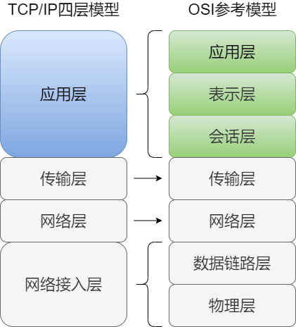

TCP/IP 模型中应用层位于传输层之上，传输层的端口号用于标识数据所对应的应用层协议。也就是说，有端口号的协议都是应用层协议。应用协议是终端设备之间的应用通信规则。应用之间交互的信息叫消息，应用协议定义这些消息的格式以及消息的控制或操作的规则。

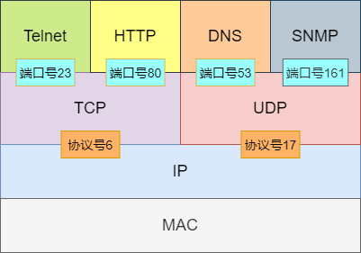

应用协议的通信方式可分为两类：
* 服务器和客户端模型
* P2P 模型

在服务器和客户端模型中，始终公开固定 IP 地址的主机为其它主机的应用程序提供服务，请求服务的主机之间不会互相通信。这些为其它主机提供服务的终端设备称为服务器，那些请求服务的主机则称为客户端。大多数应用层协议，都是这种模型。


在 P2P 模型中，没有特定的服务器或客户端，这些设备上安装的应用程序，可以在主机间建立对等连接，既可以提供服务，也可以接受服务。通常是大流量的应用程序采用 P2P 模型，比如：下载器等。

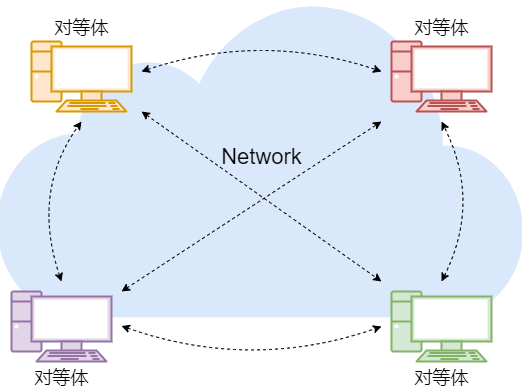

开发应用程序时，为了实现相应的功能和目的，可以使用现有的应用协议，也可以自己定义一个新的应用协议。同时，应用程序可以直接使用传输层以下的网络传输服务，开发者只需要关心选择哪种应用协议、如何开发即可，而不用考虑数据是如何传输到目的地。这也是 TCP/IP 分层模型的特点。


应用程序有很多，包括 Web 浏览器、电子邮件、远程登录、文件传输、网络管理等。这些应用程序都会使用应用协议进行通信，应用协议正是为了实现应用程序的功能而设计和创造的。
## 远程登录
远程登录主要使用 Telnet 和 SSH 两种协议管理网络设备。
### Telnet
Telnet 协议定义了一台设备通过 IP 网络向远端设备发起明文管理连接的通信标准，可以在一台设备上通过 Telnet 协议与一台远端设备建立管理连接，并对远端设备实施配置和监控，这种方式的体验与本地登录设备并无区别。发起管理的设备为 Telnet 客户端，被管理的设备是 Telnet 服务器。因此，Telnet 协议是一个典型的服务器和客户端模型的应用层协议。


Telnet 协议通过 TCP 协议建立服务器和客户端的一条连接，并通过这条连接向服务器发送用户名、密码和命令。Telnet 协议使用的是 TCP 23 端口，表示客户端在发起 Telnet 连接时，默认连接服务器的 TCP 23 号端口。

当 Telnet 客户端输入命令后，这些命令通过 TCP 连接发送到 23 号端口，监听请求的守护进程 Telnetd 收到后，将命令发送给 Shell ，Shell 为操作系统进行命令解释，然后操作系统执行 Telnet 客户端发出的命令。同理，操作系统按照相反的顺序，将命令执行的结果发回给 Telnet 客户端。

Telnet 协议实现了远程命令传输，但是客户端和服务器跨越不可靠的公共网络时，在命令传输过程中可以截获 Telnet 通信的所有数据，然后使用截获的用户名和密码来通过 Telnet 服务器的身份认证，并登录到设备上对配置文件进行修改。


Telnet 协议存在重大安全隐患，不推荐在实验室之外的环境使用。
### SSH
SSH 协议全程是安全外壳协议，目的就是为了取代 Telnet，SSH 是加密的远程登录协议，提供更加安全的远程登录服务。使用 SSH 后会加密通信内容。即使信息被截获，由于无法解密，也无法了解数据的真正内容。

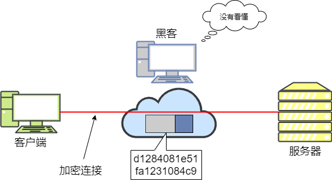

SSH 协议常用版本是 SSHv2，SSH 客户端通过 SSHv2 协议与 SSH 服务器建立一条 TCP 的加密信道，建立这条安全信道的方式是让客户端使用服务器的 RSA 公钥来验证 SSH 服务器的身份。SSH 协议默认使用 TCP 22 端口。

如果客户端成功验证了服务器的身份，它们之间就会创建出一个会话密钥，并用双方协商出来的加密算法和会话密钥，对这个信道传输的数据进行加密。这样，两台设备之间就建立了一条安全的信道，使用这条安全信道发送密码，密码以密文的形式传输，通过服务器的身份认证。SSH 就是通过这种方式建立加密信道，确保 SSH 服务器，也就是被管理设备的 Shell 免遭非法用户操作。
## 文件传输
除了远程登录，我们还需要从远端设备传输文件，文件传输协议提供的应用服务可以满足我们的需求。FTP 是网络上文件传输的标准协议，FTP 使用 TCP 作为传输协议，支持用户的登录认证和访问权限的控制。另一种常见的文件传输协议是 TFTP 协议，TFTP 是一种简单的文件传输协议，不支持用户的登录认证，也没有复杂的命令。TFTP 使用 UDP 作为传输协议，并有重传机制。


### FTP
FTP(`File Transfer Protocol`，文件传送协议) 用于服务器和客户端之间传输文件，是 IP 网络上传输文件的通用协议。FTP 采用客户端和服务器的模式，使用 TCP 协议提供可靠传输。FTP 可以对登录服务器的用户名和密码进行验证，允许客户端指定文件的传输类型，并且可以设置文件的传输权限。

FTP 使用两条 TCP 连接实现文件传输。一条是 FTP 控制连接，用来控制管理；另一条是 FTP 数据连接，用于数据传输。FTP 控制连接用于传输 FTP 控制命令和命令执行的应答信息，比如登录用户名和密码的验证、发送文件的名称、发送方式的设置。这条连接在整个 FTP 会话过程中一直保持打开，通过 ASCII 码字符串发送请求和接收应答。在控制连接上无法发送数据，而 FTP 数据连接用于文件和文件列表的传输，仅在需要传输数据时建立数据连接，数据传输完毕后终止。

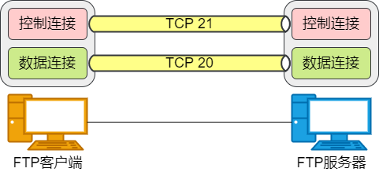

#### FTP使用的端口号
FTP 控制连接使用的是 TCP 21 号端口，也是 FTP 服务器的侦听端口，等待客户端的连接。在 TCP 21 号端口进行文件 GET（RETR）、PUT（STOR），以及文件表（LIST）等操作时，每次都会建立一个用于数据传输的数据连接。数据和文件表的传输正式在这个数据连接上进行的。

数据连接的 TCP 连接通常使用端口 20。也可以使用 PORT 命令修改为其它值。
#### FTP文件传输模式
相同的一个文件，不同的操作系统可能有不同的存储方式。为了确保文件能够准确的传送给对方，常用 2 种传输模式：
* ASCII 模式是默认的文件传输模式。发送方把本地文件转换成标准的 ASCII 码，然后在网络中传输；接收方收到文件后，根据自己的文件存储方式，把它转换成本地文件。ASCII 文件传输模式通常用于传输文本文件。
* 二进制流模式也称为图像文件传输模式。发送方不做任何转换，把文件按照比特流的方式进行传输。二进制文件类型通常用于传送程序文件。

#### FTP数据传输方式
在 FTP 数据连接过程中，有两种数据传输方式：主动方式和被动方式。

FTP 主动传输方式，也称为 PORT 方式。采用主动方式建立数据连接时，FTP 客户端会通过 FTP 控制连接向 FTP 服务器发送 PORT 命令，PORT 命令携带参数：A1、A2、A3、A4、P1、P2，其中 A1、A2、A3、A4 表示需要建立数据连接的主机 IP 地址，而 P1 和 P2 表示客户端用于传输数据的临时端口号，临时端口号的数值为 256*P1+P2。当需要传输数据时，服务器通过 TCP 端口号 20 与客户端提供的临时端口建立数据传输通道，完成数据传输。在整个过程中，由于服务器在建立数据连接时主动发起连接，因此被称为主动模式。


如果客户端在防火墙内部，主动方式可能会有问题，因为客户端的端口号是随机的，防火墙并不知道。默认安全策略，防火墙只会允许外部主机访问部分内部已知端口，阻断对内部随机端口的访问，从而无法建立 FTP 数据连接。这时，就需要使用 FTP 被动方式来进行文件传输。

被动方式也被称为 PASV 方式。FTP 控制通道建立后，希望通过被动方式建立数据传输通道的 FTP 客户端会利用控制通道向 FTP 服务器发送 PASV 命令，告诉服务器进入被动方式传输。服务器选择临时端口号并告知客户端，命令参数和主动传输方式一致。当需要传输数据时，客户端主动与服务器的临时端口建立数据传输通道，并完成数据传输。在整个过程中，服务器是被动接收客户端的数据连接，所以被称为被动模式。


采用被动方式时，两个连接都由客户端发起。一般防火墙不会限制内部的客户端发起的连接，这样就解决了主动方式下的问题。
### TFTP
TFTP(`Trivial File Transfer Protocol`，简单文件传送协议) 也是用于服务器和客户端之间传输文件的，对比 FTP，TFTP 没有复杂的交互接口和认证控制，适用于不需要复杂交互的网络环境。TFTP 采用客户端和服务器的模式，使用 UDP 协议传输，服务器使用端口号 69 侦听 TFTP 连接。由于 UDP 不能提供可靠的数据传输，因此 TFTP 使用超时重传机制确保数据正确发送。TFTP 只能提供简单的文件传输能力，包括文件的上传和下载。不支持文件目录功能，也不能对用户的身份进行验证和授权。


TFTP 协议传输是由客户端发起的。当需要下载文件时，客户端向 TFTP 服务器发送一个读请求，然后从服务器接收数据，并向服务器发送确认；当需要上传文件时，由客户端向服务器发送一个写请求，然后向服务器发送数据，并接收服务器的确认。

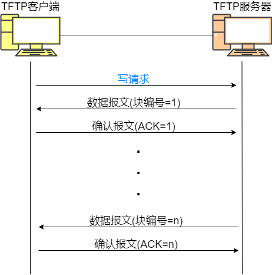

与 FTP 类似，TFTP 传输文件有两种模式：`netascii`模式和`octet`模式。
* `octet`传输模式对应 FTP 的二进制流模式，用于传输程序文件；
* `netascii`模式对应 FTP 的 ASCII 模式，用于传输文本文件。

TFTP 进行文件传输时，将传输文件看成是由多个连续的文件块组成。每一个 TFTP 数据报文中包含一个文件块，同时对应一个文件块编号。每次发完一个文件块后，就等待对方的确认，确认时指明块编号。发送方发完数据后，如果在规定时间内没收到对端的确认，那么发送方就会重新发送数据。发送确认的一方如果在规定时间内没收到下一个文件块数据，则重发确认报文。这种方式可以确保文件的传送不会因某一个数据的丢失而失败。

每次 TFTP 发送的数据报文中包含的文件块大小固定为 512 字节，如果文件长度恰好是 512 字节的整数倍，那么在文件传送完毕后，发送方还必须在最后发送一个不包含数据的报文，用来表示文件传输完毕。如果文件长度不是 512 字节的整数倍，那么最后传送的数据报文包含的文件块肯定小于 512 字节，正好作为文件结束的标志。
## 电子邮件
电子邮件，顾名思义，就是指网络上的邮政。通过电子邮件，可以发送文字内容、图片，还可以发送报表数据等所有计算机可以存储的信息。电子邮件不受距离限制，可以与世界上任一的互联网用户互相联系。由于使用简易、投递迅速、易于保存、不受距离限制等特点，使得电子邮件已经成为人们普遍使用的一种应用。


### 通信架构
电子邮件在几十年的发展过程中出现了明显的变化，从原始的发送方电脑直接向接收方电脑发送电子邮件，演变成收发双方都使用邮件服务器代为收发邮件。通过这种方式，电子邮件通信不再依赖接收方当前是否在线，而电子邮件的通信过程由简单的发送方到接收方，演变成发送方电脑到发送方邮件服务器，发送方邮件服务器到接收方邮件服务器，以及接收方邮件服务器到接收方电脑的三个通信过程。并且参与通信的四方都不是直接相连，而是分别独立连接到互联网中。这个架构中，邮件发送方和接收方使用的电脑称为用户代理。

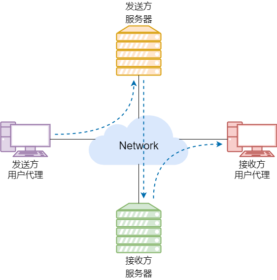

一个邮件服务器既可以作为客户，也可以作为服务器。

例如，当邮件服务器 A 向另一个邮件服务器 B 发送邮件时，邮件服务器 A 就作为 SMTP 客户，而 B 是 SMTP 服务器。

当邮件服务器 A 从另一个邮件服务器 B 接收邮件时，邮件服务器 A 就作为 SMTP 服务器，而 B 是 SMTP 客户。
### 邮件地址
使用电子邮件时，需要拥有一个地址，这个地址叫做邮件地址，也叫邮箱地址。它相当于通信地址和姓名。 

例如：`wsq@qq.com`

`wsq` 表示用户的名称，同一个通信地址内，名称必须是唯一的，不能出现重复；`@`表示分隔符；`qq.com`是用户邮箱的邮件接收服务器的域名。

电子邮件的发送地址由 DNS 管理。DNS 中注册了邮件地址和对应邮件服务器的域名。这些映射信息被称为 MX 记录。比如：`qq.com`的 MX 记录中指定了`mail.qq.com`。那么任何发送给`qq.com`结尾的邮件都被发送到`mail.qq.com`服务器。就这样，根据 MX 记录中指定的邮件服务器，可以管理不同邮件地址与特定邮件服务器之间的映射关系。
### SMTP 协议
提供电子邮件服务的协议叫做 SMTP。SMTP 用于收发双方的邮件服务器之间，而不是用户代理和邮件服务器之间的通信方式。在实际使用中，发送方用户代理与发送方服务器之间也常采用 SMTP 协议。

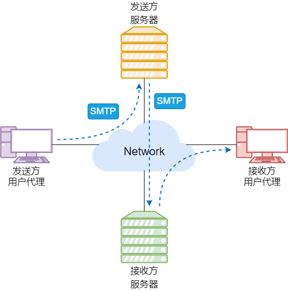

SMTP 为了实现高效发送邮件内容，在传输层使用了 TCP 协议，端口号是 25。

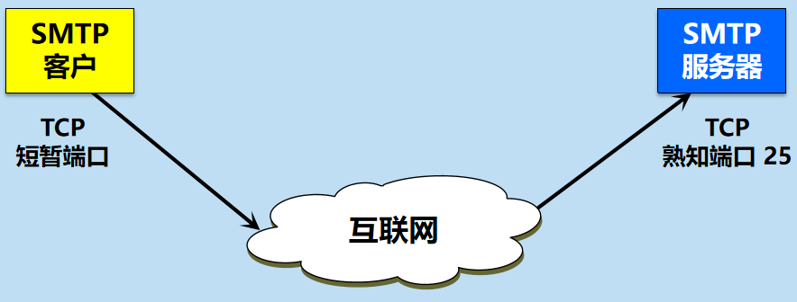

在一台邮件服务器向另一台邮件服务器发送邮件时，首先向对方的 TCP 25 端口发起一条连接。然后利用这条 TCP 连接发送控制消息和数据。

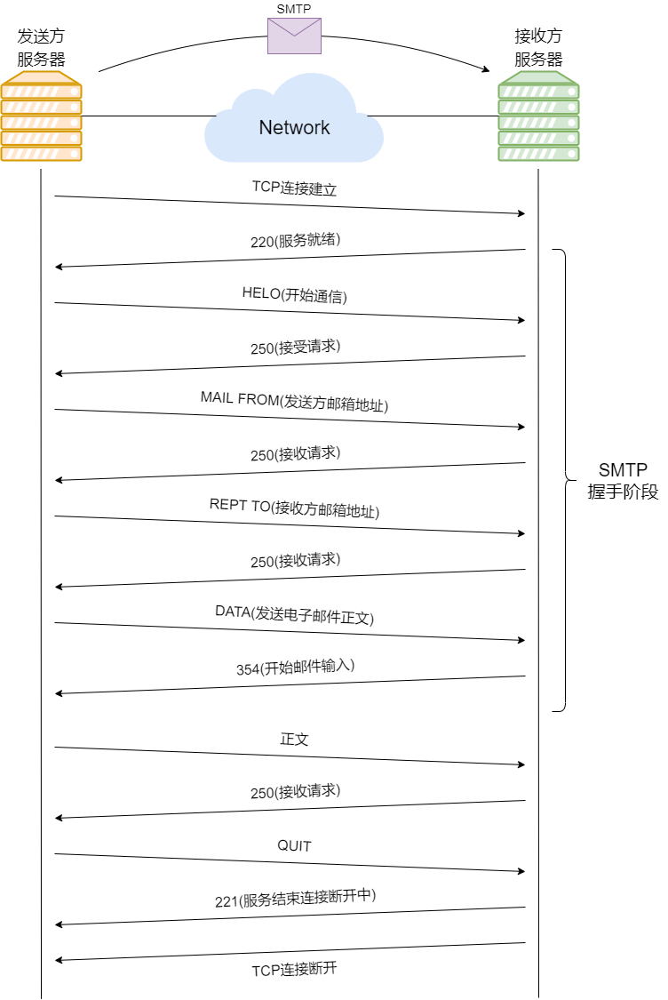

SMTP 规定了 14 条命令和 21 种应答信息。每条命令用几个字母组成，每一种应答信息一般只有一行信息，由一个 3 位数字的代码开始，后面附上很简单的文字说明。

尽管 SMTP 协议的逻辑简单，也足以顺利完成邮件的传输工作，但难免存在一些安全缺陷：
* SMTP 传输的邮件是明文的形式，没有提供数据加密机制，可以看到邮件传输的具体内容，用户信息的机密性无法得到保障。
* SMTP 没有提供任何认证机制，即使使用了伪造的发件人邮件地址也无法识别，会出现冒名顶替的安全问题。
* 在网络上的传输效率不高。SMTP 本来就是为传送 ASCII 码设计的，在传输非 ASCII 码的长报文时效率不高。

漫天的广告邮件和包含钓鱼链接的垃圾邮件成为日益严重的问题。为了修正 SMTP 出现的问题，IETF 定义了扩展的 SMTP，即 ESMTP。ESMTP 提供的扩展功能中包括认证机制和加密机制等。

在整个邮件传输的过程中，SMTP/ESMTP 协议定义了邮件服务器之间的消息传输方式。在接收服务器收到电子邮件后，接收方（用户代理）是如何访问邮件则需要其它的协议来处理。
###  POP3 协议
电子邮件通过 SMTP 协议到达接收方服务器，个人电脑不可能长期处于开机状态，用户希望一开机就能收到邮件，然而 SMTP 没有这种功能。为了解决这个问题，就引入了 POP3 协议。

POP3(`Post Office Protocol`，邮局协议) 协议是用于接收电子邮件的协议。发送端的邮件使用 SMTP 协议将电子邮件转发给一直在线的 POP3 服务器。客户端再根据 POP3 协议从 POP3 服务器接收邮件。这个过程中，为了防止别人盗取邮件内容，还要进行用户认证。


POP3 协议和 SMTP 协议一样，是基于 TCP 的应用层协议，使用 TCP 110 端口连接邮件服务器。接收方的邮件客户端程序首先使用 TCP 连接到 POP3 服务器的 TCP 端口 110；再进行用户认证、邮件列表查询、邮件下载、邮件删除等操作；操作完成后，客户端与邮件服务器之间再断开 TCP 连接。

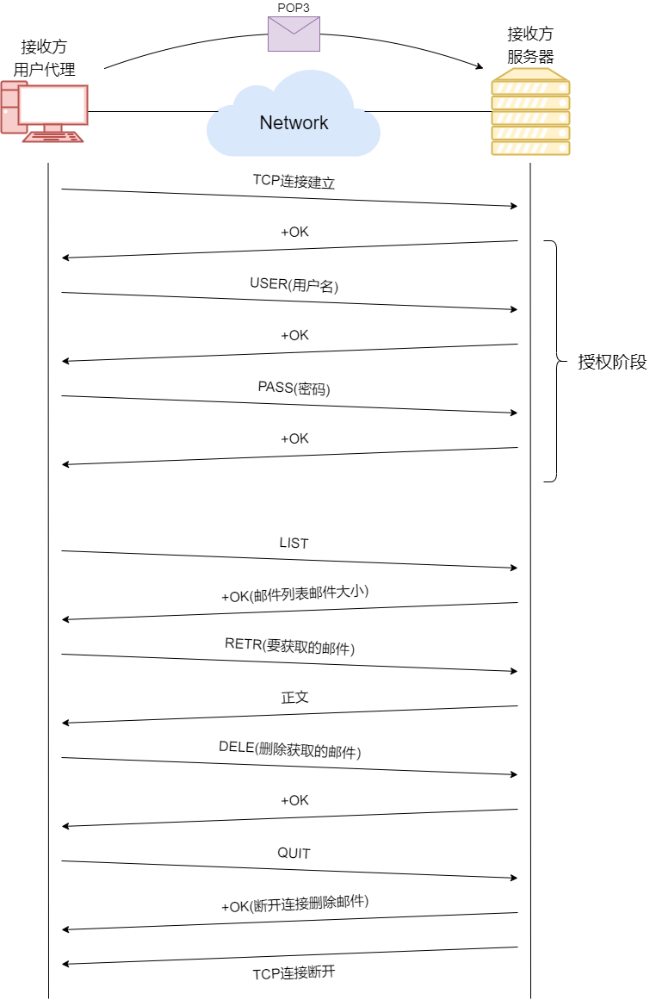

### IMAP 协议
POP3 协议的邮件客户端能够在邮件服务器上执行的操作很少，而且邮件要下载到客户端本地，而不保留在邮件服务器，实际使用时很不方便。目前使用更广泛的接收电子邮件的协议是 IMAP(`Internet Message Access Protocol`，网际报文存取协议)，IMAP 使用 TCP 143 端口实现客户与服务器的通信。在 IMAP 中邮件则由服务器进行管理。

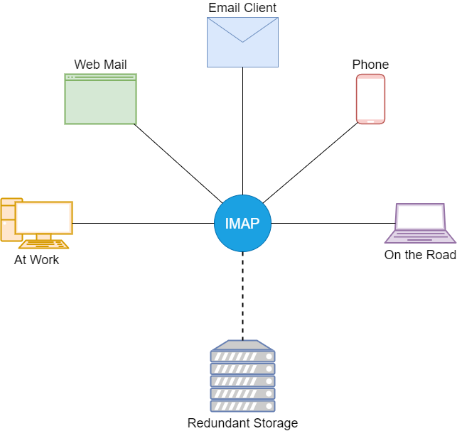

使用 IMAP 时，不必从服务器上下载所有的邮件也可以查看。由于 IMAP 是在服务器端处理 MIME 信息，它可以实现邮件附件的选择性下载功能。比如：一封邮件有 5 个附件时，可以只下载其中的 3 个附件。IMAP 还会在服务器上对“已读/未读”信息和邮件分类进行管理，所以在不同的电脑上打开邮箱，也能保持同步，使用起来非常方便。

### IMAP 与 POP3 比较

| 操作位置  |      操作内容      |     IMAP     |  POP3   |
|:-----:|:--------------:|:------------:|:-------:|
|  收件箱  | 阅读、标记、移动、删除邮件等 |  客户端与邮箱更新同步  | 仅在客户端内  |
|  发件箱  |     保存到已发送     | 客户端与邮箱更新同步   | 仅在客户端内  |
| 创建文件夹 |   新建自定义的文件夹    |  客户端与邮箱更新同步  | 仅在客户端内  |
|  草稿   |      保存草稿      |  客户端与邮箱更新同步  | 仅在客户端内  |
| 垃圾文件夹 | 接收并移入垃圾文件夹的邮件  |      支持      |   不支持   |
| 广告邮件  | 接收并移入广告邮件夹的邮件  |      支持      |   不支持   |

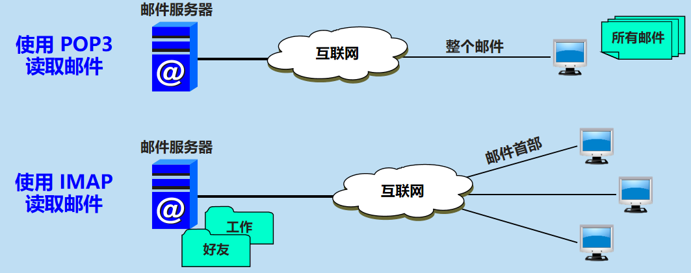

邮件读取协议 POP 或 IMAP 与邮件传送协议 SMTP 完全不同。发信人的用户代理向源邮件服务器发送邮件，以及源邮件服务器向目的邮件服务器发送邮件，都是使用 SMTP 协议。而 POP 协议或 IMAP 协议则是用户从目的邮件服务器上读取邮件所使用的协议。


## 通用互联网邮件扩充 MIME
SMTP 有以下缺点：
* SMTP 不能传送可执行文件或其他的二进制对象。
* SMTP 限于传送 7 位的 ASCII 码。许多其他非英语国家的文字（如中文、俄文或德文）就无法传送。
* SMTP 服务器会拒绝超过一定长度的邮件。
* 某些 SMTP 的实现并没有完全按照 SMTP 的标准。

于是在这种情况下提出了通用互联网邮件扩充 MIME。
### MIME 概述
MMIE 并没有改动或修改 SMTP，MIME 的意图是继续使用原来的邮件格式，但增加了邮件主体的结构，并定义了传送非 ASCII 码的编码规则。也就是说 MIME 邮件可在现有的电子邮件程序和协议下传送。

MIME 和 SMTP 的关系：

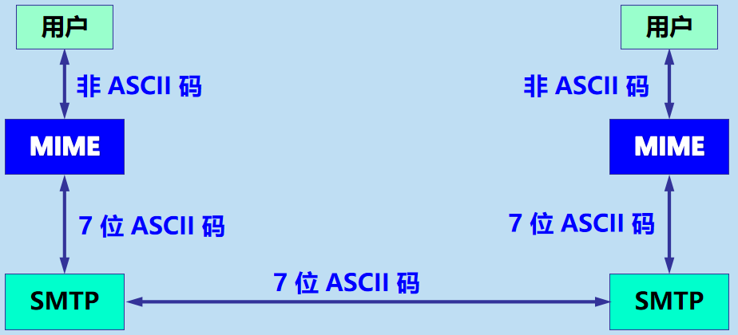

MIME 主要包括三个部分：
* 5 个新的邮件首部字段，它们可包含在原有首部中。这些字段提供了有关邮件主体的信息。
* 定义了许多邮件内容的格式，对多媒体电子邮件的表示方法进行了标准化。
* 定义了传送编码，可对任何内容格式进行转换，而不会被邮件系统改变。

MIME 增加 5 个新的邮件首部：

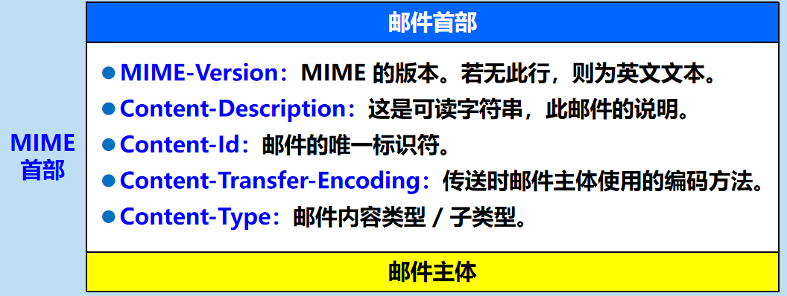

### 内容传送编码(Content-Transfer-Encoding)

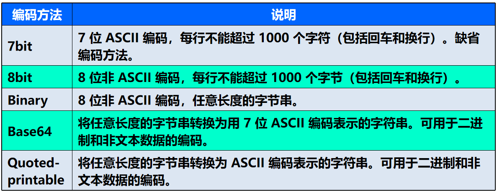

`Quoted-printable`编码适用于所传送的数据中只有少量的非 ASCII 码的情况。

`Base64`编码适合任意长度的二进制数据。
### 内容类型
MIME 标准规定`Content-Type`说明必须含有两个标识符，即内容类型和子类型，中间用`/`分开。

MIME 标准原先定义了 7 个基本内容类型和 15 种子类型。

MIME允许发件人和收件人自己定义专用的内容类型。但为避免可能出现名字冲突，标准要求为专用的内容类型选择的名字要以字符串`X-`开始。


MIME 举例


## WWW
万维网（ WWW ）是将互联网的信息以超文本形式展现的系统，也叫做 Web 。可以显示 WWW 信息的客户端软件叫做 Web 浏览器。使用浏览器，我们不需要关心信息保存在哪个服务器，只需轻轻点击鼠标，就可以访问页面上的链接并打开相关信息。


通过浏览器进行访问后，显示在浏览器上的内容叫做 Web 页。访问一个网站时看到的第一个页面称为首页。很多公司的主页地址形式如下：`http://www.公司名称.com.cn`。

WWW 有 3 个重要的概念，它们分别是访问信息的方式和位置（URI）、信息的表现形式（HTML）以及信息传输（HTTP）等操作。
### URI
URI 用于标识资源，是一种高效的识别码，被应用于主页地址、电子邮件、电话号码等。
```text
http://www.rfc-editor.org/rfc/rfc4395.txt
http://www.ietf.org:80/index.html
http://localhost:321
```
通常主页地址被叫做 URL。URL 常用来表示网络资源的具体位置。但是 URI 不限于标识互联网资源，可以作为所有资源的标识符。简单说就是 URL 是 URI 的一个子集。

WWW 主要使用 http 和 https 表示 Web 页的位置和访问 Web 页的方法。http 的具体格式如下：
```text
http://主机名/路径
http://主机名:端口号/路径
http://主机名:端口号/路径?访问内容#部分信息
```
其中主机名可以用域名或 IP 地址表示，端口号表示传输端口号。省略端口号时，表示使用 http 的默认端口 80。路径是指主机上信息的位置，访问内容表示要传给 CGI 的信息，部分信息表示页面当中的位置等。这种表示方法可以标识互联网中特定的数据。由于 http 展现的数据随时都有可能发生变化，所以记住页面的 URI（URL），也不能保证下次能够访问到这个页面。
### HTML
HTML 是用来描述 Web 页的一种语言。它可以指定浏览器中显示的文字、文字的大小和颜色，还可以对图像、动画或音频进行设置。

HTML 也可以说是 WWW 的数据表现协议。只要是用 HTML 展现的数据，即使是在不同的计算机上，效果基本上是一样的。
### HTTP
当用户在浏览器的地址栏里输入 Web 页的 URL 后，HTTP 的处理就开始了。HTTP 默认使用 80 端口。它的工作机制，首先是客户端向服务器的 80 端口建立一个 TCP 连接，然后在这个 TCP 连接上进行请求和应答以及数据报文的发送。


HTTP 中常用的有两个版本，一个是 HTTP 1.0，另一个是 HTTP 1.1。在 HTTP 1.0 中每一个命令和应答都会触发一次 TCP 连接的建立和断开。而从 HTTP 1.1 开始，允许在一个 TCP 连接上发送多个命令和应答，这种方式也叫保持连接（`keep-alive`）。可以大量减少 TCP 连接的建立和断开操作，提高传输效率。

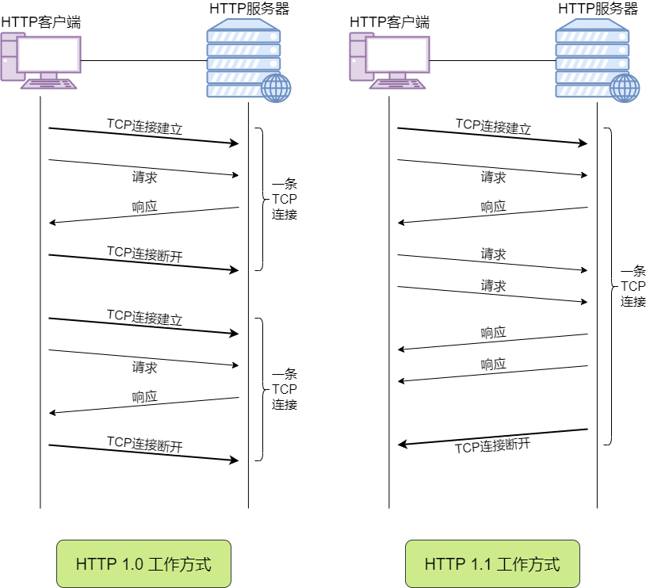
