## 以太网
有线局域网中普遍使用以太网，以太网标准简单，传输速率高。常见的网络拓扑结构如下图。

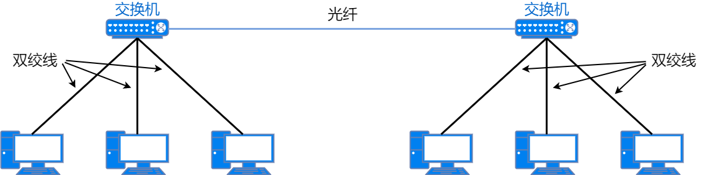

### 以太网数据格式
最常用的以太网协议标准是 ETHERNET II 标准。ETHERNET II 标准定义的数据帧格式：

字段说明：
* 前导码：由 7 个字节组成，每个字节固定为`10101010`。之后的 1 个字节称为帧起始定界符，这个字节固定为`10101011`。这 8 个字节表示以太网帧的开始，也是对端网卡能够确保与其同步的标志。帧起始定界符的最后两位比特被定义为`11`，之后就是以太网数据帧的本体。
	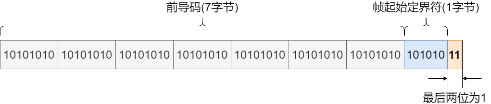
* 目的地址：由 6 个字节组成，用来标识数据帧的目的设备，类似于快递的收件人地址。
* 源地址：由 6 个字节组成，用来标识数据帧的始发设备，类似于快递的发件人地址。
* 类型：由 2 个字节组成。类型字段是表明上一层（即网络层）的协议类型，可以让接收方使用相同的协议进行数据帧的解封装。
* 数据：帧头后就是数据。一个数据帧所能容纳的最大数据范围是 46～1500 个字节。如果数据部分不足 46 个字节，则填充这个数据帧，让它的长度可以满足最小长度的要求。
* FCS（`Frame Check Sequence`）：由 4 个字节组成，位于数据帧的尾部，用来检查帧是否有所损坏。通过检查 FCS 字段的值将受到噪声干扰的错误帧丢弃。

数据帧的各字段加起来一共是 64 字节，其中数据是 46 字节。再加上前导码就是 72 字节。因此最小的数据帧是 72 字节。在传输过程中，每个数据帧还有 12 字节的数据帧间隙，所以最小的可传输数据帧长度是 84 字节，即 672 比特。
### 以太网数据帧类型

|   名称   | 说明                               |
|:------:|:---------------------------------|
| 单播数据帧  | 目的地址是广播和组播以外的数据帧                 |
| 广播数据帧  | 目的地址是广播地址 (ff:ff:ff:ff) 的数据帧     |
| 组播数据帧  | 目的地址是组播地址的数据帧                    |
| 不完全帧   | 包含头部、长度为63字节及以下的数据帧，由于冲突等原因形成的坏帧 |
|  小巨人帧  | 比 1518 字节稍大的数据帧，通常是指 1522 字节的数据帧 |
|  巨型帧   | 比 1518 字节大很多的数据帧                 |

### 以太网标准
以太网原本是指使用 CSMA/CD 的控制方式，实际速率为`10Mbit/s`的标准。随着技术的迭代，速率为`100Mbit/s`的快速以太网和速率为`1Gbit/s`的千兆以太网逐步登场。从快速以太网开始，采用了全双工通信方式，而不是 CSMA/CD 技术的以太网。

到千兆以太网，半双工通信中还保留了 CSMA/CD 技术规范。到了万兆以太网，就彻底移除 CSMA/CD 规范，所有通信方式都采用全双工方式。
### 以太网的分类
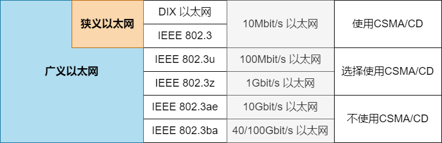

### 命名规则
IEEE802.3 标准根据使用的传输线缆和传输速度的不同，有 10BASE-T、10BASE-TX 等名称。

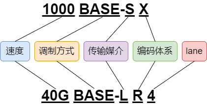

IEEE802.3 定义的链路速率：

|  条目  |   传输速率    |
|:----:|:---------:|
|  1   | 1Mbit/s   |
|  10  | 10MBit/s  |
| 100  | 100MBit/s |
| 1000 |  1GBit/s  |
| 10G  | 10GBit/s  |
| 40G  | 40GBit/s  |
| 100G | 100GBit/s |

IEEE802.3 定义的调制方式：

|  条目   |              调制方式              |
|:-----:|:------------------------------:|
| BASE  | BaseBand（基带信号），1 根线缆只传输 1 个信号  |
| BROAD |  BroadBand（宽频信号），1 根线缆能传输多个信号  |

IEEE 802.3 定义的传输媒介：

| 条目 | 传输介质                                 |
|:--:|:-------------------------------------|
| 5  | 最长为 500 米的粗同轴电缆                      |
| 2  | 最长为 185 米的细同轴电缆                      |
| T  | Twisted Pair，双绞线                     |
| F  | Fiber，光纤                             |
| K  | Copper Backplane，由铜线组成的背板            |
| B  | Bi-directional，1 芯单模光缆               |
| S  | Short Reach(100m)，2 芯多模光缆            |
| L  | Long Reach(10km)，2 芯单模或多模光缆          |
| E  | Extended Long Reach(40km)，2 芯单模光缆    |
| Z  | Long Reach Simple Mode(70km)，2 芯单模光缆 |
| C  | Co-axial，2 芯平衡式屏蔽同轴线缆                |
| P  | PON，1 芯单模光缆，单点到多点                    |

IEEE802.3 定义的编码体系：

| 条目 | 编码体系                                             |
|:--:|:-------------------------------------------------|
| X  | 在快速以太网时使用 4B/5B 作为分组码  在千兆以太网时使用8B/10B 作为分组码  |
| R  | 使用 64B/66B 作为分组码                                 |

IEEE802.3 定义的`lane`：

|   条目    | 编码体系                            |
|:-------:|:--------------------------------|
| 4 或者 10 | 在同轴线缆中表示使用 4 个或 10 个 lane       |
| N(任意数字) | 在光纤中，lane 还可以表示波长数量，波长为 1 时可以省略 |

### 10Mbit/s 以太网的主要标准

|    条目    | 制定时间  |   IEEE 标准   |   传输速率   |  编码  | 传输介质  | 最大传输距离 |
|:--------:|:-----:|:-----------:|:--------:|:----:|:-----:|:------:|
| 10BASE5  | 1983年 | IEEE 802.3  | 10MBit/s | 曼彻斯特 | 粗同轴电缆 |  500m  |
| 10BASE2  | 1988年 | IEEE 802.3a | 10MBit/s | 曼彻斯特 | 细同轴电缆 |  185m  |
| 10BASE-T | 1990年 | IEEE 802.3i | 10MBit/s | 曼彻斯特 |  双绞线  |  100m  |
| 10BASE-F | 1993年 | IEEE 802.3j | 10MBit/s | 曼彻斯特 |  光纤   |  2km   |

### 快速以太网的主要标准

|     条目     | 制定时间  |   IEEE 标准    |    传输速率    |     编码     |     传输介质      |        最大传输距离         |
|:----------:|:-----:|:------------:|:----------:|:----------:|:-------------:|:---------------------:|
| 100BASE-T  | 1995年 | IEEE 802.3u  | 100MBit/s  |     无      |      双绞线      |         100m          |
| 100BASE-TX | 1995年 | IEEE 802.3u  | 100MBit/s  | 4B5B/MLT-3 | 双绞线 (2对5类) |         100m          |
| 100BASE-FX | 1995年 | IEEE 802.3u  | 100MBit/s  | 4B/5B NRZI |  光缆 (MMF)  | 400m(半双工) 2km(全双工) |
| 100BASE-T4 | 1995年 | IEEE 802.3u  | 100MBit/s  | 8B6T/PAM-3 | 双绞线 (4对3类) |         100m          |
| 100BAEE-T2 | 1998年 | IEEE 802.3y  | 100MBit/s  |   PAM5x5   | 双绞线 (2对3类) |         100m          |

100BASE-T 是 100BASE-TX、100BASE-T4、100BASE-T2 的统称。目前 100BASE-T4、100BASE-T2 不再使用，主要使用 100BASE-TX。
### 千兆以太网的主要标准

|     条目      | 制定时间  |   IEEE 标准    |  传输速率   |      编码       |              传输介质              |   最大传输距离    |
|:-----------:|:-----:|:------------:|:-------:|:-------------:|:------------------------------:|:-----------:|
| 1000BASE-SX | 1998年 | IEEE 802.3z  | 1GBit/s |   8B10B/NRZ   |          MMF(波长850nm)          |    500m     |
| 1000BASE-LX | 1998年 | IEEE 802.3z  | 1GBit/s |   8B10B/NRZ   | MMF(波长1300nm) SMF(波长1310nm) | 550m 5km |
| 1000BASE-CX | 1998年 | IEEE 802.3z  | 1GBit/s |   8B10B/NRZ   |          150Ω平衡屏蔽双绞线           |     25m     |
| 1000BASE-ZX | 1998年 | IEEE 802.3z  | 1GBit/s |   8B10B/NRZ   |         SMF(波长1550nm)          |  70~100km   |
| 1000BASE-T  | 1999年 | IEEE 802.3ab | 1GBit/s | 8B1Q4/4D-PAM5 |           双绞线(4对超5类)           |    100m     |
| 1000BASE-TX | 2001年 | TIA/EIA-854  | 1GBit/s | 8B1Q4/4D-PAM5 |           双绞线(4对6类)            |    100m     |
| 1000BASE-BX | 2004年 | IEEE 802.3ah | 1GBit/s |   8B10B/NRZ   |     SMF(下行1490nm，上行1310nm)     |    10km     |

### 万兆以太网的主要标准

|     条目     | 制定时间  |    IEEE 标准    |   传输速率   |      编码      |        传输介质         | 最大传输距离 |
|:----------:|:-----:|:-------------:|:--------:|:------------:|:-------------------:|:------:|
| 10GBASE-SR | 2022年 | IEEE 802.3ae  | 10GBit/s |   64B/66B    | MMF(LAN PHY) 850nm  |  300m  |
| 10GBASE-LR | 2022年 | IEEE 802.3ae  | 10GBit/s |   64B/66B    | SMF(LAN PHY) 1310nm |  10km  |
| 10GBASE-ER | 2022年 | IEEE 802.3ae  | 10GBit/s |   64B/66B    | SMF(LAN PHY) 1550nm |  40km  |
| 10GBASE-SW | 2022年 | IEEE 802.3ae  | 10GBit/s | 64B/66B WIS  |    MMF(WAN PHY)     |  300m  |
| 10GBASE-LW | 2022年 | IEEE 802.3ae  | 10GBit/s | 64B/66B WIS  |    SMF(WAN PHY)     | 10km   |
| 10GBASE-EW | 2022年 | IEEE 802.3ae  | 10GBit/s | 64B/66B WIS  |    SMF(WAN PHY)     |  40km  |
| 10GBASE-T  | 2022年 | IEEE 802.3an  | 10GBit/s |     LDPC     |     UTP/STP(6类)     |  100m  |

WIS ，广域网接口子层的简称。LDPC，低密度奇偶校验码的简称。
## 40G/100G 以太网的主要标准

|      条目       | 制定时间  |   IEEE 标准    |   传输速率    |   编码    | 传输介质 | 最大传输距离 |
|:-------------:|:-----:|:------------:|:---------:|:-------:|:----:|:------:|
|  40GBASE-KR4  | 2010年 | IEEE 802.3ba | 40GBit/s  | 64B/66B |  背板  |   1m   |
|  40GBASE-CR4  | 2010年 | IEEE 802.3ba | 40GBit/s  | 64B/66B | 同轴线缆 |  10m   |
|  40GBASE-SR4  | 2010年 | IEEE 802.3ba | 40GBit/s  | 64B/66B | MMF  |  100m  |
|  40GBASE-LR4  | 2010年 | IEEE 802.3ba | 40GBit/s  | 64B/66B | SMF  |  10km  |
| 100GBASE-CR10 | 2010年 | IEEE 802.3ba | 100GBit/s | 64B/66B | 同轴线缆 |  10m   |
| 100GBASE-SR10 | 2010年 | IEEE 802.3ba | 100GBit/s | 64B/66B | MMF  |  100m  |
| 100GBASE-LR4  | 2010年 | IEEE 802.3ba | 100GBit/s | 64B/66B | SMF  |  10km  |
| 100GBASE-ER4  | 2010年 | IEEE 802.3ba | 100GBit/s | 64B/66B | SMF  |  40km  |

### 以太网标准的数据处理
以太网采用小端顺序方式传输比特流，也就是说 1 个字节（`8bit`）的数据，会从最低位开始传送，将每`8bit`数据中的 0 与 1 顺序颠倒进行传送。FDDI 以及令牌环等网络，则采用大端顺序进行传输数据。

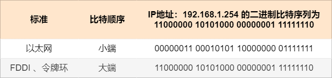

在网络上进行传输的二进制数据使用的字节排列顺序也叫做网络字节序。TCP/IP 协议中都使用大端顺序开始传送数据。
### 二层交换机的特点
* 二层交换机可以充当网桥，将计算机网络系统的各种终端设备连接在一个平台上。它们能够非常快速且有效地将数据从LAN 网络的源端传输到目标端。
* 二层交换机通过从交换机的地址表中学习目的节点的 MAC 地址，执行交换功能，将数据帧从源端重新排列到目的端。
* MAC地址表为二层设备提供了唯一的地址，用于标识数据下发的终端设备和节点。
* 二层交换机将庞大复杂的 LAN 网络拆分为一个个小的 VLAN 网络。
* 通过在一个大型的 LAN 网络中配置多个 VLAN，在没有物理连接的情况下，交换变得更快。
* 以太网交换机的每个接口是一个冲突域。

### 二层交换机转发原理
交换机有多个网络端口，它通过识别数据帧的目标 MAC 地址，根据 MAC 地址表决定从哪个端口发送数据。MAC 地址表是自动生成的。

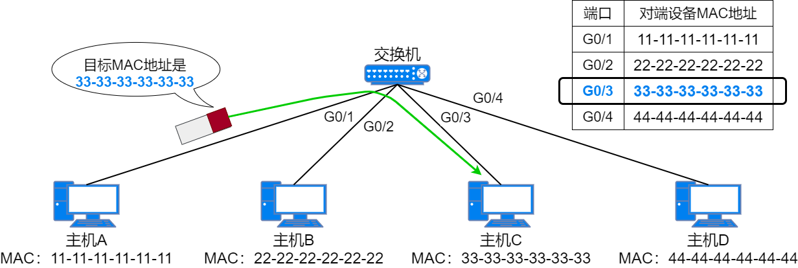

#### 添加、更新、删除 MAC 地址表条目
在初始状态下，交换机的 MAC 地址表是空的，不包含任何条目。当交换机的某个端口接收到一个数据帧时，它就会将这个数据帧的源 MAC 地址、接收数据帧的端口号作为一个条目保存在自己的 MAC 地址表中，同时在接收到这个数据帧时重置这个条目的老化计时器时间。这就是交换机自动添加 MAC 地址表条目的方式。

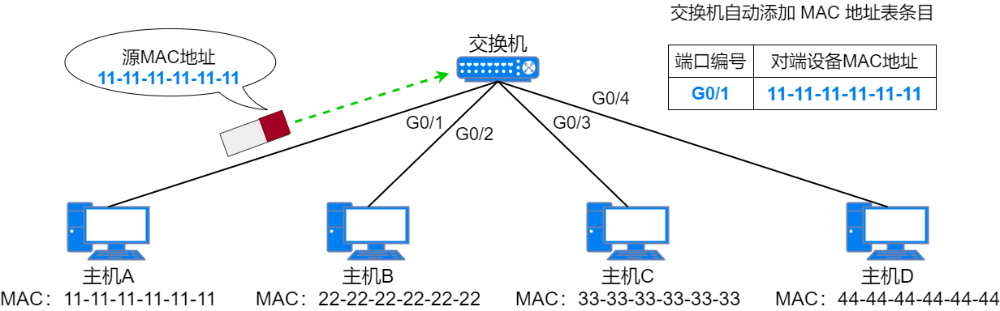

在新增这一条 MAC 地址条目后，如果交换机再次从同一个端口收到相同 MAC 地址为源 MAC 地址的数据帧时，交换机就会更新这个条目的老化计时器，确保活跃的的条目不会老化。但是如果在老化时间内都没收到匹配这个条目的数据帧，交换机就会将这个老化的条目从自己的 MAC 地址表中删除。

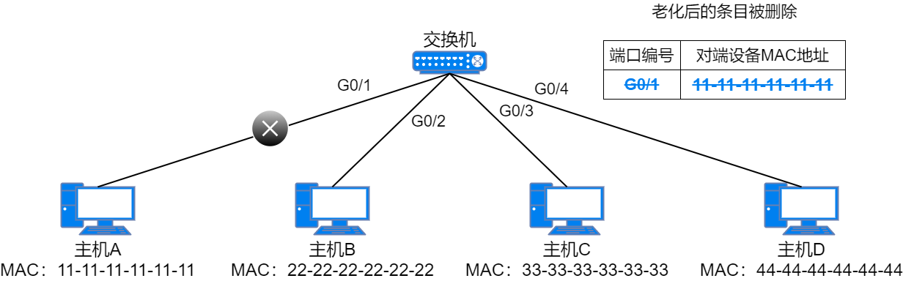

还可以手动在交换机的 MAC 地址表中添加静态条目。静态添加的 MAC 地址条目优先于动态学习的条目进行转发，而且静态条目没有老化时间，会一直保存在交换机的 MAC 地址表中。

#### 如何使用 MAC 地址表条目进行转发
当交换机的某个端口收到一个单播数据帧时，它会查看这个数据帧的二层头部信息，并进行两个操作。一个操作是根据源 MAC 地址和端口信息添加或更新 MAC 地址表。另一个操作是查看数据帧的目的 MAC 地址，并根据数据帧的目的 MAC 地址查找自己的 MAC 地址表。在查找 MAC 地址表后，交换机会根据查找结果对数据帧进行处理，这里有 3 种情况：
1. 交换机没有在 MAC 地址表中找到这个数据帧的目的 MAC 地址，因此交换机不知道自己的端口是否有连接这个 MAC 地址的设备。于是，交换机将这个数据帧从除了接收端口之外的所有端口泛洪出去。
	 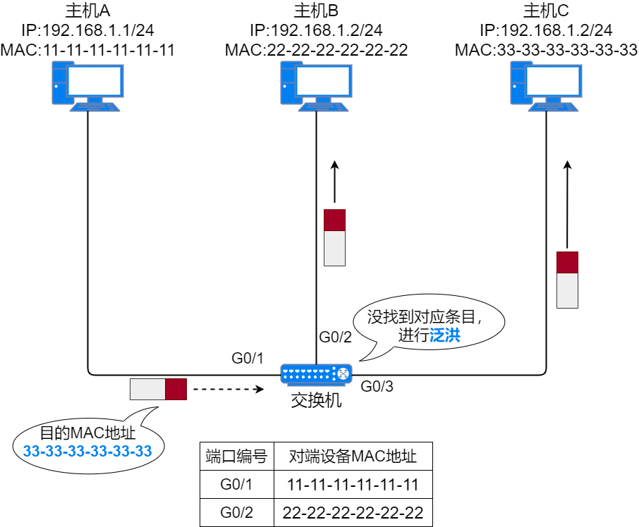
2. 交换机的 MAC 地址表中有这个数据帧的目的 MAC 地址，且对应端口不是接收到这个数据帧的端口，交换机知道目的设备连接在哪个端口上，因此交换机会根据 MAC 地址表中的条目将数据帧从对应端口单播转发出去，而其它与交换机相连的设备则不会收到这个数据帧。
	 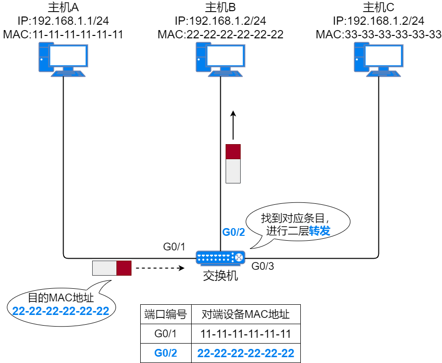
3. 交换机的 MAC 地址表中有这个数据帧的目的 MAC 地址，且对应端口就是接收到这个数据帧的端口。这种情况下，交换机会认为数据帧的目的地址就在这个端口所连接的范围内，因此目的设备应该已经收到数据帧。这个数据帧与其它端口的设备无关，不会将数据帧从其它端口转发出去。于是，交换机会丢弃数据帧。
	 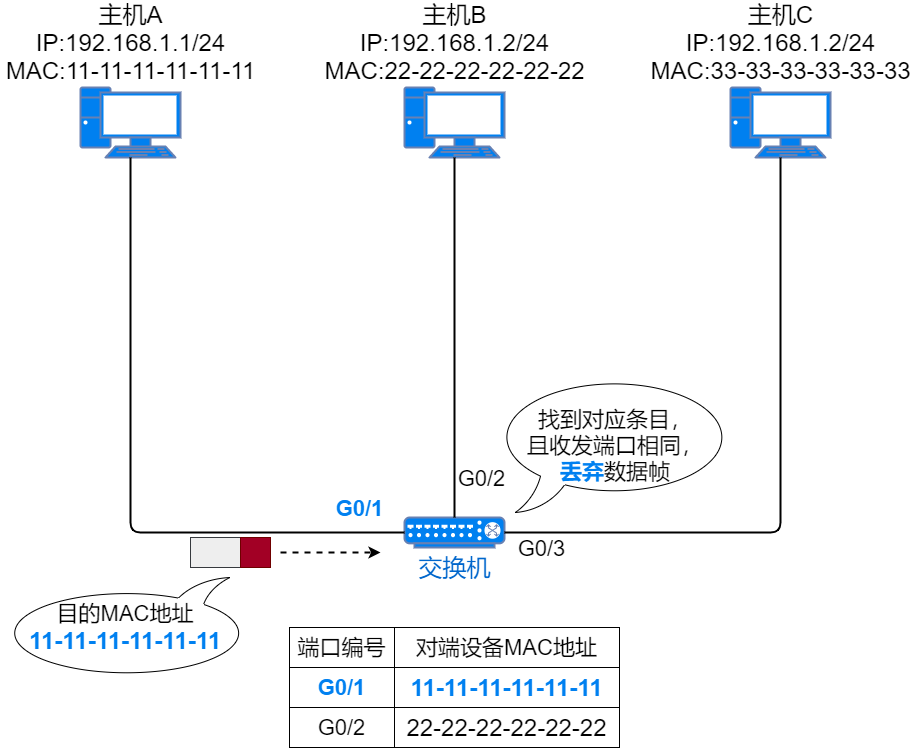

* 单播：主机一对一的发送数据。单播地址是主机的 MAC 地址。
* 广播：向局域网内所有设备发送数据。只有全 1 的 MAC 地址为广播 MAC 地址，即`FF-FF-FF-FF-FF-FF`。
* 泛洪：将某个端口收到的数据从除该端口之外的所有端口发送出去。泛洪操作广播的是普通数据帧而不是广播帧。

## VLAN

[VLAN详解](VLAN详解.md)
