## CSMA/CA
以太网用 CSMA/CD 进行传输控制，而 IEEE802.11 的 WLAN 采用的是 CSMA/CA。

CSMA/CD，全称`Carrier Sense Multiple Access with Collision Detection`，即载波侦听多路访问/冲突检测协议。
* 载波侦听（`Carrier Sense`），是指网络中的各个设备在发送数据前，都要确认确认线路上有没有数据传输。如果有数据传输，就不发送数据；如果没有数据传输，马上发送数据。
* 多路访问（`Multiple Access`），是指网络上所有设备收发数据，共同使用同一条线路，而且发送的数据是广播型。
* 冲突检测（`Collision Detection`），是指设备在发送数据帧的同时，还必须监听线路情况，判断是否发生冲突。也就是说，同一时刻，有没有其它设备也在发送数据帧。

以太网的冲突域是指数据发送时，检测出冲突，当发生冲突时等待一段随机时间再次发送。而在 WLAN 中，如果遇到其它设备正在发送数据，那么就在设备发送完成后，再等待一段随机时间，才继续发送数据。这就是冲突避免（`CA，Collision Avoidance`）。因为在对方设备发送完后直接发送数据，也有可能会造成无线传输冲突。

以太网中，传输介质是网线或光纤，能够通过电气信号检测冲突的发生。但由于无线网络不会产生电气信号，因此需要使用 CSMA/CA 来替代 CSMA/CD。

|  名称  |    以太网    |    WLAN    |
|:----:|:---------:|:----------:|
|  标准  | IEEE802.3 | IEEE802.11 |
|  地址  |  MAC 地址   |   MAC 地址   |
| 传输介质 |    线缆     |    无线电波    |
| 接入控制 |  CSMA/CD  |  CSMA/CA   |
| 传输方式 |  半双工/全双工  |    半双工     |

## WLAN 的架构
STA，`Station`，即工作站，是指配有无线网卡的无线终端，比如：手机、电脑等。

AP，`Wireless Access Point`，即无线 AP，用来连接 STA 和有线网络的网络设备。

IBSS，`Independent Basic Service Set`，即独立基本服务集，包含一个及以上 STA 的无线网络，也叫做`ad-hoc`无线网络，无法访问 DS 时使用的模式。

BSS，`Basic Service Set`，即基本服务集，由一个 AP 和一个及以上 STA 组成的无线网络。BSS 内所有的 STA 通信都是通过 AP 完成，AP 不仅能连接有线网络，还可以在 STA 和 其它 STA 或 DS 节点之间进行桥接。

ESS，`Extended Service Set`，即扩展服务集，同一有线网络连接的、两个及以上的 AP 组成，和一个子网概念类似。

DS，`Distribution System`，即分发系统，让不同 BSS 内的 AP 通过 DS 互连，STA 可以从一个 BSS 移动到另一个 BSS。AP 之间可以是无线互连，也可以是有线互连，通常是使用有线互连。DS 是 BSS 之间进行逻辑连接的基础，让 STA 在 BSS 之间能够实现漫游。

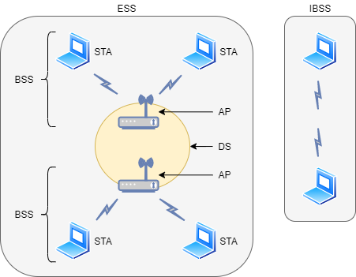

## WLAN 的拓扑结构
WLAN 的拓扑结构分为两种，一种是终端之间直接互连的`ad-hoc`模式，另一种是通过 AP 连接有线网络的基础设施模式。

`ad-hoc`模式，全称`ad-hoc mode`，即 IEEE802.11 无线网络的 BSS，在两台 STA 之间直接进行无线通信，而组成的网络，也叫做点对点的网络模式。通常是笔记本电脑和打印机进行无线连接或多台游戏机进行联机对战时使用。终端一般配置了无线网卡。这个模式下，终端是不能连接到互联网上的。

基础设施模式，全称`Infrastructure Mode`，是指 802.11 无线网络的 BSS 形式组网，通常是通过 AP 连接到互联网时使用。在这个模式下，除了有 STA 外，还需要有 AP 才能连接到互联网。

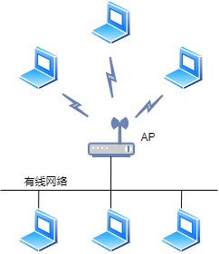

## AP
有线网络通过有线线缆把终端和交换机连接起来，组成网络。而无线网络的基础设施模式中，是通过一种叫做 AP 的设备，把多台终端连接到有线网络中。AP 也叫做接入点，接入点通常有 RJ-45 网络接口，用来连接到交换机或路由器上，从而让无线网络的终端能够访问有线网络或互联网。
## WLAN 标准
和以太网一样，WLAN 的标准也是由 IEEE 组织制定的。以太网标准统称为 IEEE 802.3，而 WLAN 标准统称为 802.11。

和 IEEE802.3 一样，IEEE802.11 在物理层和数据链路层之间也定义了 MAC 子层。定义了 WLAN 采用哪种频带和调制方式，传输速率达到多大等传输标准，还定义了安全性、QoS、管理等相关内容。

|        | 802.11  | 802.11b  | 802.11a  | 802.11g  | 802.11n        | 802.11ac  | 802.11ax       |
|--------|---------|----------|----------|----------|----------------|-----------|----------------|
| 名称     | WiFi0   | WiFi1    | WiFi2    | WiFi3    | WiFi4          | WiFi5     | WiFi6          |
| 发布时间   | 1997    | 1999     | 1999     | 2003     | 2009           | 2012      | 2018           |
| 频带     | 2.4GHz  | 2.4GHz   | 5GHz     | 2.4GHz   | 2.4GHz 5GHz | 5GHz      | 2.4GHz 5GHz |
| 非重叠信道  | 3       | 3        | 5        | 3        | 3+5            | 5         | 3+5            |
| 调制方式   | DSSS    | DSSS     | OFDM     | OFDM     | OFDM           | OFDM      | OFDMA          |
| 最大传输速率 | 2Mbit/s | 11Mbit/s | 54Mbit/s | 54Mbit/s | 600Mbit/s      | 6.9Gbit/s | 9.6Gbit/s      |

### IEEE 802.11n
`IEEE 802.11n`之前的标准已经不多见了。`IEEE 802.11n`，又叫做 WiFi 4，标准在 2009 年制定完成，最大传输速率是`600 Mbit/s`，使用 MIMO 多通道技术让传输速率大幅提升。也能向下兼容`IEEE 802.11a、IEEE 802.11b、IEEE 802.11g`。
### IEEE 802.11ac
`IEEE 802.11ac`，又叫做 WiFi 5，有两个版本，分别是：Wave 1、Wave 2。区别是 Wave 1 使用 80 Mhz 频宽和 SU-MIMO 技术，最大传输速率是`3.46 Gbit/s`。而 Wave 2 是使用 160 Mhz 频宽和 DL MU-MIMO 技术，最大传输速率是`6.93 Gbit/s`。频带和调制方式等都相同。
### IEEE 802.11ax
`IEEE 802.11ax`，又叫做 WiFi 6，标准在 2018 年制定完成，最大传输速率是`9.6 Gbit/s`。WiFi 6 同时支持 2.4G 和 5G 频段，完整涵盖低速与高速设备，覆盖范围更远。支持 WPA 3 安全协议，无线网络更安全。支持 TWT 技术，能够更省电。简单的说，就是速度更快、延时更低、容量更低、更安全、更省电。

## 什么是 WiFi
WiFi 是基于`IEEE 802.11`标准的、不同厂家为产品的品牌认证。既然有`IEEE 802.11`标准了，为什么还要有 WiFi 认证？这是因为`IEEE 802.11`正式标准推出的时间周期长，而无线网络发展迅猛，各个厂家等不及正式标准，自己组成了 WiFi 联盟，并完成互联互通的认证。

实际上，并不是每个`IEEE 802.11`产品都申请了 WiFi 联盟的认证，那么缺少 WiFi 认证的产品，并不一定兼容 WiFi 设备。但是经过 WiFi 认证的 STA 或 AP 都能无障碍的互联互通。

在酒店或公共场所中，经常看到“免费 WiFi 上网”的标识，这就表示这里的 AP 已经通过了 WiFi 认证。除了电脑和手机，家电和游戏机也可以完成 WiFi 认证。

WiFi 还定义了类似 WPA 这种无线加密的相关标准。

## WLAN 的功能
### 关联
使用 WLAN 的终端要通过 AP 完成无线连接，才能连接到互联网或有线网络。

无线终端连接 AP 的过程叫做关联（`Association`）。

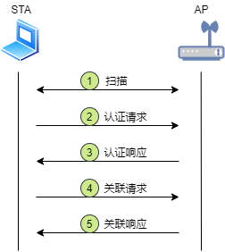

STA 可以连接不同的 AP，但同一时刻，只能连接在一个 AP 上。AP 会定期发送`beacon`帧，STA 根据`beacon`帧的内容，获取 AP 的 SSID 信息、支持的无线传输速率，以及无线信道等信息。

STA 在关联过程中，会向 AP 发送关联请求数据帧，AP 收到请求后，就向 STA 返回带有状态码的关联响应数据帧。

STA 会确认 AP 发过来的状态码，如果是`successful`，表示关联成功，如果返回其它信息，表示关联失败。STA 在收到`successful`的同时，还会分配一个`Association ID（AID）`的识别号。

WLAN 认证的过程，是在关联过程之前发生的。
## 数据帧
### 802.11数据帧的三大部分
MAC 首部，共 30 字节。帧的复杂性都在帧的首部。

帧主体，也就是帧的数据部分，不超过 2312 字节。这个数值比以太网的最大长度长很多。不过 802.11 帧的长度通常都小于 1500 字节。

帧检验序列 FCS 是尾部，共 4 字节。

### 802.11数据帧的字段

IEEE802.11 的 MAC 数据帧的字段说明：
* `Protocol Version`：协议版本，表示 IEEE802.11 协议的版本。
* `Type`：类型，表示数据帧的功能，有控制帧、管理帧、数据帧三种。
* `Subtype`：子类型，每种数据帧都有多个子类型，实现特定的功能。
* `To DS`和`From DS`：DS 是指分布式系统，用与 AP 和关联的 STA 之间传送的数据帧类型。值为 1 时，表示发送源是 AP，值为 0 时，表示发送源是 STA。
* `More Frag`：把上层分组进行分片后，进行发送时使用。值为 1 时，表示后续存在分片数据帧。值为 0 时，表示当前数据帧是最后的分片，或不存在分片数据帧。
* `Retry`：表示是否重发数据帧。值为 1 时，表示再次发送数据帧。值为 0 时，表示不再发送这个数据帧。
* `More Data`：表示是否存在后续发送的分组。值为 1 时，表示存在后续分组。
* `WEP`：表示是否进行 WEP 加密。值为 1 时，表示进行加密。
* `Order`：值为 1 时，表示数据帧严格按照`strictly ordered`（发送接收顺无法替换）的标准进行发送。

IEEE802.11 的数据帧可分为三类：
* 管理帧
	1、广播无线信号的`beacon`帧，默认情况下，每 100 毫秒 AP 广播一次。
	2、认证使用认证帧：AP 和 STA 进行信息交互时，使用的关联帧。
* 控制帧
* 数据帧

通常数据帧的`Address 1`表示目的地址，`Address 2`表示源地址，`Address 3`表示 BSSID 信息。
## 接入点的接入控制
由于无线电波是看不见的，会出现陌生用户在未经允许时，擅自接入 AP 使用的情况发生。只要在无线信号能够到达的范围内，并知道 SSID，STA 就能够和 AP 进行关联。为了防止未知的人使用，可以使用 ESSID 隐藏功能和 MAC 地址过滤功能。
### ESSID 隐藏
SSID 信息是由 AP 的`beacon`帧定期进行广播发送的。STA 通过`beacon`帧来确认和那个 SSID 进行连接。但是，只有是无线信号能够到达的地方，任何人都可以通过`beacon`帧，使用 STA 搜索到 SSID 信息并连接。

为了防范这类风险，可以使用不发出`beacon`帧的 ESSID 隐藏功能。STA 需要通过其它途径获得 SSID 信息，并在 STA 进行相应配置，从而隐藏网络连接。

但是，由于 SSID 在无线网络的传播中，没有加密，当有 STA 使用这个隐藏的 SSID 连接 AP 时，可以通过无线监控工具获取这个无线网络的 SSID，所以 ESSI 隐藏功能不是很安全的对策。

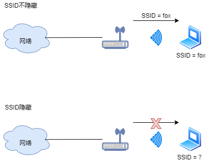

### MAC 地址过滤
在 AP 中设置允许关联的 MAC 地址列表，只有在列表里面的 STA 才能连上无线网络，防止以外的 STA 接入 AP，这个方法叫做 MAC 地址过滤或 MAC 地址认证。

除了在 AP 上设置外，还可以通过 RADIUS 服务器设置允许接入的 MAC 地址信息，在认证的同时完成 MAC 地址过滤。但是，MAC 地址也能通过工具伪装和冒充，可以对接入 WLAN 的 MAC 地址进行监听，获得具体的 MAC 地址信息，所以这也不是完善的安全策略。
## 接入点的认证
在 AP 上使用 ESSID 隐藏和 MAC 地址过滤功能，都不能完全阻止恶意访问，为了彻底防止恶意用户访问无线网络，需要进行认证。

IEEE 802.11 最开始有两种认证方式：开放系统认证、共享密钥认证。
### 开放系统认证
开发系统认证（`Open System Authentication`）不用 STA 输入用户名和密码等认证信息，就可以向 AP 发出认证请求。AP 能够接收所有接入认证请求，也就是说，无论是谁都可以和 AP 关联上。通常用于公共 WiFi，结合 Portal 认证或 VPN 来完成用户访问网络的权限控制。
###  共享密钥认证
共享密钥认证（`Shared Key Authentication`）用于 AP 和 STA 进行无线加密通信。使用 WEP 或 WPA 加密标准时，AP 和 STA 预先配置相同的口令，通过这个口令就可以建立无线通信链路。这个口令叫做预共享密钥（`pre-shared key`），不知道预共享密钥的 STA，是无法和 AP 进行关联的。
### IEEE 802.1X
IEEE 802.1X 是用户认证和访问控制协议，是从有线网络中引用过来的。

IEEE 802.1X 认证是由认证客户端、接入设备、认证服务器三部分组成。请求认证的终端叫做认证客户端，和终端连接的 AP、交换机及其它网络设备叫做接入设备。认证方式使用 EAP，客户端发起认证请求，接入设备会把收到的 EAP 消息封装成 RADIUS 数据帧，转发给认证服务器，当认证服务器完成认证后，接入设备会通知客户端并把客户端作为认证成功的客户端，之后客户端发送的数据帧都会转发到局域网或互联网上。

认证信息是使用用户名、口令、数字证书等其中一种方式即可，对应的认证协议有 EAP-MD5、EAP-TLS、EAP-TTLS 等各种类型。
## WLAN 通信的加密
空气中传输的无线电波，只要是在覆盖范围内，就能被任何人收到，再加上 WLAN 数据解析工具，恶意用户就能够窃听无线网络的通信内容。

为了防止无线通信被窃听和篡改，要在无线通信过程中，对信息进行加密。WLAN 加密有 WEP、WPA、WPA2、WPA3 等标准。
### WEP
WEP，全称`Wired Equivalent Privacy`，即有线等效保密。WEP 加密是最早在无线加密中使用的技术，基于 RC4 算法的密钥对数据进行加密，这个密钥叫做`WEP key`。

WEP 一共有三种加密方式：
* 40 bit 长度的密钥和 24 bit 长度的初始向量值组成 64 bit 长的加密方式
* 104 bit 长度的密钥和 24 bit 长度的初始向量值组成 128 bit 长的加密方式
* 128 bit 长度的密钥和 24 bit 长度的初始向量值组成 152 bit 长的加密方式

密钥长度越短，破解时间也越短，现在已经不怎么使用了。
### WPA
WEP 实在太脆弱了，于是就制定了 WPA，全称`WiFi Protected Access`，即 WiFi 保护接入。

WPA 把 SSID 和 WEP 密钥一起加密，并且能定期自动更新用户认证功能和密钥的 TKIP。

WPA 有两种模式：个人模式和企业模式。
* 个人模式的 WPA 主要是家庭和个人使用，也叫做 WPA-PSK，AP 和 STA 使用相同的预共享密钥（PSK）。
* 企业模式的 WPA 主要用于企业，增加了 IEEE 802.1X 认证服务器，不同的用户使用不同的用户名和密码连接无线网络。

| 名称   | WEP                 | WPA        |
|------|---------------------|------------|
| 密钥长度 | 40bit或104bit或128bit | 128bit     |
| 初始向量 | 24bit               | 48bit      |
| 密钥更新 | 无                   | 有          |
| 加密算法 | RC4                 | RC4        |
| 防篡改  | 无                   | 通过MIC机制防篡改 |

### WPA2
WPA2 是新一代 WPA 标准，采用 AES 加密算法。AES 常用于 IPsec 和 SSL 等协议中，比 RC4 的安全性更高。AES 支持长度是 128 bit、196 bit、256 bit 的密钥，WPA2 使用其中的 128 bit 长度类型。WPA2 兼容上一代 WPA，支持 WPA2 的设备和只支持 WPA 的设备也能通信。AES 采用了类似 TKIP 的协议 CCMP，其中 CBC-MAC 是密码段连接/消息认证码的意思。

AP 的加密设置可以选择 WPA-PSK（TKIP）、WPA-PSK（AES）、WPA2-PSK（TKIP）或 WPA2-PSK（AES）。
### WPA3
2017 年 10 月，802.11 协议中沿用 13 年的 WPA2 加密被完全破解。2018 年 6 月 26 日，WiFi 联盟宣布 WPA3 协议已最终完成，这是 WiFi 连接的新标准。

WPA3 在 WPA2 的基础上增加了新的功能，以简化 WiFi 安全保障方法、实现更可靠的身份验证，提高数据加密强度。所有的 WPA3 网络都必须进行管理帧保护 PMF，保证数据的安全性。

根据 WiFi 网络的用途和安全需求的不同，WPA3 又分为 WPA3 个人版、WPA3 企业版，即 WPA3-SAE 和 WPA3-802.1X。WPA3 为不同网络提供了额外功能：WPA3 个人版增强了对密码安全的保护，而 WPA3 企业版的用户可以选择更高级的安全协议，保护敏感数据。
#### WPA3 个人版
对比 WPA2 个人版，WPA3 个人版能提供更可靠的基于密码的身份验证。这是由于 WPA3 个人版使用了更安全的协议：对等实体同时验证 SAE（`Simultaneous Authentication of Equals`）。SAE 取代了 WPA2 个人版的 PSK 认证方式，可以有效地抵御离线字典攻击，增加暴力破解的难度。SAE 能够提供前向保密，即使攻击者知道了网络中的密码，也不能解密获取到的流量，大大提升了 WPA3 个人网络的安全。WPA3 个人版只支持 AES 加密方式。

SAE 在 WPA/WPA2-PSK 原有的四次握手前增加了 SAE 握手，实质上是为了动态协商成对主密钥 PMK。WPA/WPA2-PSK 的 PMK 只与 SSID 和预共享密钥有关，而 SAE 引入了动态随机变量，每次协商的 PMK 都是不同的，提升了安全性。

#### WPA3 企业版
企业、政府和金融机构为了更高的安全性可以采用 WPA3 企业版。WPA3 企业版基于 WPA2 企业版，提供一种可选模式：`WPA3-Enterprise 192bit`，这个模式的优点有：

数据保护：使用 192 位的`Suite-B`安全套件，增加密钥的长度。

密钥保护：使用`HMAC-SHA-384`在 4 次握手阶段导出密钥。

流量保护：使用伽罗瓦计数器模式协议 GCMP-256（`Galois Counter Mode Protocol`）保护用户上线后的无线流量。

管理帧保护：使用 GMAC-256（GCMP 的伽罗瓦消息认证码，`Galois Message Authentication Code`）保护组播管理帧。

WPA2 企业版支持多种 EAP 方式的身份验证，但是 WPA3 企业版仅支持 EAP-TLS 的方式。

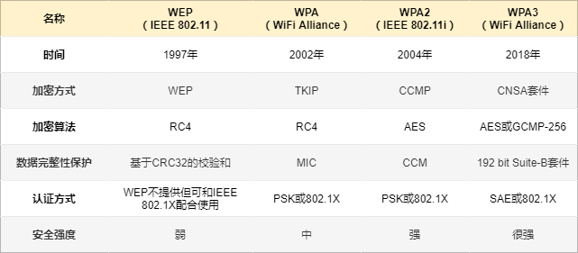

## 胖AP
能够自行进行无线控制和安全管理功能的 AP 叫做胖 AP（FAT AP）。通过一台或多台 AP 搭建无线网络时，常使用胖 AP，配置简单，费用低廉。有多台 AP 的网络环境中，如果想修改安全策略等参数时，就需要一台一台的配置。

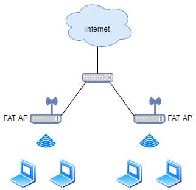

## 瘦 AP
在大规模办公区部署无线网络时，需要管理的 AP 数量非常庞大，不适合单台 AP 单独管理。这种情况下，AP 只保留最基本的配置，安全策略等参数就通过无线控制器进行统一配置和管理，这类 AP 就叫做瘦 AP（FIT AP）。AP 支持 CAPWAP，就可以通过这个协议连接到无线控制器，AP 只需要完成 MAC 管理和数据帧控制，认证和安全等功能全部交给无线控制。

## 无线桥接
在无法布线的楼宇之间、在物理位置较远的站点之间，可以通过无线桥接进行无线连接。无线桥接是通过无线上连，有线下连的方式组网。

在通信距离较长时，需要使用定向天线来增强某个特定方向的电波强度。

## 无线中继
AP 上连无线接口当做 STA，连接其它 AP 释放的 SSID。AP 下连无线接口释放相同的 SSID，让 STA 接入，这就是无线中继。通过连接中继器，将 STA 收到的数据转发给拥有相同 SSID 的 AP，就能扩大无线网络的范围。一级中继器连接后，网络吞吐率会减半。

## 无线网络的最大速率
无线网络和有线网络都是有理论的最大速率，比如：常见的以太网的 10Gbit/s 和 WiFi6 的 9.6Gbit/s，这些是说在进行数据通信时，传输的极限速率。

由于无线网络中使用了 CSMA/CA 的冲突回避协议，数据在发送时有等待的时间。因此，WiFi6 的最大理论速率是 9.6Gbit/s，实际使用时最大速度可能不到 80%。
## 无线网络的速率跟距离有关吗？
STA 能够进行通信的最大距离半径叫做覆盖范围。根据 STA 和 AP 的距离不同，最大速率也会不同，离 AP 越远，通信延迟越大，数据传输速率也越低。在没有障碍物时，无线网络的覆盖范围是同心圆的形状分布。

## WiFi5
WiFi5，也就是 802.11ac 标准。对比 802.11n，WiFi5 主要有四个方面的提升：更宽的频宽绑定、更多的空间流、更先进的调制技术、更灵活的 MIMO 机制。

信道绑定：802.11n 引入了信道绑定技术，是把两个 20MHz 的信道捆绑在一起。而 WiFi5 能够支持 160MHz 的信道，也就是绑定了 8 个信道。如果 802.11a/b/g 是单车道的话，而 802.11n 就是双车道，到 WiFi5 就达到八车道。

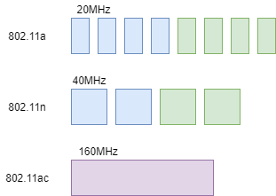

八条数据流：WiFi 5 沿用了 802.11n 的 MIMO 技术，采用多天线技术，可以不消耗更多带宽和不增加传输功耗的前提下，增加数据吞吐量。更多的天线设计，可以把数据分散到多天线上，让每 Hz 传输的数据更多，还增加了可靠性。如果说信道绑定是增加了一条马路的车道数量，那么 MIMO 技术就是增加马路的数量，大大提升了马路承载能力，可以通过更多的车流量。

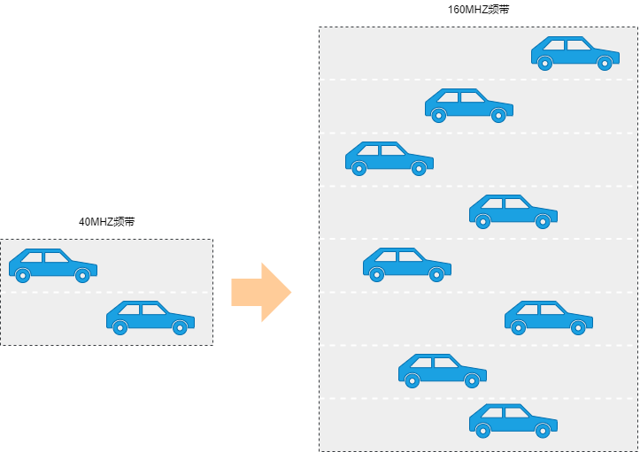

256QAM 调制技术：在信号调制方面，802.11n 是采用 64QAM，而 WiFi5 则达到了 256QAM。QAM 发射信号集一般用星座图表示，每一个星座点对应一个信号，星座点数越多，传输的信息量就越大，常见的形式有 16QAM、64QAM、256QAM，WiFi 5 协议标准采用的是 256QAM，所以单载波承载的数据量可以达到 8bit，而 802.11n只能达到 6bit。

多用户 MIMO（MU-MIMO）：多用户 MIMO 技术可以提高单个AP无线接入的终端数，缓解高密部署的问题。802.11n 技术中，同一时间 MIMO 只允许单用户使用，而 WiFi5 可以支持多用户 MIMO，这意味着单个 802.11ac 的 AP 可以向两个或多个设备传送不同的数据流。WiFi5 计算最大速率时，使用 160MHz 模式、256-QAM 调制方式、400ns 的保护间隔时长，WiFi5 单条流速率可达 866.7 Mbit/s，八条流速率高达 6.9Gbit/s。
## WiFi6
WiFi6，其实就是`802.11ax`标准。对比 WiFi5，WiFi6 的提升是更完整的频带覆盖、更高阶的调制方式、更全面的 MU-MIMO、引入 OFDMA 技术、新增 TWT 机制。

同时支持`2.4GHz`和`5GHz`频段：WiFi5 只支持 5G 频段，虽然 5G 的频段资源丰富，但穿透力差，在信号覆盖较弱。而 WiFi6 同时支持`2.4GHz`和`5GHz`频段，`2.4G`信号覆盖效果更好，完整涵盖低速与高速设备。

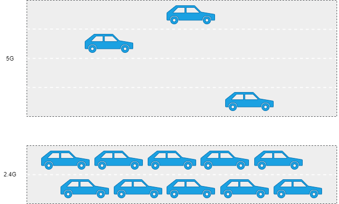

高阶调试方式：WiFi6 支持 1024-QAM，高于 WiFi5 的 256-QAM，单载波承载的数据量可以达到 10bit，意味着更高的数据传输速率。

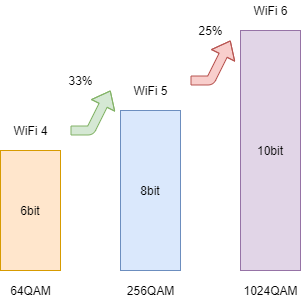

完整 MU-MIMO：WiFi 5 引入 MU-MIMO 功能，但是支持数据下载，上传数据时还是走得 SU-MIMO。而 WiFi6 是完整版的 MU-MIMO 功能，支持数据上行和下行。8 × 8 MU-MIMO，表示最多可以同时支持八个终端传输数据。虽然 AP 可以接入多个终端，但是没使用 MU-MIMO 技术之前，都是一个接着一个收发数据的，AP 每次只能和一个终端传输数据，只是时间间隔是毫秒级，我们无法感知而已。WiFi 6 就是真正意义上的八个终端同时传输数据了，适用于高密的无线网络场景。

OFDMA 技术：WiFi6 在在 OFDM 的基础上加入多址（即多用户）技术，从而演进成 OFDMA。实际上 OFDMA 将帧结构重新设计，细分成若干资源单元，为多个用户服务。

以 20MHz 信道为例，在 OFDM 方案（即 WiFi 4/WiFi 5）里每一帧由 52 个数据子载波组成，但由于这一帧只为一个终端服务。传输的数据包太小时（像聊天记录）。空载的子载波也无法分配给其他终端。

而在 OFDMA 方案（即 WiFi 6）里每一帧由 234 个数据子载波组成，每 26 个子载波定义为一个 RU（资源单元），每个 RU 可以为一个终端服务，简单除一下，每一帧就可以被分成 9 份，最多可以同时为 9 个用户服务。

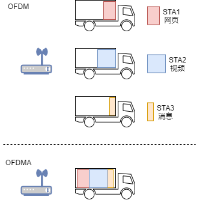

用卡车来货来解释这个技术最方便直观了。OFDM 技术是为每一个客户发一次货车。不管货物多少，来一单发一趟，这样不免就有货车空载的现象。而 OFDMA 技术会将多个订单合在一起发货，让卡车尽量满载上路，使得运输效率大大提升。

不但如此，WiFi6 下 OFDMA 和 MU-MIMO 的效果可以叠加。两者呈现出一种互补关系，OFDMA 适用于小数据包的并行传输提高信道利用率和传输效率。而 MU-MIMO 则适用于大数据包的并行传输，提高单用户的有效带宽，同样能减少时延。

TWT机制：WiFi 6 加入了 TWT 机制（`Target Wake Time`）。TWT 机制是专门针对类似智能家居这样的低速设备而设置的。例如配置 2.4GHz 频段、20MHz 频带的 WiFi 终端。AP 会自动生成一个数据交换用的唤醒时间，在网络数据传输不高的时段，依次唤醒这些低速设备进行数据交换，比如下载最新数据库、上传生成数据等操作。这样慢速设备不再长时间占用带宽，可以有效避免网络拥堵。这也是一种优化网络带宽利用率的技术手段。

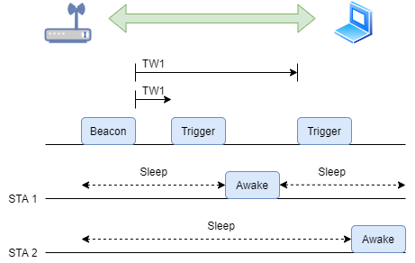

WiFi 6 计算最大速率时，使用 160MHz 模式、1024-QAM 调制方式、800ns 的保护间隔时长，WiFi 6 单条流速率可达 1.2 Gbit/s，八条流速率高达 9.6Gbit/s。

## WLAN 的信道
WLAN 标准中，使用`2.4GHz`和`5GHz`频带，各个频带都有多条信道。在设置 AP 时，为了防止干扰，需要把相同信道的 AP 隔离开来。

### 2.4G 信道
WLAN 的 2.4G 信道频宽是`83.5MHz`，频率范围是`2.4~2.4835 GHz`，实际一共划分了 14 个信道，中国是使用前面的 13 个信道，信道编号是`1~13`。每个信道的有效宽度是`20 MHz`，另外还有`2MHz`的强制隔离频带，类似公路上的隔离带。对于中心频率是`2412MHz`的信道 1，频率范围是`2401~2423 MHz`。

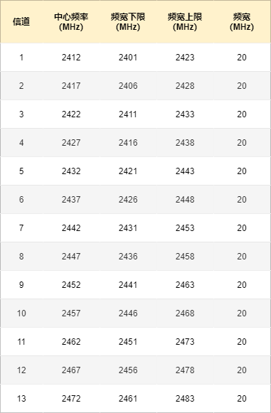

但并不是说，只要选择数字不同的信道，就一定不会发生干扰。信道 1 使用的频率和 信道`2~5`是有一部分的重合，因此还是会发生干扰。这样看来，肯定不会发生干扰的信道组合是 1、6、11。

### 5G 信道
WLAN 的 5G 信道频宽资源就丰富些，一共是`700MHz`的频宽，频率范围是`5.15~5.85 GHz`，中国一共有 13 个`20MHz`信道，信道编号是 36、40、44、48、52、56、60、64、149、153、157、161、165，并且所有信道都是互不干扰的，可以直接使用。

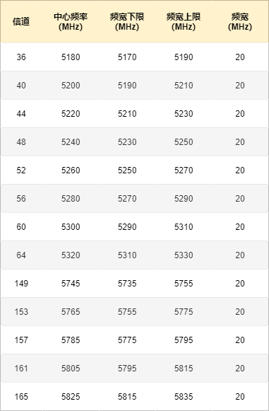

从`802.11n`开始，可以同时使用相邻的信道，组成`40MHz、80MHz、160MHz`的频宽进行数据传输。

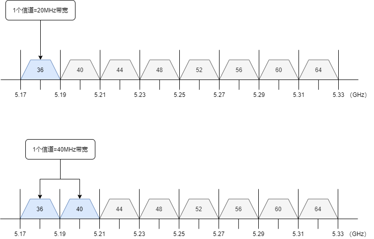

