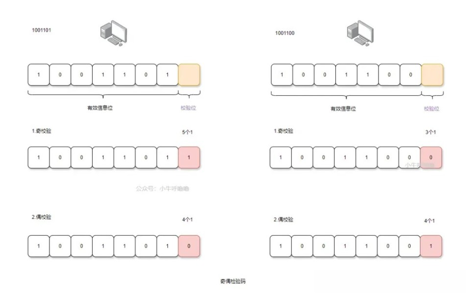
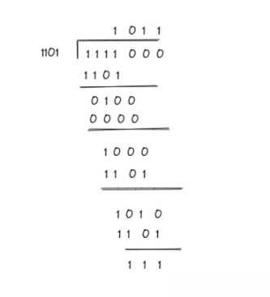
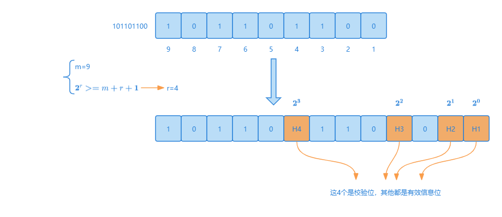
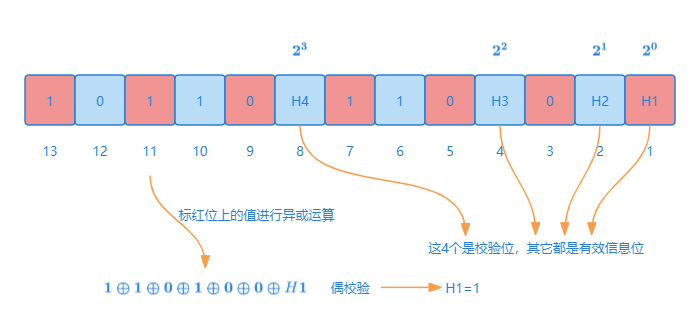
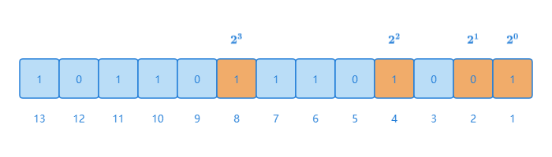
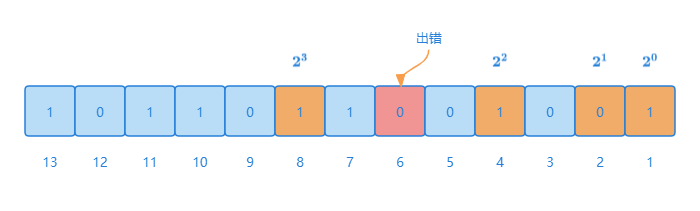

差错检测的方式有多种，常见的有奇偶校验、海明码、CRC 校验等。他们的工作原理都是发送端对数据按照某种算法计算出来校验码，将校验码和数据一起发送到接收端，然后接收端进行检验确定数据是否发生变化。
## 奇偶校验码
奇偶校验码，在需要传输的一串二进制数据(有效信息位)中，添加一位冗余码(校验位)，即奇偶校验码=有效信息位+校验位。

具体可分为，奇校验和偶校验：
* 奇校验：整个校验码（有效信息位和校验位）中 1 的个数为奇数
* 偶校验：整个校验码（有效信息位和校验位）中 1 的个数为偶数

比如现在有 8 比特的数据，其中 7 位是有效信息位，还有 1 位是校验位，校验位在最高位还是最低位都可以，这里以在最低位为例：



我们可以发现：
* 奇校验就是校验有效信息位+校验位中，1 的个数是否是奇数
* 偶校验就是校验有效信息位+校验位中，1 的个数是否是偶数

我们人类可以直接通过数 1 的个数来分辨，但对于计算机来说，利用异或运算就能直接判断 1 的个数。
:::info
异或运算，简单来说就是 ab 两个值，如果相同的话为 0，不同的话则为 1。异或的数学符号为“⊕”，计算机符号为“xor”
:::
当传输过程中，只要有 1 位数据发生了变化，此时奇偶校验码中 1 的个数就会发生奇偶转换，也就能够检测到出错，但并不能纠错，因为无法确认哪一位出问题了，即有检错能力无纠错能力。

另外如果是 2 位出现了误码，可能会出现奇偶校验码中的 1 的个数，并没有发生奇偶转换，那么会误以为还是正常的。

奇偶校验只能检 1 位错，并且无纠错能力，但其也有优点，比如开销足够小，常用于校验 1 字节长(8 位)的数据，因为 1 字节长的数据如果出问题，大概率是 1 位出问题，2 位及其以上出错的概率较低。一般用于储存器读写和网络通讯传输数据等场景。
## 循环冗余校验码
循环冗余校验码，简称 CRC，是一种根据网络数据包或计算机文件等数据产生简短固定位数校验码的一种信道编码技术，主要用来检测或校验数据传输或者保存后可能出现的错误。

CRC 通过某种数学运算来建立数据位和校验位的约定关系，它的基本思想：
1. 发送端和接收端双方约好一个生成多项式，用`G(X)`来代称
2. 发送端基于有效信息数据和生成多项式`G(X)`相除，计算出余数(差错检测码)，再将差错检测码拼在有效信息数据后，作为发送数据
3. 接收端接受到的数据除以生成多项式`G(X)`，可以除尽则编码正确；若有余数，则余数指明出错位所在的位置

### 模二算术运算
上面我们 CRC 中的除法是模二除法，所谓模二算术运算，与四则运算相同，模二运算也包括模二加、模二减、模二乘、模二除这四种二进制运算；与四则运算不同的是模二运算不考虑进位和借位。
* 模二加法：`0+0=0，0+1=1，1+0=1，1+1=0`（相同为 0，相异为 1，类似于异或）
* 模二减法：`0-0=0，0-1=1，1-0=1，1-1=0`（相同为 0，相异为 1，类似于异或）
* 模二乘法：`0x0=0，0x1=0，1x0=0，1x1=1`（有 0 结果 0，与普通四则运算里的乘法一样，唯一的区别是，模二乘法在部分积相加时按模二加，模二除法部分余数相减时按模二减）
* 模二除法：是模二乘法的逆运算，也是我们重点需要理解的，我们这里直接举个例子(二进制)：


`1111000/1101=1011`余`111`，其实我们可以发现模二除法计算过程中，主要用到了模二乘法和模二减法。

模二除法与 CRC 算法密切相关，如果某一步被除数最高位为 1，则可除，即对应位商为 1；当最后余数的位数小于除数位数时，除法停止；当被除数的位数小于除数位数时，则商数为 0，被除数就是余数。

### 生成多项式
需要注意的是，我们上面所说的生成多项式其实是常数。

一个`r`位的二进制常数可以用`r-1`次的生成多项式表示，比如`G=1101`，其`G(x)=x^3+x^2+1`。
### 通过例子体会CRC
我们这里再举一个例子，比如有效信息数据`1111`和生成多项式`G(x)=x^3+x^2+1`。

发送端：
* 约定的常数`G=1101`，有 4 位
* 有效信息数据左移 (4-1)(多项式的最高次幂) 位，同时右侧补 0，得`1111000`
* `1111000`与`1101`做模二除法，得余数`111`，如果余数不足 3 位，在前面补 0
* 将余数加(模二加法)到有效信息数据后，得`1111111=1111000 + 111`

接收端：接收到的数据`1111111/1101`，若余数为 0，则数据正确。

CRC 校验码如果任意一位发生错误(前提不是差错检测码部分出错)，则都会得到一个确定的余数，那么当选择合适的生成多项式时，会使得余数各不相同，所以能进行 1 位纠错，但纠错能力较为有限。

但 CRC 是目前计算机通信领域最为普遍的校验方式，因为 CRC 校验码的检错能力极强，且检测成本较低，如果发现错误，直接触发网络数据表重传机制，对通信效率和安全提供了保障。

因此在网络通讯、编码器和电路的检测等领域使用较为广泛。在检错的正确率与速度、成本等方面，都比奇偶校验等校验方式具有优势。
:::info
在标准的以太帧格式中，最后有 4 个字节长度的冗余位，用于存储 CRC 校验的值，这个冗余位又常称为帧检验序列`FCS(Frame Check Sequence)`。
:::
## 海明校验码
海明码，由 Richard Hamming 于 1950 年提出，其实际上就是多重奇偶校验码，用于数据的校验与纠正。

其原理是在有效信息位中加入多个校验位形成海明码，将海明码中的每一位分组，进行奇偶校验；如果某一位出问题，会及时检错，并且校验位还能标注出错的位置。

比如我们接下来以`101101100`为例，来写出偶校验的海明码，来全面讲解海明码的具体原理与纠错实现。
### 确认校验位位数
首先就是要加入多个校验位，怎么确认其位数？

假设校验码有`n`位(也被称为编码字)，有效信息位有`m`位，校验位有`r`位。我们可以知道校验位的状态有 $2^r - 1$ 个状态，要想校验位能够区分整个校验码是否正确，校验位的状态的个数要足够覆盖有效信息位加上校验位本身，因为校验位也有可能出错，那么就有 $2^r - 1>=m+r$，即 $2^r >=m+r+1$。

常见的数据位和校验位之间的位数关系：

| 数据位位数m | 校验位位数r | 校验位占比 |
|:------:|:------:|:-----:|
|   4    |   3    | 0.75  |
|   8    |   4    | 0.50  |
|   16   |   5    | 0.31  |
|   32   |   6    | 0.18  |
|   64   |   7    | 0.11  |

我们再来看看`101101100`，其`m=9`，由公式 $2^r >=m+r+1$，可得`r=4`，所以 `n=m+r=13`。

再补充一个概念，码距，两个合法码字对应位上数字的不同位的个数 
* 00 和 01，其码距为 1，00 和 11 其码距为 2
* 一般来说，码距越大，其检测错误的位数越大，纠正错误的位数也越大(当码距不小于 2 的数据校验码，开始具有检错的能力)，另外纠错能力恒小于等于检错能力

### 确认校验位分布
海明码规定，校验位在校验码中的位置，是 2 的整数幂处，即 $2^0$、$2^1$、$2^2$......



### 计算各校验位的值
我们接着把检验码中，各有效信息位都转化成校验位累加关系，实质是校验位的状态能够覆盖整个校验码的各位，如下：
```text
1=1
2=2
3=1+2
4=4
5=1+4
6=2+4
7=1+2+4
8=8
9=1+8
10=2+8
11=1+2+8
12=4+8
13=1+4+8
```
上述各位的表达式，可能不够清晰，我们可以再通过表格来将上述表达式，重新排版一下：

| 索引号 | H4($2^3$)  8 | H3($2^2$)  4 | H2($2^1$)  2 | H1($2^0$)  1 |
|-----|--------------|--------------|--------------|--------------|
| 3   |              |              | [x]          | [x]          |
| 5   |              | [x]          |              | [x]          |
| 6   |              | [x]          | [x]          |              |
| 7   |              | [x]          | [x]          | [x]          |
| 9   | [x]          |              |              | [x]          |
| 10  | [x]          |              | [x]          |              |
| 11  | [x]          |              | [x]          | [x]          |
| 12  | [x]          | [x]          |              |              |
| 13  | [x]          | [x]          |              | [x]          |

我们把校验位单独拎出来，当列名，其他有效信息位当行号：
* 横向看，每一位有效信息位，可以被哪几个校验位覆盖(控制)
* 纵向看，将有效信息位以校验位为基准，进行分组校验(奇偶检验)

举个例子，我们来求解一下`H1`校验位的值`H1`这个组，有效消息位索引是 3、5、7、9、11、13 的值，然后加上`H1`这个校验位，`1⊕1⊕0⊕1⊕0⊕0⊕H1`需要满足偶校验的标准，所以`H1`位的值=1



同理可得`H2=0,H3=1,H4=1`。
```text
1⊕1⊕1⊕1⊕0⊕H2=0 ->H2=0
1⊕0⊕1⊕1⊕0⊕H3=0 ->H3=1
1⊕0⊕1⊕1⊕0⊕H4=0 ->H4=1
```
最后我们可以得到最终的偶校验的海明码：



### 假如第6位报错，如何检错纠错？
假设由于网络波动，电压变化等各种原因，导致第 6 位(最终的海明码)出错，其值变为 0，我们来看看海明码如何检错和纠错？



* `H1`分组校验：`1⊕1⊕0⊕1⊕0⊕0⊕1=0`(从高位到低位)，偶校验通过
* `H2`分组校验：`1⊕1⊕1⊕0⊕0⊕0=1`，偶校验不通过
* `H3`分组校验：`1⊕0⊕1⊕0⊕0⊕1=1`，偶校验不通过
* `H4`分组校验：`1⊕0⊕1⊕1⊕0⊕1`，偶校验通过

所以我们可以很轻易地知道`H2`和`H3`组中有问题，取二者交集，索引 6、7 两位最有可能出错；然后又因为`H1`校验位已经校验过索引 7，所以最终索引 6 出错，其值应该被纠正为 1。


| 索引号 | H4($2^3$)  8 | H3($2^2$)  4 | H2($2^1$)  2 | H1($2^0$)  1 |
|-----|--------------|--------------|--------------|--------------|
| 3   |              |              | [x]          | [x]          |
| 5   |              | [x]          |              | [x]          |
| 6   |              | [x]          | [x]          |              |
| 7   |              | [x]          | [x]          | [x]          |
| 9   | [x]          |              |              | [x]          |
| 10  | [x]          |              | [x]          |              |
| 11  | [x]          |              | [x]          | [x]          |
| 12  | [x]          | [x]          |              |              |
| 13  | [x]          | [x]          |              | [x]          |

但如果 2 位发生错误，6、7 位同时发生错误，`H1、H2、H3`分组校验不通过，不知道错误在哪个位置，但可以知道数据有误。所以海明码具有 1 位纠错能力，2 位检错能力。

当然我们可以提升其检错和纠错能力，加入的奇偶校验位的数目越多，错误检错和纠错能力随之提升，但代价是成本也随之更高。
