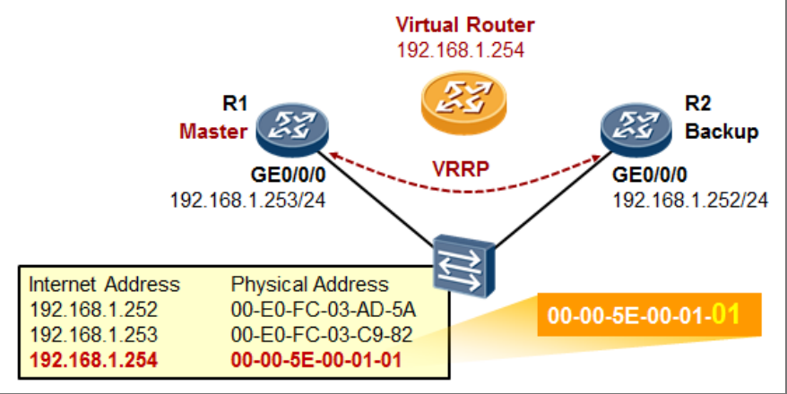

## VRRP


在上图中，LAN 内有两台路由器，这两台路由器可以通过 VRRP 协议为 LAN 内的 PC 提供冗余网关。R1 的`GE0/0/0`口及 R2 的`GE0/0/0`都连接到了一台二层交换机上， IP 地址分别是`192.168.1.253`及`192.168.1.252`，此刻它们属于一个广播域。

现在我们在 R1 的`GE0/0/0`口及 R2 的`GE0/0/0`口上激活 VRRP，将这两个接口放到一个 VRRP 组中，VRRP 将产生一台虚拟路由器，这台虚拟路由器的 IP 地址为`192.168.1.254`。LAN 内的 PC 将自己的网关都指向这个虚拟路由器的 IP 地址。VRRP 来决定该组中 R1 还是 R2 来响应 PC 发往`192.168.1.254`的数据请求。

当 PC 要访问外网时，首先会发送 ARP 报文去请求网关`192.168.1.254`的 MAC 地址，这时候由 VRRP 的`Master`路由器来回应这个 ARP 请求，同时承担数据转发任务。于此同时 R1 的`GE0/0/0`口仍然在以一定的周期发送 VRRP 报文以便向`Backup`路由器通告自己的存活状态。


当`Master`路由器 R1 挂掉时，或者 R1 的上行接口发生故障时，VRRP 都有相应的机制能够检测到，这时 R2 就会从`Backup`状态切换到`Master`状态，并接替 R1 之前的工作。此时 PC 向`192.168.1.254`发送的 ARP 请求，以及上行业务数据转发就由 R2 处理。值得注意的是，整个切换过程 PC 端无需做任何配置变更。

### VRRP术语
* VRRP 路由器：运行 VRRP 的路由器。一台 VRRP 路由器（的接口）可以同时参与到多个 VRRP 组中，在不同的组中，一台 VRRP 路由器可以充当不同的角色。
* VRRP 组：一个 VRRP 组由多个 VRRP 路由器组成，属于同一 VRRP 组的 VRRP 路由器互相交换信息，每一个 VRRP 组中只能有一个`Master`。同属一个 VRRP 组的路由器（的接口）使用相同的 VRID。同属一个 VRRP 组的路由器之间交互 VRRP 报文，这些路由器必须处于相同的广播域中。
* 虚拟路由器：对于每一个 VRRP 组，抽象出来的一个逻辑路由器，该路由器充当网络用户的网关，该路由器并非真实存在，事实上对于用户而言，只需知道虚拟路由器的 IP 地址，至于虚拟路由器的角色由谁来承担、数据转发任务由谁来承担、`Master`挂掉之后谁来接替，这是 VRRP 的工作。
* 虚拟 IP 地址、虚拟 MAC 地址：虚拟 IP 地址是虚拟路由器的 IP 地址，该地址一般就是用户的网关地址。与虚拟 IP 地址对应的 MAC 地址也是虚拟的，该 MAC 地址由固定比特位加上 VRID 构成，当 PC 发送 ARP 报文去请求虚拟 IP 地址对应的 MAC 地址时，`Master`路由器响应这个 ARP 请求并告知虚拟 MAC 地址。
* `Master`路由器、`Backup`路由器：`Master`路由器就是在 VRRP 组中的主路由器，它是实际转发业务数据包的路由器，在每一个 VRRP 组中，仅有`Master`才会响应对虚拟 IP 地址的 ARP 请求，也只有`Master`才会转发业务数据。
  `Master`路由器以一定的时间间隔发送 VRRP 报文，以便通知`Backup`路由器自己的存活。
  `Backup`路由器是在 VRRP 组中备份状态的路由器，一旦`Master`路由器出现故障，`Backup`路由器就开始接替工作。
* 选举依据：先比较接口 VRRP 优先级（越大越优先，默认为 100），如果优先级相等则比接口 IP 地址（IP 地址最大的胜出）。



通过 VRRP 形成的虚拟路由器使用虚拟 IP 地址和虚拟 MAC 与网络中的 PC 进行通信。虚拟 MAC 地址的格式如上图所示，其中 MAC 地址的最后 1 个字节填充 VRID，例如 VRID 是 1，虚拟MAC地址为`00-00-5E-00-01-01`。
## 基础配置
### 基础实验


如上图所示，R1、R2 及 PC 连接在同一台二层交换机上。R1 及 R2 将在`GE0/0/0`接口上运行 VRRP，实现网关冗余。要求在正常情况下 R1 为`Master`，当 R1 挂掉时，R2 能够成为`Master`。
```shell
[R1]interface GigabitEthernet 0/0/0
[R1-GigabitEthernet0/0/0]ip address 192.168.1.253 24
[R1-GigabitEthernet0/0/0]vrrp ?
  arp       Gratuitous arp
  un-check  Uncheck VRRP packet TTL value
  vrid      Specify virtual router identifier
[R1-GigabitEthernet0/0/0]vrrp vrid 1 ?
  authentication-mode  Specify password and authentication mode
  preempt-mode         Specify preempt mode
  priority             Specify priority
  timer                Specify timer
  track                Specify the track configuration
  version-3            Specify the device to support V3 for VRRP
  virtual-ip           Specify virtual IP address
# 接口激活VRRP，加入VRRP组（VRID为1），并且虚拟IP为192.168.1.254
[R1-GigabitEthernet0/0/0]vrrp vrid 1 virtual-ip 192.168.1.254
# 该接口在该VRRP组中的优先级为120（优先级值默认为100）
[R1-GigabitEthernet0/0/0]vrrp vrid 1 priority 120
[R1-GigabitEthernet0/0/0]vrrp vrid 1 preempt-mode ?
  disable  Cancel current configuration
  timer    Specify timer
[R1-GigabitEthernet0/0/0]vrrp vrid 1 preempt-mode timer ?
  delay  Specify interval of delay
[R1-GigabitEthernet0/0/0]vrrp vrid 1 preempt-mode timer delay ?
  INTEGER<0-3600>  Value of timer, in seconds(default is 0)
# 配置虚拟路由器的抢占时间为20s，抢占时间是指当主设备因为故障修复重新切换为主状态时等待的时间
[R1-GigabitEthernet0/0/0]vrrp vrid 1 preempt-mode timer delay 20
```
```shell
[R2]interface GigabitEthernet 0/0/0
[R2-GigabitEthernet0/0/0]ip address 192.168.1.252 24
[R2-GigabitEthernet0/0/0]vrrp vrid 1 virtual-ip 192.168.1.254
```
需注意，由于 R1 与 R2 的`GE0/0/0`接口工作在同一个 VRRP 组，因此双方配置的 VRID 必须相同。

完成配置后，在 R1、R2 上进行查看：
```shell
[R1]display vrrp
  GigabitEthernet0/0/0 | Virtual Router 1  # VRID
    State : Master  # 接口在该VRRP组中的状态
    Virtual IP : 192.168.1.254
    Master IP : 192.168.1.253
    PriorityRun : 120  # 接口在该VRRP组中的优先级
    PriorityConfig : 120
    MasterPriority : 120
    Preempt : YES   Delay Time : 20 s  # 开启抢占，且接口在该VRRP组中的抢占时间为20s
    TimerRun : 1 s
    TimerConfig : 1 s
    Auth type : NONE
    Virtual MAC : 0000-5e00-0101
    Check TTL : YES
    Config type : normal-vrrp
    Backup-forward : disabled
    Create time : 2025-05-12 11:53:19 UTC-08:00
    Last change time : 2025-05-12 11:53:23 UTC-08:00

[R1]display vrrp brief 
Total:1     Master:1     Backup:0     Non-active:0      
VRID  State        Interface                Type     Virtual IP     
----------------------------------------------------------------
1     Master       GE0/0/0                  Normal   192.168.1.254 
```
```shell
[R2]display vrrp
  GigabitEthernet0/0/0 | Virtual Router 1
    State : Backup
    Virtual IP : 192.168.1.254
    Master IP : 192.168.1.253
    PriorityRun : 100
    PriorityConfig : 100
    MasterPriority : 120
    Preempt : YES   Delay Time : 0 s
    TimerRun : 1 s
    TimerConfig : 1 s
    Auth type : NONE
    Virtual MAC : 0000-5e00-0101
    Check TTL : YES
    Config type : normal-vrrp
    Backup-forward : disabled
    Create time : 2025-05-12 11:58:21 UTC-08:00
    Last change time : 2025-05-12 11:58:21 UTC-08:00

[R2]display vrrp brief 
Total:1     Master:0     Backup:1     Non-active:0      
VRID  State        Interface                Type     Virtual IP     
----------------------------------------------------------------
1     Backup       GE0/0/0                  Normal   192.168.1.254  
```
### track接口状态


`Backup`路由器会不断侦听`Master`发出来的 VRRP 报文以便判断它的存活状态，当`Master`路由器发生故障时，`Backup`路由器能够感知并且进行切换。但是如果`Master`路由器没有发生整机故障，而只是其上行接口故障了呢？例如上图中，R1 作为`Master`路由器，如果其`GE0/0/1`口`DOWN`掉了，那么用户的上行流量被引导到 R1 后，将会被丢弃。

VRRP 有一个特性可以解决这个问题：通过在 R1 上部署`VRRP track`，使其能够跟踪`GE0/0/1`的状态，如果`GE0/0/1`的物理状态或者协议状态变为`Down`，那么 R1 就会主动将自己的`GE0/0/0`接口 VRRP 优先级减去一个值，从而使得 R2 的优先级值更大、优先级更高，那么 R2 将成为新的`Master`，R1 则成为`Backup`，用户发往默认网关的上行流量便会被引导到 R2。
```shell
[R1]interface GigabitEthernet 0/0/0
[R1-GigabitEthernet0/0/0]ip address 192.168.1.253 24
[R1-GigabitEthernet0/0/0]vrrp vrid 1 virtual-ip 192.168.1.254
[R1-GigabitEthernet0/0/0]vrrp vrid 1 priority 120
# 跟踪GE0/0/1口的状态，如果接口Down了，则优先级减去30
[R1-GigabitEthernet0/0/0]vrrp vrid 1 track interface GigabitEthernet 0/0/1 reduced 30
[R1-GigabitEthernet0/0/0]vrrp vrid 1 preempt-mode timer delay 20
```
### 在三层交换机上部署VRRP


SW1 及 SW2 都是三层交换机，内网有`VLAN10`的用户，网段为`192.168.10.0/24`。现在要在 SW1 及 SW2 间跑一组 VRRP。正常情况下 SW1 的`vlanif10`为主，SW2 为备。
```shell
[SW1]vlan 10
[SW1-vlan10]quit
[SW1]interface GigabitEthernet 0/0/22
[SW1-GigabitEthernet0/0/22]port link-type trunk
[SW1-GigabitEthernet0/0/22]port trunk allow-pass vlan 10
[SW1-GigabitEthernet0/0/22]quit
[SW1]interface Vlanif 10
[SW1-Vlanif10]ip address 192.168.10.253 24
[SW1-Vlanif10]vrrp vrid 1 virtual-ip 192.168.10.254
[SW1-Vlanif10]vrrp vrid 1 priority 120
[SW1-Vlanif10]vrrp vrid 1 preempt-mode timer delay 20
```
```shell
[SW2]vlan 10
[SW2-vlan10]quit
[SW2]interface GigabitEthernet0/0/23
[SW2-GigabitEthernet0/0/23]port link-type trunk
[SW2-GigabitEthernet0/0/23]port trunk allow-pass vlan 10
[SW2]interface Vlanif 10
[SW2-Vlanif10]ip address 192.168.10.252 24
[SW2-Vlanif10]vrrp vrid 1 virtual-ip 192.168.10.254
```
### VRRP+MSTP典型组网


SW1及SW2为核心交换机，SW3为接入层交换机下联PC。三台交换机构成一个三角形冗余环境。内网存在四个VLAN：10、20、30和40。要求网络正常时，VLAN10、20的用户上行的流量走SW1；VLAN30、40的上行流量走SW2，并且当SW1
或SW2发生故障时，能够进行自动切换。

这里实际上需要同时考虑两个因素，一是 VRRP，二是 MSTP。

从三层的角度来说，SW1 是`VLAN10、20`的`VRRP Master`，SW2 是`VLAN30、40`的`VRRP Master`。从二层的角度来看，网络里肯定是有环路的，因此需要借助 MSTP 来打破环路，但是不能随便阻塞端口，应该保证`VLAN10、20`的流量走左侧的链路到 SW1，而`VLAN30、40`的流量走右侧到 SW2。因此 MSTP 的配置上，将`VLAN10、20`及`VLAN30、40`分别映射到不同的 MSTP 实例。

例如将`VLAN10、20`映射到`Instance1`，将`VLAN30、40`映射到`Instance2`，然后将 SW1 设置为`Instance1`的主根、SW2 为`Instance1`的次根，将 SW1 为`Instance2`的次根，SW2 为`Instance2`的主根。这样一来，在`Instance1`的生成树中，SW3 的`G0/0/23`将被阻塞，在`Instance2`的生成树中，SW3 的`GE0/0/22`将被阻塞。
```shell
[SW3]vlan batch 10 20 30 40
[SW3]interface GigabitEthernet0/0/22
[SW3-GigabitEthernet0/0/22]port link-type trunk
[SW3-GigabitEthernet0/0/22]port trunk allow-pass vlan 10 20 30 40
[SW3]interface GigabitEthernet0/0/23
[SW3-GigabitEthernet0/0/23]port link-type trunk
[SW3-GigabitEthernet0/0/23]port trunk allow-pass vlan 10 20 30 40
# 配置MSTP，将vlan10 20映射到实例1，将vlan30 40映射到实例2
# 另外，在SW3上，MSTP实例1及实例2的优先级保持默认32768
[SW3]stp mode mstp
[SW3]stp region-configuration
[SW3-mst-region]region-name huawei
[SW3-mst-region]instance 1 vlan 10 20
[SW3-mst-region]instance 2 vlan 30 40
[SW3-mst-region]active region-configuration
[SW3-mst-region]quit
[SW3]stp instance 1 priority 32768
[SW3]stp instance 2 priority 32768
[SW3]stp enable
```
```shell
[SW1]vlan batch 10 20 30 40
[SW1]interface GigabitEthernet0/0/24
[SW1-GigabitEthernet0/0/24]port link-type trunk
[SW1-GigabitEthernet0/0/24]port trunk allow-pass vlan 10 20 30 40
[SW1]interface GigabitEthernet0/0/22
[SW1-GigabitEthernet0/0/22]port link-type trunk
[SW1-GigabitEthernet0/0/22]port trunk allow-pass vlan 10 20 30 40
# 配置MSTP，将vlan10 20映射到实例1，将vlan30 40映射到实例2
# 另外，将SW1的MSTP设置为实例1的主根，实例2的次根
[SW1]stp mode mstp
[SW1]stp region-configuration
[SW1-mst-region]region-name huawei
[SW1-mst-region]instance 1 vlan 10 20
[SW1-mst-region]instance 2 vlan 30 40
[SW1-mst-region]active region-configuration
[SW1-mst-region]quit
[SW1]stp instance 1 root primary
[SW1]stp instance 2 root secondary
[SW1] stp enable
# 配置vlanif10、vlanif20、vlanif30、vlanif40，然后分别加入VRRP组1,2,3,4
# 其中SW1为VRRP组1及2的Master，为组3及4的Backup
[SW1]interface Vlanif10
[SW1-vlanif10]ip address 192.168.10.253 255.255.255.0
[SW1-vlanif10]vrrp vrid 1 virtual-ip 192.168.10.254
[SW1-vlanif10]vrrp vrid 1 priority 120
[SW1]interface Vlanif20
[SW1-vlanif20]ip address 192.168.20.253 255.255.255.0
[SW1-vlanif20]vrrp vrid 2 virtual-ip 192.168.20.254
[SW1-vlanif20]vrrp vrid 2 priority 120
[SW1]interface Vlanif30
[SW1-vlanif30] ip address 192.168.30.252 255.255.255.0
[SW1-vlanif30] vrrp vrid 3 virtual-ip 192.168.30.254
[SW1]interface Vlanif40
[SW1-vlanif40]ip address 192.168.40.252 255.255.255.0
[SW1-vlanif40]vrrp vrid 4 virtual-ip 192.168.40.254
```
```shell
[SW2]vlan batch 10 20 30 40
[SW2]interface GigabitEthernet0/0/24
[SW2-GigabitEthernet0/0/24]port link-type trunk
[SW2-GigabitEthernet0/0/24]port trunk allow-pass vlan 10 20 30 40
[SW2]interface GigabitEthernet0/0/23
[SW2-GigabitEthernet0/0/23]port link-type trunk
[SW2-GigabitEthernet0/0/23]port trunk allow-pass vlan 10 20 30 40
# 配置MSTP，将vlan10 20映射到实例1，将vlan30 40映射到实例2
# 将SW1的MSTP设置为实例2的主根，实例1的次根
[SW2]stp mode mstp
[SW2]stp region-configuration
[SW2-mst-region]region-name huawei
[SW2-mst-region]instance 1 vlan 10 20
[SW2-mst-region]instance 2 vlan 30 40
[SW2-mst-region]active region-configuration
[SW2-mst-region]quit
[SW2]stp instance 1 root secondary
[SW2]stp instance 2 root primary
[SW2]stp enable
# 配置vlanif10、vlanif20、vlanif30、vlanif40
# 配置vlanif10、vlanif20、vlanif30、vlanif40，分别加入VRRP组1,2,3,4
# 其中SW2为VRRP组3及4的Master，为组1及2的Backup
[SW2]interface Vlanif10
[SW2-vlanif10]ip address 192.168.10.252 255.255.255.0
[SW2-vlanif10]vrrp vrid 1 virtual-ip 192.168.10.254
[SW2]interface Vlanif20
[SW2-vlanif20]ip address 192.168.20.252 255.255.255.0
[SW2-vlanif20]vrrp vrid 2 virtual-ip 192.168.20.254
[SW2]interface Vlanif30
[SW2-vlanif30]ip address 192.168.30.253 255.255.255.0
[SW2-vlanif30]vrrp vrid 3 virtual-ip 192.168.30.254
[SW2-vlanif30]vrrp vrid 3 priority 120
[SW2]interface Vlanif40
[SW2-vlanif40]ip address 192.168.40.253 255.255.255.0
[SW2-vlanif40]vrrp vrid 4 virtual-ip 192.168.40.254
[SW2-vlanif40]vrrp vrid 4 priority 120
```
完成配置后，各 VLAN 的用户都能够`ping`通自己的网关；我们在 SW3 上看看：
```shell
[SW3] display stp brief
MSTID Port Role STP State Protection
 0 GigabitEthernet0/0/1 DESI FORWARDING NONE
 0 GigabitEthernet0/0/2 DESI FORWARDING NONE
 0 GigabitEthernet0/0/22 DESI FORWARDING NONE
 0 GigabitEthernet0/0/23 DESI FORWARDING NONE
 1 GigabitEthernet0/0/1 DESI FORWARDING NONE
 1 GigabitEthernet0/0/22 ROOT FORWARDING NONE
 1 GigabitEthernet0/0/23 ALTE DISCARDING NONE
 2 GigabitEthernet0/0/2 DESI FORWARDING NONE
 2 GigabitEthernet0/0/22 ALTE DISCARDING NONE
 2 GigabitEthernet0/0/23 ROOT FORWARDING NONE 
```
我们看到，MSTP 实例 1 中被阻塞的端口是`GE0/0/23`口；MSTP 实例 2 中被阻塞的端口是`GE0/0/22`，符合需求。再去 SW1 上看看 VRRP 组的状态：
```shell
[SW1] display vrrp brief
VRID State Interface Type Virtual IP
--------------------------------------------------------------------------------------------------
1 Master Vlanif10 Normal 192.168.10.254
2 Master Vlanif20 Normal 192.168.20.254
3 Backup Vlanif30 Normal 192.168.30.254 
4 Backup Vlanif40 Normal 192.168.40.254
--------------------------------------------------------------------------------------------------
Total:4 Master:2 Backup:2 Non-active:0
```
从上述输出可以看出，SW1 为 VRRP 组 1 及组 2 的`Master`，同时也为 VRRP 组 3 和组 4 的`Backup`。

## VRRP 常见问题
### VRRP双主问题
由于 VRRP 协议报文是以组播的方式发送的，这就提出了一个限制：VRRP 的成员接口必须处于一个 LAN 或者说一个广播域内，否则 VRRP 报文将无法正常收发，如果同一个 VRRP 组内的接口无法正常收发 VRRP 报文，就容易出现双主故障。


在上图中，R1 及 R2 的`GE0/0/0`接口接入同一个交换机，此时 R1、R2 的`GE0/0/0`接口处于一个广播域内，VRRP 的协议报文收发应该没有问题，此时 VRRP 能够正常工作。但是如果交换机连接 R1、R2 的这两个接口被划分到了两个不同的 VLAN 中，那么就会出现双主故障。因为一台路由器发出的 VRRP 报文无法被另一台接收，双方感知不到对方的存在。


在上图所示的场景中，下行设备均为路由器，如果这些路由器都采用三层接口（而不是二层接口）与上面的设备对接，那么上面的设备就不具备运行 VRRP 的条件，因为在这种场景中，VRRP 协议报文无法被下面的路由器透传。这样，上述两种组网就不能够部署 VRRP，此时，可采用动态路由协议。
### 同一个广播域内VRRP VRID冲突


如图中所示，路由器与交换机之间通过  VRRP 的方式进行三层对接，但上、下行 VRRP 的 VRID 被设置为一样，由于 VRRP 通过 VRID 来区分不同的 VRRP 组，因此，如果出现上图这类情况就会造成 VRRP 的计算混乱，误认为四台设备的接口加入了同一个 VRRP 组。

所以在同一个广播域内，不同的 VRRP 组的 VRID 切记不能产生冲突。
## VRRP 与 NQA 的联动
NQA（`Network Quality Analysis`）是用于网络质量分析的一个特性。该特性能够检测网络的各项性能指标，最简单应用如使用 NQA 检测网络中某个 IP 地址的可达性。当然 NQA 的功能非常丰富，还能够用于采集网络 HTTP 的总时延、TCP 连接时延、文件传输速率、FTP 连接时延、DNS 解析时延、DNS 解析错误率等。NQA 的采集结果可以被多种应用所使用，例如和静态路由关联，从而为静态路由带来更好的灵活性，或者与 VRRP 联动，提高 VRRP 的可靠性。


例如上图所示的环境中，R1 与 R2 之间隔着一台二层交换机，R1 配置到达`8.8.8.0/24`网络的静态路由，如果 R2 发生故障，或者交换机与 R2 之间的互联线路发生故障，R1 是无法感知的，这就会产生问题。为了规避这个问题，可以在 R1 上运行一组 NQA 实例，探测到达`10.1.12.2`的可达性，然后，静态路由跟踪这个探测的结果，如果探测的结果是失败的，意味着`10.1.12.2`不可达了，则将静态路由失效。
### 验证实验


在上图所示的环境中，`VLAN10`为用户所在的 VLAN。
* SW1、SW2 创建`VLAN10`及`VLAN11`，在`vlanif10`上运行 VRRP，缺省情况下 SW1 为主，SW2 为备。PC 的网关设置为 VRRP 组的虚拟 IP 地址。
* SW1 及 SW2 的`VLAN11`用于上联，仅做测试，不部署 VRRP。在 SW4 上配置一个 IP 作为测试 IP 地址。
* 要求网络正常时，VRRP 组的`Master`在 SW1 上。当`11.1.1.100`不可达时，VRRP 组能够自动切换。

```shell
[SW1]nqa ?
  test-instance  Specify an NQA test instance
[SW1]nqa test-instance ?
  STRING<1-32>  Specify NQA test administer name
# 创建一组NQA探测实例
[SW1]nqa test-instance admin 1
[SW1-nqa-admin-1]test-?
  test-aaa                                test-failtimes
  test-type                               
# 探测协议类型为ICMP
[SW1-nqa-admin-1]test-type icmp
[SW1-nqa-admin-1]destination-address ?
  ipv4  Set destination-address in IPv4
  url   Set destination-address in URL
# 目标地址
[SW1-nqa-admin-1]destination-address ipv4 11.1.1.100
[SW1-nqa-admin-1]frequency ?
  INTEGER<1-604800>  Seconds, interval time between two continue same NQA test
# 探测周期为3s
[SW1-nqa-admin-1]frequency 3
[SW1-nqa-admin-1]interval ?
  milliseconds  Set interval time in milliseconds
  seconds       Set interval time in seconds
# ICMP报文的发送间隔
[SW1-nqa-admin-1]interval seconds 1
[SW1-nqa-admin-1]timeout ?
  INTEGER<1-60>  Seconds, probe timeout time
# 超时时间
[SW1-nqa-admin-1]timeout 1
# 一个探测周期下的发包个数
[SW1-nqa-admin-1]probe-count 2
# 立即开始探测
[SW1-nqa-admin-1]start now
[SW1-nqa-admin-1]quit
[SW1]interface Vlanif 10
[SW1-Vlanif10]ip address 10.1.1.3 24
[SW1-Vlanif10]vrrp vrid 1 virtual-ip 10.1.1.1
[SW1-Vlanif10]vrrp vrid 1 priority 110
[SW1-Vlanif10]vrrp vrid 1 track ?
  admin-vrrp   Specify configuration information of the administrator VRRP
  bfd-session  Specify BFD session
  interface    Interface information
  ip           Specify IP protocol
  nqa          Specify NQA test class

[SW1-Vlanif10]vrrp vrid 1 track nqa ?
  STRING<1-32>  Specify NQA test administer name

[SW1-Vlanif10]vrrp vrid 1 track nqa admin 1 ?
  reduced  Reduce priority
  <cr>     
# VRRP组跟踪NQA实例的状态，如果NQA检测结果为Failed，则将当前VRRP优先级减去20
[SW1-Vlanif10]vrrp vrid 1 track nqa admin 1 reduced 20
```
```shell
interface Vlanif10
ip address 10.1.1.2 255.255.255.0
vrrp vrid 1 virtual-ip 10.1.1.1
```
SW2的关键配置：
```shell
[R2]interface Vlanif 10
[R2-Vlanif10]ip address 10.1.1.2 24
[R2-Vlanif10]vrrp vrid 1 virtual-ip 10.1.1.1
```
在 SW4 上`undo`掉 IP 地址`11.1.1.100`来模拟`11.1.1.100`不可达。注意，此刻 SW1 与 SW4 之间的连线仍然是正常的，传统的 VRRP 只能跟踪直连接口的状态，但是与 NQA 联动的 VRRP 能够感知到远端 IP 的可达性。因此在`undo`掉`11.1.1.100`这个地址后，SW1 的 NQA 实例会检测到目标 IP 地址不可达，从而 NQA 的测试实例状态会变成`failed`，而 VRRP 也会检测到这个变化，并将自己的优先级减去 20，如此一来 SW2 就会成为新的`Master`。

当`11.1.1.100`恢复时（重新配置上这个 IP 地址），NQA 能够检测到，测试用例的状态变成`Success`，VRRP 感知到后，将优先级变回 110，如此 SW1 又抢占回`Master`，SW2 则变成`Backup`。

:::warning
在部署 NQA 时，各项参数的配置务必注意，如果参数配置不当，有可能会导致 NQA 检测结果的异常。参数需遵循如下规则：`interval * probe-count + timeout < fruency`
:::