## OSI 参考模型
OSI(`Open System Interconnection Reference Model`) 参考模型将网络协议提供的服务分成 7 层，并定义每一层的服务内容，实现每一层服务的是协议，协议的具体内容是规则。上下层之间通过接口进行交互，同一层之间通过协议进行交互。OSI 参考模型只对各层的服务做了粗略的界定，并没有对协议进行详细的定义，但是许多协议都对应了 7 个分层的某一层。所以要了解网络，首先要了解 OSI 参考模型。

| 分层 | 分层名称  | 功能                                                               |
|----|-------|------------------------------------------------------------------|
| 7  | 应用层   | 应用程序和网络之间的接口，直接向用户提供服务。                                          |
| 6  | 表示层   | 负责数据格式的互相转换，如编码、数据格式转换和加密                                        |
| 5  | 会话层   | 管理和协调不同主机上各种进程之间的通信（对话），即负责建立、管理和终止应用程序之间的会话。                    |
| 4  | 传输层   | 为上层协议提供通信主机间的可靠和透明的数据传输服务，包括处理差错控制和流量控制等问题。只在通信主机上处理，不需要在路由器上处理。 |
| 3  | 网络层   | 在网络上将数据传输到目的地址，主要负责寻址和路由选择。                                      |
| 2  | 数据链路层 | 负责物理层面上两个互连主机间的通信传输，将由 0 、 1 组成的比特流划分成数据帧传输给对端，即数据帧的生成与接收。       |
| 1  | 物理层   | 负责逻辑信号（比特流）与物理信号（电信号、光信号）之间的互相转换，通过传输介质为数据链路层提供物理连接。             |

## TCP/IP 参考模型
由于 OSI 参考模型把服务划得过于琐碎，先定义参考模型再定义协议，有点理想化。TCP/IP 模型则正好相反，通过已有的协议归纳总结出来的模型，成为业界的实际网络协议标准。TCP/IP 是有由 IETF 建议、推进其标准化的一种协议，是 IP、TCP、HTTP 等协议的集合。TCP/IP 是为使用互联网而开发制定的协议族，所以互联网的协议就是 TCP/IP。

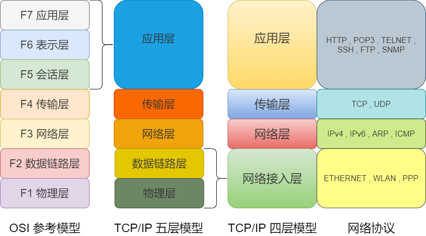

### 网络接入层
TCP/IP 是以 OSI 参考模型的物理层和数据链路层的功能是透明的为前提制定的，并未对这两层进行定义，所以可以把物理层和数据链路层合并称为网络接入层。网络接入层是对网络介质的管理，定义如何使用网络来传送数据。但是在通信过程中这两层起到的作用不一样，所以也有把物理层和数据链路层分别称为硬件、网络接口层。TCP/IP 分为四层或者五层都可以，只要能理解其中的原理即可。

设备之间通过物理的传输介质互连， 而互连的设备之间使用 MAC 地址实现数据传输。采用 MAC 地址，目的是为了识别连接到同一个传输介质上的设备。
### 网络层
相当于 OSI 模型中的第 3 层网络层，使用 IP 协议。IP 协议基于 IP 地址转发分包数据，作用是将数据包从源地址发送到目的地址。TCP/IP 分层中的网络层与传输层的功能通常由操作系统提供。路由器就是通过网络层实现转发数据包的功能。

网络传输中，每个节点会根据数据的地址信息，来判断该报文应该由哪个网卡发送出去。各个地址会参考一个发出接口列表， MAC 寻址中所参考的这张表叫做 MAC 地址转发表，而 IP 寻址中所参考的叫做路由控制表。MAC 地址转发表根据自学自动生成。路由控制表则根据路由协议自动生成。MAC 地址转发表中所记录的是实际的 MAC 地址本身，而路由表中记录的 IP 地址则是集中了之后的网络号（即网络号与子网掩码）。

* IP 是跨越网络传送数据包，使用 IP 地址作为主机的标识，使整个互联网都能收到数据的协议。IP 协议独立于底层介质，实现从源到目的的数据转发。IP 协议不具有重发机制，属于非可靠性传输协议。
* ICMP 用于在 IP 主机、路由器之间传递控制消息，用来诊断网络的健康状况。
* ARP 从数据包的 IP 地址中解析出 MAC 地址的一种协议。

### 传输层
相当于 OSI 模型中的第 4 层传输层，主要功能就是让应用程序之间互相通信，通过端口号识别应用程序，使用的协议有面向连接的 TCP 协议和面向无连接的 UDP 协议。

面向连接是在发送数据之前， 在收发主机之间连接一条逻辑通信链路。好比平常打电话，输入完对方电话号码拨出之后，只有对方接通电话才能真正通话，通话结束后将电话机扣上就如同切断电源。

面向无连接不要求建立和断开连接。发送端可于任何时候自由发送数据。如同去寄信，不需要确认收件人信息是否真实存在，也不需要确认收件人是否能收到信件，只要有个寄件地址就可以寄信了。

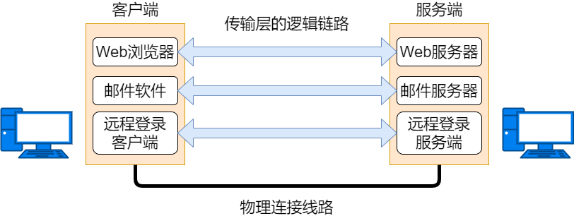

* TCP 是一种面向有连接的传输层协议，能够对自己提供的连接实施控制。适用于要求可靠传输的应用，例如文件传输。
* UDP 是一种面向无连接的传输层协议，不会对自己提供的连接实施控制。适用于实时应用，例如：IP电话、视频会议、直播等。

### 应用层
相当于 OSI 模型中的第 5-7 层的集合，不仅要实现 OSI 模型应用层的功能，还要实现会话层和表示层的功能。HTTP、POP3、TELNET、SSH、FTP、SNMP都是应用层协议。

TCP/IP 应用的架构绝大多数属于客户端/服务端模型。提供服务的程序叫服务端， 接受服务的程序叫客户端。客户端可以随时发送请求给服务端。

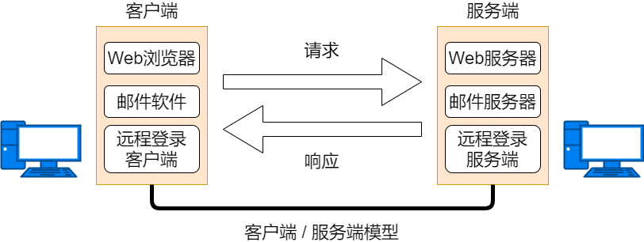

HTTP 是 WWW 浏览器和服务器之间的应用层通信协议，所传输数据的主要格式是 HTML。HTTP 定义高级命令或者方法供浏览器用来与Web服务器通信。

POP3 简单邮件传输协议，邮件客户端和邮件服务器使用。

TELNET 和 SSH远程终端协议，用于远程管理网络设备。TELNET 是明文传输， SSH 是加密传输。

SNMP 简单网络管理协议，用于网管软件进行网络设备的监控和管理。

## 封装与解封装
通常，为协议提供的信息为包头部，所要发送的内容为数据。每个分层中，都会对所发送的数据附加一个头部，在这个头部中包含了该层必要的信息，如发送的目标地址以及协议相关信息。在下一层的角度看，从上一分层收到的包全部都被认为是本层的数据。

数据发送前，按照参考模型从上到下，在数据经过每一层时，添加协议报文头部信息，这个过程叫封装。

数据接收后，按照参考模型从下到上，在数据经过每一层时，去掉协议头部信息，这个过程叫解封装。

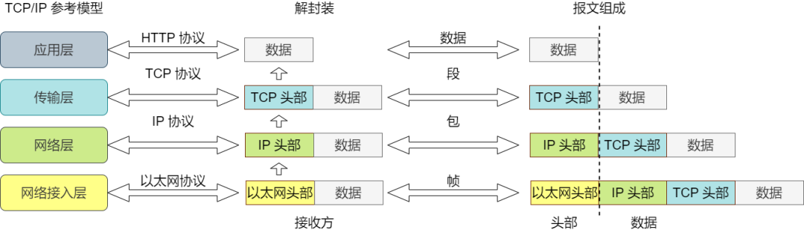

经过传输层协议封装后的数据称为段，经过网络层协议封装后的数据称为包，经过数据链路层协议封装后的数据称为帧，物理层传输的数据为比特。

TCP/IP 通信中使用 MAC 地址、 IP 地址、端口号等信息作为地址标识。甚至在应用层中，可以将电子邮件地址作为网络通信的地址。
### 实际数据传输举例
实际生活中，互联网是使用的 TCP/IP 协议进行网络连接的。我们以访问网站为例，看看网络是如何进行通信的。

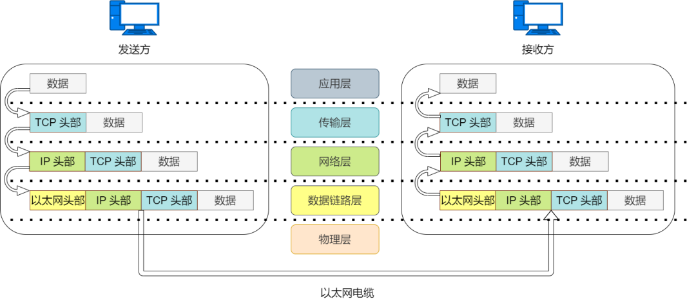

### 发送数据包
访问 HTTP 网站页面时，打开浏览器，输入网址，敲下回车键就开始进行 TCP/IP 通信了。

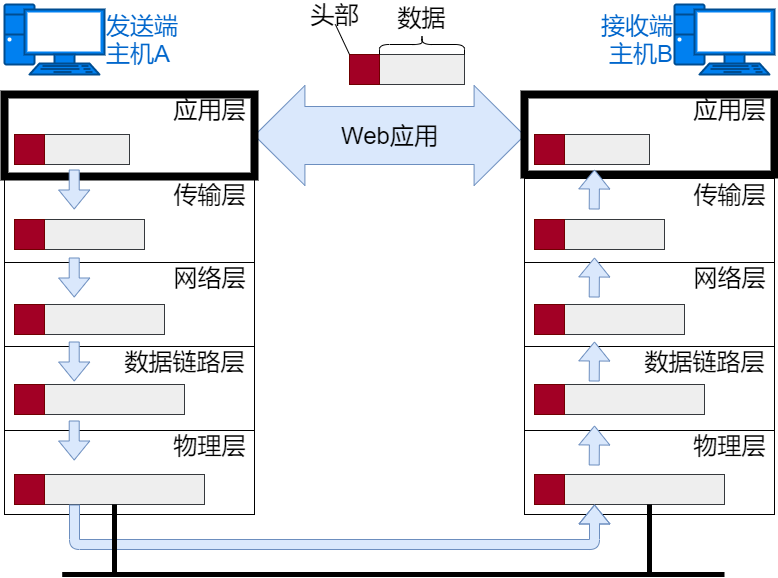

首先，应用程序中会进行 HTML 格式编码处理，相当于 OSI 的表示层功能。编码转化后，不一定会马上发送出去，相当于会话层的功能。在请求发送的那一刻，建立 TCP 连接，然后在 TCP 连接上发送数据。接下来就是将数据发送给下一层的 TCP 进行处理。

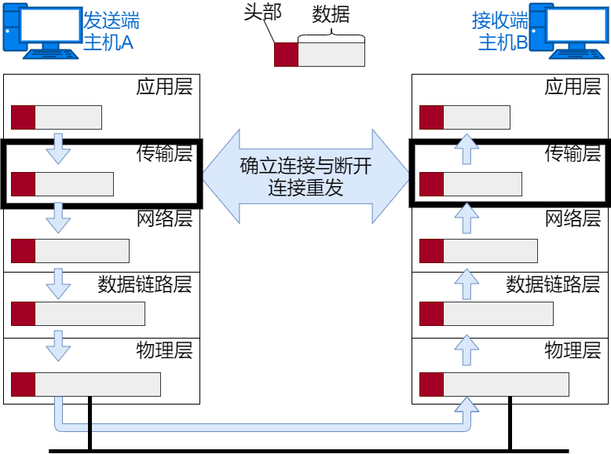

TCP 会将应用层发来的数据顺利的发送至目的地。实现可靠传输的功能，需要给数据封装 TCP 头部信息。TCP 头部信息包括源端口号和目的端口号（识别主机上应用）、序号（确认哪部分是数据）以及校验和（判断数据是否被损坏）。随后封装了 TCP 头部信息的段再发送给 IP。

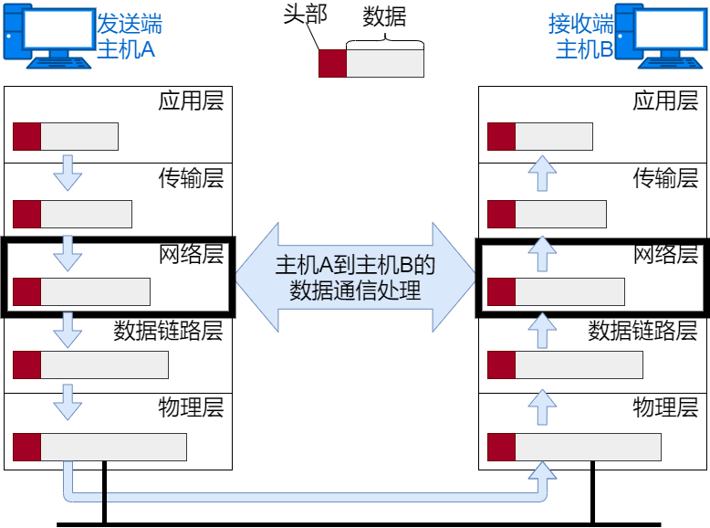

IP 将 TCP 传过来的数据段当做自己的数据，并封装 IP 头部信息。IP 头部信息中包含目的 IP 地址和源 IP 地址，以及上层协议类型信息。

IP 包生成后，根据主机路由表进行数据发送。

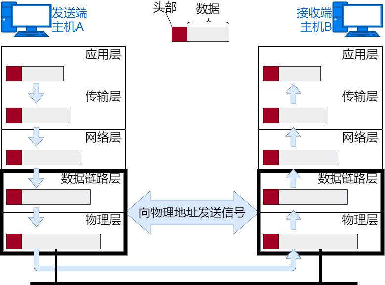

网络接口对传过来的 IP 包封装上以太网头部信息并进行发送处理。以太网头部信息包含目的 MAC 地址、源 MAC 地址，以及上层协议类型信息。然后将以太网数据帧通过物理层传输给接收端。发送处理中的 FCS 由硬件计算， 添加到包的最后。设置 FCS 的目的是为了判断数据包是否由于噪声而被破坏。
### 接收数据包
包的接收流程是发送流程的反向过程。
#### 网络接口处理
收到以太网包后，首先查看头部信息的目的 MAC 地址是否是发给自己的包。如果不是发送给自己的包就丢弃。如果是发送给自己的包，查看上层协议类型是 IP 包，以太网帧解封装成 IP 包，传给 IP 模块进行处理。如果是无法识别的协议类型，则丢弃数据。

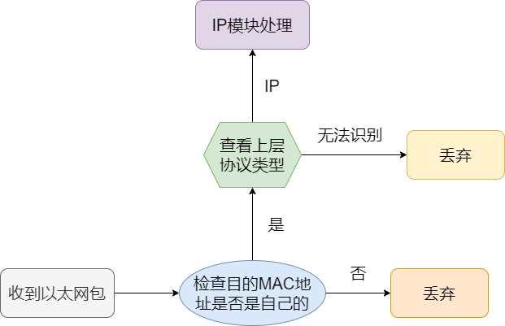

#### IP模块处理
收到 IP 包后，进行类似处理。根据头部信息的目的 IP 地址判断是否是发送给自己包，如果是发送给自己的包，则查看上一层的协议类型。上一层协议是 TCP，就把 IP 包解封装发送给 TCP 协议处理。

假如有路由器，且接收端不是自己的地址，那么根据路由控制表转发数据。

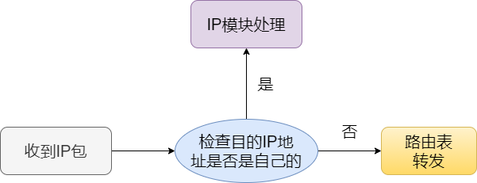

#### TCP 模块处理
收到 TCP 段后，首先查看校验和，判断数据是否被破坏。然后检查是否按照序号接收数据。最后检查端口号，确定具体的应用程序。

数据接收完毕后，发送一个“确认回执”给发送端。如果这个回执信息未能达到发送端，那么发送端会认为接收端没有接收到数据而一直反复发送。数据被完整接收后，会把 TCP 段解封装发送给由端口号识别的应用程序。
#### 应用程序处理
应用程序收到数据后，通过解析数据内容获知发送端请求的网页内容，然后按照 HTTP 协议进行后续数据交互。
## 网络构成

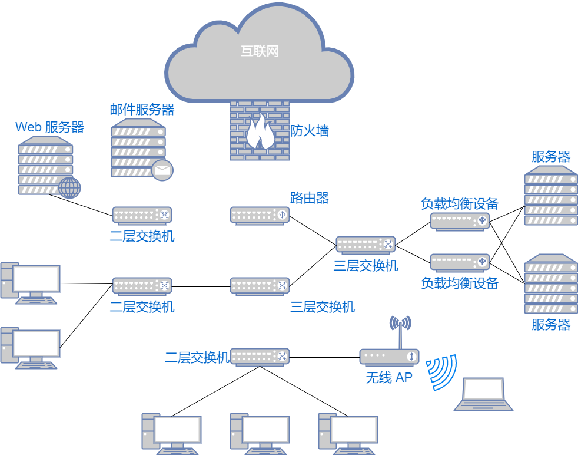

搭建一套网络涉及各种线缆和网络设备。下面介绍一些常见的硬件设备。硬件设备所说的层数是参照的 OSI 参考模型，而不是 TCP/IP 模型。

| 设备        | 作用                |
|-----------|-------------------|
| 网卡        | 使计算机联网的设备         |
| 二层交换机     | 从数据链路层上延长网络的设备    |
| 路由器/三层交换机 | 通过网络层转发数据的设备      |
| 四至七层交换机   | 处理传输层以上各层网络传输的 设备 |

### 通信介质与数据链路
设备之间通过线缆进行连接。有线线缆有双绞线、光纤、串口线等。根据数据链路不同选择对应的线缆。传输介质还可以被分为电波、微波等不同类型的电磁波。

传输速率：单位为 bps ，是指单位时间内传输的数据量有多少。又称作带宽，带宽越大网络传输能力就越强。

吞吐量：单位为 bps ，主机之间实际的传输速率。吞吐量这个词不仅衡量带宽， 同时也衡量主机的 CPU 处理能力、 网络的拥堵程度、 报文中数据字段的占有份额等信息。
### 网卡
任一主机连接网络时，必须要使用网卡。可以是有线网卡，用来连接有线网络，也可以是无线网卡连接 WiFi 网络。每块网卡都有一个唯一的 MAC 地址，也叫做硬件地址或物理地址。

### 二层交换机

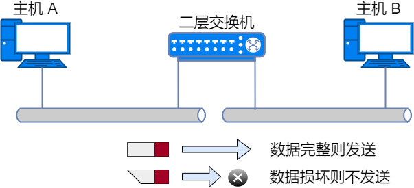

二层交换机位于 OSI 模型的第 2 层（数据链路层）。它能够识别数据链路层中的数据帧，并将帧转发给相连的另一个数据链路。

数据帧中有一个数据位叫做 FCS，用以校验数据是否正确送达目的地。二层交换机通过检查这个值，将损坏的数据丢弃。

二层交换机根据 MAC 地址自学机制判断是否需要转发数据帧。
### 路由器/三层交换机
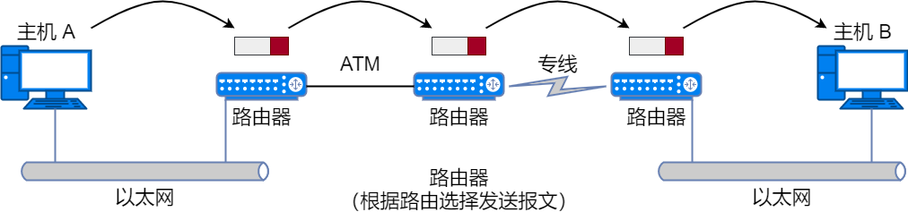

路由器是在 OSI 模型的第 3 层（网络层）上连接两个网络、并对报文进行转发的设备。二层交换机是根据 MAC 地址进行处理，而路由器/三层交换机则是根据 IP 地址进行处理的。因此 TCP/IP 中网络层的地址就成为了 IP 地址。

路由器可以连接不同的数据链路。比如连接两个以太网，或者连接一个以太网与一个无线网。家庭里面常见的无线路由器也是路由器的一种。
### 四至七层交换机

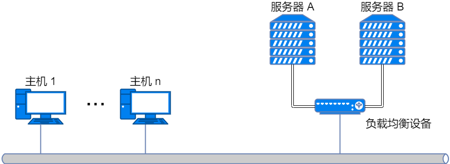

四至七层交换机负责处理 OSI 模型中从传输层至应用层的数据。以 TCP 等协议的传输层及其上面的应用层为基础，分析收发数据，并对其进行特定的处理。例如，视频网站的一台服务器不能满足访问需求，通过负载均衡设备将访问分发到后台多个服务器上，就是四至七层交换机的一种。还有带宽控制、广域网加速器、防火墙等应用场景。

## 按计算机网络分类
* 广域网 WAN(`Wide Area Network`)：跨越大范围地理区域建立连接的网络。
* 城域网 MAN(`Metropolitan Area Network`)：规模大于局域网，覆盖区域小到一个方圆数千米的大型园区，大到一个城市圈的网络。
* 局域网 LAN(`Local Area Network`) ：在一个有限区域内实现终端设备互联的网络。

## 网络的性能
计算机网络的性能一般是指它的几个重要的性能指标，主要包括：速率、带宽、吞吐率、时延、时延带宽积、往返时间 RTT、利用率。
### 速率
计算机发送出的信号都是数字形式的。

速率是计算机网络中最重要的一个性能指标，指的是数据的传送速率，它也称为数据率或比特率 (`bit rate`)。速率的单位是`bit/s`，或`kbit/s`、`Mbit/s`、`Gbit/s`等。速率往往是指额定速率或标称速率，非实际运行速率。
### 带宽
带宽用来表示网络中某通道传送数据的能力。表示在单位时间内网络中的某信道所能通过的“最高数据率”。单位是`bit/s`，即“比特每秒”。

一条通信链路的“带宽”越宽，其所能传输的“最高数据率”也越高。
### 吞吐量
吞吐量表示在单位时间内通过某个网络（或信道、接口）的数据量。

吞吐量更经常地用于对现实世界中的网络的一种测量，以便知道实际上到底有多少数据量能够通过网络。

吞吐量受网络的带宽或网络的额定速率的限制。

例如，对于一个`1 Gbit/s`的以太网，就是说其额定速率是`1 Gbit/s`，那么这个数值也是该以太网的吞吐量的绝对上限值。因此，对`1 Gbit/s`的以太网，其实际的吞吐量可能只有`100 Mbit/s`，甚至更低，并没有达到其额定速率。
### 时延
时延 (`delay`或`latency`) 是指数据（一个报文或分组，甚至比特）从网络（或链路）的一端传送到另一端所需的时间。有时也称为延迟或迟延。

网络中的时延由以下几个不同的部分组成：发送时延、传播时延、处理时延、排队时延。

发送时延也称为传输时延。发送数据时，数据帧从结点进入到传输媒体所需要的时间。也就是从发送数据帧的第一个比特算起，到该帧的最后一个比特发送完毕所需的时间。

传播时延是电磁波在信道中传播一定的距需要花费的时间。

处理时延：主机或路由器在收到分组时，为处理分组（例如分析首部、提取数据、差错检验或查找路由）所花费的时间。

排队时延：分组在经过网络传输时，要经过许多路由器。但分组在进入路由器后要先在输入队列中排队等待处理。在路由器确定了转发接口后，还要在输出队列中排队等待 转发。这就产生了排队时延。排队时延的长短往往取决于网络当时的通信量。当网络的通信 量很大时会发生队列溢出，使分组丢失，这相当于排队时延为无穷大。

数据在网络中经历的总时延就是发送时延、传播时延、处理时延和排队时延之和。

总时延 = 发送时延 + 传播时延 + 处理时延 + 排队时延

在总时延中，究竟是哪一种时延占主导地位，必须具体分析。

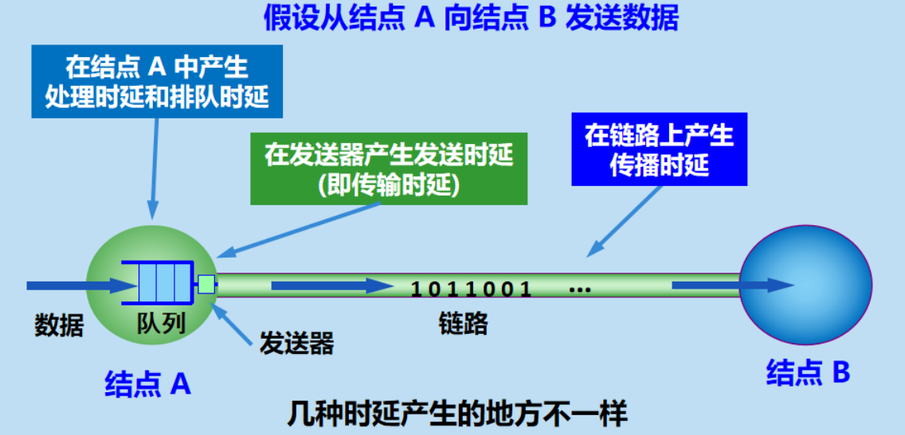

### 往返时间
互联网上的信息不仅仅单方向传输，而是双向交互的。因此，有时很需要知道双向交互一次所需的时间。

往返时间 RTT (`round-trip time`) 表示从发送方发送数据开始，到发送方收到来自接收方的确认，总共经历的时间。

在互联网中，往返时间还包括各中间结点的处理时延、排队时延以及转发数据时的发送时延。
### 利用率
利用率分为信道利用率和网络利用率。

信道利用率指出某信道有百分之几的时间是被利用的（有数据通过）。完全空闲的信道的利用率是零。

网络利用率则是全网络的信道利用率的加权平均值。

信道利用率并非越高越好。根据排队论的理论，当某信道的利用率增大时，该信道引起的时延也就迅速增加。

若令 D0 表示网络空闲时的时延，D 表示网络当前的时延，则在适当的假定条件下，可以用下面的简单公式表示 D 和 D0 之间的关系：

当网络的利用率接近最大值 1 时，网络的时延就趋于无穷大。因此我们必须有这样的概念：信道或网络的利用率过高会产生非常大的时延。

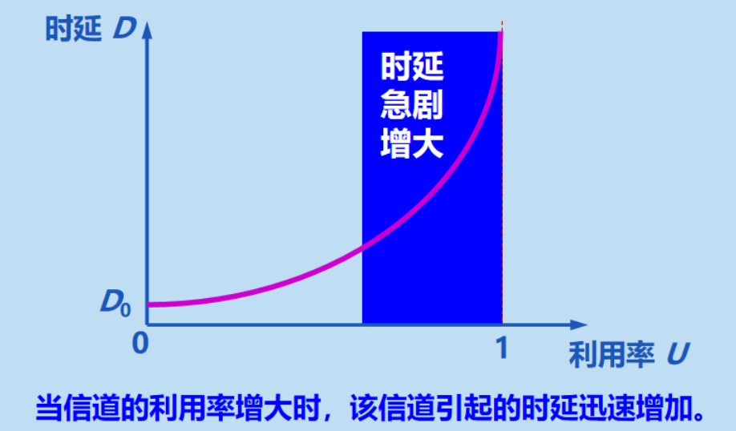

## MAC 地址
每个网卡或三层网口都有一个 MAC 地址，MAC 地址是烧录到硬件上，因此也称为硬件地址。MAC 地址作为数据链路设备的地址标识符，需要保证网络中的每个 MAC 地址都是唯一的，才能正确识别到数据链路上的设备。

MAC 地址由 6 个字节组成。前 3 个字节表示厂商识别码，每个网卡厂商都有特定唯一的识别数字。后 3 个字节由厂商给每个网卡进行分配。厂商可以保证生产出来的网卡不会有相同 MAC 地址的网卡。

现在可以通过软件修改 MAC 地址，虚拟机使用物理机网卡的 MAC 地址，并不能保证 MAC 地址是唯一的。但是只要 MAC 地址相同的设备不在同一个数据链路上就没问题。

为了查看方便，6 个字节的 MAC 地址使用十六进制来表示。每个字节的 8 位二进制数分别用 2 个十六进制数来表示，例如我的网卡 MAC 地址是`E0-06-E6-39-86-31`。

比特(`bit`)，也叫位。二进制中最小单位，一个比特的值要么是 0 要么是 1。

字节(`Byte`)。一个字节由  8 个比特构成。

