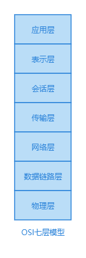
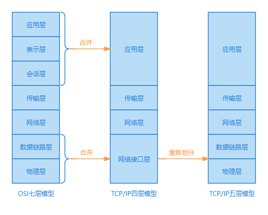
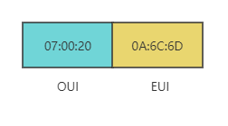
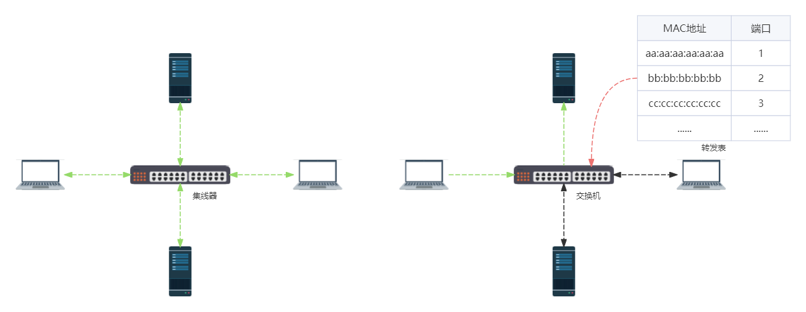
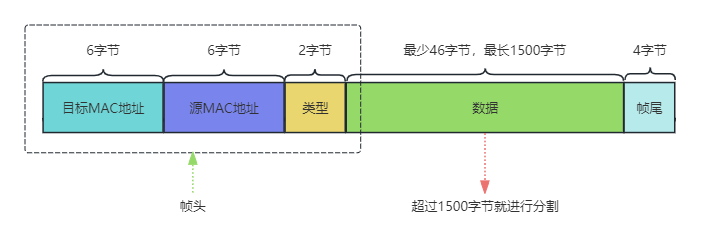
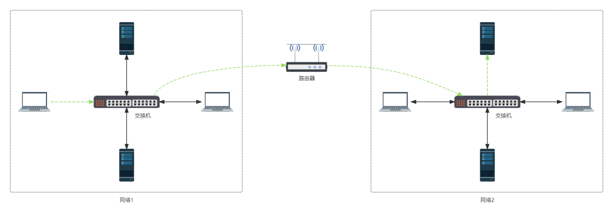
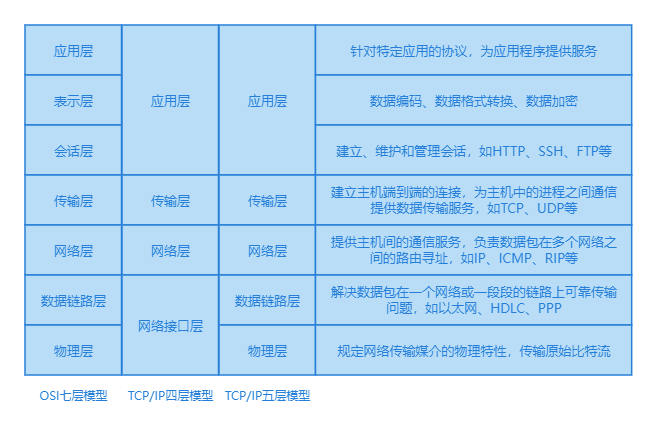

在计算机网络中一般有 OSI 七层模型、TCP/IP 四层模型和 TCP/IP 五层模型，这些模型将复杂的网络通信过程划分为不同的层次，每一层次都有其特定的功能和协议，共同协作完成网络通信。那这些模型分别是什么、相互之间有什么区别呢？
## OSI七层模型产生的历史
为了让世界上各个国家或地区，各个不同计算机厂家，生产出的各个不同体系结构的计算机设备，各种网络协议，能够互相通信，国际标准化组织 ISO 于 1977 年提出了"开放系统互联参考模型"，即著名的 OSI 模型，`Open System Interconnection Reference Model`，一个试图使各种不同的计算机或者设备在世界范围内互连为网络的标准模型，使得计算机所依赖硬件和软件技术跨越地理和政治界限协同工作，允许两个独立系统通过基于当前操作层的标准化接口或协议进行通信，来在更大的范围内建立计算机网络。

OSI 模型包括七个层次，自上而下依次为：
* 应用层（`Application Layer`）
* 表示层（`Presentation Layer`）
* 会话层（`Session Layer`）
* 传输层（`Transport Layer`）
* 网络层（`Network Layer`）
* 数据链路层（`Data Link Layer`）
* 物理层（`Physics Layer`）

将计算机网络进行分层，是为了简化网络设计和实现的复杂性，将复杂的通信过程分为若干个相对独立的层次。每一层都负责特定的功能，进行跨软件和硬件组件封装每种类型的网络通信，例如数据格式化、数据传输控制、路由选择等，这样较高层可以直接使用较低层技术，而不必关心底层的实现细节。

国际标准 OSI 模型并没有得到市场的认可。
## TCP/IP四层模型和TCP/IP五层模型

OSI 模型提出时，因特网已抢先在全世界范围内广泛流行起来，全部推倒重来已不可能，它使用 TCP/IP 协议族，通过与 OSI 模型的结合，从理论上补足了⽹络接⼝层的缺失，最终演变成如今的 TCP/IP 四层模型，用于从理论上描述互联网协议（IP）的工作方式。它包括四个层次：应用层、传输层、网络层和网络接口层，其中应用层由 OSI 模型的应用层、表示层、会话层合并而来，网络接口层由 OSI 模型的数据链路层和物理层合并而来。

OSI 七层模型虽然是理论上标准，但既复杂⼜不实⽤，部分功能在多个层次中重复出现，TCP/IP 四层模型则是个更为实用的模型，也是如今事实标准，但最下⾯的⽹络接⼝层并没有具体内容，所以一般都采用 TCP/IP 五层模型，它在 TCP/IP 四层模型基础上，将网络接口层重新划分为数据链路层和物理层，更接近实际应用的网络结构。

接下来将这些层串起来，看看他们是如何互相配合作用的。
## 物理层
物理层，主要规定网络的传输媒介的物理特性，来传递 0 和 1 的电信号，即它负责在传输媒介上传输原始比特流。物理层传输的单位是比特，比如 2 台主机直接通过双绞线电缆来连接，传递信号，但是如果随着网络中加入的主机变多，每台直接相连，会让接口数和网线数几何式上升，布线变得异常复杂。所以引入中间设备，每个主机只需和这个中间设备相连即可，比如总线、集线器等，当然这个中间设备需要足够的稳定，不然一旦挂了，会影响整个网络。

物理层确定传输媒介的接口特征：
* 机械特征：接口所用接线器的一些物理属性如接口范围，接口尺寸，引线数目及排列
* 电气特征：接口电缆的各条线上出现电压的范围，阻抗匹配，传输速度，距离等
* 功能特征：某条线上出现的某一电平的电压的意义，接口部件信号线的用途
* 过程特征：对于不同功能的各种可能事件的出现顺序，定义各条物理线路的工作规程和时序关系

物理层连接多个电脑设备的常用传输媒介有：集线器、同轴电缆、双绞线电缆、光纤、光缆、无线电波等，这些媒介严格上不在物理层协议之内的而是在物理层协议之下。

另外不同的传输媒介，需要选择合适的编码方式以及调制技术，来将原始比特流变换成相应的电信号，以保证数据的可靠传输和抗干扰能力。
## 数据链路层
数据链路层，主要是解决数据包在一个网络或一段一段的链路上可靠传输问题。在物理层我们把各个主机物理上连在一起，现在需要解决的是信号如何传递给对应主机，这个时候就需要来标识网络中的每一个主机，这个叫做网卡 (MAC) 地址，是硬件的唯一标识符。所以数据链路层也被称为 MAC 层。

:::info
MAC 地址: 设备的硬件地址，也是网络中计算机设备的唯一标识，12 位十六进制的数，它由设备出厂时就决定了，一般无法修改。比如`07:00:20:0A:6C:6D`就是一个 MAC 地址，其中前 6 位 16 进制数`07:00:20`代表网络硬件制造商的编号，即组织唯一标识符 OUI，它由 IEEE 分配，而后 6 位 16 进制数`0A:6C:6D`代表该制造商所制造的某个产品的系列号，即扩展唯一标识符 EUI。以此来保证世界上每个以太网设备都具有唯一的 MAC 地址。
:::

集线器功能比较简单粗暴，只能将信息广播到整个网络的所有主机上，各个主机在通过消息中的 MAC 地址，来确认是否是发给自己的消息，这样既不安全也浪费网络的带宽。所以在数据链路层采用交换机，自学习维护一个转发表，来转发帧，记录消息从哪里来，到哪里去，来实现主机接入控制。

数据链路层还解决了数据包的封装格式问题，将网络层交下来的 IP 数据报封装成帧，同时负责建立和管理节点间的链路，通过各种控制协议，实现差错控制。

数据链路层传输单位是帧`frame`，每帧的组成是由帧头、数据、帧尾组成：
* MAC 子层帧头构成：目标 MAC 地址（6 字节），源 MAC 地址（6 字节），类型（2 字节），总的大小=6+6+2=14 字节
* FCS 帧尾：提供了一种错误检测机制，用来验证帧在传输过程中的完整性（4个字节）
* 数据：存放整个数据包的具体内容，比如文件、字符串之类的，数据部分的长度最小至少为 46 个字节，最长 1500 个字节；如果超过 1500 个字节就分割

数据链路层还实现了透明传输，不必考虑物理层如何实现比特传输的细节，这个由物理层进行保证。
:::info
透明传输是指不管所传输的数据是什么样的比特组合，都应当能够在链路上传送。尽可能地屏蔽掉不同传输媒体和通信手段的差异。通俗点讲，就是链路层就“看不见”有什么妨碍数据传输的东西。
:::
## 网络层
网络层提供主机间的通信服务，负责数据包在多个网络之间的路由和寻址( IP 地址)，确保数据可以在不同网络间传输；也叫网际层或 IP 层。

在数据链路层，我们实现了在单个网络中网络的通信，但在世界上各个不同的地理位置上，有几十亿个设备互相组成大大小小的异构网络，要想把它们连在一起，交换机+MAC 地址就远远不够了，IP 互联网协议就应运而生，提供一种统一的地址格式，为互联网上的每一个网络和每一台主机分配一个逻辑地址，以此来屏蔽物理地址的差异，来解决多网络互连的问题。
:::info
IP互联网协议，是TCP/IP协议栈中最核心的协议之一，通过IP地址(逻辑地址)，来标识网络和网络中的各主机，实现了网络通信的面向无连接和不可靠的传输功能。
:::
以常见的 IPv4 协议为例，IP 地址共 32 位，分成了四段如`192.168.0.1`，IP 地址得向 IANA 机构申请，一旦分配后一般不会改变，IPv4 总共有 43 亿个地址，由于欧美的先发优势，分到的 IP 地址资源非常丰富，我们国内就严重不足，早在 2011 年 IPv4 地址就被分配完了。如今的解决办法，是采用 NAT 技术或者 IPv6(增加 IP 地址长度)。

网络层传输单位是包`packet`，在数据链路层的帧基础上，继续封装数据包成 IP 数据包。

网络层还有一个作用就是路由选择，通过路由选择算法，为数据包选择最适当的路径，控制数据链路层与传输层之间的信息转发，建立、维持和终止网络的连接，将信息从一个网络设备传送到另一个网络设备。

常用设备：路由器，主要用来连接不同的网络时，交换机无法再维护庞大的转发表，而路由器会自动⽣成路由表，依据路由表转发数据包⾄下⼀个网络。

路由器的每个端口都会有一个自己的 MAC 地址。路由器能将一个 IP 分配给多个主机使用，主机对外 ip 也是同一个。而交换机是可以将不同的主机连接起来，对外表现的 IP 也可各有不同；交换机隔离冲突域，但不隔离广播域，而路由器既隔离冲突域又隔离广播域，不会转发广播数据，减少广播风暴和安全漏洞。
## 传输层
传输层建立主机端到端的连接，为主机中的进程之间通信，提供数据传输服务，为应用层提供端到端可靠且透明的数据传输服务，包括全双工或半双工、流控制和错误恢复服务，确保数据能完整的传输到网络层。建立主机端到端的连接，这里的端是端口`port`，当通过网络层获取 IP 地址后，数据包可以通过 IP 地址找到对应的主机，但是主机一般是多进程，每一个进程都是一个任务，那么如何确定是哪一个任务？

所以引入端口的概念，当进程需要网络通信服务时，向操作系统申请一个端口，通过端口号来标识这个进程，从而让网络中数据包，分辨出主机中哪一个进程是接收者。

传输层主要有两个协议：
* TCP传输控制协议，提供⾯向连接的、可靠的数据传输服务，传输单位为报⽂段`segment`
* UDP用户数据报协议，提供⽆连接的、尽最大努力交付(不可靠性)的数据传输，传输单位为数据报`Datagram`

为什么在这层引入这 2 个协议呢？

这是因为在网络层上，IP 协议没法区分端口，UDP 协议在 IP 协议的基础上增加了源端口和目的端口字段，这样就可以区分端口了，另外 IP 协议又是无连接不可靠的，传输数据容易差错，引入 TCP 协议，通过三次握手四次挥手等一系列机制，来确保数据的可靠传输。

传输层有复用和分用的功能，一个主机可以同时运行多个进程，应用进程又可以利用传输层传送应用层报文
* 复用就是多个应用层进程可同时使用下面的运输层的服务
* 分用就是把运输层收到的信息分别交付给上面应用层中的响应进程

# 应用层
应用层，是最上层，也是我们用户能够直接接触到的，比如手机、电脑、各种家庭设备等等，它对应 OSI 的应用层、表示层和会话层。

主要专注于为用户提供网络服务，直接面对应用程序，如文件传输、电子邮件、远程登录等，它并不需要关心数据是如何传输的，但需要数据的格式进行转换表示，让目的应用程序能看懂数据的内容。

应用层传输单位是报文`message`，是对传输层的数据包进一步封装。

我们再来看看，TCP/IP 模型的应用层对应 OSI 的应用层、表示层和会话层，分别有什么作用：
* 应用层：为应用程序或用户请求提供各种请求服务。OSI 参考模型最高层，也是最靠近用户的一层，为计算机用户、各种应用程序以及网络提供接口，也为用户直接提供各种网络服务。
* 表示层：数据编码、格式转换、数据加密。提供各种用于应用层数据的编码和转换功能,确保一个系统的应用层发送的数据能被另一个系统的应用层识别。如果必要，该层可提供一种标准表示形式，用于将计算机内部的多种数据格式转换成通信中采用的标准表示形式。数据压缩和加密也是表示层可提供的转换功能之一。
* 会话层：创建、管理和维护会话。接收来自传输层的数据，负责建立、管理和终止表示层实体之间的通信会话，支持它们之间的数据交换。该层的通信由不同设备中的应用程序之间的服务请求和响应组成

