## 路由重发布
在同一个网络拓扑结构中，如果存在两种不同的路由协议，由于不同的路由协议的工作机制各有不同，对路由的理解也不相同，这就在网络中造成了路由信息的隔离，然而由于这很有可能是同一个自治系统内的网络，全网需要互通，这时候咋办？

例如一个网络包含两个片区，每个片区使用自己的动态路由协议，如果要实现两个片区的网络互通，就需要在两者之间打通路由，但是这两种动态路由协议毕竟是不同的协议，路由信息是完全隔离的，如何实现交互？这就需要使用路由重发布（也被称为路由引入，`route-importation`）了。

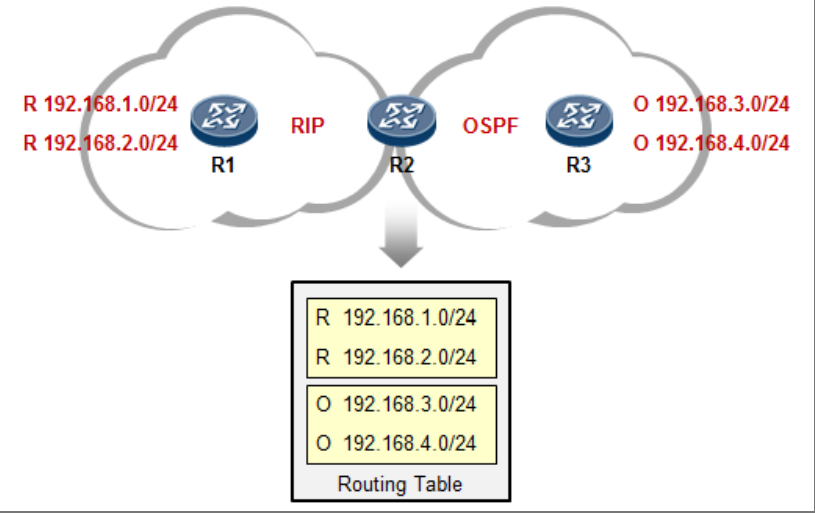

我们看上图，R1 与 R2 之间，运行 RIP（路由协议）来交互路由信息，R2 通过 RI P学习到了 R1 通告的`192.168.1.0/24`及`2.0/24`的路由。同时 R2 与 R3 又建立了 OSPF 邻接关系，因此 R2 也从 R3 那通过 OSPF 学习到了两条路由：`3.0`及`4.0/24`，也装载进了路由表。那么对于 R2 而言，它自己就有了去往全网的路由，但是 R2 不会将从 RIP 学习过来的路由告诉 R3，也不会将从 OSPF 学习来的路由告诉 R1。对于 R2 而言，虽然它自己的路由表里有完整的路由信息，但是，就好像冥冥之中，R 和 O 的条目之间有道鸿沟，无法逾越。而 R2 就也就成了 RIP 及 OSPF 域的分界点。那么如何能够让 R1 学习到来自 OSPF 的路由、让 R3 学习到来自 RIP 的路由呢？关键点在于 R2 上，通过在 R2 上部署路由重发布，可以实现路由信息在不同路由选择域间的传递。

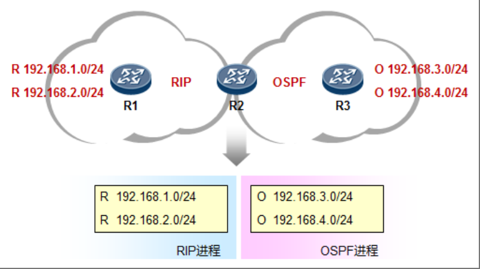

上图是初始状态。R2 分别从 RIP 及 OSPF 都学习到了相应的路由。但是在默认情况下，通过这两个路由协议所学习到的路由是互相隔离的，R2 不会自动的将 OSPF 路由“翻译”成 RIP，反之亦然。那么此时，R1 自然是无法访问到 R3 这一侧的网络的，R3 也是一样。

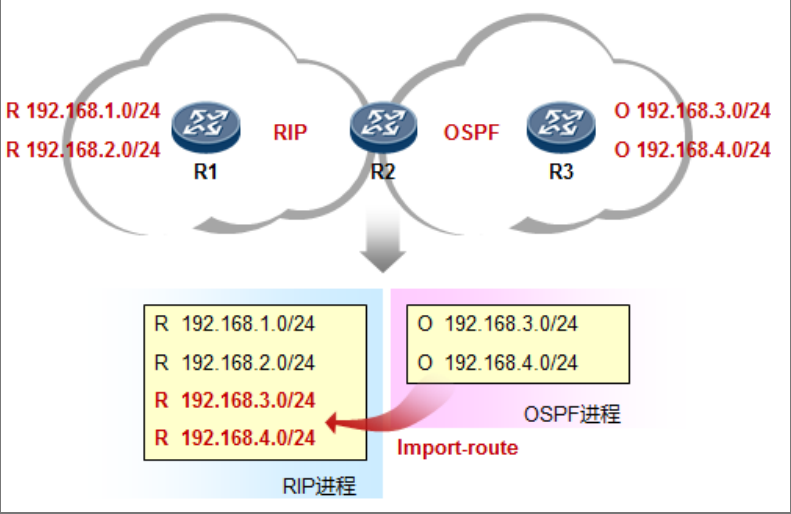

上图中，我们开始在 R2 上执行重发布的动作，我们将 OSPF 的路由“注入”了 RIP 进程之中，如此一来，R2 就会将`3.0/24`及`4.0/24`这两条 OSPF 路由“翻译”成 RIP，然后传递给 R1，R1 也就能够学习到`3.0`和`4.0`路由了。

注意重发布的执行地点，是在 R2 上，也就是在路由域的分界点上执行，另外，路由重发布是有方向的，我们执行完上述相关动作后，R3 仍然是没有  RIP 域内的那些路由的，需进一步在 R2 上，将 RIP 路由重发布进 OSPF，才能让 R3 学习到`1.0/24`及`2.0/24`路由。
### 实施要点
#### 路由优先级问题

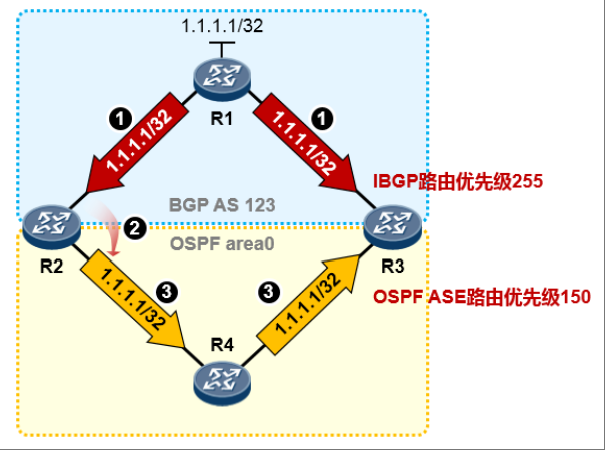

路由优先级问题，是在部署重发布过程中需要关注的问题之一，尤其是在双点双向路由重发布的场景中，这种场景中两个 ASBR（AS 边界路由器）上会同时部署双向的路由重发布，这是一个非常值得关注的模型。

在上图所示的网络环境中，存在两个路由域：BGP 及 OSPF。R1 上有一条直连路由`1.1.1.1/32`被`network`进 BGP 并传递给了 R2 及 R3，那么此刻 R2 及 R3 的路由表中是有到达`1.1.1.1/32`的 IBGP 路由的。

接下去 R2 部署了 IBGP 到 OSPF 的路由重发布，`1.1.1./32`的路由被引入了 OSPF，形成外部路由条目并传递给了 R3。现在 R3 同时从 OSPF 及 IBGP 学习到`1.1.1./32`路由，OSPF 外部路由的优先级是 150，而 IBGP 路由优先级为 255，因此 OSPF 的外部路由要优于 IBGP 路由，如此一来 R3 会把 OSPF 路由`1.1.1.1/32`装载进路由表，该路由的下一跳为 R4，这时 R3 就出现了“次优路径问题”，其访问`1.1.1.1/32`的流量走向是`R4-R2-R1`——绕了远路了。

造成这个现象的原因是路由协议的优先级在这里影响了 R3 的路由优选，为了规避这个现象，我们可以在 R3 上使用相关命令来调节`1.1.1.1/32`路由的优先级，使得 R3 优选来自 IBGP 的路由。
#### 路由倒灌
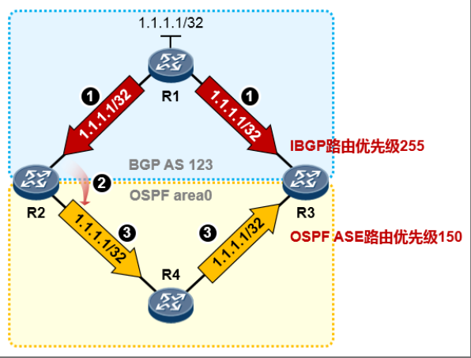

还是上面的环境，刚才我们已经分析过了，如果不做任何干预，R3 是会存在次优路径问题的，因为 R3 会优选到达`1.1.1.1/32`的 OSPF 路由，而不是 IBGP 路由。而如果 R3 又部署了 OSPF 到 BGP 的路由重发布，那么`1.1.1.1/32`路由又会被 R3 给倒灌回 BGP，这就存在一个引发路由环路的隐患。
### 路由重发布的配置
不同协议之间的路由重发布的配置大同小异，我们先看一下从其他路由协议注入路由到 OSPF 的配置：
```shell
[R2] ospf 1
[R2-ospf-1] import-route ?
 bgp Border Gateway Protocol (BGP) routes
 direct Connected routes
 isis Intermediate System to Intermediate System (IS-IS) routes
 limit Limit the number of routes imported into OSPF
 ospf Open Shortest Path First (OSPF) routes
 rip Routing Information Protocol (RIP) routes
 static Static routes
 unr User Network Routes
```
在一台设备上，将其路由表中通过 A 路由协议学习到的路由重发布到 B 路由协议中，是在该设备的 B 路由协议的配置视图下完成相关配置的。
#### OSPF与RIP的互重发布

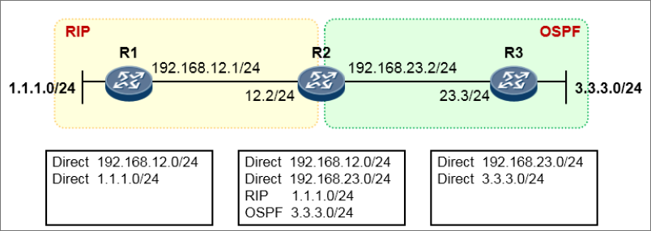

在上图中，R1 与 R2 运行着 RIP，R2 与 R3 则建立了 OSPF 邻接关系，我们最终要实现的目标是让全网能够互通。首先 R2 已经通过 OSPF 及 RIP 学习到了`1.1.1.0/24`及`3.3.3.0/24`路由，它已经同时拥有了 OSPF 及 RIP 路由域内的路由。但是默认情况下，它是不会将 OSPF 路由注入 RIP 域的，反之亦然。那么现在我们就要在 R2 上做路由重发布了。

首先是将 OSPF 路由注入 RIP：

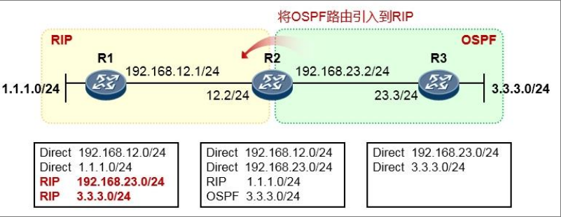

```shell
[R2]rip 1
[R2-rip-1]import-route ospf 1 [cost X]
# 如果不指定 cost，则路由重发布进RIP后cost缺省为0
```
注意，上面只是给出了关键配置。完成这一步动作之后，R1 的路由表就发生了变化，由于 R2 部署了从 OSPF 到 RIP 的路由重发布，因此它会将其路由表中的所有 OSPF 路由（`3.3.3.0/24`）以及本地直连的 OSPF 接口路
由（`192.168.23.0/24`）都注入 RIP，从而 R1 便能够通过 RIP 学习到`192.168.23.0/24`及`3.3.3.0/24`路由。

接着是将 RIP 路由注入到 OSPF：

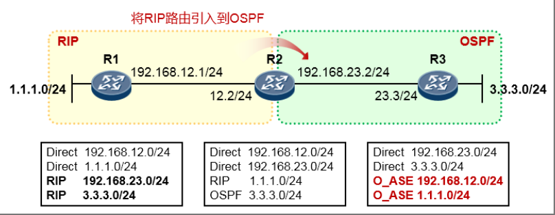

```shell
[R2]ospf 1
[R2-ospf-1]import-route rip [cost X]
# 如果不指定 cost，则路由重发布进OSPF后 cost=1，type=E2
# 可以关联 cost 及 type 关键字修改 cost和外部路由metric-type
```
完成上述配置后，R3 即可学习到 RIP 域中的路由`192.168.12.0/24`以及`1.1.1.0/24`。如此一来，全网的路由就互通了。


:::warning
将路由协议 A 注入到路由协议 B，是在路由协议 B 的配置视图中完成相应的`import-route`配置。并且，路由重发布是单向的。
:::
#### 重发布直连路由到OSPF
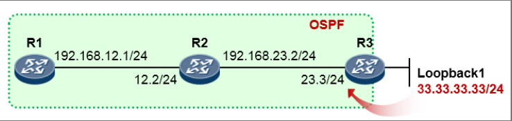

常规情况下，要将一条直连路由通告给路由域，就必须`network`相应的直连接口。如果没有使用`network`命令在路由进程中激活相应的接口，则对于该路由域而言，这个接口所关联的网段就是外部网络。

另一种将到达直连网络的路由引入路由域的方式是使用路由重发布的方式，将直连路由注入，例如上图中 R3 的初始配置如下：
```shell
[R3] ospf 1 router-id 3.3.3.3
[R3-ospf-1] area 0
[R3-ospf-1-area-0.0.0.0] network 192.168.23.3 0.0.0.0
```
它并没有配置`network 33.33.33.0 0.0.0.255`，那么 R1、R2 是无法从 OSPF 学习到`33.33.33.0/24`路由的，因为 R3 的`Loopback1`接口并未激活 OSPF。我们可以使用如下方式来将直连路由注入 OSPF：
```shell
[R3] ospf 1
[R3-ospf-1] import-route direct
# 如果不指定cost，则路由重发布进OSPF后cost=1，type为E2，
# 可以在命令中增加cost及type关键字修改cost和外部路由metric-type
```
在 OSPF 配置视图中使用`import-route direct`命令，会将路由器上所有的直连接口路由都注入 OSPF。因此 当 R3 执行上述命令时，其路由表中的直连路由`192.168.23.0/24`以及`33.33.33.0/24`都会被注入 OSPF ——以外部路由的形式。当然，如果此时`Loopback1`接口失效，那么该接口的直连路由重发布也就会被撤销。
#### 重发布静态路由到OSPF
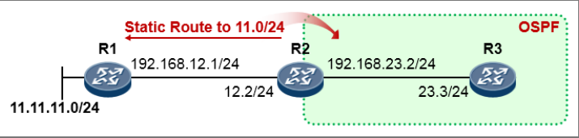

在上图中，R1 直连着网络`11.11.11.0/24`，R1 不支持动态路由协议，R2 配置了去往`11.11.11.0/24`的静态路由，且下一跳为 R1。R2 与 R3 建立 OSPF 邻接关系。现在对于整个 OSPF 域而言，它们是感知不到`11.11.11.0/24`网段的存在的，因为对于 OSPF 而言，R2 所配置的静态路由是一条域外的路由。为了让 OSP F内的路由器能够通过 OSPF 学习到`11.11.11.0/24`路由，我们需要在 R2 上部署路由重发布，将静态路由重发布到 OSPF：
```shell
[R2] ip route-static 11.11.11.0 24 192.168.12.1
[R2] ospf 1
[R2-ospf-1] import-route static
[R2-ospf-1] area 0
[R2-ospf-1-area-0.0.0.0] network 192.168.23.2 0.0.0.0
```
在 OSPF 配置视图下使用`import-route static`命令后，R2 会将其路由表中所有的静态路由都会重发布到 OSPF。如此一来，R3 便能够通过 OSPF 学习到`11.11.11.0/24`路由。

## 路由策略
### Route-policy
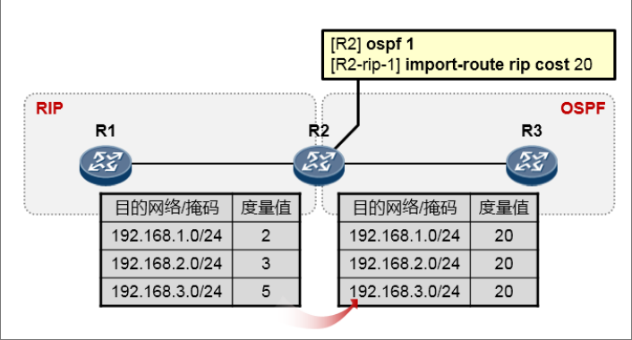

如上图所示，我们要在 R2 上部署 RIP 到 OSPF 的重发布，在执行重发布的命令中，可以关联`cost`关键字来指定路由注入 OSPF 之后的`cost`。但是这是针对所有被注入的路由的。另外`import-route rip`命令会将 R2 路由表中的 RIP 路由全都注入 OSPF。

如果希望只注入特定的路由，或在注入过程中过滤掉某些路由呢？或者针对不同的路由在注入后设置不同的 OSPF `cost`呢？这个时候就可以使用到`route-policy`了。

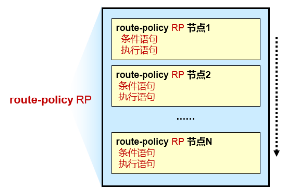

`route-policy`是一个非常重要的基础性策略工具。你可以把它想象成一个拥有多个节点（`node`）的列表（这些`node`按编号大小进行排序）。在每个节点中，可以定义条件语句及执行语句，这就有点像`if-then`语句。

`route-policy`执行的时候，是自上而下进行计算的。首先看节点 1（这里假设编号最小的节点为 1），对节点 1 中的“条件语句”进行计算，如果所有的条件都满足，则执行该节点下的“执行语句”，并且不会再继续往 下一个节点进行匹配了。而如果节点 1 中，有任何一个条件不满足，则继续看下一个节点，到节点 2 中去匹配条件语句，如果全都满足则执行该节点中定义的执行语句，如果不满足，则继续往下一个节点进行，以此类推。

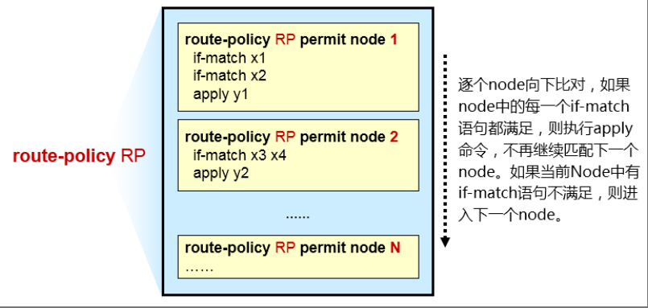

#### Route-policy的配置
1. 创建`route-policy`
```shell
[Huawei] route-policy name { permit | deny } node node
```
* `permit`关键字指定节点的匹配模式为允许。当该节点下所有的条件都被满足时，将执行该节点的`apply`子句，不进入下一个节点；如果有任何一个条件不满足，将进入下一个节点继续计算。
* `deny`关键字指定节点的匹配模式为拒绝，这时`apply`子句不会被执行。当该节点下所有的条件都被满足时，将被拒绝通过该节点，不进入下一个节点；如果有任何一个条件不满足，将进入下一个节点继续计算。
* 默认情况下，所有未匹配的路由将被拒绝通过`route-policy`。如果`route-policy`中定义了一个以上的节点，则各节点中至少应该有一个节点的匹配模式是`permit`。

2. 配置`if-match`子句
```shell
[Huawei-route-policy] if-match ?
acl 匹配ACL
cost 匹配路由信息的cost
interface 匹配路由信息的出接口
ip { next-hop | route-source | group-address } 匹配IPv4的路由信息（下一跳、源地址或组播组地址）
ip-prefix 匹配前缀列表
route-type 匹配各类型路由信息
tag 匹配路由信息的标记域
……
```
* 对于同一个`route-policy`节点，命令`if-match acl`和命令`if-match ip-prefix`不能同时配置，后配置的命令会覆盖先配置的命令。
* 对于同一个`route-policy`节点，在匹配的过程中，各个`if-match`子句间是“与”的关系，即路由信息必须同时满足所有匹配条件，才可以执行`apply`子句的动作。但命令`if-match route-type`和`if-match interface`除外，这两个命令的各自`if-match`子句间是“或”的关系，与其它命令的`if-match`子句间仍是“与”的关系。
* 如不指定`if-match`子句，则所有路由信息都会通过该节点的过滤。

3. 配置`apply`子句
```shell
[Huawei-route-policy] apply ?
cost 设置路由的cost
cost-type { type-1 | type-2 } 设置OSPF的开销类型
ip-address next-hop 设置IPv4路由信息的下一跳地址
preference 设置路由协议的优先级
tag 设置路由信息的标记域
…… 
```
#### 配置示例
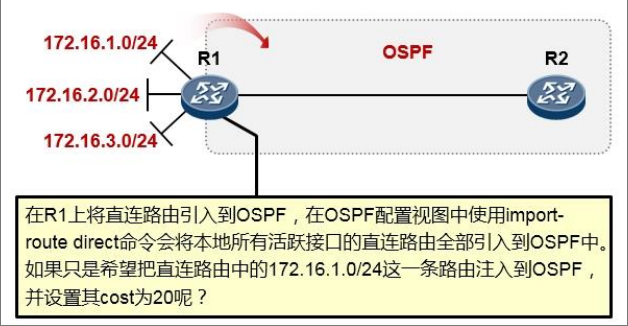

```shell
# 定义一个acl2000，用于匹配需要放行的路由：
[R1] acl 2000
[R1-acl-basic-2000] rule permit source 172.16.1.0 0.0.0.0
[R1-acl-basic-2000] quit
# 创建一个route-policy，名字叫RP，同时配置第一个节点，节点编号为10：
[R1] route-policy RP permit node 10
[R1-route-policy] if-match acl 2000 # 在节点10中，定义了一个if-match子句，调用acl 2000
[R1-route-policy] apply cost 20 # 在节点10中，定义了一个apply子句，设置cost为20
[R1] ospf 1
[R1-ospf-1] import-route direct route-policy RP # 在ospf注入直连路由的时候调用这个route-policy
```
由于`route-policy`在末尾隐含“拒绝所有”的节点，因此`172.16.2.0/24`及`172.16.3.0/24`路由因为没有满足任何节点的`if-match`语句，从而不被注入到 OSPF 中。
### IP-Prefix
在部署路由策略的过程中，我们往往需要通过一些手段“抓取”路由，从而能够针对特定的路由来执行相应的策略，以实现差异化。在“抓取”路由的工具中，ACL 无疑是最常用的工具之一。

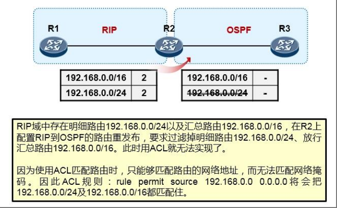

上面这个环境，ACL 就无能为力了。因为 ACL 只能够匹配路由前缀的网络地址部分，无法匹配路由前缀的网络掩码（或者说前缀长度）。准确的说，一条路由前缀是包含网络地址和网络掩码（前缀长度）的，对于`192.168.1.0`这算不上一条完整的路由，应该采用`192.168.1.0 255.255.255.0`或者`192.168.1.0/24`的方式呈现，这才是一条完整路由。而只要网络地址或者网络掩码中有任何一项不同，这就是两条不同的路由了，例如`192.168.1.0/24`和`192.168.1.0/25`，这就是两条不同的路由。

ACL 是无法匹配路由前缀的掩码部分的，因此上图所示的需求用 ACL 是无法完成的。这里顺便多嘴一句，如果使用 Basic ACL 匹配路由，那么建议在书写 ACL 时，反掩码使用`0.0.0.0`，否则会造成匹配不精确的现象。

例如要匹配`192.168.1.0/24`这条路由，如果 ACL 的`rule`这么写：
```shell
rule permit source 192.168.1.0 0.0.0.255
```
这事实上是不严谨的，因为它将`192.168.1.0、192.168.1.1、192.168.1.2、192.168.1.3`…………等众多网络地址全匹配住了。也就是说，上面的`0.0.0.255`，并不能用于匹配网络掩码`255.255.255.0`，它只不过是与前面的`192.168.1.0`组合，并用于匹配网络地址而已。所以，建议这么写：
```shell
rule permit source 192.168.1.0 0.0.0.0
# 或者：
rule permit source 192.168.1.0 0
```
#### IP-Prefix（IP前缀列表）
1. IP 前缀列表匹配路由的可控性比 ACL 高得多，也更为灵活；
2. IP 前缀列表可匹配路由前缀中的网络地址及网络掩码（前缀长度），增强了匹配的精确度；
3. IP 前缀列表除了能够匹配具体的网络掩码长度，还能够匹配掩码长度范围，非常灵活。
4. 一个 IP 前缀列表可以包含一个或多个表项（语句），在匹配过程中依序进行计算。表项中的索引号（序号）决定了每个表项在整个 IP 前缀列表中的位置。

#### IP前缀列表的配置
创建一个 IP 前缀列表的配置如下：
```shell
[Huawei] ip ip-prefix name [ index index-number ] { permit | deny } ip-address mask-length [ greater-equal greaterequal-value ] [ less-equal less-equal-value ]
```
* `name`参数是本 IP 前缀列表的名称。
* `index`关键字及参数指示本表项在本 IP 前缀列表中的序号（或索引号），该关键字及参数是可选的。缺省情况下，该序号值按照配置先后顺序依次递增，每次加 10，第一个序号值为 10。
* `permit`及`deny`关键字用于配置本表项的匹配模式。
* `ip-address mask-length`参数用于分别指定 IP 地址及掩码长度。
* `[ greater-equal greater-equal-value ] [ less-equal less-equal-value ]`是可选配置，用于指定掩码长度的范围。
  如果在命令中只指定了`greater-equal`，则前缀范围为`[greater-equal-value，32]`；
  如果在命令中只指定了`less-equal`，则前缀范围为`[mask-length，less-equal-value]`。

IP 前缀列表由列表名称进行标识，每个 IP 前缀列表可以包含多个表项。下面的配置展示了一个名为`abcd`，它包含两个表项：
```shell
[Huawei] ip ip-prefix abcd index 10 deny 1.0.0.0 8
[Huawei] ip ip-prefix abcd index 20 permit 2.0.0.0 8
```
在 IP 前缀列表的匹配过程中，设备按索引号升序依次检查各个表项，只要有一个表项满足条件，就不再去匹配后续表项。

以`ip ip-prefix abcd index 10 deny 1.0.0.0 8`为例，这个表项属于 IP 前缀列表`abcd`，它的索引号为 10，并且匹配模式为拒绝，在该表项中 IP 前缀为`1.0.0.0`，掩码长度为 8，因此这个表项用于匹配路由`1.0.0.0/8`，只有该路由才会被匹配，并且该路由将会被该表项过滤（`deny`）。这个命令中没有定义掩码长度范围。 

如果一条路由无法被一个 IP 前缀列表中的所有表项匹配，那么这条路由被视为被该前缀列表拒绝通过。也就是说，一个 IP 前缀列表的末尾，隐含着一条拒绝所有的表项。
#### 配置示例
匹配某条特定路由`192.168.1.0/24`：
```shell
ip ip-prefix ipprefix1 192.168.1.0 24
```
匹配默认路由`0.0.0.0/0`：
```shell
ip ip-prefix ipprefix2 permit 0.0.0.0 0
```
注意：IP 前缀为`0.0.0.0`时表示通配地址。此时不论掩码指定为多少，都表示掩码长度范围内的所有路由全被匹配。

匹配所有`/32`主机路由：
```shell
ip ip-prefix ipprefix3 permit 0.0.0.0 0 greater-equal 32
```
匹配任意路由(`any`)：
```shell
ip ip-prefix ipprefix4 permit 0.0.0.0 0 less-equal 32
```
匹配以下路由（用最精确最简洁的方式）：
```shell
192.168.4.0/24
192.168.5.0/24
192.168.6.0/24
192.168.7.0/24
```
```shell
ip ip-prefix abcd permit 192.168.4.0 22 greater-equal 24 less-equal 24
```
上面这条命令的意思是，允许那些网络地址的前`22bit`与`192.168.4.0`的前`22bit`相同，并且网络掩码长度为 24 的路由。注意此处`greater-equal 24 less-equal 24`要求网络掩码长度既大于或等于 24，又小于或等于 24，因此只能是 24。
#### 实验验证
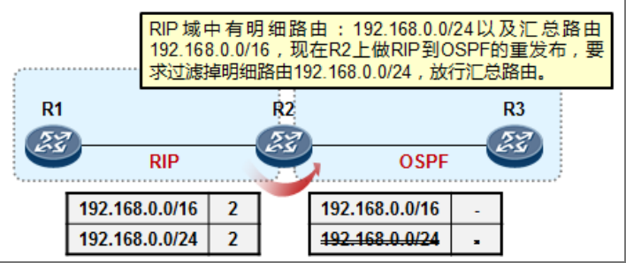

```shell
ip ip-prefix 1 permit 192.168.0.0 16 greater-equal 16 less-equal 16
route-policy RP permit node 10
if-match ip-prefix 1
ospf 1
import-route rip 1 route-policy RP
```
在以上配置中，我们首先创建了一个名称为 1 的 IP 前缀列表，该列表中包含一个表项，这个表项要求被匹配路由的网络地址的前`16bit`与`192.168.0.0`的前`16bit`相同，并且路由的网络掩码长度为 16，因此该表项只能用于匹配路由`192.168.0.0/16`。由于该表项的匹配模式为`permit`，因此路由`192.168.0.0/16`被该 IP 前缀列表允许。

随后我们定义了一个`route-policy RP`，它包含一个节点，且该节点的匹配模式为`permit`。该节点调用了IP前缀列表1，如此一来，`192.168.0.0/16`将被`route-policy RP`所允许，而由于`route-policy`的末尾隐含着一个拒绝所有的节点，因此对于`route-policy RP`而言，只允许了路由`192.168.0.0/16`。