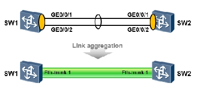
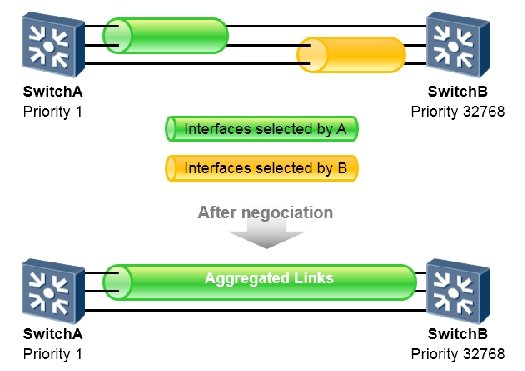
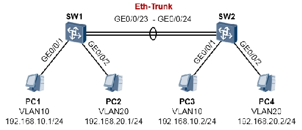
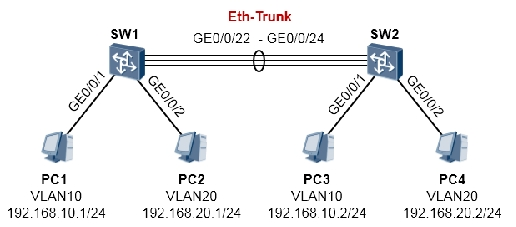

在一个网络中，某些关键链路承载的流量可能非常大，链路的负载可能会很高，带宽就会成为数据传输的瓶颈。如果增加带宽，那就需要增加硬件投入，例如将链路从千兆电口换成万兆光纤接口，这就不得不增加成本。另一个问题是单点故障的问题，一旦这根链路发生故障，那么不可避免的将影响到网络的可达性。

以太网链路聚合技术（`Link Aggregation`）是一种通用的以太网技术。通过该技术，我们能够将多条以太网链路进行“捆绑”，捆绑之后的这些物理链路就形成了逻辑上的一条新的链路（`Eth-Trunk`），这条聚合链路不仅仅在带宽上成倍的增加，还同时提供了负载均衡及链路冗余。

有人可能会问，为啥要那么麻烦，交换机之间多连几根线不就完了么？多连几根线实际上就多创造了几个环路，这时由于生成树的作用，必然会阻塞掉几个端口，如此一来仍然只有一条链路在转发数据，还是达不到我们的预期。但是使用链路聚合功能，则可将这几根链路捆绑成逻辑上的一条，交换机会将捆绑后的这根聚合链路当做一条链路来对待，自然也就不存在环路的问题了。



上图中，两台交换机的`GE0/0/1`到`GE0/0/2`接口两两对接，如果在 SW1 及 SW2 上分别将自己的`GE0/0/1`到`GE0/0/2`接口进行捆绑，则会产生出一个聚合接口，也就是`Eth-trunk`接口。

链路聚合技术能够部署在交换机之间、防火墙之间、交换机与防火墙之间、交换机与特定的服务器之间等等。

华为交换机上的`Eth-trunk`支持两种工作方式：手工负载分担（`Manual load-balance`）及 LACP（`link Aggregation Control Protocol`）。
## 手工负载分担
手工负载分担方式允许在聚合组中手工加入多个成员接口，并且所有的接口均处于转发状态，分担负载的流量。在这种模式下，`Eth-Trunk`的创建、成员接口的加入都需要手工配置完成，没有 LACP 协议报文的参与。手工负载分担模式通常用在对端设备不支持 LACP 协议的情况下。

### 基础配置命令
```shell
# 创建一个聚合接口Eth-Trunk
[SW]interface Eth-Trunk 1
# 将聚合接口的工作方式设置为手工负载分担方式
# 聚合链路两端的设备需使用相同的工作方式
[SW-Eth-Trunk1]mode manual load-balance
# 添加物理成员接口GE0/0/1、GE0/0/2及GE0/0/3添加到Eth-Trunk 1中
[SW]interface GigabitEthernet0/0/1
[SW-GigabitEthernet0/0/1]eth-trunk 1
[SW]interface GigabitEthernet0/0/2
[SW-GigabitEthernet0/0/2]eth-trunk 1
[SW]interface GigabitEthernet0/0/3
[SW-GigabitEthernet0/0/3]eth-trunk 1

# （可选）配置Eth-trunk成员链路的负载分担模式
[SW-Eth-Trunk1]load-balance ?
  dst-ip       According to destination IP hash arithmetic
  dst-mac      According to destination MAC hash arithmetic
  src-dst-ip   According to source/destination IP hash arithmetic
  src-dst-mac  According to source/destination MAC hash arithmetic
  src-ip       According to source IP hash arithmetic
  src-mac      According to source MAC hash arithmetic
# （可选）为保证Eth-Trunk接口的状态和带宽，可以设置活动接口数的阈值（缺省为1），以减小成员链路的状态变化带来的影响。
# 设置活动接口数下限阈值是为了保证最小带宽，当前活动链路数目小于下限阈值时，Eth-Trunk接口的状态转为Down：
[SW-Eth-Trunk1]least active-linknumber ?
  INTEGER<1-8>  The data of least active-linknumber
```
## LACP
LACP 方式是一种利用 LACP 协议进行聚合参数协商、确定活动接口和非活动接口的链路聚合方式。该模式下，需手工创建`Eth-Trunk`，手工加入`Eth-Trunk`成员接口，但是，由 LACP 协议协商确定活动接口和非活动接口。

LACP 模式也称为 M∶N 模式。这种方式同时可以实现链路负载分担和链路冗余备份的双重功能。在链路聚合组中 M 条链路处于活动状态，这些链路负责转发数据并进行负载分担，另外 N 条链路处于非活动状态作为备份链路，不转发数据。当 M 条链路中有链路出现故障时，系统会从 N 条备份链路中选择优先级最高的接替出现故障的链路，同时这条替换故障链路的备份链路状态变为活动状态开始转发数据。

LACP 模式与手工负载分担模式的主要区别为：LACP 模式有备份链路，而手工负载分担模式所有成员接口均处于转发状态，分担负载流量。此外，LACP 模式下，交换机之间会交互 LACP 报文。

LACP 模式中有一个主动、被动端的概念。设备 LACP 优先级较高（值越小越优）的一端为主动端，设备 LACP 优先级较低的一端为被动端。如果两端设备的 LACP 优先级一样时，则 MAC 地址小的胜出。



上图中，SwitchA 及 SwitchB 之间部署了`Eth-Trunk`，该`Eth-Trunk`中包含三条直连链路，并且采用的是 LACP 方式。两者会交互 LACP 报文使得聚合链路能够协商建立。A 和 B 会比较两者的设备 LACP 优先级，值最小的胜出成为主动端，这里假设 A 胜出。从图中我们看到 A 选择了上面两条链路作为活动链路，而 B 选择了下面两条链路，由于 A 是主动端，因此最终 AB 之间建立起来的聚合链路中的活动链路由 A 来确定，也就是上面两条链路成为活动链路。

### 基础配置命令
```shell
# 创建Eth-Trunk，并将工作方式修改为LACP
[Huawei]interface eth-trunk 1
# 缺省情况下，Eth-Trunk的工作模式为手工负载分担方式
[Huawei]mode lacp-static
# 添加成员接口到Eth-Trunk中（根据实际情况添加）
[Huawei]interface GigabitEthernet0/0/1
[Huawei-GigabitEthernet0/0/1]eth-trunk 1
[Huawei]interface GigabitEthernet0/0/2
[Huawei-GigabitEthernet0/0/2]eth-trunk 1
[Huawei]interface GigabitEthernet0/0/3
[Huawei-GigabitEthernet0/0/3]eth-trunk 1
#（可选）配置Eth-trunk成员链路的负载分担模式
[Huawei-Eth-Trunk1]load-balance ?

#（可选）配置设备LACP优先级
[Huawei]lacp priority ?
# 系统LACP优先级值越小优先级越高，缺省情况下，系统LACP优先级为 32768。
# 在两端设备中选择系统 LACP 优先级较小一端作为主动端，如果系统 LACP 优先级相同则选择MAC地址较小的一端作为主动端。

#（可选）配置接口LACP优先级
[Huawei-GigabitEthernet0/0/1]lacp priority ?
# 缺省情况下，接口的LACP优先级是 32768。取值越小，表明接口的LACP优先级越高。优先级越高的接口越有可能成为活动的成员接口。

#（可选）配置活动接口数上限阈值
[Huawei-Eth-Trunk1]max active-linknumber ？
# 配置链路聚合活动接口数上限阈值，缺省情况下，活动接口数上限阈值为8。
# 配置LACP模式活动接口数目上限阈值可以控制Eth-Trunk中活动接口的最大数M，剩余的成员接口处于备份状态。

#（可选）配置活动接口数下限阈值
[Huawei-Eth-Trunk1]least active-linknumber ？
# 配置链路聚合活动接口数下限阈值，缺省情况下，活动接口数下限阈值为1。
# 配置LACP模式活动接口数目下限阈值可以决定Eth-Trunk中活动接口数的最小值，如果静态模式下活动接口数目小于该值，
# Eth-Trunk的接口状态将变为DOWN的状态。

#（可选）使能LACP抢占并配置抢占等待时间
[Huawei-Eth-Trunk1]lacp preempt enable
[Huawei-Eth-Trunk1]lacp preempt delay ？
# 缺省情况下，LACP抢占功能处于禁止状态。缺省情况下，LACP抢占等待时间为30秒。
# 使能LACP抢占功能可以保持接口LACP优先级最高的接口为活动接口。例如：当一条高优先级的接口因故障切换为非活动状
# 态而后又恢复时，如果使能了抢占，则高优先级接口将重新成为活动接口；如果未使能抢占，该接口不能重新成为活动接口。
```
## 基础实验
### 手工负载分担模式

SW1 及 SW2 通过`GE0/0/23`及 24 口互联，配置`Eth-trunk`将这两条链路进行捆绑。捆绑后的链路配置为`Trunk`模式，使得两台交换机下相同 VLAN 内的用户能够互访，也就是 PC1 与 PC3 能够互访；PC2 与 PC4 也能够互访。
```shell
[SW1] vlan batch 10 20
[SW1] interface GigabitEthernet 0/0/1
[SW1-GigabitEthernet0/0/1] port link-type access
[SW1-GigabitEthernet0/0/1] port default vlan 10
[SW1] interface GigabitEthernet 0/0/2
[SW1-GigabitEthernet0/0/2] port link-type access
[SW1-GigabitEthernet0/0/2] port default vlan 20
# 创建聚合接口eth-trunk1，将eth-trunk设置为手工负载均衡方式，在该模式中被聚合的链路都将会转发数据：
[SW1] interface Eth-Trunk 1
[SW1-Eth-Trunk1] mode manual load-balance
# 将接口GE0/0/23及GE0/0/24添加到Eth-trunk1中：
[SW1] interface GigabitEthernet 0/0/23
[SW1-GigabitEthernet0/0/23] eth-trunk 1
[SW1] interface GigabitEthernet 0/0/24
[SW1-GigabitEthernet0/0/24] eth-trunk 1
# 由于eth-trunk1聚合接口需要承载多个VLAN的二层流量，因此需配置为trunk类型。
# 注意一旦聚合接口配置完成后，我们的针对该逻辑接口的相关配置就在interface eth-trunk中进行，
# 也就是在产生的聚合接口中完成，而不是在GE0/0/23或GE0/0/24口的接口中进行：
[SW1] interface Eth-Trunk 1
[SW1-Eth-Trunk1] port link-type trunk
[SW1-Eth-Trunk1] port trunk allow-pass vlan 10 20
```
```shell
[SW2] vlan batch 10 20
[SW2] interface GigabitEthernet 0/0/1
[SW2-GigabitEthernet0/0/1] port link-type access
[SW2-GigabitEthernet0/0/1] port default vlan 10
[SW2] interface GigabitEthernet 0/0/2
[SW2-GigabitEthernet0/0/2] port link-type access
[SW2-GigabitEthernet0/0/2] port default vlan 20
[SW2-GigabitEthernet0/0/2] quit
[SW2] interface Eth-Trunk 1
[SW2-Eth-Trunk1] mode manual load-balance
[SW2-Eth-Trunk1] quit
[SW2] interface GigabitEthernet 0/0/23
[SW2-GigabitEthernet0/0/23] eth-trunk 1
[SW2] interface GigabitEthernet 0/0/24
[SW2-GigabitEthernet0/0/24] eth-trunk 1
[SW2-GigabitEthernet0/0/24] quit
[SW2] interface Eth-Trunk 1
[SW2-Eth-Trunk1] port link-type trunk
[SW2-Eth-Trunk1] port trunk allow-pass vlan 10 20
```
```shell
[SW1]display eth-trunk 1
Eth-Trunk1's state information is:
WorkingMode: NORMAL         Hash arithmetic: According to SIP-XOR-DIP         
Least Active-linknumber: 1  Max Bandwidth-affected-linknumber: 8              
Operate status: up          Number Of Up Port In Trunk: 2                     
--------------------------------------------------------------------------------
PortName                      Status      Weight 
GigabitEthernet0/0/23         Up          1      
GigabitEthernet0/0/24         Up          1      
```
### LACP方式


SW1 及 SW2 的`GE0/0/22`到`GE0/0/24`口分别互联，将这三条链路捆绑为`Eth-Trunk`，使用 LACP 方式，SW1 为主动端，在该聚合链路中，两条链路为活动链路，其余一条做备份。
```shell
[SW1] vlan batch 10 20
[SW1] interface gigabitEthernet 0/0/1
[SW1-GigabitEthernet0/0/1] port link-type access
[SW1-GigabitEthernet0/0/1] port default vlan 10
[SW1] interface gigabitEthernet 0/0/2
[SW1-GigabitEthernet0/0/2] port link-type access
[SW1-GigabitEthernet0/0/2] port default vlan 20
#创建聚合链路eth-trunk1，将eth-trunk设置为LACP模式，将最大活跃链路数量设置为2：
[SW1] interface Eth-Trunk 1
[SW1-Eth-Trunk1] mode lacp-static
[SW1-Eth-Trunk1] max active-linknumber 2
#将接口GE0/0/22、GE0/0/23及GE0/0/24添加到Eth-trunk1中：
[SW1] interface gigabitEthernet 0/0/22
[SW1-GigabitEthernet0/0/22] eth-trunk 1
[SW1] interface gigabitEthernet 0/0/23
[SW1-GigabitEthernet0/0/23] eth-trunk 1
[SW1] interface gigabitEthernet 0/0/24
[SW1-GigabitEthernet0/0/24] eth-trunk 1
#将SW1的设备LACP优先级设置为1，使得其成为主动端：
[SW1] lacp priority 1
#将聚合接口Eth-trunk1配置为trunk类型，并且放通VLAN10及VLAN20：
[SW1] interface Eth-Trunk 1
[SW1-Eth-Trunk1] port link-type trunk
[SW1-Eth-Trunk1] port trunk allow-pass vlan 10 20
```
```shell
[SW2] vlan batch 10 20
[SW2] interface gigabitEthernet 0/0/1
[SW2-GigabitEthernet0/0/1] port link-type access
[SW2-GigabitEthernet0/0/1] port default vlan 10
[SW2] interface gigabitEthernet 0/0/2
[SW2-GigabitEthernet0/0/2] port link-type access
[SW2-GigabitEthernet0/0/2] port default vlan 20
[SW2-GigabitEthernet0/0/2] quit
[SW2] interface Eth-Trunk 1
[SW2-Eth-Trunk1] mode manual lacp-static
[SW2-Eth-Trunk1] quit
[SW2] interface gigabitEthernet 0/0/22
[SW2-GigabitEthernet0/0/22] eth-trunk 1
[SW2] interface gigabitEthernet 0/0/23
[SW2-GigabitEthernet0/0/23] eth-trunk 1
[SW2] interface gigabitEthernet 0/0/24
[SW2-GigabitEthernet0/0/24] eth-trunk 1
[SW2-GigabitEthernet0/0/24] quit
[SW2] interface Eth-Trunk 1
[SW2-Eth-Trunk1] port link-type trunk
[SW2-Eth-Trunk1] port trunk allow-pass vlan 10 20
```
```shell
[SW1]display eth-trunk 1
Eth-Trunk1's state information is:
Local:
LAG ID: 1                   WorkingMode: STATIC                               
Preempt Delay: Disabled     Hash arithmetic: According to SIP-XOR-DIP         
System Priority: 1          System ID: 4c1f-cc45-5ec0                         
Least Active-linknumber: 1  Max Active-linknumber: 2                          
Operate status: up          Number Of Up Port In Trunk: 2                     
--------------------------------------------------------------------------------
ActorPortName          Status   PortType PortPri PortNo PortKey PortState Weight
GigabitEthernet0/0/22  Selected 1GE      32768   23     305     10111100  1     
GigabitEthernet0/0/23  Selected 1GE      32768   24     305     10111100  1     
GigabitEthernet0/0/24  Unselect 1GE      32768   25     305     10100000  1     

Partner:
--------------------------------------------------------------------------------
ActorPortName          SysPri   SystemID        PortPri PortNo PortKey PortState
GigabitEthernet0/0/22  32768    4c1f-cc2d-77d4  32768   23     305     10111100
GigabitEthernet0/0/23  32768    4c1f-cc2d-77d4  32768   24     305     10111100
GigabitEthernet0/0/24  32768    4c1f-cc2d-77d4  32768   25     305     10100000
    
```
在上述输出中，我们可以看到 SW1 的`eth-trunk1`聚合接口的状态。`Operate status`显示整个聚合接口的状态为 UP。而由于我们设置了`max active-linknumber 2`，因此三个成员接口中，仅有两个接口（两条链路）是活跃的，它们会转发数据，而剩下的接口则作为备份。我们看到`GE0/0/22`及`GE0/0/23`是`Select`状态，因此它们是活跃接口，而`GE0/0/24`是`Unselect`状态，则它们是非活跃的备份接口。因为 SW1 是主动端设备，因此由它决定哪些接口是活跃，哪些是非活跃的。