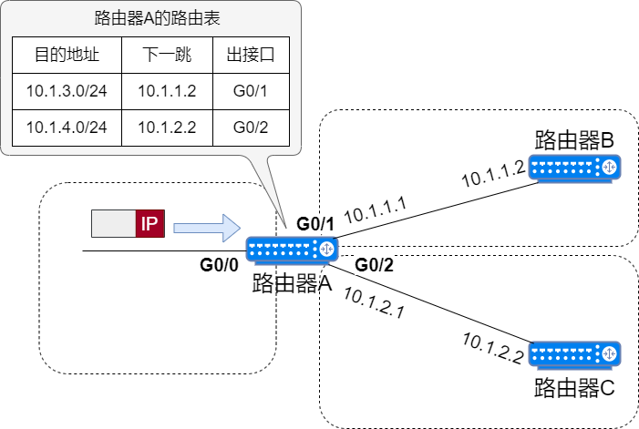

## 什么是静态路由
静态路由是由网络管理员手动在路由器上设置的路由规则，它不会改变。静态路由会告诉路由器如何将数据包从一个网络转发到另一个网络。

| 目的地址           | 来源   | 下一跳       |
|----------------|------|-----------|
| 198.48.10.0/24 | 静态路由 | 192.1.1.1 |
| 202.16.88.0/24 | OSPF | 10.0.12.1 |

路由器在收到数据包时，会识别目的 IP 地址的网络号，来查询路由表的路由条目，根据最长匹配的路由条目，来判断应该从哪个接口转发数据包。路由表中有匹配的路由条目才会发送数据，无匹配的路由条目则直接丢弃。

