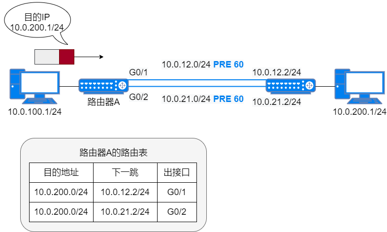
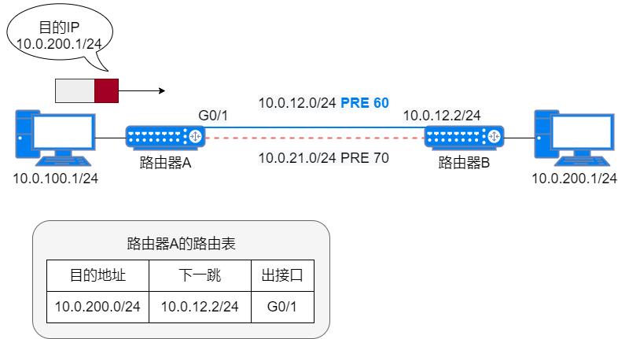
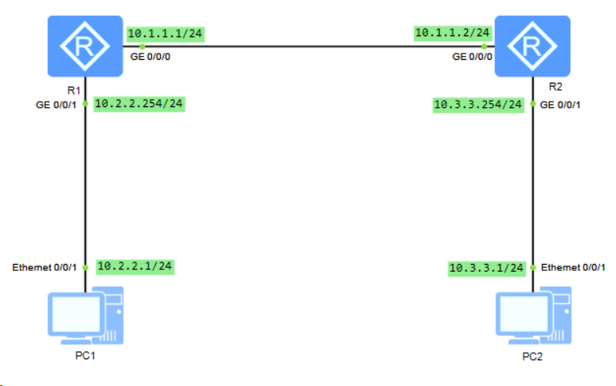
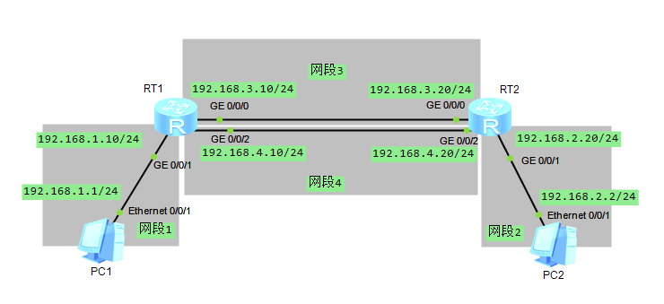

## 静态路由概念
静态路由是需要手动配置的特殊路由。包括 5 个主要的参数：目的 IP 地址、子网掩码、下一跳 IP 地址、出接口、优先级。

当目的 IP 地址和子网掩码都为 0 时，表示静态缺省路由。

根据不同的出接口类型，在配置静态路由时，可指定出接口，也可指定下一跳 IP 地址，还可同时指定出接口和下一跳 IP 地址。
* 对于点对点类型的接口，只需指定出接口。在点对点网络中，对端是唯一的，指定了发送接口即隐含指定了下一跳 IP 地址，这时认为与该接口相连的对端接口地址就是路由的下一跳 IP 地址。
* 对于 NBMA(`Non Brodcast Multiple Access`，非广播多路访问) 类型的接口，只需配置下一跳 IP 地址。因为除了配置 IP 路由外，这类接口还需在链路层建立 IP 地址到链路层地址的映射，相当于指定了出接口。
* 对于广播类型的接口，必须指定下一跳 IP 地址。

静态路由的优先级值越小，优先级越高。配置到达相同目的地的多条静态路由，如果指定相同优先级，则可实现负载分担；指定不同优先级，可实现路由备份。
## 静态路由特点
* 手动配置
* 路由路径相对固定
* 不可通告性：静态路由信息默认情况下是私有的，不会主动通告给其他路由器。可以在本地设备的动态路由协议中引入静态路由，然后以动态路由协议通告出去。
* 单向性：仅为数据提供沿着下一跳的方向进行路由，不提供反向路由。如果想让源节点和目的节点进行双向通信，就需要同时配置回程静态路由。
* 接力性：如果某条静态路由中间经过的跳数大于 1，则必须在除最后一个路由器外的其他路由器上依次配置到达相同目标节点的静态路由。
* 迭代性：静态路由的下一跳可以是路径中其他路由器任意的一个接口，只要能保证到达下一跳就行。
* 适用小型网络：如果网络结构复杂，就需要手动配置很多静态路由，工作量大，容易出错。

## 静态路由特性
静态路由的主要特性有：
* 静态缺省路由
* 静态路由与 BFD 联动
* 静态路由与 NQA 联动
* 静态路由优先级
* 静态路由永久发布

### 静态缺省路由
缺省路由分静态缺省路由和动态缺省路由两类。简单来说缺省路由是没有在路由表中找到匹配的路由表项时才使用的候补路由。如果报文的目的地址不能与路由表的任何路由表项进行匹配，那么该报文将最终选取缺省路由尝试转发。如果路由器中没有配置缺省路由，且报文的目的地址不在路由表中，那么该报文将被丢弃，并向源端返回一个 ICMP 报文，报告该目的地址或网络不可达。

在路由表中，缺省路由以到网络`0.0.0.0`(掩码也为`0.0.0.0`)的路由形式出现。通常情况下，管理员可以通过手动方式配置缺省静态路由，也可以使动态路由协议生成动态缺省路由，如 OSPF 和 IS-IS。
### 静态路由与 BFD 联动
与动态路由协议不同，静态路由自身没有检测和网络收敛机制，当网络发生故障的时候，需要管理员介入。为了能提高故障发现的及时性，可通过静态路由与 BFD(双向转发检测) 联动特性进行绑定，利用 BFD 会话来快速地检测静态路由所在链路的状态实现毫秒级快速主、备链路切换。

具体过程：
1. 当某条静态路由上的 BFD 会话检测到链路故障时，BFD 会将故障上报系统，促使该路由失效，使该路由在 IP 路由表中不可见。
2. 当某条静态路由上的 BFD 会话检测到故障的链路重新建立成功时，BFD 会上报系统，重新激活该路由，使该路由重新出现在 IP 路由表中。

### 静态路由与 NQA 联动
在一些不支持 BFD 的链路环境中，可以通过把静态路由与 NQA(网络质量分析) 特性进行绑定来实现链路故障检测和快速的主备链路切换，且只要求互通设备的其中端支持 NOA 即可，不受二层设备的限制。在链路发生故障后，NOA 测试例可以快速地检测到链路的变化，并且在 IP 路由表中把与该 NQA 测试例联动的静态路由删除，从而影响流量的转发。

静态路由与NOA联动特性的功能：
1. 如果 NQA 测试例检测到链路故障，路由器将这条静态路由设置为“非激活”状态(此条路由不可用，从 IP 路由表中删除)。
2. 如果 NQA 测试例检测到链路恢复正常，路由器将这条静态路由设置为“激活”状态(此条路由可用，添加到 IP 路由表)。

:::info
静态路由与 NQA 联动时仅采用 ICMP 测试例来检测源端到目的端的路由是否可达，且每条静态路由只可以绑定一个 NOA 测试例。
:::
### 静态路由优先级
可以为不同静态路由配置不同的优先级，优先级值越小，对应的静态路由优先级越高。通过为多条到达同一目的地址的静态路由配置相同或不同的优先级，则又可分别实现多条相同目的地址的静态路由的负载分担和路由备份。

#### 负载分担


如果为到达相同目的地址的多条静态路由指定相同优先级，则可实现负载分担。如图，从路由器 A 到路由器 B 有两条优先级相同的静态路由，此时两条路由都会出现在路由表上，同时进行数据的转发。
#### 路由备份



如果为多条到达相同目的地的多条静态路由指定不同优先级，则可实现路由备份。如图，从路由器 A 到路由器 B 有两条优先级不同的静态路由。优先级较高的路由作为主路由，所在链路作为主链路。优先级较低的作为备份路由，该路由所在链路作为备份链路。

在正常情况下，主路由承担数据转发业务。备份路由不在路由表中体现。
1. 主链路上出现故障时，主路由在路由表中被删除，备份路由被激活，备份链路承担数据转发业务。
2. 主链路恢复正常后，主路由重新被激活，主链路承担数据转发业务。备份路由在路由表中删除。因此这条备份路由也叫浮动静态路由。

### 静态路由永久发布
静态路由永久发布可以为客户提供一种低成本、部署简单的链路检测机制，并提高与其他厂商设备的兼容性。在客户希望确定业务流量的转发路径，不希望流量从其他路径穿越时，静态路由永久发布可以通过`Ping`静态路由目的地址的方式来检测链路的有效性而达到业务监控的目的。配置永久发布属性后，之前无法发布的静态路由仍然被优选并添加到 IP 路由表中。具体可以分为以下两种情况。
1. 静态路由配置了出接口，且出接口的 IP 地址存在时，无论出接口的状态是`Up`还是`Down`，只要配置了永久发布属性，则该静态路由都会被优选并添加到路由表。
2. 静态路由没有配置出接口时，无论静态路由是否能迭代到出接口，只要配置了永久发布属性，路由都会被优选并添加到 IP 路由表中。

这样，通过控制静态路由的优先级和前缀长度，使`Ping`报文始终通过静态路由转发就可以检测出链路的有效性。但是，该特性不判断路由是否可达，而是一直会将静态路由保留在 IP 路由表中，如果实际路径不可达，静态路由可能形成黑洞路由。

## 静态路由配置常用命令
```shell
# ip route-static ip-address {mask|mask-length} {nexthop-address|interface-type interface-number} [preference preference] [permanent]
# 静态路由基本配置
[Router]ip route-static 192.168.1.0 24 192.168.3.254
# 配置静态路由永久发布
[Router]ip route-static 192.168.1.0 permanent
# 将目的地址为192.168.1.0/24，下一跳地址为 192.168.3.254 的静态路由与名为 test 的 BFD 会话进行绑定
[Router]ip route-static 192.168.1.0 24 192.168.3.254 track bfd-session test
# 配置浮动路由
[Router]ip route-static 192.168.1.0 24 192.168.3.254 preference 50
# 配置静态路由与 NQA 联动
[Router]ip route-static 192.168.1.0 24 192.168.3.254 track nqa aa bb
```
## 静态路由配置实例
### 基本配置
#### 实验拓扑

#### 实验要求
* PC1 能`ping`通 PC2

#### 实验步骤
1. 各路由器及 PC 配置 IP 地址（省略），并进行检查。
```shell
[R1]display ip interface brief 
*down: administratively down
^down: standby
(l): loopback
(s): spoofing
The number of interface that is UP in Physical is 3
The number of interface that is DOWN in Physical is 1
The number of interface that is UP in Protocol is 3
The number of interface that is DOWN in Protocol is 1

Interface                         IP Address/Mask      Physical   Protocol  
GigabitEthernet0/0/0              10.1.1.1/24          up         up        
GigabitEthernet0/0/1              10.2.2.254/24        up         up        
GigabitEthernet0/0/2              unassigned           down       down      
NULL0                             unassigned           up         up(s)   
```
```shell
[R2]display ip interface brief 
*down: administratively down
^down: standby
(l): loopback
(s): spoofing
The number of interface that is UP in Physical is 3
The number of interface that is DOWN in Physical is 1
The number of interface that is UP in Protocol is 3
The number of interface that is DOWN in Protocol is 1

Interface                         IP Address/Mask      Physical   Protocol  
GigabitEthernet0/0/0              10.1.1.2/24          up         up        
GigabitEthernet0/0/1              10.3.3.254/24        up         up        
GigabitEthernet0/0/2              unassigned           down       down      
NULL0                             unassigned           up         up(s)   
```
2. R1 配置到达`10.3.3.0/24`网段的静态路由。
```shell
# 也可配静态缺省路由 ip route-static 0.0.0.0 0 10.1.1.2
[R1]ip route-static 10.3.3.0 24 10.1.1.2
[R1]display ip routing-table
Route Flags: R - relay, D - download to fib
------------------------------------------------------------------------------
Routing Tables: Public
         Destinations : 11       Routes : 11       

Destination/Mask    Proto   Pre  Cost      Flags NextHop         Interface

       10.1.1.0/24  Direct  0    0           D   10.1.1.1        GigabitEthernet0/0/0
       10.1.1.1/32  Direct  0    0           D   127.0.0.1       GigabitEthernet0/0/0
     10.1.1.255/32  Direct  0    0           D   127.0.0.1       GigabitEthernet0/0/0
       10.2.2.0/24  Direct  0    0           D   10.2.2.254      GigabitEthernet0/0/1
     10.2.2.254/32  Direct  0    0           D   127.0.0.1       GigabitEthernet0/0/1
     10.2.2.255/32  Direct  0    0           D   127.0.0.1       GigabitEthernet0/0/1
       10.3.3.0/24  Static  60   0          RD   10.1.1.2        GigabitEthernet0/0/0
      127.0.0.0/8   Direct  0    0           D   127.0.0.1       InLoopBack0
      127.0.0.1/32  Direct  0    0           D   127.0.0.1       InLoopBack0
127.255.255.255/32  Direct  0    0           D   127.0.0.1       InLoopBack0
255.255.255.255/32  Direct  0    0           D   127.0.0.1       InLoopBack0
```
3. 检查各个设备的路由表，发现 PC1 的报文可以发送到 PC2，但是 PC2 和 R2 没有回程路由，即 PC2 和 R2 没有到达 PC1 的路由表项，返程报文无法到达 PC1。
```shell
[R2]display ip routing-table 
Route Flags: R - relay, D - download to fib
------------------------------------------------------------------------------
Routing Tables: Public
         Destinations : 10       Routes : 10       

Destination/Mask    Proto   Pre  Cost      Flags NextHop         Interface

       10.1.1.0/24  Direct  0    0           D   10.1.1.2        GigabitEthernet0/0/0
       10.1.1.2/32  Direct  0    0           D   127.0.0.1       GigabitEthernet0/0/0
     10.1.1.255/32  Direct  0    0           D   127.0.0.1       GigabitEthernet0/0/0
       10.3.3.0/24  Direct  0    0           D   10.3.3.254      GigabitEthernet0/0/1
     10.3.3.254/32  Direct  0    0           D   127.0.0.1       GigabitEthernet0/0/1
     10.3.3.255/32  Direct  0    0           D   127.0.0.1       GigabitEthernet0/0/1
      127.0.0.0/8   Direct  0    0           D   127.0.0.1       InLoopBack0
      127.0.0.1/32  Direct  0    0           D   127.0.0.1       InLoopBack0
127.255.255.255/32  Direct  0    0           D   127.0.0.1       InLoopBack0
255.255.255.255/32  Direct  0    0           D   127.0.0.1       InLoopBack0
```
4. R2 配置到达`10.2.2.0/24`网段的静态路由。
```shell
# 也可配置静态缺省路由 ip route-static 0.0.0.0 0 10.1.1.1
[R2]ip route-static 10.2.2.0 24 10.1.1.1
[R2]display ip routing-table 
Route Flags: R - relay, D - download to fib
------------------------------------------------------------------------------
Routing Tables: Public
         Destinations : 11       Routes : 11       

Destination/Mask    Proto   Pre  Cost      Flags NextHop         Interface

       10.1.1.0/24  Direct  0    0           D   10.1.1.2        GigabitEthernet0/0/0
       10.1.1.2/32  Direct  0    0           D   127.0.0.1       GigabitEthernet0/0/0
     10.1.1.255/32  Direct  0    0           D   127.0.0.1       GigabitEthernet0/0/0
       10.2.2.0/24  Static  60   0          RD   10.1.1.1        GigabitEthernet0/0/0
       10.3.3.0/24  Direct  0    0           D   10.3.3.254      GigabitEthernet0/0/1
     10.3.3.254/32  Direct  0    0           D   127.0.0.1       GigabitEthernet0/0/1
     10.3.3.255/32  Direct  0    0           D   127.0.0.1       GigabitEthernet0/0/1
      127.0.0.0/8   Direct  0    0           D   127.0.0.1       InLoopBack0
      127.0.0.1/32  Direct  0    0           D   127.0.0.1       InLoopBack0
127.255.255.255/32  Direct  0    0           D   127.0.0.1       InLoopBack0
255.255.255.255/32  Direct  0    0           D   127.0.0.1       InLoopBack0
```
5. 在 PC1 上`ping` PC2，发现可以正常通信。

:::info
配置路由时，需要在通信双方都进行配置，不要忘记配置回程路由。
:::

### 浮动静态路由配置
#### 实验拓扑图



#### 实验要求
* 在静态路由基本配置的基础上，新增一条网线连接 R1 和 R2，使用网段：`10.4.4.0/24`
* 配置浮动静态路由
* 配置等价静态路由

#### 实验步骤
1. R1 的`GE0/0/2`口和 R2 的`GE0/0/2`口分别配置 IP 地址。（省略）
```shell
[R1]display ip interface brief 
*down: administratively down
^down: standby
(l): loopback
(s): spoofing
The number of interface that is UP in Physical is 4
The number of interface that is DOWN in Physical is 0
The number of interface that is UP in Protocol is 4
The number of interface that is DOWN in Protocol is 0

Interface                         IP Address/Mask      Physical   Protocol  
GigabitEthernet0/0/0              10.1.1.1/24          up         up        
GigabitEthernet0/0/1              10.2.2.254/24        up         up        
GigabitEthernet0/0/2              10.4.4.1/24          up         up        
NULL0                             unassigned           up         up(s)  
```
```shell
[R2]display ip interface brief 
*down: administratively down
^down: standby
(l): loopback
(s): spoofing
The number of interface that is UP in Physical is 4
The number of interface that is DOWN in Physical is 0
The number of interface that is UP in Protocol is 4
The number of interface that is DOWN in Protocol is 0

Interface                         IP Address/Mask      Physical   Protocol  
GigabitEthernet0/0/0              10.1.1.2/24          up         up        
GigabitEthernet0/0/1              10.3.3.254/24        up         up        
GigabitEthernet0/0/2              10.4.4.2/24          up         up        
NULL0                             unassigned           up         up(s)    
```
2. 通过修改静态路由优先级，使一条路由成为备份条目的路由，这就是**浮动静态路由**。在 R1 上配置从`10.2.2.0/24`到`10.3.3.0/24`的浮动静态路由，并且优先级设置为 50。

新增浮动路由前，查看 R1 上`10.3.3.0/24`的路由条目。
```shell
[R1]display ip routing-table
Route Flags: R - relay, D - download to fib
------------------------------------------------------------------------------
Routing Tables: Public
         Destinations : 15       Routes : 14       

Destination/Mask    Proto   Pre  Cost      Flags NextHop         Interface

       10.1.1.0/24  Direct  0    0           D   10.1.1.1        GigabitEthernet0/0/0
       10.1.1.1/32  Direct  0    0           D   127.0.0.1       GigabitEthernet0/0/0
     10.1.1.255/32  Direct  0    0           D   127.0.0.1       GigabitEthernet0/0/0
       10.2.2.0/24  Direct  0    0           D   10.2.2.254      GigabitEthernet0/0/1
     10.2.2.254/32  Direct  0    0           D   127.0.0.1       GigabitEthernet0/0/1
     10.2.2.255/32  Direct  0    0           D   127.0.0.1       GigabitEthernet0/0/1
       10.3.3.0/24  Static  60   0          RD   10.1.1.2        GigabitEthernet0/0/0
       10.4.4.0/24  Direct  0    0           D   10.4.4.1        GigabitEthernet0/0/2
       10.4.4.1/32  Direct  0    0           D   127.0.0.1       GigabitEthernet0/0/2
     10.4.4.255/32  Direct  0    0           D   127.0.0.1       GigabitEthernet0/0/2
      127.0.0.0/8   Direct  0    0           D   127.0.0.1       InLoopBack0
      127.0.0.1/32  Direct  0    0           D   127.0.0.1       InLoopBack0
127.255.255.255/32  Direct  0    0           D   127.0.0.1       InLoopBack0
255.255.255.255/32  Direct  0    0           D   127.0.0.1       InLoopBack0
```
新增浮动路由后，查看 R1 上`10.3.3.0/24`的路由条目。
```shell
[RT1]ip route-static 10.3.3.0 24 10.1.1.2 preference 50
[R1]display ip routing-table 
Route Flags: R - relay, D - download to fib
------------------------------------------------------------------------------
Routing Tables: Public
         Destinations : 15       Routes : 14       

Destination/Mask    Proto   Pre  Cost      Flags NextHop         Interface

       10.1.1.0/24  Direct  0    0           D   10.1.1.1        GigabitEthernet0/0/0
       10.1.1.1/32  Direct  0    0           D   127.0.0.1       GigabitEthernet0/0/0
     10.1.1.255/32  Direct  0    0           D   127.0.0.1       GigabitEthernet0/0/0
       10.2.2.0/24  Direct  0    0           D   10.2.2.254      GigabitEthernet0/0/1
     10.2.2.254/32  Direct  0    0           D   127.0.0.1       GigabitEthernet0/0/1
     10.2.2.255/32  Direct  0    0           D   127.0.0.1       GigabitEthernet0/0/1
       10.3.3.0/24  Static  50   0          RD   10.1.1.2        GigabitEthernet0/0/0
       10.4.4.0/24  Direct  0    0           D   10.4.4.1        GigabitEthernet0/0/2
       10.4.4.1/32  Direct  0    0           D   127.0.0.1       GigabitEthernet0/0/2
     10.4.4.255/32  Direct  0    0           D   127.0.0.1       GigabitEthernet0/0/2
      127.0.0.0/8   Direct  0    0           D   127.0.0.1       InLoopBack0
      127.0.0.1/32  Direct  0    0           D   127.0.0.1       InLoopBack0
127.255.255.255/32  Direct  0    0           D   127.0.0.1       InLoopBack0
255.255.255.255/32  Direct  0    0           D   127.0.0.1       InLoopBack0
```
路由优先级的值越小，静态路由的优先级越高，静态路由的默认路由优先级为 60。因此新增优先级为 50 的静态路由为主路由条目，原来优先级为 60 的静态路由为备份路由。
3. 当一台路由器上有两条不同的路径去往同一个网络的优先级相同的静态路由时，路由器就会同时使用这两条路由来转发流量，这就是**等价静态路由**。在 R1 上配置从`10.2.2.2`到`10.3.3.0/24`的等价静态路由，即使用默认优先级的值 60。
```shell
[R1]ip route-static 10.3.3.0 24 10.4.4.2
[R1]display ip routing-table 
Route Flags: R - relay, D - download to fib
------------------------------------------------------------------------------
Routing Tables: Public
         Destinations : 15       Routes : 15       

Destination/Mask    Proto   Pre  Cost      Flags NextHop         Interface

       10.1.1.0/24  Direct  0    0           D   10.1.1.1        GigabitEthernet0/0/0
       10.1.1.1/32  Direct  0    0           D   127.0.0.1       GigabitEthernet0/0/0
     10.1.1.255/32  Direct  0    0           D   127.0.0.1       GigabitEthernet0/0/0
       10.2.2.0/24  Direct  0    0           D   10.2.2.254      GigabitEthernet0/0/1
     10.2.2.254/32  Direct  0    0           D   127.0.0.1       GigabitEthernet0/0/1
     10.2.2.255/32  Direct  0    0           D   127.0.0.1       GigabitEthernet0/0/1
       10.3.3.0/24  Static  60   0          RD   10.4.4.2        GigabitEthernet0/0/2
                    Static  60   0          RD   10.1.1.2        GigabitEthernet0/0/0
       10.4.4.0/24  Direct  0    0           D   10.4.4.1        GigabitEthernet0/0/2
       10.4.4.1/32  Direct  0    0           D   127.0.0.1       GigabitEthernet0/0/2
     10.4.4.255/32  Direct  0    0           D   127.0.0.1       GigabitEthernet0/0/2
      127.0.0.0/8   Direct  0    0           D   127.0.0.1       InLoopBack0
      127.0.0.1/32  Direct  0    0           D   127.0.0.1       InLoopBack0
127.255.255.255/32  Direct  0    0           D   127.0.0.1       InLoopBack0
255.255.255.255/32  Direct  0    0           D   127.0.0.1       InLoopBack0
```
### 静态路由与BFD联动
#### 实验拓扑


#### 实验要求
* PC1 能`ping`通 PC2
* R1、R2 之间配置 BFD 实现毫秒级故障感知，提高收敛速度。

#### 配置步骤
1. 配置各路由器接口 IP 地址。（省略）
2. 配置 BFD 会话。
```shell
[R1]bfd
[R1-bfd]quit
[R1]bfd ?
  STRING<1-15>  BFD configuration name <1-15>
  <cr>          Please press ENTER to execute command 
[R1]bfd aa ?
  bind  Bind type
  <cr>  Please press ENTER to execute command 
[R1]bfd aa bind ?
  ldp-lsp     Information about LDP LSP
  mpls-te     Information about MPLS TE
  peer-ip     Set peer IP address
  static-lsp  Information about static LSP
[R1]bfd aa bind peer-ip 10.1.1.2 ?
  interface     Bind the outgoing-interface(only for single hop)
  source-ip     Set source IP address
  vpn-instance  Vpn instance name
  <cr>          Please press ENTER to execute command 
[R1]bfd aa bind peer-ip 10.1.1.2 
[R1-bfd-session-aa]discriminator ?
  local   Local discriminator
  remote  Remote discriminator
[R1-bfd-session-aa]discriminator local 10
[R1-bfd-session-aa]discriminator remote 20
[R1-bfd-session-aa]commit
[R1-bfd-session-aa]quit
```
```shell
[R2]bfd
[R2-bfd]quit
[R2]bfd bb bind peer-ip 10.1.1.1
[R2-bfd-session-bb]discriminator local 20
[R2-bfd-session-bb]discriminator remote 10
[R2-bfd-session-bb]commit
[R2-bfd-session-bb]quit
```
3. 在 R1 上配置到`10.3.3.0/24`的静态缺省路由，R2上配置到`10.2.2.0/24`的静态缺省路由。
```shell
[R1]ip route-static 0.0.0.0 0 10.1.1.2 ?
  description   Add or delete description of unicast static route
  inherit-cost  Inherit the cost of the iterated route
  permanent     Specifies route permanent
  preference    Specifies route preference
  tag           Specifies route tag
  track         Specify track object
  <cr>          Please press ENTER to execute command 
[R1]ip route-static 0.0.0.0 0 10.1.1.2 track ?
  bfd-session  Specify BFD session
  efm-state    Specify tracked ETHOAM state interface
  nqa          Specify NQA test instance
[R1]ip route-static 0.0.0.0 0 10.1.1.2 track bfd-session aa
```
```shell
[R2]ip route-static 0.0.0.0 0 10.1.1.1 track bfd-session bb
```
4. 检查 R1 和 R2 的路由表，发现 R1 和 R2 之间的链路已经建立了 BFD 会话，且路由表中已经有了到达`10.3.3.0/24`和`10.2.2.0/24`的路由表项。
```shell
[R1]display bfd session all
--------------------------------------------------------------------------------
Local Remote     PeerIpAddr      State     Type        InterfaceName            
--------------------------------------------------------------------------------

10    20         10.1.1.2        Up        S_IP_PEER         -                  
--------------------------------------------------------------------------------
     Total UP/DOWN Session Number : 1/0

[R1]display ip routing-table 
Route Flags: R - relay, D - download to fib
------------------------------------------------------------------------------
Routing Tables: Public
         Destinations : 11       Routes : 11       

Destination/Mask    Proto   Pre  Cost      Flags NextHop         Interface

        0.0.0.0/0   Static  60   0          RD   10.1.1.2        GigabitEthernet0/0/0
       10.1.1.0/24  Direct  0    0           D   10.1.1.1        GigabitEthernet0/0/0
       10.1.1.1/32  Direct  0    0           D   127.0.0.1       GigabitEthernet0/0/0
     10.1.1.255/32  Direct  0    0           D   127.0.0.1       GigabitEthernet0/0/0
       10.2.2.0/24  Direct  0    0           D   10.2.2.254      GigabitEthernet0/0/1
     10.2.2.254/32  Direct  0    0           D   127.0.0.1       GigabitEthernet0/0/1
     10.2.2.255/32  Direct  0    0           D   127.0.0.1       GigabitEthernet0/0/1
      127.0.0.0/8   Direct  0    0           D   127.0.0.1       InLoopBack0
      127.0.0.1/32  Direct  0    0           D   127.0.0.1       InLoopBack0
127.255.255.255/32  Direct  0    0           D   127.0.0.1       InLoopBack0
255.255.255.255/32  Direct  0    0           D   127.0.0.1       InLoopBack0
```
```shell
[R2]display bfd session all
--------------------------------------------------------------------------------
Local Remote     PeerIpAddr      State     Type        InterfaceName            
--------------------------------------------------------------------------------

20    10         10.1.1.1        Up        S_IP_PEER         -                  
--------------------------------------------------------------------------------
     Total UP/DOWN Session Number : 1/0

[R2]display ip routing-table 
Route Flags: R - relay, D - download to fib
------------------------------------------------------------------------------
Routing Tables: Public
         Destinations : 11       Routes : 11       

Destination/Mask    Proto   Pre  Cost      Flags NextHop         Interface

        0.0.0.0/0   Static  60   0          RD   10.1.1.1        GigabitEthernet0/0/0
       10.1.1.0/24  Direct  0    0           D   10.1.1.2        GigabitEthernet0/0/0
       10.1.1.2/32  Direct  0    0           D   127.0.0.1       GigabitEthernet0/0/0
     10.1.1.255/32  Direct  0    0           D   127.0.0.1       GigabitEthernet0/0/0
       10.3.3.0/24  Direct  0    0           D   10.3.3.254      GigabitEthernet0/0/1
     10.3.3.254/32  Direct  0    0           D   127.0.0.1       GigabitEthernet0/0/1
     10.3.3.255/32  Direct  0    0           D   127.0.0.1       GigabitEthernet0/0/1
      127.0.0.0/8   Direct  0    0           D   127.0.0.1       InLoopBack0
      127.0.0.1/32  Direct  0    0           D   127.0.0.1       InLoopBack0
127.255.255.255/32  Direct  0    0           D   127.0.0.1       InLoopBack0
255.255.255.255/32  Direct  0    0           D   127.0.0.1       InLoopBack0
```
5. 在 R2 的`GigabitEthernet0/0/0`上执行`shutdown`模拟链路故障，然后查看 R1 路由表，发现除了直连路由，静态缺省路由不存在了。
```shell
[R1]display ip routing-table 
Route Flags: R - relay, D - download to fib
------------------------------------------------------------------------------
Routing Tables: Public
         Destinations : 11       Routes : 10       

Destination/Mask    Proto   Pre  Cost      Flags NextHop         Interface

       10.1.1.0/24  Direct  0    0           D   10.1.1.1        GigabitEthernet0/0/0
       10.1.1.1/32  Direct  0    0           D   127.0.0.1       GigabitEthernet0/0/0
     10.1.1.255/32  Direct  0    0           D   127.0.0.1       GigabitEthernet0/0/0
       10.2.2.0/24  Direct  0    0           D   10.2.2.254      GigabitEthernet0/0/1
     10.2.2.254/32  Direct  0    0           D   127.0.0.1       GigabitEthernet0/0/1
     10.2.2.255/32  Direct  0    0           D   127.0.0.1       GigabitEthernet0/0/1
      127.0.0.0/8   Direct  0    0           D   127.0.0.1       InLoopBack0
      127.0.0.1/32  Direct  0    0           D   127.0.0.1       InLoopBack0
127.255.255.255/32  Direct  0    0           D   127.0.0.1       InLoopBack0
255.255.255.255/32  Direct  0    0           D   127.0.0.1       InLoopBack0
```
因为静态缺省路由绑定了 BFD 会话，所以当 BFD 会话检测到链路故障时，会迅速通知所绑定的静态路由不可用。如果未配置静态路由绑定 BFD 会话，那么静态缺省路由将不会立即被删除。