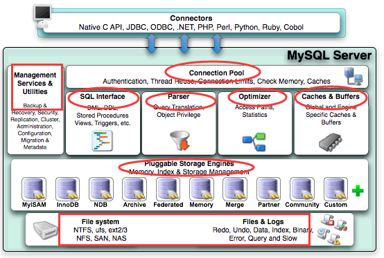

## 数据库是什么
数据库（`Database`）指长期存储在计算机内的、有组织的、可共享的数据集合。

数据库实际上就是一个文件集合，是一个存储数据的仓库，本质就是一个文件系统，数据库是按照特定的格式把数据存储起来，用户可以对存储的数据进行增删改查操作。

数据库管理系统（DBMS）是数据库系统的核心软件之一，是位于用户与操作系统之间的数据管理软件，用于建立，使用和维护数据库。它的主要功能包括数据定义、数据操作、数据库的运行管理、数据库的建立和维护等几个方面。

数据库有两种类型，分别是关系型数据库和非关系型数据库。
* 关系型数据库是建立在关系模型基础上的数据库，借助于集合代数等数学概念和方法来处理数据库中的数据。简单说，关系型数据库是由多张能互相连接的表组成的数据库。
常见的关系型数据库有 Oracle、DB2、PostgreSQL、Microsoft SQL Server、MySQL 等。
* 非关系型数据库又被称为 NoSQL（`Not Only SQL`)，意为不仅仅是 SQL。通常指数据以对象的形式存储在数据库中，而对象之间的关系通过每个对象自身的属性来决定。
常见的非关系型数据库有 Neo4j、MongoDB、Redis、Memcached、MemcacheDB 和 HBase 等。

## 数据库系统是什么
数据库系统（`Database System，DBS`）由硬件和软件共同构成。硬件主要用于存储数据库中的数据，包括计算机、存储设备等。软件部分主要包括数据库管理系统、支持数据库管理系统运行的操作系统，以及支持多种语言进行应用开发的访问技术等。

数据库系统是指在计算机系统中引入数据库后的系统。完整的数据库系统结构关系如图所示：


数据库系统主要有以下 3 个组成部分：
* 数据库：用于存储数据的地方。
* 数据库管理系统：用于管理数据库的软件。
* 数据库应用程序：为了提高数据库系统的处理能力所使用的管理数据库库的软件补充。

数据库（`DataBase，DB`）提供了一个存储空间来存储各种数据，可以将数据库视为一个存储数据的容器。一个数据库可能包含许多文件，一个数据库系统中通常包含许多数据库。

数据库管理系统（`Database Management System，DBMS`）是用户创建、管理和维护数据库时所使用的软件，位于用户和操作系统之间，对数据库进行统一管理。DBMS 能定义数据存储结构，提供数据的操作机制，维护数据库的安全性、完整性和可靠性。

虽然已经有了 DBMS，但是在很多情况下，DBMS 无法满足对数据管理的要求。

数据库应用程序（`DataBase Application`）的使用可以满足对数据管理的更高要求，还可以使数据管理过程更加直观和友好。数据库应用程序负责与 DBMS 进行通信、访问和管理 DBMS 中存储的数据，允许用户插入、修改、删除数据库中的数据。

DBMS 提供的功能，主要包括以下几个方面。
1. 数据定义功能
   DBMS 提供数据定义语言（`Data Definition Language，DDL`），用户通过它可以方便地对数据库中的数据对象进行定义。
2. 数据操纵功能
   DBMS 还提供数据操纵语言（`Data Manipulation Language，DML`），用户可以使用 DML 操作数据，实现对数据库的基本操作，如查询、插入、删除和修改等。
3. 数据库的运行管理
   数据库在建立、运用和维护时由数据库管理系统统一管理、统一控制，以保证数据的安全性、完整性、多用户对数据的并发使用及发生故障后的系统恢复。
4. 提供方便、有效地存取数据库信息的接口和工具
   编程人员可通过编程语言与数据库之间的接口进行数据库应用程序的开发。数据库管理员（`Database Administrator，DBA`）可通过提供的工具对数据库进行管理。
5. 数据库的建立和维护功能
   数据库功能包括数据库初始数据的输入、转换功能，数据库的转储、恢复功能，数据库的重组织功能和性能监控、分析功能等。这些功能通常由一些使用程序来完成。

## 常用数据库访问接口
不同的程序设计语言会有各自不同的数据库访问接口，程序语言通过这些接口，执行 SQL 语句，进行数据库管理。主要的数据库访问接口主要有 ODBC、JDBC、和 PDO。
* ODBC
ODBC（`Open Database Connectivity`，开放数据库互连）为访问不同的 SQL 数据库提供了一个共同的接口。ODBC 使用 SQL 作为访问数据的标准。 一个应用程序可以通过共同的一组代码访问不同的 SQL 数据库管理系统。
一个基于 ODBC 的应用程序对数据库的操作不依赖任何 DBMS，不直接与 DBMS 打交道，所有的数据库操作由对应的 DBMS 的 ODBC 驱动程序完成。也就是说，不论是 MySQL 还是 Oracle 数据库，均可用 ODBC API 进行访问。由此可见，ODBC 的最大优点是能以统一的方式处理所有的数据库。
* JDBC（`Java Data Base`，Java 数据库连接）用于 Java 应用程序连接数据库的标准方法，是一种用于执行 SQL 语句的 Java API，可以为多种关系数据库提供统一访问，它由一组用 Java 语言编写的类和接口组成。
* PDO（`PHP Data Object`）为 PHP 访问数据库定义了一个轻量级的、一致性的接口，它提供了一个数据访问抽象层，这样，无论使用什么数据库，都可以通过一致的函数执行查询和获取数据。

## MySQL是什么
MySQL 是一个免费开源的关系型数据库管理系统，但也不意味着该数据库是完全免费的。MySQL 目前属于 Oracle 公司。

针对不同的用户，MySQL 分为两个版本：
* MySQL Community Server（社区版）：该版本完全免费
* MySQL Enterprise Server（企业版）：该版本收费

### MySQL的命名机制
MySQL 的命名机制由 3 个数字和 1 个后缀组成，例如`mysql-5.7.20`：
* 第 1 个数字“5”是主版本号，用于描述文件的格式，所有版本 5 的发行版都有相同的文件夹格式。
* 第 2 个数字“7”是发行级别，主版本号和发行级别组合在一起便构成了发行序列号。
* 第 3 个数字“20”是在此发行系列的版本号，随每次新发行的版本递增。通常选择已经发行的最新版本。

## MySQL内部结构
MySQL 由连接池、SQL 接口、解析器、优化器、缓存、存储引擎等组成，可以分为三层，即 MySQL Server 层、存储引擎层和文件系统层。MySQL Server 层又包括连接层和 SQL 层。如下是官方文档中 MySQL 的基础架构图：



上图中，`Connection pool`为连接层，`Management Services & Utilities ...Caches & Buffers`为 SQL 层，`Pluggable Storage Engines`为存储引擎层，`File system、Files & Logs`为文件系统层。

`Connectors`不属于以上任何一层，可以将`Connectors`理解为各种客户端、应用服务，主要指的是不同语言与 SQL 的交互。
### 1. 连接层
应用程序通过接口（如 ODBC、JDBC）来连接 MySQL，最先连接处理的是连接层。连接层包括通信协议、线程处理、用户名密码认证 3 部分。
* 通信协议负责检测客户端版本是否兼容 MySQL 服务端。
* 线程处理是指每一个连接请求都会分配一个对应的线程，相当于一条 SQL 对应一个线程，一个线程对应一个逻辑 CPU，在多个逻辑 CPU 之间进行切换。
* 密码认证用来验证用户创建的账号、密码，以及 host 主机授权是否可以连接到 MySQL 服务器。

`Connection Pool`（连接池）属于连接层。由于每次建立连接都需要消耗很多时间，连接池的作用就是将用户连接、用户名、密码、权限校验、线程处理等需要缓存的需求缓存下来，下次可以直接用已经建立好的连接，提升服务器性能。
### 2. SQL层
SQL 层是 MySQL 的核心，MySQL 的核心服务都是在这层实现的。主要包含权限判断、查询缓存、解析器、预处理、查询优化器、缓存和执行计划。
* 权限判断可以审核用户有没有访问某个库、某个表，或者表里某行数据的权限。
* 查询缓存通过`Query Cache`进行操作，如果数据在`Query Cache`中，则直接返回结果给客户端，不必再进行查询解析、优化和执行等过程。
* 查询解析器针对 SQL 语句进行解析，判断语法是否正确。
* 预处理器对解析器无法解析的语义进行处理。
* 查询优化器对 SQL 进行改写和相应的优化，并生成最优的执行计划，就可以调用程序的 API 接口，通过存储引擎层访问数据。

`Management Services & Utilities、SQL Interface、Parser、Optimizer`和`Caches & Buffers`属于 SQL 层。

|               名称                | 说明                                                                                                                                                                                                                                                           |
|:-------------------------------:|:-------------------------------------------------------------------------------------------------------------------------------------------------------------------------------------------------------------------------------------------------------------|
| Management Services & Utilities | MySQL 的系统管理和控制工具，包括备份恢复、MySQL 复制、集群等。                                                                                                                                                                                                                        |
|      SQL Interface（SQL 接口）      | 用来接收用户的 SQL 命令，返回用户需要查询的结果。例如 SELECT FROM 就是调用 SQL Interface。                                                                                                                                                                                                |
|       Parser（查询解析器）             | 在 SQL 命令传递到解析器的时候会被解析器验证和解析，以便 MySQL 优化器可以识别的数据结构或返回 SQL 语句的错误。                                                                                                                                                                                              |
|        Optimizer（查询优化器）         | SQL 语句在查询之前会使用查询优化器对查询进行优化，同时验证用户是否有权限进行查询，缓存中是否有可用的最新数据。它使用“选取-投影-连接”策略进行查询。例如 SELECT id, name FROM student WHERE gender = "女";语句中，SELECT 查询先根据 WHERE 语句进行选取，而不是将表全部查询出来以后再进行 gender 过滤。SELECT 查询先根据 id 和 name 进行属性投影，而不是将属性全部取出以后再进行过滤，将这两个查询条件连接起来生成最终查询结果。 |
|     Caches & Buffers（查询缓存）      | 如果查询缓存有命中的查询结果，查询语句就可以直接去查询缓存中取数据。这个缓存机制是由一系列小缓存组成的，比如表缓存、记录缓存、key 缓存、权限缓存等。      |

### 3. 存储引擎层
`Pluggable Storage Engines`属于存储引擎层。存储引擎层是 MySQL 数据库区别于其他数据库最核心的一点，也是 MySQL 最具特色的一个地方。主要负责 MySQL 中数据的存储和提取。

因为在关系数据库中，数据的存储是以表的形式存储的，所以存储引擎也可以称为表类型（即存储和操作此表的类型）。
### 4. 文件系统层
文件系统层主要是将数据库的数据存储在操作系统的文件系统之上，并完成与存储引擎的交互。
## SQL
对数据库进行查询和修改操作的语言叫做 SQL（`Structured Query Language`，结构化查询语言）。

SQL 包含以下 4 部分：
1. 数据定义语言（`Data Definition Language，DDL`）：用来创建或删除数据库以及表等对象，主要包含以下几种命令：
* `DROP`：删除数据库和表等对象
* `CREATE`：创建数据库和表等对象
* `ALTER`：修改数据库和表等对象的结构
2. 数据操作语言（`Data Manipulation Language，DML`）：用来变更表中的记录，主要包含以下几种命令：
* `SELECT`：查询表中的数据
* `INSERT`：向表中插入新数据
* `UPDATE`：更新表中的数据
* `DELETE`：删除表中的数据
3. 数据查询语言（`Data Query Language，DQL`）：用来查询表中的记录，主要包含`SELECT`命令，来查询表中的数据。
4. 数据控制语言（`Data Control Language，DCL`）：用来确认或者取消对数据库中的数据进行的变更。除此之外，还可以对数据库中的用户设定权限。主要包含以下几种命令：
* `GRANT`：赋予用户操作权限
* `REVOKE`：取消用户的操作权限
* `COMMIT`：确认对数据库中的数据进行的变更
* `ROLLBACK`：取消对数据库中的数据进行的变更

### SQL的基本书写规则
#### SQL 语句要以分号;结尾
在 RDBMS （关系型数据库）中，SQL 语句是逐条执行的，一条 SQL 语句代表着数据库的一个操作。SQL 语句使用英文分号`;`结尾。
#### SQL 语句不区分大小写
SQL 不区分关键字的大小写。不管写成`SELECT`还是`select`，解释都是一样的。表名和列名也是如此。

插入到表中的数据是区分大小写的。例如，向数据库中插入单词`Computer、COMPUTER`或`computer`，这三个是不一样的数据。
#### 常数的书写方式是固定的
SQL 语句常常需要直接书写字符串、日期或者数字。例如，书写向表中插入字符串、日期或者数字等数据的 SQL 语句。

在 SQL 语句中直接书写的字符串、日期或者数字等称为常数。常数的书写方式：
* SQL 语句中含有字符串的时候，需要像`'abc'`这样，使用英文单引号'将字符串括起来，用来标识这是一个字符串。
* SQL 语句中含有日期的时候，同样需要使用英文单引号将其括起来。日期的格式有很多种（`'26 Jan 2010'`或者`'10/01/26'`等）。
* 在 SQL 语句中书写数字的时候，不需要使用任何符号标识，直接写成 1000 这样的数字即可。

注意：列名不是字符串，不能使用单引号。在MySQL 中可以用倒引号```把表名和列名括起来。
#### 单词需要用半角空格或者换行来分隔
SQL 语句的单词之间必须使用半角空格（英文空格）或换行符来进行分隔。没有分隔的语句会发生错误，无法正常执行。

不能使用全角空格（中文空格）作为单词的分隔符，否则会发生错误，出现无法预期的结果。

SQL 语句中的标点符号必须都是英文状态下的，即半角字。
### SQL注释
注释分为单行注释和多行注释。
#### 单行注释
单行注释可以使用`#`注释符，`#`注释符后直接加注释内容。
```sql
#从结果中删除重复行
SELECT DISTINCT product_id, purchase_price FROM Product;
```
单行注释可以使用`-- `注释符，`-- `注释符后需要加一个空格，注释才能生效。
```sql
-- 从结果中删除重复行
SELECT DISTINCT product_id, purchase_price FROM Product;
```
`#`和`-- `的区别就是：`#`后面直接加注释内容，而`-- `的第 2 个破折号后需要跟一个空格符在加注释内容。
#### 多行注释
多行注释使用`/* */`注释符。`/*`用于注释内容的开头，`*/`用于注释内容的结尾。
```sql
/*
  第一行注释内容
  第二行注释内容
*/
```
任何注释（单行注释和多行注释）都可以插在 SQL 语句中，且注释可以放在 SQL 语句中的任意位置。
```sql
SELECT DISTINCT product_id, purchase_price
-- 从结果中删除重复行。 
FROM Product;
SELECT DISTINCT product_id, purchase_price
# 从结果中删除重复行。 
FROM Product;

SELECT DISTINCT product_id, purchase_price
/* 这条SELECT语句，  
    会从结果中删除重复行。*/ 
FROM Product;
```
注释可以写在任何 SQL 语句当中，且 SQL 语句中对注释的数量没有限制。
### SQL语句的大小写规则
SQL 语句的大小写规则与语句组成元素、引用内容和服务器所使用的操作系统有关。
#### SQL 关键字和函数名
SQL 的关键字和函数名不区分大小写。下面这些语句都是等价的：
```sql
SELECT NOW();
select now();
sElEcT nOw();
```
#### 数据库名、表名和视图名
MySQL 用服务器主机的底层文件系统所包含的目录和文件来表示数据库和表。因此，数据库名和表名的默认大小写取决于服务器主机的操作系统在命名方面的规定。

比如 Windows 系统的文件名不区分大小写，所以运行在 Windows 系统上面的 MySQL 服务器也不用区分数据库名和表名的大小写。Linux 系统的文件名区分大小写，所以运行在 Linux 系统上的 MySQL 服务器需要区分数据库名和表名的大小写。对于 Mac OS X 平台，其文件系统中的名字是个例外，它们不区分大小写。

MySQL 会使用一个文件来表示一个视图，所以以上与表有关的也同样适用于视图。
#### 存储程序的名字
存储函数、存储过程和事件的名字都不区分大小写。触发器的名字要区分大小写，这一点与标准 SQL 的行为有所不同。
#### 列名和索引名
在 MySQL 里，列名和索引名都不区分大小写。下面这些语句都是等价的：
```sql
SELECT name FROM student ;
SELECT NAME FROM student ;
SELECT nAmE FROM student ;
```
#### 别名的名字
默认情况下，表的别名要区分大小写。SQL 语句中可以使用任意的大小写（大写、小写或大小写混用）来指定一个别名。如果需要在同一条语句里多次用到同一个别名，则必须让它们的大小写保持一致。

下表总结了 SQL 元素在 Windows 和 Linux 系统是否区分大小写。

| | Windows | Linux |
| :--: | :--: | :--: |
| 数据库名 | 否（忽略大小写） | 是 |
| 表名 | 否（忽略大小写） | 是 |
| 表别名 | 否（忽略大小写） | 是 |
| 列名 | 否（忽略大小写） | 否（忽略大小写） |
| 列别名 | 否（忽略大小写） | 否（忽略大小写） |
| 变量名 | 否（忽略大小写） | 是 |

在 Linux 服务器下创建数据库和表时，应该认真考虑大小写的问题，比如它们以后是否会迁移到 Windows 服务器上。

假设你在 Linux 服务器上创建了`abc`和`ABC`两个表，当把这两个表迁移到 Windows 服务器上时，就会出现问题；因为 Windows 系统并不区分大小写，`abc`和`ABC`无差别。

:::info
在阿里巴巴 Java 开发手册的 MySql 建表规约里提到：

【强制】表名、字段名必须使用小写字母或数字，禁止出现数字开头，禁止两个下划线中间只出现数字。数据库字段名的修改代价很大，因为无法进行预发布，所以字段名称需要慎重考虑。
:::
通俗的说就是，MySQL 在 Windows 系统下不区分大小写，但在 Linux 系统下默认区分大小写。因此，数据库名、表名和字段名，都不允许出现任何大写字母。
## 系统变量
在 MySQL 数据库，变量分为系统变量和用户自定义变量。系统变量以`@@`开头，用户自定义变量以`@`开头。

服务器维护着两种系统变量，即全局变量（`GLOBAL VARIABLES`）和会话变量（`SESSION VARIABLES`）。全局变量影响 MySQL 服务的整体运行方式，会话变量影响具体客户端连接的操作。

每一个客户端成功连接服务器后，都会产生与之对应的会话。会话期间，MySQL 服务实例会在服务器内存中生成与该会话对应的会话变量，这些会话变量的初始值是全局变量值的拷贝。
### 查看系统变量
查看所有全局变量信息。
```SQL
SHOW GLOBAL VARIABLES; 
```
查看与当前会话相关的所有会话变量以及全局变量。
```SQL
SHOW SESSION VARIABLES;
```
`SESSION`关键字可以省略。

MySQL 中的系统变量以两个`@`开头。
* `@@global`仅仅用于标记全局变量
* `@@session`仅仅用于标记会话变量
* `@@`首先标记会话变量，如果会话变量不存在，则标记全局变量

MySQL 中有一些系统变量仅仅是全局变量，例如`innodb_data_file_path`，可以使用以下 3 种方法查看：
```sql
SHOW GLOBAL VARIABLES LIKE 'innodb_data_file_path';
SHOW SESSION VARIABLES LIKE 'innodb_data_file_path';
SHOW VARIABLES LIKE 'innodb_data_file_path';
```
MySQL 中有一些系统变量仅仅是会话变量，例如 MySQL 连接 ID 会话变量`pseudo_thread_id`，可以使用以下 2 种方法查看。
```sql
SHOW SESSION VARIABLES LIKE 'pseudo_thread_id';
SHOW VARIABLES LIKE 'pseudo_thread_id';
```
MySQL 中有一些系统变量既是全局变量，又是会话变量，例如系统变量`character_set_client`既是全局变量，又是会话变量。
```sql
SHOW SESSION VARIABLES LIKE 'character_set_client';
SHOW VARIABLES LIKE 'character_set_client';
SHOW GLOBAL VARIABLES LIKE 'character_set_client';
```
### 设置系统变量
可以通过以下方法设置系统变量：
* 在 MySQL 配置文件（`mysql.ini`或`mysql.cnf`）中修改 MySQL 系统变量的值（需要重启 MySQL 服务才会生效）。
* 在 MySQL 服务运行期间，使用`SET`命令重新设置系统变量的值。

服务器启动时，会将所有的全局变量赋予默认值。这些默认值可以在选项文件中或在命令行中对执行的选项进行更改。

更改全局变量，必须具有`SUPER`权限。设置全局变量的值的方法如下：
```sql
SET @@global.innodb_file_per_table=default;
SET @@global.innodb_file_per_table=ON;
SET global innodb_file_per_table=ON;
```
需要注意的是，更改全局变量只影响更改后连接客户端的相应会话变量，而不会影响目前已经连接的客户端的会话变量（即使客户端执行`SET GLOBAL`语句也不影响）。也就是说，对于修改全局变量之前连接的客户端只有在客户端重新连接后，才会影响到客户端。

客户端连接时，当前全局变量的值会对客户端的会话变量进行相应初始化。设置会话变量不需要特殊权限，但客户端只能更改自己的会话变量，而不能更改其它客户端的会话变量。设置会话变量的值的方法如下：
```sql
SET @@session.pseudo_thread_id=5;
SET session pseudo_thread_id=5;
SET @@pseudo_thread_id=5;
SET pseudo_thread_id = 5;
```
如果没有指定修改全局变量还是会话变量，服务器会当作会话变量来处理。
```sql
SET @@sort_buffer_size = 50000;
```
上面语句没有指定是`GLOBAL`还是`SESSION`，服务器会当做`SESSION`处理。

使用`SET`设置全局变量或会话变量成功后，如果 MySQL 服务重启，数据库的配置就又会重新初始化。一切按照配置文件进行初始化，全局变量和会话变量的配置都会失效。

MySQL 中还有一些特殊的全局变量，如`log_bin、tmpdir、version、datadir`，在 MySQL 服务实例运行期间它们的值不能动态修改，也就是不能使用`SET`命令进行重新设置，这种变量称为静态变量。数据库管理员可以更改配置文件来重新设置静态变量的值。
