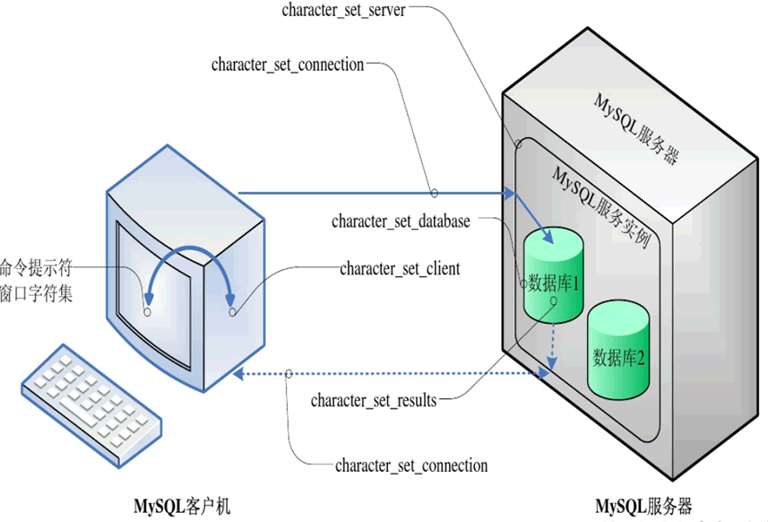
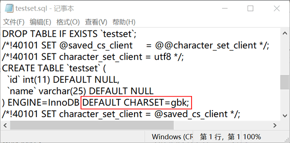
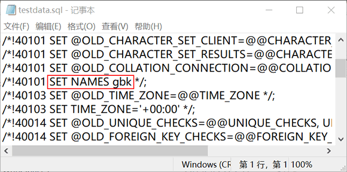

字符（`Character`）是计算机中字母、数字、符号的统称，一个字符可以是一个中文汉字、一个英文字母、一个阿拉伯数字、一个标点符号等。

计算机是以二进制的形式来存储数据的。平时我们在显示器上看到的数字、英文、标点符号、汉字等字符都是二进制数转换之后的结果。

字符集（`Character set`）定义了字符和二进制的对应关系，为字符分配了唯一的编号。常见的字符集有 ASCII、GBK、IOS-8859-1 等。

字符编码（`Character encoding`）也可以称为字集码，规定了如何将字符的编号存储到计算机中。
大部分字符集都只对应一种字符编码，例如：ASCII、IOS-8859-1、GB2312、GBK，都是既表示了字符集又表示了对应的字符编码。所以一般情况下，可以将两者视为同义词。Unicode 字符集除外，Unicode 有三种编码方案，即 UTF-8、UTF-16 和 UTF-32。最为常用的是 UTF-8 编码。

校对规则（`Collation`）也可以称为排序规则，是指在同一个字符集内字符之间的比较规则。字符集和校对规则是一对多的关系，每个字符集都有一个默认的校对规则。字符集和校对规则相辅相成，相互依赖关联。

简单来说，字符集用来定义 MySQL 存储字符串的方式，校对规则用来定义 MySQL 比较字符串的方式。

有些数据库并没有清晰的区分开字符集和校对规则。例如，在 SQL Server 中创建数据库时，选择字符集就相当于选定了字符集和校对规则。

而在 MySQL 中，字符集和校对规则是区分开的，必须设置字符集和校对规则。一般情况下，没有特殊需求，只设置其一即可。只设置字符集时，MySQL 会将校对规则设置为字符集中对应的默认校对规则。
## 查看 MySQL 使用的字符集和校对规则
可以通过`SHOW VARIABLES LIKE 'character%';`查看当前 MySQL 使用的字符集：
```shell
mysql> SHOW VARIABLES LIKE 'character%';
+--------------------------+--------------------------------+
| Variable_name            | Value                          |
+--------------------------+--------------------------------+
| character_set_client     | utf8mb4                        |
| character_set_connection | utf8mb4                        |
| character_set_database   | utf8mb4                        |
| character_set_filesystem | binary                         |
| character_set_results    | utf8mb4                        |
| character_set_server     | utf8mb4                        |
| character_set_system     | utf8mb3                        |
| character_sets_dir       | /usr/share/mysql-8.0/charsets/ |
+--------------------------+--------------------------------+
8 rows in set (0.00 sec)
```
说明：

|            名称	            | 说明                                     |
|:-------------------------:|:---------------------------------------|
|   character_set_client    | MySQL 客户端使用的字符集                        |
| character_set_connection  | 连接数据库时使用的字符集                           |
| character_set_database    | 创建数据库使用的字符集                            | 
| character_set_filesystem  | MySQL 服务器文件系统使用的字符集，默认值为 binary，不做任何转换 | 
|   character_set_results   | 数据库给客户端返回数据时使用的字符集                     |
|   character_set_server    | MySQL 服务器使用的字符集，建议由系统自己管理，不要人为定义       |
|   character_set_system    | 数据库系统使用的字符集，默认值为 utf8mb3，不需要设置         |
|    character_sets_dir     | 字符集的安装目录                               |

乱码时，不需要关心`character_set_filesystem、character_set_system`和`character_sets_dir`这 3 个系统变量，它们不会影响乱码。

可以通过`SHOW VARIABLES LIKE 'collation%';`查看当前使用的校对规则：
```shell
mysql> SHOW VARIABLES LIKE 'collation%';
+----------------------+--------------------+
| Variable_name        | Value              |
+----------------------+--------------------+
| collation_connection | utf8mb4_0900_ai_ci |
| collation_database   | utf8mb4_0900_ai_ci |
| collation_server     | utf8mb4_0900_ai_ci |
+----------------------+--------------------+
3 rows in set (0.00 sec)
```
说明：

| 名称 | 说明 |
|:--:|:---|
|  collation_connection  | 连接数据库时使用的校对规则   |
|  collation_database  | 创建数据库时使用的校对规则   |
|  collation_server  | MySQL 服务器使用的校对规则   |

校对规则命令约定：
* 以校对规则所对应的字符集名开头
* 以国家名居中（或以`general`居中）
* 以`ci、cs`或`bin`结尾，`ci`表示大小写不敏感，`cs`表示大小写敏感，`bin`表示按二进制编码值比较。

## MySQL字符集的转换过程
MySQL 中字符集的转换过程：
1. 在命令提示符窗口（cmd）中执行 MySQL 命令或`sql`语句时，这些命令或语句从“命令提示符窗口字符集”转换为`character_set_client`定义的字符集。
2. 使用命令提示符窗口成功连接 MySQL 服务器后，就建立了一条“数据通信链路”，MySQL 命令或`sql`语句沿着“数据链路”传向 MySQL 服务器，由`character_set_client`定义的字符集转换为`character_set_connection`定义的字符集。
3. MySQL 服务实例收到数据通信链路中的 MySQL 命令或`sql`语句后，将 MySQL 命令或`sql`语句从`character_set_connection`定义的字符集转换为`character_set_server`定义的字符集。
4. 若 MySQL 命令或`sql`语句针对于某个数据库进行操作，此时将 MySQL 命令或`sql`语句从`character_set_server`定义的字符集转换为`character_set_database`定义的字符集。
5. MySQL 命令或`sql`语句执行结束后，将执行结果设置为`character_set_results`定义的字符集。
6. 执行结果沿着打开的数据通信链路原路返回，将执行结果从`character_set_results`定义的字符集转换为`character_set_client`定义的字符集，最终转换为命令提示符窗口字符集，显示到命令提示符窗口中。



## 查看字符集和校对规则
可以通过`SHOW CHARACTER set;`查看可用字符集：
```shell
mysql> SHOW CHARACTER set;
+----------+---------------------------------+---------------------+--------+
| Charset  | Description                     | Default collation   | Maxlen |
+----------+---------------------------------+---------------------+--------+
| armscii8 | ARMSCII-8 Armenian              | armscii8_general_ci |      1 |
| ascii    | US ASCII                        | ascii_general_ci    |      1 |
| big5     | Big5 Traditional Chinese        | big5_chinese_ci     |      2 |
| binary   | Binary pseudo charset           | binary              |      1 |
| cp1250   | Windows Central European        | cp1250_general_ci   |      1 |
| cp1251   | Windows Cyrillic                | cp1251_general_ci   |      1 |
| cp1256   | Windows Arabic                  | cp1256_general_ci   |      1 |
...
```
其中：
* 第一列（`Charset`）为字符集名称
* 第二列（`Description`）为字符集描述
* 第三列（`Default collation`）为字符集的默认校对规则
* 第四列（`Maxlen`）表示字符集中一个字符占用的最大字节数

常用的字符集如下：
* `gbk`支持中文简体字符
* `big5`支持中文繁体字符
* `utf8`几乎支持所有国家的字符

也可以通过查询`information_schema.character_set`表中的记录查看 MySQL 支持的字符集。
```shell
mysql> SELECT * FROM information_schema.character_sets;
+--------------------+----------------------+---------------------------------+--------+
| CHARACTER_SET_NAME | DEFAULT_COLLATE_NAME | DESCRIPTION                     | MAXLEN |
+--------------------+----------------------+---------------------------------+--------+
| big5               | big5_chinese_ci      | Big5 Traditional Chinese        |      2 |
| dec8               | dec8_swedish_ci      | DEC West European               |      1 |
| cp850              | cp850_general_ci     | DOS West European               |      1 |
| hp8                | hp8_english_ci       | HP West European                |      1 |
......
```
可以使用`SHOW COLLATION LIKE '***';`命令来查看相关字符集的校对规则。
```shell
mysql> SHOW COLLATION LIKE 'gbk%';
+----------------+---------+----+---------+----------+---------+---------------+
| Collation      | Charset | Id | Default | Compiled | Sortlen | Pad_attribute |
+----------------+---------+----+---------+----------+---------+---------------+
| gbk_bin        | gbk     | 87 |         | Yes      |       1 | PAD SPACE     |
| gbk_chinese_ci | gbk     | 28 | Yes     | Yes      |       1 | PAD SPACE     |
+----------------+---------+----+---------+----------+---------+---------------+
```
上面运行结果为 GBK 字符集所对应的校对规则，其中`gbk_chinese_ci`是默认的校对规则，对大小写不敏感。而`gbk_bin`按照二进制编码的值进行比较，对大小写敏感。

也可以通过查询`information_schema.COLLATIONS`表中的记录查看 MySQL 中可用的校对规则。
```shell
mysql> SELECT * FROM information_schema.COLLATIONS;
+--------------------------+--------------------+-----+------------+-------------+---------+
| COLLATION_NAME           | CHARACTER_SET_NAME | ID  | IS_DEFAULT | IS_COMPILED | SORTLEN |
+--------------------------+--------------------+-----+------------+-------------+---------+
| big5_chinese_ci          | big5               |   1 | Yes        | Yes         |       1 |
| big5_bin                 | big5               |  84 |            | Yes         |       1 |
| dec8_swedish_ci          | dec8               |   3 | Yes        | Yes         |       1 |
| dec8_bin                 | dec8               |  69 |            | Yes         |       1 |
| cp850_general_ci         | cp850              |   4 | Yes        | Yes         |       1 |
| cp850_bin                | cp850              |  80 |            | Yes         |       1 |
......
```
分别指定`“A”`和`“a”`按照`gbk_chinese_ci`和`gbk_bin`校对规则进行比较。
```shell
mysql> SELECT CASE WHEN 'A' COLLATE gbk_chinese_ci = 'a' COLLATE gbk_chinese_ci then 1
    -> else 0 end;
+-------------------------------------------------------------------------------------+
| CASE WHEN 'A' COLLATE gbk_chinese_ci = 'a' COLLATE gbk_chinese_ci then 1
else 0 end |
+-------------------------------------------------------------------------------------+
|                                                                                   1 |
+-------------------------------------------------------------------------------------+
1 row in set (0.02 sec)

mysql> SELECT CASE WHEN 'A' COLLATE gbk_bin = 'a' COLLATE gbk_bin then 1 else 0 end;
+-----------------------------------------------------------------------+
| CASE WHEN 'A' COLLATE gbk_bin = 'a' COLLATE gbk_bin then 1
else 0 end |
+-----------------------------------------------------------------------+
|                                                                     0 |
+-----------------------------------------------------------------------+
```
由于`gbk_chinese_ci`校对规则忽略大小写，所以认为两个`A`和`a`是相同的。`gbk_bin`校对规则不忽略大小写，则认为两个字符是不同的。

在实际应用中，我们应事先确认应用需要按照什么样方式排序，是否区分大小写，然后选择相应的校对规则。
## 设置默认字符集和校对规则
MySQL 服务器可以支持多种字符集，在同一台服务器、同一个数据库甚至同一个表的不同字段中，都可以使用不同的字符集。Oracle 等其它数据库管理系统都只能使用相同的字符集，相比之下，MySQL 明显存在更大的灵活性。

MySQL 的字符集和校对规则有 4 个级别的默认设置，即服务器级、数据库级、表级和字段级。它们分别在不同的地方设置，作用也不相同。
### 服务器字符集和校对规则
修改服务器默认字符集和校对规则的方法：
1. 可以在`my.ini`配置文件中设置服务器字符集和校对规则，添加内容如下：
```
[mysqld]
character-set-server=字符集名称
```
2. 连接 MySQL 服务器时指定字符集：
```
mysql --default-character-set=字符集名称 -h 主机IP地址 -u 用户名 -p 密码
```
如果没有指定服务器字符集，MySQL 会默认使用`utf8mb4`作为服务器字符集。如果只指定了字符集，没有指定校对规则，MySQL 会使用该字符集对应的默认校对规则。如果要使用字符集的非默认校对规则，需要在指定字符集的同时指定校对规则。

:::info
在 MySQL 8.0 版本之前，默认字符集为 latin1，utf8 字符集指向的是 utf8mb3。从 MySQL8.0 开始，数据库的默认字符集改为 utf8mb4。
:::

可以用`SHOW VARIABLES LIKE 'character_set_server'`和`SHOW VARIABLES LIKE 'collation_server'`命令查询当前服务器的字符集和校对规则。
```shell
mysql> SHOW VARIABLES LIKE 'character_set_server';
+----------------------+---------+
| Variable_name        | Value   |
+----------------------+---------+
| character_set_server | utf8mb4 |
+----------------------+---------+
1 row in set (0.00 sec)
```
```shell
mysql> SHOW VARIABLES LIKE 'collation_server';
+------------------+--------------------+
| Variable_name    | Value              |
+------------------+--------------------+
| collation_server | utf8mb4_0900_ai_ci |
+------------------+--------------------+
1 row in set (0.01 sec)
```
### 数据库字符集和校对规则
数据库的字符集和校对规则在创建数据库时指定，也可以在创建完数据库后通过`ALTER DATABASE`命令进行修改。

:::tip
如果数据库里已经存在数据，修改字符集后，已有的数据不会按照新的字符集重新存放，所以不能通过修改数据库的字符集来修改数据的内容。
:::

设置数据库字符集的规则：
* 如果指定了字符集和校对规则，则使用指定的字符集和校对规则
* 如果指定了字符集没有指定校对规则，则使用指定字符集的默认校对规则
* 如果指定了校对规则但未指定字符集，则字符集使用与该校对规则关联的字符集
* 如果没有指定字符集和校对规则，则使用服务器字符集和校对规则作为数据库的字符集和校对规则

:::tip
为了避免受到默认值的影响，推荐在创建数据库时指定字符集和校对规则。
:::

可以使用`SHOW VARIABLES LIKE 'character_set_database'`和`SHOW VARIABLES LIKE 'collation_database'`命令查看当前数据库的字符集和校对规则：
```shell
mysql> SHOW VARIABLES LIKE 'character_set_database';
+------------------------+--------+
| Variable_name          | Value  |
+------------------------+--------+
| character_set_database | latin1 |
+------------------------+--------+
1 row in set, 1 warning (0.00 sec)
```
```shell
mysql> SHOW VARIABLES LIKE 'collation_database';
+--------------------+-------------------+
| Variable_name      | Value             |
+--------------------+-------------------+
| collation_database | latin1_swedish_ci |
+--------------------+-------------------+
```
### 表字符集和校对规则
表的字符集和校对规则在创建表的时候指定，也可以在创建完表后通过`ALTER TABLE`命令进行修改。

:::tip
同样，如果表中已有记录，修改字符集后，原有的记录不会按照新的字符集重新存放。表的字段仍然使用原来的字符集。
:::

设置表的字符集规则和设置数据库字符集的规则基本类似：
* 如果指定了字符集和校对规则，使用指定的字符集和校对规则
* 如果指定了字符集没有指定校对规则，使用指定字符集的默认校对规则
* 如果指定了校对规则但未指定字符集，则字符集使用与该校对规则关联的字符集
* 如果没有指定字符集和校对规则，使用数据库字符集和校对规则作为表的字符集和校对规则

:::tip
为了避免受到默认值的影响，推荐在创建表的时候指定字符集和校对规则。
:::

可以使用`SHOW CREATE TABLE`命令查看当前表的字符集和校对规则：
```SHELL
mysql> SHOW CREATE TABLE tb_students_info \G
*************************** 1. row ***************************
       Table: tb_students_info
Create Table: CREATE TABLE `tb_students_info` (
  `id` int(11) NOT NULL AUTO_INCREMENT,
  `name` varchar(10) DEFAULT NULL,
  `age` int(11) DEFAULT NULL,
  `sex` char(1) DEFAULT NULL,
  `height` float DEFAULT NULL,
  `course_id` int(11) DEFAULT NULL,
  PRIMARY KEY (`id`)
) ENGINE=InnoDB AUTO_INCREMENT=12 DEFAULT CHARSET=utf8
1 row in set (0.00 sec)
```
### 列字符集和校对规则
MySQL 可以定义列级别的字符集和校对规则，主要是针对相同表的不同字段需要使用不同字符集的情况。一般遇到这种情况的几率比较小，这只是 MySQL 提供给我们一个灵活设置的手段。

列字符集和校对规则的定义可以在创建表时指定，或者在修改表时调整。语法格式如下：
```
ALTER TABLE 表名 MODIFY 列名  数据类型 CHARACTER SET 字符集名;
```
修改`tb_students_info`表中`name`列的字符集，并查看。
```shell
mysql> ALTER TABLE tb_students_info MODIFY name VARCHAR(10) CHARACTER SET gbk;
Query OK, 11 rows affected (0.11 sec)
Records: 11  Duplicates: 0  Warnings: 0

mysql>  SHOW CREATE TABLE tb_students_info \G
*************************** 1. row ***************************
       Table: tb_students_info
Create Table: CREATE TABLE `tb_students_info` (
  `id` int(11) NOT NULL AUTO_INCREMENT,
  `name` varchar(10) CHARACTER SET gbk DEFAULT NULL,
  `age` int(11) DEFAULT NULL,
  `sex` char(1) DEFAULT NULL,
  `height` float DEFAULT NULL,
  `course_id` int(11) DEFAULT NULL,
  PRIMARY KEY (`id`)
) ENGINE=InnoDB AUTO_INCREMENT=12 DEFAULT CHARSET=utf8
1 row in set (0.00 sec)
```
结果显示，`name`列字符集修改成功。
:::tip
如果在创建列的时候没有特别指定字符集和校对规则，默认使用表的字符集和校对规则。
:::

### 连接字符集和校对规则
上述 4 种设置方式，确定的都是数据保存的字符集和校对规则。实际应用中，还需要设置客户端和服务器之间交互的字符集和校对规则。

对于客户端和服务器的交互操作，MySQL 提供了 3 个不同的参数：`character_set_client、character_set_connection`和`character_set_results`，分别代表客户端、连接和返回结果的字符集。通常情况下，这 3 个字符集是相同的，这样可以确保正确读出用户写入的数据，尤其是中文字符。字符集不同时，容易导致写入的记录不能正确读出。

设置客户端和服务器连接的字符集和校对规则有以下几种方法：
1. 在`my.ini`配置文件中，设置以下语句：
```
[mysql]
default-character-set=gbk
```
这样服务器启动后，所有连接默认使用 GBK 字符集进行连接。
2. 可以通过以下命令来设置连接的字符集和校对规则，这个命令可以同时修改以上 3 个参数（`character_set_client、character_set_connection`和`character_set_results`）的值。
```
SET NAMES gbk;
```
使用这个方法可以“临时一次性地”修改客户端和服务器连接时的字符集为`gbk`。
3. MySQL 还提供了下列命令“临时地”修改 MySQL“当前会话的”字符集和校对规则。
```
set character_set_client = gbk;
set character_set_connection = gbk;
set character_set_database = gbk;
set character_set_results = gbk;
set character_set_server = gbk;
set collation_connection = gbk_chinese_ci;
set collation_database = gbk_chinese_ci;
set collation_server = gbk_chinese_ci;
```

## 修改字符集步骤
`ALTER DATABASE`或`ALTER TABLE`命令对已经存在的数据没有作用，只对新创建的表或记录生效。如果想修改已存在数据的字符集，需要先将数据导出，经过适当的调整后，再重新导入。

以下模拟的是将`gb2312`字符集的数据库修改成`gbk`字符集的数据库的过程。

1）创建`testset`数据库，设置其字符集为`gb2312`，并添加数据。
```shell
mysql> CREATE TABLE test.testset(
    -> id INT(11) DEFAULT NULL,
    -> name VARCHAR(25) DEFAULT NULL
    -> )CHARSET=gb2312;
Query OK, 0 rows affected (0.10 sec)

mysql> INSERT INTO test.testset VALUES (1,'C语言');
Query OK, 1 row affected (0.01 sec)

mysql> INSERT INTO test.testset VALUES (2,'Java语言');
Query OK, 1 row affected (0.01 sec)

mysql> INSERT INTO test.testset VALUES (3,'Python语言');
Query OK, 1 row affected (0.01 sec)
```
2）导出`testset`表结构：
```
mysqldump -uroot -p --default-character-set=gbk -d test testset> D:\testset.sql
```
其中，`--default-character-set=gbk`表示以什么字符集连接；`-d`表示只导出表结构，不导出数据。

3）打开`testset.sql`文件，修改表结构定义中的字符集为新的字符集。



4）确保表中的记录不再更新，导出所有记录。
```sql
mysqldump -uroot -p --quick --no-create-info --extended-insert --default-character-set=gb2312 test testset> D:\testdata.sql
```
* `--quick`：该选项用于存储记录多的表。它强制`mysqldump`从服务器一次一行地查询表中的行，而不是查询所有行，并在输出前将它缓存到内存中。
* `--extended-insert`：使用`INSERT`插入多行数据语法。可以使文件更小，导入文件时加速插入。
* `--no-create-info`：不导出表的`CREATE TABLE`语句。
* `--default-character-set=gb2312`：按照原有的字符集导出所有数据。这样导出的文件中，所有中文都是可见的，不会保存成乱码。

5）打开`testdata.sql`，将`SET NAMES gb2312`修改成`SET NAMES gbk`。



6）使用新的字符集创建新的数据库。
```sql
CREATE DATABASE test2 DEFAULT CHARSET gbk;
```
7）创建表，执行`testset.sql`。
```shell
mysql -uroot -p test2 < D:\testset.sql
```
8）导入数据，执行`testdata.sql`。
```shell
mysql -uroot -p test2 < D:\testdata.sql
```
9）查看`testset`表结构是否修改了字符集，以及表内数据是否丢失或乱码：
```shell
mysql> SHOW CREATE TABLE test2.testset \G
*************************** 1. row ***************************
       Table: testset
Create Table: CREATE TABLE `testset` (
  `id` int(11) DEFAULT NULL,
  `name` varchar(25) DEFAULT NULL
) ENGINE=InnoDB DEFAULT CHARSET=gbk
1 row in set (0.00 sec)

mysql> SELECT * FROM test2.testset;
+------+------------+
| id   | name       |
+------+------------+
|    1 | C语言      |
|    2 | Java语言   |
|    3 | Python语言 |
+------+------------+
3 rows in set (0.00 sec)
```
:::warning
选择目标字符集的时候，要注意最好的是原字符集的超集，或者确定比原字符集的字库更大，否则如果目标字符集的字库小于原字符集的字库，那么目标字符集中不支持的字符导入后会变成乱码，丢失一部分数据。
:::

## 字符集的选择
由于数据库中存储的数据大部分都是各种文字，所以字符集对数据库的存储、处理性能，以及日后系统的移植、推广都会有影响。

如果在创建数据库时没有正确选择字符集，在后期就可能需要更换字符集，而更换字符集是代价比较高的操作，也存在一定的风险。所以推荐在应用开始阶段，就按照实际需求，正确的选择合适的字符集，避免后期不必要的调整。

目前 MySQL 5.7 支持几十种字符集，包括 UCS-2、UTF-16、UTF-16LE、UTF-32、 UTF-8 和 utf8mb4 等 Unicode 字符集。那么面对众多的字符集，我们该如何选择呢？

在选择数据库字符集时，可以根据应用的需求，结合字符集的特点来权衡，主要考虑以下几方面的因素。
1. 满足应用支持语言的需求。如果应用要处理各种各样的文字，或者将发布到使用不同语言的国家或地区，就应该选择 Unicode 字符集。对 MySQL 来说，目前就是 UTF-8。
2. 如果应用中涉及已有数据的导入，就要充分考虑数据库字符集对已有数据的兼容性。假如已有数据的字符集是 GBK，如果选择 GB 2312-80 为数据库字符集，就很可能出现某些文字无法正确导入。
3. 如果数据库只需要支持一般中文，数据量很大，性能要求也很高，那就应该选择双字节定长编码的中文字符集，比如 GBK。
   因为，相对于 UTF-8 而言，GBK 比较“小”，每个汉字只占 2 个字节，而 UTF-8 汉字编码需要 3 个字节，这样可以减少磁盘 I/O、数据库 Cache 以及网络传输的时间，从而提高性能。相反，如果应用主要处理英文字符，仅有少量汉字数据，那么选择 UTF-8 更好，因为 GBK、UCS-2、UTF-16 的西文字符编码都是 2 个字节，会造成很多不必要的开销。
4. 如果数据库需要做大量的字符运算，如比较、排序等，那么选择定长字符集可能更好，因为定长字符集的处理速度要比变长字符集的处理速度快。
5. 如果所有客户端程序都支持相同的字符集，则应该优先选择该字符集作为数据库字符集。这样可以避免因字符集转换带来的性能开销和数据损失。
6. 在多种字符集都能够满足应用的前提下，应尽量使用小的字符集。因为更小的字符集意味着能够节省空间、减少网络传输字节数，同时由于存储空间的较小间接的提高了系统的性能。

有很多字符集都可以保存汉字，比如 UTF-8、GB2312、GBK 等等。但是常用的是 GB2312 和 GBK。因为 GB2312 字库比 GBK 字库小，有些偏僻字不能保存，因此在选择字符集的时候一定要权衡这些偏僻字出现的几率，一般情况下，最好选用 GBK。
