## windows安装MySQL
下载地址：`https://dev.mysql.com/downloads/installer`。
安装版本：MySQL 8.022。

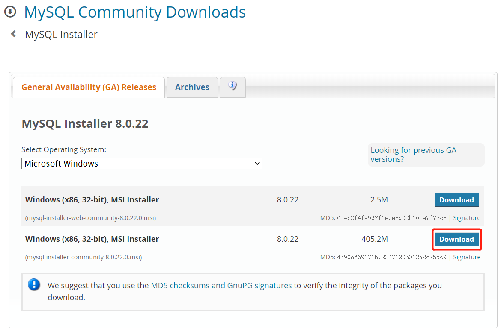

选择对应的操作系统版本，点击`Download`后进入下图界面，选择直接下载即可。

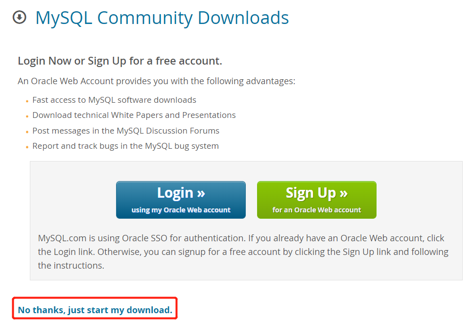

下载完成后，直接双击进行安装。双击后进入下图界面，选择默认版本进行安装。

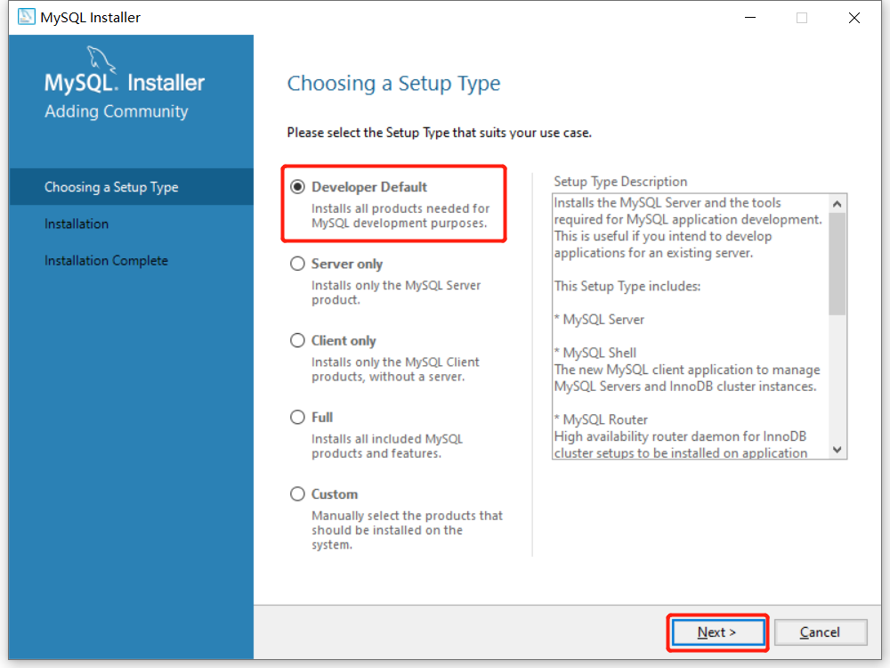

进入安装前环境检查，选择`Execute`。

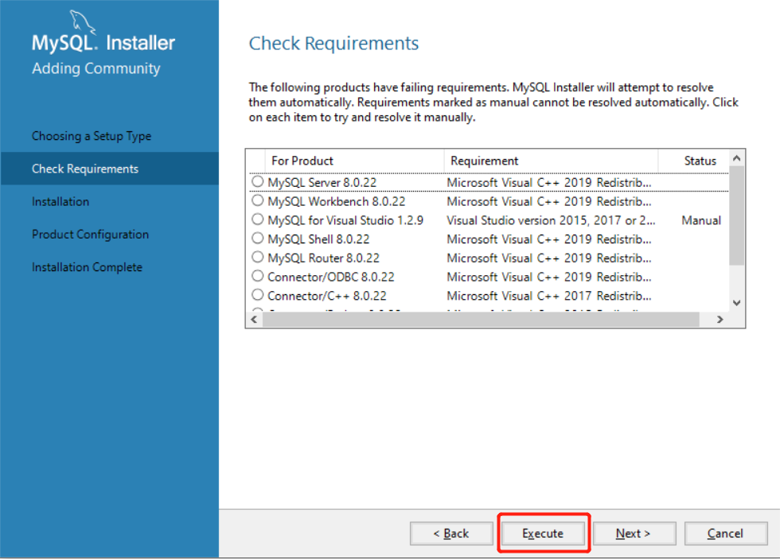

之后点击`Next`，进入下图界面。

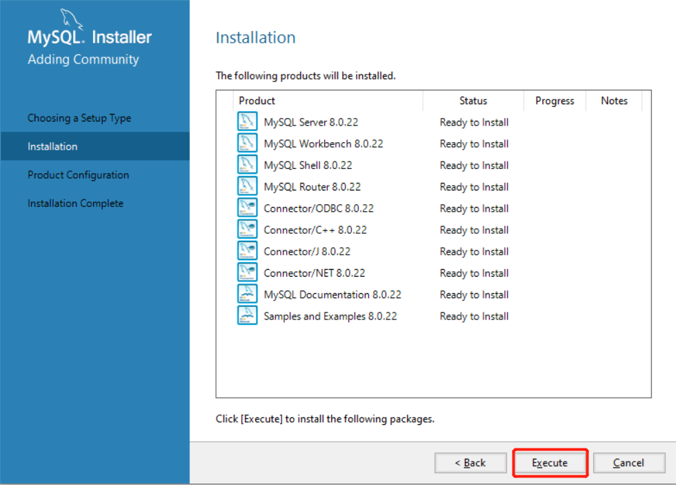

点击`Execute`，系统会自动检测需要的软件是否进行了安装，如果没有安装的话，将会自动安装，我们只需要选择同意并安装就可以了。

安装完之后，点击`Next、Next`，进入下图界面。

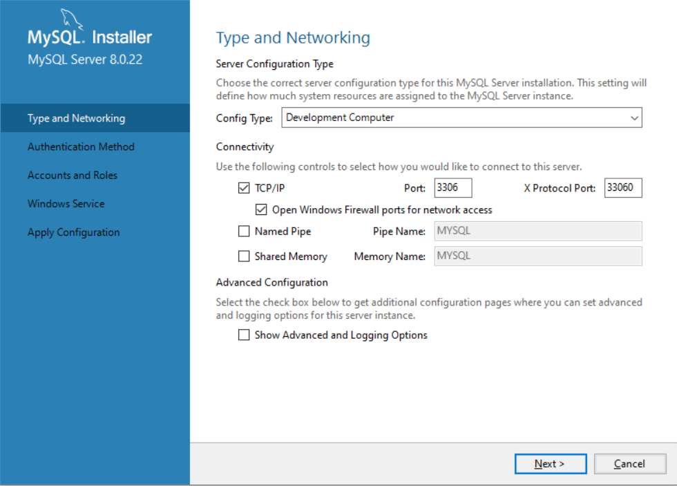

默认选项之后点击`Next`，进入下图界面。

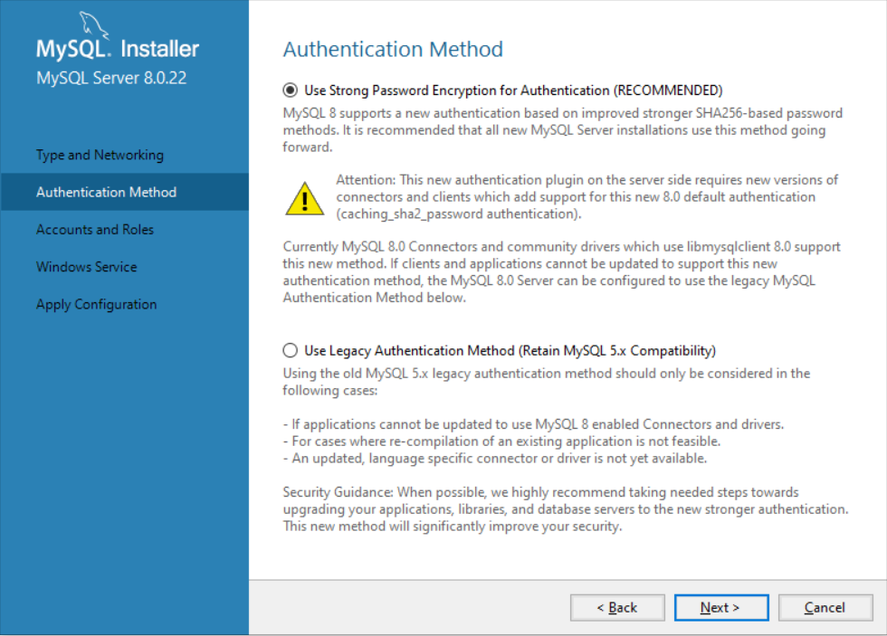

点击`Next`，设置数据库`root`用户密码之后`Next`，进入下图界面。

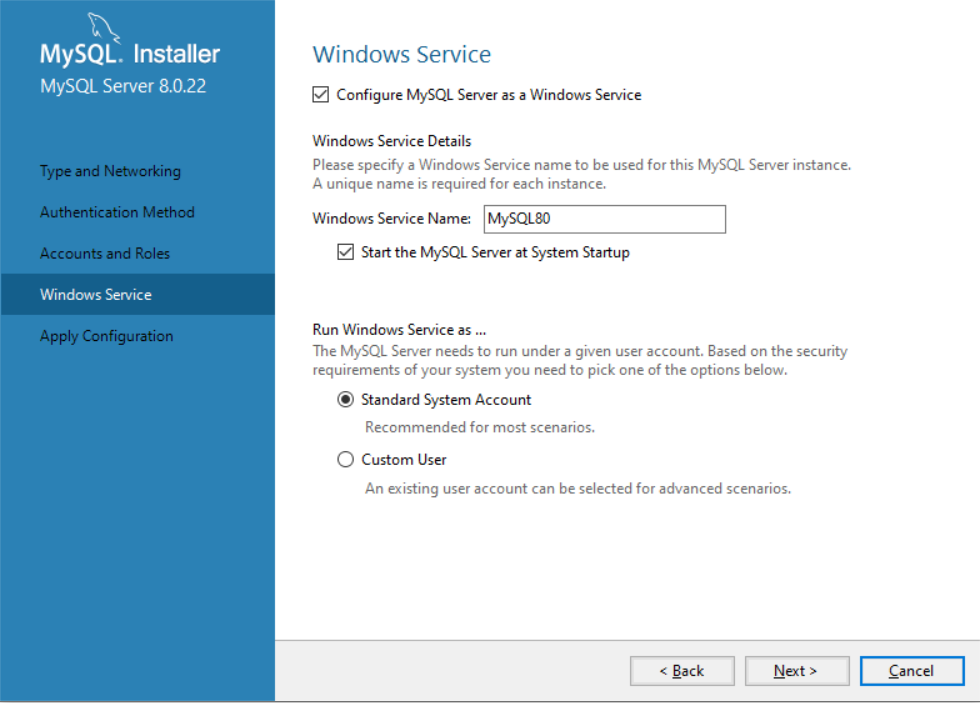

选择默认设置，点击`Next`之后，进入下图界面。

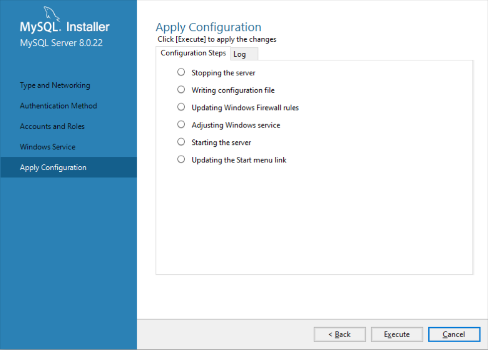

点击`Execute`，选择`Finish`，点击`Next`，进入下图界面。。

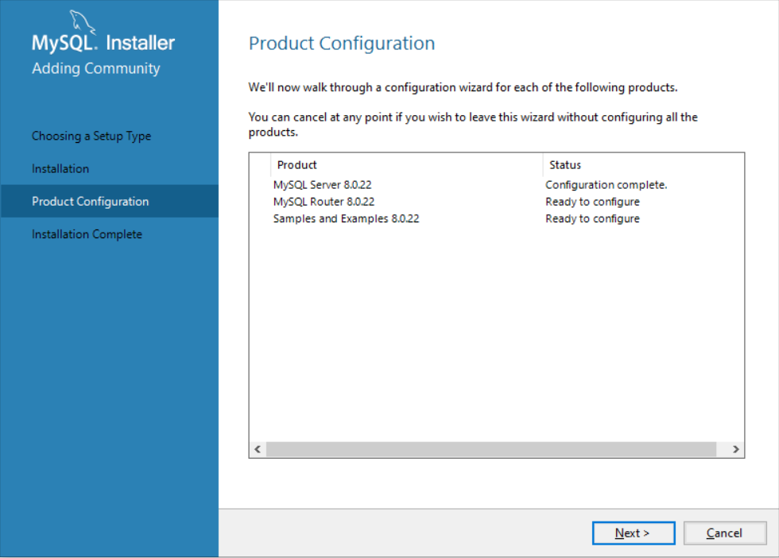

点击`Finish`进入下图界面。

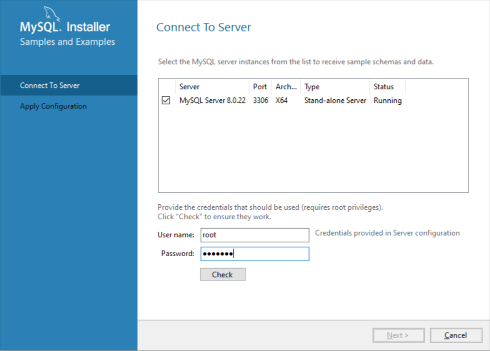

点击`Next`进入下图界面，输入`root`用户口令，点击`check`测试一下是否连接成功，之后点击`Next`，进入下图界面。

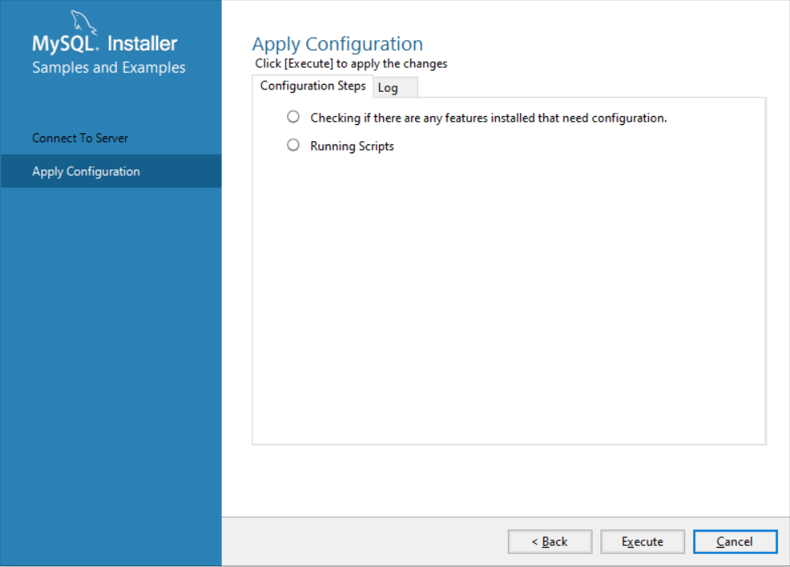

点击`Execute`之后点击`Finish`，完成安装。

安装完成后，在开始菜单打开`MySQL 8.0 Command Line Client`，输入用户口令，进入命令行，输入`status`，出现下图内容说明安装成功。

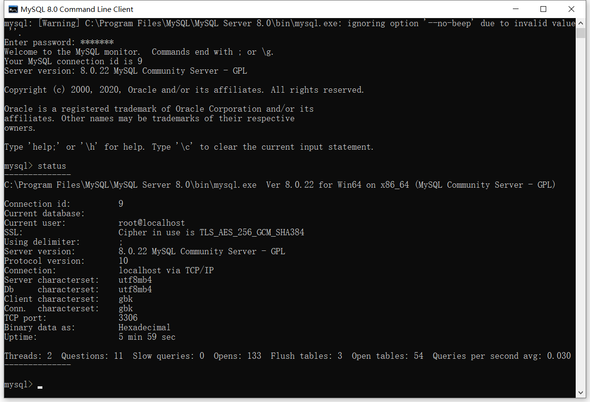

## centos7安装MySQL
### 查看系统版本
```shell
[root@localhost ~]# cat /etc/redhat-release

CentOS Linux release 7.6.1810 (Core) 
```
### 下载安装包
MySQL Yum 源：`https://repo.mysql.com/`

发布包命名规则：
```
{mysql80}-community-release-{platform}-{version-number} .noarch.rpm
```
说明：
* `{mysql80}`：MySQL 版本号
* `{platform}`：平台(系统)号，⽤来描述系统的版本
* `{version-number}`：MySQL 仓库配置 RPM 包的版本号

如下：
```
mysql80-community-release-el7-11.noarch.rpm 
```
说明：
* `mysql80`: MySQL 版本号，默认是 MySQL8.0 版本
* `el7`：其中`el`是`Enterprise Linux`的编写，7 表⽰ Linux ⼤版本号，⽐如`el6`表⽰`Linux6`，`el7`表⽰`Linux7`，`el8`表⽰`Linux8`，`fc`则表⽰`Fedora`
* `el7-11`：表⽰ MySQL 仓库配置 RPM 包的第 11 次更新

下载安装包。
```shell
wget https://repo.mysql.com/mysql80-community-release-el7-11.noarch.rpm
yum -y install mysql80-community-release-el7-11.noarch.rpm
# 检查是否已成功添加mysql yum源
yum repolist enabled | grep mysql.*-community
```
```
mysql-connectors-community/x86_64    MySQL Connectors Community              258
mysql-tools-community/x86_64         MySQL Tools Community                   108
mysql80-community/x86_64             MySQL 8.0 Community Server              503
```
```shell
[root@localhost ~]# yum install -y mysql-community-server
[root@localhost ~]# systemctl start mysqld
[root@localhost ~]# systemctl status mysqld
```
```
● mysqld.service - MySQL Server
   Loaded: loaded (/usr/lib/systemd/system/mysqld.service; enabled; vendor preset: disabled)
   Active: active (running) since Fri 2024-08-09 17:59:56 CST; 20s ago
     Docs: man:mysqld(8)
           http://dev.mysql.com/doc/refman/en/using-systemd.html
  Process: 12784 ExecStartPre=/usr/bin/mysqld_pre_systemd (code=exited, status=0/SUCCESS)
 Main PID: 12934 (mysqld)
   Status: "Server is operational"
    Tasks: 38
   Memory: 450.1M
   CGroup: /system.slice/mysqld.service
           └─12934 /usr/sbin/mysqld

Aug 09 17:59:44 VM-20-4-centos systemd[1]: Starting MySQL Server...
Aug 09 17:59:56 VM-20-4-centos systemd[1]: Started MySQL Server.
```
安装完成。
### 开机自启
```shell
systemctl enable mysqld
# 查看是否
systemctl list-unit-files|grep mysqld
```
### 登入MySQL
⾸次安装成功，MySQL 把`root`⽤⼾的默认密码保存在错误⽇志中 ，此时的密码为随机的字符串，可以通过如下指令查看密码。
```shell
grep 'temporary password' /var/log/mysqld.log
```
```
2024-08-09T09:59:50.673781Z 6 [Note] [MY-010454] [Server] A temporary password is generated for root@localhost: 1mCZblDlYG?c
```
登录 MySQL。
```shell
mysql -uroot -p
```
### 修改密码
修改 MySQL 的配置文件（`/etc/my.cnf`）：
```
[mysqld]
datadir=/var/lib/mysql
socket=/var/lib/mysql/mysql.sock

log-error=/var/log/mysqld.log
pid-file=/var/run/mysqld/mysqld.pid

# 新增
validate_password.policy=LOW
validate_password.length=6
```
说明：
* `validate_password.policy`：密码策略，默认值为`MEDIUM`。可以设置为`LOW、MEDIUM、STRONG`或者自定义。不同策略的要求：
 * `0/LOW`：只验证长度
 * `1/MEDIUM`：验证长度、数字、大小写、特殊字符；默认值
 * `2/STRONG`：验证长度、数字、大小写、特殊字符、字典文件
* `validate_password.length`：密码最小长度，默认值为 8。可以根据需要修改最小密码长度。

重启 MySQL：
```shell
systemctl restart mysqld
```
修改密码：
```shell
mysql> ALTER USER 'root'@'localhost' identified by '想修改的密码';
```
### 运行远程访问
```shell
# 访问mysql库
mysql> use mysql;
# 修改root用户能在任何host访问（授权远程连接）
mysql> update user set host = '%' where user = 'root';
# 刷新
mysql> FLUSH PRIVILEGES;
```
