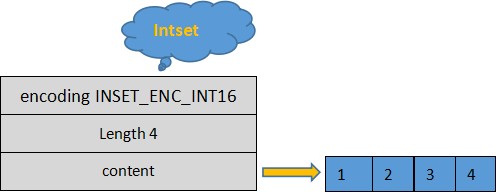
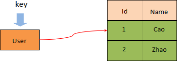

Redis 是`Key-Value`类型缓存型数据库，Redis 为了存储不同类型的数据，提供了 5 种常用数据类型：`String、List、Set、Zset、Hash`。
:::tip
这里指的数据类型是`Value`（值） 的数据类型，而非`key`。
:::

|     结构类型      |        结构存储的值         | 结构的读写能力                                                                          |
|:-------------:|:---------------------:|:---------------------------------------------------------------------------------| 
| 字符串 (String)  |     可以是字符串、整数或浮点数     | 对整个字符串或字符串的一部分进行操作；对整数或浮点数进行自增或自减操作                                              | 
|  列 表 (List)   | 一个链表，链表上的每个节点都包含一个字符串 | 对链表的两端进行push和pop操作，读取单个或多个元素；根据值查找或删除元素                                          |
| 集 合<br> (Set) |      包含字符串的无序集合       | 字符串的集合，包含基础的方法有看是否存在添加、获取、删除；还包含计算交集、并集、差集等                                      |
|  散 列 (Hash)   |      包含键值对的无序散列表      | 包含方法有添加、获取、删除单个元素                                                                | 
|  有序集合 (Zset)  |     和散列一样，用于存储键值对     | 字符串成员与浮点数分数之间的有序映射；<br />元素的排列顺序由分数的大小决定；<br />包含方法有添加、获取、删除单个元素以及根据分值范围或成员来获取元素 |

## String字符串
`String`是 Redis 中最基本的数据类型，一个`key`对应一个`value`。

`String`类型是二进制安全的，意思是 Redis 的`string`可以包含任何数据。如数字，字符串，`jpg`图片或者序列化的对象。这意味着它的长度是已知的，不由任何其他终止字符决定的，一个字符串类型的值最多能够存储 512 MB 的内容。
:::info
二进制安全：是一种主要用于字符串操作函数的计算机编程术语。只关心二进制化的字符串，不关心具体的字符串格式，严格的按照二进制的数据存取。这保证字符串不会因为某些操作而遭到损坏。
:::
### 认识Redis字符串
Redis 使用标准 C 语言编写，但在存储字符时，Redis 并未使用 C 语言的字符类型，而是自定义了一个属于特殊结构`SDS（Simple Dynamic  String）`即简单动态字符串），这是一个可以修改的内部结构，非常类似于 Java 的`ArrayList`。
#### SDS动态字符串
SDS 的结构定义如下：
```c
struct sdshdr{
//记录buf数组中已使用字符的数量，等于 SDS 保存字符串的长度
int len;
//记录 buf 数组中未使用的字符数量
int free;
//字符数组，用于保存字符串
char buf[];
```
从上述结构体可以看出，Redis`string`将字符串存储到字符类型的`buf[]`中，并使用`len`、`free`对`buf[]`数组的长度和未使用的字符数进行描述。


上图存储了一个`len`为 4 的`java\0`字符串，并且未使用的字符数`free`为 0。你可能注意到`buf`数组存储的字符串仍然以 C 语言字符格式的`\0`结尾的，这样做的目的是为了能够重用 C语言库`<string.h>`中的部分函数。

:::info
在 C 语言中，字符串类型的结尾以空字符串 ‘\0’ 来标识的。但在某些情况下，字符串可能会包含具有实际意义的“空字符”，此时 C 语言就无法正确的存取这个字符了，而 Redis 通过 len 来标识字符串的总长度，从而保证了数据的二进制安全特性。
:::
#### 分配冗余空间
`string`采用了预先分配冗余空间的方式来减少内存的频繁分配：


Redis 每次给`string`分配的空间都要大于字符串实际占用的空间，这样就在一定程度上提升了 Redis`string`存储的效率，比如当字符串长度变大时，无需再重新申请内存空间。
#### string自动扩容
当字符串所占空间小于 1MB 时，Redis 对字符串存储空间的扩容是以成倍的方式增加的；而当所占空间超过 1MB 时，每次扩容只增加 1MB。Redis 字符串允许的最大值字节数是 512 MB。
### 命令格式
```redis
SET key value [EX seconds|PX milliseconds] [NX|XX]
```
其中`[]`内代表可选参数，含义：
* `EX seconds`：设置指定的过期时间，以秒为单位
* `PX milliseconds`：设置指定的过期时间，以毫秒为单位
* `NX`：先判断`key`是否存在，如果`key`不存在，则设置`key`与`value`
* `XX`：先判断`key`是否存在，如果`key`存在，则重新设置`value`

### 常用命令

| 命令                               | 简述                                                |
|:---------------------------------|:--------------------------------------------------|
| GET key                          | 检索指定键的值                                           |
| GETRANGE key start end           | 返回 key 中字符串值的子字符                                  |
| GETSET key value                 | 将给定 key 的值设置为 value，并返回 key 的旧值                   |
| SET key value                    | 设定指定键的值                                           |
| SETEX key seconds value          | 将值 value 存储到 key 中，并将 key 的过期时间设为 seconds (以秒为单位) |
| SETNX key value                  | 当 key 不存在时设置 key 的值                               |
| SETRANGE key offset value        | 从偏移量 offset 开始，使用指定的 value 覆盖 key 所存储的部分字符串值      |
| STRLEN key                       | 返回 key 所储存的字符串值的长度                                |
| DEL                              | 删除存储在给定键中的值                                       |
| INCR key                         | 将键存储的值加 1                                         |
| DECR key                         | 将键存储的值减 1                                         |
| INCRBY key increment             | 将 key 所储存的值加上给定的递增值（increment）                    |
| DECRBY key increment             | 将 key 所储存的值减去给定的递减值（decrement）                    |
| INCRBYFLOAT key increment        | 将 key 所储存的值加上指定的浮点递增值（increment）                  |
| MGET key1 [ key2.. ]             | 批量获取一个或多个 key 所存储的值                               |
| MSET key value [key value ...]   | 同时设置多个键值对                                         |
| MSETNX key value [key value ...] | 当指定的 key 都不存在时，用于设置多个键值对                          |
| APPEND key value                 | 将 value 追加到 key 所存储值的末尾                           |

```bash
127.0.0.1:6379> set hello world
OK
127.0.0.1:6379> get hello
"world"
127.0.0.1:6379> del hello
(integer) 1
127.0.0.1:6379> get hello
(nil)
127.0.0.1:6379> set counter 2
OK
127.0.0.1:6379> get counter
"2"
127.0.0.1:6379> incr counter
(integer) 3
127.0.0.1:6379> get counter
"3"
127.0.0.1:6379> incrby counter 100
(integer) 103
127.0.0.1:6379> get counter
"103"
127.0.0.1:6379> decr counter
(integer) 102
127.0.0.1:6379> get counter
"102"
127.0.0.1:6379> set str hello
OK
127.0.0.1:6379> getrange str 0 3
"hell"
```
### 实战场景
* 缓存：经典使用场景，把常用信息，字符串，图片或者视频等信息放到 redis 中，redis 作为缓存层，mysql 做持久化层，降低 mysql 的读写压力。
* 计数器：redis 是单线程模型，一个命令执行完才会执行下一个，同时数据可以一步落地到其他的数据源。
* `session`：常见方案`spring session + redis`实现`session`共享，

## List列表
Redis`list`（列表）相当于 Java 语言中的 `LinkedList` 结构，是一个链表而非数组，其插入、删除元素的时间复杂度为`O(1)`，但是查询速度欠佳，时间复杂度为`O(n)`。

当向列表中添加元素值时，首先需要给这个列表指定一个 key 键，然后使用相应的命令，从列表的左侧（头部）或者右侧（尾部）来添加元素，这些元素会以添加时的顺序排列。一个列表最多可以包含 2^32^ - 1 个元素，当列表弹出最后一个元素时，该结构会被自动删除。

### 认识Redis列表
Redis 列表的底层存储结构，其实是一个被称为快速链表（quicklist）的结构。当列表中存储的元素较少时，Redis 会使用一块连续的内存来存储这些元素，这个连续的结构被称为 ziplist（压缩列表），它将所有的元素紧挨着一起存储。
压缩列表是 Redis 为节省内存而开发的，它是由一系列特殊编码的连续内存块组成的顺序型数据结构，一个压缩列表了可以包含任意多个节点，每个节点都可以保存一个字符数组或者整数值。

而当数据量较大时，Redis 列表就会是用 quicklist（快速链表）存储元素。Redis 之所以采用两种方法相结合的方式来存储元素。这是因为单独使用普通链表存储元素时，所需的空间较大，会造成存储空间的浪费。因此采用了链表和压缩列表相结合的方式，也就是 quicklist + ziplist，结构如下图：


如上图所示，将多个 ziplist 使用双向指针串联起来，这样既能满足快速插入、删除的特性，又节省了一部分存储空间。
### 常用命令

| 命令                                    | 简述                                                             |
|:--------------------------------------|:---------------------------------------------------------------|
| RPUSH key value1 [ value2 ]           | 在列表尾部添加一个或多个值                                                  |
| RPUSHX key value                      | 当存储列表的 key 存在时，用于将值插入到列表的尾部                                    |
| RPOP key                              | 从列表的右端弹出一个值，并返回被弹出的值                                           |
| LPUSH key value1 [ value2 ]           | 在列表头部插入一个或者多个值                                                 |
| LPUSHX key value                      | 当储存列表的 key 存在时，用于将值插入到列表头部                                     |
| LPOP key                              | 从列表的左端弹出一个值，并返回被弹出的值                                           |
| LRANGE key start stop                 | 获取列表在给定范围上的所有值                                                 |
| LINDEX key index                      | 通过索引获取列表中的元素。你也可以使用负数下标，以 -1 表示列表的最后一个元素， -2 表示列表的倒数第二个元素，以此类推 |
| LREM key count value                  | 从列表中删除元素与 value 相等的元素。count 表示删除的数量，为 0 表示全部移除                 |
| LLEN key                              | 获取列表的长度                                                        |
| LSET key index value                  | 通过其索引设置列表中元素的值                                                 |
| LINSERT key before/after pivot value  | 指定列表中一个元素在它之前或之后插入另外一个元素                                       |
| LTRIM key start stop                  | 保留列表中指定范围内的元素值                                                 |
| BLPOP key1 [key2 ] timeout            | 用于删除并返回列表中的第一个元素（头部操作），如果列表中没有元素，就会发生阻塞，直到列表等待超时或发现可弹出元素为止     |
| BRPOP key1 [key2 ] timeout            | 用于删除并返回列表中的最后一个元素（尾部操作），如果列表中没有元素，就会发生阻塞， 直到列表等待超时或发现可弹出元素为止   |
| BRPOPLPUSH source destination timeout | 从列表中取出最后一个元素，并插入到另一个列表的头部。如果列表中没有元素，就会发生阻塞，直到等待超时或发现可弹出元素时为止   |

使用列表的技巧：
* `lpush+lpop=Stack`(栈)
* `lpush+rpop=Queue`（队列）
* `lpush+ltrim=Capped Collection`（有限集合）
* `lpush+brpop=Message Queue`（消息队列）

```bash
127.0.0.1:6379> lpush mylist 1 2 ll ls mem
(integer) 5
127.0.0.1:6379> lrange mylist 0 -1
1) "mem"
2) "ls"
3) "ll"
4) "2"
5) "1"
127.0.0.1:6379> lindex mylist -1
"1"
127.0.0.1:6379> lindex mylist 10        # index不在 mylist 的区间范围内
(nil)
```
### 实战场景
* 微博`TimeLine`: 有人发布微博，用`lpush`加入时间轴，展示新的列表信息。
* 消息队列

## Set集合
Redis`set`遵循无序排列的规则，集合中的每一个成员都是字符串类型，并且不可重复。Redis`set`是通过哈希映射表实现的，所以它的添加、删除、查找操作的时间复杂度为`O(1)`。集合中最多可容纳 2^32^-1 个成员。
### 认识set集合
Redis set 采用了两种方式相结合的 底层存储结构，分别是`intset`（整型数组）与`hash table`（哈希表），当`set`存储的数据满足以下要求时，使用`intset`结构：
* 集合内保存的所有成员都是整数值
* 集合内保存的成员数量不超过 512 个

当不满足上述要求时，则使用`hash table`结构。

Redis 中 intset 的结构体定义如下：
```c
typedf struct inset{
uint32_t encoding;//指定编码方式，默认为INSET_ENC_INT16
uint32_t length;//集合内成员的总个数
int8_t contents[];//实际存储成员的数组，并且数组中的数值从小到大依次排列
}inset;
```
* `encoding`：用来指定编码格式，共有三种，分别是`INTSET_ENC_INT16、INSET_ENC_INT32`和`INSET_ENC_INT64`，它们对应不同的数值范围。Redis 为了尽可能地节省内存，它会根据插入数据的大小来选择不同的编码格式
* `length`：集合内成员的数量，记录`contents`数组中共有多少个成员
* `contents`：存储成员的数组，数组中的成员从小到大依次排列，且不允许重复



### 常用命令

| 命令                                             | 简述                          |
|:-----------------------------------------------|:----------------------------|
| SADD key member1 [ member2 ]                   | 向集合添加一个或多个成员                |
| SCARD key                                      | 返回集合中元素的个数                  |
| SDIFF key1 [ key2 ]                            | 求两个或多个集合的差集                 |
| SDIFFSTORE destination key1 [key2]             | 求两个集合或多个集合的差集，并将结果保存到指定的集合中 |
| SINTER key1 [ key2 ]                           | 求两个或多个集合的交集                 |
| SINTERSTORE destination key1 [key2]            | 求两个或多个集合的交集，并将结果保存到指定的集合中   |
| SMEMBERS key                                   | 查看集合中所有元素                   |
| SISMEMBER key member                           | 判断 member 元素是否是集合 key 的成员   |
| SUNION key1 [ key2 ]                           | 求两个或者多个集合的并集                |
| SMOVE source destination member                | 	将集合中的元素移动到指定的集合中           |
| SPOP key [count]                               | 弹出指定数量的元素                   |
| SRANDMEMBER key [count]                        | 随机从集合中返回指定数量的元素，默认返回 1个     |
| SREM key member1 [member2]                     | 删除一个或者多个元素，若元素不存在则自动忽略      |
| SUNION key1 [key2]                             | 求两个或者多个集合的并集                |
| SUNIONSTORE destination key1 [key2]            | 求两个或者多个集合的并集，并将结果保存到指定的集合中  |
| SSCAN key cursor [match pattern] [count count] | 该命令用来迭代的集合中的元素              |

```bash
127.0.0.1:6379> sadd myset hao hao1 xiaohao hao
(integer) 3
127.0.0.1:6379> smembers myset
1) "xiaohao"
2) "hao1"
3) "hao"
127.0.0.1:6379> sismember myset hao
(integer) 1
```
### 实战场景
* 标签（`tag`）,给用户添加标签，或者用户给消息添加标签，这样有同一标签或者类似标签的可以给推荐关注的事或者关注的人
* 点赞，或点踩，收藏等，可以放到`set`中实现

## Hash散列
Redis`hash`（哈希散列）是由字符类型的`field`（字段）和`value`组成的哈希映射表结构（也称散列表），它非常类似于表格结构。在`hash`类型中，`field`与`value`一一对应，且不允许重复。

Redis`hash`特别适合于存储对象。一个`filed/value`可以看做是表格中一条数据记录；而一个`key`可以对应多条数据。下面举一个例子，使用`hash`类型存储表格中的数据，这里以`user`为`key`，`id:1`为字段，`name:Cao`为`value`：

| id | name |
|----|------|
| 1  | Cao  |
| 2  | Zhao |

```shell
#以user为key，设置 id+序号为字段，name+名字为值
127.0.0.1:6379> HMSET user id:1 name:Cao id:2 name:Zhao
OK
# 查询 user 这个key下所有的数据，并以字符串的形式将值返回
127.0.0.1:6379> HGETALL user
1) "id:1"
2) "name:Cao"
3) "id:2"
4) "name:Zhao"
```
:::tip
当我们对 value 进行查询时，这个值只能以字符串的形式返回
:::
通过上述方法，我们就把表格中的数据存储在了内存中。Redis`hash`的存储结构：



一个`hash`类型的`key`最多可以存储 2^32^-1 字段/值。同时 Redis`hash`会为这个`key`额外储存一些附加的管理信息，比如这个键的类型、最后一次访问这个键的时间等，所以`hash`键越来越多时，Redis 耗费在管理信息方面的内存就越多。当`hash`类型移除最后一个元素后，该存储结构就会被自动删除，其占用内存也会被系统回收。
### 常用命令
| 命令                                      | 简述                             |
|:----------------------------------------|:-------------------------------|
| HSET key field value                    | 添加键值对                          |
| HSETNX key field value                  | 仅当字段 field 不存在时，设置哈希表字段的值      |
| HMSET key field1 value1 [field2 value2] | 在哈希表中同时设置多个 field-value(字段-值）  |
| HGET key field                          | 获取 key 关联的哈希字段的值               |
| HMGET key field1 [ field2 ]             | 用于同时获取多个给定哈希字段（field）对应的值      |
| HGETALL key                             | 获取散列中包含的所有键值对                  |
| HDEL key field1 [ field2 ]              | 如果给定键存在于散列中，那么就移除这个键           |
| HLEN key                                | 获取 key 中的哈希表的字段数量              |
| HKEYS key                               | 获取 key 关联的所有字段和值               |
| HEXISTS key field                       | 	用于确定哈希表字段是否存在                 |
| HINCRBY key field increment             | 给 key 关联的哈希字段做整数增量运算           |
| HINCRBYFLOAT key field increment        | 给 key 关联的哈希字段做浮点数增量运算          |
| HVALS key                               | 用于获取哈希表中的所有值                   |
| HSCAN key cursor                        | 迭代哈希表中的所有键值对，cursor 表示游标，默认为 0 |

```bash
127.0.0.1:6379> hset user name1 hao
(integer) 1
127.0.0.1:6379> hset user email1 hao@163.com
(integer) 1
127.0.0.1:6379> hgetall user
1) "name1"
2) "hao"
3) "email1"
4) "hao@163.com"
127.0.0.1:6379> hget user user
(nil)
127.0.0.1:6379> hget user name1
"hao"
127.0.0.1:6379> hset user name2 xiaohao
(integer) 1
127.0.0.1:6379> hset user email2 xiaohao@163.com
(integer) 1
127.0.0.1:6379> hgetall user
1) "name1"
2) "hao"
3) "email1"
4) "hao@163.com"
5) "name2"
6) "xiaohao"
7) "email2"
8) "xiaohao@163.com"
```
### 实战场景
缓存：能直观，相比`string`更节省空间，的维护缓存信息，如用户信息，视频信息等。
## Zset有序集合
Redis`zset`（有序集合）中的成员是有序排列的，它和`set`集合的相同之处在于，集合中的每一个成员都是字符串类型，并且不允许重复；而它们最大区别是，有序集合是有序的，`set`是无序的，这是因为有序集合中每个成员都会关联一个`double`（双精度浮点数）类型的`score`(分数值)，Redis 正是通过`score`实现了对集合成员的排序。

使用以下命令创建一个有序集合：
```shell
127.0.0.1:6379> ZADD key score member [score member ...]  
```
* `key`：指定一个键名
* `score`：分数值，用来描述`member`，它是实现排序的关键
* `member`：要添加的成员（元素）

当 key 不存在时，将会创建一个新的有序集合，并把分数/成员（`score/member`）添加到有序集合中；当`key`存在时，但`key`并非`zset`类型，此时就不能完成添加成员的操作，同时会返回一个错误提示。

:::tip
在有序集合中，成员是唯一存在的，但是分数（score）却可以重复。有序集合的最大的成员数为 2^32^ - 1。
:::
### 认识有序集合
#### 压缩列表
有序集合（`zset`）同样使用了两种不同的存储结构，分别是`zipList`（压缩列表）和`skipList`（跳跃列表），当`zset`满足以下条件时使用压缩列表：
* 成员的数量小于 128 个
* 每个`member`（成员）的字符串长度都小于 64 个字节

下面对压缩列表做简单介绍，它由以下五部分组成：

| zlbytes  | zltail  | zllen  | entry  | zlend  |
|---|---|---|---|---|


上述每一部分在内存中都是紧密相邻的，并承担着不同的作用：
* `zlbytes`是一个无符号整数，表示当前 `ziplist` 占用的总字节数；
* `zltail`指的是压缩列表尾部元素相对于压缩列表起始元素的偏移量。
* `zllen`指 `ziplist` 中 `entry` 的数量。当 `zllen` 比 2^16^-2 大时，需要完全遍历 `entry` 列表来获取`entry`的总数目。
* `entry`用来存放具体的数据项（`score`和`member`），长度不定，可以是字节数组或整数，`entry`会根据成员的数量自动扩容。
* `zlend`是一个单字节的特殊值，等于 255，起到标识`ziplist`内存结束点的作用。

下面执行`ZADD`命令添加两个成员：`xh`（小红） 的工资是 3500.0；`xm`（小明） 的工资是 3200.0。
```
ZADD salary 3500.0 xh 3200.0 xm
```
上述成员在压缩列表中的布局：

| zlbytes  | zltail  | zllen  | "xm"  | "3200.0"  | "xh"  | "3500.0"  | zllen |
|---|---|---|---|---|---|---|---|

当`zset`使用压缩列表保存数据时，`entry`的第一个节点保存`member`，第二个节点保存`score`。依次类推，集合中的所有成员最终会按照`score`从小到大排列。 
#### 跳跃列表
当有序结合不满足使用压缩列表的条件时，就会使用`skipList`结构来存储数据。

跳跃列表（`skipList`）又称“跳表”是一种基于链表实现的随机化数据结构，其插入、删除、查找的时间复杂度均为`O(logN)`。从名字可以看出“跳跃列表”，并不同于一般的普通链表，它的结构较为复杂，本节只对它做浅显的介绍，如有兴趣可自行研究。

在 Redis 中一个 `skipList` 节点最高可以达到 64 层，一个“跳表”中最多可以存储 2^64^ 个元素，每个节点都是一个 `skiplistNode`（跳表节点）。`skipList`的结构体定义如下：
```c
typedf struct zskiplist{
//头节点
struct zskiplistNode *header;
//尾节点
struct zskiplistNode *tail;
// 跳表中的元素个数
unsigned long length;
//表内节点的最大层数
int level;
}zskiplist;
```
* `header`：指向`skiplist`的头节点指针，通过它可以直接找到跳表的头节点，时间复杂度为`O(1)`
* `tail`：指向`skiplist`的尾节点指针，通过它可以直接找到跳表的尾节点，时间复杂度为`O(1)`
* `length`：记录`skiplist`的长度，也就跳表中有多少个元素，但不包括头节点
* `level`：记录当前跳表内所有节点中的最大层数（`level`）

跳跃列表的每一层都是一个有序的链表，链表中每个节点都包含两个指针，一个指向同一层的下了一个节点，另一个指向下一层的同一个节点。最低层的链表将包含`zset`中的所有元素。如果说一个元素出现在了某一层，那么低于该层的所有层都将包含这个元素，也就说高层是底层的子集。

下图是一个上下共四层的跳跃列表结构：


跳跃列表中的每个节点都存储着`S:V`（即`score/value`），示意图显示了使用跳跃列表查找`S:V`节点的过程。跳跃列表的层数由高到低依次排列，最低层是 L0 层，最高层是 L3 层，共有 4 层。

首先从最高层开始遍历找到第一个`S:V`节点，然后从此节点开始，逐层下降，通过遍历的方式找出每一层的`S:V`节点，直至降至最底层（L0）才停止。在这个过程中找到所有`S:V`节点被称为期望的节点。跳跃列表把上述搜索一系列期望节点的过程称为“搜索路径”，这个“搜索路径”由搜索到的每一层的期望节点组成，其本质是一个列表。
### 常用命令

| 命令                                             | 简述                                  |
|:-----------------------------------------------|:------------------------------------|
| ZADD key score1 member1 [score2 member2]       | 将一个或多个成员添加到有序集合中，或者更新已存在成员的 score 值 |
| ZRANGE key start stop [ WITHSCORES ]           | 根据元素在有序集合中所处的位置，从有序集合中获取多个元素        |
| ZREM key member [member ...]                   | 如果给定元素成员存在于有序集合中，那么就移除这个元素          |
| ZCARD key                                      | 获取有序集合的成员数                          |
| ZREVRANGE key start stop [ WITHSCORES ]        | 返回有序集中指定区间内的成员，通过索引，分数从高到低          |
| ZREVRANK key member                            | 返回有序集合中指定成员的排名，有序集成员按分数值递减(从大到小)排序  |
| ZSCORE key member                              | 返回有序集中，成员的分数值                       |
| ZCOUNT key min max                             | 用于统计有序集合中指定 score 值范围内的元素个数         |
| ZINCRBY key increment member                   | 用于增加有序集合中成员的分值                      |
| ZINTERSTORE destination numkeys key [key ...]  | 求两个或者多个有序集合的交集，并将所得结果存储在新的 key 中    |
| ZLEXCOUNT key min max                          | 当成员分数相同时，计算有序集合中在指定词典范围内的成员的数量      |
| ZRANGEBYLEX key min max [LIMIT offset count]   | 返回有序集中指定字典区间内的成员数量                  |
| ZRANGEBYSCORE key min max [WITHSCORES] [LIMIT] | 返回有序集合中指定分数区间内的成员                   |
| ZRANK key member                               | 返回有序集合中指定成员的排名                      |
| ZREMRANGEBYLEX key min max                     | 移除有序集合中指定字典区间的所有成员                  |
| ZREMRANGEBYRANK key start stop                 | 移除有序集合中指定排名区间内的所有成员                 |
| ZREMRANGEBYSCORE key min max                   | 移除有序集合中指定分数区间内的所有成员                 |
| ZREVRANGEBYSCORE key max min [WITHSCORES]      | 返回有序集中指定分数区间内的成员，分数从高到低排序           |
| ZREVRANK key member                            | 返回有序集合中指定成员的排名，有序集成员按分数值递减(从大到小)排序  |
| ZUNIONSTORE destination numkeys key [key ...]  | 求两个或多个有序集合的并集，并将返回结果存储在新的 key 中     |
| ZSCAN key cursor [MATCH pattern] [COUNT count] | 迭代有序集合中的元素（包括元素成员和元素分值）             |

```bash
127.0.0.1:6379> zadd myscoreset 100 hao 90 xiaohao
(integer) 2
127.0.0.1:6379> ZRANGE myscoreset 0 -1
1) "xiaohao"
2) "hao"
127.0.0.1:6379> ZSCORE myscoreset hao
"100"
```
### 实战场景
排行榜：有序集合经典使用场景。例如小说视频等网站需要对用户上传的小说视频做排行榜，榜单可以按照用户关注数，更新时间，字数等打分，做排行。
