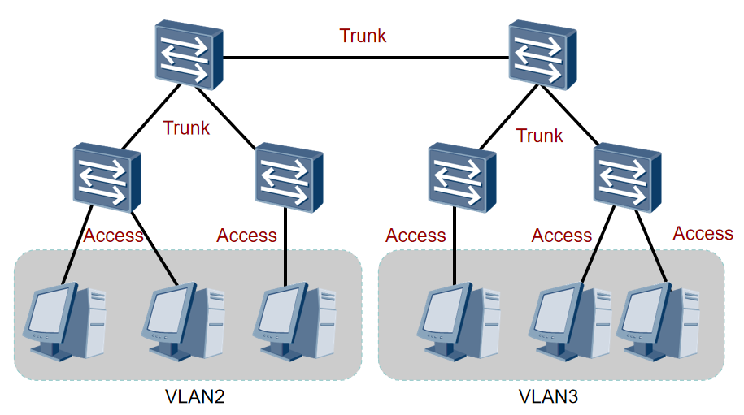
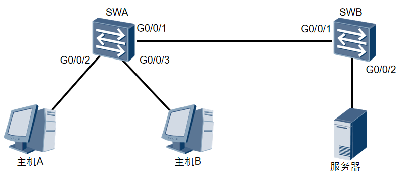

```
[Huawei]d?
  ddns                                    dhcp
  dhcpv6                                  diagnose
  display                                 dns
  domain                                  dot1x
```

| 命令 | 功能 |
| :---: | :---: |
| sysname | 配置设备名称 |
| clock timezone | 设置设备时区 |
| clock datetime | 设置当前日期和时间 |
| clock daylight-saving-time | 设置采用夏令时制 |
| header login | 配置在用户登陆前显示的标题消息 |
| header shell | 配置在用户登陆后显示的标题消息 |

```shell
<Huawei>system-view 
Enter system view, return user view with Ctrl+Z.
[Huawei]sysname RTA
[RTA]
```

系统时钟是设备上的系统时间戳。由于地域的不同，用户可以根据当地规定设置系统时钟。用户必须正确设置系统时钟以确保其与其他设备保持同步。

设置系统时钟的公式为：UTC+时区偏移量+夏时制时间偏移量。clock datetime命令设置HH:MM:SS YYYY-MM-DD格式的系统时钟。但是需要注意的是，如果没有设定时区，或者时区设定为零，那么设定的日期和时间将被认为是UTC时间，所以建议在对系统时间和日期进行配置前先设置时区。

clock timezone命令用来对本地时区信息进行设置，具体的命令参数为time-zone-name { add | minus } offset。其中参数add表示与UTC时间相比，time-zone-name增加的时间偏移量。即，在系统默认的UTC时区的基础上，加上offset，就可以得到time-zone-name所标识的时区时间；参数minus指的是与UTC时间相比，time-zone-name减少的时间偏移量。即，在系统默认的UTC时区的基础上，减去offset，就可以得到time-zone-name所标识的时区时间。

有的地区实行夏令时制，因此当进入夏令时实施区间的一刻，系统时间要根据用户的设定进行夏令时时间的调整。VRP支持夏令时功能。比如，在英国，从三月的最后一个星期天到十月最后一个星期天是夏令时区间，那么可以通过执行命令指定夏令时的开始和结束时间。
```shell
<Huawei>clock timezone BJ add 08:00:00
<Huawei>clock datetime 10:20:29 2013-04-11
<Huawei>display clock 
2013-04-11 10:20:48
Thursday
Time Zone(BJ) : UTC+08:00
```
```shell
[Huawei]header login information "welcome to huawei certification!"
[Huawei]header shell information "Please don't reboot the device!"
……
welcome to huawei certification!
Login authentication
Password:
Please don't reboot the device!
<Huawei>
```

## 命令等级
| 用户等级 | 命令等级 | 名称 |
| :---: | :---: | :---: |
| 0 | 0 | 访问级 |
| 1 | 0 and 1 | 监控级 |
| 2 | 0, 1 and 2 | 配置级 |
| 3-15 | 0, 1, 2 and 3 | 管理级 |

系统将命令进行分级管理，以增加设备的安全性。设备管理员可以设置用户级别，一定级别的用户可以使用对应级别的命令行。缺省情况下命令级别分为0～3级，用户级别分为0～15级。用户0级为访问级别，对应网络诊断工具命令（ping、tracert）、从本设备出发访问外部设备的命令（Telnet客户端）、部分display命令等。用户1级为监控级别，对应命令级0、1级，包括用于系统维护的命令以及display等命令。用户2级是配置级别，包括向用户提供直接网络服务，包括路由、各个网络层次的命令。用户3-15级是管理级别，对应命令3级，该级别主要是用于系统运行的命令，对业务提供支撑作用，包括文件系统、FTP、TFTP下载、文件交换配置、电源供应控制，备份板控制、用户管理、命令级别设置、系统内部参数设置、以及用于业务故障诊断的debugging命令。本例展示了如何修改命令级别，在用户视图下执行save命令需要3级的权限。

在具体使用中，如果我们有多个管理员帐号，但只允许某一个管理员保存系统配置，则可以将save命令的级别提高到4级，并定义只有该管理员有4级权限。这样，在不影响其他用户的情况下，可以实现对命令的使用控制。
## 用户界面

| 用户界面类型 | 编号 |
| :---: | :---: |
| Console | 0 |
| VTY | 0-4 |

```
<Huawei>system-view
[Huawei]user-interface vty 0 4
[Huawei-ui-vty0-4]
```
VTY 接口最大可配范围为0-14。

每类用户界面都有对应的用户界面视图。用户界面（User-interface）视图是系统提供的一种命令行视图，用来配置和管理所有工作在异步交互方式下的物理接口和逻辑接口，从而达到统一管理各种用户界面的目的。

在连接到设备前，用户要设置用户界面参数。系统支持的用户界面包括Console用户界面和VTY用户界面。控制口（Console Port）是一种通信串行端口，由设备的主控板提供。虚拟类型终端（Virtual Type Terminal）是一种虚拟线路端口，用户通过终端与设备建立Telnet或SSH连接后，也就建立了一条VTY，即用户可以通过VTY方式登录设备。

设备一般最多支持15个用户同时通过VTY方式访问。执行user-interface maximum-vty number 命令可以配置同时登录到设备的VTY类型用户界面的最大个数。如果将最大登录用户数设为0，则任何用户都不能通过Telnet或者SSH登录到路由器。

display user-interface 命令用来查看用户界面信息。

不同的设备，或使用不同版本的VRP软件系统，具体可以被使用的VTY接口的最大数量可能不同。
## 配置用户界面命令

| 命令 | 功能 |
| :---: | :---: |
| idle-timeout | 设置超时时间 |
| screen-length | 设置指定终端屏幕的临时显示行数 |
| history-command max-size | 设置历史命令缓冲区的大小 |

```
# Set the size of the history command buffer to 20. 
<Huawei>system-view
[Huawei]user-interface console 0
[Huawei-ui-console0]history-command max-size 20 
# Set the timeout duration to 1 minute and 30 seconds.
[Huawei-ui-console0]idle-timeout 1 30
```
用户可以设置Console界面和VTY界面的属性，以提高系统安全性。如果一个连接上设备的用户一直处于空闲状态而不断开，可能会给系统带来很大风险，所以在等待一个超时时间后，系统会自动中断连接。这个闲置切断时间又称超时时间，默认为10分钟。

当display命令输出的信息超过一页时，系统会对输出内容进行分页，使用空格键切换下一页。

如果一页输出的信息过少或过多时，用户可以执行screen-length命令修改信息输出时一页的行数。默认行数为24，最大支持512行。不建议将行数设置为0，因为那样将不会显示任何输出内容了。

每条命令执行过后，执行的记录都保存在历史命令缓存区。用户可以利用(↑)，(↓)  ，CTRL+P，Ctrl+N这些快捷键调用这些命令。历史命令缓存区中默认能存储10条命令，可以通过运行history-command max-size改变可存储的命令数，最多可存储256条。

## 配置登陆权限
| 命令 | 功能 |
| :---: | :---: |
| user privilege | 配置指定用户界面下的用户级别 |
| set authentication password | 配置本地认证密码 |

```shell
# Set the user level on the VTY0 user interface to 2.
<Huawei>system-view
[Huawei]user-interface vty 0
[Huawei-ui-vty0]user privilege level 2 
[Huawei-ui-vty0-4]set authentication password cipher huawei
```
只使用密码登陆的情况下，登陆权限的密码配置方式。

如果没有权限限制，未授权的用户就可以使用设备获取信息并更改配置。从设备安全的角度考虑，限制用户的访问和操作权限是很有必要的。用户权限和用户认证是提升终端安全的两种方式。用户权限要求规定用户的级别，一定级别的用户只能执行特定级别的命令。

配置用户界面的用户认证方式后，用户登录设备时，需要输入密码进行认证，这样就限制了用户访问设备的权限。在通过VTY进行Telnet连接时，所有接入设备的用户都必须要经过认证。

设备提供三种认证模式，AAA模式、密码认证模式和不认证模式。AAA认证模式具有很高的安全性，因为登录时必须输入用户名和密码。密码认证只需要输入登录密码即可，所以所有的用户使用的都是同一个密码。使用不认证模式就是不需要对用户认证直接登陆到设备。需要注意的是，Console界面默认使用不认证模式。

对于Telnet登录用户，授权是非常必要的，最好设置用户名、密码和指定和帐号相关联的权限。
## 配置接口IP地址


```
# Configure an IP address 10.0.12.1/24 and an IP address 1.1.1.1/32 for LoopBack0.
<Huawei>system-view 
[Huawei]interface gigabitethernet 0/0/0 
[Huawei-GigabitEthernet0/0/0]ip address 10.0.12.1 255.255.255.0
[Huawei-GigabitEthernet0/0/0]interface loopback 0
[Huawei-LoopBack0]ip address 1.1.1.1 32 
```
要在接口运行IP服务，必须为接口配置一个IP地址。一个接口一般只需要一个IP地址。在特殊情况下，也有可能为接口配置一个次要IP地址。例如，当路由器AR2200的接口连接到一个物理网络时，该物理网络中的主机属于两个网段。为了让两个网段的主机都可以通过路由器AR2200访问其它网络，可以配置一个主IP地址和一个次要IP地址。一个接口只能有一个主IP地址，如果接口配置了新的主IP地址，那么新的主IP地址就替代了原来的主IP地址。

用户可以利用`ip address <ip-address > { mask | mask-length }`命令为接口配置IP地址，这个命令中，mask代表的是 32 比特的子网掩码，如`255.255.255.0`，mask-length 代表的是可替换的掩码长度值，如 24，这两者可以交换使用。

Loopback接口是一个逻辑接口，可用来虚拟一个网络或者一个IP主机。在运行多种协议的时候，由于Loopback接口稳定可靠，所以也可以用来做管理接口。

在给物理接口配置IP地址时，需要关注该接口的物理状态。默认情况下，华为路由器和交换机的接口状态为up；如果该接口曾被手动关闭，则在配置完IP地址后，应使用undo shutdown打开该接口。

华为网络设备同时只能有一个用户登录Console界面，因此Console用户的编号固定为0。
Loopback接口是一种逻辑接口，在未创建之前，Loopback接口并不存在。从创建开始，Loopback接口就一直存在，并一直保持Up状态，除非被手动关闭。

| 命令 | 功能 |
| :---: | :---: |
| display version | 查看路由器基本信息 |
| display interface GigabitEthernet 0/0/0 | 查看接口状态信息 |
| display ip interface brief | 查看全部接口的IP简要信息，含IP地址 |
| display ip routing-table | 查看路由表 |
| display current-configuration | 查看当前的配置（内存中） |
| display saved-configuration | 查看保存的配置（Flash中） |
| dir flash | 查看Flash中的文件 |
| save | 保存配置文件 |
| reboot | 重启设备 |

路由的来源：
* 链路层发现的路由
* 静态路由
* 动态路由协议发现的路由

## 静态路由
静态路由是由管理员手工配置而生成的路由。
    其优点为：
使用简单，容易实现
可精确控制路由走向，对网络进行最优化调整
对设备性能要求较低，不额外占用链路带宽
    其缺点为：
网络是否通畅以及是否优化，完全取决于管理员的配置
网络规模扩大时，由于路由表项的增多，将增加配置的繁杂度以及管理员的工作量
网络拓扑发生变更时，不能自动适应，需要管理员参与修正


|                                                                            命令                                                                            |                                                    视图                                                    | 作用 |
|:--------------------------------------------------------------------------------------------------------------------------------------------------------:|:--------------------------------------------------------------------------------------------------------:| :---: |
| `ip route-static ip-address {mask\| mask-length} {nexthop-address\|interface-type interface-number [nexthop-address]} [preference preference \|tag tag]` | 系统 | 配置单播静态路由 |
|                                              `display ip interface [brief] [interface-type interface-number]`                                              |                                                    所有                                                    | 查看接口与IP相关的配置和统计信息或者简要信息 |
|                                                                 display ip routing-table                                                                 |                                                    所有                                                    | 查看路由表 |


## 路由的度量值（metric）
路由度量值表示到达这条路由所指定的路径的代价或者开销，也称为路由权值。    
路由器A到路由器D有两条路由：
  Path1： A→B→C→D ，总开销是9
  Path2： A→E→F→C→D ，总开销是12
路由器优选较小代价值的路由，并加入到路由表中


通常会考虑以下因素作为或者用来计算路由的度量值
* 跳数
* 链路带宽
* 链路延迟
* 链路负载
* 链路可靠度
* 链路MTU
* 代价

### 路由条目优选进路由表


## 路由的选路规则
### 最长匹配原则


最长匹配举例

目的地址为9.1.2.1的数据报文，将命中9.1.0.0/16的路由
```
[Quidway] display ip routing-table
Routing Tables:
Destination/Mask proto   pref  Metric Nexthop     Interface
0.0.0.0/0        Static  60    0      120.0.0.2   Serial0/0
8.0.0.0/8        RIP     100   3      120.0.0.2   Serial0/1
9.0.0.0/8        OSPF    10    50     20.0.0.2    Ethernet0/0
9.1.0.0/16       RIP     100   4      120.0.0.2   Serial0/0
11.0.0.0/8       Static  60    0      120.0.0.2   Serial0/1
20.0.0.0/8       Direct  0     0      20.0.0.1    Ethernet0/2
20.0.0.1/32      Direct  0     0      127.0.0.1   LoopBack0
```
### 静态路由的下一跳
点对点链路：至少写上出接口；但也可以写上下一跳IP地址。
以太网链路：至少写上下一跳IP地址；也可以写上出接口。
下一跳IP地址可以不直连，但这样会发生递归。
### 缺省路由
当路由表中没有与报文的目的地址匹配的表项时，设备可以选择缺省路由作为报文的转发路径。在路由表中，缺省路由的目的网络地址为0.0.0.0，掩码也为0.0.0.0。在本示例中，RTA使用缺省路由转发到达未知目的地址的报文。缺省静态路由的默认优先级也是60。在路由选择过程中，缺省路由会被最后匹配。


```
[RTA]ip route-static 0.0.0.0 0.0.0.0 10.0.12.2 
[RTA]ip route-static 0.0.0.0 0 10.0.12.2 GigabitEthernet 0/0/0

[RTA]display ip routing-table 
Route Flags: R - relay, D - download to fib
--------------------------------------------------------------
Routing Tables: Public  Destinations : 13       Routes : 14       
Destination/Mask Proto Pre Cost Flags NextHop Interface
……
 0.0.0.0/0      Static  60   0  RD   10.0.12.2 GigabitEthernet0/0/0
```
缺省路由是目的地址和掩码都为全0的特殊路由。
如果报文的目的地址无法匹配路由表中的任何一项，路由器将选择依照缺省路由来转发报文。

配置缺省路由后，可以使用`display ip routing-table`命令来查看该路由的详细信息。在本示例中，目的地址在路由表中没能匹配的所有报文都将通过`GigabitEthernet 0/0/0`接口转发到下一跳地址10.0.12.2。

### 负载分担
静态路由支持到达同一目的地的等价负载分担。

当源网络和目的网络之间存在多条链路时，可以通过等价路由来实现流量负载分担。这些等价路由具有相同的目的网络和掩码、优先级和度量值。

本示例中RTA和RTB之间有两条链路相连，通过使用等价的静态路由来实现流量负载分担。

在RTB上配置了两条静态路由，它们具有相同的目的IP地址和子网掩码、优先级（都为60）、路由开销（都为0），但下一跳不同。在RTB需要转发数据给RTA时，就会使用这两条等价静态路由将数据进行负载分担。

在RTA上也应该配置对应的两条等价的静态路由。


```
[RTB]ip route-static 192.168.1.0 255.255.255.0 10.0.12.1 
[RTB]ip route-static 192.168.1.0 255.255.255.0 20.0.12.1 

[RTB]display ip routing-table 
Route Flags: R - relay, D - download to fib
--------------------------------------------------------------
Routing Tables: Public  Destinations : 13       Routes : 14       
Destination/Mask  Proto Pre Cost Flags NextHop Interface
……
192.168.1.0/24	Static 60  0   RD 10.0.12.1 GigabitEthernet 0/0/0
        		   	Static 60  0   RD 20.0.12.1 GigabitEthernet 0/0/1
```
在配置完静态路由之后，可以使用display ip routing-table命令来验证配置结果。在本示例中，红色高亮部分代表路由表中的静态路由。这两条路由具有相同的目的地址和掩码，并且有相同的优先级和度量值，但是它们的下一跳地址和出接口不同。此时，RTB就可以通过这两条等价路由实现负载分担。

### 浮动路由
浮动静态路由在网络中主路由失效的情况下，会加入到路由表并承担数据转发业务。

在配置多条静态路由时，可以修改静态路由的优先级，使一条静态路由的优先级高于其他静态路由，从而实现静态路由的备份，也叫浮动静态路由。在本示例中，RTB上配置了两条静态路由。正常情况下，这两条静态路由是等价的。通过配置preference 100，使第二条静态路由的优先级要低于第一条（值越大优先级越低）。路由器只把优先级最高的静态路由加入到路由表中。当加入到路由表中静态路由出现故障时，优先级低的静态路由才会加入到路由表并承担数据转发业务。


```
[RTB]ip route-static 192.168.1.0 255.255.255.0 10.0.12.1 
[RTB]ip route-static 192.168.1.0 255.255.255.0 20.0.12.1 preference 100

[RTB]display ip routing-table 
Route Flags: R - relay, D - download to fib
--------------------------------------------------------------
Routing Tables: Public  Destinations : 13       Routes : 14       
Destination/Mask Proto Pre Cost Flags NextHop Interface
……
192.168.1.0/24  Static  60   0  RD  10.0.12.1 GigabitEthernet0/0/0
```
在主链路正常情况下，只有主路由会出现在路由表中。

从display ip routing-table命令的回显信息中可以看出，通过修改静态路由优先级实现了浮动静态路由。正常情况下，路由表中应该显示两条有相同目的地、但不同下一跳和出接口的等价路由。由于修改了优先级，回显中只有一条默认优先级为60的静态路由。另一条静态路由的优先级是100，该路由优先级低，所以不会显示在路由表中。

在主链路出现故障时，浮动静态路由会被激活并加入到路由表中，承担数据转发业务。

当主用静态路由出现物理链路故障或者接口故障时，该静态路由不能再提供到达目的地的路径，所以在路由表中会被删除。此时，浮动静态路由会被加入到路由表，以保证报文能够从备份链路成功转发到目的地。在主用静态路由的物理链路恢复正常后，主用静态路由会重新被加入到路由表，并且数据转发业务会从浮动静态路由切换到主用静态路由，而浮动静态路由会在路由表中再次被隐藏。
```
[RTB]interface GigabitEthernet 0/0/0
[RTB-GigabitEthernet 0/0/0]shutdown 
[RTB]display ip routing-table 
Route Flags: R - relay, D - download to fib
--------------------------------------------------------------
Routing Tables: Public  Destinations : 13       Routes : 14       
Destination/Mask Proto Pre Cost Flags NextHop Interface
……
192.168.1.0/24 Static  100  0  RD  20.0.12.1 GigabitEthernet 0/0/1
```


## 动态路由协议
路由协议是路由器之间交互信息的一种语言，路由器之间通过路由选择协议共享网络状态和网络可达性的一些信息。
    路由器依靠动态路由协议来传播和收集路由选择信息。路由协议定义了一套路由器与邻接路由器通信时使用的规则。
    动态计算路由，适应网络变化，找出本地路由器到网络中其它网段的路由。

常见的动态路由协议有：   
* RIP：Routing Information Protocol，路由信息协议。
* OSPF：Open Shortest Path First，开放式最短路径优先。
* ISIS： Intermediate System to Intermediate System，中间系统到中间系统。
* BGP：Border Gateway Protocol，边界网关协议。

### 自治系统（ Autonomous System）
自治系统（AS）：由同一个技术管理机构管理、使用统一选路策略的一些路由器的集合。

### 动态路由协议的分类
自治系统内部的路由协议—— IGP：RIPv1/v2、OSPF、ISIS
自治系统之间的路由协议 —— EGP：BGP

使用算法：
距离矢量路由协议
* 基于距离矢量算法
* RIPv1/v2、BGP

链路状态路由协议
* 基于SPF（Shortest Path First）算法
* OSPF、ISIS

目的地址类型：
单播路由协议（Unicast Routing Protocol）：
* 目的地址为单播
* RIP、OSPF、IS-IS、BGP

组播路由协议（Multicast Routing Protocol）：
* 目的地址为组播
* PIM-SM、PIM-DM

### 路由协议之间的互操作
每种路由协议只能发布和学习自己协议已知的路由
自己已知的路由是指在某个接口上运行了该种路由协议，或者在路由表中的本路由协议发现的路由。

在不同的路由来源间共享路由信息，需要进行引入（ import-route ）操作。
最经常使用的是引入静态路由和直接路由。有时也需要引入其它路由协议的路由。

衡量动态路由协议的一些性能指标
    正确性
能够正确找到最优的路由，且无自环。
    快收敛
当网络的拓朴结构发生变化之后，能够迅速在自治系统中作相应的路由改变。
    低开销
协议自身的开销（内存、CPU、网络带宽）最小。
    安全性
协议自身不易受攻击，有安全机制。
    普适性
适应各种拓扑结构和规模的网络。


## IPv6
### IPv6基本报头
IPv6报文由IPv6基本报头、IPv6扩展报头以及上层协议数据单元三部分组成。
基本报头中的各字段解释如下：
1. Version：版本号，长度为4bit。对于IPv6，该值为6。
2. Traffic Class：流类别，长度为8bit，它等同于IPv4报头中的TOS字段，表示IPv6数据报的类或优先级，主要应用于QoS。
3. Flow Label：流标签，长度为20bit，它用于区分实时流量。流可以理解为特定应用或进程的来自某一源地址发往一个或多个目的地址的连续单播、组播或任播报文。IPv6中的流标签字段、源地址字段和目的地址字段一起为特定数据流指定了网络中的转发路径。这样，报文在IP网络中传输时会保持原有的顺序，提高了处理效率。随着三网合一的发展趋势，IP网络不仅要求能够传输传统的数据报文，还需要能够传输语音、视频等报文。这种情况下，流标签字段的作用就显得更加重要。
4. Payload Length：有效载荷长度，长度为16bit，它是指紧跟IPv6报头的数据报的其它部分。
5. Next Header：下一个报头，长度为8bit。该字段定义了紧跟在IPv6报头后面的第一个扩展报头（如果存在）的类型。
跳数限制（Hop Limit），长度为8bit，该字段类似于IPv4报头中的Time to Live字段，它定义了IP数据报所能经过的最大跳数。每经过一个路由器，该数值减去1；当该字段的值为0时，数据报将被丢弃。
6. Source Address：源地址，长度为128bit，表示发送方的地址。
7. Destination Address：目的地址，长度为128bit，表示接收方的地址。

与IPv4相比，IPv6报头去除了IHL、Identifier、Flags、Fragment Offset、Header Checksum、 Options、Padding域，只增了流标签域，因此IPv6报文头的处理较IPv4大大简化，提高了处理效率。另外，IPv6为了更好支持各种选项处理，提出了扩展头的概念。


### IPv6扩展报头


Pv6增加了扩展报头，使得IPv6报头更加简化。一个IPv6报文可以包含0个、1个或多个扩展报头，仅当需要路由器或目的节点做某些特殊处理时，才由发送方添加一个或多个扩展头。IPv6支持多个扩展报头，各扩展报头中都含有一个下一个报头字段，用于指明下一个扩展报头的类型。这些报头必须按照以下顺序出现：
IPv6基本报头
逐跳选项扩展报头
目的选项扩展报头
路由扩展报头
分片扩展报头
认证扩展报头
封装安全有效载荷扩展报头
目的选项扩展报头（指那些将被分组报文的最终目的地处理的选项）
上层协议数据报文
除了目的选项扩展报头外，每个扩展报头在一个报文中最多只能出现一次。目的选项扩展报头在一个报文中最多也只能出现两次，一次是在路由扩展报头之前，另一次是在上层协议扩展报头之前。

### IPv6地址格式


IPv6地址长度为128比特，用于标识一个或一组接口。IPv6地址通常写作xxxx:xxxx:xxxx:xxxx:xxxx:xxxx:xxxx:xxxx，其中xxxx是4个十六进制数，等同于一个16比特二进制数；八组xxxx共同组成了一个128比特的IPv6地址。一个IPv6地址由IPv6地址前缀和接口ID组成，IPv6地址前缀用来标识IPv6网络，接口ID用来标识接口。

IPv6地址长度为128比特，每16比特划分为一段，每段由4个十六进制数表示，并用冒号隔开。
IPv6地址包括网络前缀和接口标识两部分。
### IPv6地址压缩格式
由于IPv6地址长度为128比特，书写时会非常不方便。此外，IPv6地址的巨大地址空间使得地址中往往会包含多个0。为了应对这种情况，IPv6提供了压缩方式来简化地址的书写。压缩规则如下：
每16比特组中的前导0可以省略。
地址中包含的连续两个或多个均为0的组，可以用双冒号“::”来代替。需要注意的是，在一个IPv6地址中只能使用一次双冒号“::”，否则，设备将压缩后的地址恢复成128位时，无法确定每段中0的个数。
本示例展示了如何利用压缩规则对IPv6地址进行简化表示。


每一组中的前导“0”都可以省略。
地址中包含的连续全为0的组，可以用双冒号“::”来代替。

### IPv6地址分类
目前，IPv6地址空间中还有很多地址尚未分配。这一方面是因为IPv6有着巨大的地址空间，足够在未来很多年使用，另一方面是因为寻址方案还有待发展，同时关于地址类型的适用范围也多有值得商榷的地方。
目前，有一小部分全球单播地址已经由IANA（互联网名称与数字地址分配机构ICANN的一个分支）分配给了用户。单播地址的格式是2000::/3，代表公共IP网络上任意可及的地址。IANA负责将该段地址范围内的地址分配给多个区域互联网注册管理机构（RIR）。RIR负责全球5个区域的地址分配。以下几个地址范围已经分配：2400::/12 (APNIC)、2600::/12 (ARIN)、2800::/12 (LACNIC)、2A00::/12 (RIPE NCC)和2C00::/12 (AfriNIC)，它们使用单一地址前缀标识特定区域中的所有地址。2000::/3地址范围中还为文档示例预留了地址空间，例如2001:0DB8::/32。

链路本地地址只能在连接到同一本地链路的节点之间使用。可以在自动地址分配、邻居发现和链路上没有路由器的情况下使用链路本地地址。以链路本地地址为源地址或目的地址的IPv6报文不会被路由器转发到其他链路。链路本地地址的前缀是FE80::/10。

组播地址的前缀是FF00::/8。组播地址范围内的大部分地址都是为特定组播组保留的。跟IPv4一样，IPv6组播地址还支持路由协议。IPv6中没有广播地址。组播地址替代广播地址可以确保报文只发送给特定的组播组而不是IPv6网络中的任意终端。

IPv6还包括一些特殊地址，比如未指定地址::/128。如果没有给一个接口分配IP地址，该接口的地址则为::/128。需要注意的是，不能将未指定地址跟默认IP地址::/0相混淆。默认IP地址::/0跟IPv4中的默认地址0.0.0.0/0类似。环回地址127.0.0.1在IPv6中被定义为保留地址::1/128。

| 地址范围           | 描述     |
|----------------|--------|
| 2000::/3       | 全球单播地址 |
| 2001:0DB8::/32 | 保留地址   |
| FE80::/10      | 链路本地地址 |
| FF00::/8       | 组播地址   |
| ::/128         | 未指定地址  |
| ::1/128        | 环回地址   |

IPv6地址分为单播地址、任播地址、组播地址三种类型。

### IPv6单播地址


全球单播地址带有固定前缀，类似于IPv4中的公网地址。


链路本地单播地址前缀为FE80::/10，类似于IPv4中的私有地址。
### IPv6组播地址
IPv6的组播与IPv4相同，用来标识一组接口，一般这些接口属于不同的节点。一个节点可能属于0到多个组播组。目的地址为组播地址的报文会被该组播地址标识的所有接口接收。
一个IPv6组播地址是由前缀、标志（Flag）字段、范围（Scope）字段以及组播组ID（Group ID）4个部分组成：
前缀：IPv6组播地址的前缀是FF00::/8（1111 1111）。
标志字段（Flag）：长度4bit，目前只使用了最后一个比特（前三位必须置0），当该位值为0时，表示当前的组播地址是由IANA所分配的一个永久分配地址；当该值为1时，表示当前的组播地址是一个临时组播地址（非永久分配地址）。
范围字段（Scope）：长度4bit，用来限制组播数据流在网络中发送的范围。
组播组ID（Group ID）：长度112bit，用以标识组播组。目前，RFC2373并没有将所有的112位都定义成组标识，而是建议仅使用该112位的最低32位作为组播组ID，将剩余的80位都置0，这样，每个组播组ID都可以映射到一个唯一的以太网组播MAC地址（RFC2464）。


| 地址范围    | 描述          |
|---------|-------------|
| FF02::1 | 链路本地范围所有节点  |
| FF02::2 | 链路本地范围所有路由器 |

所有IPv6组播地址都以FF开始。

IPv6为需要使用组播发送数据的协议预留了一些组播组。
### IPv6任播地址
任播地址标识一组网络接口（通常属于不同的节点）。目标地址是任播地址的数据包将发送给其中路由意义上最近的一个网络接口。任播过程涉及一个任播报文发起方和一个或多个响应方。任播报文的发起方通常为请求某一服务（DNS查找）的主机或请求返还特定数据（例如，HTTP网页信息）的主机。任播地址与单播地址在格式上无任何差异，唯一的区别是一台设备可以给多台具有相同地址的设备发送报文。
企业网络中运用任播地址有很多优势。其中一个优势是业务冗余。比如，用户可以通过多台使用相同地址的服务器获取同一个服务（例如，HTTP）。这些服务器都是任播报文的响应方。如果不是采用任播地址通信，当其中一台服务器发生故障时，用户需要获取另一台服务器的地址才能重新建立通信。如果采用的是任播地址，当一台服务器发生故障时，任播报文的发起方能够自动与使用相同地址的另一台服务器通信，从而实现业务冗余。
使用多服务器接入还能够提高工作效率。例如，用户（即任播地址的发起方）浏览公司网页时，与相同的单播地址建立一条连接，连接的对端是具有相同任播地址的多个服务器。用户可以从不同的镜像服务器分别下载html文件和图片。用户利用多个服务器的带宽同时下载网页文件，其效率远远高于使用单播地址进行下载。

播地址用来标识一组网络接口，在给多个主机或者节点提供相同服务时提供冗余和负载分担。
### IPv6无状态地址自动配置
IPv6支持无状态地址自动配置，无需使用诸如DHCP之类的辅助协议，主机即可获取IPv6前缀并自动生成接口ID。路由器发现功能是IPv6地址自动配置功能的基础，主要通过以下两种报文实现：
RA报文：每台路由器为了让二层网络上的主机和其它路由器知道自己的存在，定期以组播方式发送携带网络配置参数的RA报文。RA报文的Type字段值为134。
RS报文：主机接入网络后可以主动发送RS报文。RA报文是由路由器定期发送的，但是如果主机希望能够尽快收到RA报文，它可以立刻主动发送RS报文给路由器。网络上的路由器收到该RS报文后会立即向相应的主机单播回应RA报文，告知主机该网段的默认路由器和相关配置参数。RS报文的Type字段值为133。


网络节点向相连的路由器发送RS，请求地址前缀信息。
路由器通过发送路由器通告RA，回复地址前缀信息。

### EUI-64规范
为了通过IPv6网络进行通信，各接口必须获取有效的IPv6地址，以下三种方式可以用来配置IPv6地址的接口ID：网络管理员手动配置；通过系统软件生成；采用扩展唯一标识符（EUI-64）格式生成。就实用性而言，EUI-64格式是IPv6生成接口ID的最常用方式。IEEE EUI-64标准采用接口的MAC地址生成IPv6接口ID。MAC地址只有48位，而接口ID却要求64位。MAC地址的前24位代表厂商ID，后24位代表制造商分配的唯一扩展标识。MAC地址的第七高位是一个U/L位，值为1时表示MAC地址全局唯一，值为0时表示MAC地址本地唯一。在MAC地址向EUI-64格式的转换过程中，在MAC地址的前24位和后24位之间插入了16比特的FFFE，并将U/L位的值从0变成了1，这样就生成了一个64比特的接口ID，且接口ID的值全局唯一。接口ID和接口前缀一起组成接口地址。


将FFFE插入MAC地址的前24位与后24位之间，并将第7位的0改为1即可生成接口ID。
### IPv6无状态地址DAD检查
设备在给接口分配IPv6单播地址之前会进行重复地址检测（DAD），确认是否有其它的节点使用了该地址。尤其是在地址自动配置的时候，进行DAD检测是很必要的。一个IPv6单播地址在分配给一个接口之后且通过重复地址检测之前称为试验地址，此时该接口不能使用这个试验地址进行单播通信，但是仍然会加入两个组播组：ALL-nodes组播组和Solicited-node组播组。Solicited-node组播组由单播或任播地址的后24位加上地址前缀FF02:0:0:0:0:1:FF00::/104组成。例如，本示例中配置的试验地址为2000::1，该地址被加入Solicited-node组播组FF02::1:FF00:1。
IPv6重复地址检测技术和IPv4中的免费ARP类似：用于地址分配或主机连接网络时检测重复的IPv4主机地址。节点向一个自己将使用的试验地址所在的Solicited-node组播组发送一个以该试验地址为请求的目标地址的邻居请求（NS）报文，如果收到某个其它站点回应的邻居通告（NA）报文，就证明该地址已被网络上使用，节点将不能使用该试验地址进行通信。这种情况下，网络管理员需要手动为该节点分配另外一个地址。


当为接口配置IPv6地址时，DAD用来在本地链路范围内检测将要使用的IPv6地址是否唯一。


## 基本ACL介绍

| ACL类型    | 编号范围      | 规则制订依据                                    |
|----------|-----------|-------------------------------------------|
| 基本ACL    | 2000～2999 | 报文的源IP地址                                  |
| 高级ACL    | 3000～3999 | 报文的源IP地址、目的IP地址、报文优先级、IP承载的协议类型及特性等三、四层信息 |
| 二层ACL    | 4000～4999 | 报文的源MAC地址、目的MAC地址、802.1p优先级、链路层协议类型等二层信息  |
| 用户自定义ACL | 5000～5999 | 用户自定义报文的偏移位置和偏移量、从报文中提取出相关内容等信息           |


```shell
acl [ number ] acl-number 
rule [ rule-id ] { permit | deny } [ source { sour-address sour-wildcard | any } ] [ time-range time-name ]  ----基本ACL
rule [ rule-id ] { permit | deny } protocol [ source { sour-address sour-wildcard | any } ] [ destination { dest-address dest-mask | any } ] [ source-port operator port1 [ port2 ] ] [ destination-port operator port1 [ port2 ] ] [ icmp-type { icmp-type icmp-code | icmp-message } ] [ precedence precedence ] [ tos tos ] [ time-range time-name ]
```
```shell
rule 5 permit source 192.168.1.1 0.0.0.0
rule 10 deny source 192.168.1.0 0.0.0.255
```
### ACL的匹配顺序
ACL是多条规则的集合，在将一个数据包和访问控制列表的规则进行匹配的时候，由规则的匹配顺序决定规则的优先级。
华为设备支持两种匹配顺序：
配置顺序按照用户配置ACL规则的先后进行匹配，先配置的规则先匹配。此为缺省配置。
自动排序（auto）使用“深度优先”的原则进行匹配。“深度优先”根据ACL规则的精确度排序，如果匹配条件（如协议类型、源和目的IP地址范围等）限制越严格，规则就越先匹配。
### 基本IPv4 ACL的“深度优先”原则
基本IPv4 ACL的“深度优先”顺序判断原则如下：
1、规则中是否带VPN实例，带VPN实例的规则优先。
2、比较源IP地址范围，源IP地址范围小（即通配符掩码中“0” 位的数量多）的规则优先。
3、先配置的规则优先。

### 配置ACL
实际上就是告诉路由器允许或者拒绝某些数据包
ACL中的三大难点：
* 通配符（WildCard）
* 语句的顺序(sequence of  statement)
* 方向(direction)

基本ACL基础
```shell
#允许来自10.1.1.1主机的IP数据包通过
rule 10 permit source 10.1.1.1 0.0.0.0

#拒绝自10.1.1.2主机的IP数据包通过
rule 10 deny source 10.1.1.2 0.0.0.0

# 允许来自IP地址为10.×.×.×（即IP地址的第一个字节为10）的主机的数据包通过。
rule 10  permit  source 10.0.0.0    0.255.255.255
```

### 通配符掩码 （WildCard Mask）
是一个32比特位的数字字符串
0表示“检查相应的位，并且值要相同”
1表示“不检查（忽略）相应的位”


```shell
# 允许来自10.0.0.0/255.255.255.0的IP数据包通过
rule 5 permit source 10.0.0.0 0.0.0.255
# 拒绝来自10.1.0.0/255.255.0.0的IP数据包通过
rule 5 deny source 10.1.0.0 0.0.255.255
# 允许来自10.128.0.0/255.224.0.0的IP数据包通过
rule 5 permit source 10.128.0.0 0.31.255.255
```
注意：看起来像是掩码反过来，但不是掩码！

特殊的通配符掩码
```shell
permit source any
= permit source 0.0.0.0   255.255.255.255
= permit

permit source 172.30.16.29 0  某一具体主机
= permit  source 172.30.16.29 0.0.0.0

```

ACL匹配顺序之一：按照用户配置ACL规则的先后进行匹配

ACL条件比较顺序（有多个语句）
根据ACL中语句的顺序，把数据包和判断条件进行比较。一旦匹配，就采用语句中的动作并结束比较过程，不再检查以后的其他条件判断语句。如果没有任何语句匹配，数据包被放行。

未命中规则：不同模块处理不一样。如果是转发模块，则转发数据包；如果是telnet模块，则不允许;如果是路由过滤，不允许路由通过。

### 基本ACL应用
```shell
interface GigabitEthernet0/0/1
traffic-filter outbound acl 2000
```
### 什么是IN，什么是OUT


数据包从PC到Server，是从E0口IN，而从E1口OUT。
IN和OUT是站在Router的角度来看的。

### 命名acl
```shell
acl name test basic 
rule 5 deny  source 10.1.1.1 0.0.0.0
rule 10  permit  source 10.1.1.0  0.0.0.255
rule 15 deny  source 10.1.0.0  0.0.255.255
rule 20  permit  source 10.0.0.0  0.255.255.255
```
### time-range
第一种模式——相对时间段：以星期为参数来定义时间范围。
格式为：`time-range time-name start-time to end-time { days } &<1-7>`
time-name：时间段名称，以英文字母开头的字符串。
start-time to end-time：开始时间和结束时间。格式为`[小时:分钟]` to `[小时:分钟]`。
days：有多种表达方式：
Mon、Tue、Wed、Thu、Fri、Sat、Sun中的一个或者几个的组合，也可以用数字表达，0表示星期日，1表示星期一，……6表示星期六。
working-day：从星期一到星期五，五天。
daily：包括一周七天。
off-day：包括星期六和星期日，两天。 


第二种模式——绝对时间段：从某年某月某日的某一时间开始，到某年某月某日的某一时间结束。
格式为：`time-range time-name from time1 date1 [ to time2 date2 ]`
time：格式为 `[小时:分钟]`。
date：格式为`[YYYY/MM/DD]`,表示年/月/日。 

### 基本IPv4 ACL的“深度优先”原则
基本IPv4 ACL的“深度优先”顺序判断原则如下：
1、规则中是否带VPN实例，带VPN实例的规则优先。
2、比较源IP地址范围，源IP地址范围小（即通配符掩码中“0” 位的数量多）的规则优先。
3、先配置的规则优先。

### ACL应用实例


```shell
[Eudemon] acl number 3101
[Eudemon-acl-adv-3101] rule permit ip source 129.38.1.4 0
[Eudemon-acl-adv-3101] rule permit ip source 129.38.1.1 0
[Eudemon-acl-adv-3101] rule permit ip source 129.38.1.2 0
[Eudemon-acl-adv-3101] rule permit ip source 129.38.1.3 0
[Eudemon-acl-adv-3101] rule deny ip
[Eudemon-acl-adv-3101] quit
[Eudemon] acl number 3102
[Eudemon-acl-adv-3102] rule permit tcp source 202.39.2.3 0 destination 129.38.1.1 0
[Eudemon-acl-adv-3102] rule permit tcp source 202.39.2.3 0 destination 129.38.1.2 0
[Eudemon-acl-adv-3102] rule permit tcp source 202.39.2.3 0 destination 129.38.1.3 0
[Eudemon-Interzone-trust-untrust] packet-filter 3101 outbound
[Eudemon-Interzone-trust-untrust] packet-filter 3102 inbound
```
## 静态NAT、动态NAT
### 静态NAT
NAT的实现方式有多种，适用于不同的场景。
静态NAT实现了私有地址和公有地址的一对一映射。如果希望一台主机优先使用某个关联地址，或者想要外部网络使用一个指定的公网地址访问内部服务器时，可以使用静态NAT。但是在大型网络中，这种一对一的IP地址映射无法缓解公用地址短缺的问题。
在本示例中，源地址为192.168.1.1的报文需要发往公网地址100.1.1.1。在网关RTA上配置了一个私网地址192.168.1.1到公网地址200.10.10.1的映射。当网关收到主机A发送的数据包后，会先将报文中的源地址192.168.1.1转换为200.10.10.1，然后转发报文到目的设备。目的设备回复的报文目的地址是200.10.10.1。当网关收到回复报文后，也会执行静态地址转换，将200.10.10.1转换成192.168.1.1，然后转发报文到主机A。和主机A在同一个网络中其他主机，如主机B，访问公网的过程也需要网关RTA做静态NAT转换。


静态NAT实现了私有地址和公有地址的一对一映射。
一个公网IP只会分配给唯一且固定的内网主机。

### 动态NAT
动态NAT通过使用地址池来实现。
本示例中，当内部主机A和主机B需要与公网中的目的主机通信时，网关RTA会从配置的公网地址池中选择一个未使用的公网地址与之做映射。每台主机都会分配到地址池中的一个唯一地址。当不需要此连接时，对应的地址映射将会被删除，公网地址也会被恢复到地址池中待用。当网关收到回复报文后，会根据之前的映射再次进行转换之后转发给对应主机。
动态NAT地址池中的地址用尽以后，只能等待被占用的公用IP被释放后，其他主机才能使用它来访问公网。


动态NAT基于地址池来实现私有地址和公有地址的转换。
### 静态NAT配置
`nat static  global { global-address} inside {host-address }` 命令用于创建静态NAT。
global参数用于配置外部公网地址。
inside参数用于配置内部私有地址。


```shell
[RTA]interface GigabitEthernet0/0/1
[RTA-GigabitEthernet0/0/1]ip address 192.168.1.254 24
[RTA-GigabitEthernet0/0/1]interface Serial1/0/0
[RTA-Serial1/0/0]ip address 200.10.10.2 24
[RTA-Serial1/0/0]nat static global 202.10.10.1 inside 192.168.1.1
[RTA-Serial1/0/0]nat static global 202.10.10.2 inside 192.168.1.2
[RTA]display nat static 
  Static Nat Information:
  Interface  : Serial1/0/0
    Global IP/Port     : 202.10.10.1/---- 
    Inside IP/Port     : 192.168.1.1/----
……
 Global IP/Port     : 202.10.10.2/---- 
    Inside IP/Port     : 192.168.1.2/----
……

  Total :    2

```
命令display nat static用于查看静态NAT的配置。
Global IP/Port表示公网地址和服务端口号。
Inside IP/Port表示私有地址和服务端口号。

### 动态NAT配置
nat outbound命令用来将一个访问控制列表ACL和一个地址池关联起来，表示ACL中规定的地址可以使用地址池进行地址转换。ACL用于指定一个规则，用来过滤特定流量。后续将会介绍有关ACL的详细信息。
nat address-group命令用来配置NAT地址池。
本示例中使用nat outbound命令将ACL 2000与待转换的192.168.1.0/24网段的流量关联起来，并使用地址池1（address-group 1）中的地址进行地址转换。no-pat表示只转换数据报文的地址而不转换端口信息。


```shell
[RTA]nat address-group 1 200.10.10.1 200.10.10.200 
[RTA]acl 2000
[RTA-acl-basic-2000]rule 5 permit source 192.168.1.0 0.0.0.255
[RTA-acl-basic-2000]quit
[RTA]interface serial1/0/0
[RTA-Serial1/0/0]nat outbound 2000 address-group 1 no-pat
[RTA]display nat address-group 1
 NAT Address-Group Information:
 --------------------------------------
 Index   Start-address      End-address
 1       200.10.10.1        200.10.10.200

[RTA]display nat outbound 
 NAT Outbound Information:
 ----------------------------------------------------------------
 Interface          Acl     Address-group/IP/Interface      Type
 ----------------------------------------------------------------
 Serial1/0/0       2000                        1         no-pat
 ----------------------------------------------------------------
  Total : 1

```
display nat address-group group-index命令用来查看NAT地址池配置信息。
命令display nat outbound用来查看动态NAT配置信息。
可以用这两条命令验证动态NAT的详细配置。在本示例中，指定接口Serial 1/0/0与ACL关联在一起，并定义了用于地址转换的地址池1。参数no-pat说明没有进行端口地址转换。


## VLAN原理和配置
VLAN（Virtual Local Area Network）即虚拟局域网，是将一个物理的局域网在逻辑上划分成多个广播域的技术。通过在交换机上配置VLAN，可以实现在同一个VLAN内的用户可以进行二层互访，而不同VLAN间的用户被二层隔离。这样既能够隔离广播域，又能够提升网络的安全性。

### 传统以太网

早期的局域网LAN技术是基于总线型结构的，它存在以下主要问题：
若某时刻有多个节点同时试图发送消息，那么它们将产生冲突。
从任意节点发出的消息都会被发送到其他节点，形成广播。
所有主机共享一条传输通道，无法控制网络中的信息安全。
这种网络构成了一个冲突域，网络中计算机数量越多，冲突越严重，网络效率越低。同时，该网络也是一个广播域，当网络中发送信息的计算机数量越多时，广播流量将会耗费大量带宽。
因此，传统局域网不仅面临冲突域太大和广播域太大两大难题，而且无法保障传输信息的安全。
为了扩展传统LAN，以接入更多计算机，同时避免冲突的恶化，出现了网桥和二层交换机，它们能有效隔离冲突域。网桥和交换机采用交换方式将来自入端口的信息转发到出端口上，克服了共享网络中的冲突问题。但是，采用交换机进行组网时，广播域和信息安全问题依旧存在。
为限制广播域的范围，减少广播流量，需要在没有二层互访需求的主机之间进行隔离。路由器是基于三层IP地址信息来选择路由和转发数据的，其连接两个网段时可以有效抑制广播报文的转发，但成本较高。因此，人们设想在物理局域网上构建多个逻辑局域网，即VLAN。

### VLAN技术
VLAN技术可以将一个物理局域网在逻辑上划分成多个广播域，也就是多个VLAN。VLAN技术部署在数据链路层，用于隔离二层流量。同一个VLAN内的主机共享同一个广播域，它们之间可以直接进行二层通信。而VLAN间的主机属于不同的广播域，不能直接实现二层互通。这样，广播报文就被限制在各个相应的VLAN内，同时也提高了网络安全性。
本例中，原本属于同一广播域的主机被划分到了两个VLAN中，即，VLAN1和VLAN2。VLAN内部的主机可以直接在二层互相通信，VLAN1和VLAN2之间的主机无法直接实现二层通信。
### 链路类型
VLAN链路分为两种类型：Access链路和Trunk链路。
接入链路（Access Link）：连接用户主机和交换机的链路称为接入链路。如本例所示，图中主机和交换机之间的链路都是接入链路。
干道链路（Trunk Link）：连接交换机和交换机的链路称为干道链路。如本例所示，图中交换机之间的链路都是干道链路。干道链路上通过的帧一般为带Tag的VLAN帧。



用户主机和交换机之间的链路为接入链路，交换机与交换机之间的链路为干道链路。
### VLAN帧格式
VLAN标签长4个字节，直接添加在以太网帧头中，IEEE802.1Q文档对VLAN标签作出了说明。
TPID：Tag Protocol Identifier，2字节，固定取值，0x8100，是IEEE定义的新类型，表明这是一个携带802.1Q标签的帧。如果不支持802.1Q的设备收到这样的帧，会将其丢弃。
TCI：Tag Control Information，2字节。帧的控制信息，详细说明如下：
* Priority：3比特，表示帧的优先级，取值范围为0～7，值越大优先级越高。当交换机阻塞时，优先发送优先级高的数据帧。
* CFI：Canonical Format Indicator，1比特。CFI表示MAC地址是否是经典格式。CFI为0说明是经典格式，CFI为1表示为非经典格式。用于区分以太网帧、FDDI（Fiber Distributed Digital Interface）帧和令牌环网帧。在以太网中，CFI的值为0。
* VLAN Identifier：VLAN ID，12比特，在X7系列交换机中，可配置的VLAN ID取值范围为0～4095，但是0和4095在协议中规定为保留的VLAN ID，不能给用户使用。

在现有的交换网络环境中，以太网的帧有两种格式：没有加上VLAN标记的标准以太网帧（untagged frame）；有VLAN标记的以太网帧（tagged frame）。


通过Tag区分不同VLAN。
### PVID
PVID即Port VLAN ID，代表端口的缺省VLAN。交换机从对端设备收到的帧有可能是Untagged的数据帧，但所有以太网帧在交换机中都是以Tagged的形式来被处理和转发的，因此交换机必须给端口收到的Untagged数据帧添加上Tag。为了实现此目的，必须为交换机配置端口的缺省VLAN。当该端口收到Untagged数据帧时，交换机将给它加上该缺省VLAN的VLAN Tag。


PVID表示端口在缺省情况下所属的VLAN。
缺省情况下，X7系列交换机每个端口的PVID是1。
### 端口类型– Access
Access端口是交换机上用来连接用户主机的端口，它只能连接接入链路，并且只能允许唯一的VLAN ID通过本端口。

Access端口收发数据帧的规则如下：
如果该端口收到对端设备发送的帧是untagged（不带VLAN标签），交换机将强制加上该端口的PVID。如果该端口收到对端设备发送的帧是tagged（带VLAN标签），交换机会检查该标签内的VLAN ID。当VLAN ID与该端口的PVID相同时，接收该报文。当VLAN ID与该端口的PVID不同时，丢弃该报文。
Access端口发送数据帧时，总是先剥离帧的Tag，然后再发送。Access端口发往对端设备的以太网帧永远是不带标签的帧。
在本示例中，交换机的G0/0/1，G0/0/2，G0/0/3端口分别连接三台主机，都配置为Access端口。主机A把数据帧（未加标签）发送到交换机的G0/0/1端口，再由交换机发往其他目的地。收到数据帧之后，交换机根据端口的PVID给数据帧打上VLAN标签10，然后决定从G0/0/3端口转发数据帧。G0/0/3端口的PVID也是10，与VLAN标签中的VLAN ID相同，交换机移除标签，把数据帧发送到主机C。连接主机B的端口的PVID是2，与VLAN10不属于同一个VLAN，因此此端口不会接收到VLAN10的数据帧。


Access端口在收到数据后会添加VLAN Tag，VLAN ID和端口的PVID相同。
Access端口在转发数据前会移除VLAN Tag。

### 端口类型–Trunk
Trunk端口是交换机上用来和其他交换机连接的端口，它只能连接干道链路。Trunk端口允许多个VLAN的帧（带Tag标记）通过。

Trunk端口收发数据帧的规则如下：
1. 当接收到对端设备发送的不带Tag的数据帧时，会添加该端口的PVID，如果PVID在允许通过的VLAN ID列表中，则接收该报文，否则丢弃该报文。当接收到对端设备发送的带Tag的数据帧时，检查VLAN ID是否在允许通过的VLAN ID列表中。如果VLAN ID在接口允许通过的VLAN ID列表中，则接收该报文。否则丢弃该报文。
2. 端口发送数据帧时，当VLAN ID与端口的PVID相同，且是该端口允许通过的VLAN ID时，去掉Tag，发送该报文。当VLAN ID与端口的PVID不同，且是该端口允许通过的VLAN ID时，保持原有Tag，发送该报文。

在本示例中，SWA和SWB连接主机的端口为Access端口，PVID如图所示。SWA和SWB互连的端口为Trunk端口，PVID都为1，此Trunk链路允许所有VLAN的流量通过。当SWA转发VLAN1的数据帧时会剥离VLAN标签，然后发送到Trunk链路上。而在转发VLAN20的数据帧时，不剥离VLAN标签直接转发到Trunk链路上。


当Trunk端口收到帧时，如果该帧不包含Tag，将打上端口的PVID；如果该帧包含Tag，则不改变。
当Trunk端口发送帧时，该帧的VLAN ID在Trunk的允许发送列表中：若与端口的PVID相同时，则剥离Tag发送；若与端口的PVID不同时，则直接发送。

### 端口类型-Hybrid
Access端口发往其他设备的报文，都是Untagged数据帧，而Trunk端口仅在一种特定情况下才能发出untagged数据帧，其它情况发出的都是Tagged数据帧。

Hybrid端口是交换机上既可以连接用户主机，又可以连接其他交换机的端口。Hybrid端口既可以连接接入链路又可以连接干道链路。Hybrid端口允许多个VLAN的帧通过，并可以在出端口方向将某些VLAN帧的Tag剥掉。华为设备默认的端口类型是Hybrid。
在本示例中，要求主机A和主机B都能访问服务器，但是它们之间不能互相访问。此时交换机连接主机和服务器的端口，以及交换机互连的端口都配置为Hybrid类型。交换机连接主机A的端口的PVID是2，连接主机B的端口的PVID是3，连接服务器的端口的PVID是100。


Hybrid端口既可以连接主机，又可以连接交换机。
Hybrid端口可以以Tagged 或Untagged方式加入VLAN 。


Hybrid端口收发数据帧的规则如下：
当接收到对端设备发送的不带Tag的数据帧时，会添加该端口的PVID，如果PVID在允许通过的VLAN ID列表中，则接收该报文，否则丢弃该报文。当接收到对端设备发送的带Tag的数据帧时，检查VLAN ID是否在允许通过的VLAN ID列表中。如果VLAN ID在接口允许通过的VLAN ID列表中，则接收该报文，否则丢弃该报文。
Hybrid端口发送数据帧时，将检查该接口是否允许该VLAN数据帧通过。如果允许通过，则可以通过命令配置发送时是否携带Tag。
配置port hybrid tagged vlan vlan-id命令后，接口发送该vlan-id的数据帧时，不剥离帧中的VLAN Tag，直接发送。该命令一般配置在连接交换机的端口上。
配置port hybrid untagged vlan vlan-id命令后，接口在发送vlan-id的数据帧时，会将帧中的VLAN Tag剥离掉再发送出去。该命令一般配置在连接主机的端口上。
本例介绍了主机A和主机B发送数据给服务器的情况。在SWA和SWB互连的端口上配置了port hybrid tagged vlan 2 3 100命令后，SWA和SWB之间的链路上传输的都是带Tag标签的数据帧。在SWB连接服务器的端口上配置了port hybrid untagged vlan 2 3，主机A和主机B发送的数据会被剥离VLAN标签后转发到服务器。


### VLAN端口类型总结


### VLAN划分方法
VLAN的划分包括如下5种方法：
* 基于端口划分：根据交换机的端口编号来划分VLAN。通过为交换机的每个端口配置不同的PVID，来将不同端口划分到VLAN中。初始情况下，X7系列交换机的端口处于VLAN1中。此方法配置简单，但是当主机移动位置时，需要重新配置VLAN。
* 基于MAC地址划分：根据主机网卡的MAC地址划分VLAN。此划分方法需要网络管理员提前配置网络中的主机MAC地址和VLAN ID的映射关系。如果交换机收到不带标签的数据帧，会查找之前配置的MAC地址和VLAN映射表，根据数据帧中携带的MAC地址来添加相应的VLAN标签。在使用此方法配置VLAN时，即使主机移动位置也不需要重新配置VLAN。
* 基于IP子网划分：交换机在收到不带标签的数据帧时，根据报文携带的IP地址给数据帧添加VLAN标签。
* 基于协议划分：根据数据帧的协议类型（或协议族类型）、封装格式来分配VLAN ID。网络管理员需要首先配置协议类型和VLAN ID之间的映射关系。
* 基于策略划分：使用几个条件的组合来分配VLAN标签。这些条件包括IP子网、端口和IP地址等。只有当所有条件都匹配时，交换机才为数据帧添加VLAN标签。另外，针对每一条策略都是需要手工配置的。


| 划分方法      | VLAN5                                | VLAN10                                |
|-----------|--------------------------------------|---------------------------------------|
| 基于端口      | G0/0/1, G0/0/7                       | G0/0/2 G0/0/9                         |
| 基于MAC地址   | 00-01-02-03-04-AA,00-01-02-03-04-CC  | 00-01-02-03-04-BB, 00-01-02-03-04-DD  |
| 基于IP子网划分  | 10.0.1.*                             | 10.0.2.*                              |
| 基于协议划分    | IP                                   | IPX                                   |
| 基于策略      | 10.0.1.* + G0/0/1+ 00-01-02-03-04-AA | 10.0.2.* + G0/0/2 + 00-01-02-03-04-BB |

基于端口的VLAN划分方法在实际中最为常见。
### VLAN配置
在交换机上划分VLAN时，需要首先创建VLAN。在交换机上执行`vlan <vlan-id>`命令，创建VLAN。如本例所示，执行vlan 10命令后，就创建了VLAN 10，并进入了VLAN 10视图。VLAN ID的取值范围是1到4094。如需创建多个VLAN，可以在交换机上执行`vlan batch { vlan-id1 [ to vlan-id2 ] }`命令，以创建多个连续的VLAN。也可以执行`vlan batch { vlan-id1 vlan-id2 }`命令，创建多个不连续的VLAN，VLAN号之间需要有空格。


```shell
[SWA]vlan 10
[SWA-vlan10]quit
[SWA]vlan batch 2 to 3
Info: This operation may take a few seconds. Please wait for a moment...done. 
[SWA]display vlan
The total number of vlans is : 4
------------------------------------------------------------
U:Up; D:Down; TG:Tagged; UT:Untagged; MP:Vlan-mapping; ST:Vlan-stacking; #: ProtocolTransparent-vlan; *:Management-vlan;
--------------------------------------------------------------
VID  Type    Ports                                                          
--------------------------------------------------------------
1    common  UT:GE0/0/1(U) ……
2    common  
3    common  
  common  
……
```
创建VLAN后，可以执行display vlan命令验证配置结果。如果不指定任何参数，则该命令将显示所有VLAN的简要信息。
执行`display vlan [ vlan-id [ verbose ] ]`命令，可以查看指定VLAN的详细信息，包括VLAN ID、类型、描述、VLAN的状态、VLAN中的端口、以及VLAN中端口的模式等。
执行display vlan vlan-id statistics命令，可以查看指定VLAN中的流量统计信息。
执行display vlan summary命令，可以查看系统中所有VLAN的汇总信息。

```shell
[SWA]interface GigabitEthernet 0/0/5
[SWA-GigabitEthernet0/0/5]port link-type access
[SWA-GigabitEthernet0/0/5]interface GigabitEthernet 0/0/7
[SWA-GigabitEthernet0/0/7]port link-type access
```
华为X7系列交换机上，默认的端口类型是hybrid。
配置端口类型的命令是`port link-type <type>`，type可以配置为Access，Trunk或Hybrid。需要注意的是，如果查看端口配置时没有发现端口类型信息，说明端口使用了默认的hybrid端口链路类型。当修改端口类型时，必须先恢复端口的默认VLAN配置，使端口属于缺省的VLAN 1。

```shell
[SWA]vlan 2
[SWA-vlan2]port GigabitEthernet 0/0/7
[SWA-vlan2]quit
[SWA]interface GigabitEthernet0/0/5 
[SWA-GigabitEthernet0/0/5]port default vlan 3
[SWA]display vlan
The total number of vlans is : 4
------------------------------------------------------------
U:Up; D:Down; TG:Tagged; UT:Untagged; MP:Vlan-mapping; ST:Vlan-stacking; #: ProtocolTransparent-vlan; *:Management-vlan;
--------------------------------------------------------------
VID  Type    Ports                                                          
--------------------------------------------------------------
1    common  UT:GE0/0/1(U) ……
2    common  UT:GE0/0/7(U)                                                      
  common  UT:GE0/0/5(U) 
10   common  
……

```
可以使用两种方法把端口加入到VLAN。
第一种方法是进入到VLAN视图，执行`port <interface>`命令，把端口加入VLAN。
第二种方法是进入到接口视图，执行`port default <vlan-id>`命令，把端口加入VLAN。vlan-id是指端口要加入的VLAN。

执行display vlan命令，可以确认端口是否已经加入到VLAN中。在本示例中，端口GigabitEthernet0/0/5和GigabitEthernet0/0/7分别加入了VLAN 3和VLAN 2。UT表明该端口发送数据帧时，会剥离VLAN标签，即此端口是一个Access端口或不带标签的Hybrid端口。U或D分别表示链路当前是Up状态或Down状态。


```shell
[SWA-GigabitEthernet0/0/1]port link-type trunk
[SWA-GigabitEthernet0/0/1]port trunk allow-pass vlan 2 3
[SWA-GigabitEthernet0/0/1]port trunk pvid vlan 1
[SWA]display vlan
The total number of vlans is : 4
------------------------------------------------------------
U:Up; D:Down; TG:Tagged; UT:Untagged; MP:Vlan-mapping; ST:Vlan-stacking; #: ProtocolTransparent-vlan; *:Management-vlan;
--------------------------------------------------------------
VID  Type    Ports                                                          
--------------------------------------------------------------
1    common  UT:GE0/0/1(U) ……
2    common  UT:GE0/0/7(D) TG:GE0/0/1(U)                                                     
  common  UT:GE0/0/5(U) TG:GE0/0/1(U)
10   common  
……

```
配置Trunk时，应先使用port link-type trunk命令修改端口的类型为Trunk，然后再配置Trunk端口允许哪些VLAN的数据帧通过。执行`port trunk allow-pass vlan { { vlan-id1 [ to vlan-id2 ] } | all }`命令，可以配置端口允许的VLAN，all表示允许所有VLAN的数据帧通过。
执行port trunk pvid vlan vlan-id命令，可以修改Trunk端口的PVID。修改Trunk端口的PVID之后，需要注意：缺省VLAN不一定是端口允许通过的VLAN。只有使用命令`port trunk allow-pass vlan { { vlan-id1 [ to vlan-id2 ] } | all }`允许缺省VLAN数据通过，才能转发缺省VLAN的数据帧。交换机的所有端口默认允许VLAN1的数据通过。
在本示例中，将SWA的G0/0/1端口配置为Trunk端口，该端口PVID默认为1。配置port trunk allow-pass vlan 2 3命令之后，该Trunk允许VLAN 2和VLAN 3的数据流量通过。

执行display vlan命令可以查看修改后的配置。TG表明该端口在转发对应VLAN的数据帧时，不会剥离标签，直接进行转发，该端口可以是Trunk端口或带标签的Hybrid端口。本示例中，GigabitEthernet0/0/1在转发VLAN 2和VLAN3的流量时，不剥离标签，直接转发。




```shell
[SWA-GigabitEthernet0/0/1]port link-type hybrid
[SWA-GigabitEthernet0/0/1]port hybrid tagged vlan 2 3 100
[SWA-GigabitEthernet0/0/2]port hybrid pvid vlan 2
[SWA-GigabitEthernet0/0/2]port hybrid untagged vlan 2 100
[SWA-GigabitEthernet0/0/3]port hybrid pvid vlan 3
[SWA-GigabitEthernet0/0/3]port hybrid untagged vlan 3 100
```
port link-type hybrid命令的作用是将端口的类型配置为Hybrid。默认情况下，X7系列交换机的端口类型是Hybrid。因此，只有在把Access口或Trunk口配置成Hybrid时，才需要执行此命令。
`port hybrid tagged vlan{ { vlan-id1 [ to vlan-id2 ] } | all }`命令用来配置允许哪些VLAN的数据帧以Tagged方式通过该端口。
`port hybrid untagged vlan { { vlan-id1 [ to vlan-id2 ] } | all }`命令用来配置允许哪些VLAN的数据帧以Untagged方式通过该端口。
在本示例中，要求主机A和主机B都能访问服务器，但是它们之间不能互相访问。此时通过命令port link-type hybrid配置交换机连接主机和服务器的端口，以及交换机互连的端口都为Hybrid类型。通过命令port hybrid pvid vlan 2配置交换机连接主机A的端口的PVID是2。类似地，连接主机B的端口的PVID是3，连接服务器的端口的PVID是100。
通过在G0/0/1端口下使用命令port hybrid tagged vlan 2 3 100，配置VLAN2,VLAN3和VLAN100的数据帧在通过该端口时都携带标签。在G0/0/2端口下使用命令port hybrid untagged vlan 2 100，配置VLAN2和VLAN100的数据帧在通过该端口时都不携带标签。在G0/0/3端口下使用命令port hybrid untagged vlan 3 100，配置VLAN3和VLAN100的数据帧在通过该端口时都不携带标签。

```shell
[SWB-GigabitEthernet0/0/1]port link-type hybrid
[SWB-GigabitEthernet0/0/1]port hybrid tagged vlan 2 3 100
[SWB-GigabitEthernet0/0/2]port hybrid pvid vlan 100
[SWB-GigabitEthernet0/0/2]port hybrid untagged vlan 2 3 100
[SWA]display vlan
The total number of vlans is : 4
------------------------------------------------------------
U:Up; D:Down; TG:Tagged; UT:Untagged; MP:Vlan-mapping; ST:Vlan-stacking; #: ProtocolTransparent-vlan; *:Management-vlan;
1   common   UT:GE0/0/1(U)……
2   common   UT:GE0/0/2(U)            
             TG:GE0/0/1(U)            
3   common   UT:GE0/0/3(U)            
             TG:GE0/0/1(U)            
100  common  UT:GE0/0/2(U)      GE0/0/3(U)                                      
             TG:GE0/0/1(U) 

```
在SWB上继续进行配置，在G0/0/1端口下使用命令port link-type hybrid配置端口类型为Hybrid。
在G0/0/1端口下使用命令port hybrid tagged vlan 2 3 100，配置VLAN2，VLAN3和VLAN100的数据帧在通过该端口时都携带标签。
在G0/0/2端口下使用命令port hybrid untagged vlan 2 3 100，配置VLAN2，VLAN3和VLAN100的数据帧在通过该端口时都不携带标签。


在SWA上执行display vlan命令，可以查看hybrid端口的配置。在本示例中，GigabitEthernet 0/0/2在发送VLAN2和VLAN100的数据帧时会剥离标签。GigabitEthernet 0/0/3在发送VLAN3和VLAN100的数据帧时会剥离标签。GigabitEthernet 0/0/1允许VLAN 2，VLAN 3和VLAN 100的带标签的数据帧通过。此配置满足了多个VLAN可以访问特定VLAN，而其他VLAN间不允许互相访问的需求。
