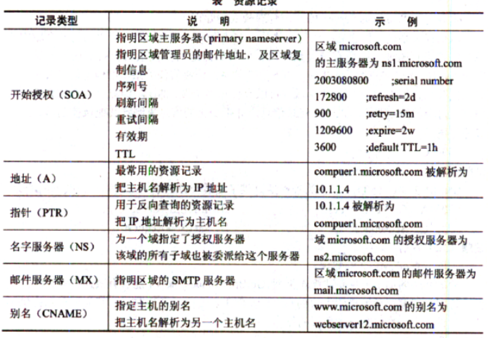

IPSec 有两种工作模式，分别是传输模式和隧道模式，工作在传输模式时，AH 或 ESP 被插入
到 IP 头和有效载荷之间：工作在隧道模式时，在 AH 或 ESP 前面会生成一个新的 IP 头。

路由器用于分割广播域。
路由器和交换机都可以用于分割冲突域。
集线器既不能隔绝冲突域，也不能隔绝广播域。
交换机可以隔绝冲突域，但不能隔绝广播域。
路由器既可以隔绝冲突域，也可以隔绝广播域。


MPLS（Multi-Protocol Label Switching，多协议标记交换）
简单邮件传输协议（SMTP）默认的端口号是TCP 25端口
不同VLAN之间通信需要依靠三层设备进行路由转发，因此可以选择路由器或者三层交换机。


用户视图
    系统视图
        接口视图  
            协议视图

sysname # 配置设备名称
```
<Huawei>system-view
Enter system view, return user view with Ctrl+Z.
[Huawei]sysname RTA
[RTA]
```

TFTP (Trivial File Transfer Protocol，简单文件传输协议) 是一种基于UDP 的传输文件的简单协议，端口号为69。

二进制指数后退算法在轻负载下可以有效地解决冲突问题，但不能提高网络的利用率。

对于金融业务系统来说，安全和高可用性是第一的。
对于企业网络建设来说，首先应该做企业应用分析，这是需求分析的一部分。

VLAN之间的数据传输需要通过网络层设备来实现。

1000BASE-LX
L——Long（长波），S——Short（短波），C——Copper（铜），T——twisted-pair（双绞线）。

更改端口号，不能防止嗅探和数据分析。

路由器不会转发私有地址的数据报。

新旧系统的更换有两个常见的策略：并行和分段。

RAS是远程访问服务的缩写

数据库容灾属于系统安全和应用安全考虑范畴。

在互联网中可以由源端指明到达目标的路由，这个功能是通过IP分组头中的选项实现的。所谓松散源路由是指传输的IP分组必须经过源端指定的路由器，但是也可能要经过源端没有指明的路由器；与此相反，所谓严格源路由则是指，传输的IP分组只能经过源端指定的路由器，而不能经过源端没有指定的路由器。

病毒文件名称一般分为三部分，第一部分表示病毒的类型，如Worm表示蠕虫病毒，Trojan表示特洛伊木马，Backdoor表示后门病毒，Macro表示宏病毒等。

IPv6中的链路本地地址是将主机网卡的MAC地址附加在链路本地地址前缀1111 1110 10之后形成的。链路本地地址用于同一链路相连的结点间通信。链路本地地址相当于IPv4中的自动专用IP地址（APIPA),可用于邻居发现，并且总是自动配置的，包含链路本地地址的分组不会被路由器转发。

光纤分为单模光纤和多模光纤。单模光纤（Single Mode Fiber)采用激光二极管作为光源，波长分为1310nm和1550mn两种。单模光纤的纤芯直径为8.3μm，包层外径为125μm,可表示为8.3/125μm。单模光纤色散很小，适用于远程通信。如果希望支持万兆传输，而且距离较远，应考虑采用单模光缆。
多模光纤（Multi Mode Fiber)采用发光二极管作为光源，波长分为850nm和1300nm两种。多模光纤的纤芯较粗，有50μm和62.5μm两种，包层外径125μm，分别表示为50/125μm和62.5/125μm。多模光纤可传多种模式的光，如果采用折射率突变的纤芯材料，则这种光纤称为多模突变型光纤；如果采用折射率渐变的纤芯材料，则这种光纤称为多 模渐变型光纤。多模光纤的色散较大，限制了传输信号的频率，而且随距离的增加这种限制会更加严重。所以多模光纤传输的距离比较近，一般只有几公里。但是多模光纤比 单模光纤价格便宜。对传输距离或数据速率要求不高的场合可以选择多模光缆。


PGP (Pretty Good Privacy)是 Philip R. Zimmermann 在1991年开发的电子邮件加密软件包。PGP已经成为使用最广泛的电子邮件加密软件。


在我国，审批专利遵循的基本原则是“先申请先得”原则，即对于同样的发明创造，谁先申请专利，专利权就授予谁。专利法第九条规定，两个以上的申请人分别就同样的发明创造申请专利的，专利权授予最先申请的。当有二者在同一时间就同样的发明创造提交了专利申请，专利局将分别向各申请人通报有关情况可以将两申请人作为一件申请的共同申请人,或其中一方放弃权利并从另一方得到适当的补尝,或两件申请都不授予专利权。但专利权的的授予只能给一个人。

设计阶段才确定软件的运行平台。

AMI（Alternate Mark Inversion，信号交替反转码）是双极性编码中最简单的一种，零电平代表二进制0，正负电平交替代表比特1。即如果第一个比特1由正电平表示，则第二个比特1由负电平表示，第三个比特1仍用正电平表示，如此类推。


近端串扰（Near End Cross Talk）：当电流在一条导线中流通时，会产生一定的电磁场，干扰相邻导线上的信号。近端串扰是指在与发送端处于同一边的接收端处所感应到的从发送线对感应过来的串扰信号。在串扰信号过大时，接收器将无法判别信号是远端传送来的微弱信号还是串扰杂讯。
衰减：指光在沿光纤传输过程中光功率的减少。可能由于长度过长、温度过高、连线点不好等问题，也可能是线缆端接触质量问题。
回波损耗：反射损耗又称为回波损耗，它是指在光纤连接处，后向反射光相对输入光的比率的分贝数，回波损耗愈大愈好，以减少反射光对光源和系统的影响。
传输延迟：是信号在发送方和接收方之间的线路上的传输时间，以及信号在传输过程中被中间节点的处理时间的加和。

通常情况下，信息插座的安装位置距离地面的高度为30～50cm。


在SNMPv1和SNMPv2中安全控制主要是通过识别应用实体的共同体名称，判断是否属于统一个管理域。而SNMPv3引入了基于用户的安全模型，来保证消息安全性。这种安全管理方式支持不同安全性。目前该安全模型定义了使用HMAC-MD5-96和HMAC-SHA-96作为可能的鉴别协议，使用CBC-DES作为保密协议。


一个子网内可以设置多台DHCP服务器。
　　客户机采用广播方式发送地址请求，不需预先知道DHCP服务器的地址。
　　客户机采用最先到达的DHCP服务器分配的IP地址。
　　DHCP服务器可以采用MAC地址绑定的方式保证某台计算机使用固定IP地址。

多形病毒又可称为自变体病毒，也就是说每次感染都会改变自己。

拥塞控制有很多办法，在TCP/IP协议体系中，ICMP协议采用的是“源抑制”方法，即当路由器或者主机因拥塞而丢掉数据报时，它就向数据报的源主机发送源抑制报文，抑制源主机发送数据报的速率。

IPsec是网络层安全协议。
　　PPTP（Point-to-Point Tunneling Protocol，点对点隧道协议）和L2TP（Layer 2 Tunneling Protocol，第二层隧道协议）是网络接口层安全协议。
　　TLS（Transport Layer Security Protocol，安全传输层协议）是传输层安全协议。

ADSL是一种宽带接入技术，这种技术使用的传输介质是电话线

/etc/gateways是路由表文件。

新交换机出厂时的预配置为VLAN1，VTP模式为服务器。

特洛伊木马，通过网络实现对计算机的远程攻击。

在Linux系统中，DHCP服务默认的配置文件为/etc/dhcpd.conf。

按照IEEE 802.Id协议，所有网桥可能处于下列5种状态之一：
•阻塞（blocking): MAC端口不参与帧转发，也不能学习接收帧的MAC地址，仅监听进入的BPDU。
•监听（listening):网桥能够识别根网桥，并且可以区分根端口、指定端口和非指定端口，但不能学习接收帧的地址。 '
•学习（learning): MAC端口能够学习接收帧的MAC地址，但还不能进行转发。
•转发（forwarding): MAC端口可以学习接收帧的源地址，并且可以根据目标地址将其转发到适当的端口。
•禁用（disabled): MAC端口不参与生成树算法。


主域名服务器（primary name server)负责维护这个区域的所有域名信息，是特定域所有信息的权威性信息源。当主域名服务器关闭、出现故障或负载过重时，辅域名服务器（secondary name server)作为备份服务器提供域名解析服务。辅助服务器从主域名服务器获得授权，并定期向主服务器询问是否有新数据，如果有则调入并更新域名解析数据，以达到与主域名服务器同步的目的。
缓存域名服务器（caching-only server)可运行域名服务器软件但是没有域名数据库。它从某个远程服务器取得每次域名服务器查询的回答，一旦取得一个答案，就将它放在高速缓存中，以后查询相同的信息时就予以回答。
转发域名服务器（forwarding server)负责所有非本地域名的本地查询。转发域名服务器接到查询请求时，在其缓存中查找，如找不到就把请求依次转发到指定的域名服务器，直到查询到结果为止，否则返回无法映射的结果。
用户可以通过中继代理使用外网段内DNS服务器进行域名解析，故选A。


DNS服务器中主要的资源记录有A (域名到IP地址的映射)、PTR (IP地址到域名的映射)、MX (邮件服务器及其优先级)、CNAME (别名）和 NS (区域的授权服务器）等类型。

100BASE-T4采用8B/6T的编码技术

域名查询记录：先本地DNS缓存，再HOSTS表，然后再查找本地DNS服务器，再根域名服务器，顶级域名服务器、权限域名服务器。

网络攻击有主动攻击和被动攻击两类。其中主动攻击是指通过一系列的方法，主动地向被攻击对象实施破坏的一种攻击方式，例如重放攻击、IP地址欺骗、拒绝服务攻击等均属于攻击者主动向攻击对象发起破坏性攻击的方式。流量分析攻击是通过持续检测现有网络中的流量变化或者变化趋势，而得到相应信息的一种被动攻击方式。

组策略A-G-DL-P中A表示用户账号，G表示全局组，DL表示域本地组，P表示资源访问权限（Permission〉。A-G-DL-P策略是将用户账号添加到全局组中，将全局组添加到另一个域的域本地组中,然后为域本地组分配本地资源的访问权限，这样来自其他域的用户就可以访问本地域中的资源了。


IPv6站点通过IPv4网络通信，最常用的3种自动隧道技术是6to4隧道、6over4隧道和ISATAP隧道。

拒绝服务主要是针对TCP连接进行攻击的，通过发送大量的建立连接请求，使得服务端穷于应付，无法提供正常的网络服务。暴力攻击是穷举式猜测用户密码。网络侦察是探测远端系统的漏洞，以便利用漏洞进行入侵。特洛伊木马是通过远端控制，对目标系统实施内部破坏或盗窃用户机密数据。

IDS部署在网络出口常用于监测外部网络攻击的数量和类型。
逻辑网络设计的任务包括搭建试验平台、进行网络仿真。

DNS服务器中的资源记录（Resource Record)分成不同类型，常用类型有（参见表2):
①SOA (Start Of Authoritative)：开始授权记录是区域文件的第一条记录，指明区域的主服务器，指明区域管理员的邮件地址，并给出区域复制的有关信息。例如序列号、刷新间隔、有效期和生命周期（TTL)等；
②A (Address)：地址记录表示主机名到IP地址的映射；
③PTR (Pointer)：指针记录是IP地址到主机名的映射；
④NS (Name Server)：名字服务器记录给出区域的授权服务器；
⑤MX (Mailexchanger)：邮件服务器记录定义了区域的邮件服务器及其优先级：
⑥CNAME：别名记录为正式主机名定义了一个别名（alias)。



任意播（AnyCast)地址是一组接口（可属于不同结点的）的标识符。发往任意播地址的分组被送给该地址标识的接口之一，通常是路由距离最近的接口。对IPv6任意播地址存在下列限制：
•任意播地址不能用作源地址，而只能作为目标地址；
•任意播地址不能指定给IPv6主机，只能指定给IPv6路由器。

IEEE802.3ad定义了链路聚合控制协议（Link Aggregation Control Protocol,LACP),
它的功能是将多个物理链路聚合成一个逻辑链路。链路汇聚技术可以将多个链路绑定在一起，形成一条高速链路，以达到更高的带宽，并实现链路备份和负载均衡。

在Linux系统中，DHCP服务由dhcpd提供，dhcpd的配置文件是/etc/dhcpd.conf，dhcpd 中用于保存客广端租约信息的文件是/var/lib/dhcp/dhcpd.leases。


广义地讲，任何连接两个以上电子元器件的导线都可以称为总线。通常可分为4类:
①芯片内总线。用于在集成电路芯片内部各部分的连接。
②元件级总线。用于一块电路板内各元器件的连接。
③内总线，又称系统总线。用于构成计算机各组成部分（CPU、内存和接口等）的连接。
④外总线，又称通信总线。用计算机与外设或计算机与计算机的连接或通信。
连接处理机的处理器、存储器及其他部件的总线属于内总线，按总线上所传送的内容分为数据总线、地址总线和控制总线。


挂载点必须是一个目录 
一个分区挂载在一个已存在的目录上，这个目录可以不为空，但挂载后这个目录下以前的内容将不可用。对于其他操作系统建立的文件系统的挂载也是这样。


A表示用户账号，G表示全局组，DL表示域本地组，P表示资源权限。


最大衰减限值和回波损耗限值双绞线和光纤都存在，波长窗口参数只用于光纤，近端 串扰仅用于双绞线。另外了解测试工具： 欧姆表、数字万用表及电缆测试器：利用这些参数可以检测电缆的物理连通性。测试并报告电缆 状况，其中包括近端串音、信号衰减及噪声。
时域反射计(TDR)  与光时域反射计 (OTDR):   前者能够快速定位金属线缆中的短路、断路、阻抗 等问题，后者可以精确测量光纤的长度、断裂位置、信号衰减等。

曼彻斯特编码中，码元速率(波特率)等于数据速率的2倍，即数据速率是码元速率的一半。

基带传输也叫数字传输，PCM会经过采样、量化和编码的过程，把模拟信号转换为数字 信号进行传输。


CSMA/CD 协议是介质访问子层协议。

分布式存储至少3个节点(3台服务器起步),数据副本至少是2副本， 一般建议3副本。 测试的时候， 一些厂商拉一台服务器过去也能搞3副本，但这是测试环境。实际部署一般3副本放到3台  服务器，其中2个副本放到同一个机架的2台不同服务器，第三副本放到另一个机架的服务器上。

卫星通信容易受到气候的影响，由于距离较远，误码率高。

广播和环回地址不能被路由器转发。

主流国产化操作系统有：鸿蒙HarmonyOS、深度Deepin 、统信UOS、红旗Linux 、中标麒麟NeoKylin。

核心层：数据的高速转发
汇聚层：广播域的定义、实施流量负载和路由相关策略、用户网关
接入层：MAC地址过滤、用户接入、安全控制


著作权即版权。

根据《中华人民共和国计算机软件保护条例》的规定，软件著作权人享有翻译权，即将原软件从一种自然语言文字转换成另一种自然语言文字的权利。未经软件著作权人许可，发表或者登记其软件的行为，构成计算机软件侵权。

标准复审（review of standard）是指已经发布实施的现有标准（包括已确认或修改补充的标准），经过实施一定时期后，对其内容再次审查，以确保其有效性、先进性和适用性的过程。1988年发布的《中华人民共和国标准化法实施条例》中规定，标准实施后的复审复审周期一般不超过5年。

任何财产要受到法律的保护都必须以经过国家法律的确认为前提。对于有形财产，只要是合法所得且能被民事主体所控制和掌握，具有一定的经济价值，便可构成民事主体财产的一部分，通常均受到法律的确认和保护，不需要再明确地加以规定。而无形的智力创造性成果则不同，它不像有形财产那样直观可见，因此智力创造性成果的财产权需要履行特定的法律手续或者需经国家主管机关依法审批，依法审查确认。
著作权法中规定：中国公民、法人或者其他组织的作品，不论是否发表，依照本法享有著作权。

ADSL通过不对称传输，利用FDM（Frequency Division Multiplex，频分多路复用）或EC（Echo Cancellation，回波抵消）技术使上、下行信道分开来减小串音的影响，从而实现信号的高速传送，最大传输距离可达5千米。

CHAP（Challenge Handshake Authentication Protocol，挑战握手认证协议）是一种加密的验证方式，CHAP对PAP进行了改进，不再直接通过链路发送明文口令，而是使用挑战口令以MD5哈希算法对口令进行加密，安全性比PAP高。

瀑布模型缺乏灵活性，无法通过开发活动来澄清本来不够明确的需求，只适用于需求明确或很少变更的项目。而喷泉模型是典型的面向对象生存周期模型，主要应用于描述面向对象的开发过程。

《中华人民共和国标准化法》是中华人民共和国的一项重要法律，《标准化法》规定了我国标准化工作的方针、政策、任务和标准化体制等。它是国家推行标准化，实施标准化管理和监督的重要依据。其主要内容是：确定了标准体系和标准化管理体制，规定了制定标准的对象与原则以及实施标准的要求，明确了违法行为的法律责任和处罚办法。

ATM能提供多种不同类型的通信服务（AAL1~AAL5），可以提供很高的QoS。

etc/rc.d/rc.inetd 为网络超级守护进程，/etc/rc.d/rc.inet1是其配置文件。

辅助域名服务器也是有数据库的。

软件风险一般包括不确定性和损失两个特性，其中不确定性是指风险可能发生，也可能不发生：损失是当风险确实发生时，会引起的不希望的后果和损失。救火和危机管理是对不适合但经常采用的软件风险管理策略。己知风险和未知风险是对软件风险进行分类的一种方式。员工和预算是在识别项目风险时需要识别的因素。

在我国，软件著作权采用“自动保护”原则。《计算机软件保护条例》第十四条规定：“软件著作权自软件开发完成之日起产生。”即软件著作权自软件开发完成之日起自动产生，不论整体还是局部，只要具备了软件的属性即产生软件著作权，既不要求履行任何形式的登记或注册手续，也无须在复制件上加注著作权标记，也不论其是否己经发 表都依法享有软件著作权。
—般来讲，一个软件只有开发完成并固定下来才能享有软件著作权。如果一个软件一直处于开发状态中，其最终的形态并没有固定下来，则法律无法对其进行保护。因此， 条例（法律）明确规定软件著作权自软件开发完成之日起产生。当然，现在的软件开发 经常是一项系统工程，一个软件可能会有很多模块，而每一个模块能够独立完成某一项功能。自该模块开发完成后就产生了著作权。所以说，自该软件开发完成后就产生了著作权。

软件许可一般有独占许可使用、独家许可使用和普通许可使用三种形式。独占许可使用，许可的是专有使用权，实施独占许可使用后，软件著作权人不得将软件使用权授予第三方，软件著作权人自己不能使用该软件；独家许可使用，许可的是专有使用权，实施独家许可使用后，软件著作权人不得将软件使用权授予第三方，软件著作权人自己可以使用该软件；普通许可使用，许可的是非专有使用权，实施普通许可使用后，软件著作权人可以将软件使用权授予第三方，软件著作权人自己可以使用该软件。

指令寄存器（IR)用于暂存从内存取出的、正在运行的指令，这是由系统使用的寄存器，程序员不能访问.
存储器数据寄存器（MDR)和存储器地址寄存器（MAR)用于对内存单元访问时的数据和地址暂存，也是由系统使用的，程序员不能访问。
程序计数器（PC)用于存储指令的地址，CPU根据该寄存器的内容从内存读取待执行的指令，程序员可以访问该寄存器。

IPSec安全体系结构包括AH、ESP和ISAKMP/Oakley等协议。IPSec认证头提供了数据完整性和数据源认证，但是不提供保密服务。AH包含了对称密钥的散列函数，使得第三方无法修改传输中的数据。IPSec封装安全负荷（ESP)提供了数据加密功能。ESP 利用对称密钥对IP数据（例如TCP包）进行加密。IPSec传送认证或加密的数据之前，必须就协议、加密算法和使用的密钥进行协商。密钥交换协议IKE提供这个功能，并且在密钥交换之前还要对远程系统进行初始的认证。IKE实际上是3个协议ISAKMP (Internet Security Association and Key Management Protocol)、Oakley 和SKEME( Versatile Secure Key Exchange Mechanism for Internet protocol)的混合体。

DHCP客户端收到DHCP服务器回应的ACK报文后，通过地址冲突检测发现服务器分配的地址冲突或者由于其他原因导致不能使用，则发送Decline报文，通知服务器所分配的IP地址不可用。具有就是通知DHCP服务器禁用这个IP地址以免引起IP地址冲突。然后客户端又开始新的DHCP过程。

目前根据我国法律法规的规定必须使用注册商标的是烟草类商品。

绘画、书法、雕塑等美术作品的原件可以买卖、赠与。但获得一件美术作品并不意味着获得该作品的著作权。我国著作权法规定：“美术等作品原件所有权的转移，不视为作品著作权的转移，但美术作品原件的展览权由原件所有人享有。”这就是说作品物转移的事实并不引起作品著作权的转移，受让人只是取得物的所有权和作品原件的展览权，作品的著作权仍然由作者享有。


计算机系统的存储器按所处的位置可分为内存和外存。按构成存储器的材料，可分为磁存储器、半导体存储器和光存储器。按存储器的工作方式可分为读写存储器和只读 存储器。按访问方式可分为按地址访问的存储器和按内容访问的存储器。按寻址方式可分为随机存储器、顺序存储器和直接存储器。
相联存储器是一种按内容访问的存储器。

一个编码系统中任意两个合法编码（码字）之间不同的二进数位数称为这两个码字的码距，而整个编码系统中任意两个码字的最小距离就是该编码系统的码距。为了使一个系统能检查和纠正一个差错，码间最小距离必须至少是3。
海明码是一种可以纠正一位差错的编码，是利用奇偶性来检错和纠错的校验方法。海明码的基本意思是给传输的数据增加r个校验位，从而增加两个合法消息（合法码字) 的不同位的个数（海明距离）。假设要传输的信息有m位，则经海明编码的码字就有n=m+r位。
循环冗余校验码（CRC)编码方法是在k位信息码后再拼接r位的校验码，形成长度为n位的编码，其特点是检错能力极强且开销小，易于用编码器及检测电路实现。
在数据通信与网络中，通常k相当大，由一千甚至数千数据位构成一帧，而后采用CRC码产生r位的校验位。它只能检测出错误，而不能纠正错误。一般取r=16,标准的16位生成多项式有 CRC-16=x16+x15+ x2+1 和CRC-CCITT=x16+ x12+ x5+1。一般情况下，r位生成多项式产生的CRC码可检测出所有的双错、奇数位错和突发长度小于等于r的突发错。用于纠错目的的循环码的译码算法比较复杂。


软件设计必须依据软件的需求来进行，结构化分析的结果为结构化设计提供了最基本的输入信息，其关系为：根据加工规格说明和控制规格说明进行过程设计；根据数据字典和实体关系图进行数据设计；根据数据流图进行接口设计；根据数据流图进行体系结构设计。

DSL接入方式分为虚拟拨号和准专线两种。采用虚拟拨号的用户需要安装PPPoE (PPP over Ethernet)或PPPoA (PPP over ATM)客户端软件，以及类似于Modem的拨号程序，输入用户名称和用户密码即可连接到宽带接入站点。采用准专线方式的用户使用电信部门静态或动态分配的IP地址，开机即可接入Internet。


路由器与广域网连接的端口称为WAN端口，路由器与局域网连接的端口称为LAN口。常见的网络端口有以下几种：
• RJ-45端口：这种端口通过双绞线连接以太网。10Base-T的RJ-45端口标识为 “ETH，而100Base-TX的RJ-45端口标识为“10/100bTX”。
• AUI端口：这种端口采用D型15针连接器，用在令牌环网或总线型以太网中。 路由器经AUI端口通过粗同轴电缆收发器连接10Base-5网络，也可以通过外接的AUI-to-RJ-45适配器连接10Base-T以太网。
•高速同步串口：在路由器与广域网的连接中，应用最多的是高速同步串行口 (Synchronous Serial Port),这种端口用于连接DDN、帧中继、X.25和PSTN等网络。所以默认的封装协议是HDLC。
• ISDN BRI端口：ISDN BRI端口通过ISDN线路实现路由器与Internet或其他M 络的远程连接。ISDN BRI端口采用RJ-45标准，与ISDN NT1的连接使用RJ-45-to-RJ-45 直通线。
•异步串口：异步串口 (ASYNC)主要应用于与Modem或Modem池的连接，以实现远程计算机通过PSTN拨号接入。异步端口的速率不是很高，也不要求同步传输。
• Console端口：Console端口通过专用电缆连接至计算机串行口，利用终端仿真程序对路由器进行本地配置。路由器的Console端口为RJ-45 口。
• AUX端口：对路由器进行远程配置时要使用“AUX”端口（Auxiliary Prot)。AUX 端口在外观上与RJ-45端口一样，只是内部电路不同，实现的功能也不一样。通过AUX端口与Modem进行连接必须借助RJ-45 to DB9或RJ-45 to DB25适配器进行转换。AUX端口支持硬件流控。

欢乐时光及熊猫烧香均为蠕虫病毒，CIH则为系统病毒，这3者均以感染台式机或服务器为主，且产生较早；X卧底则是新近产生的、通过木马形式传播、目标为智能手机的病毒。


PPP认证协议是可选的，分为两种。
口令验证协议（Password Authentication Protocol,PAP)提供了一种简单的两次握手认证方法，由终端发送用户标识和口令字，等待服务器的应答，如果认证不成功，则终止连接。这种方案采用明文方式发送密码，可能会被第三方窃取。
质询握手认证协议（Challenge Handshake Authentication Protocol,CHAP)采用三次握手方式周期地验证对方的身份。PPP链路建立后，认证服务器首先发送一个挑战报文(随机数），终端计算该报文的Hash值并把结果返回服务器，然后认证服务器把收到的Hash值与自己计算的Hash值进行比较，如果匹配，则认证通过，否则连接被终止。计算Hash值的过程有一个双方共享的密钥参与，而密钥是不通过网络传送的，所以CHAP是更安全的认证机制。在后续的通信过程中，每经过一个随机的间隔，这个认证过程都可能被重复，以缩短入侵者进行持续攻击的时间。

AP是组建小型无线局域网时最常用的设备。AP相当于一个连接有线网和无线网的桥梁，工作在数据链路层。其主要作用是将各个无线网络客户端连接到一起，然后将无线网络接入以太网。

程序运行时的用户内存空间一半划分为代码区、静态数据区、桟区和堆区，其中栈 区和堆区也称为动态数据区。全局变量的存储空间在静态数据区。

 DhcpOffer为DHCP服务器给客户机提供IP地址的相应报文；如果客户端拒绝服务器提供的IP地址，采用DhcpDecline

在Windows的预设情形下，Dhcpdiscover的等待时间预设为1秒，也就是当客户端将第一个Dhcpdiscover包送出去之后，在1秒之内没有得到回应的话，就会进行第二次Dhcpdiscover广播。若一直得不到回应的情况下，客户端一共会有4次Dhcpdiscover广播，除了第一次会等待1秒之外，其余三次的等待时间分别是9, 13, 16秒。如果都没有得到DHCP服务器的回应，客户端则会显示错误信息，宣告Dhcpdiscover的失败。之后，基于使用者的选择，系统会继续在5分钟之后再重复一次Dhcpdiscover的过程。

只要本地域名服务器无法解析的话，都要先求助于根域名服务器。

主干路由器是指至少有一个接口定义为属于主干区域的路由器。任何一个与主干区域互联的ABR或者ASBR也将成为主干路由器。
AS边界路由器是与AS外部的路由器互相交换路由信息的OSPF路由器。该路由器在AS内部通告其所得到的AS外部路由信息，这样AS内部的所有路由器都知道AS边界路由器的路由信息。

DRAM动态随机存取存储器，最为常见的系统内存。为了保持数据，DRAM必须周期性刷新。

HFC是将光缆敷设到小区，然后通过光电转换结点，利用有线电视CATV的总线式同轴电缆连接到用户，提供综合电信业务的技术。这种方式可以充分利用CATV原有的网络。

在IEEE 802.11标准中，为了使各种MAC操作互相配合，IEEE&nbsp;802.11推荐使用3种帧间隔(IFS)，以便提供基于优先级的访问控制。
DIFS(分布式协调IFS)：最长的IFS，优先级最低，用于异步帧竞争访问的时延。
PIFS(点协调IFS)：中等长度的IFS，优先级居中，在PCF操作中使用。
SIFS(短IFS)：最短的IFS，优先级最高，用于需要立即响应的操作。
DIFS用在CSMA/CA协议中，只要MAC层有数据要发送，就监听信道是否空闲。如果信道空闲，等待DIFS时段后开始发送；如果信道忙，就继续监听，直到可以发送为止。


以太网电接口可以工作在3种双工模式，以太网光接口只能工作在全双工模式。

传输层中，可以使用下面流量控制方式：缓存技术、源抑制报文、窗口机制

配置双出口链路有提高总带宽、提高可靠性、链路负载均衡作用。通过配置链路聚合来提高总带宽，通过配置策略路由来实现链路负载均衡。

4G标准的要求是能够提供基于IP的高速语音、数据和流式多媒体服务，支持的数据速率至少是100Mb/s，选定的多路复用技术是OFDM (正交频分多路复用）。


指令中的寻址方式就是如何对指令中的地址字段进行解释，以获得操作数的方法或获得程序转移地址的方法。
常用的寻址方式有：
•立即寻址。操作数就包含在指令屮。
•直接寻址。操作数存放在内存单元中，指令中直接给出操作数所在存储单元的地址。
•寄存器寻址。操作数存放在某一寄存器中，指令中给出存放操作数的寄存器名。 
•寄存器间接寻址。操作数存放在内存单元中，操作数所在存储单元的地址在某个寄存器中。
•间接寻址。指令中给出操作数地址的地址。
•相对寻址。指令地址码给出的是一个偏移量（可正可负），操作数地址等于本条指令的地址加上该偏移量。
•变址寻址。操作数地址等于变址寄存器的内容加偏移量。
题目给出的指令中，R1是寄存器，属于寄存器寻址方式，45是立即数，属于立即寻址方式。

WPA还采用了可以动态改变密钥的临时密钥完整性协议TK1P，以更频繁地变换密钥来降低安全风险。
